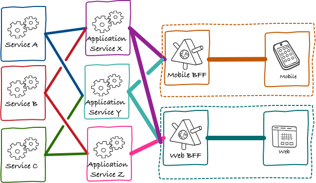

> 本文将详细介绍BFF（Backends For Frontends），包括以下内容：什么是BFF、BFF能干啥、使用BFF有啥好处、BFF的适用场景、BFF应该怎么划分、BFF性能考虑、BFF陷阱、BFF技术选型。若您决定使用Node.js实现BFF，也可以参考本文介绍的几种Node.js框架。文章的最后是一些参考文献及延伸阅读的资料。

## 一、什么是BFF
BFF（Backends For Frontends）是为前端服务的后端，是一种前端架构模式，是一种简化前端和后端之间的通信并使前端开发更简单的方法。

BFF 模式源于支持具有不同需求的多个用户界面的需要，特别是具有许多约束的移动界面。通用API已成为开发的瓶颈，无法始终轻松满足多用户界面的需求。因此，与其让每个端调用一个通用的API后端，不如让每个端都实现自己的API层，该层调用底层微服务。BFF 紧紧地专注于单个UI，分离关注点。

BFF 将由前端团队维护，从而使他们摆脱等待底层API更改以在UI上迭代的限制，同时还允许他们改进和构造 API 以满足其UI的特定需求。例如，移动端UI可能需要比PC端UI更少的数据，并且减少 API 调用的负载可以提高移动应用程序的性能。

BFF 不是应用程序使用的 API，BFF 是应用程序的一部分。如图：

BFF 模式通过增加系统复杂性来提高开发速度。

## 二、BFF的作用
1. 聚合数据

用于解决移动设备的限制。由于移动客户端的显示区域更小，并且也受到带宽的影响，所以后端返回所有数据并让每个客户端过滤掉不必要的数据不是一种好的选择，BFF层检测发出请求的移动端并过滤掉响应中的不相关数据。从每个所需的微服务中获取数据--->提取相关部分--->聚合--->最后以与特定端相关的格式返回。

2. 微服务与前端解耦

微服务数量众多，每一个都根据不同的端过滤数据显然是不可能的。前端的一些微调促使微服务通用API的改动，这样也是不合理的。BFF可以解除这种强耦合。

3. 编排数据

根据界面显示情况将数据进行编排，提供给前端，使前端页面只负责UI渲染和交互，不处理复杂的数据关系，从而提高前端代码的可读性和可维护性。

4. 拼接页面模版

当需要在服务器端生成大部分 Web UI 时（例如，根据配置生成html页面），BFF 显然是可以完成此操作的地方。还可以在BFF前面设置一个反向代理，这样可以在一定程度上简化缓存。

5. 移动端特殊webview处理

当某些webview对链接的跳转行为做了限制等其他特殊行为需要处理时，webview对于前端和后端都属于第三方，相关的处理逻辑放在前端或者后端都不合适，这种问题就可以由BFF来解决。

## 三、BFF的好处
1. 重复逻辑提取

当没有BFF时，通常“通用”逻辑最终会被嵌入到不同的客户端中。由于这些客户端使用非常不同的技术栈（Flutter、RN、Vue、React、Taro等），识别这种重复可能很困难。相较而言，拥有多个重复的BFF更容易发现和排除。

2. 自治

有的团队可能面临这样的情况，他们构建的用户界面正在调用另一个团队提供的API，而且API通常在迭代以满足其他团队的需求。 这种情况下BFF是非常有用的，特别是如果它由创建用户界面的团队所有，这样可以在迭代前端需求的同时，由自己的团队开发BFF的API。

3. 允许更快地发布新功能

前端和BFF完全自治的话，可以快速迭代两者。 虽然BFF本身仍然需要调用其他下游服务，但这可以在不中断用户界面开发的情况下完成。对于不需要底层服务改动的需求，可以由BFF处理数据，达到更快发布新功能的效果。

4. 降低人员协调成本

后端微服务和大前端BFF实现完善后，后期部分需求只需要前端人员开发即可。

5. 降低请求频率

BFF模式能够调整有效负载大小和降低请求频率，还可以提供单一资源服务器供前端调用。

6. 降低请求副作用

有了BFF及合理的缓存，前端应用程序不受下游服务中API更改的影响，比如通用API为了兼容其他场景的情况下，底层服务发布会影响不需要任何改动的前端应用的使用体验。

## 四、BFF的适用场景
BFF虽然流行，但不适用于所有场景。只有在满足一定的场景并且基础设施完善的情况下才能使用，否则只会增加项目维护成本和风险，而收益微乎其微。我认为适用的场景如下：

1. 后端有稳定的领域服务，需要聚合层的场景。

2. 需求变化频繁，接口也经常需要变化的场景。

后端有一套稳定的多项目领域服务，变更成本高，而BFF层针对单个项目，BFF层变更可以做到最小成本变化。

3. 完善的基础设施：日志、链接、服务器监控、性能监控等。

4. 希望针对特定客户端接口的要求来优化后端的场景。

以前端为中心的后端服务应该只包含特定于客户端的逻辑和行为。一般业务逻辑和其他全局特性应该在应用程序的其他地方进行管理。

## 五、BFF的划分
BFF应该怎么划分，或者说应该有多少个BFF？

1. 根据UI界面划分
- 一种模型是：每种不同类型的用户界面严格使用一个BFF。
- 另一种模型是：每种类型的用户界面使用一个 BFF。

"one experience, one BFF"。如果不同端的UI 非常相似，那么拥有一个BFF是合理的。但是，如果它们差异很大，那么拥有单独的BFF就更有意义了。

每个用户界面拥有一个BFF的问题之一是，最终可能会在BFF本身之间产生大量重复。例如，它们最终可能会执行相同类型的聚合，具有相同或相似的代码来与下游服务交互等。

当确实需要提取共享代码时，通常有两种选择。一种选择是，提取某种共享库。这可能存在的问题是，共享库导致的耦合，尤其是在调用下游服务时；另一种选择是，将聚合责任推到更下游的服务中。

使用共享BFF的客户端类型越多，它就越容易因处理多个问题而变得臃肿。注意，即使共享BFF，它也仅仅适用于同一类用户界面 。

2. 根据组织结构划分

如果BFF服务的前端由不同的团队维护，可以考虑不同的前端对应不同的BFF这种模型。可以将组织结构视为模型的边界，但是组织结构往往比我们的系统设计更灵活。

通常，减少BFF数量的驱动因素是，重用服务器端功能以避免过多的重复。

## 六、BFF的性能考虑
假如从客户端到单体的请求需要一个特定的时间 T。它通过互联网，T 可能很长。

不使用BFF，客户端需要依次调用每一个微服务，因此，对于顺序调用，时间变为 Σ(T1, T2, Ti, Tn)。由于这是不可接受的，客户端通常使用并行调用，时间变为 max(T1, T2, Ti, Tn)。注意，即使这样，客户端也需要执行 n 个请求。

使用BFF的情况下，我们在 T 时间内回到一个请求，无论实现是什么。与单体相比，从BFF到微服务还有额外的请求 t1、t2、ti、tn，但它们可能位于一起。因此，整体时间会比单体更长，但由于每个 t 都比 T 短得多，因此不会对用户体验产生太大影响。

## 七、BFF的陷阱
1. 不同BFF中重复逻辑的处理。

2. 不遵循良好的DevOps实践。更多的层意味着更多的可部署服务和更高的操作复杂性。

3. 无意中将BFF转换为完整的API服务器，其中包含业务逻辑、数据库、安全性等。应该保持BFF 的轻量级并专注于主要场景：针对不同端高效处理数据。

4. 没有认识到BFF是单点故障这一事实。BFF可能会与许多服务通信这一事实意味着任何下游服务中的故障都可能传播到BFF，可以考虑用冗余和异步来解决这些问题——就像处理其他类型的微服务一样。

## 八、BFF的技术选型
BFF与Node.js没有强绑定关系，但是让前端人员熟悉Node.js以外的后端语言学习成本太高，所以我们在技术栈上使用Node.js来实现BFF。下面列出一些常用的Node.js框架（有：Express、Koa、Egg、Nest、Sails、AdonisJS、restify、Ember、Hapi、Fastify、Tower(京东内部)），对使用过的做了一些优缺点总结(个人观点)。

1. [Express](https://expressjs.com/)
> Express is a minimal and flexible Node.js web application framework that provides a robust set of features for web and mobile applications.

优点：
- 对很多第三方插件的强力支持
- 简单而强大的根API
- 大力支持中间件模式

缺点：
- 缺乏标准化
- 回调地狱
- 异常捕获困难

2. [Koa](https://koajs.com/)
> By leveraging async functions, Koa allows you to ditch callbacks and greatly increase error-handling. Koa does not bundle any middleware within its core, and it provides an elegant suite of methods that make writing servers fast and enjoyable.

优点：
- 没有回调地狱（Koa1采用了Generator函数+yield语句+Promise语句；Koa2采用了async/await+Promise分别来处理异步操作）
- 模块化结构（比如，将body parser作为一个函数而不是一个中间件）

缺点：
- 社区相对较小

3. [Egg](https://www.eggjs.org/)
> Egg.js 为企业级框架和应用而生。Egg 的定位是框架的框架，在 Koa 的基础上提供了一套加载规范，从而延伸出插件和上层框架的概念，达到生态共建和差异化定制的平衡点，助力不同团队的架构师孵化出适合自身业务场景的上层框架。

由于我们使用egg实践的BFF，所以从客观性的角度考虑，其优点不予置评🤫

缺点：
- 配置的合并规则，根据优先级，对于相同的项，应用的配置会覆盖插件的配置，而有时想要的是同时保留的结果

4. [Nest](https://nestjs.com/)
> Nest is a framework for building efficient, scalable Node.js server-side applications. It uses progressive JavaScript, is built with TypeScript (preserves compatibility with pure JavaScript) and combines elements of OOP (Object Oriented Programming), FP (Functional Programming), and FRP (Functional Reactive Programming). Under the hood, Nest makes use of Express, but also, provides compatibility with a wide range of other libraries, like e.g. Fastify, allowing for easy use of the myriad third-party plugins which are available.

优点：
- 基于TypeScript开发
- 有一套用于生成代码的cli（比如nest g resource [name]、nest g controller [name]等）
- 模块化结构（内置了一个DI容器）

缺点：
- Nest.js 对于没有 Angular 背景的新手开发者来说可能有点难以学习和掌握。此外，由于并非每个 JavaScript 开发人员都使用 TypeScript，因此该框架对于这些开发人员来说也很困难。

5. [Sails](https://sailsjs.com/)
> Sails is the most popular MVC framework for Node.js, designed to emulate the familiar MVC pattern of frameworks like Ruby on Rails, but with support for the requirements of modern apps: data-driven APIs with a scalable, service-oriented architecture.

6. [AdonisJS](https://adonisjs.com/)
> AdonisJS is a fully featured web framework for Node.js. The framework is written in TypeScript, and includes everything you need to create a fully functional web app or an API server.

7. [restify](http://restify.com/)
> A Node.js web service framework optimized for building semantically correct RESTful web services ready for production use at scale. restify optimizes for introspection and performance, and is used in some of the largest Node.js deployments on Earth.

8. [Ember](https://emberjs.com/)
> Ember.js is a productive, battle-tested JavaScript framework for building modern web applications. It includes everything you need to build rich UIs that work on any device.

9. [Hapi](https://hapi.dev/)
> Buildpowerful,scalable applications, withminimal overheadand fullout-of-the-boxfunctionality.

10. [Fastify](https://www.fastify.io/)
> Fastify is a web framework highly focused on providing the best developer experience with the least overhead and a powerful plugin architecture, inspired by Hapi and Express.

如果您也使用Node.js的框架来搭建项目，可以考虑以下几个方面来挑选适合自己的：
- 易于安装和使用，有活跃社区的支持
- 学习成本
- 健全的文档
- 易于创建扩展
- 避免使用复杂且难以理解的框架
- 易于调试及测试
- 性能等

不管选择哪个框架，尽量不要沉迷于框架，而忽略了Node.js本身的能力。

## 附、参考及延伸
- [Pattern: Backends For Frontends（Single-purpose Edge Services for UIs and external parties）](https://samnewman.io/patterns/architectural/bff/)
- [The Back-end for Front-end Pattern (BFF)](https://philcalcado.com/2015/09/18/the_back_end_for_front_end_pattern_bff.html)
- [Discussing Backend For Front-end](https://dev.to/apisix/discussing-backend-for-front-end-192a)
- [Frontend Architectural Patterns: Backends-For-Frontends](https://medium.com/frontend-at-scale/frontend-architectural-patterns-backend-for-frontend-29679aba886c)
- [Introduction to BFF and NestJS](https://dev.to/qiuzhi99/introduction-to-bff-and-nestjs-13mo)
- [Learn To Love Your Jamstack BFF](https://dev.to/remotesynth/learn-to-love-your-jamstack-bff-4ej3)
- [What Is Nest.js? A Look at the Lightweight JavaScript Framework](https://kinsta.com/knowledgebase/nestjs/#pros-and-cons-of-nestjs)
- [How To Choose The Right Framework For Your Next Node.js App](https://dev.to/osam1010/how-to-choose-the-right-framework-for-your-next-nodejs-app-2c1e)
- [Node.js主流Web框架对比](https://cloud.tencent.com/developer/news/434092)
