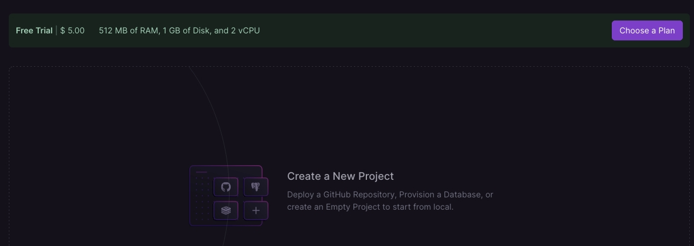

Railway 是一个现代化的云平台，旨在简化应用程序的部署和管理。它提供了一个直观的用户界面和强大的功能，使开发者能够轻松地将应用程序从本地环境部署到云端。Railway 提供了多语言支持、内置数据库、环境变量管理、日志和监控等功能，使得开发和运维变得更加高效和便捷。以下是关于 Railway 的一些关键点和示例。

### [免费试用](https://docs.railway.app/reference/pricing/free-trial)
新用户使用github账号登录`https://railway.app/`，Railway会对你的github账号进行评估，评估通过则可以免费试用，试用版提供基本功能（比如可以部署代码以及部署数据库），并包含 5 美元的一次性补助。


### 主要特性

1. **简化部署**：通过简单的配置和命令，快速将应用程序部署到云端。
2. **自动化**：支持自动化构建、部署和扩展，减少手动操作。
3. **多语言支持**：支持多种编程语言和框架，如 Node.js、Python、Ruby、Go 等。
4. **集成数据库**：提供内置的数据库支持，如 PostgreSQL、MySQL、Redis 等。
5. **环境变量管理**：方便地管理和配置环境变量。
6. **日志和监控**：提供实时日志和监控功能，帮助开发者快速排查问题。

### 安装和配置

#### 1. 注册和登录

首先，访问 [Railway](https://railway.app/) 网站，注册一个账户并登录。

#### 2. 安装 Railway CLI

Railway 提供了一个命令行工具（CLI），用于管理项目和部署应用程序。可以通过 npm 安装 Railway CLI：

```sh
npm install -g railway
```

#### 3. 初始化项目

在本地项目目录中，使用以下命令初始化 Railway 项目：

```sh
railway init
```

### 部署应用程序

以下是一个简单的示例，展示如何使用 Railway 部署一个 Node.js 应用程序。

#### 1. 创建 Node.js 应用程序

首先，创建一个简单的 Node.js 应用程序：

```javascript
// app.js
const express = require('express');
const app = express();

app.get('/', (req, res) => {
    res.send('Hello, Railway!');
});

const port = process.env.PORT || 3000;
app.listen(port, () => {
    console.log(`Server is running on port ${port}`);
});
```

#### 2. 创建 `package.json`

创建一个 `package.json` 文件，定义项目依赖：

```json
{
  "name": "railway-demo",
  "version": "1.0.0",
  "main": "app.js",
  "scripts": {
    "start": "node app.js"
  },
  "dependencies": {
    "express": "^4.17.1"
  }
}
```

#### 3. 部署到 Railway

使用以下命令将应用程序部署到 Railway：

```sh
railway up
```

Railway CLI 将自动检测项目配置，构建应用程序，并将其部署到云端。

### 管理数据库

Railway 提供了内置的数据库支持，可以轻松地为项目添加数据库。

#### 1. 添加数据库

在 Railway 控制面板中，选择项目并添加一个数据库（如 PostgreSQL）。

#### 2. 配置环境变量

Railway 将自动生成数据库连接字符串，并将其添加到项目的环境变量中。可以在项目的 `.env` 文件中使用这些环境变量：

```env
DATABASE_URL=your_database_connection_string
```

#### 3. 使用数据库

在应用程序中，可以使用环境变量连接到数据库。例如，使用 `pg` 库连接到 PostgreSQL 数据库：

```javascript
const { Client } = require('pg');
const client = new Client({
    connectionString: process.env.DATABASE_URL,
    ssl: {
        rejectUnauthorized: false
    }
});

client.connect();

client.query('SELECT NOW()', (err, res) => {
    if (err) throw err;
    console.log(res.rows);
    client.end();
});
```

### 日志和监控

Railway 提供了实时日志和监控功能，可以在控制面板中查看应用程序的日志和性能指标，帮助开发者快速排查问题。
