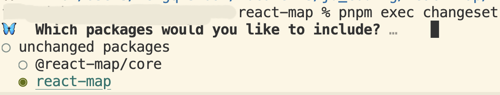
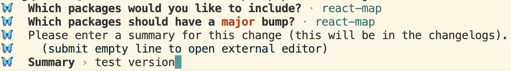
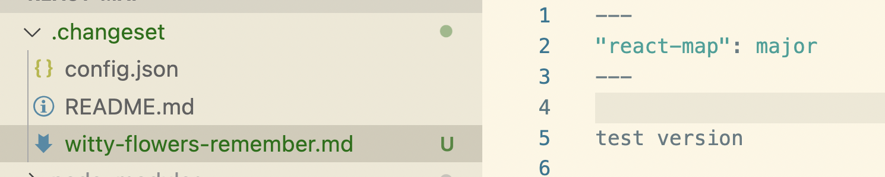

## 搭建项目
1. `npm init -y` 生成`package.json`，删除其中的`"main": "index.js"`，设置`"name": "react-map-repository"`避免和子包name冲突，设置` "packageManager": "pnpm@9.0.6"`避免使用turbo时报错`missing packageManager field in package.json`
2. 创建`pnpm-workspace.yaml`
   ```yaml title="pnpm-workspace.yaml"
   packages:
     - 'packages/*'
   ```
3. 创建`packages`目录，创建`packages/react-map`目录，创建`packages/core`目录
4. `pnpm add -D typescript -w`
5. 创建`tsconfig.json`、`tsconfig.build.json`
   ```json title="tsconfig.json"
   {
     "extends": "./tsconfig.build.json",
     "compilerOptions": {
       "baseUrl": "./packages",
       "paths": {
         "@react-map/core": ["core/src"],
         "react-map": ["react-map/src"]
       }
     }
   }
   ```
   ```json title="tsconfig.build.json"
   {
     "compilerOptions": {
       "allowSyntheticDefaultImports": true,
       "declaration": true,
       "esModuleInterop": true,
       "jsx": "react",
       "lib": ["dom", "es2020"],
       "moduleResolution": "node",
       "strict": true,
       "target": "es2020"
     },
     "include": ["./src/**/*"]
   }
   ```
6. `pnpm add -D react react-dom -w`
7. `pnpm add -D leaflet @types/leaflet -w`
8. `pnpm add -D turbo -w`
9.  创建`turbo.json`
   ```json title="turbo.json"
   {
     "tasks": {
       "build:clean": {},
       "build:js": {}
     }
   }
   ```
   注意使用`tasks`而不是`pipeline`
   ```note
     × found `pipeline` field instead of `tasks`
       ╭─[turbo.json:1:1]
     1 │     {
     2 │ ╭─▶   "pipeline": {
     3 │ │       "build:clean": {},
     4 │ │       "build:js": {}
     5 │ ├─▶   }
       · ╰──── rename `pipeline` field to `tasks`
     6 │     }
       ╰────
      help: changed in 2.0: `pipeline` has been renamed to `tasks`
   ```
10. `pnpm add -D @swc/cli @swc/core -w`
11. 创建`.swcrc`
    ```json title=".swcrc"
    {
      "$schema": "https://swc.rs/schema.json",
      "jsc": {
        "parser": {
          "syntax": "typescript",
          "tsx": true
        },
        "target": "es2020"
      }
    }
    ```
12. `pnpm add --save-dev @biomejs/biome -w`
13. 创建`biome.json`
    ```json title="biome.json"
    {
    	"$schema": "https://biomejs.dev/schemas/1.7.1/schema.json",
    	"organizeImports": {
    		"enabled": true
    	},
    	"formatter": {
        "enabled": true,
        "formatWithErrors": false,
        "ignore": [],
        "attributePosition": "auto",
        "indentStyle": "space",
        "indentWidth": 2,
        "lineWidth": 80
    	},
    	"javascript": {
        "formatter": {
          "arrowParentheses": "always",
          "bracketSameLine": true,
          "bracketSpacing": true,
          "jsxQuoteStyle": "double",
          "quoteProperties": "asNeeded",
    			"quoteStyle": "single",
          "semicolons": "asNeeded",
          "trailingComma": "all"
        }
      },
    	"linter": {
    		"enabled": true,
    		"ignore": ["lib/**", "__tests__/**"],
    		"rules": {
    			"recommended": true
    		}
    	}
    }
    ```
14. 创建`.gitignore`
    ```bash
    node_modules
    .turbo
    ```
15. 创建`README.md`
16. `pnpm add -D del-cli -w`
17. `pnpm add -D cross-env -w`
18. 更新项目根目录`package.json`的`scripts`
    ```json title="package.json"
    "scripts": {
      "lint": "biome check --apply ./packages",
      "test": "jest",
      "build": "turbo run build:clean && pnpm run -r build:types && turbo run build:js"
    },
    ```
19. `cd packages/core/`然后`npm init -y` 生成`package.json`，设置`name` `main` `types` `exports` `files` `sideEffects`
    ```json title="packages/core/package.json"
    {
      "name": "@react-map/core",
      "main": "lib/index.js",
      "types": "lib/index.d.ts",
      "exports": {
        ".": "./lib/index.js"
      },
      "files": ["lib/*"],
      "sideEffects": false,
    }
    ```
20. 在`packages/core/`中安装依赖：`pnpm add -D @types/react @types/react-dom`
21. 手动设置`peerDependencies`
    ```json title="packages/core/package.json"
    "peerDependencies": {
      "leaflet": "^1.9.0",
      "react": "^18.0.0",
      "react-dom": "^18.0.0"
    },
    ```
22. 创建`packages/core/tsconfig.json`
    ```json title="packages/core/tsconfig.json"
    {
      "extends": "../../tsconfig.build.json",
      "compilerOptions": {
        "outDir": "./lib"
      },
      "include": ["./src/**/*"]
    }
    ```
23. 创建`packages/core/src`、`packages/core/src/index.ts`、`packages/core/README.md`、`packages/core/.gitignore`
    ```bash title="packages/core/.gitignore"
    /coverage
    /lib
    ```
24. 更新`packages/core/package.json`的`scripts`
    ```json title="packages/core/package.json"
    "scripts": {
      "build:clean": "del lib",
      "build:js": "swc src -d ./lib --config-file  ../../.swcrc --strip-leading-paths",
      "build:types": "tsc --emitDeclarationOnly",
      "build": "pnpm run build:clean && pnpm run build:types && pnpm run build:js",
      "test:types": "tsc --noEmit",
      "test:unit": "cross-env NODE_ENV=test jest",
      "test": "pnpm run test:types && pnpm run test:unit",
      "start": "pnpm run test && pnpm run build",
      "prepare": "pnpm run build"
    },
    ```
25. `cd ../react-map/`然后`npm init -y` 生成`package.json`，设置`main` `types` `exports` `files` `sideEffects`
    ```json title="packages/react-map/package.json"
    {
      "main": "lib/index.js",
      "types": "lib/index.d.ts",
      "exports": {
        ".": "./lib/index.js",
        "./*": "./lib/*.js"
      },
      "files": ["lib/*"],
      "sideEffects": false,
    }
    ```
26. 创建`packages/react-map/tsconfig.json`
    ```json title="packages/react-map/tsconfig.json"
    {
      "extends": "../../tsconfig.build.json",
      "compilerOptions": {
        "outDir": "./lib"
      },
      "include": ["./src/**/*"]
    }
    ```
27. 在`packages/react-map/`中安装依赖：`pnpm add -D @types/leaflet @types/react @types/react-dom`; `pnpm add @react-map/core`
    ```json title="packages/react-map/package.json"
    {
      "dependencies": {
        "@react-map/core": "workspace:^"
      }
    }
    ```
28. 手动设置`peerDependencies`
    ```json title="packages/react-map/package.json"
    {
      "peerDependencies": {
        "leaflet": "^1.9.0",
        "react": "^18.0.0",
        "react-dom": "^18.0.0"
      },
    }
    ```
29. 创建`packages/react-map/src`、`packages/react-map/src/index.ts`、`packages/react-map/README.md`、`packages/react-map/.gitignore`
    ```bash title="packages/react-map/.gitignore"
    /coverage
    /lib
    ```
30. 更新`packages/react-map/package.json`的`scripts`
    ```json title="packages/react-map/package.json"
    {
      "scripts": {
        "build:clean": "del lib",
        "build:js": "swc src -d ./lib --config-file ../../.swcrc --strip-leading-paths",
        "build:types": "tsc --emitDeclarationOnly",
        "build": "pnpm run build:clean && pnpm run build:types && pnpm run build:js",
        "test:types": "tsc --noEmit",
        "test:unit": "cross-env NODE_ENV=test jest",
        "test": "pnpm run test:types && pnpm run test:unit",
        "start": "pnpm run test && pnpm run build",
        "prepare": "pnpm run build"
      },
    }
    ```

## 版本管理
使用[Changesets](https://github.com/changesets/changesets/blob/main/docs/intro-to-using-changesets.md):
1. 在项目根目录下安装依赖：`pnpm add -D @changesets/cli -w`
2. 初始化 Changesets 配置: `pnpm [exec] changeset init`，这将创建一个 `.changeset` 目录和配置文件`.changeset/config.json`。
  ```json title=".changeset/config.json"
  {
    "$schema": "https://unpkg.com/@changesets/config@3.0.0/schema.json",
    "changelog": "@changesets/cli/changelog", // changelog 生成方式
    "commit": false, // 不要让 changeset 在 publish 的时候帮我们做 git add
    "fixed": [],
    "linked": [], // 配置哪些包要共享版本
    "access": "restricted", // 公私有安全设定，内网建议 restricted ，开源使用 public
    "baseBranch": "main", // 项目主分支
    "updateInternalDependencies": "patch", // 确保某包依赖的包发生 upgrade，该包也要发生 version upgrade 的衡量单位（量级）
    "ignore": [] // 不需要变动 version 的包
  }
  ```
3. 添加变更文件：`pnpm [exec] changeset`（注意：该命令生效的前提是远程存在配置文件中指定的`baseBranch`分支，默认为`main`）
  
  
  
  成功执行该命令后，会在`.changeset`目录生成一个变更文件:
  

4. 当你准备好发布时，执行 `pnpm [exec] changeset version` 命令来应用变更文件中的更改，并更新包的版本号。成功执行该命令后，将更新 `package.json`文件中的`version`，并且生成 `CHANGELOG.md` 文件，以记录这些更改的详细信息。同时，相应的变更文件被消耗，即会被自动删除。
5. 执行 `pnpm [exec] changeset publish` 命令来发布更新的包到 npm。成功执行该命令后，将自动根据更新的版本号发布包，并将变更文件移动到 `.changeset/README.md` 中。
6. 将命令集成到项目根目录`package.json`的`scripts`中:
   ```json title="package.json"
   {
     "scripts": {
       // Include build, lint, test - all the things you need to run
       // before publishing
       "publish-packages": "turbo run build lint test && changeset version && changeset publish"
     }
   }
   ```

不知道为啥执行`pnpm [exec] changeset`时，没有选择semver bump type的引导，默认是`major`
```note
🦋  Which semver bump type should this change have? …
❯◯ patch
 ◯ minor
 ◯ major
```
可以在生成的变更文件中手动修改semver bump type

## 本地测试npm包
1. `cd packages/`然后执行`pnpm create vite`创建一个react项目
   ```note
   ✔ Project name: demo
   ✔ Select a framework: › React
   ✔ Select a variant: › TypeScript
   ```
2. `cd packages/demo`安装依赖：`pnpm add react-map`
   ```json title="packages/demo/package.json"
   {
    "dependencies": {
      // ...
      "react-map": "workspace:^"
     },
   }
   ```

## 开发组件
### 泛型类型参数默认值
在 TypeScript 中，`Props extends MapContainerProps = MapContainerProps` 这种语法用于定义泛型类型参数的默认值。
- `Props`：这是一个泛型类型参数的名称。
- `extends MapContainerProps`：这表示 `Props` 必须是 `MapContainerProps` 或其子类型。
- `= MapContainerProps`：这表示如果在使用这个泛型时没有显式地提供 `Props` 类型参数，那么 `Props` 的默认类型将是 `MapContainerProps`。

### 组件库的依赖
组件的依赖使用`peerDependencies`和`dependencies`和`devDependencies`:
- `dependencies` 用于依赖的自开发组件库
- `peerDependencies` 用于依赖的基本库和插件，从 npm v7 开始会自动安装`peerDependencies`指定的包（pnpm也会自动安装`peerDependencies`指定的包）
- `devDependencies` 用于依赖的类型声明
```json
{
  "devDependencies": {
    "@types/leaflet": "^1.9.12",
    "@types/react": "^18.3.3",
    "@types/react-dom": "^18.3.0"
  },
  "peerDependencies": {
    "@geoman-io/leaflet-geoman-free": "^2.16.0",
    "leaflet": "^1.9.0",
    "react": "^18.0.0",
    "react-dom": "^18.0.0"
  },
  "dependencies": {
    "react-map-core": "^1.0.0"
  },
}
```

### 遇到的问题
1. 在 Monorepo 项目中，开发的两个包都需要发布，并且这两个包有依赖关系，这个时候使用`pnpm changeset publish`发布两个包时发生了报错：`Cannot find module 'react-map-core' or its corresponding type declarations.` 有依赖关系的包是不是需要分开发布(按依赖关系先后发布)?

2. 当在执行 `pnpm changeset publish` 或其他 npm 发布命令时，遇到提示 `This operation requires a one-time password from your authenticator`，这意味着你的 npm 账户启用了双因素认证（2FA）。在这种情况下，你需要提供一次性密码（OTP）才能完成发布操作。如果是发布内部包，则需要设置`publishConfig`，避免发布到外部npm上。

3. 测试npm包的项目启动时报错：`UnhandledPromiseRejectionWarning: SyntaxError: Unexpected token '??='`，这个错误通常是由于你的 JavaScript 环境（如 Node.js 或浏览器）不支持新的语法特性。`??=` 是一个新的逻辑赋值运算符（Nullish Coalescing Assignment），它在较新的 ECMAScript 版本中引入。更换node版本到16即可。

4. `Argument of type '(e: DrawEvent) => void' is not assignable to parameter of type 'LeafletEventHandlerFn'.` 使用类型断言`as unknown as LeafletEventHandlerFn`解决，如：`map.on('draw:created', handleDrawEvent as unknown as LeafletEventHandlerFn);`

5. 使用 `pnpm -F` 过滤项目执行命令时报错：`No projects matched the filters`。假如项目结构如下：
   ```note
   my-monorepo/
   ├── package.json
   ├── pnpm-workspace.yaml
   ├── packages/
   │   ├── package-a/
   │   │   ├── package.json
   │   │   └── index.js
   │   └── package-b/
   │       ├── package.json
   │       └── index.js
   ```
   ```yaml title="pnpm-workspace.yaml"
   packages:
     - 'packages/*'
   ```
   执行`pnpm -F package-a build`报错：`No projects matched the filters`，这是因为`package-a`的`package.json`的`name`不是`package-a`，如下情况应该执行`pnpm -F a build`。如果`package-a`的`package.json`的`name`是`@example/a`，则还是执行`pnpm -F a build`
   ```json title="package-a/package.json"
   {
     "name": "a",
     "version": "1.0.0",
     "scripts": {
       "build": "echo Building package-a"
     }
   }
   ```

6. 在 TypeScript 中，接口（interface）只能扩展对象类型或具有静态已知成员的对象类型的交集。
   
   在 TypeScript 中，接口（interface）只能扩展对象类型或具有静态已知成员的对象类型的交集。如果你尝试扩展一个不符合这些条件的类型，就会遇到类似 `An interface can only extend an object type or intersection of object types with statically known members` 的错误。

   确保你扩展的类型是一个对象类型或对象类型的交集。以下是一些常见的解决方法：
   ```ts
   // 确保你扩展的类型是一个对象类型
   interface Person {
     name: string;
     age: number;
   }

   interface Employee extends Person {
     employeeId: number;
   }
   ```
   ```ts
   // 如果你需要扩展多个类型，可以使用类型别名和交叉类型
   type Person = {
     name: string;
     age: number;
   };

   type Contact = {
     email: string;
     phone: string;
   };

   interface Employee extends Person, Contact {
     employeeId: number;
   }
   ```

   确保你扩展的类型是静态已知的，而不是动态生成的。例如，不要扩展一个泛型类型参数，除非它被约束为一个对象类型。
   ```ts
   // 扩展对象类型
   interface Person {
     name: string;
     age: number;
   }

   interface Employee extends Person {
     employeeId: number;
   }

   const employee: Employee = {
     name: "John Doe",
     age: 30,
     employeeId: 1234
   };
   ```
   ```ts
   // 使用类型别名和交叉类型
   type Person = {
     name: string;
     age: number;
   };

   type Contact = {
     email: string;
     phone: string;
   };

   interface Employee extends Person, Contact {
     employeeId: number;
   }

   const employee: Employee = {
     name: "John Doe",
     age: 30,
     email: "john.doe@example.com",
     phone: "123-456-7890",
     employeeId: 1234
   };
   ```
   如果你需要扩展一个泛型类型参数，确保它被约束为一个对象类型：
   ```ts
   interface Person {
     name: string;
     age: number;
   }

   interface Employee<T extends Person> {
     employeeId: number;
     details: T;
   }

   const employee: Employee<Person> = {
     employeeId: 1234,
     details: {
       name: "John Doe",
       age: 30
     }
   };
   ```
   以下是一些会导致错误的示例：
   ```ts
   // 错误：不能扩展非对象类型
   interface Employee extends string {
     employeeId: number;
   }
   ```
   ```ts
   // 错误：不能扩展动态生成的类型
   function createType<T>() {
     return class {
       value: T;
     };
   }

   interface Employee extends createType<number> {
     employeeId: number;
   }
   ```

## 发布包
在 Monorepo 项目中，使用 `workspace:` 协议来管理依赖关系是一种常见的做法，特别是在使用 Yarn Workspaces 或 pnpm Workspaces 时。`workspace:` 协议允许你在 Monorepo 项目中引用其他工作区包，而不需要发布它们到 npm registry。

Changesets 在生成版本时会自动处理 `workspace:` 协议，将其替换为实际的版本号。以下是 Changesets 的工作原理：
1. 创建变更集：当你运行 `pnpm changeset` 时，Changesets 会引导你创建一个变更集文件，记录需要发布的包和版本号。
2. 生成版本：当你运行 `pnpm changeset version` 时，Changesets 会根据变更集文件生成新的版本号，并自动将 `workspace:` 协议替换为实际的版本号。
3. 发布包：当你运行 `pnpm changeset publish` 时，Changesets 会将新版本发布到 npm registry。

:::tip
1. 在每个要发布的包的 `package.json` 文件中，配置 `publishConfig` 字段以指定发布时使用的 npm registry。
```json title="package.json"
{
  "publishConfig": {
    "registry": "https://your-internal-registry.com/"
  },
}
```

2. 执行`pnpm changeset publish`前，先登录npm registry: `npm login`
3. 执行`pnpm publish`发布包的话也能自动将 `workspace:` 协议替换为实际的版本号。
:::
