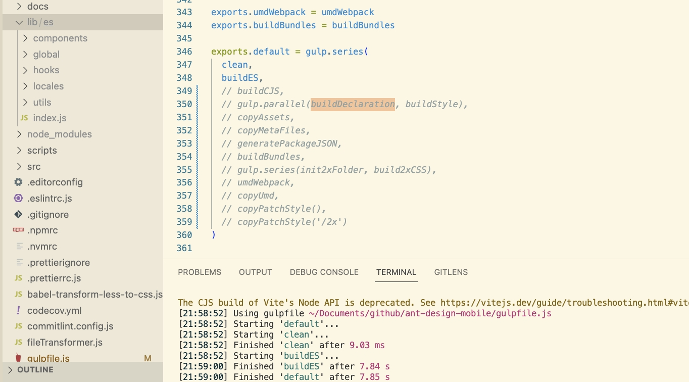
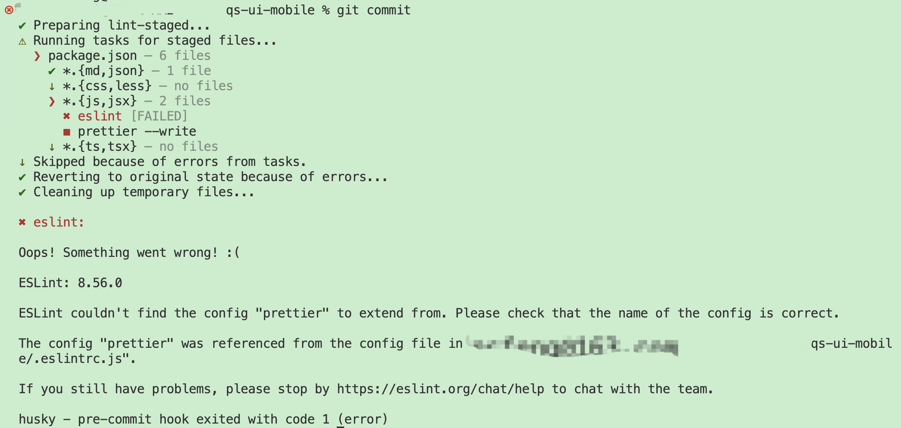
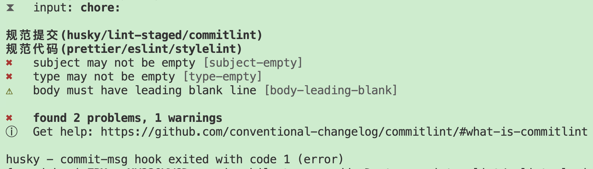
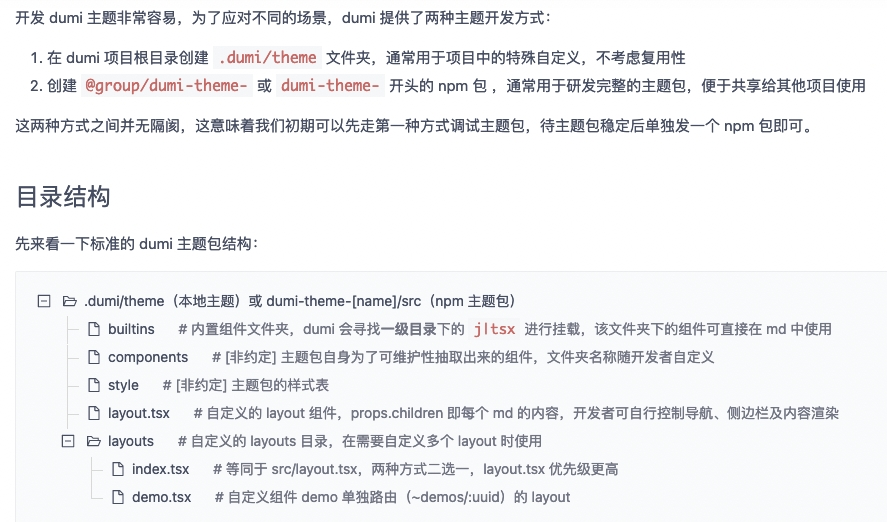

:::info
前置知识：
- [Scripts vs. CommonJS vs. UMD vs. AMD vs. ES6 Modules](https://www.zachgollwitzer.com/posts/scripts-commonjs-umd-amd-es6-modules)
:::

## 移动端组件库
借鉴[ant-design-mobile](https://github.com/ant-design/ant-design-mobile)使用gulp开发移动端组件库，使用[dumi](https://github.com/umijs/dumi)生成组件库文档，使用[uView](https://github.com/umicro/uView2.0)的色彩，并参考其组件样式
:::info
本地调试ant-design-mobile：
- node版本切到16.16.0
- nnrm 切到 taobao
- 执行 `pnpm i`
- 更改`gulpfile.js`并执行`pnpm build`，查看每一步task的产出


ant-design-mobile中的patch CSS 是针对浏览器不支持 CSS 变量的替代方案，比如`button.patch.less`是将`button.less`中的CSS 变量转换为不使用CSS 变量。
:::

### 复用`ant-design-mobile`的`gulpfile.js`
执行`pnpm build`报错：
- `Cannot find module 'node:path'` 查看node版本发现是14.14.0，使用`nvm use 16.16.0`后解决

- `Cannot find module @rollup/rollup-darwin-arm64.` 解决：删掉`pnpm-lock.yaml`重新执行`pnpm install`

- `Cannot find module './Foo'. Did you mean to set the 'moduleResolution' option to 'nodenext', or to add aliases to the 'paths' option?` 解决：`tsconfig.json`中设置`"moduleResolution": "node"`

- `SyntaxError in plugin "gulp-babel" index.d.ts: Unexpected token, expected ","` 解决：`tsconfig.json`中设置`"declaration": false`
  
- `Error in plugin "webpack-stream" Module not found: Error: Can't resolve 'babel-loader'` 解决：`pnpm add -D babel-loader` 
  
- `Error in plugin "webpack-stream" Module not found: Error: Cannot find package '@babel/preset-env'` 解决：`pnpm add -D @babel/preset-env`
   `pnpm add -D @babel/core`

- `Error in plugin "webpack-stream" Module not found: Error: Cannot find package '@babel/preset-typescript'` 解决：`pnpm add -D @babel/preset-typescript`

- `Error in plugin "webpack-stream" Module not found: Error: Cannot find package '@babel/preset-react'` 解决：`pnpm add -D @babel/preset-react`

### 使用的依赖包
#### 删除文件
- [rimraf](https://github.com/isaacs/rimraf)

- [del](https://github.com/sindresorhus/del)

#### [through2](https://github.com/rvagg/through2)
[每天一个npm包：through2](https://zhuanlan.zhihu.com/p/365329097)

对Node.js Streams.Transform (Streams2/3) 的封装，提供了更为易用的objectMode模式。

#### [`@babel/plugin-transform-modules-commonjs`](https://babeljs.io/docs/babel-plugin-transform-modules-commonjs)
该插件将 ECMAScript 模块转换为 CommonJS。请注意，只有导入/导出语句 (如`import "./mod.js"`) 和导入表达式 (如`import('./mod.js')`) 的语法被转换

ES Module
```js
export default 42;
```
转为CommonJS
```js
Object.defineProperty(exports, "__esModule", {
  value: true,
});

exports.default = 42;
```

#### [`postcss-px-multiple`](https://github.com/torrac12/postcss-px-multiple-plugin)
一个 postcss 的插件，可以把 css 文件中含 px 的样式乘以倍数，注意大写的 PX 不会转换。

这个插件对设计稿定义 pt 单位，实际 1pt = 2px 情况下很有用。另外当 viewport 设置成固定值且不为 device-width 时，比如 width=750，当引入第三方组件中的 css 时候，第三方组件一般都是按 device-width 写的尺寸，此时用此插件很好解决问题。

#### [`webpack-stream`](https://github.com/shama/webpack-stream)
将 webpack 作为流运行以方便地与 gulp 集成。

#### [`classnames`](https://github.com/JedWatson/classnames)
用于有条件地将类名连接在一起。
```js
const classNames = require('classnames');
classNames('foo', 'bar'); // => 'foo bar'

classNames('foo', { bar: true, duck: false }, 'baz', { quux: true }); // => 'foo bar baz quux'

classNames(null, false, 'bar', undefined, 0, { baz: null }, ''); // => 'bar'

const arr = ['b', { c: true, d: false }];
classNames('a', arr); // => 'a b c'
```

#### [`lodash`](https://lodash.com/)
##### `assignWith(object, sources, [customizer])`
```js
const customizer = function(objValue, srcValue, key, object, source) {}
```

#### [`@react-spring/web`](https://github.com/pmndrs/react-spring)
React Spring 是一个用于构建交互式、数据驱动和动画 UI 组件的库。它可以为 HTML、SVG、Native Elements、Three.js 等制作动画。
```bash
# Install the entire library
npm install react-spring
# or just install your specific target (recommended)
npm install @react-spring/web
yarn add @react-spring/web
pnpm add @react-spring/web
```

#### `use-sync-external-store`
是 `React.useSyncExternalStore` 的向后兼容垫片。
```bash
pnpm add use-sync-external-store
pnpm add -D @types/use-sync-external-store
```

### 使用的gulp插件
#### [`gulp-typescript`](https://github.com/ivogabe/gulp-typescript)
- 用于处理 TypeScript 编译工作流程的 gulp 插件。该插件暴露TypeScript的编译器options供gulp使用

- `{ declaration: true }`设置编译时是否为每个脚本生成类型声明文件`.d.ts`
- `{ emitDeclarationOnly: true }`设置编译后只生成`.d.ts`文件，不生成`.js`文件

#### [`gulp-less`](https://github.com/gulp-community/gulp-less)

#### `gulp-postcss`

#### `gulp-replace`

#### `gulp-rename`

### 规范提交及代码格式化
#### [husky](https://typicode.github.io/husky/)
自动检查您的提交消息、代码，并在提交或推送时运行测试。

husky 整个安装主要有以下几步：
1. 安装 husky 依赖： `npm install -D husky`

2. 安装 husky 目录：`npx husky install`
   
   `npx husky install` 命令，是为了在项目中创建一个 git hook 目录，同时将本地 git 的 hook 目录指向项目内的 husky 目录。

3. 添加 npm prepare 钩子：`npm pkg set scripts.prepare="husky install"`

  :::info
  npm 中也有一些生命周期钩子，prepare 就是其中一个，以下是对他的运行时机介绍:
   - 在 `npm publish` 和 `npm pack` 期间运行
   - 在本地 `npm install` 时运行
   - 在prepublish和prepublishOnly期间运行
  :::

4. 添加 git pre-commit 钩子：`npx husky add .husky/pre-commit "npm run test"`
   
   `npx husky add` 命令用于添加 git hook 脚本, 这个命令中自动添加了文件头及文件可执行权限。

依次执行完这四步，我们就完成了 husky 的安装以及 一个 pre-commit 钩子的创建。总的来说，当执行 `npx husky install` 时，会通过一个 git 命令，将 git hook 的目录指向 husky 的目录，由于 git 仓库的设置不会同步到远程仓库，所以 husky 巧妙地通过添加 npm 钩子以保证新拉取的仓库在执行 `npm install` 后会自动将 git hook 目录指向 husky 的目录。

:::info
[git官网介绍githooks](https://git-scm.com/docs/githooks)

[husky 源码浅析](https://zhuanlan.zhihu.com/p/668482056)
:::


如图在运行 ESLint 时遇到了错误消息 `"ESLint couldn't find the config 'prettier' to extend from"`，这意味着 ESLint 无法找到名为 'prettier' 的配置文件来扩展你的 ESLint 配置。这通常是因为你在 ESLint 配置文件中指定了继承自 'prettier' 的配置，但是没有安装相应的 `eslint-config-prettier` 包。`npm install --save-dev eslint-config-prettier
`安装完成后，确保你的 ESLint 配置文件（通常是 `.eslintrc.js` 或 `.eslintrc.json`）正确地引用了 'prettier' 配置。例如：
```js
{
  "extends": [
    "prettier"
  ]
}
```

#### [`lint-staged`](https://github.com/lint-staged/lint-staged)
针对暂存的 git 文件运行 linter，不要让它溜进您的代码库！设置`pre-commit` git hook 来运行 lint-staged
- 安装：`pnpm add -D lint-staged`

- 配置: 可以在`package.json`中使用`lint-staged`字段定义配置；或者在项目根目录下新建`lint-staged.config.js`或`.lintstagedrc.js`进行配置
  ```json title="package.json"
  "lint-staged": {
    "*.{md,json}": [
      "prettier --write --no-error-on-unmatched-pattern" // prettier格式化md json类型的文件，当没有匹配到md json类型的文件prettier时不报错
    ],
    "*.{css,less}": [ // 以下多条命令会同时被执行
      "stylelint --fix",
      "prettier --write" // prettier格式化css less类型的文件
    ],
    "*.{js,jsx}": [
      "eslint --fix",
      "prettier --write"
    ],
    "*.{ts,tsx}": [
      "eslint --fix",
      "prettier --parser=typescript --write"
    ]
  },
  ```

- 结合husky使用，生成的`.husky/pre-commit`文件中：`pnpm lint-staged`

#### [`commitlint`](https://commitlint.js.org/#/)
commitlint 帮助您的团队遵守提交约定。
- 安装：`pnpm add -D @commitlint/cli @commitlint/config-conventional`

- 配置
  - 在项目根目录新建`commitlint.config.js`或`.commitlintrc.js`或`.commitlintrc`或`.commitlintrc.json`或`.commitlintrc.yml`
    ```js title="commitlint.config.js"
    module.exports = {
      extends: ['@commitlint/config-conventional'],
      rules: {
        'header-max-length': [1, 'always', 100], // 提交信息超过100字符则警告
        'type-enum': [ // 提交信息非以下类型则报错
          2,
          'always',
          [
            'feat',
            'fix',
            'enhance',
            'chore',
            'test',
            'docs',
            'refactor',
            'style',
            'revert',
          ],
        ],
      },
    };
    ```

  - 或者在`package.json`文件中使用`commitlint`字段来定义配置
    ```json title="package.json"
    "commitlint": {
      "extends": [
        "@commitlint/config-conventional"
      ]
    },
    ```

- 通过 git hooks 在commit message时立即检查
  - 安装husky: `npm install husky --save-dev`
  - 激活hooks：`npx husky install`
  - 添加hook: `npx husky add .husky/commit-msg  'npx --no -- commitlint --edit ${1}'`



#### [`prettier`](https://prettier.io/)
- 安装：`pnpm add -D prettier`

- 配置：在项目根目录下新建`.prettierrc.js` `.prettierignore`

##### 配置选项：
```js title=".prettierrc.js"
module.exports = {
  // 1.一行代码的最大字符数，默认是80(printWidth: <int>)
  printWidth: 80,
  // 2.tab宽度为2空格(tabWidth: <int>)
  tabWidth: 2,
  // 3.是否使用tab来缩进，我们使用空格(useTabs: <bool>)
  useTabs: false,
  // 4.结尾是否添加分号，false的情况下只会在一些导致ASI错误的其工况下在开头加分号，我选择无分号结尾的风格(semi: <bool>)
  semi: false,
  // 5.使用单引号(singleQuote: <bool>)
  singleQuote: true,
  // 6.object对象中key值是否加引号（quoteProps: "<as-needed|consistent|preserve>"）as-needed只有在需求要的情况下加引号，consistent是有一个需要引号就统一加，preserve是保留用户输入的引号
  quoteProps: 'as-needed',
  // 7.在jsx文件中的引号需要单独设置（jsxSingleQuote: <bool>）
  jsxSingleQuote: false,
  // 8.尾部逗号设置，es5是尾部逗号兼容es5，none就是没有尾部逗号，all是指所有可能的情况，需要node8和es2017以上的环境。（trailingComma: "<es5|none|all>"）
  trailingComma: 'es5',
  // 9.object对象里面的key和value值和括号间的空格(bracketSpacing: <bool>)
  bracketSpacing: true,
  // 10.jsx标签多行属性写法时，尖括号是否另起一行(jsxBracketSameLine: <bool>)
  jsxBracketSameLine: false,
  // 11.箭头函数单个参数的情况是否省略括号，默认always是总是带括号（arrowParens: "<always|avoid>"）
  arrowParens: 'always',
  // 12.range是format执行的范围，可以选执行一个文件的一部分，默认的设置是整个文件（rangeStart: <int>  rangeEnd: <int>）
  rangeStart: 0,
  rangeEnd: Infinity,
  // 18. vue script和style标签中是否缩进,开启可能会破坏编辑器的代码折叠
  vueIndentScriptAndStyle: false,
  // 19.    endOfLine: "<lf|crlf|cr|auto>" 行尾换行符,默认是lf,
  endOfLine: 'lf',
  // 20.embeddedLanguageFormatting: "off",默认是auto,控制被引号包裹的代码是否进行格式化
  embeddedLanguageFormatting: 'off',
}

// 14. requirePragma: <bool>,格式化有特定开头编译指示的文件 比如下面两种
/**
 * @prettier
 */
// or
/**
 * @format
 */

// 15.insertPragma: <bool> 自当插入pragma到已经完成的format的文件开头

// 16. proseWrap: "<always|never|preserve>" 文章换行,默认情况下会对你的markdown文件换行进行format会控制在printwidth以内

// 13. 指定parser,因为pretter会自动选择,所以一般不用指定(parser: "<string>"  parser: require("./my-parser"))
// "babel" (via @babel/parser) Named "babylon" until v1.16.0
// "babel-flow" (same as "babel" but enables Flow parsing explicitly to avoid ambiguity) First available in v1.16.0
// "babel-ts" (similar to "typescript" but uses Babel and its TypeScript plugin) First available in v2.0.0
// "flow" (via flow-parser)
// "typescript" (via @typescript-eslint/typescript-estree) First available in v1.4.0
// "espree" (via espree) First available in v2.2.0
// "meriyah" (via meriyah) First available in v2.2.0
// "css" (via postcss-scss and postcss-less, autodetects which to use) First available in v1.7.1
// "scss" (same parsers as "css", prefers postcss-scss) First available in v1.7.1
// "less" (same parsers as "css", prefers postcss-less) First available in v1.7.1
// "json" (via @babel/parser parseExpression) First available in v1.5.0
// "json5" (same parser as "json", but outputs as json5) First available in v1.13.0
// "json-stringify" (same parser as "json", but outputs like JSON.stringify) First available in v1.13.0
// "graphql" (via graphql/language) First available in v1.5.0
// "markdown" (via remark-parse) First available in v1.8.0
// "mdx" (via remark-parse and @mdx-js/mdx) First available in v1.15.0
// "html" (via angular-html-parser) First available in 1.15.0
// "vue" (same parser as "html", but also formats vue-specific syntax) First available in 1.10.0
// "angular" (same parser as "html", but also formats angular-specific syntax via angular-estree-parser) First available in 1.15.0
// "lwc" (same parser as "html", but also formats LWC-specific syntax for unquoted template attributes) First available in 1.17.0
// "yaml" (via yaml and yaml-unist-parser) First available in 1.14.0

// 17. htmlWhitespaceSensitivity: "<css|strict|ignore>" html中的空格敏感性

// 针对不同文件或目录设置不同配置的方法,json格式例子
// {
//   "semi": false,
//   "overrides": [
//     {
//       "files": "*.test.js",
//       "options": {
//         "semi": true
//       }
//     },
//     {
//       "files": ["*.html", "legacy/**/*.js"],
//       "options": {
//         "tabWidth": 4
//       }
//     }
//   ]
// }
```

##### 插件
`pnpm add -D prettier-plugin-organize-imports prettier-plugin-packagejson`

- `prettier-plugin-organize-imports` 按引用深度排序合并 import 声明；移除未使用的 import 声明。使用Prettier2版本 的话，Prettier将自动加载该插件。无需配置。

- `prettier-plugin-packagejson` 合理排序 `package.json` 的 key 顺序

Prettier 3 使用插件：
```js
{
  "plugins": ["prettier-plugin-organize-imports"]
}
```

##### pretty-quick
pretty-quick 是一个 NPM 包，它是 Prettier 的一个封装，用于在 Git 提交时自动格式化你的代码。它可以作为一个 `pre-commit` 钩子与 Husky 一起使用，以确保在代码提交到仓库之前，它们已经被格式化。这有助于保持代码库的一致性和可读性。

`pretty-quick --staged` 是一个命令，用于运行 pretty-quick 工具，它会检查并格式化所有已经暂存（staged）的文件。这通常在一个 Git `pre-commit` 钩子中使用，以确保只有那些即将被提交的文件被格式化。这样可以避免对未暂存或未跟踪的文件进行不必要的格式化操作。

#### [`stylelint`](https://stylelint.io/)
[Stylelint](https://stylelint.bootcss.com/index.html)是一个强大、先进的 CSS 代码检查器（linter），可以帮助你规避 CSS 代码中的错误并保持一致的编码风格。

- 安装 Stylelint 及其 标准配置: `npm install --save-dev stylelint stylelint-config-standard`

- 在项目的根目录中创建 .stylelintrc.json 配置文件，并写入以下内容：
  ```json
  {
    "extends": "stylelint-config-standard"
  }
  ```

- 让 Stylelint 处理项目中的所有 CSS 文件：`npx stylelint "**/*.css"`

可以在根目录下创建`.stylelintignore`文件来配置允许Stylelint忽略的文件，比如：
```bash
test/**/*.less
```

当被检查的文件全都在`.stylelintignore`中配置的规则下时，执行`stylelint`会报错：`Error: All input files were ignored because of the ignore pattern. Either change your input, ignore pattern or use "--allow-empty-input" to allow no inputs`，可以使用`stylelint --allow-empty-input`

#### [`eslint`](https://eslint.org/)
ESLint 是一个静态代码分析工具，用于识别和报告 ECMAScript/JavaScript 代码中的模式和错误。其目标是使代码更加一致并避免错误。

##### 在项目中手动设置ESLint
- 安装：`npm install --save-dev eslint`

- 在项目根目录新建`.eslintrc.js`，增加配置，例如：
  ```js title=".eslintrc.js"
  module.exports = {
    "env": {
      "browser": true,
      "es2021": true
    },
    "extends": "eslint:recommended",
    "parserOptions": {
      "ecmaVersion": "latest",
      "sourceType": "module"
    },
  }
  ```

- 使用 ESLint CLI 的 Lint 代码：`npx eslint project-dir/ file1.js`

##### 使用命令设置ESLint
可以使用以下命令安装和配置 ESLint：`npm init @eslint/config`

##### [配置项](https://zh-hans.eslint.org/docs/latest/use/configure/configuration-files)
> [eslint 配置指南](https://daiwanxing.github.io/blog/articles/javascript/eslint.html#parser)

```js title=".eslintrc.js"
module.exports = {
  /*
  对于项目中的某些文件，我们想跳过 eslint 对它们的检查，可以配置 ignorePatterns 字段。告诉 eslint 忽略某些文件。
  */
  ignorePatterns: ['/*', '!/src', '/src/**/*.js'],
  /*
  env 字段用于配置项目的工作环境可用的全局 API，例如，某个项目是基于 Nodejs 开发的，那自然没有 BOM 和 DOM 两个对象的全局 API。
  */
  'env': {
    'browser': true,
    'es6': true,
  },
  /*
  extends 字段用来继承来自其他的规则、插件和语言选项的共享配置。例如 eslint 内置通用的核心规则插件 eslint:recommended，这样我们就不手动一个个去定义规则了。
  */
  'extends': [
    'eslint:recommended',
    /*
    对应的依赖包为eslint-plugin-react
    */
    'plugin:react/recommended',
    /*
    对应的依赖包为eslint-plugin-react-hooks
    */
    "plugin:react-hooks/recommended",
    /*
    对应的依赖包为@typescript-eslint/eslint-plugin
    */
    'plugin:@typescript-eslint/eslint-recommended',
    'plugin:@typescript-eslint/recommended',
    /*
    对应的依赖包为eslint-config-prettier，告诉 ESLint 使用 eslint-config-prettier 包提供的规则来覆盖可能与 Prettier 冲突的 ESLint 规则。
    */
    'prettier',
  ],
  /*
  eslint 最核心的功能就是负责将文件内的 javascript 代码转换成 AST（抽象语法树）去解析代码的格式、代码语法等。那么做这个功能的就是 eslint 提供的 parser 接口，eslint 内置的 parser 是 Espree。我们还可以使用其他的 parser，它只需要能够符合 eslint 的parser 接口，比如@typescript-eslint/parser
  */
  'parser': '@typescript-eslint/parser',
  /*
  parser的配置项
  */
  'parserOptions': {
    'project': 'tsconfig.json',
    'sourceType': 'module',
  },
  /*
  一个 plugin 定义了一组规则、环境和配置。
  */
  'plugins': ['@typescript-eslint'],
  /*
  eslint 预设了很多的规则来保证代码的可靠性。规则的值可以是
  - off 或者 0, 表示关闭规则
  - warn 或者 1， 表示开启规则，当代码未能通过该规则时，代码的下划线展示黄色的波浪线
  - error 或者 2，表示开启规则，当代码未能通过该规则时，代码的下划线部分展示红色的波浪线
  */
  'rules': {
    '@typescript-eslint/explicit-function-return-type': 'off',
    '@typescript-eslint/explicit-module-boundary-types': 'off',
    '@typescript-eslint/no-explicit-any': 'off',
    '@typescript-eslint/no-empty-interface': 'off',
    '@typescript-eslint/no-use-before-define': 'off',
    '@typescript-eslint/no-inferrable-types': 'off',
    '@typescript-eslint/camelcase': 'off',
    'react/prop-types': 'off',
    'react/jsx-no-target-blank': 'off',
    '@typescript-eslint/ban-ts-ignore': 'off',
    'no-case-declarations': 'off',
    'no-prototype-builtins': 'off',
    '@typescript-eslint/no-empty-function': 'off',
    'no-inner-declarations': 'off',
    'react/no-unescaped-entities': 'off',
    '@typescript-eslint/no-unused-vars': [
      'warn',
      {
        ignoreRestSiblings: true,
      },
    ],
    'no-empty': [
      'error',
      {
        allowEmptyCatch: true,
      },
    ],
    'no-constant-condition': [
      'error',
      {
        checkLoops: false,
      },
    ],
    '@typescript-eslint/ban-types': [
      'error',
      {
        extendDefaults: true,
        types: {
          '{}': false,
        },
      },
    ],
    // 下面的是临时规则
    'react/display-name': 'off',
  },
  /*
  使用 settings 来指定应该在所有规则中共享的信息。
  */
  settings: {
    react: {
      version: 'detect',
    },
  },
  /*
  overides 字段用于对目录下的某些特定的文件配置相关的 rule 或者 parser。
  */
  overrides: [
    {
      'files': ['**/demos/**/*'],
      'rules': {
        'react/react-in-jsx-scope': 'off',
        'react/display-name': 'off',
      },
    },
    {
      'files': ['**/tests/**/*'],
      'rules': {
        'react/react-in-jsx-scope': 'off',
        'react/display-name': 'off',
        '@typescript-eslint/no-unused-vars': 'off',
      },
    },
  ],
}
```

### 导出约定
1. 每个组件都有1个单独的文件夹，该文件夹下的`index.ts`用于默认导出，其他文件都使用命名导出
2. 组件库`src/index.ts`使用重新导出语法

### 相比`ant-design-mobile`的改动点
- `cloneElement`不建议再使用了。替代方案：使用 render prop 传递数据。把ant-design-mobile的`src/utils/native-props.ts`改写为`src/utils/render-native-props.ts`
   
- `use-sync-external-store` 是 `React.useSyncExternalStore` 的向后兼容垫片。`useSyncExternalStore` 是React 18新增的一个Hook。想将`import {useSyncExternalStore} from 'use-sync-external-store/shim'` 改为 `import {useSyncExternalStore} from 'react'`，考虑到使用组件库的项目依赖的React版本可能低于18，所以不改动。
  
### 对`ant-design-mobile`的疑问点
#### `dot-loading`的实现
```xml
<svg height='1em' viewBox='0 0 100 40'>
  <g stroke='none' strokeWidth='1' fill='none' fillRule='evenodd'>
    <g transform='translate(-100.000000, -71.000000)'>
      <g transform='translate(95.000000, 71.000000)'>
        <g transform='translate(5.000000, 0.000000)'>
          <rect width='8' height='8' x='20' y='16' />
        </g>
      </g>
    </g>
  </g>
</svg>
```
- 为啥使用 `<g>` 元素进行多次平移？不使用g transform也能实现同样的效果

- `<svg height='1em' viewBox='0 0 100 40'>` 要想形状大小自动适配字号，则需要svg的内部元素可以缩放，就需要设置`viewBox`属性；形状大小自动适配字号，则指定svg的高度与父元素文本字体大小保持一致(即设置svg `height='1em'`)，根据设置`viewBox`的宽高，就可以自动计算出svg的宽度(`svg的宽=指定的高*(viewBox宽/viewBox高)` `16px*(100/40)=40px`)，以及其内部元素的缩放比例（`<rect>的宽高为指定值*(指定svg的高/viewBox高)` `8*(16px/40)=3.2px` 缩小了2.5倍）。为啥指定`viewBox='0 0 100 40'`？

- 为啥使用 `<g>` 元素 统一设置 `fill='none' fillRule='evenodd'`？

#### `spin-loading`的实现
```jsx
const motionReduced = useMotionReduced()
const { percent } = useSpring({
  cancel: motionReduced,
  loop: {
    reverse: true,
  },
  from: {
    percent: 80,
  },
  to: {
    percent: 30,
  },
  config: {
    duration: 1200,
  },
})
```

- `cancel: motionReduced`的意义是啥？看commit message是`'add `useMotionReduced` to prevent infinite animation calculation in react-spring'` 防止react-spring中的无限动画计算

#### `src/utils/reduce-and-restore-motion.ts`
```jsx
import { Globals } from '@react-spring/web'
import { useSyncExternalStore } from 'use-sync-external-store/shim'

let reduced = false

const subscribers = new Set<() => void>()

function notify() {
  subscribers.forEach(subscriber => {
    subscriber()
  })
}

export function reduceMotion() {
  reduced = true
  notify()
  Globals.assign({
    skipAnimation: true,
  })
}

export function restoreMotion() {
  reduced = false
  notify()
  Globals.assign({
    skipAnimation: false,
  })
}

export function isMotionReduced() {
  return reduced
}

function subscribe(onStoreChange: () => void) {
  subscribers.add(onStoreChange)
  return () => {
    subscribers.delete(onStoreChange)
  }
}

export function useMotionReduced() {
  return useSyncExternalStore(subscribe, isMotionReduced, isMotionReduced)
}
```

- `Globals.assign` 不影响 `reduceMotion`和`restoreMotion`的使用（查看qs-ui-mobile的减弱动效中的例子）

- 不调用`notify()`则不生效

- `Globals.assign` 可以单独使用，即不与`useSyncExternalStore`结合使用，但是会造成页面卡死

- `Globals.assign`与`useSyncExternalStore`结合使用，`reduceMotion`和`restoreMotion`中如果只想使用`Globals.assign`，而不调用`notify()`，则会造成页面卡死

- `useMotionReduced` 没被使用的话(指的是`useMotionReduced`的返回值没用于`useSpring`)，直接通过`reduceMotion`和`restoreMotion`来使用`Globals.assign`，也会造成页面卡死，可能这就是`spin-loading`的`cancel: motionReduced`的意义

- 通过`reduceMotion`和`restoreMotion`来使用`Globals.assign`，如果自定义组件也使用了react-spring，则调用`reduceMotion`或者`restoreMotion`后能控制所有动画(包括自定义组件的动画)，但页面会卡死；如果自定义组件使用了`useMotionReduced`来控制动画的动与静(控制其他行为如loop则页面仍会卡死)，则调用`reduceMotion`或者`restoreMotion`后能控制所有动画(包括自定义组件的动画)，并且页面不会卡死

## 组件库文档工具
[对比三个强大的组件文档展示工具](https://segmentfault.com/a/1190000039931429)

主题目录结构：


### [dumi2.x](https://d.umijs.org/)
使用 React Library 模板
```bash
# 先找个地方建个空目录。
mkdir myapp && cd myapp

# 通过官方工具创建项目，选择你需要的模板
npx create-dumi

# 选择一个模板
? Pick template type › - Use arrow-keys. Return to submit.
❯   Static Site # 用于构建网站
    React Library # 用于构建组件库，有组件例子
    Theme Package # 主题包开发脚手架，用于开发主题包

# 安装依赖后启动项目
npm start
```

生成的工程中的`.dumi`目录不用push到远程，每次执行`pnpm start`都会生成这个目录

#### 主题目录结构
当 dumi 提供的默认主题无法满足项目需要时，即可选择对 dumi 的默认主题进行局部定制或全部定制。无论是单独发布的主题包(`dumi-theme-[name]/src/`)还是项目本地主题包(`.dumi/theme/`)，都应符合如下目录结构：
```bash
.
├── builtins         # 全局组件，注册的组件可直接在 Markdown 中使用
│   ├── Hello          # {Component}/index.tsx 会被识别，可在 md 里使用 <Hello></Hello>
│   │   └── index.tsx
│   └── World.tsx      # {Component}.tsx 会被识别，可在 md 里使用 <World></World>
├── locales          # 国际化文案，通过 `import { useIntl, FormattedMessage } from 'dumi'` 来调用文案，自动根据当前的 locale 切换
│   └── zh-CN.json
├── layouts          # 布局组件，会被 dumi 直接引用
│   ├── GlobalLayout   # 全局 Layout，通常用来放置 ConfigProvider
│   ├── DocLayout      # 文档 Layout，包含导航、侧边菜单、TOC 等，包裹 Markdown 正文做渲染
│   └── DemoLayout     # 组件示例 Layout，需要控制 demo 独立访问页（`/~demos/:id`）的布局时使用
├── slots            # 局部组件（具体有哪些组件取决于主题包实现，应由布局组件引用，以下仅为举例示意）
│   ├── Navbar         # 导航栏
│   ├── NavbarLogo     # 导航栏 LOGO 区域
│   ├── SideMenu       # 侧边栏
│   ├── Homepage       # 首页内容
│   └── HomepageHero   # 首页 Hero 区域
└── plugin           # dumi 插件文件夹，plugin/index.ts（也可以是 plugin.ts）会被自动注册为插件
    └── index.ts

```

#### 移动端组件研发
只需要安装移动端组件研发主题即可: `pnpm add -D dumi-theme-mobile@^2.0.0`

#### 配置项
配置文件为根目录下的`.dumirc.ts`
- `resolve.atomDirs` 用于配置资产（例如组件、函数、工具等）路由。默认值为`[{ type: 'component', dir: 'src' }]`。在默认配置下，`src/Foo/index.md` 将被解析为 `components/foo` 的路由。如下，将`src/components/button/index.md`解析为`components/button`
  ```ts title=".dumirc.ts"
  resolve: {
    atomDirs: [
      {
        type: 'component',
        dir: 'src/components',
      }
    ],
  },
  ```
  :::warning
  配置`resolve.atomDirs`后发现，在`src/components/*/demos`中的文件名不能重复，否则会覆盖，比如`src/components/loading/index.md`中引用dot-loading和spin-loading的demo：
  ```markdown
  ## DotLoading 点状加载中

  <code src="../dot-loading/demos/demo1.tsx"></code>

  ## SpinLoading 转圈加载中

  <code src="../spin-loading/demos/demo1.tsx"></code>
  ```
  虽然是不同的目录，但是都是`demo1`，则下面的会覆盖上面的
  :::

- `themeConfig.logo` 配置导航栏上的站点 LOGO，如果需要配置为本地图片文件，可将图片资源放入 `public` 文件夹，例如放置 `public/logo.png`，则配置 `'/logo.png'` 即可。配置为 `false` 时不展示 LOGO。

- `themeConfig.nav` `link`为路由，比如，基于以上`resolve.atomDirs`配置，要link到`src/components/button/index.md`则设置`link`为`'/components/button'`
  ```ts title=".dumirc.ts"
  themeConfig: {
    nav: [
      { title: '指南', link: '/guide/theming' },
      { title: '组件', link: '/components/button' },
    ],
  },
  ```

- `themeConfig.name` 配置导航栏上的站点名称，不配置时不展示。

- `themeConfig.footer` 配置页脚内容，可以是 HTML，配置 `false` 时不展示。

- `alias` 配置别名，对 import 语句的 source 做映射。
  ```ts title=".dumirc.ts"
  alias: {
    'demos': '/src/components/demos/index.ts'
  },
  ```

- `favicons` 配置站点favicon
  ```ts title=".dumirc.ts"
  favicons: ['/logo.png'], // 确保你的项目含有 `public/logo.png`
  ```

#### 首页渲染
站点首页为`docs/index.md`，该markdown文档中的一级目录用于设置首页的页面title
```markdown
---
hero:
  title: QS UI Mobile
  description: A react UI library for building mobile web apps
  actions:
    - text: 开始使用
      link: /guide/theming
    - text: GitHub
      link: https://github.com/fqishuai/qs-ui-mobile
features:
  - title: 体验
    emoji: 💎
    description: 参考ant-design-mobile和uView中组件的外观及交互，助力打造极致体验的产品
  - title: 外观
    emoji: 🌈
    description: 基于 CSS 变量，便于高效地调整组件的外观或创建自己的主题
  - title: 性能
    emoji: 🚀
    description: 无需配置，即可拥有极致性能
---

# QS UI Mobile <!-- 用于设置首页的页面title -->
```

#### 常见问题
- dumi 和 Umi 的关系是什么？
  
  Umi 是前端开发框架，适用于前端应用研发；dumi 是在 Umi 的基础上打造的静态站点框架，适用于组件研发。

- 如何完全自定义首页？
  
  创建 `.dumi/pages/index.tsx` 即可用 React 来编写首页，注意不要同时在文档解析的根目录中创建 `index.md`，会导致路由冲突。

- 为什么不支持 CSS Modules？

  主要两个原因：
  - 使用者很难覆写样式，因为最终 `className` 不稳定
  - 自动 CSS Modules 依赖 babel 编译产物，给使用项目带来额外的编译成本，而大部分框架默认都不编译 `node_modules`（比如 Umi 框架就需要配置 `extraBabelIncludes` 才会编译 `node_modules` 下的产物）
  
  也许大部分人选择在组件库项目中使用CSS Modules，是因为做前端应用研发时的习惯性选型，但它其实不适合组件库项目；另外，原因 2 也会产生额外的调试成本，比如『为什么 dev 生效、发布后在项目里不生效？』造成的调试成本

### [dumi1.x](https://v1.d.umijs.org/zh-CN)
目录结构：
- `/config` dumi配置文件，用于配置菜单、导航栏、主题、插件、别名等
- `.dumi` 用于存放自定义的dumi插件及主题

## 发布npm包
### [`antd-tools`](https://github.com/ant-design/antd-tools)
使用`@ant-design/tools`比对npm包
```bash
npm install -D @ant-design/tools
# 全局
npm install -g @ant-design/tools
```

minimist 