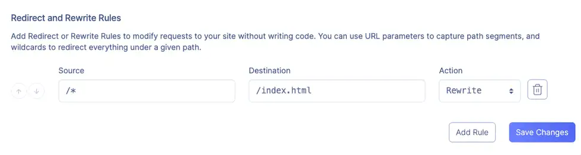

## [vercel](https://vercel.com/)
:::info
- 部署后默认域名后缀是.vercel.app
- vercel.app域名被Greate Firewall拦截了
:::

## [netlify](https://www.netlify.com/)
:::tip
- 部署后默认域名后缀是.netlify.app
- 使用netlify是真的爽，域名netlify.app前面的name可以自由设置
- netlify和vercel操作非node前端项目都很简单：1.使用github登录 2.给netlify/vercel授权 3.deploy
:::

## [Render](https://render.com/docs/static-sites)
- 查看免费使用情况：[Free Usage](https://dashboard.render.com/billing#free-usage)

### [环境变量](https://docs.render.com/configure-environment-variables)
- [默认的环境变量](https://docs.render.com/environment-variables)
  - Node.js 版本 20.9.0 是 2023 年 11 月 29 日或之后创建的渲染服务的默认版本。[设置指定的Node.js版本](https://docs.render.com/node-version)

- 使用环境变量：
  - 本地开发：在根目录下创建一个`.env`文件并将其加入到`.gitignore`避免提交。许多语言都有用于读取 `.env` 文件的库，例如 Node.js 的 [dotenv](https://www.npmjs.com/package/dotenv) 和 Python 的 [python-dotenv](https://github.com/theskumar/python-dotenv)。
  - render部署：可以在Environment--->Environment Variables配置诸如Node.js版本、运行环境等环境变量
  - 在代码中使用：以配置的NODE_VERSION为例，`process.env.NODE_VERSION`

- 使用Secret Files：
  - 本地开发：同上
  - render部署：可以在Environment--->Secret Files配置诸如数据库链接、私钥等，为了和本地开发保持一致，可以设置Filename为`.env`，Contents为`key=value`值，在构建期间和运行时从应用程序的指定根目录读取这些文件。
  

  - 在代码中使用：以配置的DATABASE_URL为例，`process.env.DATABASE_URL`

  :::info
  安装：`npm install dotenv --save`

  使用(在根目录下新建`.env`文件)：
  ```js title=".env"
  HOST=localhost
  PORT=4000
  ```
  ```js
  const Dotenv = require('dotenv');

  Dotenv.config();

  const server = Hapi.server({ host: process.env.HOST, port: process.env.PORT });
  ```
  :::

### 使用客户端路由
如果您使用 Reach Router 或 React Router 进行客户端路由，则需要将所有路由请求定向到 `index.html`，以便路由库可以处理它们。您可以通过为静态站点定义重写规则来轻松完成此操作。在您的服务的 `Redirects/Rewrites` 选项卡添加具有以下值的规则：


## [Surge](https://surge.sh/help/getting-started-with-surge)

## [GitHub Pages](https://pages.github.com/)