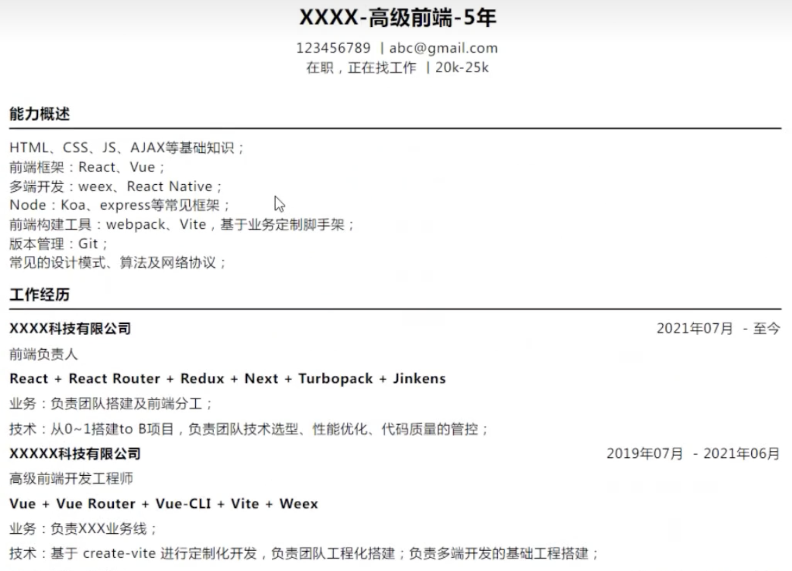
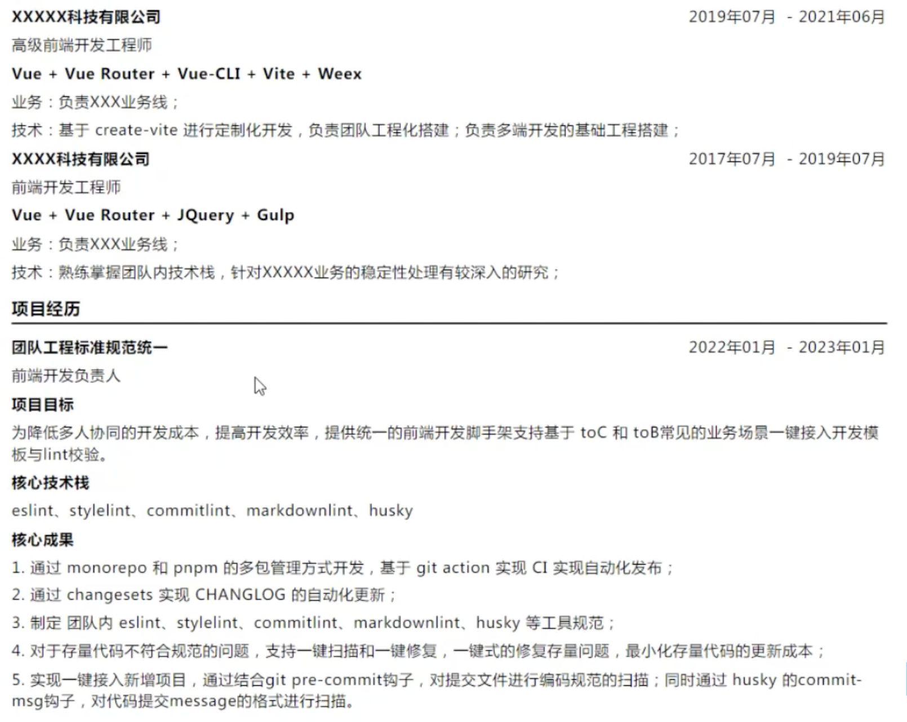
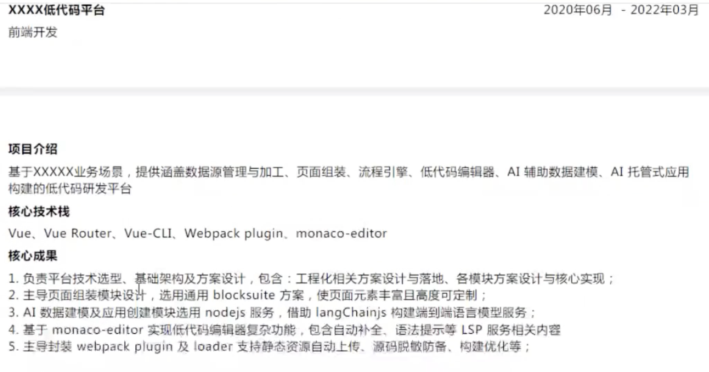
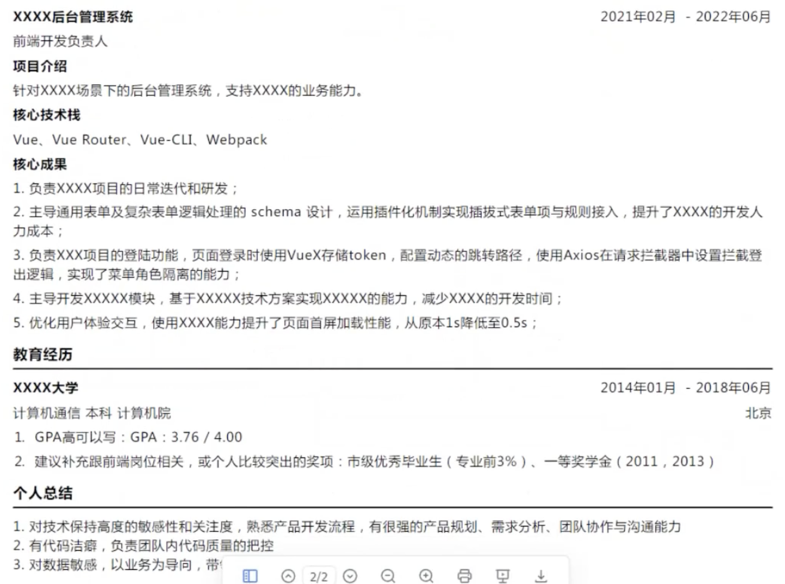
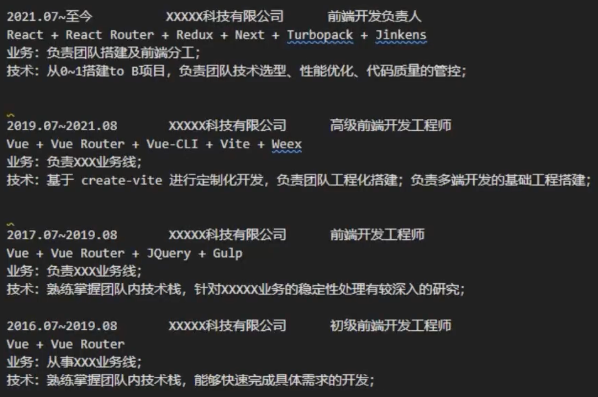
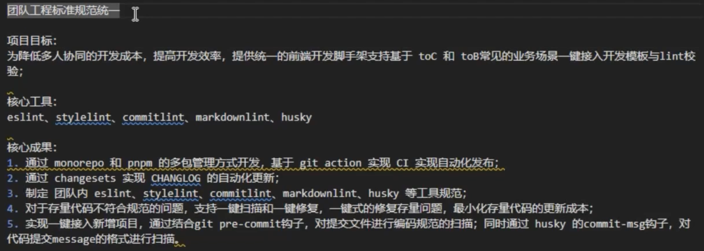
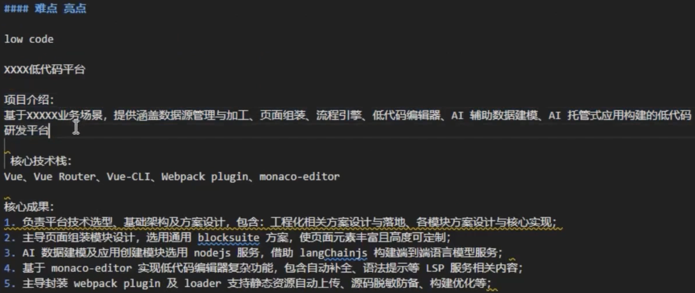
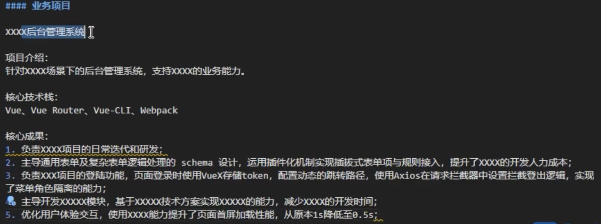
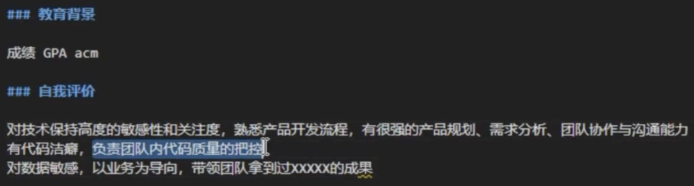

## 面试准备
准备好简历、了解清楚应聘公司的岗位描述

### 简历
> [阿里P8级前端高级工程师来告诉你，前端简历到底该如何写，前端面试应该如何去准备！](https://www.bilibili.com/video/BV1v34y1M7q2/?p=2&spm_id_from=pageDriver&vd_source=8c097a1f02a5d77f973c5834be4c8ab6)

> 免费简历生成网址：https://www.wondercv.com/

5年简历模板：

#### 个人信息
- 姓名
- 电话
- 邮箱
- 求职意愿
- 学历/blog/github/年龄 看情况

:::info
推荐写法：
- 标题：姓名-职位-工龄
- 手机号
- 邮箱
- 所在城市
- 个人状态（在职与否）
:::

#### 专业技能
主要能够体现研发技术栈即可，如果不确定可以不加了解/熟悉/精通等词

:::info
参考模板：
- HTML、CSS、JS、AJAX等基础知识；
- 前端框架：React、Vue；
- 多端开发：weex、React Native；
- Node：Koa、express等常见框架；
- 前端构建工具：webpack、Vite，基于业务定制脚手架；
- 版本管理：Git；
- 常见的设计模式、算法及网络协议；
:::

#### 工作经历
- 每段经历的时间
- 所担任的职责
- 工作内容

:::info
推荐写法：
- 一句话描述对应工作公司、工作时间、工作职级；
- 一句话描述使用的完整技术栈；
- 简要地描述这段经历带来的技术产出和业务价值，突出在这段经历中的成长和亮点；
:::

举例：

#### 项目经历
:::tip
- 避免流水账，可以用以下关键词串联：
  - 项目概述
  - （角色/负责的模块）个人职责
  - （碰到的问题）项目难点
  - 解决思路/解决方案
  - 工作成果
  - 总结沉淀

- 避免堆积项目，2-3个质量高的项目即可

- 项目描述
  - 1句话写清楚业务背景
  - 1-2句话写清楚技术选型和最终的技术方案
  - 重点写如何使用对应的技术手段完成业务目标，遇到的难点有哪些
  - 项目带来的业务价值
:::
:::info
推荐写法：
- 建议写3个左右的核心项目，每个项目最多不超过3个亮点；
- 每个项目可以按照这个格式描述：
  - 一句话描述业务背景；
  - 1-2句话描述技术选型；
  - 核心内容讲解如何通过技术手段实现；
  - 一句话描述带来的研发和业务的增量价值；
:::

团队横向产出的项目举例：

难点/亮点的项目举例：

负责业务的项目举例：

- 微前端
- Node.js BFF
- 脚手架（webpack插件）
- vscode插件
- 页面性能优化
- 多端

梳理项目，项目中用到的技术点/知识点得掌握

#### 教育经历

#### 自我评价
可以不写

举例：

### 面试题
- [web前端面试](https://github.com/febobo/web-interview)

- [前端瓶子君](https://github.com/sisterAn/blog)
- [前端算法系列](https://github.com/sisterAn/JavaScript-Algorithms)
- [javascript-algorithms](https://github.com/trekhleb/javascript-algorithms)

5年以上，资深前端，要求：广度 深度 具有产品视野；研发效能 质量 资源使用率等方面有技术手段；技术调研 最优技术方案；方法论；业务理解深度；如何帮助团队成员成长；能够针对具体的业务场景，提供完善的技术方案；在负责的业务领域，掌握前沿技术

先准备好项目，项目涉及的知识点都熟练，然后再看跟项目相关的八股文（不用把所有的八股文都看完都准备好）

画图梳理项目涉及的功能点(怎么实现的)，以及涉及的知识点

[React面试题](/docs/react/audition)

### 面试过程
可能是3+1技术面+HR面

- 1轮技术面：通常包含有coding
- 2轮技术面：项目深度 业务知识 技术攻坚
- 3轮技术面：前端认知
- 4轮技术面：通常为交叉面，用于定职级

学会引导面试官
#### 自我介绍
- 个人信息
- 技术能力
- 技术擅长（性能优化、架构设计、带项目等）

#### 项目介绍
- 项目概述
- （角色/负责的模块）个人职责
- （碰到的问题）项目难点
- 解决思路/解决方案
- 工作成果
- 总结沉淀

#### 提问
- 团队情况
- 涉及业务

#### HR
- 加班问题：可以回答接受加班但不加无意义的班
- 离职原因
- 谈薪：可以要预期偏上，HR会压价

## 面试记录