# 架构图类型
## 1. 技术架构图 (Technical Architecture)
特点：
- 展示系统的技术栈层次
- 从底层基础设施到上层应用的分层结构
- 突出技术选型和依赖关系

格式：分层结构，从上到下展示技术栈

XML格式示例 (Draw.io):
```xml
<?xml version="1.0" encoding="UTF-8"?>
<mxfile host="app.diagrams.net">
  <diagram name="技术架构图">
    <mxGraphModel>
      <root>
        <mxCell id="0"/>
        <mxCell id="1" parent="0"/>
        
        <!-- 构建层 -->
        <mxCell id="build-layer" value="构建工具层" 
                style="rounded=1;fillColor=#e1d5e7;strokeColor=#9673a6;" 
                vertex="1" parent="1">
          <mxGeometry x="100" y="50" width="600" height="40" as="geometry"/>
        </mxCell>
        
        <!-- 框架层 -->
        <mxCell id="framework-layer" value="框架层" 
                style="rounded=1;fillColor=#fff2cc;strokeColor=#d6b656;" 
                vertex="1" parent="1">
          <mxGeometry x="100" y="120" width="600" height="40" as="geometry"/>
        </mxCell>
        
        <!-- 业务层 -->
        <mxCell id="business-layer" value="业务层" 
                style="rounded=1;fillColor=#d5e8d4;strokeColor=#82b366;" 
                vertex="1" parent="1">
          <mxGeometry x="100" y="190" width="600" height="40" as="geometry"/>
        </mxCell>
      </root>
    </mxGraphModel>
  </diagram>
</mxfile>
```
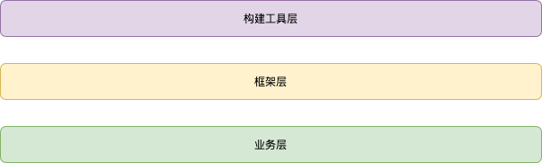

## 2. 应用结构图 (Application Structure)
特点：
- 展示应用内部模块划分
- 显示文件目录结构
- 突出模块间依赖关系

格式：树状结构或模块关系图

Mermaid格式示例:
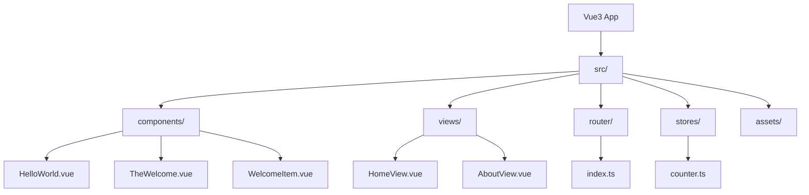
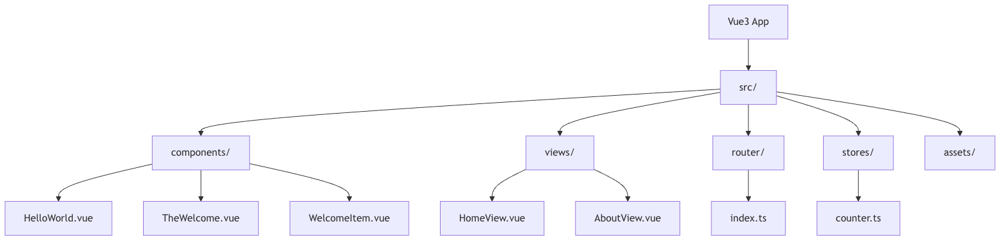

## 3. 组件架构图 (Component Architecture)
特点：
- 展示组件层次关系
- 显示Props和Events流向
- 突出组件复用关系

格式：组件树状图

PlantUML格式示例:
```uml
@startuml
!define COMPONENT rectangle

COMPONENT App {
  COMPONENT RouterView
}

COMPONENT HomeView {
  COMPONENT HelloWorld
  COMPONENT TheWelcome
}

COMPONENT TheWelcome {
  COMPONENT WelcomeItem
  COMPONENT Icons
}

App --> RouterView
RouterView --> HomeView
RouterView --> AboutView
HomeView --> HelloWorld
HomeView --> TheWelcome
TheWelcome --> WelcomeItem
TheWelcome --> Icons

@enduml
```
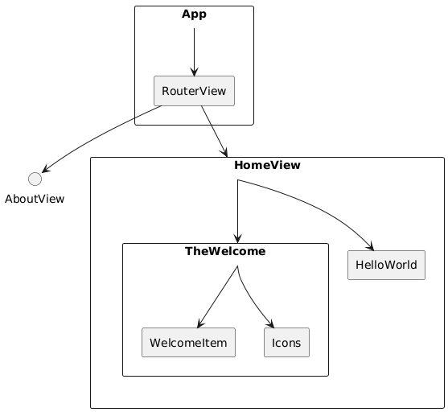
:::tip
访问[PlantUML 官方网站](http://www.plantuml.com/plantuml/uml/)将 `.puml` 文件内容粘贴到文本框中网站会自动渲染图表
:::

## 4. 数据流架构图 (Data Flow Architecture)
特点：
- 展示数据在系统中的流转
- 显示状态管理流程
- 突出用户交互路径

格式：流程图或时序图

XML格式示例 (Draw.io):
```xml
<?xml version="1.0" encoding="UTF-8"?>
<mxfile host="app.diagrams.net">
  <diagram name="数据流图">
    <mxGraphModel>
      <root>
        <mxCell id="0"/>
        <mxCell id="1" parent="0"/>
        
        <!-- 用户交互 -->
        <mxCell id="user" value="用户交互" 
                style="ellipse;fillColor=#f8cecc;strokeColor=#b85450;" 
                vertex="1" parent="1">
          <mxGeometry x="50" y="100" width="100" height="60" as="geometry"/>
        </mxCell>
        
        <!-- 组件 -->
        <mxCell id="component" value="Vue组件" 
                style="rounded=1;fillColor=#dae8fc;strokeColor=#6c8ebf;" 
                vertex="1" parent="1">
          <mxGeometry x="200" y="100" width="100" height="60" as="geometry"/>
        </mxCell>
        
        <!-- 状态管理 -->
        <mxCell id="store" value="Pinia Store" 
                style="rounded=1;fillColor=#ffe6cc;strokeColor=#d79b00;" 
                vertex="1" parent="1">
          <mxGeometry x="350" y="100" width="100" height="60" as="geometry"/>
        </mxCell>
        
        <!-- 连接线 -->
        <mxCell id="arrow1" style="edgeStyle=orthogonalEdgeStyle;rounded=0;" 
                edge="1" parent="1" source="user" target="component">
          <mxGeometry relative="1" as="geometry"/>
        </mxCell>
        
        <mxCell id="arrow2" style="edgeStyle=orthogonalEdgeStyle;rounded=0;" 
                edge="1" parent="1" source="component" target="store">
          <mxGeometry relative="1" as="geometry"/>
        </mxCell>
      </root>
    </mxGraphModel>
  </diagram>
</mxfile>
```
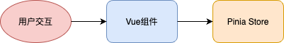

## 5. 部署架构图 (Deployment Architecture)
特点：
- 展示系统部署结构
- 显示服务器和网络配置
- 突出负载均衡和容错机制

XML格式示例:
```xml
<?xml version="1.0" encoding="UTF-8"?>
<mxfile host="app.diagrams.net">
  <diagram name="部署架构图">
    <mxGraphModel>
      <root>
        <mxCell id="0"/>
        <mxCell id="1" parent="0"/>
        
        <!-- CDN -->
        <mxCell id="cdn" value="CDN" 
                style="cloud;fillColor=#e1d5e7;strokeColor=#9673a6;" 
                vertex="1" parent="1">
          <mxGeometry x="100" y="50" width="100" height="60" as="geometry"/>
        </mxCell>
        
        <!-- Web服务器 -->
        <mxCell id="webserver" value="Nginx" 
                style="rounded=1;fillColor=#d5e8d4;strokeColor=#82b366;" 
                vertex="1" parent="1">
          <mxGeometry x="100" y="150" width="100" height="60" as="geometry"/>
        </mxCell>
        
        <!-- 静态资源 -->
        <mxCell id="static" value="静态资源" 
                style="rounded=1;fillColor=#fff2cc;strokeColor=#d6b656;" 
                vertex="1" parent="1">
          <mxGeometry x="100" y="250" width="100" height="60" as="geometry"/>
        </mxCell>
      </root>
    </mxGraphModel>
  </diagram>
</mxfile>
```
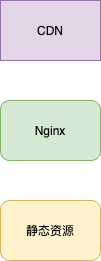

## 6. 业务架构图 (Business Architecture)
特点：
- 展示业务流程和功能模块
- 显示用户角色和权限
- 突出业务逻辑关系

时序图XML示例:
```xml
<?xml version="1.0" encoding="UTF-8"?>
<mxfile host="app.diagrams.net">
  <diagram name="业务流程图">
    <mxGraphModel>
      <root>
        <mxCell id="0"/>
        <mxCell id="1" parent="0"/>
        
        <!-- 用户 -->
        <mxCell id="user" value="用户" 
                style="shape=umlActor;fillColor=#f8cecc;" 
                vertex="1" parent="1">
          <mxGeometry x="50" y="50" width="30" height="60" as="geometry"/>
        </mxCell>
        
        <!-- 系统 -->
        <mxCell id="system" value="Vue3系统" 
                style="rounded=1;fillColor=#dae8fc;" 
                vertex="1" parent="1">
          <mxGeometry x="200" y="50" width="100" height="60" as="geometry"/>
        </mxCell>
        
        <!-- 交互线 -->
        <mxCell id="interaction" value="访问页面" 
                style="edgeStyle=orthogonalEdgeStyle;rounded=0;" 
                edge="1" parent="1" source="user" target="system">
          <mxGeometry relative="1" as="geometry"/>
        </mxCell>
      </root>
    </mxGraphModel>
  </diagram>
</mxfile>
```


:::tip
各格式对比总结：
- Draw.io XML格式
    - 优点: 功能强大，支持复杂图形，可视化编辑
    - 缺点: 文件较大，需要专门工具
    - 适用: 复杂的系统架构图

- Mermaid格式
    - 优点: 代码简洁，版本控制友好，GitHub支持
    - 缺点: 样式定制有限
    - 适用: 流程图、关系图

- PlantUML格式
    - 优点: UML标准，自动布局，代码化
    - 缺点: 学习成本高
    - 适用: 标准UML图

- SVG格式
    - 优点: 矢量图，可缩放，网页友好
    - 缺点: 手工编写困难
    - 适用: 最终展示和发布
:::

## 7. 其他架构图
除了上面的技术架构图、应用结构图、组件架构图、数据流架构图、部署架构图和业务架构图之外，前端架构图还可以包括以下几种类型：

1. 性能架构图
    - 描述：展示应用的性能优化策略和关键性能指标。
    - 内容：包括缓存策略、懒加载、代码分割、资源优化等。
    - 用途：帮助开发团队关注和改进应用性能。

2. 安全架构图
    - 描述：展示应用的安全措施和防御策略。
    - 内容：包括认证、授权、数据加密、XSS/CSRF防护等。
    - 用途：确保应用的安全性，防范潜在的安全威胁。

3. 状态管理架构图
    - 描述：详细展示应用的状态管理结构和数据流。
    - 内容：Vuex/Pinia store结构、模块划分、主要actions和mutations。
    - 用途：理清复杂应用的状态管理逻辑。

4. 测试架构图
    - 描述：展示应用的测试策略和测试覆盖。
    - 内容：单元测试、集成测试、E2E测试的范围和工具。
    - 用途：确保代码质量和功能正确性。

5. 国际化（i18n）架构图
    - 描述：展示应用的多语言支持结构。
    - 内容：翻译管理、动态语言切换、日期/数字格式化等。
    - 用途：规划和管理多语言支持。

6. 可访问性（a11y）架构图
    - 描述：展示应用的可访问性设计和实现。
    - 内容：ARIA属性使用、键盘导航、屏幕阅读器兼容性等。
    - 用途：确保应用对所有用户都是可访问的。

7. 主题/样式架构图
    - 描述：展示应用的样式组织和主题系统。
    - 内容：CSS架构（如BEM、ITCSS）、主题切换机制、设计系统集成等。
    - 用途：管理复杂的样式系统和主题定制。

8. 错误处理和日志架构图
    - 描述：展示应用的错误捕获、处理和日志记录策略。
    - 内容：全局错误处理、日志收集、错误报告机制等。
    - 用途：提高应用的稳定性和可调试性。

9. 离线功能架构图
    - 描述：展示应用的离线能力和数据同步策略。
    - 内容：Service Worker使用、离线数据存储、同步机制等。
    - 用途：增强应用的可用性，特别是在网络不稳定的情况下。

10. 第三方集成架构图
    - 描述：展示应用与外部服务和库的集成。
    - 内容：分析工具、支付系统、社交媒体API等集成点。
    - 用途：管理外部依赖和集成点。

11. 构建和开发工具链架构图
    - 描述：展示开发、构建和部署过程中使用的工具和流程。
    - 内容：构建工具、代码检查、版本控制工作流等。
    - 用途：优化开发流程，提高团队效率。

12. 微前端架构图（如果适用）
    - 描述：展示应用如何集成多个独立开发、部署的前端应用。
    - 内容：微前端框架、应用间通信、共享依赖管理等。
    - 用途：管理大型、复杂的前端应用。

这些额外的架构图类型可以根据项目的具体需求和复杂度来选择使用。每种类型都聚焦于前端开发的不同方面，有助于团队更全面地理解和管理应用架构。在实际项目中，可以根据需要组合使用这些图表，以创建一个全面的前端架构文档。

## 示例
### 技术架构图
以一个使用`create-vue`搭建的Vue3初始项目为例，画技术架构图：
1. Draw.io XML格式
```xml
<?xml version="1.0" encoding="UTF-8"?>
<mxfile host="app.diagrams.net" modified="2025-06-06T03:26:00.000Z" agent="5.0" etag="vue3-tech-arch" version="22.1.16" type="device">
  <diagram name="Vue3项目技术架构图" id="vue3-tech-architecture">
    <mxGraphModel dx="1422" dy="794" grid="1" gridSize="10" guides="1" tooltips="1" connect="1" arrows="1" fold="1" page="1" pageScale="1" pageWidth="1400" pageHeight="900" math="0" shadow="0">
      <root>
        <mxCell id="0"/>
        <mxCell id="1" parent="0"/>
        
        <!-- 标题 -->
        <mxCell id="title" value="Vue3 Demo 项目技术架构图" style="text;html=1;strokeColor=none;fillColor=none;align=center;verticalAlign=middle;whiteSpace=wrap;rounded=0;fontSize=24;fontStyle=1;fontColor=#2F5233;" vertex="1" parent="1">
          <mxGeometry x="500" y="20" width="400" height="40" as="geometry"/>
        </mxCell>

        <!-- 构建工具层 -->
        <mxCell id="build-layer" value="构建工具层 (Build Tools)" style="rounded=1;whiteSpace=wrap;html=1;fillColor=#e1d5e7;strokeColor=#9673a6;fontSize=16;fontStyle=1;" vertex="1" parent="1">
          <mxGeometry x="100" y="80" width="1200" height="50" as="geometry"/>
        </mxCell>
        
        <mxCell id="vite" value="Vite 6.2.4&#xa;构建工具" style="rounded=1;whiteSpace=wrap;html=1;fillColor=#f8cecc;strokeColor=#b85450;fontSize=12;" vertex="1" parent="1">
          <mxGeometry x="150" y="150" width="120" height="60" as="geometry"/>
        </mxCell>
        
        <mxCell id="typescript" value="TypeScript 5.8&#xa;类型检查" style="rounded=1;whiteSpace=wrap;html=1;fillColor=#f8cecc;strokeColor=#b85450;fontSize=12;" vertex="1" parent="1">
          <mxGeometry x="300" y="150" width="120" height="60" as="geometry"/>
        </mxCell>
        
        <mxCell id="eslint" value="ESLint 9.22&#xa;代码检查" style="rounded=1;whiteSpace=wrap;html=1;fillColor=#f8cecc;strokeColor=#b85450;fontSize=12;" vertex="1" parent="1">
          <mxGeometry x="450" y="150" width="120" height="60" as="geometry"/>
        </mxCell>
        
        <mxCell id="prettier" value="Prettier 3.5.3&#xa;代码格式化" style="rounded=1;whiteSpace=wrap;html=1;fillColor=#f8cecc;strokeColor=#b85450;fontSize=12;" vertex="1" parent="1">
          <mxGeometry x="600" y="150" width="120" height="60" as="geometry"/>
        </mxCell>

        <!-- 核心框架层 -->
        <mxCell id="framework-layer" value="核心框架层 (Core Framework)" style="rounded=1;whiteSpace=wrap;html=1;fillColor=#fff2cc;strokeColor=#d6b656;fontSize=16;fontStyle=1;" vertex="1" parent="1">
          <mxGeometry x="100" y="240" width="1200" height="50" as="geometry"/>
        </mxCell>
        
        <mxCell id="vue3" value="Vue 3.5.13&#xa;核心框架" style="rounded=1;whiteSpace=wrap;html=1;fillColor=#dae8fc;strokeColor=#6c8ebf;fontSize=12;" vertex="1" parent="1">
          <mxGeometry x="200" y="310" width="120" height="60" as="geometry"/>
        </mxCell>
        
        <mxCell id="vue-router" value="Vue Router 4.5.0&#xa;路由管理" style="rounded=1;whiteSpace=wrap;html=1;fillColor=#dae8fc;strokeColor=#6c8ebf;fontSize=12;" vertex="1" parent="1">
          <mxGeometry x="400" y="310" width="120" height="60" as="geometry"/>
        </mxCell>
        
        <mxCell id="pinia" value="Pinia 3.0.1&#xa;状态管理" style="rounded=1;whiteSpace=wrap;html=1;fillColor=#dae8fc;strokeColor=#6c8ebf;fontSize=12;" vertex="1" parent="1">
          <mxGeometry x="600" y="310" width="120" height="60" as="geometry"/>
        </mxCell>

        <!-- 应用层 -->
        <mxCell id="app-layer" value="应用层 (Application Layer)" style="rounded=1;whiteSpace=wrap;html=1;fillColor=#d5e8d4;strokeColor=#82b366;fontSize=16;fontStyle=1;" vertex="1" parent="1">
          <mxGeometry x="100" y="400" width="1200" height="50" as="geometry"/>
        </mxCell>
        
        <mxCell id="main-entry" value="main.ts&#xa;应用入口" style="rounded=1;whiteSpace=wrap;html=1;fillColor=#d5e8d4;strokeColor=#82b366;fontSize=12;" vertex="1" parent="1">
          <mxGeometry x="150" y="470" width="100" height="60" as="geometry"/>
        </mxCell>
        
        <mxCell id="app-root" value="App.vue&#xa;根组件" style="rounded=1;whiteSpace=wrap;html=1;fillColor=#d5e8d4;strokeColor=#82b366;fontSize=12;" vertex="1" parent="1">
          <mxGeometry x="280" y="470" width="100" height="60" as="geometry"/>
        </mxCell>
        
        <mxCell id="router-config" value="router/index.ts&#xa;路由配置" style="rounded=1;whiteSpace=wrap;html=1;fillColor=#d5e8d4;strokeColor=#82b366;fontSize=12;" vertex="1" parent="1">
          <mxGeometry x="410" y="470" width="100" height="60" as="geometry"/>
        </mxCell>
        
        <mxCell id="store-config" value="stores/counter.ts&#xa;状态配置" style="rounded=1;whiteSpace=wrap;html=1;fillColor=#d5e8d4;strokeColor=#82b366;fontSize=12;" vertex="1" parent="1">
          <mxGeometry x="540" y="470" width="100" height="60" as="geometry"/>
        </mxCell>

        <!-- 业务层 -->
        <mxCell id="business-layer" value="业务层 (Business Layer)" style="rounded=1;whiteSpace=wrap;html=1;fillColor=#ffe6cc;strokeColor=#d79b00;fontSize=16;fontStyle=1;" vertex="1" parent="1">
          <mxGeometry x="100" y="560" width="1200" height="50" as="geometry"/>
        </mxCell>
        
        <!-- 视图模块 -->
        <mxCell id="views-module" value="视图模块 (Views)" style="rounded=1;whiteSpace=wrap;html=1;fillColor=#f8cecc;strokeColor=#b85450;fontSize=14;fontStyle=1;" vertex="1" parent="1">
          <mxGeometry x="150" y="630" width="250" height="40" as="geometry"/>
        </mxCell>
        
        <mxCell id="home-view" value="HomeView.vue" style="rounded=1;whiteSpace=wrap;html=1;fillColor=#f8cecc;strokeColor=#b85450;fontSize=12;" vertex="1" parent="1">
          <mxGeometry x="150" y="690" width="110" height="40" as="geometry"/>
        </mxCell>
        
        <mxCell id="about-view" value="AboutView.vue" style="rounded=1;whiteSpace=wrap;html=1;fillColor=#f8cecc;strokeColor=#b85450;fontSize=12;" vertex="1" parent="1">
          <mxGeometry x="290" y="690" width="110" height="40" as="geometry"/>
        </mxCell>

        <!-- 组件模块 -->
        <mxCell id="components-module" value="组件模块 (Components)" style="rounded=1;whiteSpace=wrap;html=1;fillColor=#e6d0de;strokeColor=#996185;fontSize=14;fontStyle=1;" vertex="1" parent="1">
          <mxGeometry x="450" y="630" width="400" height="40" as="geometry"/>
        </mxCell>
        
        <mxCell id="hello-world" value="HelloWorld.vue" style="rounded=1;whiteSpace=wrap;html=1;fillColor=#e6d0de;strokeColor=#996185;fontSize=12;" vertex="1" parent="1">
          <mxGeometry x="450" y="690" width="110" height="40" as="geometry"/>
        </mxCell>
        
        <mxCell id="welcome" value="TheWelcome.vue" style="rounded=1;whiteSpace=wrap;html=1;fillColor=#e6d0de;strokeColor=#996185;fontSize=12;" vertex="1" parent="1">
          <mxGeometry x="580" y="690" width="110" height="40" as="geometry"/>
        </mxCell>
        
        <mxCell id="welcome-item" value="WelcomeItem.vue" style="rounded=1;whiteSpace=wrap;html=1;fillColor=#e6d0de;strokeColor=#996185;fontSize=12;" vertex="1" parent="1">
          <mxGeometry x="710" y="690" width="110" height="40" as="geometry"/>
        </mxCell>
        
        <mxCell id="icons" value="Icons组件集&#xa;(5个图标组件)" style="rounded=1;whiteSpace=wrap;html=1;fillColor=#e6d0de;strokeColor=#996185;fontSize=12;" vertex="1" parent="1">
          <mxGeometry x="840" y="690" width="110" height="40" as="geometry"/>
        </mxCell>

        <!-- 资源层 -->
        <mxCell id="assets-layer" value="资源层 (Assets Layer)" style="rounded=1;whiteSpace=wrap;html=1;fillColor=#fad7ac;strokeColor=#b46504;fontSize=16;fontStyle=1;" vertex="1" parent="1">
          <mxGeometry x="100" y="760" width="600" height="50" as="geometry"/>
        </mxCell>
        
        <mxCell id="styles" value="样式文件&#xa;(base.css, main.css)" style="rounded=1;whiteSpace=wrap;html=1;fillColor=#fad7ac;strokeColor=#b46504;fontSize=12;" vertex="1" parent="1">
          <mxGeometry x="150" y="830" width="130" height="50" as="geometry"/>
        </mxCell>
        
        <mxCell id="images" value="图片资源&#xa;(logo.svg)" style="rounded=1;whiteSpace=wrap;html=1;fillColor=#fad7ac;strokeColor=#b46504;fontSize=12;" vertex="1" parent="1">
          <mxGeometry x="310" y="830" width="130" height="50" as="geometry"/>
        </mxCell>
        
        <mxCell id="public-assets" value="公共资源&#xa;(favicon.ico)" style="rounded=1;whiteSpace=wrap;html=1;fillColor=#fad7ac;strokeColor=#b46504;fontSize=12;" vertex="1" parent="1">
          <mxGeometry x="470" y="830" width="130" height="50" as="geometry"/>
        </mxCell>

        <!-- 测试层 -->
        <mxCell id="test-layer" value="测试层 (Testing Layer)" style="rounded=1;whiteSpace=wrap;html=1;fillColor=#cdeb8b;strokeColor=#36393d;fontSize=16;fontStyle=1;" vertex="1" parent="1">
          <mxGeometry x="750" y="760" width="550" height="50" as="geometry"/>
        </mxCell>
        
        <mxCell id="vitest" value="Vitest 3.1.1&#xa;单元测试" style="rounded=1;whiteSpace=wrap;html=1;fillColor=#cdeb8b;strokeColor=#36393d;fontSize=12;" vertex="1" parent="1">
          <mxGeometry x="780" y="830" width="120" height="50" as="geometry"/>
        </mxCell>
        
        <mxCell id="cypress" value="Cypress 14.2.1&#xa;E2E测试" style="rounded=1;whiteSpace=wrap;html=1;fillColor=#cdeb8b;strokeColor=#36393d;fontSize=12;" vertex="1" parent="1">
          <mxGeometry x="930" y="830" width="120" height="50" as="geometry"/>
        </mxCell>
        
        <mxCell id="component-tests" value="组件测试&#xa;(__tests__)" style="rounded=1;whiteSpace=wrap;html=1;fillColor=#cdeb8b;strokeColor=#36393d;fontSize=12;" vertex="1" parent="1">
          <mxGeometry x="1080" y="830" width="120" height="50" as="geometry"/>
        </mxCell>

      </root>
    </mxGraphModel>
  </diagram>
</mxfile>
```
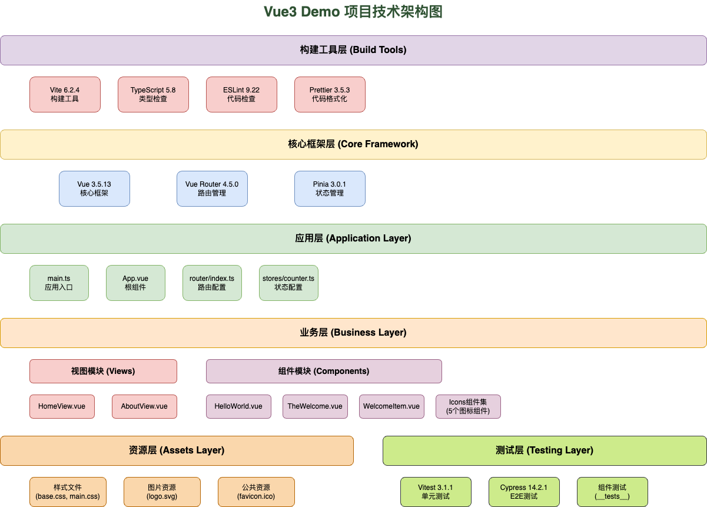

2. PlantUML格式 (标准UML图)
```uml
@startuml Vue3项目技术架构图
!define RECTANGLE class

package "构建工具层" {
    RECTANGLE Vite {
        +version: 6.2.4
        +role: 构建工具
    }
    
    RECTANGLE TypeScript {
        +version: 5.8
        +role: 类型检查
    }
    
    RECTANGLE ESLint {
        +version: 9.22
        +role: 代码检查
    }
    
    RECTANGLE Prettier {
        +version: 3.5.3
        +role: 代码格式化
    }
}

package "核心框架层" {
    RECTANGLE Vue3 {
        +version: 3.5.13
        +role: 核心框架
    }
    
    RECTANGLE VueRouter {
        +version: 4.5.0
        +role: 路由管理
    }
    
    RECTANGLE Pinia {
        +version: 3.0.1
        +role: 状态管理
    }
}

package "应用层" {
    RECTANGLE MainEntry {
        +file: main.ts
        +role: 应用入口
    }
    
    RECTANGLE AppRoot {
        +file: App.vue
        +role: 根组件
    }
    
    RECTANGLE RouterConfig {
        +file: router/index.ts
        +role: 路由配置
    }
    
    RECTANGLE StoreConfig {
        +file: stores/counter.ts
        +role: 状态配置
    }
}

package "业务层" {
    package "视图模块" {
        RECTANGLE HomeView {
            +file: HomeView.vue
        }
        
        RECTANGLE AboutView {
            +file: AboutView.vue
        }
    }
    
    package "组件模块" {
        RECTANGLE HelloWorld {
            +file: HelloWorld.vue
        }
        
        RECTANGLE TheWelcome {
            +file: TheWelcome.vue
        }
        
        RECTANGLE WelcomeItem {
            +file: WelcomeItem.vue
        }
        
        RECTANGLE Icons {
            +files: 5个图标组件
        }
    }
}

package "资源层" {
    RECTANGLE Styles {
        +files: base.css, main.css
    }
    
    RECTANGLE Images {
        +files: logo.svg
    }
    
    RECTANGLE PublicAssets {
        +files: favicon.ico
    }
}

package "测试层" {
    RECTANGLE Vitest {
        +version: 3.1.1
        +role: 单元测试
    }
    
    RECTANGLE Cypress {
        +version: 14.2.1
        +role: E2E测试
    }
    
    RECTANGLE ComponentTests {
        +path: __tests__
        +role: 组件测试
    }
}

' 依赖关系
Vite --> Vue3
TypeScript --> Vue3
Vue3 --> MainEntry
VueRouter --> RouterConfig
Pinia --> StoreConfig
MainEntry --> AppRoot
RouterConfig --> HomeView
RouterConfig --> AboutView
HomeView --> HelloWorld
HomeView --> TheWelcome
TheWelcome --> WelcomeItem

@enduml
```
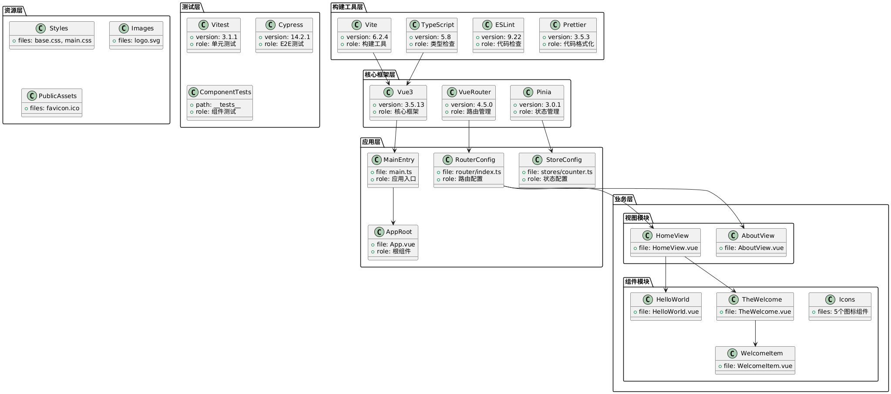

3. Mermaid格式 (适合GitHub展示)
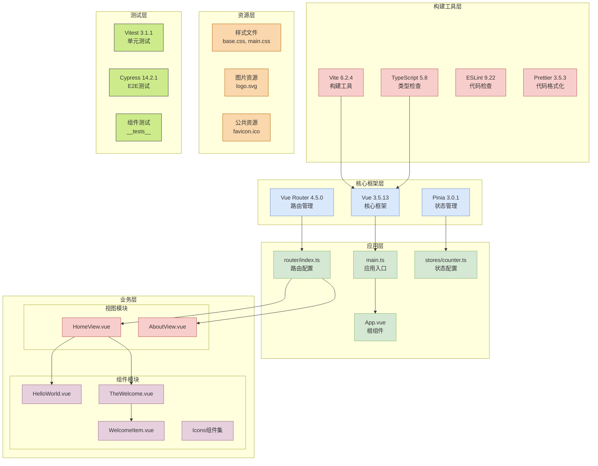


### 应用结构图
以一个使用`create-vue`搭建的Vue3初始项目为例，画应用结构图。

Mermaid是一种简洁的图表描述语言，可以直接在Markdown中使用，非常适合展示项目结构。

以下是使用Mermaid语法描述的应用结构图代码：
```mermaid
graph TD
    subgraph "Vue3 Demo Project"
        A[vue3-demo]
        A --> B[src]
        A --> C[public]
        A --> D[cypress]
        
        B --> B1[assets]
        B --> B2[components]
        B --> B3[router]
        B --> B4[stores]
        B --> B5[views]
        B --> B6[App.vue]
        B --> B7[main.ts]
        
        B1 --> B1a[base.css]
        B1 --> B1b[logo.svg]
        B1 --> B1c[main.css]
        
        B2 --> B2a[HelloWorld.vue]
        B2 --> B2b[TheWelcome.vue]
        B2 --> B2c[WelcomeItem.vue]
        B2 --> B2d[icons/]
        B2d --> B2d1[IconCommunity.vue]
        B2d --> B2d2[IconDocumentation.vue]
        B2d --> B2d3[IconEcosystem.vue]
        B2d --> B2d4[IconSupport.vue]
        B2d --> B2d5[IconTooling.vue]
        
        B3 --> B3a[index.ts]
        
        B4 --> B4a[counter.ts]
        
        B5 --> B5a[AboutView.vue]
        B5 --> B5b[HomeView.vue]
        
        C --> C1[favicon.ico]
        
        D --> D1[e2e]
        D --> D2[fixtures]
        D --> D3[support]
        
        D1 --> D1a[example.cy.ts]
        D2 --> D2a[example.json]
        D3 --> D3a[commands.ts]
        D3 --> D3b[e2e.ts]
    end
    
    subgraph "Configuration Files"
        E[package.json]
        F[vite.config.ts]
        G[tsconfig.json]
        H[.eslintrc.js]
        I[.prettierrc]
        J[cypress.config.ts]
    end
    
    A --> E
    A --> F
    A --> G
    A --> H
    A --> I
    A --> J

    classDef default fill:#f9f,stroke:#333,stroke-width:2px;
    classDef configFile fill:#bbf,stroke:#333,stroke-width:2px;
    class E,F,G,H,I,J configFile;

```
使用[Processon Mermaid](https://www.processon.com/mermaid)生成图片：


### 组件架构图
以一个使用`create-vue`搭建的Vue3初始项目为例，画组件架构图。

以下是使用Mermaid语法描述的组件架构图代码：
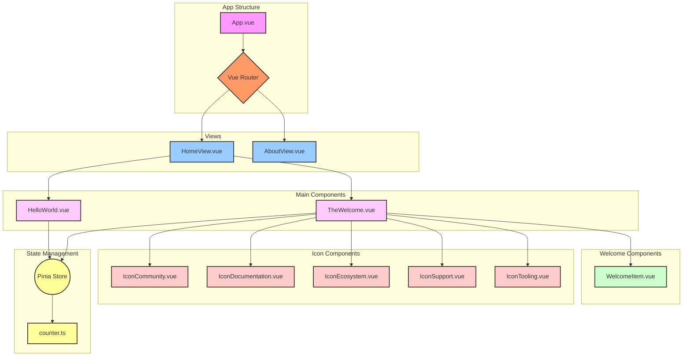
使用[Processon Mermaid](https://www.processon.com/mermaid)生成图片：

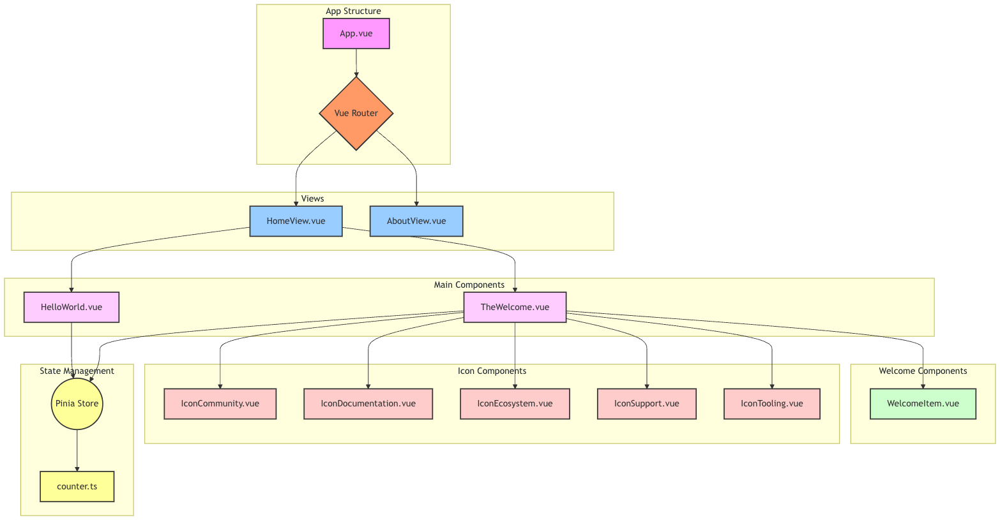

### 数据流架构图
以一个使用`create-vue`搭建的Vue3初始项目为例，画数据流架构图。

以下是使用Mermaid语法描述的数据流架构图代码：
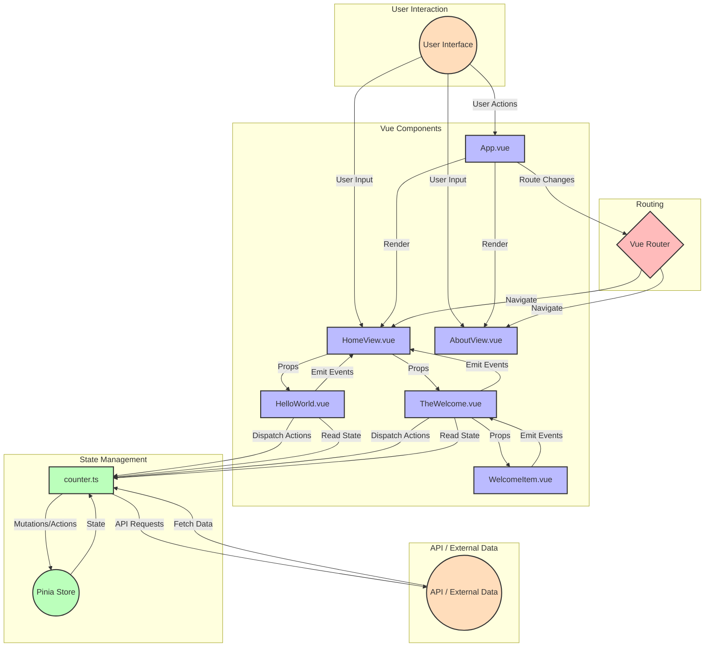

这个Mermaid图表代码描述了以下数据流架构：
1. 用户交互
    - 用户通过界面与应用交互，触发各种操作。

2. Vue组件
    - App.vue 作为根组件。
    - HomeView.vue 和 AboutView.vue 作为主要页面视图。
    - HelloWorld.vue, TheWelcome.vue, 和 WelcomeItem.vue 作为子组件。

3. 路由
    - Vue Router 负责处理页面导航。

4. 状态管理
    - Pinia Store 用于集中管理应用状态。
    - counter.ts 作为一个具体的 store 模块。

5. API / 外部数据
    - 表示与后端API或其他外部数据源的交互。

6. 数据流动
    - 组件层次结构中的 props 传递。
    - 组件向上触发事件（event emission）。
    - 通过 Pinia Store 读取和修改全局状态。
    - 路由变化触发组件渲染。
    - 与API的数据交换。

这个数据流架构图清晰地展示了Vue3项目中数据如何在不同部分之间流动：
- 用户交互如何触发组件的变化。
- 组件之间如何通过 props 和事件进行通信。
- 全局状态（Pinia Store）如何与组件交互。
- 路由如何影响页面的渲染。
- 外部数据（如API）如何集成到应用中。

通过使用不同的颜色和形状，可以轻松区分不同类型的元素（组件、路由、状态存储等）及其在数据流中的角色。

使用[Processon Mermaid](https://www.processon.com/mermaid)生成图片：

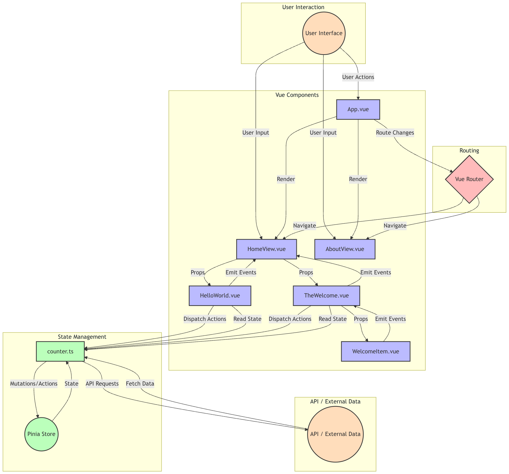

### 业务架构图
以一个使用`create-vue`搭建的Vue3初始项目为例，画业务架构图。

由于这是一个demo项目，我们会基于现有的组件和结构推断一些可能的业务功能。以下是使用Mermaid语法描述的业务架构图代码：
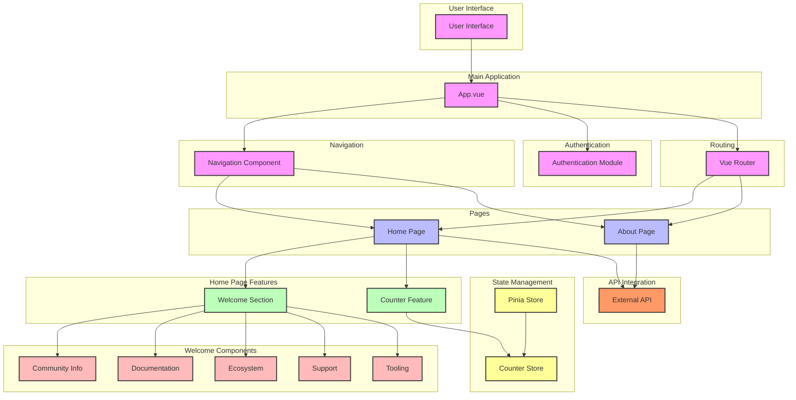

这个Mermaid图表代码描述了以下业务架构：
1. 用户界面
    - 作为整个应用的入口点。

2. 主应用
    - App.vue 作为应用的主要容器。

3. 导航
    - 推断存在一个导航组件，用于在不同页面间切换。

4. 认证
    - 假设存在一个认证模块，虽然在当前项目中可能没有实现。

5. 页面
    - 主页（Home）和关于页面（About）作为主要的业务页面。

6. 主页功能
    - 欢迎部分：展示项目的各种信息。
    - 计数器功能：作为一个简单的交互示例。

7. 欢迎组件
    - 社区信息、文档、生态系统、支持和工具等子组件，对应于图标组件。

8. 状态管理
    - 使用Pinia进行状态管理，特别是计数器状态。

9. 路由
    - 使用Vue Router管理页面导航。

10. API集成
    - 假设与外部API的集成，虽然在当前项目中可能没有实际实现。

这个业务架构图展示了：
- 应用的整体结构和主要业务模块。
- 页面之间的导航关系。
- 主要功能及其子组件。
- 状态管理的集成。
- 可能的外部集成点。

通过使用不同的颜色和分组，可以清晰地区分不同类型的业务模块及其在应用中的角色。

使用[Processon Mermaid](https://www.processon.com/mermaid)生成图片：

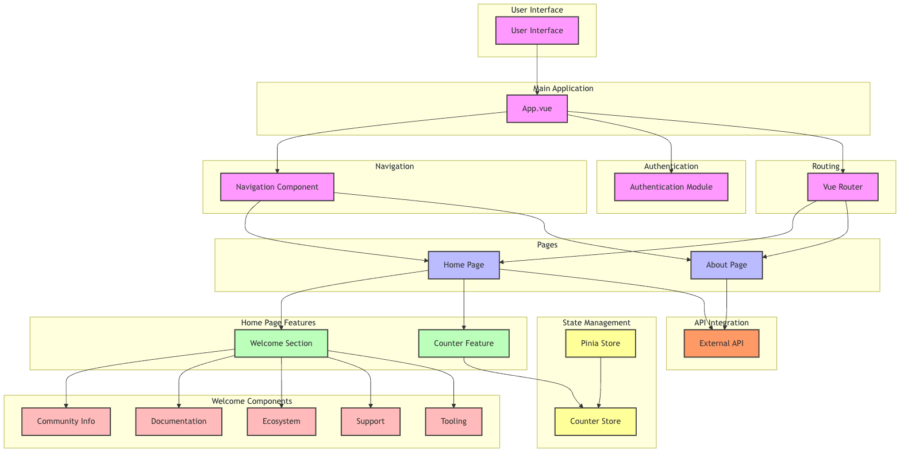

### 部署架构图
以一个使用`create-vue`搭建的Vue3初始项目为例，画部署架构图。

由于这是一个前端项目，我们需要考虑典型的Vue3应用部署场景。以下是使用Mermaid语法描述的部署架构图代码：
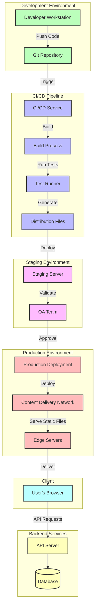
这个Mermaid图表代码描述了以下部署架构：
1. 开发环境
    - 开发者在本地工作站开发代码
    - 代码推送到Git仓库

2. CI/CD 流水线
    - CI/CD服务（如Jenkins, GitLab CI, GitHub Actions）触发构建
    - 构建过程编译Vue3应用
    - 运行自动化测试（单元测试、E2E测试等）
    - 生成分发文件（编译后的静态文件）

3. 预发环境
    - 部署到预发服务器进行集成测试
    - QA团队进行验证

4. 生产环境
    - 经QA批准后部署到生产环境
    - 使用内容分发网络（CDN）分发静态文件
    - 边缘服务器提供全球快速访问

5. 客户端
    - 用户通过浏览器访问应用

6. 后端服务
    - API服务器处理动态请求
    - 数据库存储应用数据

7. 数据流
    - 静态内容从CDN直接送达用户浏览器
    - 动态内容通过API服务器处理

这个部署架构图展示了：
- 完整的开发到部署流程
- CI/CD 自动化流水线
- 预发环境用于质量保证
- 生产环境使用CDN优化性能
- 前后端分离架构

使用[Processon Mermaid](https://www.processon.com/mermaid)生成图片：

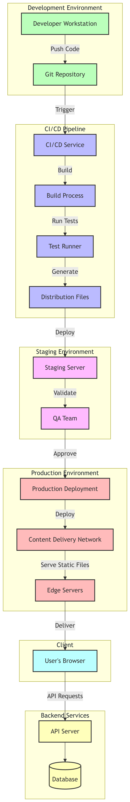

### 性能架构图
以一个使用`create-vue`搭建的Vue3初始项目为例，画性能架构图。

由于这是一个demo项目，我们会基于Vue3的最佳实践和常见的前端性能优化技术来构建这个图。以下是使用Mermaid语法描述的性能架构图代码：
```mermaid
graph TD
    subgraph "Vue3 Performance Architecture"
        VUE[Vue3 Core]
    end

    subgraph "Build Optimization"
        VITE[Vite Build Tool]
        VITE -->|Fast HMR| DEV[Development Experience]
        VITE -->|Code Splitting| SPLIT[Automatic Chunk Splitting]
        VITE -->|Tree Shaking| TREE[Dead Code Elimination]
        VITE -->|Minification| MIN[Code Minification]
    end

    subgraph "Runtime Optimization"
        COMP[Composition API]
        COMP -->|Improved| REUSE[Code Reusability]
        COMP -->|Optimized| PERF[Runtime Performance]
        
        REAC[Vue3 Reactivity System]
        REAC -->|Efficient| UPDATES[DOM Updates]
        
        VDOM[Virtual DOM]
        VDOM -->|Optimized| DIFF[Diffing Algorithm]
    end

    subgraph "Lazy Loading"
        ROUTER[Vue Router]
        ROUTER -->|Dynamic Imports| LAZY[Lazy Loaded Components]
        ROUTER -->|Async Components| ASYNC[Asynchronous Components]
    end

    subgraph "State Management"
        PINIA[Pinia Store]
        PINIA -->|Modular| STATE[Efficient State Management]
        PINIA -->|DevTools| DEBUG[Easy Debugging]
    end

    subgraph "Asset Optimization"
        IMG[Image Optimization]
        IMG -->|Compressed| COMP_IMG[Compressed Images]
        IMG -->|Lazy Load| LAZY_IMG[Lazy Loaded Images]
        
        FONT[Font Optimization]
        FONT -->|Subset| SUB_FONT[Font Subsetting]
        FONT -->|Preload| PRE_FONT[Preloaded Fonts]
    end

    subgraph "Caching Strategies"
        CACHE[Browser Caching]
        CACHE -->|Static Assets| STATIC_CACHE[Long-term Caching]
        
        SWR[Stale-While-Revalidate]
        SWR -->|API Responses| API_CACHE[API Response Caching]
    end

    subgraph "Monitoring and Analysis"
        METRIC[Performance Metrics]
        METRIC -->|Lighthouse| LIGHT[Lighthouse Scores]
        METRIC -->|Core Web Vitals| CWV[Core Web Vitals]
        
        PROF[Vue Devtools]
        PROF -->|Component Inspection| COMP_PROF[Component Profiling]
    end

    VUE --> COMP
    VUE --> REAC
    VUE --> VDOM
    VUE --> ROUTER
    VUE --> PINIA

    classDef default fill:#f9f,stroke:#333,stroke-width:2px;
    classDef build fill:#bfb,stroke:#333,stroke-width:2px;
    classDef runtime fill:#bbf,stroke:#333,stroke-width:2px;
    classDef lazy fill:#fbf,stroke:#333,stroke-width:2px;
    classDef state fill:#fbb,stroke:#333,stroke-width:2px;
    classDef asset fill:#bff,stroke:#333,stroke-width:2px;
    classDef cache fill:#ffb,stroke:#333,stroke-width:2px;
    classDef monitor fill:#f96,stroke:#333,stroke-width:2px;

    class VITE,SPLIT,TREE,MIN build;
    class COMP,REAC,VDOM,REUSE,PERF,UPDATES,DIFF runtime;
    class ROUTER,LAZY,ASYNC lazy;
    class PINIA,STATE,DEBUG state;
    class IMG,FONT,COMP_IMG,LAZY_IMG,SUB_FONT,PRE_FONT asset;
    class CACHE,SWR,STATIC_CACHE,API_CACHE cache;
    class METRIC,PROF,LIGHT,CWV,COMP_PROF monitor;

```

这个Mermaid图表代码描述了以下性能架构：
1. Vue3 核心
    - 作为整个应用的基础，提供高性能的响应式系统和虚拟DOM。

2. 构建优化
    - 使用Vite作为构建工具，提供快速的热模块替换（HMR）。
    - 自动代码分割，实现更小的chunk size。
    - Tree shaking 移除未使用的代码。
    - 代码压缩减小文件大小。

3. 运行时优化
    - 使用Composition API提高代码复用性和运行时性能。
    - Vue3的响应式系统提供高效的DOM更新。
    - 优化的虚拟DOM和diff算法提高渲染性能。

4. 懒加载
    - 使用Vue Router实现组件的动态导入和异步加载。

5. 状态管理
    - 使用Pinia进行高效的状态管理，支持模块化和开发工具集成。

6. 资源优化
    - 图片压缩和懒加载。
    - 字体优化，包括字体子集化和预加载。

7. 缓存策略
    - 利用浏览器缓存机制，特别是对静态资源进行长期缓存。
    - 使用Stale-While-Revalidate策略缓存API响应。

8. 监控和分析
    - 使用Lighthouse和Core Web Vitals监控关键性能指标。
    - 利用Vue Devtools进行组件性能分析。

这个性能架构图展示了：
- Vue3项目中可以采用的各种性能优化策略。
- 从构建阶段到运行时的全面优化考虑。
- 资源加载和缓存策略的重要性。
- 性能监控和分析的必要性。

:::tip
性能优化是一个持续的过程，需要根据实际监控数据不断调整和改进。
:::

使用[Processon Mermaid](https://www.processon.com/mermaid)生成图片：


### 错误处理和日志架构图
以一个使用`create-vue`搭建的Vue3初始项目为例，画错误处理和日志架构图。

由于这是一个demo项目，我们会假设一些常见的错误处理和日志记录策略。以下是使用Mermaid语法描述的错误处理和日志架构图代码：
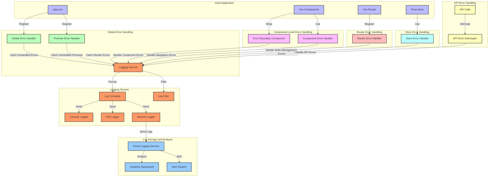

这个Mermaid图表代码描述了以下错误处理和日志架构：
1. Vue3 应用核心
    - App.vue 作为应用的主入口
    - Vue组件
    - Vue Router 用于路由管理
    - Pinia Store 用于状态管理

2. 全局错误处理
    - 全局错误处理器捕获未被组件捕获的错误
    - Promise错误处理器捕获未处理的Promise rejection

3. 组件级错误处理
    - 错误边界组件包裹其他组件，捕获渲染错误
    - 组件错误处理器用于处理组件内部的错误

4. 路由错误处理
    - 路由错误处理器捕获导航过程中的错误

5. 状态管理错误处理
    - Store错误处理器处理状态管理过程中的错误

6. API错误处理
    - API错误拦截器处理API调用过程中的错误

7. 日志服务
    - 中央日志服务接收所有错误和日志
    - 日志格式化器统一日志格式
    - 日志过滤器过滤不必要的日志
    - 支持控制台日志、文件日志和远程日志

8. 日志存储和分析
    - 云日志服务接收远程日志
    - 分析仪表板用于日志分析
    - 告警系统用于重要错误的实时通知

这个错误处理和日志架构图展示了：
- 多层次的错误捕获机制，确保应用的稳定性
- 统一的日志处理流程，便于问题诊断和分析
- 灵活的日志输出选项，适应不同的开发和生产需求
- 与云服务集成，支持高级日志分析和告警

:::tip
错误处理和日志记录策略应该与项目的整体监控和运维策略相结合。
:::

使用[Processon Mermaid](https://www.processon.com/mermaid)生成图片：


### 安全架构图
以一个使用`create-vue`搭建的Vue3初始项目为例，画安全架构图。

由于这是一个前端项目，我们将重点关注前端安全最佳实践和与后端交互的安全措施。以下是使用Mermaid语法描述的安全架构图代码：
```mermaid
graph TD
    subgraph "Client-Side Security"
        VUE[Vue3 Application]
        
        subgraph "Input Validation"
            IV[Input Validation]
            VUE --> IV
            IV --> |Sanitize| SAN[Input Sanitization]
            IV --> |Validate| VAL[Data Validation]
        end
        
        subgraph "XSS Protection"
            XSS[XSS Prevention]
            VUE --> XSS
            XSS --> |Use| ESCAPING[HTML Escaping]
            XSS --> |Implement| CSP[Content Security Policy]
        end
        
        subgraph "State Management Security"
            SMS[Secure State Management]
            VUE --> SMS
            SMS --> |Use| PINIA[Pinia Store]
            PINIA --> |Implement| STATE_ENCRYPTION[State Encryption]
        end
        
        subgraph "Secure Routing"
            SR[Secure Routing]
            VUE --> SR
            SR --> |Implement| ROUTE_GUARD[Navigation Guards]
        end
    end
    
    subgraph "API Security"
        API[API Calls]
        VUE --> |HTTPS| API
        
        API --> |Use| JWT[JWT Authentication]
        API --> |Implement| RATE_LIMIT[Rate Limiting]
        
        subgraph "CSRF Protection"
            CSRF[CSRF Prevention]
            API --> CSRF
            CSRF --> |Use| CSRF_TOKEN[CSRF Tokens]
        end
    end
    
    subgraph "Data Transit Security"
        DTS[Data Transit Security]
        API --> DTS
        DTS --> |Use| TLS[TLS 1.3]
        DTS --> |Implement| CERT_PINNING[Certificate Pinning]
    end
    
    subgraph "Secure Storage"
        SS[Secure Storage]
        VUE --> SS
        SS --> |Use| COOKIES[Secure Cookies]
        SS --> |Use| LOCAL_STORAGE[Encrypted Local Storage]
    end
    
    subgraph "Security Monitoring"
        SM[Security Monitoring]
        VUE --> SM
        SM --> |Implement| ERROR_LOGGING[Error Logging]
        SM --> |Use| SENTRY[Sentry Integration]
    end
    
    subgraph "Dependency Security"
        DS[Dependency Security]
        VUE --> DS
        DS --> |Use| NPM_AUDIT[npm audit]
        DS --> |Implement| SCA[Software Composition Analysis]
    end
    
    subgraph "Build and Deployment Security"
        BDS[Build & Deployment Security]
        VUE --> BDS
        BDS --> |Use| SOURCE_MAPS[Source Map Protection]
        BDS --> |Implement| MINIFICATION[Code Minification]
    end

    classDef default fill:#f9f,stroke:#333,stroke-width:2px;
    classDef vueSecurity fill:#bbf,stroke:#333,stroke-width:2px;
    classDef apiSecurity fill:#bfb,stroke:#333,stroke-width:2px;
    classDef dataSecurity fill:#fbf,stroke:#333,stroke-width:2px;
    classDef storageSecurity fill:#fbb,stroke:#333,stroke-width:2px;
    classDef monitoringSecurity fill:#bff,stroke:#333,stroke-width:2px;
    classDef dependencySecurity fill:#ffb,stroke:#333,stroke-width:2px;
    classDef buildSecurity fill:#f96,stroke:#333,stroke-width:2px;

    class VUE,IV,XSS,SMS,SR vueSecurity;
    class API,JWT,RATE_LIMIT,CSRF apiSecurity;
    class DTS,TLS,CERT_PINNING dataSecurity;
    class SS,COOKIES,LOCAL_STORAGE storageSecurity;
    class SM,ERROR_LOGGING,SENTRY monitoringSecurity;
    class DS,NPM_AUDIT,SCA dependencySecurity;
    class BDS,SOURCE_MAPS,MINIFICATION buildSecurity;

```

这个Mermaid图表代码描述了以下安全架构：
1. 客户端安全
    - 输入验证：包括输入净化和数据验证
    - XSS防护：使用HTML转义和内容安全策略（CSP）
    - 安全的状态管理：使用Pinia，并实现状态加密
    - 安全路由：实现导航守卫

2. API安全
    - 使用HTTPS进行API调用
    - JWT认证
    - 实现速率限制
    - CSRF防护：使用CSRF令牌

3. 数据传输安全
    - 使用TLS 1.3
    - 实现证书固定（Certificate Pinning）

4. 安全存储
    - 使用安全的Cookie
    - 加密本地存储

5. 安全监控
    - 实现错误日志记录
    - 集成Sentry进行实时错误跟踪

6. 依赖安全
    - 使用npm audit检查依赖漏洞
    - 实施软件成分分析（SCA）

7. 构建和部署安全
    - 保护源码映射文件
    - 实施代码压缩

这个安全架构图展示了：
- 全面的前端安全策略，涵盖从开发到部署的各个阶段
- 与后端API交互的安全措施
- 数据存储和传输的安全考虑
- 持续的安全监控和依赖管理

:::tip
安全是一个持续的过程，需要定期审查和更新安全策略。

在实际实现时，应该结合具体的技术栈和项目需求选择合适的安全库和工具。
:::

使用[Processon Mermaid](https://www.processon.com/mermaid)生成图片：

