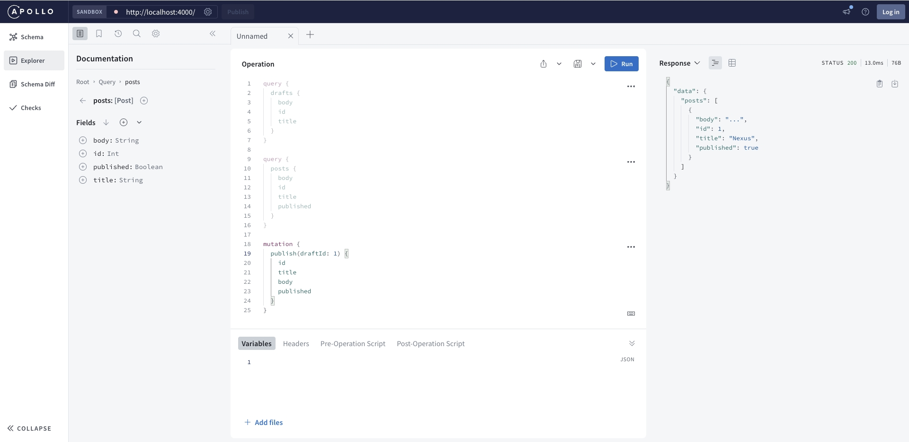
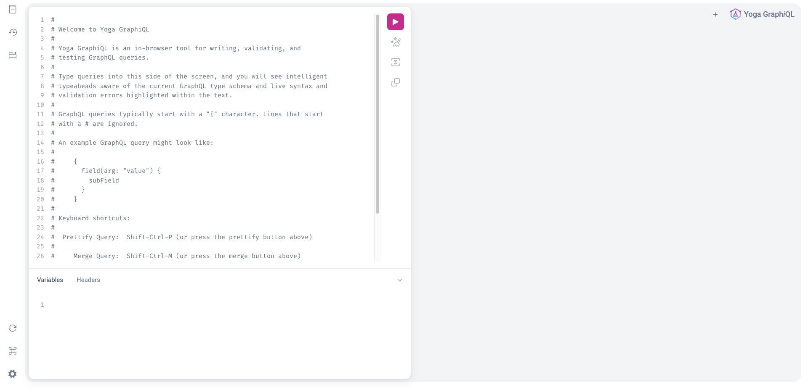
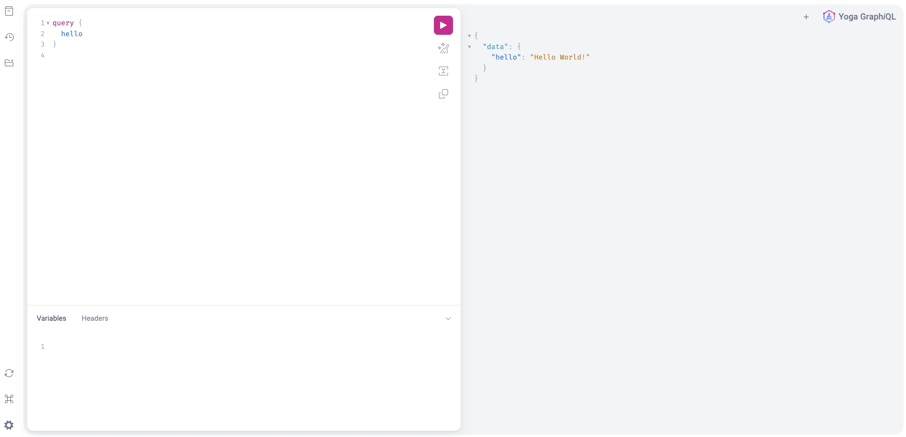
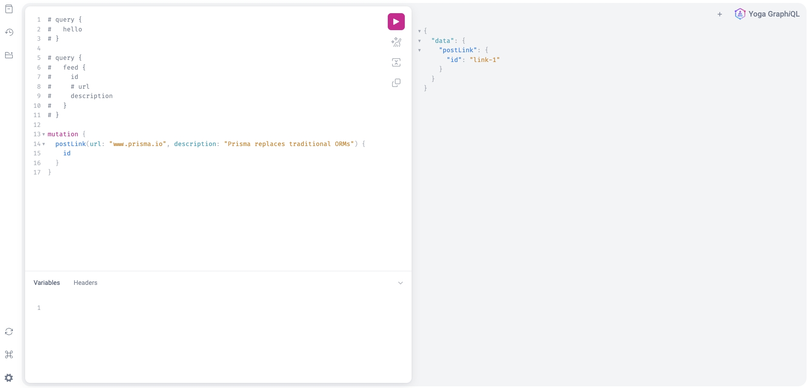
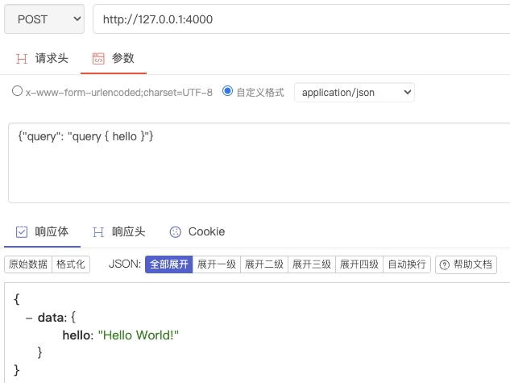

[GraphQL Weekly](https://www.graphqlweekly.com/)

[GraphQL](https://graphql.com/)是一种开源查询语言和 API 规范，使客户端能够请求特定数据，从而提高数据检索的效率和灵活性。

(官网)[GraphQL](http://www.graphql.org/)既是一种用于API的查询语言，也是一个使用基于类型系统来执行查询的服务端运行时（类型系统由你的数据定义）。GraphQL对您的API中的数据提供了一套易于理解的完整描述，使得客户端能够准确地获得它需要的数据，而且没有任何冗余，也让API更容易地随着时间推移而演进，还能用于构建强大的开发者工具。

GraphQL 查询不仅能够获得资源的属性，还能沿着资源间引用进一步查询。典型的 REST API 请求多个资源时得载入多个 URL，而 GraphQL 可以通过一次请求就获取你应用所需的所有数据。这样一来，即使是比较慢的移动网络连接下，使用 GraphQL 的应用也能表现得足够迅速。

GraphQL最适合的场景莫过于作为BFF（Backend for Frontend）的网关层，即根据客户端的实际需要，将后端的原始HSF接口、第三方RESTful接口进行整合和封装形成自己的Service Facade层。GraphQL自身的特性使得其非常容易与RESTful、MTOP/MOPEN等基于HTTP的现有网关进行集成。而另一方面，GraphQL非常适合作为Serverless/FaaS的网关层，只需要唯一一个HTTP Trigger就能实现代理所有背后的API。

GraphQL 在需要高度定制化和实时数据更新的场景中，成为一种更具吸引力的选择。

Apollo GraphQL Server是目前使用最广泛的开源GraphQL服务，它的Node.js版本更是被BFF类应用广为使用。

## [GraphQL 入门](https://graphql.cn/learn/)
GraphQL 并没有和任何特定数据库或者存储引擎绑定，而是依靠你现有的代码和数据支撑。

一个 GraphQL 服务是通过定义类型和类型上的字段来创建的，然后给每个类型上的每个字段提供解析函数。

一旦一个 GraphQL 服务运行起来（通常在 web 服务的一个 URL 上），它就能接收 GraphQL 查询，并验证和执行。接收到的查询首先会被检查确保它只引用了已定义的类型和字段，然后运行指定的解析函数来生成结果。

### [GraphQL SDL — Schema Definition Language](https://www.prisma.io/blog/graphql-sdl-schema-definition-language-6755bcb9ce51)
GraphQL SDL 用于定义接口数据结构，例如博客应用程序的 GraphQL schema可以如下定义：
```js
type Post {
  id: String!
  title: String!
  publishedAt: DateTime!
  likes: Int! @default(value: 0)
  blog: Blog @relation(name: "Posts")
}

type Blog {
  id: String!
  name: String!
  description: String
  posts: [Post!]! @relation(name: "Posts")
}
```

#### Type
type可以使用`implements`继承其他type
```js
type Post implements Item {
  # ...
}
```

#### Field
一个字段有一个name和一个类型，[内置标量类型](https://spec.graphql.org/June2018/#sec-Scalars)有（标量类型是表示单一值的数据类型）：
- Int
- Float
- String
- Boolean
- ID

不可为 `null` 的字段用感叹号标识：`age: Int!`

数组用方括号标识：`names: [String!]`

GraphQL 允许您自定义标量类型，使用`scalar`。

可以借助[graphql-scalars](https://the-guild.dev/graphql/scalars)自定义类型安全的标量类型：
```bash
npm i graphql-scalars
```

可以将`graphql-scalars`与GraphQL Yoga结合使用：
```ts
import { DateTimeResolver, DateTimeTypeDefinition } from 'graphql-scalars'
import { createSchema, createYoga } from 'graphql-yoga'
 
export const schema = createSchema({
  typeDefs: /* GraphQL */ `
    ${DateTimeTypeDefinition}
    type Query {
      time: DateTime
    }
  `,
  resolvers: {
    DateTime: DateTimeResolver
  }
})
 
// Create a Yoga instance with a GraphQL schema.
const yoga = createYoga({ schema })
```

#### Enum
使用`enum`定义枚举：
```js
enum Category {
  PROGRAMMING_LANGUAGES
  API_DESIGN
}
```

#### Interface
`interface`可以定义一组字段，这些字段必须有相同的类型：
```js
interface Item {
  title: String!
}
```

#### 指令
- `@defaultValue`指令
  ```js
  name: String! @defaultValue(value: "new blogpost")
  ```


## [GraphQL Playground](https://github.com/prisma/graphql-playground)
GraphQL Playground 是一个“GraphQL IDE”，允许您通过向 GraphQL API 发送query和mutation来交互式地探索 GraphQL API 的功能。它有点类似于 Postman 为 REST API 提供的功能。除此之外，GraphQL Playground：
- 自动生成所有可用 API 操作的综合文档。

- 提供一个编辑器，您可以在其中编写queries、mutations、subscriptions，并具有自动完成和语法突出显示功能。

- 让您轻松共享您的API操作。

GraphQL Playground 也有对应的Chrome扩展：[GraphQL Playground for Chrome](https://chromewebstore.google.com/detail/graphql-playground-for-ch/kjhjcgclphafojaeeickcokfbhlegecd?utm_source=ext_app_menu)

## [GraphQL 的全栈教程](https://www.howtographql.com/)

### 使用 GraphQL 的理由
> [使用 GraphQL 的 5 大理由以及如何使用](https://www.prisma.io/blog/top-5-reasons-to-use-graphql-b60cfa683511)

使用 GraphQL，客户端可以准确指定查询中所需的数据。请注意，服务器响应的结构完全遵循查询中定义的嵌套结构。

有三个因素一直在挑战 API 的设计方式：
- 移动设备使用量的增加产生了对高效数据加载的需求

  移动使用量的增加、低功耗设备和糟糕的网络是 Facebook 开发 GraphQL 的最初原因。 GraphQL 最大限度地减少了需要通过网络传输的数据量，从而大大改进了在这些条件下运行的应用程序。

- 各种不同的前端框架和平台

  运行客户端应用程序的前端框架和平台的异构环境使得构建和维护一种能够满足所有人需求的 API 变得困难。借助 GraphQL，每个客户端都可以精确访问其所需的数据。

- 快速开发和对快速功能开发的期望

  持续部署已经成为很多公司的标准，快速迭代和频繁的产品更新是必不可少的。使用 REST API，服务器公开数据的方式通常需要修改，以适应客户端的特定要求和设计更改。这阻碍了快速开发实践和产品迭代。

由于 GraphQL 的灵活性，可以在客户端进行更改，而无需在服务器上进行任何额外工作。由于客户可以明确自己的数据需求，当前端的设计和数据需求发生变化时，后端工程师无需进行调整。

GraphQL 使用强类型系统来定义 API 的功能。 API 中公开的所有类型均使用 GraphQL 架构定义语言 (SDL) 写在架构中。该模式充当客户端和服务器之间的契约，用于定义客户端如何访问数据。

### Schema Definition Language (SDL)
GraphQL 的schema通常用 [Schema Definition Language](https://www.prisma.io/blog/graphql-sdl-schema-definition-language-6755bcb9ce51) (SDL) 编写。 SDL 有一个类型系统，允许您定义数据结构。构建GraphQL schema通常有[两种方式](https://www.prisma.io/blog/the-problems-of-schema-first-graphql-development-x1mn4cb0tyl3)：
- SDL 优先（SDL-first）：手动编写 GraphQL schema
- 代码优先（Code-first）：使用代码定义并生成GraphQL schema

创建GraphQL Schema的流行的开源库：
- [`graphql`](https://graphql.org/graphql-js/type) GraphQL官方规范及其 JavaScript 参考实现
  ```js
  const { GraphQLSchema, GraphQLObjectType, GraphQLString } = require('graphql')

  const schema = new GraphQLSchema({
    query: new GraphQLObjectType({
      name: 'Query',
      fields: {
        hello: {
          type: GraphQLString,
          args: {
            name: { type: GraphQLString },
          },
          resolve: (_, args) => `Hello ${args.name || 'World!'}`,
        },
      },
    }),
  })
  ```
- [`@graphql-tools/schema`](https://graphql-tools.com/docs/generate-schema) 推广SDL-first，比使用`graphql`编写的schema更具可读性和更容易理解。
  ```js
  const { makeExecutableSchema } = require('graphql-tools')

  const typeDefs = `
  type Query {
    hello(name: String): String
  }
  `

  const resolvers = {
    Query: {
      hello: (_, args) => `Hello ${args.name || 'World!'}`,
    },
  }

  const schema = makeExecutableSchema({
    typeDefs,
    resolvers,
  })
  ```
- [`pothos`](https://github.com/hayes/pothos) (2.3k star)是一个基于插件的 Typescript GraphQL schema构建器
- [`GraphQL Nexus`](https://nexusjs.org/) (3.4k star)是一个用于 JavaScript/TypeScript 的代码优先、类型安全的 GraphQL schema构建库
- [`typegraphql`](https://github.com/MichalLytek/type-graphql) (8k star)使用类和一些装饰器帮助定义schema
- [`graphql-modules`](https://graphql-modules.com/) (1.3k star)
- [`gqtx`](https://github.com/sikanhe/gqtx) (452 star)

:::info
Learn more:
- [GraphQL Server Basics (Part I): GraphQL Schemas, TypeDefs & Resolvers Explained](https://www.prisma.io/blog/graphql-server-basics-the-schema-ac5e2950214e)
- [GraphQL Server Basics (Part II): The Network Layer](https://www.prisma.io/blog/graphql-server-basics-the-network-layer-51d97d21861)
- [GraphQL Server Basics (Part III): Demystifying the info argument in GraphQL resolvers](https://www.prisma.io/blog/graphql-server-basics-demystifying-the-info-argument-in-graphql-resolvers-6f26249f613a)
:::

#### SDL 优先（SDL-first）
其优点有：
- 容易理解，能够快速模拟API
- 每个新的API需要首先在schema中体现，schema定义可以作为API文档
- schema定义可以作为前端和后端团队之间的沟通工具，前端可以更多地参与 API 设计

例如，使用 SDL 定义一个名为 Person 的简单类型：
```js
// !表示字段是必需的
type Person {
  name: String!
  age: Int!
}
```

类型是可以互相关联的：
```js
// 文章类型与人类型关联，一对多的关系
type Post {
  title: String!
  author: Person!
}

type Person {
  name: String!
  age: Int!
  posts: [Post!]!
}
```

:::info
root types:
```js
type Query {
  // ...
}
type Mutation {
  // ...
}
type Subscription {
  // ...
}
```
以上root types是客户端发送请求的入口点，例如：
```js
type Query {
  allPersons(last: Int): [Person!]!
  allPosts(last: Int): [Post!]!
}

type Mutation {
  createPerson(name: String!, age: Int!): Person!
  updatePerson(id: ID!, name: String!, age: Int!): Person!
  deletePerson(id: ID!): Person!
}

type Subscription {
  newPerson: Person!
}

type Person {
  id: ID!
  name: String!
  age: Int!
  posts: [Post!]!
}

type Post {
  title: String!
  author: Person!
}
```
:::

虽然 SDL-first 具有许多优势，但过去两年的情况表明，将其扩展到更大的项目具有挑战性。在更复杂的环境中会出现许多问题：
1. schema定义和解析器函数不一致

对于 SDL-first，schema定义必须与解析器实现的确切结构相匹配。这意味着开发人员需要确保schema定义始终与解析器同步！但随着schema增长到数百或数千行（作为参考，GitHub GraphQL schema有超过 10k 行），这实际上变得不可能。

有一些工具可以帮助保持schema定义和解析器同步。例如，通过使用 [`graphqlgen`](https://github.com/prisma/graphqlgen) 或 [`graphql-code-generator`](https://github.com/dotansimha/graphql-code-generator) 等库生成代码。

2. GraphQL schema的模块化

编写大型 GraphQL schema时，您通常不希望所有 GraphQL 类型定义（type definitions）都驻留在同一个文件中。相反，您希望将它们分成更小的部分（例如根据功能或产品拆分）

像 [`graphql-import`](https://github.com/prisma/graphql-import) 或更新的 [`graphql-modules`](https://graphql-modules.com/) 库这样的工具可以帮助解决这个问题。 `graphql-import` 以编写 SDL 注释的形式使用自定义导入语法。 `graphql-modules` 是一个工具集，可帮助进行schema分离、解析器组合以及 GraphQL 服务器的可扩展结构的实现。

3. schema定义中的冗余

该问题目前缺乏通用的解决方案

4. IDE 支持和开发人员体验

SDL 通常在程序中表示为纯字符串，这意味着工具无法识别其中的任何结构。

解决方案：[`graphql-tag`](https://github.com/apollographql/graphql-tag) 库公开了 `gql` 函数，该函数将 GraphQL 字符串转换为 AST，从而支持静态分析以及由此产生的功能。除此之外，还有各种编辑器插件，例如 VS Code 的 GraphQL 或 Apollo GraphQL 插件。

5. 组合 GraphQL schema

模块化schema的想法还引出了另一个问题：如何将多个现有（和分布式）schema组合成单个schema。

解决方案：最流行的schema组合方法是schema拼接，它也是上述 `graphql-tools` 库的一部分。为了更好地控制schema的组成方式，您还可以直接使用schema委托（schema拼接的子集）。

6. 忽略了编程语言的个体特征

#### 代码优先（Code-first）
大多数 SDL-first 问题来自于我们需要将手动编写的 SDL schema映射到编程语言，这种映射导致需要额外的工具。

[GraphQL Nexus](https://nexusjs.org/) 是一个用于 JavaScript/TypeScript 的代码优先、类型安全的 GraphQL schema构建库。

虽然作为代码优先框架(以编程方式构建GraphQL schema)，GraphQL Nexus 仍然可以用于schema-first开发。

### 使用Queries获取数据
- 基本查询（Basic Queries）
  ```js
  {
    allPersons { // root field
      name // payload
    }
  }
  ```
  示例查询中的 `allPersons` 字段称为查询的根字段。根字段后面的所有内容都称为查询的有效负载。此查询有效负载中指定的唯一字段是`name`。

  此查询将返回当前存储在数据库中的所有人员的列表。这是一个响应示例:
  ```js
  {
    "allPersons": [
      { "name": "Johnny" },
      { "name": "Sarah" },
      { "name": "Alice" }
    ]
  }
  ```
  因为 `name` 是查询中指定的唯一字段，所以不会返回其他额外字段，如果客户端还需要`age`字段，则需要调整query的payload:
  ```js
  {
    allPersons {
      name
      age
    }
  }
  ```
  GraphQL 的主要优点之一是它允许自然地查询嵌套信息。例如，如果您想查询某个人撰写的所有帖子，您可以简单地按照类型的结构来请求此信息：
  ```js
  {
    allPersons {
      name
      age
      posts {
        title
      }
    }
  }
  ```

- 带参查询

  在 GraphQL 中，每个字段可以有零个或多个参数，例如：
  ```js
  {
    allPersons(last: 2) {
      name
    }
  }
  ```

### 通过Mutations更新数据
mutations一般有3种：创建新数据、更新现有数据、删除现有数据。例如，创建一个Person：
```js
mutation {
  createPerson(name: "Bob", age: 36) {
    name
    age
  }
}
```
如上的mutation对应的服务器响应如下：
```js
"createPerson": {
  "name": "Bob",
  "age": 36,
}
```
GraphQL 类型具有唯一的 ID，这些 ID 是在创建新对象时由服务器生成的。
```js
type Person {
  id: ID!
  name: String!
  age: Int!
}

mutation {
  createPerson(name: "Alice", age: 36) {
    id
  }
}
```

### 通过Subscriptions实时更新
当客户端订阅事件时，它将启动并保持与服务器的稳定连接。每当该特定事件实际发生时，服务器就会将相应的数据推送到客户端。subscriptions代表发送到客户端的数据流。
```js
subscription {
  newPerson {
    name
    age
  }
}
```
如上客户端将此`subscription`发送到服务器后，它们之间将打开连接。然后，每当执行新的`mutation`来创建新的 Person 时，服务器都会将该人的信息发送到客户端：
```js
{
  "newPerson": {
    "name": "Jane",
    "age": 23
  }
}
```

### GraphQL服务的3种架构
#### 连接数据库的GraphQL服务
当查询到达 GraphQL 服务器时，服务器会读取查询的有效负载并从数据库中获取所需的信息。然后，它构造响应对象并将其返回给客户端。

GraphQL 实际上与传输层无关。这意味着它可以与任何可用的网络协议一起使用。因此，有可能实现基于 TCP、WebSocket 等的 GraphQL 服务器。

GraphQL 也不关心数据库或用于存储数据的格式。您可以使用 SQL 数据库（例如 AWS Aurora）或 NoSQL 数据库（例如 MongoDB）。

#### 作为网关的GraphQL服务
客户端应用程序，只需与 GraphQL 服务器通信即可获取所需的数据。然后，GraphQL 服务器负责从现有系统中获取数据并将其打包为 GraphQL 响应格式。

#### 既连接数据库又作为网关的GraphQL服务
当服务器收到查询时，它将对其进行解析，并从连接的数据库或一些集成的 API 中检索所需的数据。

### 解析器函数(Resolver Functions)
GraphQL query（或mutation）的payload由一组字段组成。在 GraphQL服务器端实现中，这些字段中的每一个实际上都对应于一个称为解析器的函数。解析器函数的唯一目的是获取其字段的数据。

当服务器收到query时，它将调用query payload中指定的字段的所有函数。因此，它解析了query并能够检索每个字段的正确数据。一旦所有解析器return，服务器将以query描述的格式打包数据并将其发送回客户端。

每个 GraphQL 解析器函数都会接收四个输入参数:
- 第一个参数通常称为`parent`，指的是上一个解析器函数的返回值
- 第二个参数为`args`，指的是对应字段传的参数
- 第三个参数为`context`，是一个在所有解析器之间共享的纯 JavaScript 对象。例如，如果用户登录到您的应用程序，那么让所有解析器都可以使用有关该用户的信息将很有用

### GraphQL 客户端
我们应该使用 GraphQL 客户端来执行重复且与我们正在构建的应用程序无关的任务。例如，能够发送query和mutation，而不必担心较低级别的网络细节或维护本地缓存。这是我们在任何与 GraphQL 服务器通信的前端应用程序中都需要的功能。

有多个可用的 GraphQL 客户端库，它们都使我们能够对正在进行的 GraphQL 操作进行不同程度的控制，并具有不同的优点和缺点。对于非常简单的用例（例如编写脚本），[graphql-request](https://github.com/prisma-labs/graphql-request) 可能已经足以满足我们的需求。

您可能正在编写一个更大的应用程序，希望从缓存、乐观的 UI 更新和其他方便的功能中受益。在这些情况下，您可能需要使用完整的 GraphQL 客户端来处理所有 GraphQL 操作的生命周期。您可以选择 [Apollo Client](https://github.com/apollographql/apollo-client)、[Relay](https://facebook.github.io/relay/) 和 [urql](https://github.com/FormidableLabs/urql)。

#### Relay
Relay 是 Facebook 自主开发的 GraphQL 客户端，于 2015 年与 GraphQL 一起开源。它融合了 Facebook 自 2012 年开始使用 GraphQL 以来收集的所有知识。Relay 针对性能进行了大量优化，并尝试尽可能减少网络流量。一个有趣的旁注是，Relay 本身实际上最初是一个路由框架，最终与数据加载职责结合在一起。因此，它演变成一个强大的数据管理解决方案，可在 JavaScript 应用程序中用于与 GraphQL API 进行交互。

Relay 的性能优势是以显著的学习曲线为代价的。 Relay 是一个复杂的框架，理解其所有复杂性确实需要一些时间。随着 1.0 版本（称为 [Relay Modern](http://facebook.github.io/relay/docs/en/introduction-to-relay.html)）的发布，这方面的整体情况有所改善，但如果您正在寻找刚刚开始使用 GraphQL 的客户端，Relay 可能还不是正确的选择。

#### Apollo Client
Apollo Client 是社区驱动的项目，旨在构建易于理解、灵活且强大的 GraphQL 客户端。 Apollo Client有对应 React、Angular、Ember 或 Vue 等流行框架以及早期版本的 iOS 和 Android 客户端的开发库。 Apollo 已做好生产准备，并具有缓存、乐观 UI、订阅支持等功能。
- [Apollo Client](https://www.apollographql.com/docs/react/)
- [Vue Apollo](https://github.com/vuejs/apollo)
- [Apollo Angular](https://github.com/kamilkisiela/apollo-angular)
- [ember-apollo-client](https://github.com/ember-graphql/ember-apollo-client)
- [Apollo iOS](https://www.apollographql.com/docs/ios/)
- [Apollo Kotlin](https://www.apollographql.com/docs/kotlin/)

#### urql
与 Relay 和 Apollo 相比，urql 是 GraphQL 客户端更加动态的一个解决方案，也是一个更新的项目。虽然它高度关注 React，但其核心关注的是简单性和可扩展性。它配备了构建高效 GraphQL 客户端的准系统，但让您可以完全控制它如何通过“交换”处理 GraphQL 操作和结果。与 `@urql/exchange-graphcache` 一起使用，它在功能上与 Apollo 基本相同，但占用空间更小，并且 API 非常集中。

### GraphQL 服务端
#### [GraphQL Yoga](https://the-guild.dev/graphql/yoga-server)
功能齐全的 GraphQL Server，专注于轻松设置、性能和出色的开发人员体验。(8.1k star)

:::warning
`@graphql-yoga/node`已被弃用，请使用`graphql-yoga`
:::

#### [Apollo Server](https://github.com/apollographql/apollo-server)
13.7k star

[`graphql-scalars`与`apollo-server`结合使用](https://the-guild.dev/graphql/scalars/docs/usage/apollo-server)

## [使用GraphQL Nexus和Apollo Server构建GraphQL HTTP服务](https://nexusjs.org/docs/getting-started/tutorial/chapter-setup-and-first-query/)
GraphQL Nexus 是一个用于 JavaScript/TypeScript 的代码优先、类型安全的 GraphQL schema构建库。

GraphQL Nexus 会动态生成类型，启动服务时，每当您保存文件，它都会更新生成的类型。

```bash
mkdir nexus-tutorial && cd nexus-tutorial
npm init -y
npm install nexus graphql apollo-server
npm install --save-dev typescript ts-node-dev
```

### 定义type
```ts
import { objectType } from 'nexus'

export const Post = objectType({
  name: 'Post',
  definition(t) {
      t.int('id')
      t.string('title')
      t.string('body')
      t.boolean('published')
  },
})
```

### 编写Query
```ts
import { extendType } from 'nexus'

export const PostQuery = extendType({
  type: 'Query',
  definition(t) {
      t.nonNull.list.field('drafts', {
        type: 'Post',
        resolve(_root, _args, ctx) {
          return ctx.db.posts.filter(p => p.published === false)
        }
      })
      t.list.field('posts', {
        type: 'Post',
        resolve(_root, _args, ctx) {
          return ctx.db.posts.filter(p => p.published === true)
        }
      })
  },
})
```

### 编写Mutation
```ts
import { extendType, stringArg, nonNull, intArg } from 'nexus'

export const PostMutation = extendType({
  type: 'Mutation',
  definition(t) {
      t.nonNull.field('createDraft', {
        type: 'Post',
        args: {
          title: nonNull(stringArg()),
          body: nonNull(stringArg()),
        },
        resolve(_root, args, ctx) {
          const draft = {
            id: ctx.db.posts.length + 1,
            title: args.title,
            body: args.body,
            published: false,
          }
          ctx.db.posts.push(draft)
          return draft
        }
      })
      t.field('publish', {
        type: 'Post',
        args: {
          draftId: nonNull(intArg()),
        },
        resolve(_root, args, ctx) {
          let draftToPublish = ctx.db.posts.find(p => p.id === args.draftId)

          if (!draftToPublish) {
            throw new Error('Could not find draft with id ' + args.draftId)
          }

          draftToPublish.published = true

          return draftToPublish
        }
      })
  },
})
```

### 构建schema
```ts
import { makeSchema } from 'nexus'
import { join } from 'path'
import * as types from './graphql'

export const schema = makeSchema({
  types,
  outputs: {
    typegen: join(__dirname, '..', 'nexus-typegen.ts'),
    schema: join(__dirname, '..', 'schema.graphql'),
  },
  contextType: {
    module: join(__dirname, "./context.ts"),
    export: "Context",
  }
})
```



### 系统级测试
```bash
npm install --save-dev jest @types/jest ts-jest graphql-request get-port@5.1.1
```


## [使用GraphQL Yoga构建GraphQL HTTP服务器](https://the-guild.dev/graphql/yoga-server/tutorial/basic)
```bash
mkdir hackernews-node-ts
cd hackernews-node-ts
npm init -y
npm i -D --save-exact typescript@5.1.6 @types/node@18.16.16 ts-node@10.9.1 ts-node-dev@2.0.0 cross-env@7.0.3
npx tsc --init
```
```json title="package.json"
{
  "name": "hackernews-node-ts",
  "version": "1.0.0",
  "description": "",
  "scripts": {
    "dev": "cross-env NODE_ENV=development ts-node-dev --exit-child --respawn src/main.ts",
    "start": "ts-node src/main.ts"
  },
  "devDependencies": {
    "cross-env": "7.0.3",
    "@types/node": "18.16.16",
    "ts-node": "10.9.1",
    "ts-node-dev": "2.0.0",
    "typescript": "5.1.6"
  }
}
```
- `npm run start` - will start the server.
- `npm run dev` - will start the server and restarts it on every change.

```bash
npm i graphql@16.6.0 graphql-yoga@5.x.x
```

### 创建GraphQL Schema
```bash
npm i graphql@16.6.0 graphql-yoga@5.x.x
```

创建`src/schema.ts`，GraphQL schema公开了 API 层可以执行的所有类型和功能的集合，要使用 GraphQL schema，您需要编写 GraphQL query。
```ts title="src/schema.ts"
import { createSchema } from 'graphql-yoga'

type Link = {
  id: string
  url: string
  description: string
}
 
const links: Link[] = [
  {
    id: 'link-0',
    url: 'www.howtographql.com',
    description: 'Fullstack tutorial for GraphQL'
  }
]

const typeDefinitions = /* GraphQL */ `
  type Query {
    info: String!
    feed: [Link!]!
  }
 
  type Mutation {
    postLink(url: String!, description: String!): Link!
  }
 
  type Link {
    id: ID!
    description: String!
    url: String!
  }
`

const resolvers = {
  Query: {
    info: () => `This is the API of a Hackernews Clone`,
    feed: () => links
  },
  Mutation: {
    postLink: (parent: unknown, args: { description: string; url: string }) => {
      let idCount = links.length
 
      const link: Link = {
        id: `link-${idCount}`,
        description: args.description,
        url: args.url
      }
 
      links.push(link)
 
      return link
    }
  }
}

export const schema = createSchema({
  resolvers: [resolvers],
  typeDefs: [typeDefinitions]
})
```

### 解析并执行GraphQL query
如下，可以使用`graphql`解析并执行`query`：
```ts
import { schema } from './schema'
import { execute, parse } from 'graphql'

async function main() {
  const myQuery = parse(/* GraphQL */ `
    query {
      hello
    }
  `)
 
  const result = await execute({
    schema,
    document: myQuery
  })
 
  console.log(result)
}
 
main()
```

### 创建 GraphQL HTTP 服务器
```ts title="src/index.ts"
import { createServer } from 'node:http'
import { createYoga } from 'graphql-yoga'
import { schema } from './schema'
 
function main() {
  const yoga = createYoga({ schema })
  const server = createServer(yoga)
  server.listen(4000, () => {
    console.info('Server is running on http://localhost:4000/graphql')
  })
}
 
main()
```
启动后，浏览器访问`http://localhost:4000/graphql`:


上图中，可以在左侧的编辑区编写`query`，编写后点击Play就会执行`query`:


也可以编写`mutation`，同样点击Play会执行：


:::tip
- 可以设置服务的入口为'/'，设置后启动，浏览器访问`http://localhost:4000`即可
  ```js
  const yoga = createYoga({
    schema,
    graphqlEndpoint: '/',
  })
  ```

- 也可以使用`curl`或者postman发起请求：
  ```bash
  curl -X POST http://localhost:4000/graphql -H "Content-type: application/json" --data-raw '{"query": "query { hello }"}'
  ```
  
:::

## [Apollo Client](https://www.apollographql.com/docs/react/get-started)
1. 新建React工程
   ```bash
   pnpm create vite
   ```

2. 安装依赖`@apollo/client`和`graphql`，`@apollo/client`包括内存缓存、本地状态管理、错误处理和基于 React 的视图层；`graphql`提供了解析 GraphQL 查询的逻辑，`@apollo/client`使用其中的一些功能。
   ```bash
   pnpm add @apollo/client graphql
   ```

3. 初始化ApolloClient
   ```jsx title="src/main.tsx"
   import React from 'react';
   import * as ReactDOM from 'react-dom/client';
   import { ApolloClient, InMemoryCache, ApolloProvider, gql } from '@apollo/client';
   import App from './App';

   const client = new ApolloClient({
     uri: 'http://localhost:4000', // 指定 GraphQL 服务器的 URL
     cache: new InMemoryCache(), // 用于缓存获取的查询结果
   });

   const root = ReactDOM.createRoot(document.getElementById('root'));

   root.render(
     <ApolloProvider client={client}>
       <App />
     </ApolloProvider>,
   );
   ```

4. 使用`useQuery`获取数据
   ```jsx title="src/App.tsx"
   import { useQuery, gql } from '@apollo/client';

   const GET_POSTS = gql`
     query GetPosts {
       posts {
         body
         id
         title
         published
       }
     }
   `;

   function App() {
     const { loading, error, data } = useQuery(GET_POSTS);

     if (loading) return <p>Loading...</p>;
     if (error) return <p>Error : {error.message}</p>;

     return data.posts.map(({ id, title, body, published }) => (
       <div key={id}>
         <h3>{title}</h3>
         <p>{ body }</p>
         <br />
         <b>About this location:</b>
         <p>{ published+'' }</p>
         <br />
       </div>
     ));
   }

   export default App
   ```

## [GraphQL Code Generator](https://the-guild.dev/graphql/codegen/docs/getting-started)