## 什么是CDN
内容分发网络（Content Delivery Network，CDN）通过将站点内容发布至遍布全球的海量加速节点，使其用户可就近获取所需内容，避免因网络拥堵、跨运营商、跨地域、跨境等因素带来的网络不稳定、访问延迟高等问题，有效提升下载速度、降低响应时间，提供流畅的用户体验。

内容分发网络 (CDN) 使用分布式服务器网络向用户分发资源，从而提升网站性能。由于 CDN 可以减少服务器负载，因此可以降低服务器成本，并且非常适合处理流量高峰。

当用户访问某个网站时，来自该网站服务器的数据必须通过互联网传输到用户的计算机。如果用户距离该服务器较远，则加载大文件（例如视频或网站图像）将需要很长时间。相反，如果网站内容存储在距离用户较近的 CDN 服务器上，就可以更快到达他们的计算机。

CDN 通过在客户端和网站服务器之间引入中间服务器来提高效率。这些 CDN 服务器将管理客户端与服务器之间的一些通信。它们可以降低传送到 Web 服务器的 Web 流量、减少带宽消耗，并改善应用程序的用户体验。

## CDN 有哪些优势？
- 加快页面加载速度
  
  如果您的页面加载速度太慢，网站流量可能会减少。CDN 可以降低跳出率并增加用户在您网站上停留的时间。

- 降低带宽成本
  
  带宽成本是一笔巨大的开支，因为每个传入的网站请求都会消耗网络带宽。通过缓存和其他优化，CDN 可以减少原始服务器必须提供的数据量，从而降低网站所有者的托管成本。

- 提高内容可用性
  
  同一时间的访客过多或网络硬件故障可能会导致网站崩溃。CDN 服务可以处理更多 Web 流量并降低 Web 服务器的负载。此外，如果一台或多台 CDN 服务器离线，其他运营服务器可以替换它们，以确保服务不中断。

- 提高网站安全性
  
  分布式拒绝服务（DDoS）攻击试图通过向网站发送大量虚假流量来关闭应用程序。CDN 可以通过在多个中间服务器之间分配负载来处理此类流量峰值，从而降低对原始服务器的影响。

概括来讲，CDN 的性能优势源于几个原则：
- CDN 服务器比源服务器离用户更近，因此具有较短的往返时间 (RTT) 延迟时间；
- 网络优化使 CDN 能够比从源服务器“直接”加载内容时更快地传送内容；
- CDN 缓存消除了将请求发送到源服务器的需求。

## CDN 可以分发哪些互联网内容？
内容分发网络（CDN）可以分发两种类型的内容：静态内容和动态内容。
- 静态内容
  
  静态内容是指在不同请求中访问到的数据都是相同的静态文件。例如：图片、视频、网站中的文件（html、css、js）、软件安装包、apk文件、压缩包文件等。

  CDN加速图片小文件业务可以帮您解决以下问题：
  - 终端用户访问慢：网站小文件内容多、打开速度太慢。

  - 跨区域访问质量差：终端用户分布在不同区域，不同区域的访问速度和质量高低不一。

  - 高并发压力大：运营推广期间，源站服务器压力大，服务器容易崩溃，造成服务不可用。

  - 图片格式分辨率处理复杂：无法根据适合的终端情况进行图片压缩和优化。

- 动态内容
  
  动态内容是指在不同请求中访问到的数据不相同的动态内容。例如：网站中的文件（asp、jsp、php、perl、cgi）、API接口、数据库交互请求等。当您访问这些动态内容时，每次都需要访问您的服务器，由服务器动态生成实时的数据并返回给您。因此CDN的缓存加速不适用于加速动态内容，CDN无法缓存实时变化的动态内容。对于动态内容请求，CDN节点只能转发回您的服务器源站，没有加速效果。

## CDN 的用途是什么？
以下是一些示例使用场景。
- 高速内容分发
  
  通过结合静态和动态互联网内容分发，您可以使用 CDN 为您的客户提供全球、高性能、全站点体验。

- 实时响应
  
  CDN 有助于以可靠且经济高效的方式分发丰富、高质量的媒体文件。流媒体视频和音频的公司使用 CDN 来克服三个挑战：降低带宽成本、增加规模和加快分发速度。

- 多用户扩展
  
  CDN 有助于支持大量并发用户。网站资源能够同时管理的客户端连接数量有限。CDN 可以通过减轻应用程序服务器的负载来快速扩展这一数量。

[腾讯云CDN官网](https://cloud.tencent.com/product/cdn)列出的应用场景有：
- 网站加速
  
  针对门户网站、电商、UGC 社区等业务场景，提供了强大的静态内容（如网页样式、图片、小文件）加速分发处理能力，显著提升了网页用户的体验。

  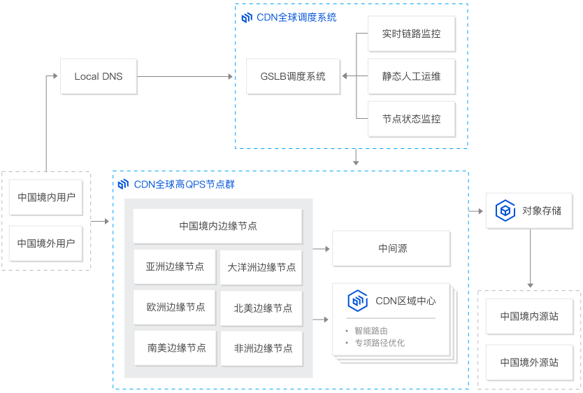

- 下载加速
  
  针对游戏安装包获取、手机 ROM 升级、应用程序包下载等业务场景，提供稳定、优质的下载加速。海量弹性带宽储备，具备突发性超大流量承载能力，让业务用户获得极速的下载体验。

  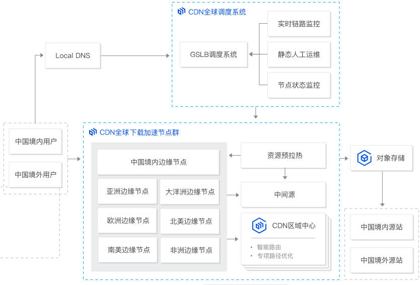

- 音视频加速
  
  针对在线音视频播放业务场景，依托腾讯多年在线视频运营经验，支撑高峰期海量并发，有效保证服务的高可用性和媒体传输速度，提供稳定、流畅、丰富的观看体验。

  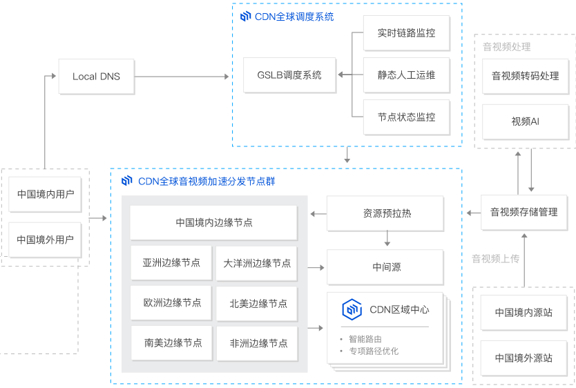

## CDN 的工作原理
内容分发网络（CDN）通过在多个地理位置建立一个入网点（PoP）或一组 CDN 边缘服务器来工作。这个分布在不同地理位置的网络基于缓存、动态加速和边缘逻辑计算的原则工作。(边缘计算，即使用智能通信的智能设备管理带宽消耗。自治和自我管理的边缘网络可能是 CDN 技术的发展方向。)

[腾讯云CDN官网](https://cloud.tencent.com/product/cdn)列出的CDN全球节点分布:
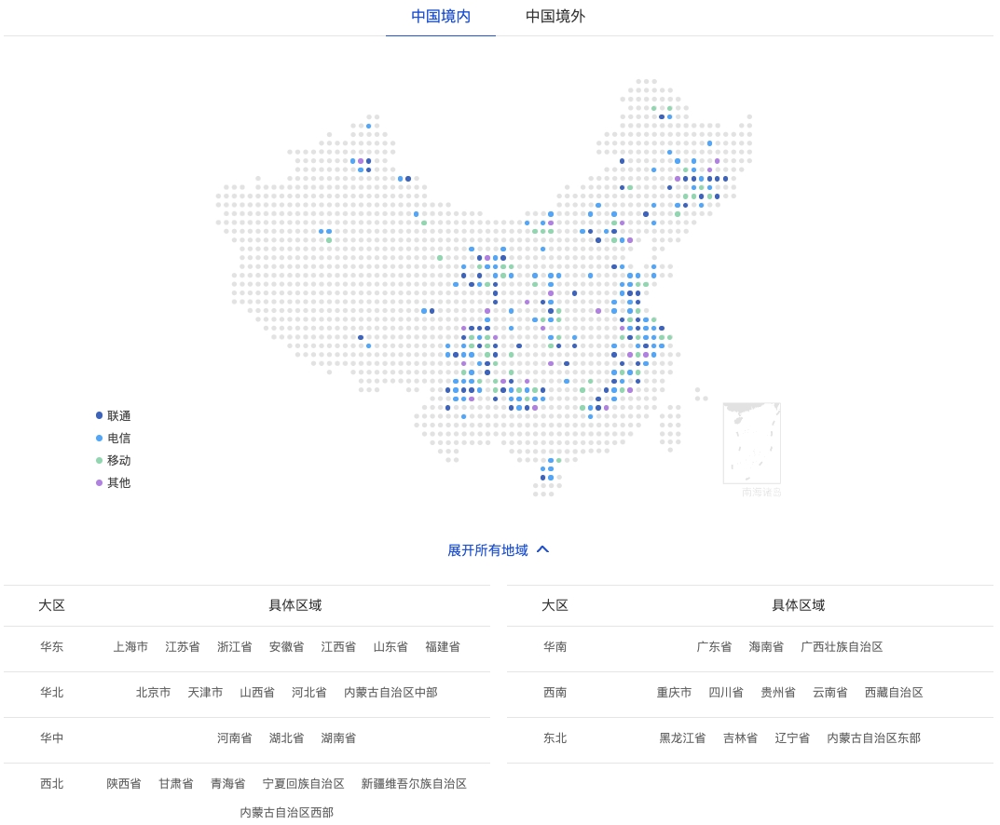
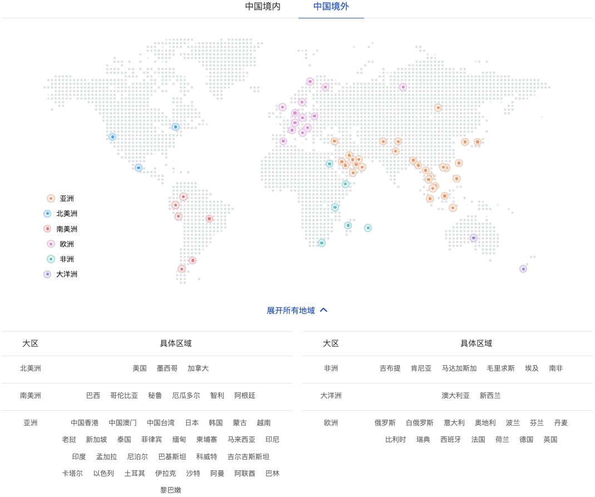

### 缓存
缓存是存储相同数据的多个副本以加快数据访问的过程。在计算中，缓存的原理适用于所有类型的内存和存储管理。在 CDN 技术中，该术语是指将静态网站内容存储在网络中多个服务器上的过程。 CDN 中的缓存的工作原理如下：
1. 来自偏远地理位置的网站访客首次从您的网站请求静态 Web 内容。
2. 请求到达您的 Web 应用程序服务器或原始服务器。原始服务器将响应发送给远程访客。同时，它还将响应的副本发送到与该访客地理上最近的 CDN POP。
3. CDN POP 服务器将副本存储为缓存文件。
4. 下次该访客或该位置的任何其他访客发出相同的请求时，将由缓存服务器而不是原始服务器发送响应。

:::tip
通过开发者工具查看，表示CDN缓存策略实际效果的响应头`X-Cache`字段返回值以`MISS`开头，表明首次访问未命中CDN节点缓存，需要向源站请求资源。后续访问命中CDN节点缓存后，`X-Cache`字段返回值将以`HIT`开头，表明源站的资源已缓存到CDN节点。
:::
:::tip
通过`nslookup`命令验证域名是否指向了CDN节点:
- 打开cmd程序（Windows）、终端（macOS/Linux）。
- 输入`nslookup -type=cname 加速域名`（例如: `nslookup -type=cname oss.example.com`），如果返回的解析结果和CDN控制台上该加速域名的CNAME值一致，则表示CDN加速已经生效。
:::

示例，阿里云CDN缓存加速流程：

1. 当终端用户向`www.aliyundoc.com`下的指定资源发起请求时，首先向Local DNS（本地DNS）发起请求域名`www.aliyundoc.com`对应的IP。
2. Local DNS检查缓存中是否有`www.aliyundoc.com`的IP地址记录。如果有，则直接返回给终端用户；如果没有，则向网站授权DNS请求域名`www.aliyundoc.com`的解析记录。
3. 当网站授权DNS解析`www.aliyundoc.com`后，返回域名的CNAME `www.aliyundoc.com.example.com`。
4. Local DNS向阿里云CDN的DNS调度系统请求域名`www.aliyundoc.com.example.com`的解析记录，阿里云CDN的DNS调度系统将为其分配最佳节点IP地址。
5. Local DNS获取阿里云CDN的DNS调度系统返回的最佳节点IP地址。
6. Local DNS将最佳节点IP地址返回给用户，用户获取到最佳节点IP地址。
7. 用户向最佳节点IP地址发起对该资源的访问请求。
     - 如果该最佳节点已缓存该资源，则会将请求的资源直接返回给用户（步骤8），此时请求结束。
     - 如果该最佳节点未缓存该资源或者缓存的资源已经失效，则节点将会向源站发起对该资源的请求。获取源站资源后结合用户自定义配置的缓存策略，将资源缓存到CDN节点并返回给用户（步骤8），此时请求结束。

### 动态加速
动态加速是指通过在 Web 应用程序和客户端之间设置中间 CDN 服务器，从而加快对动态 Web 内容请求的服务器响应。缓存不适用于动态 Web 内容，因为内容因用户请求而异。CDN 服务器必须针对每个动态请求重新连接原始服务器，但它们通过优化自己与原始服务器之间的连接加速了该过程。

如果客户端通过互联网直接向 Web 服务器发送动态请求，则该请求可能会由于网络延迟而丢失或延迟。此外，可能还需要花费时间打开和关闭连接以进行安全验证。另一方面，如果附近的 CDN 服务器将请求转发到原始服务器，它们就已经建立了一个持续的、受信任的连接。例如，以下功能可以进一步优化它们之间的连接：
- 智能路由算法
- 地理位置靠近原始服务器
- 能够处理客户端请求，缩减其大小

### 边缘逻辑计算
您可以对 CDN 边缘服务器进行编程，以执行简化客户端和服务器之间通信的逻辑计算。例如，此服务器可以执行以下操作：
- 检查用户请求并修改缓存行为。
- 验证和处理不正确的用户请求。
- 在响应之前修改或优化内容。
Web 服务器和网络边缘之间的应用程序逻辑分布有助于开发人员减轻原始服务器的计算需求并提高网站性能。

#### [边缘函数](https://help.aliyun.com/zh/cdn/developer-reference/what-is-er-2?spm=a2c4g.11186623.0.i46)
[边缘函数在手淘App前端优化和小程序场景下的应用](https://help.aliyun.com/zh/cdn/use-cases/applications-of-edgeroutine-in-app-front-end-optimization-of-taobao-mobile-and-mini-programs?spm=a2c4g.11186623.0.0.7fab211fQk6JkB)

## CDN架构
[阿里云CDN](https://www.alibabacloud.com/help/zh/cdn/product-overview/what-is-alibaba-cloud-cdn)的产品架构图如下：
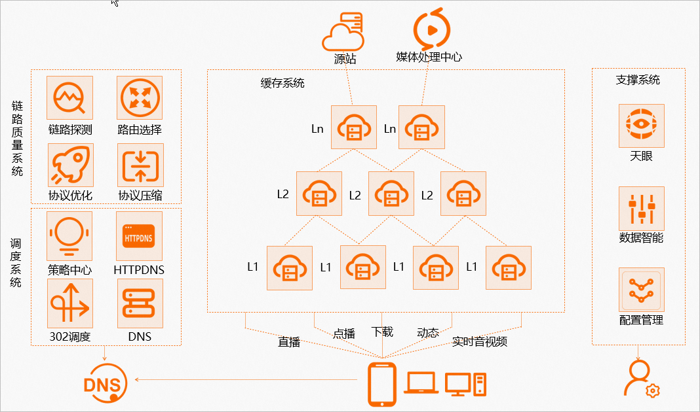
- 链路质量系统

  链路质量探测系统会实时监测缓存系统中的所有节点和链路的实时负载以及健康状况，并将结果反馈给调度系统，调度系统根据用户请求中携带的IP地址解析用户的运营商和区域归属，然后综合链路质量信息为用户分配一个最佳接入节点。

- 调度系统

  支持策略中心、DNS、HTTPDNS和302调度模式。当终端用户发起访问请求时，用户的访问请求会先进行域名DNS解析，然后通过阿里云CDN的调度系统处理用户的解析请求。

- 缓存系统

  用户通过收到的最佳接入节点访问对应的缓存节点，如果节点已经缓存了用户请求的资源，会直接将资源返回给用户；如果L1（边缘节点）和L2（汇聚节点）节点都没有缓存用户请求的资源，此时会返回源站去获取资源并缓存到缓存系统，供后续用户访问，避免重复回源。分级缓存的部署架构可提高内容分发效率、降低回源带宽以及提升用户体验。

- 支撑服务系统

  支撑服务系统包括天眼、数据智能和配置管理系统，分别具备了资源监测、数据分析和配置管理能力。
  - 资源监测：天眼可以对缓存系统上用户业务运行的状态进行监测。例如对CDN加速域名的QPS、带宽、HTTP状态码等常见指标的监控。
  - 数据分析：用户可以分析CDN加速域名的TOP URL、PV、UV等数据。
  - 配置管理：通过配置管理系统，用户可以配置缓存文件类型、缓存时去参数缓存等缓存规则，以提升缓存系统的运作效率。

## [CDN的性能指标](https://help.aliyun.com/zh/cdn/product-overview/performance-indicators?spm=a2c4g.11186623.0.0.470414dcdZAXkD)
您可以通过CDN的性能衡量指标，观察使用CDN前后网站加速的情况，评估CDN加速的效果，帮助您更好地做出业务调整和决策。衡量指标主要包括：
- 通用指标

- 加速图片小文件的主要指标

- 加速大文件下载的主要指标

- 加速视音频点播的主要指标

### 通用指标
- 数据上传路径
  

- 数据下载路径
  
  

通用指标有：
- DNS时间: 指从浏览器终端发起的访问请求开始，到浏览器终端获得最终访问主机IP地址所消耗的时间。

- TCP时间: 指客户端与目标服务器建立TCP连接所消耗的时间。

- SSL时间: 指客户端和Web服务器建立安全套接层（SSL）连接的消耗时间。

- 发送时间: 指SSL握手完成开始发送请求到请求发送完成所消耗的时间。

- 建立连接时间: 建立连接时间简称为建连时间，如果CDN节点使用HTTP协议加速客户业务，建连时间包含“DNS时间+TCP时间”；如果CDN节点使用HTTPS协议加速客户业务，建连时间包含“DNS时间+TCP时间+SSL时间”。建立连接的时间长短，可以反映CDN服务的节点资源覆盖的丰富程度以及调度能力。

- 响应时间: 指浏览器发出HTTP请求后，Web服务器进行后台处理以及响应的时间。

- 下载用时: 指您收到Web服务器返回的第一个数据包，到完成下载的总时间。

- 首包时间: 指从客户端开始发送请求到收到服务器端返回的第一个HTTP协议数据包之间所需要的时间，首包时间可以反映出CDN服务节点的整体性能。在上传和下载路径中，首包时间主要包含了DNS解析时间、TCP用时、SSL用时、发送时间和响应时间。（说明：刚购买的域名，通常解析时间较长，和CDN的缓存时间无关。）

- 整体性能: 指完成整个文件的上传或下载所需要的总时长。

- 丢包率: 指在网络传输中丢失数据包的数量占发送数据包总数的比率。

- 回源率

- 缓存命中率

### 加速图片小文件的主要指标
图片小文件主要指HTML、JS、JPG、CSS等网页资源，延迟时间是决定高性能的关键，延迟越小，性能越好。以下指标均会影响延迟时间：
- 首包时间（最核心）。

- 建立连接时间。

- 传输时间（下载用时）。

### 加速大文件下载的主要指标
大文件下载指单个文件的大小在20 MB以上的下载，该场景核心的指标为：
- 下载速度。

- 下载总时间。

### 加速视音频点播的主要指标
视音频点播的场景主要涵盖FLV、MP4、WMV、MKV等视音频文件，主要衡量指标包括：

- 首播时间

  首播时间指从打开视频到看到视频画面的时间，通常会受域名解析、连接时间和首包时间的影响。首播时间越短，性能越好。

- 卡顿率

  卡顿率指每100个用户里面播放出现卡顿比例（视音频播放、资源加载等场景下出现的画面滞帧）。卡顿率越低，性能越好。

## [CDN刷新和预热](https://help.aliyun.com/zh/cdn/user-guide/refresh-and-prefetch-resources?spm=a2c4g.11186623.0.i148)
通过刷新功能，您可以删除CDN节点上已经缓存的资源，并强制CDN节点回源站获取最新资源，适用于源站资源更新和发布、违规资源清理、域名配置变更等；通过预热功能，您可以在业务高峰前预先将热门资源缓存到CDN节点，降低源站压力提升用户体验。

- 刷新：把CDN所有节点上对应的缓存资源标记为失效，当用户再次请求时，CDN会直接回源站获取对应的资源并返回给用户，同时将资源重新缓存到CDN节点。刷新功能会降低缓存命中率。

- 预热：源站主动将对应的资源缓存到CDN节点，当您首次请求资源时，即可直接从CDN节点获取到最新的资源，无需再回源站获取。预热功能会提高缓存命中率。

:::warning
- 提交刷新任务并成功执行后，CDN节点上对应的缓存资源将会失效，当您再次发起访问请求时，节点会回源站拉取所需资源，并重新缓存在节点上，因此大批量提交刷新任务会清空较多缓存，导致回源带宽和请求突增，增加源站压力。
- 刷新任务从提交到生效，大约需要5~6分钟(阿里云CDN)，如果文件或者目录配置的缓存过期时间少于5分钟，您无需执行刷新操作，等待文件或者目录缓存超时更新即可。
- 提交预热任务并成功执行后，CDN节点会立即回源站加载所需资源，因此大批量提交预热任务会生成较多的并发下载任务，导致回源带宽和请求突增，增加源站压力。
- 预热任务从提交到预热完成，实际执行时间视预热文件大小而定，大约需要5~30分钟(阿里云CDN)，文件平均大小越小，预热速度越快。
- 阿里云CDN的URL刷新、目录刷新和正则刷新都已支持共享缓存。在域名配置了共享缓存的情况下，使用主域名或者任意一个关联域名来提交刷新任务，都可以刷掉缓存。
- 预热请求默认携带的header是`Accept-Encoding:gzip`，如果您需要预热请求携带其他header，或者实现多副本预热，那么可以使用OpenAPI接口[PushObjectCache - 预热URL](https://help.aliyun.com/zh/cdn/developer-reference/api-cdn-2018-05-10-pushobjectcache)，并通过设定请求参数`WithHeader`来实现自定义预热header。
- 预热时，如果源站返回307等重定向相关的状态码，预热任务并不会跟随重定向地址继续完成预热，最终会导致预热失败。如果源站返回的是301或者302状态码，并且CDN上已经开启了[回源301/302跟随](https://help.aliyun.com/zh/cdn/user-guide/configure-301-or-302-redirection)，这种情况下正常预热不受影响。
:::

:::tip
- 确认预热的资源是否允许被缓存。如果资源设置了`Cache-Control`头部为`no-cache`、`no-store`或`private`，并且CDN配置遵循源站头信息，则会导致资源无法被缓存。
- 检查资源对应的缓存过期时间（如`Expires`或`max-age`），确保其不是0，非零值表示资源可以被缓存。
- 使用CDN刷新预热虽然清除了CDN缓存，但是受到浏览器缓存的影响，导致访问到旧的资源。尝试清理浏览器缓存，然后刷新页面，查看资源是否更新。
:::

### 刷新和预热功能常见的适用场景
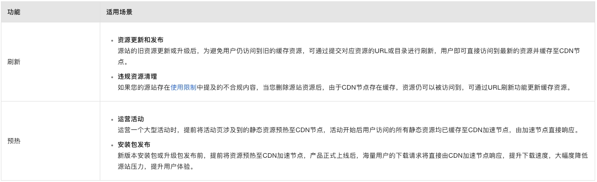


## [CDN加速OSS资源](https://help.aliyun.com/zh/cdn/use-cases/accelerate-the-retrieval-of-resources-from-an-oss-bucket-in-the-alibaba-cloud-cdn-console?spm=a2c4g.11186623.0.i42)
当您需要加速OSS上的静态资源时，可以通过阿里云CDN加速OSS域名，实现静态资源的访问加速。CDN通过将OSS资源缓存至就近的CDN节点实现加速访问OSS。相比直接访问OSS资源，CDN具有更高的带宽上限，可有效避免OSS下行带宽和Bucket地域的限制。通过CDN节点进行分发，能够有效减少访问延迟。

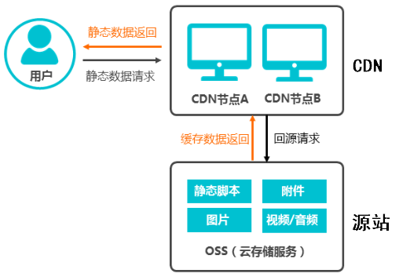
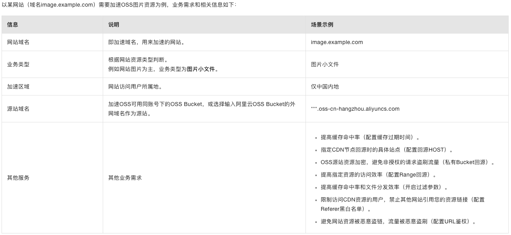
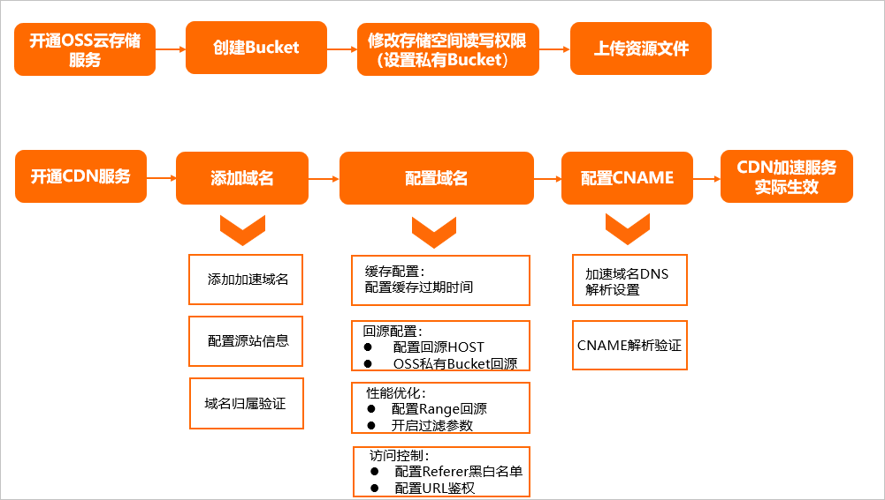

以上示例，配置加速域名：`image.example.com`；源站信息选择OSS域名（不支持OSS内网域名作为源站）
配置步骤：
1. 选择域名，即加速域名，即最终暴露给终端用户访问时使用的域名，如示例中的`image.example.com`
2. 选择加速类型，如图片小文件
3. 选择加速区域，如中国境内
4. 填写源站信息，源站信息选择OSS域名，并在下方的域名输入框中选择要加速的OSS Bucket
5. 验证域名状态为正常运行时，会分配一个加速域名的CNAME域名，本示例为`image.example.com.w.kunlunsl.com`。
6. 在DNS服务商处将加速域名的DNS解析记录指向分配的CNAME域名，使访问请求转发到CDN节点上，实现加速效果。

合理配置缓存过期时间，可有效提高缓存命中率：
- 不常更新的静态文件（例如，图片类型、应用下载类型等），建议设置1个月以上。
- 频繁更新的静态文件（例如，JS、CSS等），根据实际业务情况设置。
- 动态文件（例如，PHP、JSP、ASP等），建议设置为0s，即不缓存。

指定CDN节点回源时的具体站点：
- 默认情况，将使用OSS的Bucket地址作为HOST地址（本示例为`***.oss-cn-hangzhou.aliyuncs.com`）。
- 如果源站OSS Bucket绑定了自定义域名（例如，`origin.developer.aliyundoc.com`），则需要配置回源HOST为自定义域名类型，且HOST值为`origin.developer.aliyundoc.com`。

### [阿里云OSS域名管理](https://help.aliyun.com/zh/oss/user-guide/manage-a-domain/?spm=a2c4g.11186623.0.0.53d030f0xhVWpF)
文件上传到OSS后，OSS会使用Bucket默认域名生成文件访问地址。使用浏览器访问该地址时，会触发强制下载行为。如果您的业务不希望暴露Bucket默认域名或有在浏览器中预览文件的需求，您需要为Bucket绑定自定义域名，然后通过自定义域名访问该Bucket中的文件。绑定自定义域名后，不影响继续使用OSS提供的域名。

访问Bucket默认域名或传输加速域名会默认下载文件，而访问自定义域名会默认预览文件的原因如下：
1. 出于数据传输安全考虑，使用OSS提供的Bucket默认域名（`<bucketName>.oss-<regionId>.aliyuncs.com`）或传输加速域名（`<bucketName>.oss-accelerate.aliyuncs.com`）访问Bucket的文件（网页、图片）时，OSS会在返回中强制增加下载响应头（`x-oss-force-download: true` 和 `Content-Disposition: attachment`）。浏览器检测到`Content-Disposition: attachment`时，会触发强制下载行为。使用OSS提供的域名访问文件时，触发下载行为的请求流程如下：
   

2. 您可以在已注册的域名（例如`example.com`）上自定义一个子域名（例如`static.example.com`），并将其绑定至Bucket，然后使用自定义域名访问文件。此时，OSS不会在返回中强制增加下载响应头。由于OSS没有设置`Content-Disposition`字段，浏览器会默认将其设置为`inline`。浏览器会直接显示文件内容，而不是下载文件。使用自定义域名访问文件，默认预览行为的请求流程如下：
   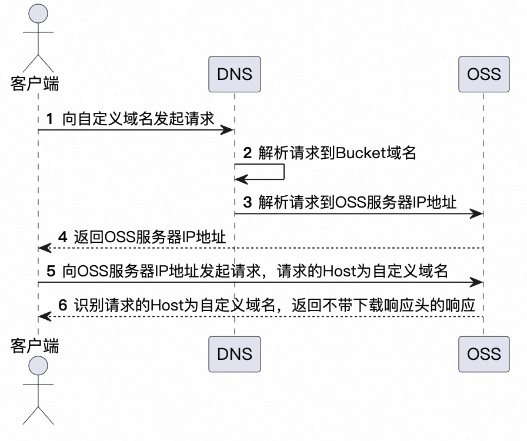

:::tip
绑定自定义域名到Bucket后需要手动前往域名解析商处做 CNAME 解析，将自定义域名解析至被绑定的Bucket的外网访问域名，自定义域名才能生效。
:::

## 术语
### QPS
QPS是“Queries Per Second”的缩写，意为“每秒查询次数”。它是衡量网络服务处理能力的一个重要指标，用于描述服务器或数据库等系统在每秒内能够响应的查询请求次数。QPS常用于性能测试和服务器监控中，以评估系统的处理能力和稳定性。

#### QPS的重要性

- **性能评估**：通过测量QPS，可以直观地了解系统在高并发情况下的处理能力，对于优化系统性能、提高用户体验至关重要。
- **资源规划**：根据QPS的测量结果，可以合理规划服务器资源，确保系统能够平稳运行，同时避免资源浪费。
- **瓶颈分析**：在系统出现性能瓶颈时，QPS可以帮助定位问题，分析系统的弱点，从而采取相应的优化措施。

#### QPS与其他性能指标

- **TPS（Transactions Per Second）**：每秒事务数，常用于衡量数据库系统的处理能力。与QPS相比，TPS更侧重于事务的完整性和一致性。
- **RT（Response Time）**：响应时间，指从发送请求到收到响应所需的时间。QPS高并不意味着RT低，两者需要综合考虑。
- **并发用户数**：同时与系统交互的用户数量。并发用户数增多时，系统的QPS也应相应提高，以保证服务质量。

#### 提高QPS的方法

- **优化代码**：通过代码优化减少每次请求的处理时间，提高执行效率。
- **增加缓存**：使用缓存技术减少数据库的直接访问，降低数据库压力。
- **负载均衡**：通过负载均衡技术分散请求到多个服务器，提高整体处理能力。
- **数据库优化**：优化数据库查询，使用索引减少查询时间，提高数据库响应速度。
- **硬件升级**：提高服务器的硬件配置，如增加CPU、内存等，以提高处理能力。

总之，QPS是衡量系统性能的关键指标之一，通过监控和优化QPS，可以有效提升系统的处理能力和用户体验。

### 源站
源站，指您运行业务的网站服务器，是加速分发数据的来源。

源站可用来处理和响应用户请求，当节点没有缓存用户请求的内容时，节点会去源站获取资源数据并返回给用户。源站可以是对象存储OSS、自有源站（IP、源站域名）。

### 节点
节点，指与最终接入的用户之间具有较少中间环节的网络节点，对最终接入用户有相对于源站而言更好的响应能力和连接速度。

### 加速域名
加速域名，是您接入CDN用于加速、终端用户实际访问的域名。例如，您将域名`aliyundoc.com`接入CDN，`aliyundoc.com`即为加速域名。

阿里云CDN通过加速域名，将源站资源缓存到CDN加速节点，实现资源访问加速。(在阿里云CDN的帮助文档中，加速域名通常被简写为域名。)

### CNAME记录/CNAME域名
CNAME（Canonical Name）记录，指域名解析中的别名记录，用来把一个域名解析到另一个域名（CNAME域名），再由CNAME域名来解析到需要访问的服务器IP地址。

CNAME域名，是CDN生成的，当您在阿里云CDN控制台添加加速域名后，系统会为加速域名分配一个`*.*kunlun*.com`形式的CNAME域名。

添加加速域名后，您需要在您的DNS解析服务商处，添加一条CNAME记录，将加速域名唯一解析到CNAME域名，记录生效后域名解析就正式转向CDN服务，该域名所有的请求都将转向CDN的节点，达到加速效果。CNAME域名将会解析到具体哪个CDN节点IP地址，将由CDN的调度系统来综合区域、运营商、节点资源水位等多个条件来决定。

:::tip
阿里云CDN产品通过分布广泛的CDN节点来为最终用户提供加速服务，不同区域或者不同运营商的用户访问到的CDN节点IP地址是不同的，因此加速域名就无法通过DNS的A记录解析的方式唯一解析到某个IP地址，这个时候就引入了CNAME域名。
:::

### 回源
当用户通过浏览器发送请求时，如果CDN节点未缓存请求的资源或缓存资源已到期，或者部署预热任务给CDN节点时，此时CDN节点会回源站获取资源并返回给用户，该过程被称为回源。

#### 回源工作原理
1. 客户端发起请求：当用户访问一个网站时，客户端（例如浏览器）会向CDN节点发送一个请求，请求的URL指向CDN加速域名。

2. CDN节点查找缓存：CDN节点首先会检查自身的缓存中是否存在请求的资源。如果存在，CDN节点会直接返回缓存的资源给客户端，从而实现快速响应。

3. 回源请求：如果CDN节点的缓存中不存在请求的资源，CDN节点会根据配置的回源策略，向源站发起回源请求。

4. 回源获取资源：源站接收到CDN节点的回源请求后，根据请求的URL和参数，生成并返回相应的资源。

5. 缓存资源：CDN节点在获取到源站返回的资源后，会将资源缓存到自身的缓存中，以便下次请求时能够直接返回缓存的资源。

6. 返回响应：CDN节点将获取到的资源返回给客户端，完成整个请求-响应过程。

### 回源HOST
回源HOST，即CDN节点回源时实际请求的域名。当源站服务器上提供多个域名服务时，您可根据业务需求指定CDN节点回源时在访问的具体域名。例如，您期望CDN回源时实际请求的地址为`aliyundoc.com`，与加速域名`www.aliyundoc.com`不同，那么您需要配置回源HOST为`aliyundoc.com`。

#### 配置回源HOST
CDN在发起回源请求时携带的HOST请求头默认为加速域名，您可以自定义回源HOST请求头。

当您访问一个URL链接时，不指定HOST字段，该请求的HOST字段默认为您访问URL链接的主机+端口部分。但是CDN默认将HOST字段设置为加速域名，您也可以根据您源站的虚拟站点配置，自定义HOST字段的默认值。(您的源站服务器需支持通过HOST请求头匹配不同的虚拟站点，否则该功能配置无法达到预期的功能效果。)

阿里云CDN配置回源HOST示例：
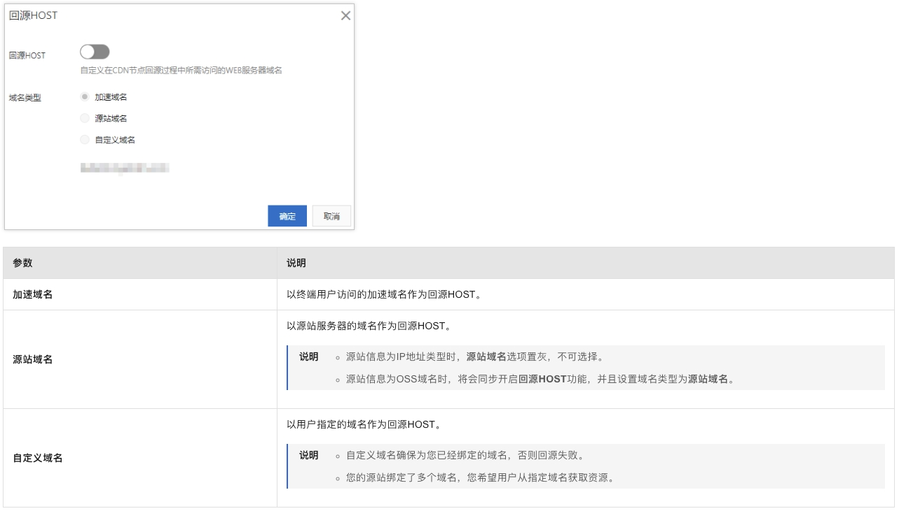
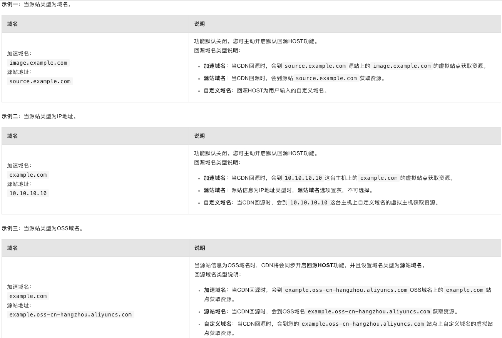

#### 虚拟站点技术
当您有多个加速域名，每个加速域名负责加速不同静态的资源，常见的做法是开发多个源站支持不同加速域名发起回源请求资源。

如果加速域名比较多，回源流量很少时，重复建站会带来资源的极度浪费，您可通过虚拟站点技术解决该问题。

虚拟站点技术是一种在单个Web服务器上提供多个网站服务的技术。服务器通过使用不同的域名或主机名来区分和隔离不同的网站。当用户请求访问某个特定的域名或主机名时，服务器会根据请求的域名或主机名，将请求定向到相应的虚拟站点，从而提供相应的网站内容。示意图如下：


Nginx支持通过server区块配置多个虚拟站点，示例如下：
```xml
server {
    listen      80;
    server_name example.org www.example.org;
    ...
}

server {
    listen      80;
    server_name example.net www.example.net;
    ...
}

server {
    listen      80;
    server_name example.com www.example.com;
    ...
}
```
示例中项目配置了3个虚拟站点，分别是`example.org`、`example.net`、`example.com`。Nginx优先在HTTP请求头中查找HOST字段以确定请求需要路由到的虚拟站点，如果没有匹配到任何一个虚拟站点，Nginx会使用默认的虚拟站点提供服务（若未配置，默认为第一个sever配置为默认站点）。

### 回源协议
回源协议，指CDN节点回源时使用的协议，有可能与客户端访问资源时使用的协议相同，也有可能不相同。例如，当客户端使用HTTPS方式请求未缓存在CDN节点上的资源时，可以配置CDN节点使用HTTPS协议回源站获取资源，也可以配置使用HTTP协议回源（源站不支持HTTPS协议的情况下）。

### 回源率
回源率分为回源请求数比例及回源流量比例两种：
- 回源请求数比：指CDN节点（包括边缘节点和汇聚节点）对于没有缓存、缓存过期（可缓存）和不可缓存的请求占全部请求的比例。回源请求数比=CDN节点回源请求数÷用户访问CDN节点的总请求数，通常越低则性能越好（如果CDN回源做了分片，但是用户访问CDN没有分片，那么会出现CDN节点回源请求数远大于用户访问CDN的请求数的情况）。

- 回源流量比：回源流量指的是CDN节点回源拉取资源的过程中源站响应给CDN节点的所有流量。回源流量比=源站响应给CDN节点的总字节数÷CDN节点响应给用户的总字节数，比值越低，性能越好。

### 回源SNI
SNI（Server Name Indication）是对SSL/TLS协议的扩展，可用来解决一个HTTPS服务器（同一个IP地址）拥有多个域名，但是无法确定客户端到底请求的是哪一个域名的服务的问题。

当您的源站IP绑定了多个域名，且CDN回源协议为HTTPS时，可通过配置回源SNI，来指明客户端从哪个域名获取资源，服务器会根据配置的SNI信息返回正确的证书给客户端。

### SSL/TLS
SSL（Secure Sockets Layer）即安全套接层协议，SSL协议位于TCP/IP协议与各种应用层协议之间，可以有效协助Internet上的应用软件提升通讯时的资料完整性及安全性。IETF将SSL标准化后名称被改为TLS（Transport Layer Security），即传输层安全协议，因此通常将两者并称为SSL/TLS。

### Range回源
Range回源，指CDN节点在回源的HTTP请求里面携带了Range信息，源站在收到CDN节点的回源请求时，根据HTTP请求头中的Range信息返回指定范围的内容(即，返回分片内容)数据给CDN节点，例如只返回某个文件的0-100Byte范围内的数据。

在视频点播、软件下载等大文件内容分发场景下，Range回源可有效提高文件分发效率，可以提高缓存命中率，减少回源流量消耗和源站压力，并且提升资源响应速度。

适用于音视频等较大文件的内容分发，不适用于图片小文件等业务，图片业务加速时无需配置。

:::tip
Range是HTTP请求头之一，可用来指定需获取的内容的范围。
:::

### 缓存命中率
CDN缓存命中率包括字节命中率和请求命中率，缓存命中率越高，性能越好。
- 字节命中率=（CDN节点响应用户的总字节数-源站响应CDN节点的总字节数）÷ CDN节点响应用户的总字节数。

- 请求命中率=（用户访问CDN节点的总请求数-CDN节点回源请求数）÷ 用户访问CDN节点的总请求数。

:::tip
字节缓存命中率越低，回源流量越大，源站的流出流量越大，源站的带宽资源以及其他的负载越大，因此回源流量代表了源站服务器接收到的负载压力，在业务使用中主要关心字节缓存命中率。
:::

### 缓存过期时间
缓存过期时间，指资源在CDN节点上缓存的时长。资源过期后会自动从CDN节点删除，用户向CDN节点发起的访问请求会被判定为未命中缓存，CDN节点会自动回源站获取最新资源返回给用户，并缓存到CDN节点。

### 回源302跟随
回源302跟随，指CDN节点代替客户端直接处理源站响应的302状态码的内容，可减少处理流程，加快获取资源的速度。

### Referer防盗链
Referer防盗链，是基于HTTP请求头中Referer字段（例如，Referer黑白名单）来设置访问控制规则，实现对访客的身份识别和过滤，防止网站资源被非法盗用。配置Referer黑白名单后，CDN会根据名单识别请求身份，允许或拒绝访问请求。允许访问请求，CDN会返回资源链接；拒绝访问请求，CDN会返回403响应码。
:::tip
Referer是HTTP请求头的一部分，携带了HTTP请求的来源地址信息（协议+域名+查询参数），可用于识别请求的来源。
:::

### 带宽封顶
带宽封顶，指通过设置带宽上限，来控制带宽用量，减少因突发流量导致的损失。

当指定加速域名在统计周期（1分钟）内产生的平均带宽超出预设上限，CDN将停止为该域名提供加速服务，且该域名会自动下线，并被解析到无效地址(比如`offline.***.com`)，无法被继续访问。

### 跨域资源共享（CORS）
跨域资源共享（CORS），是一种基于HTTP头的访问控制机制，允许Web服务器声明哪些源站（指定的域名、协议、端口）有权限通过浏览器访问指定资源。

### HSTS
HSTS（HTTP Strict Transport Security，HTTP 严格传输安全），是一种网站用来声明他们只能使用安全连接（HTTPS）访问的方法。网站可通过声明HSTS，来强制客户端（如浏览器）只能使用HTTPS与服务器连接，拒绝所有的HTTP连接并阻止用户接受不安全的SSL证书，降低第一次访问请求被拦截的风险。

例如，未开启HSTS的情况下，当您源站使用HTTPS请求时，在浏览器输入HTTP链接，用户请求访问到服务器上的时候，服务器会将该HTTP请求301或302重定向到HTTPS，在用户请求以HTTP协议访问服务器的过程中，HTTP请求可能被恶意拦截或者篡改，存在安全隐患。开启了HSTS以后，客户端只能使用HTTPS协议访问服务器，这样就可以杜绝这类隐患。

### QUIC
QUIC（Quick UDP Internet Connections）是一个基于UDP的通用网络协议，能够保障网络安全性（与TLS/SSL相当），同时具有更低的连接和传输延时，有效避免网络堵塞，在丢包和网络延迟严重的情况下仍可提供可用的服务。

QUIC在应用程序层面就能实现不同的拥塞控制算法，不需要操作系统和内核支持，相比于传统的TCP协议，拥有更好的改造灵活性，非常适合在TCP协议优化遇到瓶颈的业务。

## 常用的CDN平台
- https://cdn.jsdelivr.net/
- https://cdnjs.com/
- https://cdn.bytedance.com/
- https://cdn.baomitu.com/  360 前端静态资源库是由奇舞团支持并维护的开源项目免费 CDN 服务，支持 HTTPS 和 HTTP/2，囊括上千个前端资源库和 Google 字体库。
- https://www.staticfile.org/ CDN 加速由七牛云提供，技术社区掘金支持