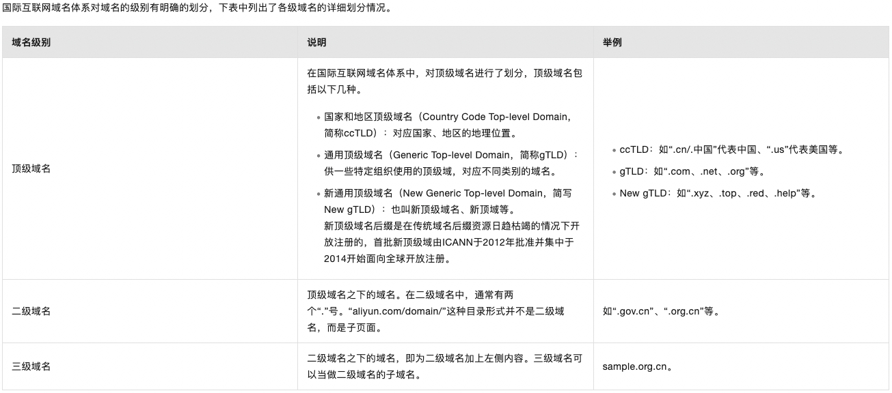
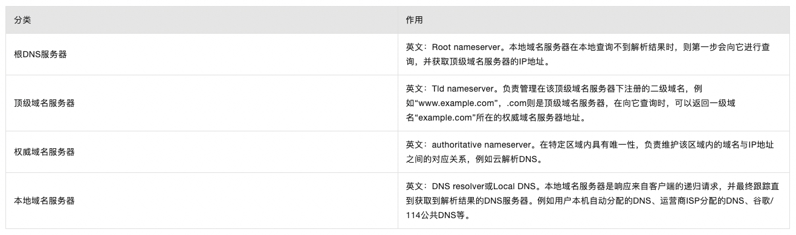

[浏览器输入URL后究竟发生了什么？](https://mp.weixin.qq.com/s/LCuu-CbgBGwxrKCRH1E58Q)

从输入URL到回车后发生的行为如下：
- URL解析
- DNS查询
- TCP连接
- HTTP请求
- 响应请求
- 页面渲染

## URL解析
URL（Uniform Resource Locator，统一资源定位符）是用于定位互联网上资源的地址。`http://www.example.com:80/path/to/myfile.html?key1=value1&key2=value2#SomewhereInTheDocument`这个URL可以分解为以下几个部分：
- 协议（Scheme）: 指定了用于访问资源的协议类型。常见的协议还包括https（加密的http）、ftp等。该示例为"http"。
- 主机名（Host）：指定了托管资源的服务器的域名。该示例为`www.example.com`。
- 端口（Port）：指定了服务器上用于访问资源的端口号。HTTP的默认端口是80，HTTPS的默认端口是443。如果使用默认端口，通常可以省略。该示例为80。
- 路径（Path）：指定了在服务器上资源的具体位置。路径类似于文件系统中的路径。该示例为"/path/to/myfile.html"。
- 查询字符串（Query）：提供了额外的参数，用于搜索、过滤或其他目的。查询字符串以`?`开始，参数间以`&`分隔。该示例为"?key1=value1&key2=value2"。
- 片段（Fragment）：指定了资源内部的一个锚点（如网页中的一个特定位置）。浏览器会滚动到锚点指定的位置。片段不会发送到服务器。该示例为"#SomewhereInTheDocument"。

在JavaScript中，可以使用URL构造函数来解析和操作URL：
```js
const myUrl = new URL('http://www.example.com:80/path/to/myfile.html?key1=value1&key2=value2#SomewhereInTheDocument');

console.log(myUrl.protocol); // "http:"
console.log(myUrl.hostname); // "www.example.com"
console.log(myUrl.port);     // ""
console.log(myUrl.pathname); // "/path/to/myfile.html"
console.log(myUrl.search);   // "?key1=value1&key2=value2"
console.log(myUrl.hash);     // "#SomewhereInTheDocument"
```

## [DNS](https://help.aliyun.com/zh/dns/basic-concepts?spm=a2c4g.11186623.0.0.3ad354c9K8qn4I)
DNS（Domain Name System）域名系统，是一个层次化、分散化的互联网连接资源命名系统，主要功能是将域名解析为网络可以识别的IP地址，即域名解析。人们习惯记忆域名，但机器间互相只识别IP地址。域名解析需要由专门的DNS服务器来完成。

### [域名](https://help.aliyun.com/zh/dws/product-overview/terms)
互联网名称与数字地址分配机构（Internet Corporation for Assigned Names and Numbers，ICANN）负责管理和协调国际互联网络域名系统。根据ICANN的定义，一个完整的域名至少有两个部分，各部分之间用“.”来分隔，最后一个“.”的右边部分称为顶级域名，也称为一级域名；最后一个“.”的左边部分称为二级域名；二级域名的左边部分称为三级域名，以此类推，每一级的域名控制它下一级域名的分配。下图以`www.example.com.cn`为例，为您介绍域名的级别。




域名可以划分为各个子域，子域还可以继续划分为子域的子域，这样就形成了顶级域、主域名、子域名等。关于域名层次结构如下图：


以`www.example.aliyun.com`为例：
- “.com”是顶级域名；
- “aliyun.com”是主域名（也可称托管一级域名），主要指企业名；
- “example.aliyun.com”是子域名（也可称为托管二级域名）；
- `www.example.aliyun.com`是子域名的子域（也可称为托管三级域名）。

:::tip
- 注册域名过程中，可自定义的内容在域名后缀的左侧部分。根据注册局规则，可供用户选择的后缀，可能是顶级域名（如“.cn”），也可能是二级域名（如“.com.cn/.net.cn/.org.cn”）。
- 解析场景里，用户注册的完整域名被定义为“一级域名”（不是顶级域名），完整域名的左侧第一个（即一级域名的子域名）是二级域名，以此类推。以注册一个后缀为“.org.cn”、完整域名为“sample.org.cn”的域名为例，对各定义进行如下说明。
  - 域名后缀：“.org.cn”为注册局提供的可注册的域名后缀。
  - 一级域名：“sample.org.cn”为用户注册的完整域名，即解析场景下的一级域名。
  - 二级域名：“abc.sample.org.cn”为“sample.org.cn”的子域名，即解析场景下的二级域名。
:::

### 域名解析
域名解析过程涉及4个DNS服务器，分别如下：


### DNS查询过程
DNS查询的结果通常会在本地域名服务器（Local DNS）中进行缓存，如果本地域名服务器中有缓存的情况下，则会跳过如下DNS查询步骤，很快返回解析结果。下面的示例则概述了本地域名服务器没有缓存的情况下，DNS查询所需的8个步骤：
1. 用户在Web浏览器中输入“example.com”， 则由本地域名服务器开始进行递归查询。
2. 本地域名服务器采用迭代查询的方法，向根域名服务器进行查询。
3. 根域名服务器告诉本地域名服务器，下一步应该查询的顶级域名服务器`.com` TLD的IP地址。
4. 本地域名服务器向顶级域名服务器`.com` TLD进行查询。
5. `.com` TLD服务器告诉本地域名服务器，下一步查询`example.com`权威域名服务器的IP地址。
6. 本地域名服务器向`example.com`权威域名服务器发送查询。
7. `example.com`权威域名服务器告诉本地域名服务器所查询的主机IP地址。
8. 本地域名服务器最后把查询的IP地址响应给Web浏览器。

一旦DNS查询的8个步骤返回了`example.com`的IP地址，浏览器就能够发出对网页的请求：
9. 浏览器向IP地址发出HTTP请求
10. 该IP处的Web服务器返回要在浏览器中呈现的静态资源



:::tip
DNS术语：
- 递归查询：是指如果A 请求 B，那么 B 作为请求的接收者必须向A返回一个准确的查询结果。如果A本地没有存储与之对应的信息，则该服务器需要询问其他服务器，并将返回的查询结果提交给B。
- 迭代查询：是指如果A 请求 B，那么 B 作为请求的接收者并不直接回复查询结果，而是告诉A另一台DNS服务器的地址，A再向被告知的DNS服务器提交请求，这样依次反复，直到返回查询结果。
- DNS缓存：DNS缓存是将解析数据存储在靠近发起请求的客户端的位置，也可以说DNS数据是可以缓存在任意位置，最终目的是以此减少递归查询过程，可以更快的让用户获得请求结果。
- TTL：英文全称Time To Live ，这个值是告诉本地域名服务器，域名解析结果可缓存的最长时间，缓存时间到期后本地域名服务器则会删除该解析记录的数据，删除之后，如有用户请求域名，则会重新进行递归查询/迭代查询的过程。
- IPV4、IPV6双栈技术：双栈英文Dual IP Stack，就是在一个系统中可同时使用IPv6/IPv4这两个可以并行工作的协议栈。
- TLD Server：英文全称Top-level domains Server，指顶级域名服务器。
- DNS Resolver：指本地域名服务器，它是DNS查找中的第一站，是负责处理发出初始请求的DNS服务器。运营商ISP分配的DNS、谷歌8.8.8.8等都属于DNS Resolver。
- Root Server：指根域名服务器，当本地域名服务器在本地查询不到解析结果时，则第一步会向它进行查询，并获取顶级域名服务器的IP地址。
- DNS Query Flood Attack：指域名查询攻击，攻击方法是通过操纵大量傀儡机器，发送海量的域名查询请求，当每秒域名查询请求次数超过DNS服务器可承载的能力时，则会造成解析域名超时从而直接影响业务的可用性。
- DNSSEC：域名系统安全扩展（DNS Security Extensions），简称DNSSEC。它是通过数字签名来保证DNS应答报文的真实性和完整性，可有效防止DNS欺骗和缓存污染等攻击，能够保护用户不被重定向到非预期地址，从而提高用户对互联网的信任。
:::

### DNS缓存
DNS缓存（Domain Name System Cache）是一种技术，用于存储域名到IP地址解析的结果，以便于快速响应后续的域名查询请求。当你访问一个网站时，你的设备会进行DNS查询以将域名转换为服务器的IP地址。为了减少每次访问都进行DNS查询的开销，DNS缓存会在本地或者网络上的DNS服务器上暂时存储这些信息。

#### DNS缓存的层级

- **浏览器DNS缓存**：大多数现代浏览器都会缓存DNS记录，减少对操作系统或网络DNS服务的查询次数。
- **操作系统DNS缓存**：操作系统也会缓存DNS记录，当浏览器没有找到缓存或者是非浏览器应用发起DNS查询时，会使用这个缓存。
- **路由器DNS缓存**：一些路由器也会缓存DNS查询结果，为局域网内的所有设备提供服务。
- **ISP DNS服务器缓存**：互联网服务提供商（ISP）的DNS服务器会缓存DNS查询结果，供其客户使用。
- **其他DNS服务器缓存**：除了ISP之外，还有许多公共DNS服务，如Google DNS（8.8.8.8）和Cloudflare DNS（1.1.1.1），它们也会缓存DNS记录。

#### DNS缓存的好处

- **减少延迟**：缓存可以减少DNS解析的时间，从而减少网页加载的总时间。
- **减轻服务器负担**：通过减少对DNS服务器的查询次数，可以减轻服务器的负担，提高整体网络的效率。
- **提高可靠性**：即使DNS服务器暂时无法访问，缓存也可以帮助解析常用的域名。

#### DNS缓存的潜在问题

- **过时的记录**：如果域名的IP地址发生变化，缓存中的旧记录可能会导致用户无法访问该网站。
- **DNS缓存污染**：通过恶意软件或攻击者篡改DNS缓存记录，用户可能会被重定向到恶意网站。

#### 管理DNS缓存

- **清除浏览器缓存**：大多数浏览器允许用户清除DNS缓存，通常在浏览器的隐私或网络设置中。
- **清除操作系统缓存**：在Windows系统中，可以使用`ipconfig /flushdns`命令清除DNS缓存；在macOS和Linux系统中，可以使用`sudo killall -HUP mDNSResponder`（macOS）或相应的命令清除缓存。
- **设置缓存时间**：DNS记录的TTL（Time To Live）值决定了记录在缓存中保留的时间，可以通过设置DNS记录的TTL值来控制缓存时间。

DNS缓存是网络浏览中的一个重要组成部分，它在提高效率和减少延迟方面发挥着重要作用，但同时也需要适当的管理以确保数据的准确性和网络的安全。