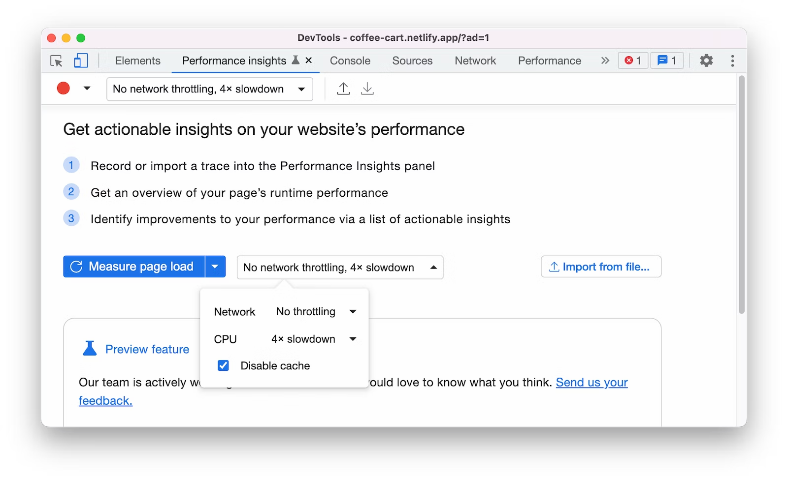
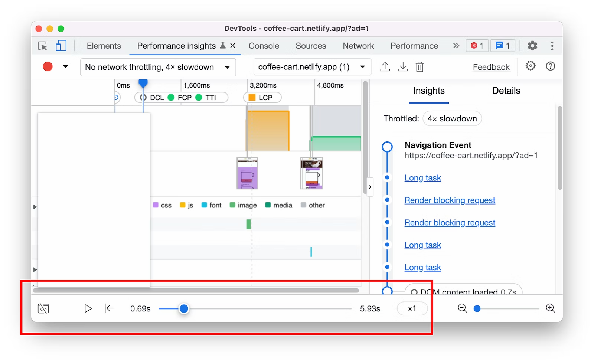
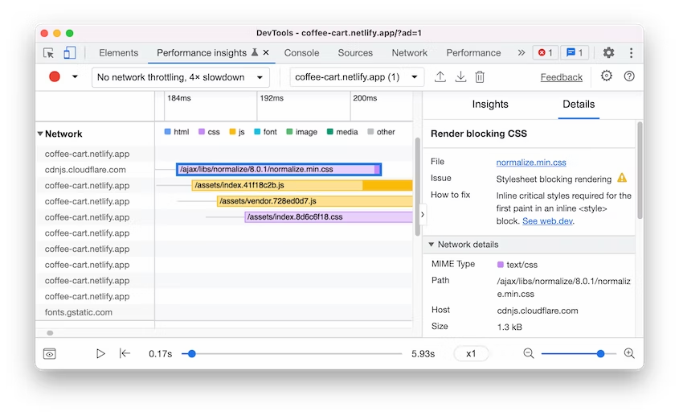
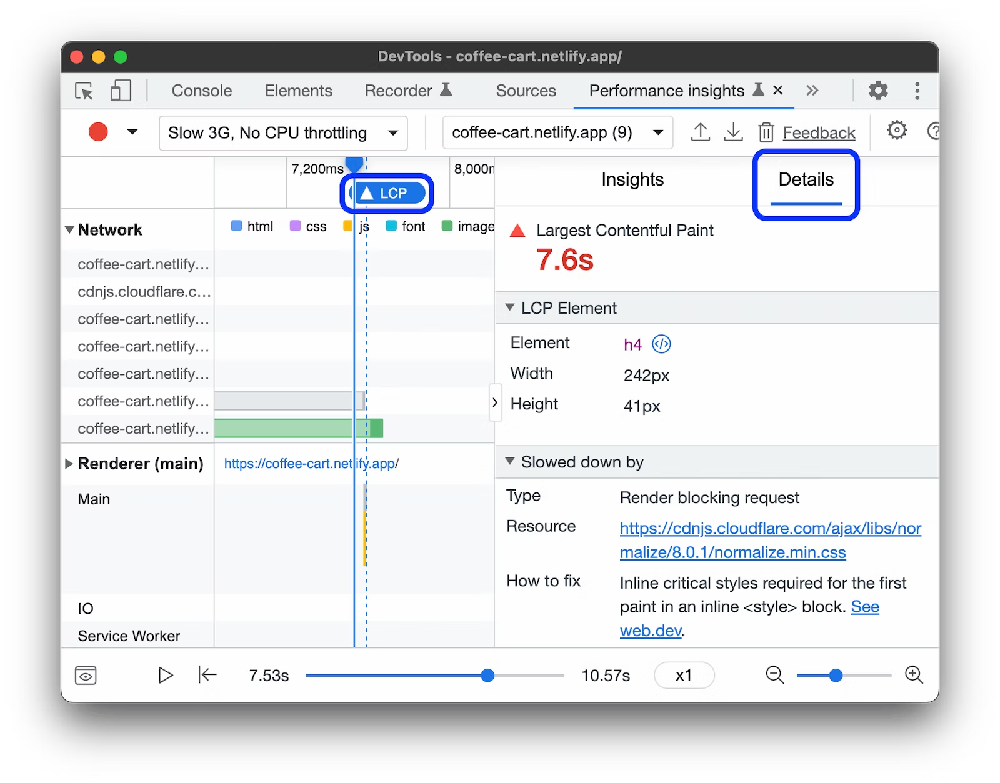
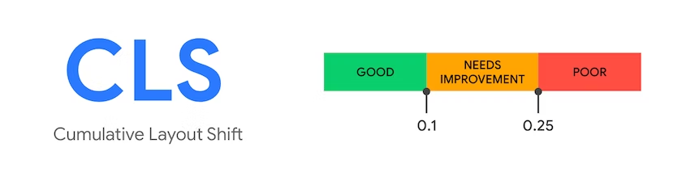
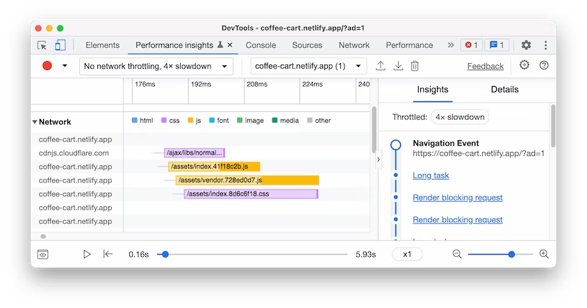
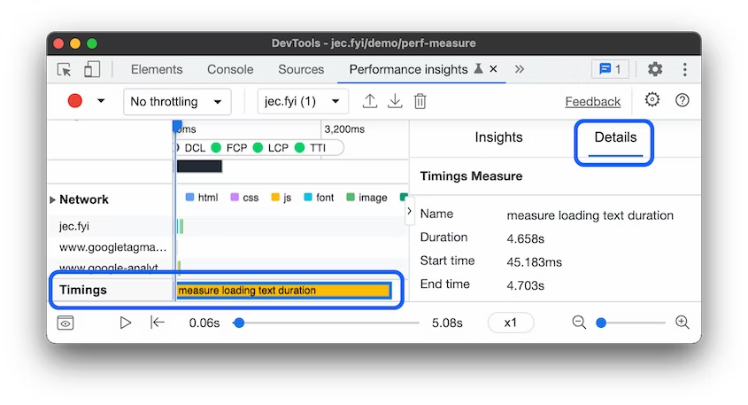

## Chrome DevTools Performance/Performance insights/Performance monitor panel
:::tip
[官方文档](https://developer.chrome.com/docs/devtools/performance/reference/)

[What I Learned at Work this Week: Chrome DevTools Performance Tab](https://mike-diaz006.medium.com/what-i-learned-at-work-this-week-chrome-devtools-performance-tab-4dfdf5aa531e)
:::

### Performance介绍
- Record: click this to start collecting data on site performance. The resulting recording is called a Profile. 单击此按钮开始收集有关站点性能的数据。生成的记录称为配置文件。

- Start profiling and reload page: this will produce a full performance profile after a page reload. We’ll use it to get an idea of what functions are being called and how long they take when our page starts up. 这将在页面重新加载后生成完整的性能配置文件。我们将使用它来了解正在调用哪些函数以及页面启动时它们需要多长时间。

- Clear: clears the current performance profile.

- Load Profile: We can use this to view a previously saved profile. 我们可以使用它来查看以前保存的配置文件。

- Save Profile: If we’ve got a profile on in the console, we can save it!

- Show recent timeline sessions: Switch between multiple recordings.

- Capture screenshots: Checking this box means that we’ll be able to see exactly how the page looked at the moment of a certain function call. This can help with figuring out whether certain scripts can be made asynchronous, delayed, or even removed completely. A big part of performance management is determining the balance between load speed and site experience. 选中此框意味着我们将能够准确地看到页面在某个函数调用时的样子。这有助于确定某些脚本是否可以异步、延迟甚至完全删除。性能管理的很大一部分是确定加载速度和站点体验之间的平衡。

- Capture settings: This gear toggles the next bar.

- Disable JavaScript samples: By default, our recording will show a full call stack of JS functions. This information can be insightful, but can also make the chart busy and harder to read. Disabling JavaScript samples will compress the call stack display. 默认情况下，我们的录制将显示 JS 函数的完整调用堆栈。这些信息可能很有见地，但也会使图表变得拥挤且难以阅读。禁用 JavaScript 示例将压缩调用堆栈显示。

- Enable advanced paint instrumentation (slow): Paint instrumentation allows us to analyze animations. It’s not super relevant to site performance, but it’s worth exploration. 启用高级绘图工具（慢）：绘图工具允许我们分析动画。它与网站性能并没有太大关系，但值得探索。

- Network: Throttling allows us to simulate a slower connection speed so that we can test our site’s performance in different situations. When loading content at a non-optimal speed, we can get a much better idea of what loads on our site when. 节流允许我们模拟较慢的连接速度，以便我们可以测试我们网站在不同情况下的性能。当以非最佳速度加载内容时，我们可以更好地了解什么时候加载到我们的网站上。

- CPU: We can also throttle our CPU, simulating a slower device rather than a slower network. 我们还可以限制我们的 CPU，模拟较慢的设备而不是较慢的网络。

### [Analyze runtime performance](https://developer.chrome.com/docs/devtools/performance/)
Runtime performance is how your page performs when it is running, as opposed to loading. 运行时性能是指页面在运行时的表现，而不是加载时的表现。

Open Google Chrome in Incognito Mode. Incognito Mode ensures that Chrome runs in a clean state. For example, if you have a lot of extensions installed, those extensions might create noise in your performance measurements. 以隐身模式打开谷歌浏览器。隐身模式确保 Chrome 在干净的状态下运行。例如，如果您安装了很多扩展，这些扩展可能会在您的性能测量中产生噪音。

### [Performance features reference](https://developer.chrome.com/docs/devtools/performance/reference/)

### [Performance insights](https://developer.chrome.com/docs/devtools/performance-insights/)
#### 1. Performance insights panel 解决 Performance panel 的3个痛点
- Too much information. Performance insights panel简化了数据并仅显示相关信息
- Hard to distinguish between use cases（很难区分用例）. Performance insights 面板支持用例驱动的分析(use-case-driven analysis)。它目前仅支持页面加载用例，将来会支持更多，例如交互性。
- Requires deep expertise of how browsers work to use effectively（需要深入了解浏览器如何工作才能有效使用）. Performance insights 面板突出显示 Insights 窗格中的关键见解，以及有关如何解决问题的可操作反馈。

#### 2. Record performance
- You can throttle the network and CPU while recording. 可以在录制时限制网络和 CPU。4x slowdown 选项会使您的 CPU 运行速度比平时慢 4 倍。 DevTools 无法真正模拟移动设备的 CPU，因为移动设备的架构与台式机和笔记本电脑的架构非常不同。

- Click Measure page load. DevTools records performance metrics while the page reloads and then automatically stops the recording a couple seconds after the page load has finished. 点击Measure page load，DevTools 在页面重新加载时记录性能指标，然后在页面加载完成几秒钟后自动停止记录。

- If you want to measure general performance of your web page, use Start recording. Interact with the page and click Stop recording manually to stop recording. 如果您想衡量网页的总体性能，请使用Start recording。与页面交互，手动点击Stop recording停止录制。

#### 3. Replay a performance recording

Use the controls at the bottom to control the replay of your recording:
- Click Play to play the recording.
- Click Pause to pause the replay.
- Adjust the playback speed with the drop-down.
- Click Toggle visual preview to show or hide the visual preview.

#### 4. Navigate a performance recording
DevTools automatically zooms out to show the full recording timeline. You can navigate the recording with zoom and move the timeline. DevTools 会自动缩小以显示完整的录制时间线。您可以使用 缩放 浏览录制内容并移动时间线。

#### 5. View performance insights
Get a list of performance insights in the Insights pane. Identify and fix potential performance issues. 在“Insights”窗格中获取性能见解列表。识别并修复潜在的性能问题。

Hover over each of the insights to highlight them on the main tracks. 将鼠标悬停在每个见解上会在主要轨道上突出显示它们。

点击某一个见解会打开Details pane

#### 6. View Web Vitals performance metrics
[Web Vitals](https://web.dev/vitals/) 旨在为质量信号提供统一指导，这些信号对于在网络上提供出色的用户体验至关重要。可以在 Timeline and Insights pane 查看这些指标。

将鼠标悬停在每个指标上可以查看更多信息。

#### 7. Discover delays of the largest contentful paint
> 发现最大内容绘制的延迟

[Largest Contentful Paint (LCP)](https://web.dev/lcp/) is one of the [Core Web Vitals](https://web.dev/vitals/#core-web-vitals) metrics. It reports the render time of the largest image or text block visible within the viewport, relative to when the page first started loading. 它报告视口内可见的最大图像或文本块的呈现时间，相对于页面首次开始加载的时间。

A [good LCP score](https://web.dev/lcp/#what-is-a-good-lcp-score?) is 2.5 seconds or less.

If the largest contentful paint on your page takes longer to render, in the timeline, you will see the LCP badge with a yellow square or red triangle. 黄色正方形或红色三角形。

To open the Details pane, click the LCP badge on the timeline or on the Insights pane on the right. In the pane, you can discover potential causes for the delays and suggestions on how to fix them. 要打开“详细信息”窗格，请单击时间线上或右侧“见解”窗格上的 LCP 徽章。在窗格中，您可以发现延迟的潜在原因以及有关如何解决这些问题的建议。

To view the [sub-parts of LCP render time](https://web.dev/optimize-lcp/#lcp-breakdown), scroll down to the Details > Timings breakdown section.

LCP render time consists of the following sub-parts:
- Time to first byte (TTFB). The time from when the user initiates loading the page until when the browser receives the first byte of the HTML document response. 从用户开始加载页面到浏览器收到 HTML 文档响应的第一个字节的时间。
- Resource load delay. The delta between TTFB and when the browser starts loading the LCP resource. TTFB 与浏览器开始加载 LCP 资源之间的增量。
- Resource load time. The time it takes to load the LCP resource itself. 加载 LCP 资源本身所花费的时间。
- Element render delay. The delta between when the LCP resource finishes loading until the LCP element is fully rendered. 从 LCP 资源完成加载到 LCP 元素完全呈现之间的增量。

If an LCP element doesn't require a resource load to render, the resource load delay and time are omitted. For example, in case the element is a text node rendered with a system font. 如果 LCP 元素不需要资源加载来呈现，则资源加载延迟和时间将被忽略。例如，如果元素是使用系统字体呈现的文本节点。

#### 8. View layout shifts activity
> 查看布局转换活动。View layout shifts activity in the Layout Shifts track. 在 Layout Shifts 轨道中查看 Layout Shifts 活动。

[Cumulative Layout Shifts (CLS)](https://web.dev/cls/) is one of the [core web vitals](https://web.dev/vitals/#core-web-vitals) metrics. Use the Layout Shifts track to identify potential issues and causes of layout shifts. Cumulative Layout Shifts (CLS) 是核心 Web Vitals 指标之一。使用 Layout Shifts 轨道来识别潜在问题和布局偏移的原因。

Click on a screenshot to view the layout shift's details, identify potential root causes and impacted elements. 单击屏幕截图以查看布局转变的详细信息，确定潜在的根本原因和受影响的元素。

[Optimize Cumulative Layout Shift](https://web.dev/optimize-cls/#images-without-dimensions)

#### 9. View network activity
View network activity in the Network track. You can expand the network track to view all the network activities and click on each item to view the details. 查看网络轨道中的网络活动。您可以展开网络轨道以查看所有网络活动并单击每个项目以查看详细信息。

#### 10. View renderer activity
View render activity in the Renderer track. You can expand each renderer to view the activities and click on each item to view the details. 在渲染器轨道中查看渲染活动。您可以展开每个渲染器以查看活动并单击每个项目以查看详细信息。

#### 11. View GPU activity
View GPU activity in the GPU track. The GPU track is hidden by default. To enable it, check GPU in Settings.

#### 12. View user timings
To get custom performance measures, you can use [User Timing](https://www.w3.org/TR/user-timing/) and visualize your timings with the Timing track. For more information, see the [User timing API](https://web.dev/usertiming/).

To view user timings:
- Mark places in your application with [performance.mark()](https://web.dev/usertiming/#using-mark()).
- Measure the elapsed time between marks with [performance.measure()](https://web.dev/usertiming/#calculating-measurements-with-measure()).
- Record performance.
- View the measurements on the Timings track. If you can't see the track, check User timings in Settings.
- To view details, click the timing on the track.

### Performance monitor介绍