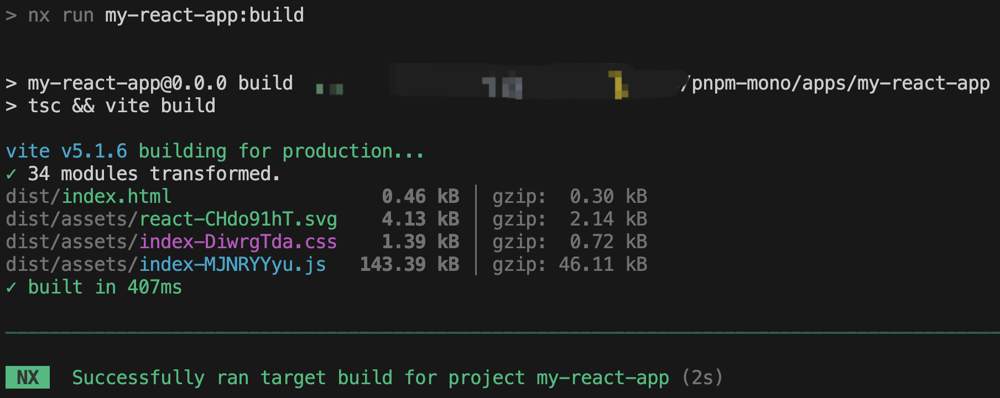
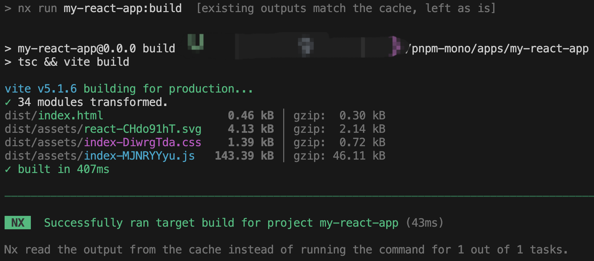
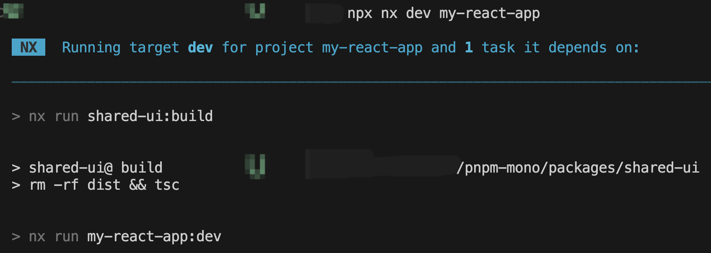

[Nx](https://nx.dev/)：具有一流 monorepo 支持和强大集成的下一代构建系统。

:::info
Phantom dependencies: 一个库使用了不属于其 dependencies 里的 Package 称之为 Phantom dependencies（幻影依赖、幽灵依赖、隐式依赖）
:::

## [Setup a Monorepo with PNPM workspaces and speed it up with Nx!](https://dev.to/nx/setup-a-monorepo-with-pnpm-workspaces-and-speed-it-up-with-nx-1eem)

### pnpm workspace
monorepo 的结构可能会有所不同，具体取决于您计划使用它的用途。 monorepo 一般有两种：
1. 以包为中心的存储库，用于开发和发布一组内聚的可重用包。这是开源世界中的常见设置，可以在 Angular、React、Vue 等存储库中看到。这些存储库的特点是通常有一个`packages`文件夹，然后通常发布到一些公共registry，例如 NPM。

2. 以应用程序为中心的存储库，主要用于开发应用程序和产品。这是公司中常见的设置。此类存储库的特点是具有 `apps` 和 `packages` 或 `libs` 文件夹，其中 `apps` 文件夹包含可构建和可部署的应用程序，而 `packages` 或 `libs` 文件夹包含特定于 monorepo 中正在开发的一个或多个应用程序的库。您仍然可以将其中一些库发布到公共registry。

使用pnpm workspace创建以应用程序为中心的存储库：
1. 创建一个新目录并初始化
   ```bash
   mkdir pnpm-mono
   cd pnpm-mono
   pnpm init
   git init
   # 在`pnpm-mono`目录创建apps和packages目录
   mkdir apps packages
   ```
   ```git title=".gitignore"
   node_modules
   dist
   build
   ```

2. 在存储库的根目录创建一个 `pnpm-workspace.yaml` 文件，定义我们的 monorepo 结构：
   ```yaml title="pnpm-workspace.yaml"
   packages:
     # executable/launchable applications 可执行/可启动的应用程序
     - 'apps/*'
     # all packages in subdirs of packages/ and components/
     - 'packages/*'
   ```

3. 在`apps`目录中创建业务工程，在`packages`目录中创建公共组件。在 monorepo 中，最好的做法是将公共配置部分提取到更高级别的配置（例如根目录），然后在各个项目中将其扩展。这是为了避免各种 monorepo 包之间的大量重复。
   ```bash
   cd apps
   # 以创建Remix工程为例
   npx create-remix@latest
   ```
   ```bash
   cd packages
   mkdir shared-ui
   pnpm add --filter shared-ui react
   pnpm add --filter shared-ui typescript -D
   ```
   新建Button组件：
   ```tsx title="packages/shared-ui/Button.tsx"
   import * as React from 'react';

   export function Button(props: any) {
     return <button onClick={() => props.onClick()}>{props.children}</button>;
   }

   export default Button;
   ```

4. 启动工程
   
   通常，在monorepo中，您希望从存储库的根目录运行命令，而不必不断地在文件夹之间切换。 PNPM 工作区有一种方法可以通过传递`filter`参数来做到这一点: `pnpm --filter <package-name> <command>`。可以使用`pnpm --filter my-remix-app dev`启动Remix工程

5. 在业务工程中使用公共组件
   
   在`packages`中开发的公共组件(如`shared-ui`)在`app`的业务工程中使用，可以用安装的方式引入：`pnpm add shared-ui --filter my-remix-app --workspace`，注意使用`--workspace`
   ```json title="apps/my-remix-app/package.json"
   {
     "name": "my-remix-app",
     "private": true,
     "sideEffects": false,
     ...
     "dependencies": {
       ...
       "shared-ui": "workspace:^"
     },
     ...
   }
   ```
   `workspace:^` 表示包在工作区本地解析，而不是从某些远程registry（例如 NPM）解析。 `^` 只是表明我们想要依赖它的最新版本，而不是特定版本。如果您使用外部 NPM 包，那么使用特定版本确实有意义。

6. 打包
   
   您还可以使用 `-r` 标志在工作区中的所有包上递归运行命令。例如为所有项目运行构建: `pnpm run -r build`

   您可以使用 `--parallel` 并行化运行。例如：`pnpm run --parallel -r build`

### Nx
pnpm workspace提供了一些基本工具，用于在 monorepo 包上运行任务，甚至可以并行运行。随着monorepo的增长，您可能需要以下功能：
- 仅对已更改的包运行任务

- 基于文件内容的高级缓存，不运行之前已经计算过的任何内容

- 远程分布式缓存以加速您的 CI

这正是 Nx 可以提供帮助的地方。它针对 monorepo 场景进行了优化，并配备了先进的任务调度机制。我们仍然依赖 pnpm workspace 为我们提供的包安装和包链接机制，但使用 Nx 来以最有效的方式运行我们的任务。

#### 安装Nx
由于 Nx 将用于在整个 monorepo 工作区中运行操作，因此我们使用`-w`(或者`--workspace-root`)标志将其安装在根级别 `package.json` 中。
```bash
pnpm add nx -D -w
pnpm exec nx init
```

或者使用：`pnpm dlx nx@latest init` (使用npx指定包管理器：`npx nx@latest init --pm pnpm`)

#### 使用Nx运行任务
Nx 使用以下形式来运行命令：`npx nx <target> <project>` 或者 `pnpm exec nx <target> <project>`。在这种特定情况下，`target` 是您要执行的 NPM 脚本。
:::tip
上述命令中加了 `npx` 前缀，它运行 `node_modules` 文件夹中的 Nx 可执行文件。这样就不用全局安装nx了。
:::

使用以下命令运行 `share-ui` 包的构建：`npx nx build shared-ui`。Nx 将自动查找`shared-ui` 并运行`packages/shared-ui/package.json` 中定义的`build`脚本。

同样，要启动我们的 Remix 应用程序，请运行 `npx nx dev my-remix-app`。

我们还可以在项目中并行运行命令：`npx nx run-many --target=build --all`（`--target`可以简写为`-t`），或者选择性地指定项目：`npx nx run-many --target=build --projects=my-remix-app,shared-ui`

#### 配置缓存
将 Nx 添加到 PNPM 工作区的主要好处之一是通过缓存提高速度。[计算缓存](https://nx.dev/using-nx/caching#computation-caching)是一种收集不同输入（源文件、环境变量、命令标志等）并计算哈希值并将其存储在本地文件夹中的功能。下次您再次运行该命令时，Nx 会查找匹配的哈希值，如果找到，则将其恢复。这包括恢复终端输出以及打包产出物（例如 dist 文件夹中的 JS 文件）。

并非所有操作都是可缓存的，只有无副作用的操作(如果您使用相同的输入运行一个操作，那么它总是必须可靠地产生相同的输出。)才可以。如果作为操作的一部分，您调用某个 API，则它不会被缓存，因为给定相同的输入参数，API 的结果可能会有所不同。

为了启用缓存，让我们配置可缓存操作。为此，我们在工作区的根目录下创建一个包含以下内容的 `nx.json`:
```json title="nx.json"
{
  "tasksRunnerOptions": {
    "default": {
      "runner": "nx/tasks-runners/default",
      "options": {
        "cacheableOperations": ["build", "test"]
      }
    }
  }
}
```
`cacheableOperations`可以包含其他操作，例如 linting。

启用此功能后，如果我们现在第一次运行 `npx nx build my-react-app` 构建React demo应用程序，它会像平常一样执行，我们会看到它大约需要 2 秒。

如果您重新运行相同的命令，它现在将从缓存中提取，并且只需要几十毫秒。

重新运行相同的命令时可以看到有提示：“existing outputs match the cache, left as is（现有输出与缓存匹配，保持原样）”，以及“Nx read the output from the cache instead of running the command for 1 out of 1 tasks.（Nx 从缓存中读取输出，而不是为 1 个任务中的 1 个运行命令）”。

适当的缓存可以极大地缩短命令执行时间。默认情况下，Nx 在本地缓存任务计算。然而，为了从整个团队的缓存中受益，特别是在 CI 上，计算缓存也可以分布在多台机器上。就 Nx 而言，[Nx Cloud](https://nx.dev/nx-cloud/set-up/set-up-caching) 的 Nx Replay功能是一种快速、安全且零配置的远程缓存实现。该云每月可免费节省 500 小时（无需信用卡），并且开源项目的运行时间不受限制。

##### `targetDefaults`
默认情况下，缓存机制将[所有项目级文件作为输入](https://nx.dev/using-nx/caching#source-code-hash-inputs)。为了在我们的示例中说明这一点，请运行 `npx nx build my-remix-app` 两次，以便激活缓存。接下来，更改 Remix 项目的 README.md (`apps/my-remix-app/README.md`)。如果您重新构建 Remix 应用程序，则缓存将因 README 文件的更改而失效。这绝对不是一个理想的操作。我们可以通过在 `nx.json` 中添加 `targetDefaults` 来微调缓存，并定义构建目标的默认输入应排除 `*.md` 文件:
```json title="nx.json"
{
  "tasksRunnerOptions": {
    "default": {
      "runner": "nx/tasks-runners/default",
      "options": {
        "cacheableOperations": ["build", "test"]
      }
    }
  },
  "targetDefaults": {
    "build": {
      "inputs": ["!{projectRoot}/**/*.md"]
    }
  }
}
```
通过此更改，每当您运行`build`任务时，MD 文件都不会被视为缓存输入的一部分。
:::tip
您可以使用插值变量 `{projectRoot}` 和 `{workspaceRoot}` 来区分路径是否应针对项目特定文件或工作区级别文件。
:::

##### `namedInputs`
可以设置`namedInputs`来重用缓存的输入globs
```json title="nx.json"
{
  "tasksRunnerOptions": {
      ...
  },
  "namedInputs": {
    "noMarkdown": ["!{projectRoot}/**/*.md"]
  },
  "targetDefaults": {
    "build": {
      "inputs": ["noMarkdown", "^noMarkdown"]
    },
    "test": {
      "inputs": ["noMarkdown", "^noMarkdown"]
    }
  }
}
```
前面添加`^`表明这也应该适用于项目的任何依赖项中的更改。

##### 定义任务依赖关系（也称为构建管道）
由于示例的Remix应用程序`my-remix-app`依赖`shared-ui`，所以启动`my-remix-app`前需要手动build`shared-ui`。可以使用`dependsOn`属性来定义任务依赖关系，避免这种重复工作。

每当我们在项目上运行`build`时，都应首先执行其依赖项目的所有`build`；每当我们在项目上运行`dev`时，都应首先执行其依赖项目的所有`build`:
```json title="nx.json"
{
  "tasksRunnerOptions": {
    "default": {
      "runner": "nx/tasks-runners/default",
      "options": {
        "cacheableOperations": ["build", "test"]
      }
    }
  },
  "namedInputs": {
    "noMarkdown": ["!{projectRoot}/**/*.md"]
  },
  "targetDefaults": {
    "build": {
      "inputs": ["noMarkdown", "^noMarkdown"],
      "dependsOn": ["^build"] // ^ 表示目标应该在所有依赖项目上运行。如果删除 ^，则将在同一项目上调用目标。
    },
    "dev": {
      "dependsOn": ["^build"]
    }
  }
}
```
配置后可以看到运行指定的任务时会先执行其依赖的任务：


#### 仅对已更改的包运行任务
`npx nx affected:<target>`，您可以使用您在工作区中定义的任何target，例如：
- `npx nx affected:build`
- `npx nx affected:test`
- `npx nx affected:lint`
- `npx nx affected:publish`
- `npx nx affected:graph`

默认情况下，base branch是 `main`，可以在 `nx.json` 文件中对其进行设置:
```json title="nx.json"
{
  "affected": {
    "defaultBase": "main"
  }
}
```

Nx 根据 monorepo 工作区中包之间的结构和依赖关系构建项目图（可以使用`npx nx graph`可视化查看工作区的依赖关系图）。让我们假设是以下依赖关系图：


如果 `lib2` 在我们的feature branch中发生更改，则使用`npx nx affected:test` 将仅运行 `lib2` 和 `appB` 的`test`任务(可以使用`npx nx affected:graph`查看工作区受影响的依赖关系图)。但请注意，如果我们运行`npx nx affected:build`并且我们在`nx.json`中定义了一个依赖项，表明也需要首先构建依赖项目，那么将依次构建`lib3` `lib2` `appB`，但不会构建 `lib1` 或 `appA`。

#### 插件
一旦您对软件包进行了良好的设置，您显然希望在创建新软件包时复制它。通常的方法：复制和粘贴，然后删除所有不需要的内容。Nx 有一个“生成器”的插件，基本上是代码脚手架，它允许您在 monorepo 中生成新包，而不是复制和粘贴旧包。

`pnpm add @nx/plugin -D -w`

`pnpm nx list @nx/plugin`

`pnpm nx g @nx/plugin:plugin`

`pnpm nx g @nx/plugin:generator reactlib`