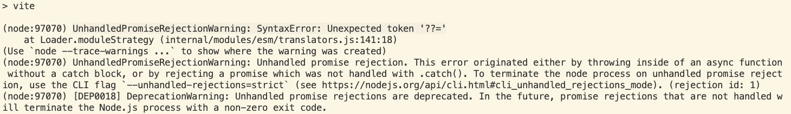

## 使用pnpm+vite搭建react+typescript工程
### 1.使用`pnpm create vite`
选择React、TypeScript，SWC熟练的话可以选择TypeScript+SWC

### 2.ts配置文件
生成的`tsconfig.json` 和 `tsconfig.node.json`配置文件如下：
```json title="tsconfig.json"
{
  "compilerOptions": {
    "target": "ES2020",
    "useDefineForClassFields": true,
    "lib": ["ES2020", "DOM", "DOM.Iterable"],
    "module": "ESNext",
    "skipLibCheck": true,

    /* Bundler mode */
    "moduleResolution": "bundler",
    "allowImportingTsExtensions": true,
    "resolveJsonModule": true,
    "isolatedModules": true,
    "noEmit": true,
    "jsx": "react-jsx",

    /* Linting */
    "strict": true,
    "noUnusedLocals": true,
    "noUnusedParameters": true,
    "noFallthroughCasesInSwitch": true
  },
  "include": ["src"],
  "references": [{ "path": "./tsconfig.node.json" }]
}
```
```json title="tsconfig.node.json"
{
  "compilerOptions": {
    "composite": true,
    "skipLibCheck": true,
    "module": "ESNext",
    "moduleResolution": "bundler",
    "allowSyntheticDefaultImports": true
  },
  "include": ["vite.config.ts"]
}
```

1. 其中`"moduleResolution": "bundler"`会导致使用`<div>`等标签时ts报错：`JSX element implicitly has type 'any' because no interface 'JSX.IntrinsicElements' exists.`，改为`"moduleResolution": "node"`。(注意：`tsconfig.node.json`中的`"moduleResolution": "bundler"`也需要改为`"moduleResolution": "node"`)

2. 由于`allowImportingTsExtensions`配置项需要`"moduleResolution": "bundler"`并且需要配置`noEmit`或`emitDeclarationOnly`：`Requires '--moduleResolution bundler' and either '--noEmit' or '--emitDeclarationOnly' to be set.`，所以去掉`"allowImportingTsExtensions": true,`

3. `import React from 'react';import ReactDOM from 'react-dom/client';`这种import引入会ts报错：`This module is declared with 'export =', and can only be used with a default import when using the 'allowSyntheticDefaultImports' flag.`，在`tsconfig.json`中设置`"allowSyntheticDefaultImports": true`来解决

4. `import App from './App.tsx'`ts报错：`An import path cannot end with a '.tsx' extension. Consider importing './App.js' instead.`，改为`import App from './App'`来解决

### 3.安装依赖并启动
使用 `pnpm install` 安装依赖，使用 `pnpm dev` 尝试启动：
1. 启动有报错：`UnhandledPromiseRejectionWarning: SyntaxError: Unexpected token '??='`
  
  这个报错是node版本比较低，`node -v`查看是14.14.0

2. 使用`nvm`切换node版本为16.16.0后执行 `pnpm dev` 启动还报错：`Error: Cannot find module @rollup/rollup-darwin-arm64.`
3. 使用`rimraf node_modules`删除node_modules后，重新执行 `pnpm install` 安装依赖，再次执行 `pnpm dev` 启动成功

### 4.设置打包后的目录
```ts title="vite.config.ts"
  build: {
    outDir: 'afterSales',
  },
```

### 5.使用scss
vite本身支持scss `pnpm add -D sass`后就可以使用scss

### 6.使用react router
引入react-router-dom：`pnpm add react-router-dom`

### 7.设置react页面的title
可以用`useEffect`：
```jsx
useEffect(() => {
  document.title = '页面title'
})
```

### 8.vite配置项目别名
> [vite中alias别名配置](https://juejin.cn/post/7017701897662365709)

- 使用到`path`、`__dirname`、`__filename`等，需要`pnpm add -D @types/node`

- vite配置文件 和 ts配置文件都需要设置
```ts title="vite.config.ts"
import path from "path";

resolve: {
  alias: {
    "@": path.resolve(__dirname, "src"),
    "@pages": path.resolve(__dirname, "src/pages"),
  },
},
```
```json title="tsconfig.json"
"baseUrl": "./",
"paths":{
  "@/*": ["src/*"],
  "@pages/*": ["src/pages/*"],
 },
```

### 9.vite的`base` 和 react router的`basename`
如果项目在生产环境想共用已有域名，则可以配置nginx，并相应设置vite打包的`base`及react router的`basename`。比如，已有域名`aaa.com`，项目在生产环境想使用`aaa.com/b`:
- nginx配置
```js
server {
  listen          80;
  server_name     aaa.com;

  root /export/App/dist;

  index index.html;

  location / {
    root /export/App/dist;
    if ($request_filename ~* .*\.(?:htm|html)$)
    {
      add_header Cache-Control "no-store";
    }
    add_header Cache-Control "no-cache";
  }
  
  location /b/ {
    root /export/App/dist/;
    try_files $uri $uri/ /b/index.html;
    if ($request_filename ~* .*\.(?:htm|html)$)
    {
      add_header Cache-Control "no-store";
    }
    add_header Cache-Control "no-cache";
  }
}
```

- vite配置打包的`base`
```ts title="vite.config.ts"
base: '/b/',
```

- react router 配置`basename`
```tsx title="src/main.tsx"
const router = createBrowserRouter([
  {
    path: "/",
    element: <Manage />,
  },
], {
  basename: '/b',
});

ReactDOM.createRoot(document.getElementById('root')!).render(
  <React.StrictMode>
    <RouterProvider router={router} />
  </React.StrictMode>,
)
```

### 10.vite配置环境变量
> [环境变量和模式](https://cn.vitejs.dev/guide/env-and-mode.html#env-variables)

- 可以新建配置文件`.env.staging`、`.env.production`
  ```bash title=".env.staging"
  # staging(预发布)模式
  VITE_NODE_ENV=prepare
  ```
  ```bash title=".env.production"
  # production(生产)模式
  VITE_NODE_ENV=production
  ```

- 创建相应的script命令
  ```json title="package.json"
  "scripts": {
    "dev": "vite",
    "pre": "vite --mode staging",
    "prod": "vite --mode production",
    "build": "tsc && vite build",
    "buildPre": "tsc && vite build --mode staging",
    "lint": "eslint . --ext ts,tsx --report-unused-disable-directives --max-warnings 0",
    "preview": "vite preview"
  },
  ```

- 文件中使用：`import.meta.env.VITE_NODE_ENV`

### 11.vite开发配置开启https
- 如下配置，浏览器访问时提示“使用了不受支持的协议”，这是因为https协议需要一个合法可用的证书。
  ```ts title="vite.config.ts"
  server: {
    host: 'test.jd.com',
    port: 443,
    strictPort: true,
    https: true,
  },
  ```

- 本地开发时，可以添加 `@vitejs/plugin-basic-ssl` 到项目插件中，它会自动创建和缓存一个自签名的证书。
  ```bash
  pnpm add -D @vitejs/plugin-basic-ssl
  ```
  ```ts title="vite.config.ts"
  import basicSsl from '@vitejs/plugin-basic-ssl'

  export default {
    plugins: [
      basicSsl()
    ],
    server: {
      host: 'test.com',
      port: 443,
      strictPort: true,
      https: true, // 不设置也行，@vitejs/plugin-basic-ssl 插件会强制开启https
    },
  }
  ```