## 文档
[官方文档](https://webpack.js.org/)

[中文文档](https://www.webpackjs.com)
## 参考资料
- [深入浅出Webpack](https://webpack.wuhaolin.cn/)
- [webpack入门进阶知识](https://juejin.cn/post/6991966321529815053)
- [Webpack揭秘——走向高阶前端的必经之路](https://juejin.cn/post/6844903685407916039)
- [当面试官问Webpack的时候他想知道什么](https://juejin.cn/post/6943468761575849992)
- [webpack 方方面面的核心原理总结](https://mp.weixin.qq.com/s/D_498tIZgrqBDJLZP1HJkw)

## [webpack知识图谱](https://gitmind.cn/app/doc/fac1c196e29b8f9052239f16cff7d4c7)

## 使用层面
>- webpack-cli的作用：简单理解是，可以在package.json中使用webpack命令
>- [webpack易混淆概念解释](https://www.cnblogs.com/skychx/tag/Webpack/)

### 一、执行
- 在package.json中用script命令执行
- 使用API接口执行：[Webpack 提供了 Node.js API，可以在 Node.js 运行时下直接使用](https://www.webpackjs.com/api/node/#webpack)
- 
### 二、配置
- 如果没有配置文件，webpack 会假定项目的入口起点为 src/index.js，输出文件为 dist/main.js，并且在生产环境开启压缩和优化。
- 如果不配置loader，则打包时遇到非.js文件，会报错(如图片文件)或忽略(如样式文件)，比如：
> ERROR in ./src/demo.jpg 1:0
> Module parse failed: Unexpected character '' (1:0)
> You may need an appropriate loader to handle this file type, currently no loaders are configured to process this file. See https://webpack.js.org/concepts#loaders

#### entry
- 不配置entry
  - 默认为src下的index.js
  - 若output设置filename: '[name].js',则打包后这个name为main，即index.js打包后为main.js
- 配置entry
  - string写法 or 对象写法
  ```js
  entry: './src/index.js',
  // 等价于
  entry: {
    main: './src/index.js'
  },
  // main 即 index.js打包后为main.js
  ```
#### output(缓存)
```js
output: {
  //如果把资源放在cdn下，则引入cdn
  publicPath: 'http://cdn.com.cn',
  //当entry有多个入口文件时，用[]可以输出多个文件
  filename: '[name].js',
  // 指打包后的文件要放在哪个文件下
  path: path.resolve(__dirname, 'dist')
}
```
> Webpack 打包后的资源按大小分有三类，从小到大排列：
>- module，即模块，每个引入的文件就是一个module，常言模块化，是开发中的物理最小代码单位
>- chunk， N 个模块打包在一起形成的的一个文件（如果 chunk 有 split，则每个分开的文件都是一个独立的 chunk）
>- bundle，一次工程编译打包的最终产物，有可能就是 chunk，也有可能包含多个chunk的综合体

> 这三类资源都可以生成 hash，粒度从低到高依次为：
>- hash，根据每次编译的内容计算所得，不是针对每个具体文件的，每次编译都会有一个 hash
>- chunkhash，入口级别的 hash，如果入口文件有改动，则从该入口打包引入的所有文件的hash都会变化，主要指同一个入口的js和css文件。
>- contenthash，文件级别的 hash，只有文件的内容变了hash才会变
>- [webpack 中，hash、chunkhash、contenthash 的区别是什么？](https://www.cnblogs.com/skychx/p/webpack-hash-chunkhash-contenthash.html)

- [webpack 缓存指南](https://www.webpackjs.com/guides/caching/)

- [webpack 中，filename 和 chunkFilename 的区别是什么？](https://www.cnblogs.com/skychx/p/webpack-filename-chunkFilename.html)
> filename 指列在 entry 中，打包后输出的文件的名称；chunkFilename 指未列在 entry 中，却又需要被打包出来的文件的名称。一般来说，这个 chunk 文件指的就是要懒加载的代码。

- publicPath

#### [模式mode](https://www.webpackjs.com/concepts/mode)
- 如果没有设置，webpack 会将 mode 的默认值设置为 production

#### [resolve](https://www.webpackjs.com/configuration/resolve/)
- 设置别名alias

#### devServer
- proxy
```js
// 如下，对 /api/users 的请求会将请求代理到 http://localhost:3000/api/users
module.exports = {
  //...
  devServer: {
    proxy: {
      '/api': 'http://localhost:3000',
    },
  },
};

// 如果不希望传递/api，则需要重写路径
module.exports = {
  //...
  devServer: {
    proxy: {
      '/api': {
        target: 'http://localhost:3000',
        pathRewrite: { '^/api': '' },
      },
    },
  },
};
```

### 三、[Modules](https://www.webpackjs.com/api/module-methods/)
- rules 规则数组
>- oneOf 当规则匹配时，只使用第一个匹配规则

### 四、[loader](https://www.webpackjs.com/loaders/)
- [多图详解，一次性搞懂webpack-loader](https://www.teqng.com/2021/08/11/%E5%A4%9A%E5%9B%BE%E8%AF%A6%E8%A7%A3%EF%BC%8C%E4%B8%80%E6%AC%A1%E6%80%A7%E6%90%9E%E6%87%82webpack-loader/)
```js
module:{
  rules:[{
    test:/\.jpg$/,
    use:{
      loader:'file-loader'
    }
  }]
}
```
> 上面file-loader 的底层，帮我们做了什么事情呢？

> 当我们打包 jpg 文件时， webpack 会把 jpg 文件移动到 dist 文件下，并且对 jpg 文件赋予一个新的名称。然后，它会把这个名称作为一个返回值，返回给我们引入模块的变量之中。
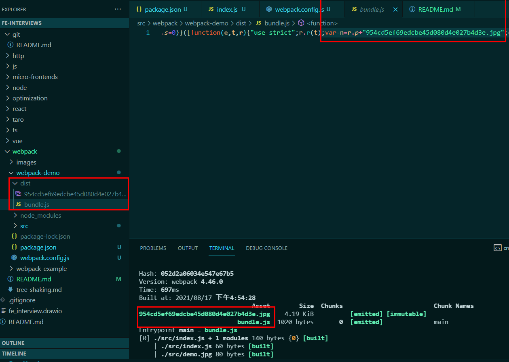

> file-loader 不仅仅可以处理 jpg 这样的文件图片。理论上，它还可以处理很多种类型的静态资源。

#### 1. loader的作用
> webpack 只能理解 JavaScript 和 JSON 文件，这是 webpack 开箱可用的自带能力。loader 让 webpack 能够去处理其他类型的文件，并将它们转换为有效模块，以供应用程序使用，以及被添加到依赖图中。

> loader是运行在打包之前的。

#### 2. loader是什么
> 本质上，loader 是导出为函数的 JavaScript 模块。

#### 3. file-loader 和 url-loader的区别
> url-loader 可以达到几近 file-loader 的效果。

> 当打包一个图片文件时，与 file-loader 不一样的是， url-loader 会将图片转换成一个 base64 的字符串，然后直接放到dist 目录下的 bundle.js(配置的打包输出文件) 里面，而不是单独生成一个图片文件。
> - 好处就是，直接访问，而不用去文件夹下访问，节省了一次 http 请求。
> - 坏处是，如果这个图片很大的话，会使得 bundle.js 文件变得很大，使得加载时间变得很长。
> - 可以使用limit属性进行限制，当图片大小 小于 该限制时，使用url-loader

> Webpack5 之前我们处理静态资源比如PNG 图片、SVG 图标等等，需要用到url-loader，file-loader，raw-loader。Webpack5 提供了内置的静态资源构建能力，我们不需要安装额外的 loader，仅需要简单的配置就能实现静态资源的打包和分目录存放。这三个loader在github上也停止了更新。webpack5使用四种新增的资源模块（[Asset Modules](https://webpack.js.org/guides/asset-modules/)）替代了这些loader的功能。
> - asset/resource 将资源分割为单独的文件，并导出url，就是之前的 file-loader的功能.
> - asset/inline 将资源导出为dataURL（url(data:)）的形式，之前的 url-loader的功能.
> - asset/source 将资源导出为源码（source code）. 之前的 raw-loader 功能.
> - asset 自动选择导出为单独文件或者 dataURL形式（默认为8KB）. 之前有url-loader设置asset size limit 限制实现。


#### 4. 样式loader
- 将 sass-loader 、css-loader 与 style-loader 进行链式调用，可以将样式以 style 标签的形式插入 DOM 中，或者使用 mini-css-extract-plugin 将样式输出到独立的文件中。

- 使用loader的顺序为：
[“style-loader”, “css-loader”, “sass-loader”]，先使用sass-loader将.less或.scss文件转换成css，再使用css-loader加载css文件，最后使用style-loader将css-loader处理的样式注入到HTML页面中。
>- style-loader：把js中import导入的样式文件打包到js文件中，运行js文件时，将样式自动插入到`<style>`标签中。如图：
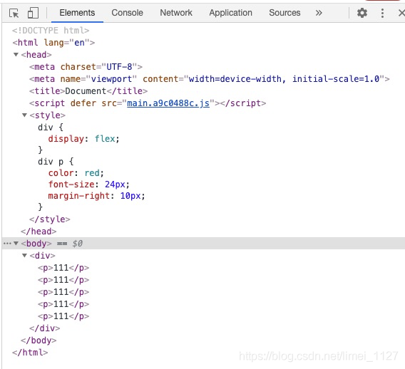

- MiniCssExtractPlugin 提取 JS 中引入的 CSS 打包到单独文件中，然后通过标签 `<link>`添加到头部。mini-css-extract-plugin：把js中import导入的样式文件，单独打包成一个css文件，结合html-webpack-plugin，以link的形式插入到html文件中。如图：
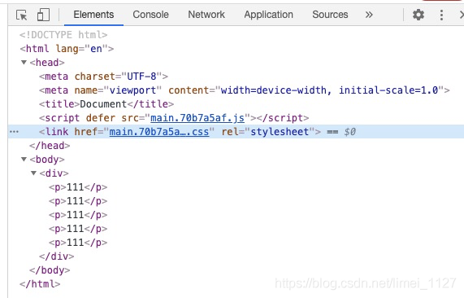

- css-loader启用CSS Modules

- postcss-loader
> postcss是一个 支持插件的 用于转换样式的 库（https://github.com/postcss/postcss/blob/main/docs/README-cn.md），使用插件可以实现很多功能，比如：编译尚未被浏览器广泛支持的先进的 CSS 语法、autoprefixer插件添加了浏览器前缀、使用插件检查你编写的css等。([搜索postcss插件](https://www.postcss.parts/)；[postcss插件列表](https://github.com/postcss/postcss/blob/main/docs/plugins.md))
> - PostCSS 接收一个 CSS 文件并提供了一个 API 来分析、修改它的规则（通过把 CSS 规则转换成一个抽象语法树的方式）。在这之后，这个 API 便可被许多插件利用来做有用的事情，比如寻错或自动添加 CSS vendor 前缀。
> - 在webpack里使用postcss的方式：1）在 webpack.config.js 里使用 postcss-loader；然后在根目录创建 postcss.config.js来配置postcss的插件。 或者2）在 webpack.config.js 里使用 postcss-loader，并且在options中配置postcss的插件。
```js
// webpack.config.js
module.exports = {
  module: {
    rules: [
      {
        test: /\.css$/,
        exclude: /node_modules/,
        use: [
          {
            loader: 'style-loader',
          },
          {
            loader: 'css-loader',
            options: {
              importLoaders: 1,
            }
          },
          {
            loader: 'postcss-loader'
          }
        ]
      }
    ]
  }
}

// postcss.config.js
module.exports = {
  plugins: [
    require('precss'),
    require('autoprefixer')
  ]
}

// 或者
// webpack.config.js
module.exports = {
  module: {
    rules: [
      {
        test: /\.css$/i,
        use: [
          'style-loader',
          {
            loader: 'css-loader',
            options: { importLoaders: 1 },
          },
          {
            loader: 'postcss-loader',
            options: {
              postcssOptions: {
                plugins: [
                  [
                    'autoprefixer',
                    {
                      // 选项
                    },
                  ],
                ],
              },
            },
          },
        ],
      },
    ],
  },
};
```
> - postcss-loader报错：TypeError: this.getOptions is not a function，这个报错的原因是版本太高了，可以使用npm install postcss-loader@4.2.0 -D

#### 5. babel-loader
- babel-loader只会将 ES6/7/8语法转换为ES5语法，但是对新api并不会转换。可以通过 babel-polyfill 对一些不支持新语法的客户端提供新语法的实现。安装npm install @babel/polyfill 或者使用 @babel/runtime-corejs2按需引入 polyfill

- 使用@babel/preset-env配置useBuiltIns:'usage'后提示core-js警告，解决：指定corejs的版本
```js
module.exports = {
  presets: [
    ["@babel/preset-env", {
      "corejs": "3", // 声明corejs版本
      "useBuiltIns": "usage" // 用到es6以上的函数，babel会自动导入相关的polyfill
    }]
  ]
}
```

#### 6. [vue-loader](https://vue-loader.vuejs.org/zh/guide/#vue-cli)

#### 7. [react hot loader](http://gaearon.github.io/react-hot-loader/)

#### 8. [ts-loader](https://www.webpackjs.com/guides/typescript/)

### 五、[plugin](https://www.webpackjs.com/plugins/)
> plugin可以运行在打包之前，也可以运行在打包的过程中，也可以运行在打包完成之后。
#### html-webpack-plugin
- 作用：直接为项目生成一个或多个HTML文件(HTML文件个数由插件实例的个数决定，即new HtmlWebpackPlugin()的个数)，并将webpack打包后输出的所有脚本文件自动添加到插件生成的HTML文件中。通过配置，可以将根目录下用户自定义的HTML文件作为插件生成HTML文件的模板。另外，还可以通过向插件传递参数来控制HTML文件的输出。
- 参数有inject等（https://juejin.cn/post/6844903853708541959）
- new HtmlWebpackPlugin() 若不传入任何参数，那么插件将生成默认的html文件，注意使用webpack-dev-server启动的话，生成的该html文件是放在内存中而不在项目目录下。默认生成的html文件如下：
  ```html
  <!DOCTYPE html>
  <html>
    <head>
      <meta charset="utf-8">
      <title>Webpack App</title>
    <meta name="viewport" content="width=device-width, initial-scale=1"><script defer src="vue.bundle.js"></script></head>
    <body>
    </body>
  </html>
  ```
- 注意上面的defer。defer和async的区别如图：
  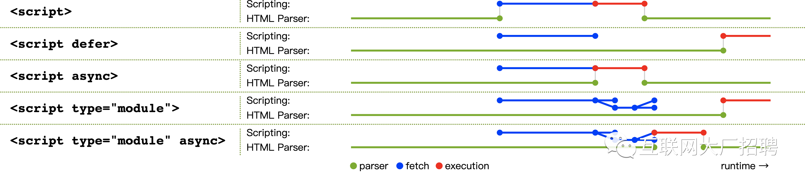
  如图，一般情况下，即script没有额外属性时，HTML先解析，当遇到script时则加载js脚本(fetch)，加载完后解析并执行(execution)，执行完后继续解析HTML。由此可见，js脚本的加载、解析并执行会阻塞DOM的渲染。
  如图，defer和async的相同点是异步加载；不同点是，async加载完后立即解析并执行，而defer加载完后延迟到DOM解析完成后，DOMContentLoaded 事件触发之前 执行。
- script放在head和body的区别
> [js的script标签到底是放在head还是body中？](https://www.jianshu.com/p/2e6f9b732a91)
> - head内的js会阻塞页面的传输和页面的渲染。
> - head 内的 JavaScript 需要执行结束才开始渲染 body，所以尽量不要将 JS 文件放在 head 内。
> - 内部的js一般放到body内。不阻塞页面的加载(事实上js会被缓存)。可以直接在js里操作dom，这时候dom是准备好的，即保证js运行时dom是存在的。
- 使用模板new HtmlWebpackPlugin({template:'./watcher/htmlwebpack.html'})，原htmlwebpack.html文件：
  ```html
  <!DOCTYPE html>
  <html lang="en">
  <head>
    <meta charset="UTF-8">
    <title>webpack</title>
  </head>
  <body>
    <div id="root"></div>
  </body>
  </html>
  ```
  webpack-dev-server打包后的文件：
  ```html
  <!DOCTYPE html>
  <html lang="en">
  <head>
    <meta charset="UTF-8">
    <title>webpack</title>
  <script defer src="vue.bundle.js"></script></head>
  <body>
    <div id="root"></div>
  </body>
  </html>
  ```

- 使用报错：TypeError: Cannot read property 'tap' of undefined，原因：与webpack版本不兼容，webpack是4+则html-webpack-plugin也应为4+；webpack是5+则html-webpack-plugin也应为5+

- html-webpack-plugin@3.2.0使用webpack-dev-server启动后或者使用webpack打包后控制台会显示Entrypoint undefined = index.html；升级到html-webpack-plugin@4.5.2后则显示正常Entrypoint HtmlWebpackPlugin_0 = __child-HtmlWebpackPlugin_0

- `<meta http-equiv="X-UA-Compatible" content="IE=edge">` X-UA-Compatible 是针对 IE8 版本的一个特殊文件头标记，用于为 IE8 指定不同的页面渲染模式。IE=edge 模式通知 Windows Internet Explorer 以最高级别的可用模式显示内容。

- `<meta name="viewport" content="width=device-width, initial-scale=1.0">` 该meta标签的作用是让当前viewport的宽度等于设备的宽度，初始缩放比例为1。([viewport](https://www.cnblogs.com/yelongsan/p/7975580.html))

#### mini-css-extract-plugin

#### [copy-webpack-plugin](https://runebook.dev/zh-CN/docs/webpack/plugins/copy-webpack-plugin)
- [webpack复制静态文件](https://www.imqianduan.com/webpack/100.html)
> from路径是相对项目的根目录；to路径相对webpack配置的output路径

- 使用该插件遇到的问题：
>- 注意："copy-webpack-plugin": "^9.0.1", 配置项globOptions中的gitignore设置为true，编译时会报错：in Path ... is not in cwd ... 解决方案：gitignore设置为false
>- 编译报错：`unable to locate '.../public/**/*' glob`，配置如下: 
```js
new copyWebpackPlugin({
	patterns: [{
		from: path.resolve(__dirname, "../public"),
		to: 'static',
		globOptions: {
			dot: true,
			gitignore: false,
			ignore: ["**/index.html*"],
		}
	}]
})

// 报错的原因：For SPA, this problem occurs If public folder only contains index.html or public folder is empty

// 解决方案：public下不要只放index.html
```

#### [DefinePlugin](https://www.webpackjs.com/plugins/define-plugin/)

### 六、webpack-dev-server
> 在每次编译代码时，手动运行 npm run build 会显得很麻烦。可以使用webpack --watch来实现每次修改完代码后自动监听。webpack 提供几种可选方式，帮助你在代码发生变化后自动编译代码(https://www.webpackjs.com/guides/development/)：
>- webpack's Watch Mode
>- webpack-dev-server
>- webpack-dev-middleware

> webpack --watch 每次改动会重新打包；webpack-dev-server具有比webpack --watch更高级的功能，比如支持浏览器自动刷新、支持模块热替换、支持source map等，webpack-dev-server 每次改动不会重新打包。
> webpack-dev-server是webpack官方提供的一个工具，提供了一个基本的 web server，并且具有 live reloading(实时重新加载) 功能。（参考：https://www.cnblogs.com/SamWeb/p/8353367.html）
>- 使用webpack-dev-server报错：Cannot find module 'webpack-cli/bin/config-yargs'。解决方案： 修改page.json文件中的脚本，webpack-dev-server 改写成 webpack serve
>- 当mode为development时，会具备hot reload的功能，即当源码文件变化时会立即更新当前页面。
>- webpack-dev-server默认使用8080端口
>- 如果使用了html-webpack-plugin来构建HTML文件，并且有一个index.html的构建结果，那么直接访问http://localhost:8080 就可以看到index.html页面；如果没有HTML文件的话，那么webpack-dev-server会生成一个展示静态资源列表的页面。
>- 在webpack的配置中，可以通过**[devServer](https://www.webpackjs.com/configuration/dev-server/)**来配置webpack-dev-server，如端口、启动gzip压缩等
>- 注意：**webpack-dev-server生成的包并没有放在你的真实目录中，而是放在了内存中，可在浏览器的source中查看**。
>- **默认情况下，webpack-dev-server会把打包后的文件放到项目的根目录下，文件名是配置文件中指定的output的filename；当配置了publicPath，会把打包后的文件放到publicPath指定的目录下，文件名还是配置文件中指定的output的filename。**
>- **webpack-dev-server的配置devServer的配置项publicPath应该与output的publicPath保持一致，否则404。devServer的配置项publicPath优先于devServer的配置项contentBase。**

- [如何通过 Node.js API 使用 webpack-dev-server](https://github.com/webpack/webpack-dev-server/tree/master/examples/api/simple)

### 七、SourceMap
- 当 webpack 打包源代码时，可能会很难追踪到 error(错误) 和 warning(警告) 在源代码中的原始位置。例如，如果将三个源文件（a.js, b.js 和 c.js）打包到一个 bundle（bundle.js）中，而其中一个源文件包含一个错误，那么堆栈跟踪就会直接指向到 bundle.js。为了更容易地追踪 error 和 warning，JavaScript 提供了 [source maps](https://blog.teamtreehouse.com/introduction-source-maps) 功能，可以将编译后的代码映射回原始源代码。如果一个错误来自于 b.js，source map 就会明确的告诉你。

- 使用**devtool**配置项控制是否生成，以及如何生成source map。[devtool](https://www.webpackjs.com/configuration/devtool/)

### 八、webpack-chain
#### [文档](https://github.com/Yatoo2018/webpack-chain/tree/zh-cmn-Hans)

#### 参考资料
- [读 VuePress（二）：使用 Webpack-chain 链式生成 webpack 配置](https://www.jianshu.com/p/a63b55b1d9cc)

#### webpack-chain核心概念
##### Chainable
```js
module.exports = class {
  constructor(parent) {
    this.parent = parent;
  }

  batch(handler) {
    handler(this);
    return this;
  }

  end() {
    return this.parent;
  }
};
```
- end 方法便是来源于这了，它会返回调用链中最前端的那个对象。比如：
```js
config
    .use('cache-loader')
    .loader('cache-loader')
    .options({
      cacheDirectory,
      cacheIdentifier
    })
    .end() // 返回的便又是 config 了
    .use('babel-loader')
      .loader('babel-loader')
      .options({
        // do not pick local project babel config
        babelrc: false,
        presets: [
          require.resolve('@vue/babel-preset-app')
        ]
      })
```
##### ChainedMap---继承于 Chainable
##### ChainedSet---继承于 Chainable
- add
```js
config
  .entry('app')
    .add('src/index.js')

// 等价于下面的webpack配置
entry: {
  app: './src/index.js'
}
```

## 原理层面
> 参考资料：
> - [webpack打包原理 ? 看完这篇你就懂了 !](https://segmentfault.com/a/1190000021494964)


- bundle
  - bundle 是一个立即执行函数，可以认为它是把所有模块捆绑在一起的一个巨型模块
  - webpack 将所有模块打包成了 bundle 的依赖，通过一个对象注入
  - webpack 通过 `__webpack_require__` 引入模块，`__webpack_require__` 就是我们使用的 require，被 webpack 封装了一层

### tree-shaking
从 Webpack2.x 通过插件逐步实现 tree-shaking，到最近炙手可热的 Vite 构建工具也借助了 rollup 的打包能力，众所周知 Vue 和 React 也是使用 rollup 进行打包的，尤其当我们创建函数库、工具库等库的打包时，首选也是 rollup！那么到底是什么魔力让 rollup 经久不衰呢？答案也许就在 tree-shaking！

#### 1. tree-shaking的作用
本质上消除无用的 JS 代码。就是说，当引入一个模块时，并不引入整个模块的所有代码，而是只引入我需要的代码，那些我不需要的无用代码就会被”摇“掉。
> 要注意的是，tree-shaking 虽然能够消除无用代码，但仅针对 ES6 模块语法，因为 ES6 模块采用的是静态分析，从字面量对代码进行分析，可以在编译时正确判断到底加载了什么代码。对于必须执行到才知道引用什么模块的 CommonJS 动态分析模块他就束手无策了，不过我们可以通过插件支持 CommonJS 转 ES6 然后实现 tree-shaking。rollup.js 默认采用 ES 模块标准，但可以通过 rollup-plugin-commonjs 插件使之支持 CommonJS 标准。

#### 2. 为什么需要tree-shaking
减少 web 项目中 JavaScript 的无用代码，就是减小文件体积，加载文件资源的时间也就减少了，从而通过减少用户打开页面所需的等待时间，来增强用户体验。

#### 3. 什么是无用的代码
- DCE（dead code elimination）：
  - 代码不会被执行，不可到达
  - 代码执行的结果不会被用到
  - 代码只会影响死变量，只写不读

- tree-shaking 是 DCE 的一种新的实现，tree-shaking 更关注消除没有用到的代码。
- tree-shaking 更关注于消除那些引用了但并没有被使用的模块，这种消除原理依赖于 ES6 的模块特性。
- ES6 Module：
  - 只能作为模块顶层的语句出现
  - import 的模块名只能是字符串常量
  - import binding 是 immutable 的（不可改变的）

- tree-shaking：
  - 消除变量：定义的变量 如果没使用到，它们不会出现在打包后的文件中。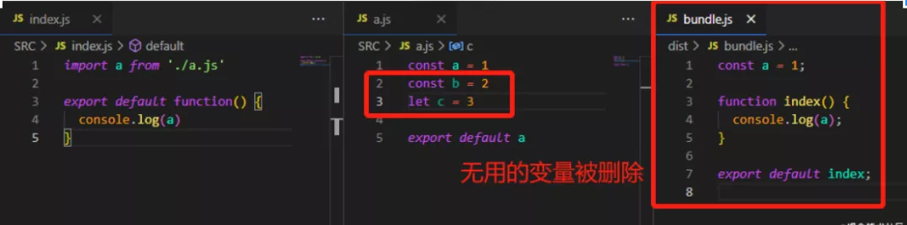
  - 消除函数：仅引入但未使用到的 函数方法，不会出现在打包后的文件中。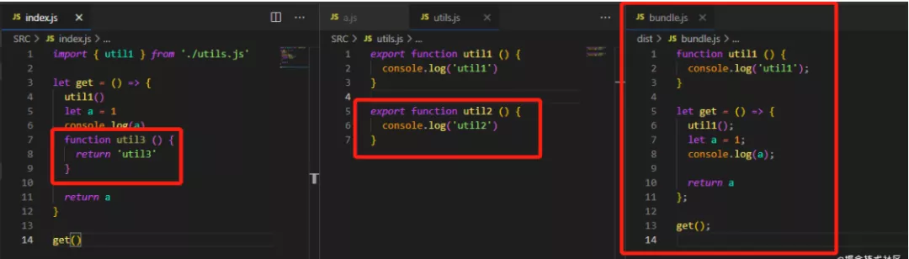
  - 消除类：仅引用类文件但实际代码中并未用到该类的任何方法和变量时，该类的所有代码，不会出现在打包后的文件中。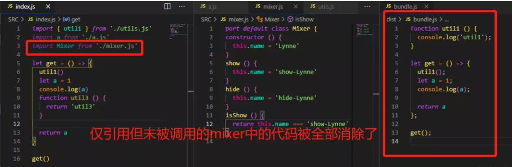

- 相对于 Webpack，rollup 在消除副作用方面有很大优势。但对于下列情况下的副作用，rollup 也无能为力：
  - 模块中类的方法未被引用。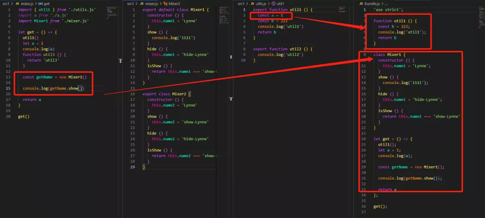
  - 模块中定义的变量影响了全局变量。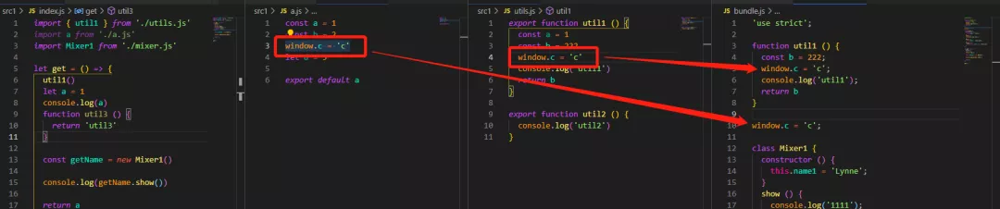

#### 4. 怎么消除无用代码
**基于作用域，在 AST 过程中对函数或全局对象形成对象记录，然后在整个形成的作用域链对象中进行匹配 import 导入的标识，最后只打包匹配的代码，而删除那些未被匹配使用的代码。**

#### 5. tree-shaking的实现流程
- rollup 中的 tree-shaking 使用 acorn 实现 AST 抽象语法树的遍历解析，acorn 和 babel 功能相同，但 acorn 更加轻量。
- rollup 使用 magic-string 工具操作字符串和生成 source-map。
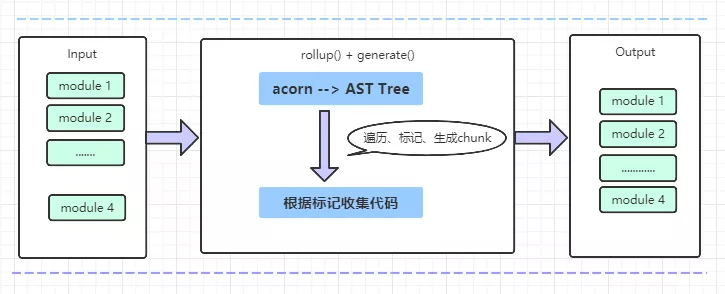
- rollup()阶段，解析源码，生成 AST tree，对 AST tree 上的每个节点进行遍历，判断出是否 include(标记避免重复打包)，是的话标记，然后生成 chunks，最后导出。
- generate()/write()阶段，根据 rollup()阶段做的标记，进行代码收集，最后生成真正用到的代码。

## 实战层面
- [一步步从零开始用 webpack 搭建一个大型项目](https://juejin.cn/post/6844904007903772679)
- [基于 vue3 + webpack 5 + sass+ vw 适配方案+axios 封装](https://juejin.cn/post/6989973871663251487)
- [面试官：自己搭建过vue开发环境吗？](https://juejin.cn/post/6844903833160646663)

## 优化层面
- 通过 speed-measure-webpack-plugin 测量你的 webpack 构建期间各个阶段花费的时间。
- 通过 webpack-bundle-analyzer 扫描 bundle 并构建其内部内容的可视化。使用此可视化来查找大的或不必要的依赖项。
- 在线分析工具：1. https://webpack.github.io/analyse/ 2. http://alexkuz.github.io/webpack-chart/ 3. http://chrisbateman.github.io/webpack-visualizer/
> 在线分析都需要先拿到webpack 统计文件。有两种方式获取该文件：
> - 在 webpack 启动时带入参数：--profile --json > stats.json ，例如：`webpack --config webpack.config.prod.js --profile --json > stats.json`，参考：[五种工具可视化分析 webpack 打包性能瓶颈](https://www.manongdao.com/article-2359538.html)
> - 使用stats-webpack-plugin，参考：[Vue-Cli项目如何查看依赖调用关系？](https://www.cnblogs.com/rever/p/10978703.html)

## webpack5
### [webpack5系列](https://mp.weixin.qq.com/s/pwynolH0pTtT38f-xBUsXw)
### Module Federation
1. [探索 webpack5 新特性 Module federation 在腾讯文档的应用](https://juejin.cn/post/6844904127596593160)
### 用webpack5封装项目遇到的问题
1. Module not found: Error: Can't resolve './src'   解决方案：需要指定entry(https://github.com/webpack/webpack-cli/issues/1843)

2. [webpack项目注入全局变量](https://www.cnblogs.com/dshvv/p/14148834.html)
> [vue,react 项目.env 环境变量原理解析](https://l-x-f.github.io/2020/10/24/node/env/)

3. 更改样式没有热更新，需要刷新页面。原因是开发环境进行了样式抽取。[webpack 开启热更新之后 样式文件修改后 页面不会刷新 但是js文件可以](https://blog.csdn.net/yunchong_zhao/article/details/108142523)

4. 使用DefinePlugin，注意：如果值是字符串，则需要使用JSON.stringfy或包裹引号进行处理，不处理的话编译后会原样转化(即不带引号)就会报错。
> 请注意，由于本插件会直接替换文本，因此提供的值必须在字符串本身中再包含一个 实际的引号 。通常，可以使用类似 '"production"' 这样的替换引号，或者直接用 JSON.stringify('production')。

5. 使用DefinePlugin注入全局变量并封装到依赖包后提供给vue项目使用，在template中使用定义的全局变量总是报错。原因：不能在template中直接使用([I think that you should avoid using process directly in template and you can use computed for proxying.](https://github.com/vuejs/vue-cli/issues/5059))。vue文件中的script里可以正常使用。

6. 使用resolve的alias配置完别名后编译报错：Can't resolve '@/views  原因：import .vue文件时应该带后缀，不能省略.vue这个后缀

7. 封装的webpack作为依赖包让vue工程使用，在vue工程中的package.json中的scripts命令中设置环境变量参数（目的是往DefinePlugin中注入）报错。比如：
```js
// vue工程的package.json
"scripts": {
  "servePre": "webpack-cli serve --env-type pre"
}

// 这时会遇到4个问题：
// 1. 编译时控制台报错：Error: Unknown option '--env-type'
// 针对这个问题的解决方法是：在封装的webpack-cli中定义serve命令时使用option定义该命令的参数，如：
program.command('serve').option('-et, --env-type <envType>', 'set the global variable')
// 2. 此时，--env-type 和 pre，并不会注入到process.argv中，需要用到的一个知识点是：向 npm 脚本传入参数(https://www.ruanyifeng.com/blog/2016/10/npm_scripts.html)
// 针对这个问题的解决方法是：在封装的webpack-cli中定义serve命令的执行操作中使用 -- 向npm脚本传入参数，如：
program.command('serve').option('-et, --env-type <envType>', 'set the global variable').description('serve the project').action((name, options)=>{
  childProcess.spawn('npm', ['run', 'serve', '--', '--env-type', name.envType], {
    // spawn的options
  })
})
// 3. 此时，编译还会报错，如下：
[webpack-cli] Error: Unknown option '--env-type'
[webpack-cli] Run 'webpack --help' to see available commands and options
// 原因是将--env-type当成webpack的参数处理了
// 针对这个问题的解决方法是：使用 -- 隔开，即：
childProcess.spawn('npm', ['run', 'serve', '--', '--', '--env-type', name.envType]
// 4. 上面使用 -- 隔开处理后，编译时还是会解析自定义的命令去对应webpack的配置文件(CLI 中传入的任何参数会在配置文件中映射为对应的参数: https://www.webpackjs.com/api/cli/)，导致报错。
// 最终的解决方案是：放弃使用process.argv（当然，也可以使用往process.argv中push这种方案，不过感觉这种不好），转而使用上层的argv，即使用该依赖包的工程中的scripts命令参数(通过commander的action的入参options进行获取：options.parent.rawArgs)。然后结合process.env，最终将配置文件中的Key-Value注入到DefinePlugin
```

8. [webpack设置和获取命令行动态传参的4种方法](http://www.jsphp.net/webpack/show-26-556-1.html)
9. [_defaultsdeep](https://lodash.shujuwajue.com/object/defaultsdeep)
10. 路由懒加载(即路由组件懒加载)
- [vue-router路由懒加载原理](https://juejin.cn/post/6844904180285456398)
- [Vue Webpack 打包优化——路由懒加载（按需加载）原理讲解及使用方法说明](https://blog.csdn.net/weixin_44869002/article/details/106288371)
> 实现组件懒加载(按需加载)需要2步：(1)对需要按需加载的组件进行单独打包 (2)组件用到的时候再加载而不是一次性加载

> A. 单独打包

> 1）首先正常引入，如：

```
Vue.use(VueRouter)
export default new VueRouter({
  mode: 'hash',
  routes: [
    {
      path: '/home',
      component: Home
    },
    {
      path: '/about',
      component: About
    },
    {
      path: '*',
      redirect: '/home'
    }
  ]
})
```

> 打包后发现都在一个js文件中(webpack设置splitChunks的话，打包后还会有一个vue的vendor js文件)

> 2）稍作修改，如：

```
Vue.use(VueRouter)
export default new VueRouter({
  mode: 'hash',
  routes: [
    {
      path: '/home',
      // component: Home
      component: import('@/views/Home.vue')
    },
    {
      path: '/about',
      component: About
    },
    {
      path: '*',
      redirect: '/home'
    }
  ]
})
```

> 打包后发现，Home.vue会被单独打包到一个js文件中。即**使用ES6的import()实现组件单独打包**。但是，此时使用http-server启动打包后的文件，会报错：Failed to mount component:template or render function not defined

> B. 用到的时候再加载，使用函数实现，函数就是调用的时候才执行

> 对上述的2）再稍作修改，如：

```
Vue.use(VueRouter)
export default new VueRouter({
  mode: 'hash',
  routes: [
    {
      path: '/home',
      // component: Home
      component: () => import('@/views/Home.vue')
    },
    {
      path: '/about',
      component: About
    },
    {
      path: '*',
      redirect: '/about'
    }
  ]
})
```

> 打包后发现，Home.vue会被单独打包到一个js文件中，并且启动也不报错了。然后改为一进来匹配/about，使用chrome的network面板观察此时有没有加载Home.vue打包后的文件。发现：切换到/home路由时才请求Home.vue打包后对应的js文件。

> C. 组件单独打包，除了使用ES6的import()方法，还可以使用require.ensure()。如：
```js
{
  path: '/home',
  name: 'home',
  component: resolve  => require.ensure([], () => resolve (require('@/components/home')), 'demo')
},
```

> 注意：require.ensure() 是 webpack 特有的，已经被 import() 取代。

> D. 设置打包生成的文件(chunk)的名字：使用webpack的output.chunkFilename属性。
> - 未设置chunkFilename
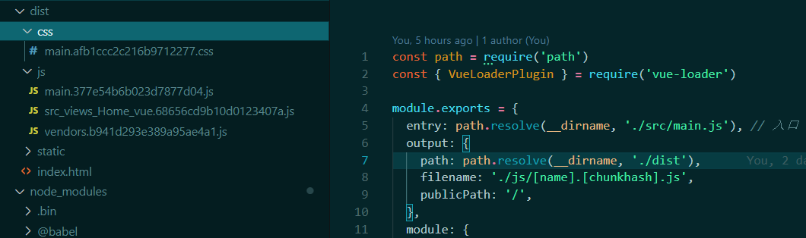
> - 设置chunkFilename
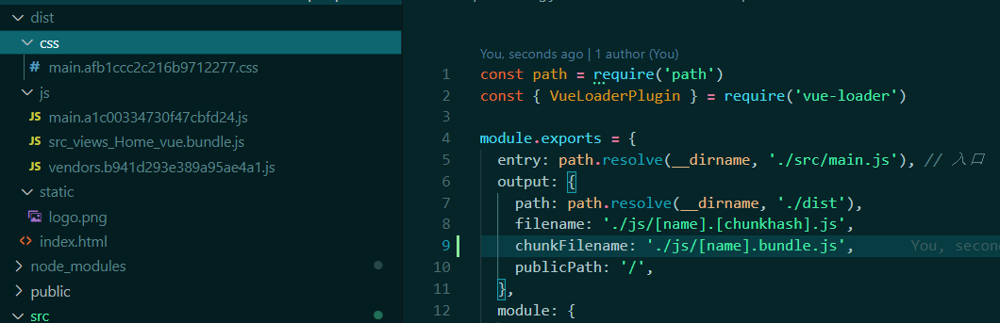
> - 注意：不设置的话，output.chunkFilename默认使用 [id].js 或从 output.filename 中推断出的值（[name] 会被预先替换为 [id] 或 [id].）。

> E. 把不同的组件打包到同一个chunk中：import时加注释/* webpackChunkName: "xxx" */
> - 不加注释时，如：

```
Vue.use(VueRouter)
export default new VueRouter({
  mode: 'hash',
  routes: [
    {
      path: '/home',
      // component: Home
      component: () => import('@/views/Home.vue')
    },
    {
      path: '/newhome',
      component: () => import('@/views/NewHome.vue')
    },
    {
      path: '/about',
      component: About
    },
    {
      path: '*',
      redirect: '/about'
    }
  ]
})
/*
打包后会有4个js文件：
main.921ffdfb27b326bd1cb0.js
src_views_Home_vue.68656cd9b10d0123407a.js
src_views_NewHome_vue.263b2a91436b3fae382d.js
vendors.b941d293e389a95ae4a1.js
*/
```

> - 加注释后，如：

```
Vue.use(VueRouter)
export default new VueRouter({
  mode: 'hash',
  routes: [
    {
      path: '/home',
      // component: Home
      component: () => import(/* webpackChunkName: "home" */ '@/views/Home.vue')
    },
    {
      path: '/newhome',
      component: () => import(/* webpackChunkName: "home" */ '@/views/NewHome.vue')
    },
    {
      path: '/about',
      component: About
    },
    {
      path: '*',
      redirect: '/about'
    }
  ]
})
/*
打包后，有3个js文件：
home.050a110d6ab98dee4f87.js
main.1d5d1cca0f9a4f23c610.js
vendors.b941d293e389a95ae4a1.js
*/
```

> F. 对于vue-router官方文档上说的需要安装syntax-dynamic-import这个babel插件来实现路由懒加载，反正使用webpack5的时候不安装也可以，5以下的就没试过了。

1.  使用babel支持typescript
- 在 babel7 之前，是需要同时使用 ts-loader 和 babel-loader 的，其编译过程 TS > TS 编译器 > JS > Babel > JS 。可见编译了两次js，效率有些低下。但是 babel7 出来之后有了解析 typescript 的能力，有了这一层面的支持，我们就可以只使用 babel，而不用再加一轮 ts 的编译流程了。即可以使用babel-loader()来处理ts，而不需要再使用ts-loader。(参考：[Webpack5 搭建 Vue3 + TS 项目](https://blog.csdn.net/lgno2/article/details/116457524))

1.  使用webpack-dev-server 4.x 启动服务后（host:127.0.0.1）请求接口，接口能正常请求到，但浏览器控制台一直报错：[webpack-dev-server] invalid host/origin header。解决方案：配置devServer的allowedHosts，并且host使用allowedHosts里面配置的值。

2.  打包正确姿势：nginx的server的location指定的访问路径===webpack的output的publicPath配置的值

3.  vue 路由懒加载，动态设置webpackChunkName：使用webpack 2.6.0 以上的占位符[ index ]和[ request ]
- [在 vue 路由懒加载中给 Webpack Chunks 命名](https://blog.csdn.net/senmage/article/details/105691054)

1.  windows启动项目提示node-sass安装失败的解决方案：删除项目中的node_modules，切换到cnpm，然后全局安装node-sass，然后再在项目中重新npm install。

2.  webpack < 5 used to include polyfills for node.js core modules by default.
- Can't resolve 'fs'等类似的报错也都是这个原因
- 在运行过程中出现了很多这样的报错信息，是由于在webpack5中移除了nodejs核心模块的polyfill自动引入，所以需要手动引入，如果打包过程中有使用到nodejs核心模块，需要单独配置。[webpack5升级过程遇到的一些坑](https://www.cnblogs.com/sk-3/p/14147612.html)
```js
// webpack.config.js
module.exports = {
  ...
  resolve: {
    // https://github.com/babel/babel/issues/8462
    // https://blog.csdn.net/qq_39807732/article/details/110089893
    // 如果确认需要node polyfill，设置resolve.fallback安装对应的依赖
    fallback: {
      crypto: require.resolve('crypto-browserify'),
      path: require.resolve('path-browserify'),
      url: require.resolve('url'),
      buffer: require.resolve('buffer/'),
      util: require.resolve('util/'),
      stream: require.resolve('stream-browserify/'),
      vm: require.resolve('vm-browserify')
    },
    // 如果确认不需要node polyfill，设置resolve.alias设置为false
    alias: {
      crypto: false
    }
  }
}
```

1.  导入ts文件a但是没带.ts后缀，编译时报错：Can't resolve 'a'
> 解决方法：配置webpack的resolve.extensions，该属性的作用是尝试按顺序解析这些后缀名，能够使用户在引入模块时不带扩展。如果有多个文件有相同的名字，但后缀名不同，webpack 会解析列在数组首位的后缀的文件 并跳过其余的后缀。
```js
module.exports = {
  //...
  resolve: {
    extensions: ['.ts', '.js', '.json', '.wasm'],
  },
};
```

## 手写一个webpack loader([Writing a Loader](https://webpack.docschina.org/contribute/writing-a-loader/))

### 遇到的问题
- 如果test一个项目中没有使用到的文件，则不会进入use里的loader
```js
// webpack.config.js
module: {
  rules: [
    {
      test: /\.vue$/,
      loader: 'vue-loader'
    },
    {
      test: /demo\_routes\.js/,
      include: [
        path.resolve(__dirname, 'src/tests')
      ],
      use: [
        {
          loader: './handleFileLoader.js' // 自定义的loader
        }
      ]
    }
  ]
},

// main.js
import { demoVar } from './tests/demo'

// 如上，如果项目中没有使用src/tests/index.js，则webpack编译时不会进入handleFileLoader.js。如果main.js中使用的demo换成demo_routes，则编译时就会进入handleFileLoader.js
```

- loader需要处理的是ts文件，不需要先用babel转换为js文件，不会报错，拿到的是ts文件的原样

- 链式调用：同一个文件使用多个loader

- loader可以传option，然后可以使用this.query来接收，也可以使用loader-utils来接收(需要先install)

- Loader can't be Function. 配置文件中的loader不能写成函数，也不能写成对象。A loader is a node module that exports a function.

- [loader引入的几种方式](https://www.cnblogs.com/wuxianqiang/p/11332544.html)

- webpack5 如果启用缓存，即配置了cache，则自定义的loader只会在第一次编译(build)时执行（serve不受cache影响），或许是我cache配置的有问题？我的配置如下
```
cache: {
  type: 'filesystem',
  buildDependencies: {
    config: [__filename]
  }
},
```

- 自定义loader中一定要return，调试时自定义loader的test是项目的主入口js文件，因为没return，结果编译都不报错，不过页面啥都没有

## 手写一个webpack插件([自定义插件](https://www.webpackjs.com/contribute/writing-a-plugin/))
- [手把手带你入门 Webpack Plugin](https://www.zoo.team/article/webpack-plugin)
> webpack执行流程
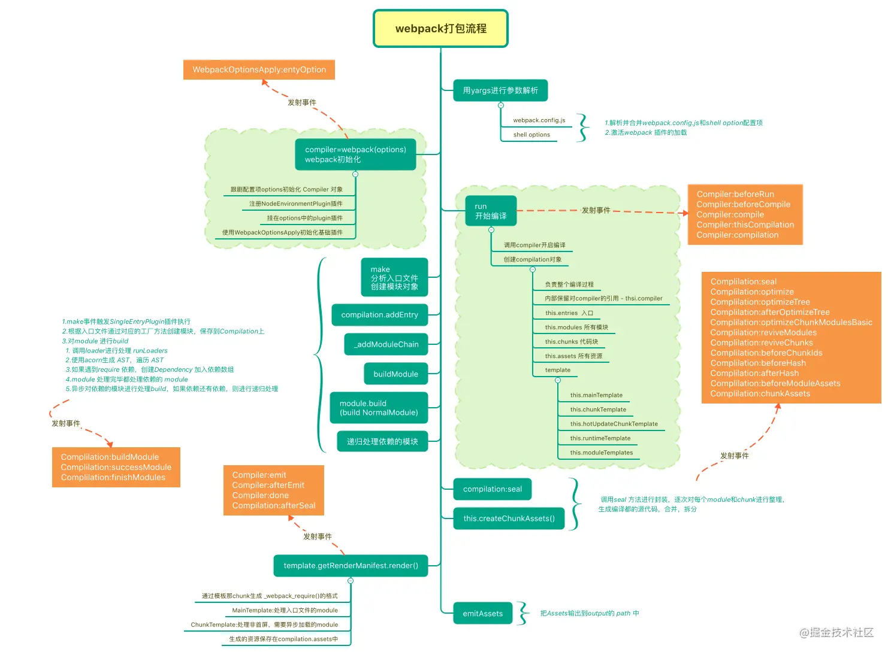
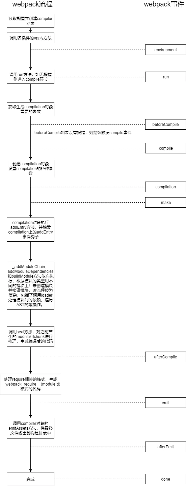
### 1. webpack构建流程
- webpack的基本构建流程如下：
> - 校验配置文件
> - 生成Compiler对象
> - 初始化默认插件
> - run/watch：如果运行在watch模式则执行watch方法，否则执行run方法
> - compilation：创建Compilation对象回调compilation相关钩子
> - emit：文件内容准备完成，准备生成文件，这是最后一次修改最终文件的机会
> - afterEmit：文件已经写入磁盘完成
> - done：完成编译
### 2. Tapable([tapable](https://github.com/webpack/tapable)；[梳理tapable的九大钩子函数的使用及原理](https://blog.csdn.net/qq_17175013/article/details/119547711))
- Tapable是 webpack 的一个核心工具，在 webpack 中的许多对象都扩展自 Tapable 类。 它对外暴露了 tap，tapAsync 和 tapPromise 等方法， 插件可以使用这些方法向 webpack 中注入自定义构建的步骤，这些步骤将在构建过程中触发。

> hooks can be synchronous or asynchronous. To reflect this, there’re “Sync”, “AsyncSeries”, and “AsyncParallel” hook classes:

> - Sync. A sync hook can only be tapped with synchronous functions (using myHook.tap()).

> - AsyncSeries. An async-series hook can be tapped with synchronous, callback-based and promise-based functions (using myHook.tap(), myHook.tapAsync() and myHook.tapPromise()). They call each async method in a row.

> - AsyncParallel. An async-parallel hook can also be tapped with synchronous, callback-based and promise-based functions (using myHook.tap(), myHook.tapAsync() and myHook.tapPromise()). However, they run each async method in parallel.

- tap。可用于同步钩子函数和异步钩子函数的调用。
```js
// 在compile阶段插入同步钩子的示例
compiler.hooks.compile.tap('MyWebpackPlugin', params => {
  console.log('我是同步钩子')
});
```
- tapAsync。用于异步钩子函数的调用，通过callback回调告诉Webpack异步执行完毕。
```js
class HelloAsyncPlugin {
  apply(compiler) {
    compiler.hooks.emit.tapAsync(
      'HelloAsyncPlugin',
      (compilation, callback) => {
        // 执行某些异步操作...
        setTimeout(function () {
          console.log('异步任务完成...');
          callback();
        }, 1000);
      }
    );
  }
}

module.exports = HelloAsyncPlugin;
```
- tapPromise。用于异步钩子函数的调用，返回一个Promise告诉Webpack异步执行完毕。
```js
class HelloAsyncPlugin {
  apply(compiler) {
    compiler.hooks.emit.tapPromise('HelloAsyncPlugin', (compilation) => {
      // 返回一个 pormise ，异步任务完成后 resolve
      return new Promise((resolve, reject) => {
        setTimeout(function () {
          console.log('异步任务完成...');
          resolve();
        }, 1000);
      });
    });
  }
}

module.exports = HelloAsyncPlugin;
```
### 3. 常用的生命周期钩子函数([compiler-hooks](https://www.webpackjs.com/api/compiler-hooks/)；[compilation-hooks](https://www.webpackjs.com/api/compilation-hooks/))
| 钩子      | 说明 | 参数     | 类型 |
|    :----:   |    :----:   |    :----:   |    :----:   |
| afterPlugins | 启动一次新的编译 | compiler | 同步 |
| compile | 创建compilation对象之前 | compilationParams | 同步 |
| compilation | compilation对象创建完成 | compilation | 同步 |
| emit | 资源生成完成，输出之前 | compilation | 异步 |
| afterEmit | 资源输出到目录完成 | compilation | 异步 |
| done | 完成编译 | stats | 同步 |

### 4. 插件是由「具有 apply 方法的 prototype 对象」所实例化出来的
- 这个 apply 方法在安装插件时，会被 webpack compiler 调用一次。
- Webpack在启动时会实例化插件对象，在初始化compiler对象之后会调用插件实例的apply方法，传入compiler对象，插件实例在apply方法中会注册相应的钩子，Webpack在执行过程中会根据构建阶段回调相应的钩子。
- **apply方法中插入钩子的一般形式如下**：compiler.hooks.生命周期钩子函数.Tapable暴露的函数('插件名称', (阶段回调参数) => { ... });
```js
class MyExampleWebpackPlugin {
  // 在插件函数的 prototype 上定义一个 `apply` 方法，以 compiler 为参数。
  apply(compiler) {
    // 指定一个挂载到 webpack 自身的事件钩子。
    compiler.hooks.emit.tapAsync(
      'MyExampleWebpackPlugin',
      (compilation, callback) => {
        console.log('这是一个示例插件！');
        console.log(
          '这里表示了资源的单次构建的 `compilation` 对象：',
          compilation
        );

        // 用 webpack 提供的插件 API 处理构建过程
        compilation.addModule(/* ... */);

        callback();
      }
    );
  }
}
module.exports = MyExampleWebpackPlugin;
```
```js
class HelloWorldPlugin {
  apply(compiler) {
    compiler.hooks.done.tap(
      'Hello World Plugin',
      (
        stats /* 绑定 done 钩子后，stats 会作为参数传入。 */
      ) => {
        console.log('Hello World!');
      }
    );
  }
}

module.exports = HelloWorldPlugin;
```
### 5. [Compiler](https://github.com/webpack/webpack/blob/main/lib/Compiler.js)
- Compiler对象包含了当前运行Webpack的配置，包括entry、output、loaders等配置，这个对象在启动Webpack时被实例化，而且是全局唯一的。Plugin可以通过该对象获取到Webpack的配置信息进行处理。
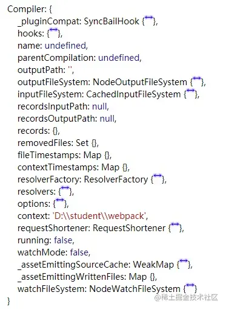

### 6. [Compilation](https://github.com/webpack/webpack/blob/main/lib/Compilation.js)
- Compilation对象，包含了模块、依赖、文件等信息。在开发模式下运行Webpack时，每修改一次文件都会产生一个新的Compilation对象，Plugin可以访问到本次编译过程中的模块、依赖、文件内容等信息。
- compilation实例 能够访问所有的模块和它们的依赖（大部分是循环依赖）。
- [compilation 对象方法](https://www.webpackjs.com/api/compilation-object/#compilation-object-methods)


### 7. ContextModuleFactory
> Compiler 使用 ContextModuleFactory 模块从 webpack 独特的 require.context API 生成依赖关系。它会解析请求的目录，为每个文件生成请求，并依据传递来的 regExp 进行过滤。最后匹配成功的依赖关系将被传入 NormalModuleFactory。

### 8. NormalModuleFactory

### 9. parser
- 参考 [webpack进阶之Parser](https://juejin.cn/post/6844904095728271374)
> webpack Parser是对模块ast进行遍历，所以可以获取到更细粒度的模块内容信息，例如模块是否调用了未定义的变量标识符，模块依赖了哪些第三方js模块、是否有指定成员的调用等等，基于此，我们可以利用webpack Parser提供的钩子做一些特殊的事情，最典型的应用：分析模块的依赖或者根据不同的情况为模块添加依赖。
```js
normalModuleFactory.hooks.parser.for('javascript/auto').tap('MyPlugin', (parse, options) => {

})
```

### 10. [Resolvers 解析器](https://webpack.docschina.org/api/resolvers/#root)
- 在 compiler 类中，提供了三种类型的内置解析器：
> - normal: 通过绝对或相对路径解析模块。
> - context: 在给定的上下文中解析模块。
> - loader: 解析 webpack loader。
- [enhanced-resolve](https://github.com/webpack/enhanced-resolve)


### 11. webpack执行流程及触发的钩子函数
- 钩子函数触发顺序
```js
// 例子：
// tool.test.js
import { route } from './util.test'

console.log('route', route)

function square(n) {
  return n * n;
}
let ace = 'test-tool';
console.log('ace', ace)

// util.test.js
import { dateForm } from './date.test.js'

export const route = {
  path: '/',
  children: [ ]
}
const fn = () => {
  console.log('fn')
}
console.log('dateForm', dateForm)

/*
normalModuleFactory---beforeResolve  tool.test.js
compiler---resolverFactory---resolver  tool.test.js
normalModuleFactory---createModule  tool.test.js
thisCompilation---buildModule  tool.test.js

compiler---resolverFactory---resolver  
thisCompilation---optimizeDependencies
*/
```
- [webpack编译流程分析](https://pcaaron.github.io/pages/fe/webpack/flow.html#%E5%87%86%E5%A4%87%E9%98%B6%E6%AE%B5)
- [Webpack 内部插件与钩子关系](https://alienzhou.com/projects/webpack-internal-plugin-relation/)

### 12. 编译时报错：Missing semicolon
- 原因是解析不了ts文件。
- 使用babel的preset

```js
const babel = require('@babel/core');
let transformFileResult = babel.transformFileSync(filePath,{
    presets: ["@babel/preset-typescript"],
});
let fileAst = babel.parseSync(transformFileResult.code);
```