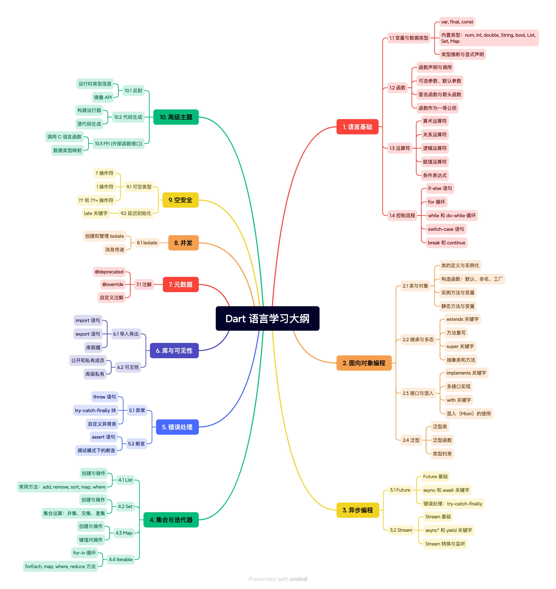

## Day1

### 借助Claude 3.5 Sonnet了解Dart
Dart 是一种versatile编程语言,主要用途包括:

1. 移动应用开发
   - 使用Flutter框架开发跨平台的iOS和Android应用

2. Web开发
   - 可以编译成JavaScript,用于前端开发
   - 也可以用于服务器端开发

3. 桌面应用开发
   - 使用Flutter for Desktop开发跨平台桌面应用

4. 命令行工具开发
   - 开发各种CLI工具和脚本

5. 服务器端开发
   - 可以用于构建后端服务和API

6. 游戏开发
   - 结合Flutter可以开发2D游戏

7. 物联网(IoT)应用
   - 用于开发嵌入式系统和IoT设备的软件

8. 机器学习
   - 有一些机器学习库支持Dart

9. 区块链应用
   - 可以用于开发区块链应用和智能合约

10. 企业应用开发
    - 用于构建各种企业级应用

Dart的主要优势在于其versatility和高性能,特别是在跨平台移动应用开发方面表现出色。它正在变得越来越流行,尤其是在Flutter生态系统中。

Dart 不仅限于与 Flutter 一起使用。虽然 Flutter 是 Dart 最知名和广泛使用的应用场景，但 Dart 是一种独立的、通用的编程语言，可以在多种环境和场景中使用。以下是一些不依赖 Flutter 的 Dart 使用场景：

1. 服务器端开发
   - 使用 Dart 的服务器端框架，如 Aqueduct、Angel 等
   - 构建 RESTful API 和后端服务

2. 命令行应用
   - 开发 CLI 工具和脚本
   - 使用 dart:io 库进行文件操作和系统交互

3. Web 开发
   - 使用 AngularDart 框架进行 Web 应用开发
   - 使用 Dart-to-JavaScript 编译器将 Dart 代码编译为 JavaScript

4. 独立的桌面应用
   - 不使用 Flutter，而是直接使用 Dart 开发桌面应用

5. 脚本语言
   - 用于自动化任务和数据处理

6. 机器学习
   - 使用 Dart 的机器学习库，如 ML Algo

7. 游戏开发
   - 使用 Dart 的游戏引擎，如 Flame

8. 编写插件和包
   - 为 Dart 和 Flutter 生态系统开发库和插件

9. 区块链开发
   - 开发智能合约和区块链应用

10. 嵌入式系统
    - 在某些嵌入式系统中使用 Dart

11. 测试自动化
    - 编写自动化测试脚本

12. 数据分析
    - 进行数据处理和分析任务

虽然 Flutter 确实是 Dart 最流行的应用场景，但 Dart 语言本身是非常灵活和强大的，可以独立于 Flutter 使用在多种开发场景中。Dart 的设计目标之一就是成为一种通用的编程语言，能够适应各种不同的开发需求。

#### 单独使用 Dart 以及 使用 Flutter 开发移动应用的区别
单独使用 Dart 开发移动应用和使用 Flutter 开发移动应用有很大的区别。以下是主要的区别：

1. UI 框架：
   - Flutter：提供了一个完整的 UI 框架，包括丰富的预建 widgets 和自定义 UI 组件。
   - 单独使用 Dart：没有内置的 UI 框架，需要使用平台特定的 UI 工具包或第三方库。

2. 跨平台能力：
   - Flutter：设计为跨平台框架，可以用同一套代码构建 iOS 和 Android 应用。
   - 单独使用 Dart：需要为每个平台单独编写代码，或使用额外的跨平台框架。

3. 性能：
   - Flutter：通过自己的渲染引擎直接绘制 UI，通常能获得更好的性能。
   - 单独使用 Dart：性能取决于所使用的具体实现方式和平台特性。

4. 开发效率：
   - Flutter：提供热重载等工具，大大提高开发效率。
   - 单独使用 Dart：开发效率较低，需要更多的平台特定知识。

5. 原生功能访问：
   - Flutter：通过插件系统访问原生功能。
   - 单独使用 Dart：需要自行实现与原生代码的交互。

6. 社区支持和生态系统：
   - Flutter：拥有大型活跃社区和丰富的第三方库。
   - 单独使用 Dart：在移动开发方面的社区支持较少。

7. 学习曲线：
   - Flutter：需要学习 Flutter 框架和 Dart 语言。
   - 单独使用 Dart：需要学习 Dart 以及各平台的原生开发知识。

8. 编译方式：
   - Flutter：编译成原生代码。
   - 单独使用 Dart：可能需要不同的编译策略，取决于具体实现。

9. UI 一致性：
   - Flutter：可以在不同平台上实现高度一致的 UI。
   - 单独使用 Dart：UI 一致性取决于具体实现，可能需要更多工作来保持一致。

10. 更新和维护：
    - Flutter：由 Google 维护，定期更新。
    - 单独使用 Dart：更新和维护取决于所使用的具体框架或库。

11. 应用大小：
    - Flutter：应用可能较大，因为包含了 Flutter 引擎。
    - 单独使用 Dart：应用大小可能较小，取决于具体实现。

12. 调试工具：
    - Flutter：提供专门的调试工具和 DevTools。
    - 单独使用 Dart：调试工具可能有限，取决于开发环境。

总的来说，使用 Flutter 开发移动应用通常更加高效和简单，特别是对于跨平台开发。而单独使用 Dart 开发移动应用则需要更多的底层工作和平台特定知识，但可能在某些特定场景下提供更多的灵活性。在大多数情况下，如果选择使用 Dart 进行移动应用开发，使用 Flutter 是更明智的选择。

### 借助Claude 3.5 Sonnet生成Dart的学习路线图
1. 首先使用Claude 3.5 Sonnet提问：

```
怎么借助AI工具生成dart语言的roadmap
```

2. 得到如下回答：

```
借助AI工具生成Dart语言的学习路线图是个不错的想法。以下是一些步骤和建议,帮助你使用AI工具创建Dart语言的roadmap:

1. 选择合适的AI工具:
   - ChatGPT或GPT-4等大语言模型
   - GitHub Copilot
   - Anthropic的Claude
   - 其他专门用于生成学习路径的AI工具

2. 提供明确的prompt:
   "请为我生成一个详细的Dart语言学习路线图,包括从基础到高级的主题,以及相关的资源和项目建议。"

3. 指定关键领域:
   要求AI包含Dart的核心概念、面向对象编程、异步编程、Flutter框架等重要方面。

4. 要求分阶段学习计划:
   比如初级、中级、高级阶段,每个阶段的学习目标和内容。

5. 请求项目建议:
   让AI推荐一些适合不同水平的Dart项目,帮助实践所学知识。

6. 寻求学习资源推荐:
   要求AI提供优质的学习资料,如官方文档、在线课程、书籍等。

7. 迭代优化:
   根据AI生成的内容,进行追问和优化,使路线图更加完善和个性化。

8. 考虑时间线:
   可以要求AI为路线图添加大致的时间估计。

9. 验证和补充:
   将AI生成的roadmap与其他权威资源对比,确保准确性和全面性。

10. 可视化:
    可以要求AI提供将路线图可视化的建议,或使用其他工具将文字roadmap转化为图表形式。

记住,AI生成的内容应该作为起点和参考,你可能需要根据个人需求和最新的Dart发展进行调整。同时,实际编码练习和项目实践仍然是学习编程语言最重要的部分。
```

3. 接着提问：

```
请为我生成一个详细的Dart语言学习路线图,包括从基础到高级的主题,以及相关的资源和项目建议。
```

4. 得到如下回答：

```
当然,我很乐意为您提供一个详细的Dart语言学习路线图。这个路线图将从基础开始,逐步深入到高级主题,并包括相关资源和项目建议。

1. 基础阶段

1.1 Dart语言基础
   - 安装Dart SDK
   - Dart语法基础
   - 变量和数据类型
   - 运算符
   - 控制流程(if/else, loops)
   - 函数
   - 注释和文档

资源:
- Dart官方文档: https://dart.dev/guides
- Dart语言教程: https://www.tutorialspoint.com/dart_programming/index.htm

项目建议:
- 创建一个简单的计算器程序
- 实现一个温度转换器(摄氏度到华氏度)

1.2 面向对象编程(OOP)基础
   - 类和对象
   - 构造函数
   - 继承
   - 多态
   - 接口
   - 抽象类

资源:
- Dart OOP指南: https://dart.dev/guides/language/language-tour#classes

项目建议:
- 设计一个简单的图书管理系统
- 创建一个基础的动物分类系统

2. 中级阶段

2.1 高级Dart特性
   - 泛型
   - 异步编程(Futures, async/await)
   - 集合(List, Set, Map)
   - 错误处理(try/catch)
   - 空安全

资源:
- Dart异步编程: https://dart.dev/codelabs/async-await
- Dart空安全: https://dart.dev/null-safety

项目建议:
- 开发一个天气应用,使用异步API调用
- 创建一个待办事项列表应用

2.2 Dart库和包管理
   - 使用pub包管理器
   - 创建和使用自定义库
   - 导入和导出

资源:
- Dart Packages: https://pub.dev/
- 创建库包教程: https://dart.dev/guides/libraries/create-library-packages

项目建议:
- 开发一个自定义数学运算库
- 创建一个日期处理工具包

3. 高级阶段

3.1 Flutter框架入门
   - Flutter基础
   - Widget树和状态管理
   - 布局和设计

资源:
- Flutter官方文档: https://flutter.dev/docs
- Flutter Codelabs: https://flutter.dev/docs/codelabs

项目建议:
- 构建一个简单的Flutter UI
- 创建一个基础的计数器应用

3.2 高级Flutter开发
   - 状态管理(Provider, Bloc, Redux)
   - 动画
   - 网络和数据持久化
   - 测试和调试

资源:
- Flutter状态管理: https://flutter.dev/docs/development/data-and-backend/state-mgmt/options
- Flutter网络和HTTP: https://flutter.dev/docs/cookbook/networking/fetch-data

项目建议:
- 开发一个完整的电子商务应用
- 创建一个社交媒体应用原型

3.3 Dart服务器端开发
   - Dart Web服务器(如Aqueduct, Angel)
   - 数据库集成
   - RESTful API开发

资源:
- Dart服务器端教程: https://dart.dev/tutorials/server/httpserver

项目建议:
- 构建一个简单的RESTful API
- 开发一个后端管理系统

3.4 高级主题和最佳实践
   - 代码优化和性能调优
   - 设计模式在Dart中的应用
   - 依赖注入
   - 代码静态分析

资源:
- Dart代码风格指南: https://dart.dev/guides/language/effective-dart
- Dart设计模式: https://github.com/scottt2/design-patterns-in-dart

项目建议:
- 重构和优化之前的项目
- 为开源Dart项目贡献代码

学习建议:
1. 按照路线图逐步学习,每个阶段都要进行充分的练习。
2. 积极参与Dart和Flutter社区,阅读他人的代码和讨论。
3. 定期回顾和复习之前学过的内容。
4. 尝试将Dart应用到实际项目中,解决实际问题。
5. 关注Dart和Flutter的最新发展和更新。

记住,编程学习是一个持续的过程。这个路线图提供了一个结构化的方法来学习Dart,但你可能需要根据个人兴趣和职业目标进行调整。祝你学习愉快,在Dart编程的道路上取得成功!
```

5. 想要内容可视化进行了如下提问：

```
请将Dart官方文档生成结构化大纲，要求：1. 分层级展示核心内容 2. 各级标题包含关键词和扩展要点 3. 支持导出为XMind可识别的Markdown格式
```

6. 得到如下回答：

以下是根据Dart官方文档生成的结构化大纲，符合您的要求：

```markdown
# Dart 语言学习大纲

## 1. 语言基础
### 1.1 变量与数据类型
- var, final, const
- 内置类型：num, int, double, String, bool, List, Set, Map
- 类型推断与显式声明

### 1.2 函数
- 函数声明与调用
- 可选参数、默认参数
- 匿名函数与箭头函数
- 函数作为一等公民

### 1.3 运算符
- 算术运算符
- 关系运算符
- 逻辑运算符
- 赋值运算符
- 条件表达式

### 1.4 控制流程
- if-else 语句
- for 循环
- while 和 do-while 循环
- switch-case 语句
- break 和 continue

## 2. 面向对象编程
### 2.1 类与对象
- 类的定义与实例化
- 构造函数：默认、命名、工厂
- 实例方法与变量
- 静态方法与变量

### 2.2 继承与多态
- extends 关键字
- 方法重写
- super 关键字
- 抽象类和方法

### 2.3 接口与混入
- implements 关键字
- 多接口实现
- with 关键字
- 混入（Mixin）的使用

### 2.4 泛型
- 泛型类
- 泛型函数
- 类型约束

## 3. 异步编程
### 3.1 Future
- Future 基础
- async 和 await 关键字
- 错误处理：try-catch-finally

### 3.2 Stream
- Stream 基础
- async* 和 yield 关键字
- Stream 转换与监听

## 4. 集合与迭代器
### 4.1 List
- 创建与操作
- 常用方法：add, remove, sort, map, where

### 4.2 Set
- 创建与操作
- 集合运算：并集、交集、差集

### 4.3 Map
- 创建与操作
- 键值对操作

### 4.4 Iterable
- for-in 循环
- forEach, map, where, reduce 方法

## 5. 错误处理
### 5.1 异常
- throw 语句
- try-catch-finally 块
- 自定义异常类

### 5.2 断言
- assert 语句
- 调试模式下的断言

## 6. 库与可见性
### 6.1 导入导出
- import 语句
- export 语句
- 库前缀

### 6.2 可见性
- 公开和私有成员
- 库级私有

## 7. 元数据
### 7.1 注解
- @deprecated
- @override
- 自定义注解

## 8. 并发
### 8.1 Isolate
- 创建和管理 Isolate
- 消息传递

## 9. 空安全
### 9.1 可空类型
- ? 操作符
- ! 操作符
- ?? 和 ??= 操作符

### 9.2 延迟初始化
- late 关键字

## 10. 高级主题
### 10.1 反射
- 运行时类型信息
- 镜像 API

### 10.2 代码生成
- 构建运行器
- 源代码生成

### 10.3 FFI (外部函数接口)
- 调用 C 语言函数
- 数据类型映射
```

这个大纲以 Markdown 格式呈现，可以直接导入到支持 Markdown 的思维导图工具中，如 XMind。它涵盖了 Dart 语言的核心内容，并按照层级结构展示。每个标题都包含关键词，并在子项中列出了相关的扩展要点。

您可以根据需要进一步调整或扩展这个大纲。如果您需要更详细的内容或者针对特定主题的深入探讨，请随时告诉我。


7. 下载XMind软件并打开，点击左上角的"文件"菜单，选择"导入"选项，在弹出的子菜单中选择"Markdown"，将Markdown文件转换为思维导图，如下：


### 借助Claude 3.5 Sonnet生成一个Dart语言基础训练小游戏
git地址

## Day2
### macOS安装Flutter
:::tip
不需要单独安装Dart，因为Flutter SDK包含完整的Dart SDK
:::
使用 Visual Studio Code 1.86或更高版本，并安装[Flutter扩展](https://marketplace.visualstudio.com/items?itemName=Dart-Code.flutter)。要安装Flutter SDK，可以使用VS Code Flutter Extension：
1. 使用 Command + Shift + P 打开命令面板，输入 `flutter`，选择 `Flutter: New Project`
2. VS Code会提示 `Could not find a Flutter SDK. Please download, or, if already downloaded, click 'Locate SDK'.` 点击 `Download SDK`
3. 下载并安装后，VS Code会提示 `Do you want to add the Flutter SDK to PATH so it's accessible in external terminals?` 点击 `Copy SDK path to Clipboard`
4. 在 `PATH` 环境变量中添加Flutter：打开 `~/.zshrc`，添加 `export PATH="$PATH:[Flutter SDK 的路径]/flutter/bin"`（例如：`export PATH="$PATH:/Users/yourusername/development/flutter/bin"`），保存并运行`source ~/.zshrc`来应用更改。
   :::tip
   `PATH` 环境变量中添加Flutter的另一种写法如下：
   ```bash
   export FLUTTER_HOME="/Users/yourusername/development/flutter"
   export PATH="$FLUTTER_HOME:$PATH"
   ```
   :::
5. 当 VS Code 提示 `Which Flutter template?`按 `Esc`忽略即可。
6. 重启 VS Code

### 体验使用Flutter开发移动应用
借助Claude 3.5 Sonnet：使用VS Code和Flutter开发一个移动应用，内容为Dart语言基础训练游戏
1. 运行 `flutter doctor` 命令来验证安装并安装任何缺失的依赖，根据 `flutter doctor` 的输出，我们可以看到Flutter已经成功安装，但还有一些问题需要解决。让我们逐步处理这些问题：
   1. Flutter已经安装并处于稳定版本。
   2. Android工具链未配置。
   3. Xcode安装不完整。
   4. CocoaPods未安装。
   5. Android Studio未安装。
   6. VS Code已安装。
   7. 有可用的连接设备。

   考虑到我们的任务是开发一个移动应用，我们需要至少配置一个移动平台（iOS或Android）。由于用户使用的是macOS，我们可以优先考虑配置iOS开发环境。步骤：
   1. 指导用户安装Xcode
   2. 安装CocoaPods
   3. 创建Flutter项目
   4. 开始开发Dart语言基础训练游戏

   让我们首先指导用户安装Xcode和CocoaPods。
   1. 安装Xcode：
      - 打开Mac App Store，搜索并安装Xcode。
      - 安装完成后，打开终端运行以下命令：`sudo xcode-select --switch /Applications/Xcode.app/Contents/Developer && xcodebuild -runFirstLaunch`
   2. 安装CocoaPods：打开终端，运行以下命令：`sudo gem install cocoapods`

   为了配置Android开发环境，我们需要安装Android Studio和Android SDK。让我们指导用户完成这个过程。步骤：
   1. 指导用户安装Android Studio
   2. 配置Android SDK
   3. 创建Flutter项目
   4. 开始开发Dart语言基础训练游戏

   要配置Android开发环境，请按照以下步骤操作：
   1. 安装Android Studio：
      - 访问 https://developer.android.com/studio
      - 下载并安装最新版本的Android Studio
   2. 配置Android SDK：
      - 打开Android Studio
      - 在欢迎界面中，点击 "More Actions" 或 "Configure"，然后选择 "SDK Manager"
      - 在 "SDK Platforms" 标签页中，确保选中最新的Android版本
      - 切换到 "SDK Tools" 标签页，确保选中以下项目：
         - Android SDK Build-Tools
         - Android SDK Command-line Tools
         - Android Emulator
         - Android SDK Platform-Tools
      - 点击 "Apply" 并等待下载和安装完成
   3. 配置Flutter以使用Android SDK：
      - 打开终端
      - 运行以下命令（将路径替换为你的Android SDK实际安装位置）： `flutter config --android-sdk /Users/你的用户名/Library/Android/sdk`

2. 首先创建一个新的Flutter项目：`flutter create dart_language_trainer`

:::tip
Xcode是Apple公司开发的集成开发环境（IDE），主要用于为Apple平台开发软件。以下是Xcode的详细介绍：

1. 主要用途：
   - iOS应用开发
   - macOS应用开发
   - watchOS应用开发
   - tvOS应用开发

2. 支持的编程语言：
   - Swift
   - Objective-C
   - C++
   - C
   - Java（有限支持）

3. 主要功能：
   - 代码编辑器：支持语法高亮、代码补全、实时错误检查等
   - 界面构建器（Interface Builder）：用于可视化设计用户界面
   - 调试器：支持断点调试、内存分析等
   - 版本控制集成：支持Git等版本控制系统
   - 性能分析工具：如Instruments，用于分析应用性能
   - 模拟器：用于在Mac上模拟iOS、watchOS等设备
   - 资产目录：管理应用图标、图片等资源
   - 测试框架：包括单元测试和UI测试
   - 持续集成支持：通过Xcode Server

4. 重要组件：
   - Xcode IDE：主要的开发环境
   - Interface Builder：UI设计工具
   - Instruments：性能分析工具
   - Simulator：设备模拟器
   - Xcode Command Line Tools：命令行开发工具

5. 特色功能：
   - Playground：交互式编码环境，特别适合Swift学习和实验
   - SwiftUI：声明式UI框架，与Xcode紧密集成
   - Live Preview：实时预览UI变化
   - Source Control：内置的版本控制管理
   - Storyboards：可视化的应用流程设计

6. 发布周期：
   - 通常每年发布一个主要版本，与新的iOS和macOS版本同步
   - 定期发布小更新和bug修复

7. 系统要求：
   - 需要运行在Mac电脑上
   - 通常需要最新或接近最新版本的macOS

8. 获取方式：
   - 通过Mac App Store免费下载
   - 从Apple开发者网站下载（包括旧版本）

9. 优点：
   - 与Apple生态系统深度集成
   - 全面的开发工具集
   - 强大的性能分析和调试能力
   - 定期更新，支持最新的Apple技术

10. 挑战：
    - 学习曲线可能较陡
    - 只能在Mac上运行
    - 大型项目可能会导致性能问题

11. 社区和资源：
    - 庞大的开发者社区
    - 丰富的在线教程和文档
    - Apple提供的官方文档和WWDC会议资料

Xcode是开发Apple平台应用的核心工具，掌握它对于iOS、macOS等开发者来说至关重要。
:::
:::tip
CocoaPods是iOS和macOS开发中广泛使用的依赖管理工具。它简化了在项目中添加、更新和管理第三方库的过程。以下是CocoaPods的详细介绍：

1. 基本概念：
   - CocoaPods使用Ruby编写
   - 它管理Xcode项目的依赖关系
   - 允许开发者轻松集成第三方库

2. 主要功能：
   - 依赖管理：自动下载和集成第三方库
   - 版本控制：管理不同库的版本兼容性
   - 集中化：集中管理所有项目依赖
   - 自动化：自动配置项目设置和链接

3. 工作原理：
   - 使用Podfile定义项目依赖
   - 从中央仓库（CocoaPods Specs Repo）获取库信息
   - 下载指定的库版本
   - 生成Xcode workspace，包含主项目和所有依赖

4. 安装和使用：
   - 安装：通过Ruby gem安装 `sudo gem install cocoapods`
   - 初始化：在项目目录中运行 `pod init`
   - 配置：编辑Podfile添加依赖
   - 安装依赖：运行 `pod install`
   - 更新依赖：使用 `pod update`

5. Podfile：
   - 定义项目的依赖关系
   - 指定目标平台和版本
   - 可以为不同的targets指定不同的依赖

6. 优点：
   - 简化依赖管理
   - 自动处理版本兼容性
   - 集中化管理多个项目的依赖
   - 大型社区和广泛的库支持

7. 潜在缺点：
   - 可能增加项目构建时间
   - 对项目结构有一定影响
   - 依赖外部服务器（可能导致网络问题）

8. 高级特性：
   - 私有Pod支持：可以创建和使用私有库
   - 插件系统：扩展CocoaPods功能
   - 脚本集成：可以在构建过程中运行自定义脚本

9. 替代品：
   - Carthage：另一个流行的iOS依赖管理工具
   - Swift Package Manager：Apple官方的包管理工具

10. 最佳实践：
    - 经常更新CocoaPods版本
    - 在版本控制中包含Podfile和Podfile.lock
    - 使用确定的版本号，避免自动更新导致的问题

11. 与Xcode集成：
    - 创建.xcworkspace文件，包含主项目和Pods项目
    - 自动配置构建设置和链接库

12. 社区和支持：
    - 活跃的开发者社区
    - 广泛的文档和教程支持
    - 大量可用的开源库

13. 性能考虑：
    - 可能影响编译时间，特别是在大型项目中
    - 提供了一些优化选项，如预编译和缓存

CocoaPods极大地简化了iOS和macOS开发中的依赖管理，使得集成和更新第三方库变得更加容易和可控。尽管它有一些局限性，但仍然是iOS开发中最受欢迎的依赖管理工具之一。
:::