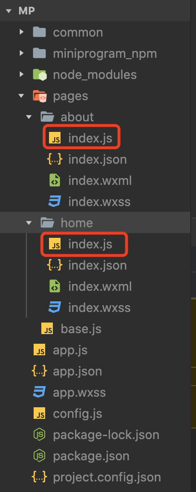

:::tip
[kbone](https://wechat-miniprogram.github.io/kbone/docs/) 是一个致力于微信小程序和 Web 端同构的解决方案。
- 实现了一个适配器，在适配层里模拟出浏览器环境，让Web端的代码可以不做什么改动便可运行在小程序里。
- kbone 是通过提供适配器的方式来实现同构
:::

## kbone的优势
- 大部分流行的前端框架都能够在 kbone 上运行，比如 Vue、React、Preact 等
- 支持更为完整的前端框架特性，因为 kbone 不会对框架底层进行删改（比如 Vue 中的 v-html 指令、Vue-router 插件）
- 提供了常用的 dom/bom 接口，让用户代码无需做太大改动便可从 Web 端迁移到小程序端
- 在小程序端运行时，仍然可以使用小程序本身的特性（比如像 live-player 内置组件、分包功能）
- 提供了一些 Dom 扩展接口，让一些无法完美兼容到小程序端的接口也有替代使用方案（比如 getComputedStyle 接口）

## kbone的劣势
- kbone 是使用一定的性能损耗来换取更为全面的 Web 端特性支持
- 如果你的页面节点数量特别多（通常在 1000 节点以上），同时还要保证在节点数无限上涨时仍然有稳定的渲染性能的话，可以尝试一下业内采用静态模板转译的方案

## 上手
### 1. 使用脚手架或者模板搭建项目
- 使用kbone-cli创建项目
```bash
npx kbone-cli init kbone-demo
cd kbone-demo

npm run mp # 开发小程序端
npm run build:mp  # 构建小程序

npm run web # 开发 Web 端
npm run build # 构建 Web 端

```

- 使用模板创建项目
  - [React 项目模板](https://github.com/wechat-miniprogram/kbone-template-react)
  - [Vue 项目模板](https://github.com/wechat-miniprogram/kbone-template-vue)
  - [Preact 项目模板](https://github.com/wechat-miniprogram/kbone-template-preact)

### 2. 自行搭建项目

## 开发过程
### 1. 配置文件
```js title="build/miniprogram.config"
// 设置projectConfig
projectConfig: {
  projectname: 'mp-self',
  appid: '', // 小程序的appid
},
```
- sitemap配置
:::info
  - 小程序根目录下的 `sitemap.json` 文件用于配置小程序及其页面是否允许被微信索引，文件内容为一个 JSON 对象。
  - 如果没有 `sitemap.json` ，则默认为所有页面都允许被索引。
  - 当开发者允许微信索引时，微信会通过爬虫的形式，为小程序的页面内容建立索引。当用户的搜索词条触发该索引时，小程序的页面将可能展示在搜索结果中。 爬虫访问小程序内页面时，会携带特定的 `user-agent：mpcrawler` 及场景值：1129。
  - 需要注意的是，若小程序爬虫发现的页面数据和真实用户的呈现不一致，那么该页面将不会进入索引中。
:::

### 2. 调试
- 本地执行`npm run mp`后会生成dist/mp目录以及project.config.json和project.private.config.json
- 在微信开发者工具中添加小程序，目录选择dist下的mp目录

### 3. 路由
:::warning
小程序启动的默认页面是`build/webpack.mp.config.js`中的entry数组的第一项对应的页面，与`build/miniprogram.config.js`的router、entry无关！
```js title="build/webpack.mp.config.js"
// 如下，则小程序的默认启动页面是/src/entries/About.mp.jsx中由ReactDOM render的内容
entry: {
  about: path.resolve(__dirname, '../src/entries/About.mp.jsx'),
  home: path.resolve(__dirname, '../src/entries/Home.mp.jsx'),
},

// 如下，则小程序的默认启动页面是/src/entries/Home.mp.jsx中由ReactDOM render的内容
entry: {
  home: path.resolve(__dirname, '../src/entries/Home.mp.jsx'),
  about: path.resolve(__dirname, '../src/entries/About.mp.jsx'),
},
```
:::

- (1) 使用react-router-dom `npm install react-router-dom`
:::warning
`<BrowserRouter>`应该在入口文件中使用，否则会报错。
比如：应该在`src/entries/Home.mp.jsx`中使用，而不是在`src/pages/App.jsx`中使用(编译不报错，但开发者工具中会报错，页面不能正常渲染)
:::

- (2) `build/miniprogram.config.js`的entry
> 默认是 `/`

:::info
不使用react-router-dom定义路由的path的情况下，entry是没有意义的。
比如`entry: '/a',`,如下尽管使用`<BrowserRouter>`对`<App />`进行包裹，但是App页面内容仍能正常渲染
```jsx title="src/entries/Home.mp.jsx"
import React from 'react'
import ReactDOM from 'react-dom'
import { BrowserRouter } from "react-router-dom"
import App from '@/pages/App'

export default function createApp() {
  const container = document.createElement('div')
  container.id = 'app'
  document.body.appendChild(container)

  ReactDOM.render(
    <BrowserRouter>
      <App />
    </BrowserRouter>, container
  )
}
```

当使用react-router-dom定义路由的path后，则entry就有意义了，即为入口页面的path。
比如`entry: '/a',`，若App页面的path定义为'/'，则不会渲染App页面的内容；若App页面的path定义为'/a'，则正常渲染App页面的内容。
```jsx title="src/entries/Home.mp.jsx"
import React from 'react'
import ReactDOM from 'react-dom'
import { BrowserRouter,Routes,Route } from "react-router-dom"
import App from '@/pages/App'

export default function createApp() {
  const container = document.createElement('div')
  container.id = 'app'
  document.body.appendChild(container)

  ReactDOM.render(
    <BrowserRouter>
      <Routes>
        <Route path='/a' element={<App />}></Route>
      </Routes>
    </BrowserRouter>, container
  )
}
```
:::

- (3) `build/miniprogram.config.js`的router
> 页面路由，用于页面间跳转（**注意：用于多页项目的页面间的跳转**）。其值是一个对象，每项的key是页面名称，每项的value是该页面可以响应的路由。路由可以是多个值，同时支持动态路由。
```js
{
  router: {
    home: [ '/home' ],
    about: [ '/about' ],
  },
}
```
:::info
未设置router时，可以使用`wx.navigateTo`来跳转页面；
当设置了router后，小程序的页面也可以使用`location.href`来跳转。
```jsx title="src/pages/App.jsx"
import React from 'react'
import { Link } from 'react-router-dom'
import Counter from '@/components/counter'

export default function App() {

  const multiPageNavigate = () => {
    // 设置router后，可以使用`location.href`来跳转页面
    location.href = '/about'
    /*
    // 未设置router时可以使用navigateTo来跳转页面，url的值为打包后小程序文件目录中相对于当前文件的路径
    wx.navigateTo({url: '../about/index'})
    */
  }

  return <div className='home-page'>
    <Counter></Counter>
    <div onClick={multiPageNavigate}>跳转到About页面</div>
    <Link to='/h5'>link to H5</Link>
  </div>
}
```

:::