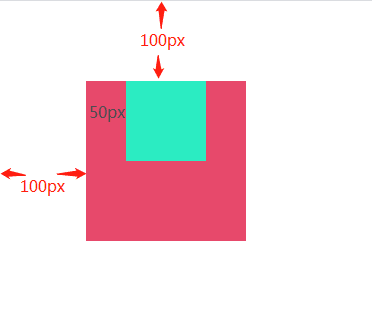
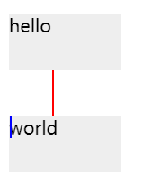
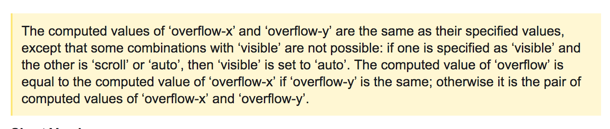
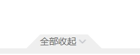
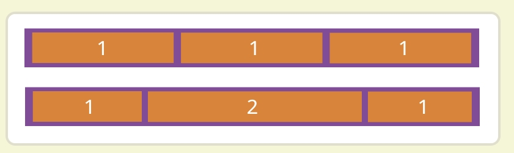

:::tip
[CSS灵感](https://github.com/chokcoco/CSS-Inspiration)

[icss](https://github.com/chokcoco/iCSS)
:::

## 1. `:is()`
> [使用`is()`优化css代码](https://mp.weixin.qq.com/s/ACCGICv0hjU4LFAlPLUpog)

## 2. flex
- https://developer.mozilla.org/zh-CN/docs/Web/CSS/CSS_Flexible_Box_Layout/Controlling_Ratios_of_Flex_Items_Along_the_Main_Ax
- [彻底理解Flexbox](https://blog.csdn.net/liuhe688/article/details/51453330)
- 在html中若一个元素的css设置为display:flex，则这个元素就是flex container，其子元素为flex item。
- 应用于flex item的三个属性：flex-grow flex-shrink flex-basis，可以在主轴方向上控制flex item的尺寸和伸缩性
- flex-grow：这个flex item得到(伸张)多少positive free space
- flex-shrink：从这个flex item消除(收缩)多少negative free space
- flex-basis：在flex item未伸张和收缩之前，它的大小是多少
- flex: 2 1 auto 相当于 flex-grow: 2;flex-shrink: 1;flex-basis: auto;
- positive free space 正向自由空间
- negative free space 反向自由空间
- flex item包含在flex container中，当flex item在主轴上的尺寸(大小)之和小于flex container的尺寸时，flex container中就会有多余的空间没有被填充，这些空间就被叫做positive free space
- 当flex item在主轴上的尺寸之和大于flex container的尺寸时，flex容器的空间就不够用，此时flex item的尺寸之和减去flex container的尺寸(flex item溢出的尺寸)就是negative free space，这个negative free space加上flex container的尺寸刚好可以容纳flex item
- flex-basis 属性在任何空间分配发生之前初始化flex item的尺寸. 此属性的初始值为 auto. 如果 flex-basis 设置为 auto , 浏览器会先检查flex item的主尺寸是否设置了绝对值再计算出flex item的初始值. 比如已经给flex item设置了200px 的宽，则200px 就是这个flex item的 flex-basis.如果flex item 为自动调整大小，则auto 会解析为其内容的大小. 此时min-content和max-content大小会变得有用, flexbox 会将flex item的 max-content 大小作为 flex-basis.
- 空间分配时，如果想flexbox 完全忽略flex item的尺寸就设置flex-basis 为 0. 这基本上告诉flexbox所有空间都可以抢占，并按比例分享.
- 如果flex-grow的值全部相同，并且在flex container中还有positive free space , 那么它（positive free space）就会平均地分配给所有的flex item
- **定义为flex布局元素的子元素，自动获得了flex-shrink的属性，这个属性是什么意思呢？就是告诉子元素当父元素宽度不够用时，自己调整自己所占的宽度比，这个flex-shrink设置为1时，表示所有子元素大家同时缩小来适应总宽度。当flex-shrink设置为0时，表示大家都不缩小适应。所以，倘若给父元素设置了flex布局后，若要其子元素的width有效果，必须给子元素设置flex-shrink为0。**
- flex-flow：是 flex-direction 和 flex-wrap 的简写。初始值：flex-direction: row; flex-wrap: nowrap;

- 在CSS的Flexbox布局中，要均分空间，可以将容器内的子元素设置为`flex: 1`。这样，每个子元素都会占据相同的空间比例。例如,以下代码会使得`.container`内的所有`.item`子元素均分可用空间。
  ```css
  .container {
    display: flex;
  }

  .item {
    flex: 1;
  }
  ```

## 3. box-sizing: border-box|content-box|inherit
- border-box

## 4. grid

## 5. 子元素margin-top会影响父元素
> https://blog.csdn.net/u012011360/article/details/41823125?utm_medium=distribute.pc_relevant_t0.none-task-blog-2%7Edefault%7EOPENSEARCH%7Edefault-1.base&depth_1-utm_source=distribute.pc_relevant_t0.none-task-blog-2%7Edefault%7EOPENSEARCH%7Edefault-1.base

## 6. 水平垂直居中
> [16种方法实现水平居中垂直居中](https://louiszhai.github.io/2016/03/12/css-center/)
- 注意：`margin: 0 auto`生效的前提是display:block以及设置宽高（display:inline-block不生效）

## 7. display: inline-block会有缝隙
- 产生的原因：
> 元素被当成行内元素排版的时候，元素之间的空白符（空格、回车换行等）都会被浏览器处理，根据white-space的处理方式（默认是normal，合并多余空白），原来HTML代码中的回车换行被转成一个空白符，在字体不为0的情况下，空白符占据一定宽度，所以inline-block的元素之间就出现了空隙。这些元素之间的间距会随着字体的大小而变化，当行内元素font-size:16px时，间距为8px。
- 解决方案：移除空格、使用margin负值、使用font-size:0、letter-spacing、word-spacing
> - 将子元素放置在同一行
> - 为父元素中设置font-size: 0，在子元素上重置正确的font-size
> - 为inline-block元素添加样式float:left
> - 设置子元素margin值为负数
> - 设置父元素，display:table和word-spacing
> - 不使用display: inline-block，使用display: block

## 8. position不占位的方案
:::info
position:absolute（子级）和 position: relative（父级）配合使用 ，就可以实现相对定位后不占位置
:::
- 相对定位的元素并未脱离文档流，而绝对定位的元素则脱离了文档流。在布置文档流中其它元素时，绝对定位元素不占据空间。绝对定位元素相对于最近的非 static 祖先元素定位。当这样的祖先元素不存在时，则相对于ICB（inital container block, 初始包含块）

## 9. flex换行设置行间距列间距
```html
<div class="flex-container">
  <div class="flex-item">Item 1</div>
  <div class="flex-item">Item 2</div>
  <div class="flex-item">Item 3</div>
  <!-- 更多子项 -->
</div>
```

- 如果父容器`.flex-container`定高，父容器只要`align-content: space-between`即可，浏览器自动推算出中间的间距

- 如果父容器`.flex-container`不定高，子容器设置margin添加间距，并通过负 margin 在 Flex 容器上抵消额外的空间。这样可以防止列间距导致子容器被挤到下一行。
  ```css
  .flex-container {
    display: flex;
    flex-wrap: wrap;
    margin-left: -10px; /* 抵消子项的左边距 */
  }

  .flex-item {
    margin-left: 10px; /* 设置列间距 */
  }
  ```

- 也可以使用`gap`。请注意，`gap`、`row-gap` 和 `column-gap` 属性在较新版本的浏览器中得到支持，但在一些旧版本的浏览器中可能不可用。
  ```css
  .flex-container {
    display: flex;
    flex-wrap: wrap;
    // column-gap: 10px; /* 仅设置列间距 */
    gap: 10px; /* 设置行间距和列间距 */
  }
  ```
  

## 10. flex布局最后一行列表左对齐
> [让CSS flex布局最后一行列表左对齐的N种方法](https://www.zhangxinxu.com/wordpress/2019/08/css-flex-last-align/)

## 11. 斜边
- [使用CSS制作斜边矩形原理分析](https://blog.csdn.net/jerrylearner/article/details/105114262)
```css
// 使用伪类及border
div {
  position: relative;
  &::after {
    content: ' ';
    position: absolute;
    top: 0;
    left: 0;
    border-width: 28px 20px;
    border-style: solid;
    border-color: transparent transparent #FFFFFF #FFFFFF;
  }
}
```
- https://www.cnblogs.com/ypppt/p/13229296.html

## 12. 三角形
- [CSS如何画一个三角形？原理是什么？](https://github.com/febobo/web-interview/issues/117)
- [用CSS画一个带阴影的三角形](https://juejin.cn/post/6844903789460193288)

## 13. box-shadow内阴影：inset

## 14. border的长度自定义：使用伪类
```css
.div {
  position: relative;
  &::after {
    content: '';
    position: absolute;
    left: 5%;
    top: 0;
    bottom: auto;
    right: auto;
    height: 2px;
    width: 90%;
    background-color: #F5F5F5;
  }
}
```

## 15. 有背景图或背景色时，设置border-radius，圆角超出，可以使用`overflow: hidden;`来解决

## 16. `-webkit-overflow-scrolling: touch;` 滚动丝滑

## 17. ios底部适配
> 参考：[safe-area-inset-bottom](https://juejin.cn/post/7085627936048414733)；[safe-area-inset-bottom](https://devv.ai/zh/search?threadId=d6dntqm7n9q8)

`env(safe-area-inset-bottom)` 是一个 CSS 环境变量，用于在 iPhone X 和 iOS 11 及更高版本的设备上设置底部安全区域的填充。这个功能可以确保内容不会被底部的横条遮挡。在 CSS 中使用这个功能时，需要注意一些细节:
- 首先，要确保在 viewport meta 标签中添加 `viewport-fit=cover`，以启用 iPhone X 的全屏显示布局。这样，设备会使用全屏布局来显示内容区域（安全区域）。
  ```html
  <!DOCTYPE html>
  <html lang="en">
    <head>
      <meta charset="UTF-8" />
      <link rel="icon" type="image/svg+xml" href="/favicon.ico" />
      <meta name="viewport" content="width=device-width, initial-scale=1.0, user-scalable=no, viewport-fit=cover" />
      <title>Title</title>
    </head>
    <body>
      <div id="root"></div>
      <script type="module" src="/src/main.tsx"></script>
    </body>
  </html>
  ```

- `env(safe-area-inset-bottom)`在 iOS 11.2 及更高版本的设备上可用。如果您需要支持 iOS 11.0–11.2 的设备，可以使用 `constant(safe-area-inset-bottom)` 函数来设置底部填充。
  ```css
  .footer {
    position: fixed;
    bottom: 0;
    padding-bottom: constant(safe-area-inset-bottom); /* 兼容 iOS < 11.2 */
    padding-bottom: env(safe-area-inset-bottom); /* 兼容 iOS >= 11.2 */
    width: 100%;
    height: 200px;
    background-color: #FFFFFF;
  }
  ```

- 在使用 `env(safe-area-inset-bottom)` 时，需要注意以下几点：
  - 有时候 `env()` 可能无法在 `calc()` 函数中正常工作。在这种情况下，可以使用 CSS 原生变量（Custom CSS Properties）来代替。
  - 为了支持旧设备，可以使用回退属性值来处理部分支持 CSS 环境变量的浏览器和不支持 CSS 环境变量的旧浏览器。
    ```css
    .your-element {
      padding-bottom: 20px; /* Fallback value for older devices */
      padding-bottom: env(safe-area-inset-bottom);
    }
    ```

## 18. `user-select` 控制用户能否选中文本。除了文本框内，它对被载入为 chrome 的内容没有影响。
- user-select: none; 元素及其子元素的文本不可选中。
- user-select: auto; auto 的具体取值取决于一系列条件，具体如下：1）在 ::before 和 ::after 伪元素上，采用的属性值是 none；2）如果元素是可编辑元素，则采用的属性值是 contain；3）否则，如果此元素的父元素的 user-select 采用的属性值为 all，则该元素采用的属性值也为 all；4）否则，如果此元素的父元素的 user-select 采用的属性值为 none，则该元素采用的属性值也为 none；5）否则，采用的属性值为 text
- user-select: text; 用户可以选择文本。
- user-select: contain; 允许在元素内选择；但是，选区将被限制在该元素的边界之内。
- user-select: all; 在一个HTML编辑器中，当双击子元素或者上下文时，那么包含该子元素的最顶层元素也会被选中。

## 19. `word-break:break-all;` 或 `word-wrap:break-word;` 汉字、数字、字母超出折行
> text-overflow: ellipsis; //文本溢出显示省略号  在使用的时候，有时候发现不会出现省略标记效果，经过测试发现，使用ellipsis的时候，必须配合overflow:hidden; white-space:nowrap; width:具体值;这三个样式共同使用才会有效果。

## 20. `inline-block`
- [关于inline-block问题](https://www.jianshu.com/p/381dd29caa57)
- 图片底线对齐
- 有文本时

## 21. 实现带圆角的渐变边框
- `border-image`和`border-radius`不能同时生效问题
- [实现带圆角的渐变边框](http://www.cxyzjd.com/article/code_5/106293842)
- [解决渐变色和border-radius的兼容性问题](https://www.codenong.com/cs109646855/)
- [关于css样式中border-radius和border-image不兼容问题](http://cxyzjd.com/article/qq_44853234/110988745)

## 22. `white-space:nowrap`撑大盒子：添加`overflow: hidden;`

## 23. 画同心圆
- [css画同心圆](https://www.jianshu.com/p/98ea5bbdabea)

## 24. [margin塌陷和margin合并](https://mp.weixin.qq.com/s/tCRmEoiO91M4Imb5qyKPKQ)
- margin塌陷: **父子嵌套的元素垂直方向的margin取最大值**
```css
div.father{
  width: 200px;
  height: 200px;
  background-color: rgb(219, 68, 101);
  margin-left: 100px;
  margin-top: 100px;
}
div.father div.son{
  width: 100px;
  height: 100px;
  background-color: rgb(56, 248, 207);
  margin-left: 50px;
  margin-top: 50px;
}
```

> 如上述例子，原本子元素要距离父元素顶部50px，现在没有了，也就是父元素的顶棚对子元素来说没有作用，相当于没有，相当于塌陷下来了。所以叫margin塌陷。

- BFC: Block Formatting Context，块级格式上下文
> CSS将HTML的每一个元素都当成一个盒子，而且它进一步的认为每一个盒子里面都有一套正常的语法规则或者叫渲染规则，它能根据这个规则将写的HTML元素绘制出来，但是我们可以通过一些特定的手段触发BFC，让其所符合的语法规则和原来的语法规则有点不一样。也就是触发BFC之后，特定的盒子会遵循另一套语法规则。BFC听起来挺神奇，能改变一个盒子的语法规则，那到底改变了多少呢，其实也没改变多少。可能千分之一都不到。
- 如何触发BFC
> - float属性为left/right
> - overflow为hidden/scroll/auto
> - position为absolute/fixed
> - display为inline-block/table-cell/table-caption

> 有这么多方式触发BFC，那用哪种方式好一些？看具体情况，个人认为一个原则：针对需求，看哪个触发方式没有负影响就用那个

- 解决margin塌陷的问题，可以使用overflow: hidden触发bfc
```css
div.father{
  width: 200px;
  height: 200px;
  background-color: rgb(219, 68, 101);
  margin-left: 100px;
  margin-top: 100px;
  overflow: hidden;/* 触发bfc */  
}
div.father div.son{
  width: 100px;
  height: 100px;
  background-color: rgb(56, 248, 207);
  margin-left: 50px;
  margin-top: 50px;
}
```

- margin合并
> 发现如下两个元素之间，它们的外间距是 div.test1的margin-bottom 与 div.test2的margin-top 中的较大值，而不是两者的和，这种现象被称为margin合并。
```css
.test1 {
  width: 60px;
  height: 60px;
  background-color: green;
  margin-bottom: 20px;
}
.test2 {
  margin-top: 30px;
  width: 60px;
  height: 60px;
  background-color: red;
}
```
- 解决margin合并的问题，也可以使用触发bfc的方式，比如在div.test2的外层嵌套一个div并添加overflow:hidden;触发bfc
```css
.test1 {
  width: 60px;
  height: 60px;
  background-color: green;
  margin-bottom: 20px;
}
.test2 {
  margin-top: 30px;
  width: 60px;
  height: 60px;
  background-color: red;
}
.test2-parent {
  overflow: hidden;
}
```
> 但是，通常对于margin合并问题，只单方面设置margin就好了，从而避免margin合并

## 25. [BFC及其他格式上下文](https://mp.weixin.qq.com/s/I1FHJRVjd4Ni-pS4by6XvQ)
### (1) 什么是BFC
- Block Formatting Context（块级格式化上下文），是一个独立的渲染区域，让处于 BFC 内部的元素与外部的元素相互隔离，使内外元素的定位不会相互影响。
### (2) BFC的触发条件
> Floats, absolutely positioned elements, block containers (such as inline-blocks, table-cells, and table-captions) that are not block boxes, and block boxes with 'overflow' other than 'visible' (except when that value has been propagated to the viewport) establish new block formatting contexts for their contents.
> 浮动元素和绝对定位元素，非块级盒子的块级容器（例如 inline-blocks, table-cells, 和 table-captions），以及overflow值不为“visiable”的块级盒子，都会为他们的内容创建新的BFC（块级格式上下文）。 —— W3C

即，存在以下几种方案可创建 BFC：
- 浮动元素， float 值不为 none
- 绝对定位元素，position 属性为 absolute ，fixed
- 非块级盒子的块级容器（ display 值为 inline-blocks , table-cells , table-captions 等）
- overflow 的值不为 visible （ visiable 是默认值。内容不会被修剪，会呈现在元素框之外）
- 除此之外，根元素， HTML 元素本身就是 BFC（ 最大的一个BFC ）

### (3) BFC布局规则
- 内部的盒子会在垂直方向，一个一个地放置；
- 盒子垂直方向的距离由 margin 决定，属于同一个 BFC 的两个相邻 Box 的上下 margin 会发生重叠；
- 每个元素的左边，与包含的盒子的左边相接触，即使存在浮动也是如此；
- BFC 的区域不会与 float 重叠；
- BFC 就是页面上的一个隔离的独立容器，容器里面的子元素不会影响到外面的元素，反之也是如此；
- 计算 BFC 的高度时，浮动元素也参与计算。

### (4) BFC的作用
- 自适应两栏布局
- 清除内部浮动
- 解决margin合并（或叫margin重叠）
- 阻止元素被浮动元素覆盖

### (5) CSS其他格式上下文
- IFC: 行内格式上下文
- GFC: 网格布局格式上下文
- FFC: 自适应格式上下文

## 26. [svg](https://developer.mozilla.org/zh-CN/docs/Web/SVG/Tutorial)

## 27. 使用伪类画竖线
```css
<div class="test test1">hello</div>
<div class='test test2'>world<div>
.test
	width 100px
	height 50px
	background #eee
	position: relative;
	margin-top: 40px;
.test1:after
	content: ''
	height: 40px
	border-right: 2px solid red
	position: absolute;
	// left: 0;
	// right: 0;
	top: 50px;
.test2:before
	content: ''
	height: 20px
	border-right: 2px solid blue
	position: absolute;
	// left: 0;
	// right: 0;
	// top: 50px;
```


```css
<div class="test">hello</div>
<div class="test test2">world</div>
.test
	width 100px
	height 50px
	background #eee
	position: relative;
	margin-top: 40px;
.test2:after
	content: ''
	height: 40px
	border-right: 2px solid red
	position: absolute;
	// right: 0;
	top: -40px;
```


## 28. `z-index`
- [深入理解 CSS 属性 z-index](https://zhuanlan.zhihu.com/p/33984503)
- [关于 z-index，你可能一直存在误区](https://mp.weixin.qq.com/s/I-y0NaAeGmFYDhArFG_IIg)
- [抖音一面：z-index大的元素一定在小的上面吗？](https://mp.weixin.qq.com/s/fXrKml35dewSKAYA7mgiig)

## 29. `overflow-x:hidden;` 和 `overflow-y:visible;` 共存的话，`visible`不起作用

- 解决方案：在父级或父级的父级(视情况而定)加overflow:hidden;

## 30. css抖动效果
- [抖动效果](https://blog.csdn.net/wsmrzx/article/details/102864730)
- [csshake](https://elrumordelaluz.github.io/csshake/)
```css
/*! * * * * * * * * * * * * * * * * * * * *\  
  参考CSShake :: shake-slow
  http://elrumordelaluz.github.io/csshake/
\* * * * * * * * * * * * * * * * * * * * */
.shake-slow{display:inherit;transform-origin:center center}
@keyframes shake-slow{
  2%{transform:translate(2px, -2px) rotate(3.5deg)}
  4%{transform:translate(7px, 3px) rotate(-.5deg)}
  6%{transform:translate(6px, 3px) rotate(.5deg)}
  8%{transform:translate(4px, 7px) rotate(.5deg)}
  10%{transform:translate(-8px, 3px) rotate(1.5deg)}
  12%{transform:translate(3px, -6px) rotate(-2.5deg)}
  14%{transform:translate(2px, -8px) rotate(1.5deg)}
  16%{transform:translate(2px, 7px) rotate(2.5deg)}
  18%{transform:translate(1px, 5px) rotate(-1.5deg)}
  20%{transform:translate(-1px, 0px) rotate(.5deg)}
  22%{transform:translate(1px, -2px) rotate(3.5deg)}
  24%{transform:translate(1px, -8px) rotate(-2.5deg)}
  26%{transform:translate(-7px, -6px) rotate(3.5deg)}
  28%{transform:translate(-6px, -5px) rotate(3.5deg)}
  30%{transform:translate(9px, -7px) rotate(-1.5deg)}
  32%{transform:translate(3px, 5px) rotate(3.5deg)}
  34%{transform:translate(10px, -9px) rotate(-1.5deg)}
  36%{transform:translate(8px, -8px) rotate(3.5deg)}
  38%{transform:translate(-9px, 5px) rotate(.5deg)}
  40%{transform:translate(-3px, -9px) rotate(1.5deg)}
  42%{transform:translate(5px, 7px) rotate(1.5deg)}
  44%{transform:translate(-4px, 1px) rotate(-.5deg)}
  46%{transform:translate(3px, 1px) rotate(1.5deg)}
  48%{transform:translate(-9px, 6px) rotate(2.5deg)}
  50%{transform:translate(1px, 3px) rotate(-2.5deg)}
  52%{transform:translate(7px, -9px) rotate(2.5deg)}
  54%{transform:translate(10px, 4px) rotate(-.5deg)}
  56%{transform:translate(3px, -5px) rotate(1.5deg)}
  58%{transform:translate(4px, -3px) rotate(-.5deg)}
  60%{transform:translate(9px, 5px) rotate(-1.5deg)}
  62%{transform:translate(8px, -9px) rotate(.5deg)}
  64%{transform:translate(-8px, -9px) rotate(-1.5deg)}
  66%{transform:translate(-9px, -1px) rotate(1.5deg)}
  68%{transform:translate(-4px, -2px) rotate(3.5deg)}
  70%{transform:translate(-2px, 6px) rotate(-2.5deg)}
  72%{transform:translate(3px, 1px) rotate(1.5deg)}
  74%{transform:translate(-4px, -3px) rotate(2.5deg)}
  76%{transform:translate(3px, 1px) rotate(-.5deg)}
  78%{transform:translate(8px, 0px) rotate(2.5deg)}
  80%{transform:translate(10px, -6px) rotate(2.5deg)}
  82%{transform:translate(-4px, 6px) rotate(1.5deg)}
  84%{transform:translate(-2px, 2px) rotate(3.5deg)}
  86%{transform:translate(-5px, 3px) rotate(2.5deg)}
  88%{transform:translate(7px, -4px) rotate(2.5deg)}
  90%{transform:translate(10px, 9px) rotate(-.5deg)}
  92%{transform:translate(8px, 4px) rotate(.5deg)}
  94%{transform:translate(7px, 10px) rotate(2.5deg)}
  96%{transform:translate(2px, -2px) rotate(-.5deg)}
  98%{transform:translate(-1px, -5px) rotate(3.5deg)}
  0%,100%{transform:translate(0, 0) rotate(0)}
}
.shake-slow:hover{animation-name:shake-slow;animation-duration:5s;animation-timing-function:ease-in-out;animation-iteration-count:infinite}
.shake-slow-once{animation-name:shake-slow;animation-duration:5s;animation-timing-function:ease-in-out;animation-iteration-count:1}
```
- [animation-play-state](https://developer.mozilla.org/zh-CN/docs/Web/CSS/animation-play-state)
- [animation-iteration-count](https://developer.mozilla.org/zh-CN/docs/Web/CSS/animation-iteration-count)
> 定义动画在结束前运行的次数，可以是1次，也可以是无限循环
- [animation](https://developer.mozilla.org/zh-CN/docs/Web/CSS/animation)

## 31. `padding`和`border-radius`一起使用，圆角没效果的问题
- [css3之border-radius](https://www.cnblogs.com/ssw-men/p/10364223.html)

## 32. css画圆圈对号
```scss
@mixin selectedStyle {
    height: 34px;
    width: 34px;
    display: block;
    position: relative;
    border-radius: 50px;
    border: 4px solid rgba(24,118,255,1);
    &::after, &::before {
        content: '';
        height: 24px;
        width: 6px;
        display: block;
        background: rgba(24,118,255,1);
        position: absolute;
        top: 8px;
        left: 18px;
        border-radius: 10px;
        transform: rotate(45deg);
    }
    &::before {
        height: 12px;
        transform: rotate(-45deg);
        top: 16px;
        left: 8px;
    }
}
```
## 33. 复制图标css代码网站
- http://www.uiplayground.in/css3-icons/

## 34. css实现微信朋友圈的九宫格图片自适应

## 35. css实现翻转
- [CSS垂直翻转/水平翻转](https://www.cnblogs.com/ypppt/p/13323547.html)
```css
/*水平翻转*/
.flipx { transform: rotateY(180deg); }
 
/*垂直翻转*/
.flipy { transform: rotateX(180deg); }

/*90°翻转*/
.flip90 { transform: rotate(0.25turn); }
```

## 36. css3 斜切角/斜边/曲线切口角 的实现方式
>- [css3 斜切角/斜边的实现方式](https://www.cnblogs.com/ypppt/p/13229296.html)
>- [CSS秘密花园：斜切角](https://www.w3cplus.com/css3/css-secrets/cutout-corners.html)
- linear-gradient
- clip-path
```css
div.content {
  font-size: 10px;
  color: rgba(102,102,102,1);
  background: rgba(239,239,239,1);
  clip-path: polygon( 20px 0, calc(100% - 20px) 0, 100% 20px,
      20px 100%,
      0 20px
  );
  width: 8%;
}
```

- radial-gradient
- corner-shape

## 37. css设置`position: absolute;`后点击事件时效
- 解决方案：设置z-index，比如`z-index: 2;`

## 38. 使用`@font-face`
CSS 属性 `font-family` 允许你通过给定一个有先后顺序的，由字体名或者字体族名组成的列表来为选定的元素设置字体。属性值用逗号隔开。浏览器会选择列表中第一个该计算机上有安装的字体，或者是通过 `@font-face` 指定的可以直接下载的字体。
```html
@font-face {
  font-family: HeiTi;
  src: url(//pan.baidu.com/common/font/HeiTi.ttf) format("truetype");
  font-weight: 400;
  font-style: normal
}
.div {
  font-family: HeiTi;
}
```

## 39. css选择器`+`、`~`
- `+` 相邻兄弟选择器: 可选择紧接在另一元素后的元素，且二者有相同父元素
- `~` 兄弟选择器，又称匹配选择器: 作用是查找某一个指定元素的后面的所有兄弟结点

## 40. flex布局实现一行n个，超出自动换行
```jsx
<div className='content'>
  {
    contentList.length>0 && contentList.map((contentItem,contentIndex) => <div className='content-item' key={contentIndex}>
      {contentItem}
    </div>)
  }
</div>
```
```scss
.content {
  display: flex;
  flex-wrap: wrap;
  &>.content-item {
    width: 14%;
    margin: 0 calc(2% / 7 / 2) 11px calc(2% / 7 / 2);
  }
}
```
:::info
参考[flex布局实现一行n个，超出自动换行](https://juejin.cn/post/7071919544394055710)
:::

## 41. 子元素在父元素的最右侧
3种方案：
- 子元素设置float：right
- 父元素设置flex布局方式
```css
{
  display:flex;
  justify-content:flex-end;
}
```
- 使用position
```css
/* 父元素 */
{
  position:relative;
}

/* 子元素 */
{
  position:absolute;
  right:0
}
```

## 42. 渐变
- 线性渐变创建了一条沿直线前进的颜色带。要创建最基本的渐变类型，您只需指定两种颜色即可。这些被称为色标。至少指定两个色标，也可以指定任意数量。
```css
.a {
  background: linear-gradient(blue, pink);
}
```
- 默认情况下，线性渐变的方向是从上到下，你可以指定一个值来改变渐变的方向。
```css
.horizontal-gradient {
  background: linear-gradient(to right, blue, pink);
}
```
- 可以设置渐变方向为从一个对角到另一个对角。
```css
.diagonal-gradient {
  background: linear-gradient(to bottom right, blue, pink);
}
```
- 如果你想要更精确地控制渐变的方向，你可以给渐变设置一个具体的角度。在使用角度的时候，0deg 代表渐变方向为从下到上，90deg 代表渐变方向为从左到右，诸如此类正角度都属于顺时针方向。而负角度意味着逆时针方向。
```css
.angled-gradient {
  background: linear-gradient(70deg, blue, pink);
}
```
- 颜色终止位置。你可以通过给每个颜色设置 0，1% 或者 2% 或者其他的绝对数值来调整它们的位置。
> - 如果你将位置设置为百分数， 0% 表示起始点，而 100% 表示终点，但是如果需要的话你也可以设置这个范围之外的其他值来达到你想要的效果。
> - 如果有些位置你没有明确设置，那么它将会被自动计算，第一种颜色会在 0% 处停止，而最后一种颜色是 100%，至于其他颜色则是在它邻近的两种颜色的中间停止。
```css
.multicolor-linear {
  background: linear-gradient(to left, blue 28px, red 77%, #abcdef);
}
```

## 43. 阴影
```css
/* x 偏移量 | y 偏移量 | 阴影颜色 */
box-shadow: 60px -16px teal;

/* x 偏移量 | y 偏移量 | 阴影模糊半径 | 阴影颜色 */
box-shadow: 10px 5px 5px black;

/* x 偏移量 | y 偏移量 | 阴影模糊半径 | 阴影扩散半径 | 阴影颜色 */
box-shadow: 2px 2px 2px 1px rgba(0, 0, 0, 0.2);

/* 插页 (阴影向内) | x 偏移量 | y 偏移量 | 阴影颜色 */
box-shadow: inset 5em 1em gold;

/* 任意数量的阴影，以逗号分隔 */
box-shadow: 3px 3px red, -1em 0 0.4em olive;
```

## 44. `:root`
伪类`:root` 表示 html 选择器
```css
:root {
  background-color: blue;
}

html {
  background-color: yellow;
}

/* 最终文档的背景色将会是 blue */
```
```css
:root {
  --bg-color: green;
  --Bg-color: yellow;
}
```

## 45. 吸底
```html
<div class="wrapper">
  <div></div>
  <div></div>
  <div class="footer"></div>
</div>
```
```scss
.wrapper {
  padding-bottom: 1.5rem; /* 大于等于footer的高度，避免footer遮挡页面内容 */
  .footer {
    position: fixed;
    bottom: 0;
    width: 100%;
    height: 1.4rem;
    background-color: #FFFFFF;
    border-top: 1PX solid #EEEEEE;
  }
}
```

## 46. `flex-grow`
如果所有项目的flex-grow属性都为1，则它们将等分剩余空间（如果有的话）。如果一个项目的flex-grow属性为2，其他项目都为1，则前者占据的剩余空间将比其他项多一倍。


## 47. input/textarea 样式美化
:::info
CSS 的 outline 属性是在一条声明中设置多个轮廓属性的简写属性 ，例如 `outline-style`, `outline-width` 和 `outline-color`。
:::

```css
input {
  /* input样式美化 */
  box-shadow: none; /* 去除阴影 */
  outline: none; /* 去掉input的边框 */
  resize: none; /* textarea 禁止拖拽 */
  border: none; /* 去除边框 */
  padding: 0; /* 去除padding */
  -webkit-appearance: none; /* 常用于IOS下移除原生样式 */
  -webkit-tap-highlight-color: rgba(0,0,0,0); /* 点击高亮的颜色 */
}
```

## 48. 输入框中文字自动换行
想要在输入框中实现文字自动换行的功能，需要使用`textarea`标签而不是`input`标签来创建文本输入框。`textarea`标签可以自动换行，而`input`标签则不行。
```jsx
<div className={`cell ${detailAddress && detailAddress.length>18 ? 'detail-address-row' : 'detail-address-cell'}`}>
  <div className="label">详细地址</div>
  <textarea
    className="grow detail-address"
    rows={detailAddress && detailAddress.length>18 ? 3 : 1}
    value={detailAddress ?? ''}
    onChange={(e) => setDetailAddress(e.target.value)}
  ></textarea>
</div>
```
```scss
&.detail-address-row {
  height: fit-content;
  align-items: baseline;
  padding-top: 28px;
}
&.detail-address-cell {
  height: 96px;
  &>.detail-address {
    height: 40%;
  }
}
&.detail-address-cell,&.detail-address-row {
  /* textarea样式美化 */
  &>.detail-address {
    box-shadow:none; /* 去除阴影 */
    outline: none; /* 去掉input的边框 */
    resize: none; /* textarea 禁止拖拽 */
    border: none; /* 去除边框 */
    -webkit-appearance: none; /* 常用于IOS下移除原生样式 */
    -webkit-tap-highlight-color: rgba(0,0,0,0); /* 点击高亮的颜色 */
    font-size: 28px;
    color: #333333;
    letter-spacing: 0;
    font-weight: 400;
  }
}
```

## 49. 移动端1px细线解决方案
- 利用transform缩放方式
  ```scss
  .cell {
    position: relative;
    &::before {
      content: " ";
      position: absolute;
      left: 0;
      bottom: 0;
      width: 100%;
      height: 1px;
      background-color: #E5E5E5;
      -webkit-transform-origin: 0 0;
      transform-origin: 0 0;
      -webkit-transform: scaleY(0.6);
      transform: scaleY(0.6);
    }
  }
  ```

## 50. `@supports`
用于测试浏览器是否支持给定的CSS功能。如下，测试浏览器是否支持子组合器语法。如果浏览器支持子组合器，则返回 true
```css
@supports selector(A > B) {
}
```

`@supports not` 如下，如果 `transform-origin` 的实现语法认为 `10em 10em 10em` 是无效的，则返回 true
```css
@supports not (transform-origin: 10em 10em 10em) {
}
```

## 51. 自定义属性
带有前缀 `--` 的属性名，比如 `--example--name`，表示的是带有值的自定义属性，其可以通过 `var()` 函数在全文档范围内复用的。
:::info
- `var()`函数的第一个参数是要替换的自定义属性的名称。函数的第二个参数是可选的，用作回退值。如果第一个参数引用的自定义属性无效，则该函数将使用第二个值。
- 自定义属性的回退值允许使用逗号。例如，`var(--foo, red, blue)` 将 `red, blue` 同时指定为回退值；即是说任何在第一个逗号之后到函数结尾前的值都会被考虑为回退值。
- 可以使用自定义属性作为回退值。
  ```css
  :root {
    --backup-bg-color: teal;
  }

  body {
    /* main-bg-color 没有被设置，将使用回退值 backup-bg-color。如果 backup-bg-color 没有被设置，将使用回退值 white。 */
    color: var(--main-bg-color, var(--backup-bg-color, white));
  }
  ```
:::

```html
<p id="firstParagraph">此段落应有蓝色背景和黄色文本。</p>
<p id="secondParagraph">此段落应有黄色背景和蓝色文本。</p>
<div id="container">
  <p id="thirdParagraph">此段落应有绿色背景和黄色文本。</p>
</div>
```
```css
:root {
  --first-color: #488cff;
  --second-color: #ffff8c;
}

#firstParagraph {
  background-color: var(--first-color); // #488cff
  color: var(--second-color);
}

#secondParagraph {
  background-color: var(--second-color);
  color: var(--first-color);
}

#container {
  --first-color: #48ff32;
}

#thirdParagraph {
  background-color: var(--first-color); // #48ff32
  color: var(--second-color);
}
```

:::warning
自定义属性名区分大小写——`--my-color` 会被视为与 `--My-color` 不同的自定义属性。
:::

## 52. `prefers-color-scheme`
`prefers-color-scheme` 用于检测用户是否有将系统的主题色设置为亮色或者暗色。
```css
@media (prefers-color-scheme: dark) {
  .day.dark-scheme {
    background: #333;
    color: white;
  }
  .night.dark-scheme {
    background: black;
    color: #ddd;
  }
}

@media (prefers-color-scheme: light) {
  .day.light-scheme {
    background: white;
    color: #555;
  }
  .night.light-scheme {
    background: #eee;
    color: black;
  }
}
```

## 53. [The Battle of the Units: PX vs REM vs EM (font-size) ](https://dev.to/ochukodotspace/the-battle-of-the-units-px-vs-rem-vs-em-3ka8)
- px像素（Pixel）是相对于显示器屏幕分辨率而言的。它可以帮助网页内容（不仅仅是文本）在不同设备上看起来大小相同。
  
  - 众所周知，不同的设备屏幕上每英寸的像素数不同，这称为像素密度(pixel density)。
  - 像素比(device pixel ratio)本质上只是一种计算 CSS 像素 (1px) 将在设备屏幕上占用多少空间的方法，使其与其他设备相比看起来大小相同。

- em是相对长度单位。使用父元素的当前字体大小作为其基础。它本质上可用于根据从父级继承的字体大小来放大或缩小元素的字体大小。
  
  假设我们有一个字体大小为 16px 的父 div。如果我们在该 div 中创建一个p元素并为其指定字体大小 1em，则p字体大小将为 16px。然而，如果我们在其内创建另一个p并设置 2em 的字体大小，它将转换为 32px。

  :::warning
  不建议使用 em，尤其是在复杂的结构化页面中。如果使用不当，我们可能会遇到缩放问题，其中元素的大小可能无法根据 DOM 树中尺寸的复杂继承来正确调整。
  :::

- rem(root em) 与 em 的工作原理几乎相同，但主要区别在于 rem 基于页面上根元素的字体大小，而不是父元素的字体大小。

  根字体大小是用户在浏览器设置中或由您（开发人员）指定的默认字体大小。
  
  Web 浏览器的默认字体大小通常为 16px，因此 1rem 为 16px，2rem 为 32px。然而，在根字体大小更改为例如 10px 的情况下； 1rem 为 10px，2rem 为 20px。

## 54. `-webkit-tap-highlight-color`
`-webkit-tap-highlight-color` 是一个没有标准化的属性，能够设置点击链接的时候出现的高亮颜色。显示给用户的高光是他们成功点击的标识，以及暗示了他们点击的元素。

## 55. 元素显示与隐藏设置动画
`display: none;` 和 `display: block;` 本身不支持CSS过渡动画，因为`display`属性的变化不是一个可以过渡的属性。当你从`display: none;`切换到`display: block;`时，元素会立即显示或隐藏，没有中间状态。

如果你想要设置一个元素的显示和隐藏动画，你可以使用`opacity`和`visibility`属性结合`transition`来实现平滑的过渡效果。例如：
```css
.fade {
  visibility: hidden; /* 默认不可见 */
  opacity: 0;
  transition: visibility 0s linear 0.5s, opacity 0.5s linear;
}

.fade.visible {
  visibility: visible;
  opacity: 1;
  transition: visibility 0s linear 0s, opacity 0.5s linear;
}
```
然后，你可以通过JavaScript切换`.visible`类来控制元素的显示和隐藏：
```js
// 显示元素
element.classList.add('visible');

// 隐藏元素
element.classList.remove('visible');
```
这样，元素的透明度会在0.5秒内从0变到1（或从1变到0），而`visibility`属性确保在元素完全透明时不会响应任何交互。注意，`transition`属性中的`visibility`设置了一个延迟，这样在隐藏元素时，`visibility`会在透明度动画结束后变为`hidden`，而在显示元素时，`visibility`会立即变为`visible`。

## 55. 元素高度设置动画(折叠板效果)
```css
.box {
  height: 100px;
  transition: height 0.3s ease-in-out;
}

.box.expanded {
  height: 200px;
}
```
当`.box`元素被赋予`.expanded`类时，它的高度会从100px平滑过渡到200px，过渡时间为0.3秒，根据ease-in-out的曲线进行加速和减速。

注意，CSS过渡（transitions）不能直接应用于 `height: auto;` 的属性变化。这是因为过渡（transitions）需要明确的起始值和结束值来执行动画，而 `auto` 表示高度由内容决定，因此是不确定的。

如果你想要对一个元素的高度进行过渡，而这个元素的高度是动态的（即使用了 `height: auto;`），你可以使用 `max-height` 属性作为替代方案。你需要设置一个 `max-height` 的值，该值足够大以容纳元素的最大内容高度，然后对 `max-height` 应用过渡效果。例如：
```css
.box {
  overflow: hidden;
  height: auto;
  max-height: 0; /* 初始状态为折叠 */
  transition: max-height 0.3s ease-in-out;
}

.box.expanded {
  max-height: 1000px; /* 设置一个足够大的值 */
}
```
这样，当你切换 `.expanded` 类时，元素的 `max-height` 会从 0 过渡到 1000px，从而实现高度的动画效果。然而，这种方法并不完美，因为如果内容的实际高度远小于 max-height 的值，过渡效果会突然结束，因为一旦内容的实际高度被达到，剩余的 `max-height` 值就不再有任何作用。

另一种方法是使用 JavaScript 来动态计算内容的高度，并在过渡之前将高度设置为具体的像素值。这种方法可以提供更精确的动画效果，但它比纯 CSS 解决方案更复杂。