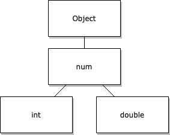

# Dart
[Dart](https://dart.dev/)

在线练习：[DartPad](https://dartpad.dev/)

## JIT 和 AOT
Dart VM 提供了一个实时编译器 (JIT)，编译器拥有增量重编译功能 (支持热重载)、运行数据收集（用于驱动 DevTools）以及丰富的开发调试支持。

当应用程序可以部署到生产环境时 (无论是发布到应用商店还是部署到生产后端)， Dart AOT 编译器可以编译成原生的 ARM 或 x64 的机器码。

JIT 更适合开发阶段，提供更好的开发体验。AOT 更适合生产环境，提供更好的运行时性能。

Dart 的开发工具（如 Dart DevTools）与这两种编译模式无缝集成。

在 Flutter 中的应用：
- 开发时使用 JIT，支持热重载功能。
- 发布时使用 AOT，生成高性能的本地应用。

### JIT
JIT 代表 Just-In-Time（即时编译）。

工作原理：Dart 代码在运行时被编译成本地机器码。

优点：
- 快速开发周期：支持热重载，允许快速迭代。
- 动态优化：可以根据运行时信息优化代码。

应用场景：主要用于开发和调试阶段。

### AOT
AOT 代表 Ahead-Of-Time（提前编译）。

工作原理：在应用发布前，Dart 代码被编译成本地机器码。

优点：
- 更快的启动时间：无需运行时编译。
- 更小的内存占用：不需要包含编译器。
- 更好的性能：代码已经优化为本地机器码。

应用场景：用于生产环境的应用发布。

## `extends` 和 `implements`
Dart 语言中的 `extends` 和 `implements` 是两种不同的继承机制，它们在用途和行为上有显著的区别。让我们详细探讨这两个关键字：

1. `extends`（扩展）:

   - 用途：用于创建一个类的子类。
   - 特点：
     a) 单继承：一个类只能 `extends` 一个父类。
     b) 继承实现：子类继承父类的方法和属性的实现。
     c) 构造函数：子类可以调用父类的构造函数。
     d) 重写：子类可以重写父类的方法。
     e) `super` 关键字：可以使用 `super` 访问父类的成员。

   - 示例：
     ```dart
     class Animal {
       void makeSound() {
         print('Some sound');
       }
     }

     class Dog extends Animal {
       @override
       void makeSound() {
         print('Bark');
       }
     }
     ```

   - 使用场景：当你想要创建一个特殊化的版本的现有类时使用。

2. `implements`（实现）:

   - 用途：用于实现一个或多个接口。
   - 特点：
     a) 多实现：一个类可以 `implements` 多个接口。
     b) 强制实现：必须实现接口中定义的所有方法。
     c) 没有继承实现：只继承方法签名，不继承实现。
     d) 没有 `super`：不能使用 `super` 关键字。
     e) 构造函数：不继承接口的构造函数。

   - 示例：
     ```dart
     abstract class Flyable {
       void fly();
     }

     abstract class Swimmable {
       void swim();
     }

     class Duck implements Flyable, Swimmable {
       @override
       void fly() {
         print('Duck flying');
       }

       @override
       void swim() {
         print('Duck swimming');
       }
     }
     ```

   - 使用场景：当你想要确保一个类具有特定的方法时使用。

:::tip
方法签名的定义：
- 方法签名包括方法名、参数列表（参数类型和顺序）以及返回类型。
- 它不包括方法的具体实现（方法体）。

当一个类 `implements` 一个接口时，它只继承该接口中定义的方法签名。这意味着实现类必须提供这些方法的具体实现，而不是继承现有的实现。如下例子中，`Circle` 类必须实现 `draw()` 和 `getDescription()` 方法。即使 `Drawable` 接口中 `getDescription()` 有默认实现，`Circle` 类也不能直接使用它。
```dart
abstract class Drawable {
  void draw();
  String getDescription() {
    return "This is drawable";
  }
}

class Circle implements Drawable {
  @override
  void draw() {
    print("Drawing a circle");
  }

  @override
  String getDescription() {
    // 必须重新实现，不能使用 Drawable 中的实现
    return "This is a circle";
  }
}
```
:::

3. 主要区别：

   - 继承 vs 接口：`extends` 用于类继承，`implements` 用于接口实现。
   - 单一 vs 多重：`extends` 只能继承一个类，`implements` 可以实现多个接口。
   - 实现继承：`extends` 继承方法和属性的实现，`implements` 只继承方法签名。
   - 强制性：`implements` 强制实现所有方法，`extends` 允许选择性重写。

4. 混合使用：

   - Dart 允许同时使用 `extends` 和 `implements`：
     ```dart
     class Bird extends Animal implements Flyable {
       @override
       void fly() {
         print('Bird flying');
       }
     }
     ```

5. 抽象类：

   - 抽象类可以包含抽象方法和具体方法。
   - 可以用 `extends` 继承抽象类，也可以用 `implements` 实现抽象类。

6. `mixin`：

   - Dart 还提供了 `mixin` 关键字，用于多重继承的一种形式。
   - 使用 `with` 关键字应用 `mixin`。示例：
    ```dart
    mixin Piloted {
      int astronauts = 1;

      void describeCrew() {
        print('Number of astronauts: $astronauts');
      }
    }

    class PilotedCraft extends Spacecraft with Piloted {
      // ···
    }
    ```

7. 选择指南：

   - 使用 `extends` 当你想要创建一个是另一个类的特殊化版本。
   - 使用 `implements` 当你想要创建一个符合特定接口的类，但不需要继承任何实现。

8. 性能考虑：

   - `extends` 通常比 `implements` 有更好的性能，因为它不需要重新实现所有方法。

9. 代码重用：

   - `extends` 提供了更好的代码重用机会，因为它继承了实现。
   - `implements` 更多地用于确保类型安全和接口一致性。

理解 `extends` 和 `implements` 的区别对于设计灵活、可维护的 Dart 代码结构至关重要。正确使用这两个关键字可以帮助你创建更清晰、更模块化的代码架构。

## 空安全
空安全（Null Safety）是 Dart 2.12 版本引入的一个重要特性，目的是防止空引用错误，提高代码的可靠性。

启用空安全后，变量默认不能为 `null`。这意味着你不能将 `null` 赋值给普通变量。

空安全的好处：
- 减少 `NullPointerException` 类型的错误。
- 使代码意图更清晰。
- 改善类型系统，使编译器能够捕获更多潜在错误。
- 空安全通常能提高代码的性能，因为减少了运行时的 `null` 检查。

## 断言
在Dart中，`assert` 是一个用于开发和调试的重要工具。它用于验证布尔条件，如果条件为 false，则会抛出一个异常。以下是对 assert 的详细解释：

1. 基本用法

`assert` 的基本语法是：

```dart
assert(condition, [optionalMessage]);
```

- `condition` 是一个布尔表达式
- `optionalMessage` 是一个可选的字符串，用于提供更多信息

例如：

```dart
void setAge(int age) {
  assert(age >= 0, 'Age cannot be negative');
  // ...
}
```

2. 作用和目的

- 调试工具：`assert` 主要用于开发和调试阶段，帮助开发者捕获和识别潜在的错误。
- 前置条件检查：用于验证函数或方法的输入参数是否符合预期。
- 状态验证：确保对象或系统处于预期的状态。

3. 运行时行为

- 在开发模式下（包括 `dartdevc` 和 `dart run`），`assert` 会被执行。
- 在生产模式下（使用 `dart compile` 或 Flutter 的发布模式），`assert` 会被忽略，不会影响性能。

4. 启用和禁用

- 默认情况下，在开发模式中 `assert` 是启用的。
- 可以使用命令行参数 `--enable-asserts` 显式启用 `assert`。

5. 使用场景

- 参数验证：
  ```dart
  void processData(List<int> data) {
    assert(data.isNotEmpty, 'Data list cannot be empty');
    // ...
  }
  ```

- 状态检查：
  ```dart
  class BankAccount {
    double balance = 0;
    
    void withdraw(double amount) {
      assert(amount > 0, 'Withdrawal amount must be positive');
      assert(balance >= amount, 'Insufficient funds');
      balance -= amount;
    }
  }
  ```

- 不可达代码检测：
  ```dart
  enum Color { red, green, blue }
  
  String getColorName(Color color) {
    switch (color) {
      case Color.red: return 'Red';
      case Color.green: return 'Green';
      case Color.blue: return 'Blue';
    }
    assert(false, 'Unreachable code');
    return ''; // 这行代码理论上永远不会执行
  }
  ```

6. 最佳实践

- 使用有意义的错误消息。
- 不要在 `assert` 中包含有副作用的代码。
- 不要依赖 `assert` 来执行程序逻辑，因为它们在生产环境中会被忽略。
- 对于需要在生产环境中也进行检查的条件，使用常规的 `if` 语句和异常处理。

7. 注意事项

- `assert` 不应该用于处理预期的运行时错误，这些错误应该使用异常处理机制。
- 在生产代码中，不要依赖 `assert` 来保证程序的正确性，因为它们会被忽略。

总结：
`assert` 是 Dart 中一个强大的开发和调试工具，它帮助开发者在早期捕获和识别潜在的问题。正确使用 `assert` 可以提高代码质量，增强程序的健壮性，并简化调试过程。然而，重要的是要记住它主要用于开发阶段，不应该被用作处理生产环境中预期错误的机制。

## 类型
:::tip
Dart 是强类型的语言，意味着每个变量和表达式都有一个明确的类型。这有助于在编译时捕获类型相关的错误。

在 Dart 中，所有可以存储在变量中的值都是对象。

每个对象都是某个类的实例。这意味着 Dart 中没有原始类型，一切都是对象。数字（如整数、浮点数）、函数、`null`都是对象。
:::

### 可空类型
使用 `?` 后缀创建可空类型。例如，`int?` 表示可以是 整数 或 `null`，`String?` 可以是 字符串 或 `null`。

```dart
int nonNullableInt = 42;  // 不能为 null
int? nullableInt = null;  // 可以为 null
```

### 空断言操作符
空断言操作符（`!`）用于告诉 Dart 一个可空类型的表达式在此处不为 `null`（如果表达式实际上是 `null`，会抛出运行时异常）。

```dart
int? nullableButNotNullInt = 10;
int x = nullableButNotNullInt!;  // 断言 nullableButNotNullInt 不为 null
```

使用场景：空断言通常用于你确定值不为 `null`，但编译器无法推断这一点的情况。

:::warning
应谨慎使用 `!`，因为它可能导致运行时错误。

最好先进行 `null` 检查，而不是盲目使用 `!`。
:::

### 内置类型
Dart 语言对以下类型提供支持：
- 数字（`int`, `double`）
- 字符串（`String`）
- 布尔值（`bool`）
- 记录（`(value1, value2)`）
- 函数（`Function`）
- 列表（`List`，也称为数组）
- 集合（`Set`）
- 映射（`Map`）
- 符文（`Runes`；通常被 `characters`(字符) API 替代）
- 符号（`Symbol`）
- 空值（`Null`）

一些其他类型在 Dart 语言中也有特殊作用：
- `Object`：除 `Null` 外所有 Dart 类的超类。
- `Enum`：所有枚举的超类。
- `Future` 和 `Stream`：用于异步编程。
- `Iterable`：用于处理可迭代对象。
- `Never`：表示一个表达式永远不能成功完成求值。最常用于总是抛出异常的函数。
- `dynamic`：表示你想禁用静态检查。通常你应该使用 `Object` 或 `Object?` 代替。
- `void`：表示一个值永远不会被使用。通常用作返回类型。

一些内置类型有它们自己的构造函数。例如，你可以使用 `Map()` 构造函数来创建一个映射。

Dart 支持字面量语法，使得创建某些类型的对象变得简单直接。例如，'this is a string' 是一个字符串字面量，true 是一个布尔字面量。

Dart 是一种面向对象的语言，所有变量都是对象。这意味着即使是基本类型如 `int` 也是对象。

#### 数字



Dart 的数字有两种类型：
- `int`。整数值不大于64位，具体取决于平台。在原生平台上，值的范围可以从 -2^63 到 2^63 - 1。在 Web 上，整数值被表示为 JavaScript 数字（64位浮点值，没有小数部分），范围可以从 -2^53 到 2^53 - 1。位运算符（如 `>>`）只在 `int` 类中定义，因为它们只适用于整数。
  ```dart
  void main() {
    var hex = 0xDEADBEEF;
    print(hex.runtimeType); // int
  }
  ```

- `double`。64位（双精度）浮点数，遵循 IEEE 754 标准。

`int` 和 `double` 都是 `num` 的子类型。`num` 提供基本的算术运算符（`+`, `-`, `*`, `/`）以及一些常用的数学方法如 `abs()`（绝对值）, `ceil()`（向上取整）, `floor()`（向下取整）等。
```dart
void main() {
  num x = 1;
  print(x.runtimeType); // int
  x += 2.5;
  print(x.runtimeType); // double
}
```

:::tip
Dart 将 `int` 和 `double` 设计为 `num` 的子类型是一个经过深思熟虑的决定，这种设计有几个重要的原因和优势：

1. 抽象和通用性

`num` 作为一个抽象类型，代表了所有数值类型的共同特性。这允许开发者在不需要区分整数和浮点数的情况下编写更通用的代码。

2. 多态性

通过这种继承关系，可以在需要 `num` 类型的地方使用 `int` 或 `double`，这提供了更大的灵活性和多态性。

3. 共享方法和属性

`num` 类定义了一些共同的方法和属性，如 `abs()`、`ceil()`、`floor()` 等，这些可以被 `int` 和 `double` 继承和使用。

4. 类型推断和转换

这种设计使得在 `int` 和 `double` 之间的转换更加自然，也有助于 Dart 的类型推断系统。
```dart
double z = 1; // Equivalent to double z = 1.0.
```

使用 `num` 的场景：

1. 通用数学函数

当你编写一个可以处理任何数字类型的函数时：

```dart
num calculateArea(num length, num width) {
  return length * width;
}
```

这个函数可以接受整数或浮点数作为参数。

2. 集合和泛型

当你想创建一个可以包含整数或浮点数的集合时：

```dart
List<num> numbers = [1, 2.5, 3, 4.7];
```

3. API 设计

当设计一个 API 时，使用 `num` 可以让用户有更大的灵活性：

```dart
class Rectangle {
  num width;
  num height;
  
  Rectangle(this.width, this.height);
  
  num get area => width * height;
}
```

4. 数值范围

当你需要表示一个可能是整数也可能是浮点数的范围时：

```dart
class NumberRange {
  num start;
  num end;
  
  NumberRange(this.start, this.end);
}
```

5. 数学库

在实现数学库时，使用 `num` 可以让函数适用于更多类型的数字：

```dart
num power(num base, int exponent) {
  // 实现...
}
```

6. 动态类型转换

在某些情况下，你可能不确定一个数值是整数还是浮点数：

```dart
num parseNumber(String input) {
  if (input.contains('.')) {
    return double.parse(input);
  } else {
    return int.parse(input);
  }
}
```

总结：
`num` 类型的设计提供了更大的灵活性和抽象性，使得 Dart 能够更优雅地处理数值计算和类型转换。它在需要处理通用数值、设计灵活 API 或处理可能是整数或浮点数的情况下特别有用。这种设计反映了 Dart 语言在类型系统和面向对象设计方面的深思熟虑。
:::


由于 Dart 将数字视为对象，因此数字可以将其自己的实用函数公开为对象方法。您无需使用其他对象即可将函数应用于数字。例如：
```dart
var rounded = 2.5.round();
```

如果需要更多数学功能，可以使用 `dart:math` 库。

2. 字符串

要在字符串中包含具有其他含义的字符，必须对该字符进行转义。要转义特殊字符，请在该字符前加上反斜杠字符。例如：
```dart
final singleQuotes = 'I\'m learning Dart'; // I'm learning Dart
final doubleQuotes = "Escaping the \" character"; // Escaping the " character
final dollarEscape = 'The price is \$3.14.'; // The price is $3.14.
final backslashEscape = 'The Dart string escape character is \\.';
final unicode = '\u{1F60E}'; // 😎,  Unicode scalar U+1F60E
```

字符串插值：可以使用`${<expression>}`语法将表达式插入字符串文字中，并允许您在表达式使用单个标识符时省略花括号。例如：
```dart
var food = 'bread';
var str = 'I eat $food'; // I eat bread
var str = 'I eat ${food}'; // I eat bread
```

多行字符串：使用隐式字符串连接 或者 使用多行字符串文字。例如：
```dart
// 使用隐式字符串连接：Dart 连接任何相邻的字符串文字，即使分布在多行上也是如此
final s1 = 'String '
    'concatenation'
    " even works over line breaks.";
```
```dart
// 使用多行字符串文字：在字符串两侧使用三个引号（单引号或双引号）时，文字可以跨越多行。
final s2 = '''
You can create
multiline strings like this one.
''';

final s3 = """
This is also a
multiline string.""";
```

字符串比较：当两个字符串包含相同的代码单元序列时，Dart 认为它们相等。例如：
```dart
final s1 = 'String '
    'concatenation'
    " works even over line breaks.";
assert(s1 ==
    'String concatenation works even over '
        'line breaks.');
```

### 判断变量的类型
在Dart中，有几种方法可以判断变量的类型：

1. `is` 关键字

使用 `is` 关键字可以检查一个对象是否是特定类型的实例。

```dart
var myVariable = 42;
if (myVariable is int) {
  print('myVariable is an integer');
}
```

2. `runtimeType` 属性

每个Dart对象都有一个 `runtimeType` 属性，它返回对象的运行时类型。

```dart
var myVariable = 'Hello';
print(myVariable.runtimeType); // 输出: String
```

3. 类型测试操作符 (`as`, `is`, `is!`)

- `as`: 类型转换
- `is`: 如果对象具有指定的类型，则返回 true
- `is!`: 如果对象不具有指定的类型，则返回 true

```dart
var myVariable = 3.14;
if (myVariable is double) {
  print('myVariable is a double');
}
if (myVariable is! int) {
  print('myVariable is not an integer');
}
```

4. 使用 `typeof` 函数（不推荐）

在某些情况下，你可能会看到使用 `typeof` 函数，但这不是Dart的标准做法，主要用于JavaScript互操作。

```dart
print(typeof(myVariable)); // 注意：这不是标准Dart，主要用于JavaScript互操作
```

5. 泛型和类型推断

Dart有强大的类型推断能力，通常你不需要显式声明类型：

```dart
var list = [1, 2, 3]; // List<int>
var map = {'a': 1, 'b': 2}; // Map<String, int>
```

6. 在函数参数中使用类型注解

```dart
void printType(Object obj) {
  if (obj is int) {
    print('Integer');
  } else if (obj is double) {
    print('Double');
  } else if (obj is String) {
    print('String');
  } else {
    print('Other type');
  }
}
```

注意事项：
- 在使用类型检查时，要考虑到Dart的类型系统，包括继承和接口实现。
- 在进行类型检查后，Dart的类型推断会在该作用域内认为变量是被检查的类型，这称为类型提升。
- 过度使用类型检查可能表明代码设计存在问题，应该考虑使用多态性或其他面向对象设计原则。

总的来说，Dart提供了多种方式来检查和处理类型，选择哪种方法取决于你的具体需求和代码上下文。

### 类型转换
#### 字符串和数字的转换
```dart
// String -> int
var one = int.parse('1');
assert(one == 1);

// String -> double
var onePointOne = double.parse('1.1');
assert(onePointOne == 1.1);

// int -> String
String oneAsString = 1.toString();
assert(oneAsString == '1');

// double -> String
String piAsString = 3.14159.toStringAsFixed(2);
assert(piAsString == '3.14');
```

### 动态类型
动态类型：
- Dart 也提供 `dynamic` 类型，允许变量在运行时改变类型。
- 但这与类型推断不同，`dynamic` 绕过了静态类型检查。

## 变量
在 Dart 中，你可以显式声明变量的类型，但这不是必须的。Dart 编译器能够根据上下文自动推断变量的类型。

推断的好处：
- 减少代码冗余，提高可读性。
- 保持静态类型检查的优势，同时提供动态语言的简洁性。

推断的限制：在某些复杂情况下，编译器可能无法准确推断类型。此时，显式类型注解可能是必要的。

最佳实践：
- 对于局部变量，通常使用 `var` 并依赖类型推断。
- 对于公共 API 或类成员，通常推荐使用显式类型注解。

Dart 变量通过以下两种方式之一获取其类型：
- 声明：声明中写的类型。
- 推断：用于初始化变量的表达式。

```dart
// 当不提供初始值时，声明具有特定类型的变量
String name;
// 声明并初始化变量，Dart 推断类型
var name = 'bob';
```

变量只能接受其类型的值。
```dart
var name = 'bob';
name = 123; // 错误 A value of type 'int' can't be assigned to a variable of type 'String'.
```

如果您不提供初始值或显式类型，则Dart将变量的类型推断为动态类型。可以为使用动态类型的Dart变量分配任何值。
```dart
var name;
name = 'bob';
name = 123; // 正确
```

当使用`final`声明变量时，要使用该变量则必须先初始化该变量。初始化后，你就无法更改这些变量的引用。
```dart
void main() {
  final String name;
  // print(name); // 错误 Final variable 'name' must be assigned before it can be used.
  if (1 == 1) {
    name = 'bob';
  } else {
    name = 'tony';
  }
  print(name); // bob
}
```

```dart
void main() {
  var foo = const [];
  const baz = [];
  print(foo == baz); // true
}
```