# MongoDB
:::info
MongoDB基于分布式文件存储，在高负载的情况下，添加更过的节点，可以保证服务器性能。
:::

## 1. 基本概念
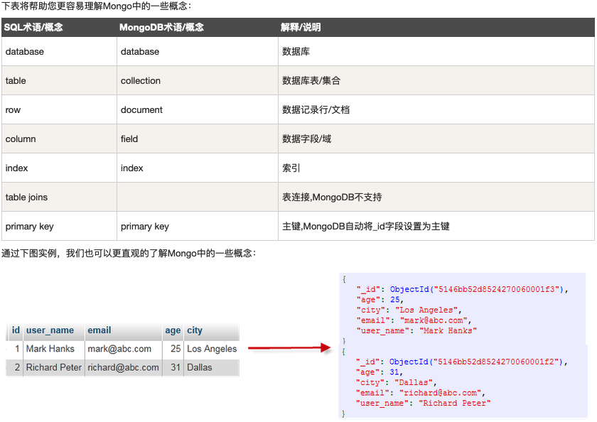

### 1.1 database 数据库
- 一个mongodb中可以建立多个数据库
- MongoDB的默认数据库为"db"，该数据库存储在data目录中
- `show dbs`命令可以显示所有数据的列表
- `db`命令可以显示当前数据库对象或集合
- `use 数据库名`可以连接到一个指定的数据库（**如果数据库不存在，则创建数据库**，否则切换到指定数据库）
- 有一些数据库名是保留的，可以直接访问这些有特殊作用的数据库，比如：
  - admin：从权限的角度来看，这是"root"数据库。要是将一个用户添加到这个数据库，这个用户自动继承所有数据库的权限。一些特定的服务器端命令也只能从这个数据库运行，比如列出所有的数据库或者关闭服务器。
  - local: 这个数据永远不会被复制，可以用来存储限于本地单台服务器的任意集合
  - config: 当Mongo用于分片设置时，config数据库在内部使用，用于保存分片的相关信息

### 1.2 collection 数据库表/集合
- 集合就是 MongoDB 文档组
- 集合没有固定的结构，这意味着对集合可以插入不同格式和类型的数据
- 当第一个文档插入时，集合就会被创建
- 在MongoDB数据库中名字空间`<dbname>.system.*`是包含多种系统信息的特殊集合(Collection)，如下:
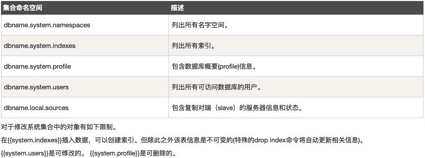

### 1.3 document 数据记录行/文档
- 文档是一组键值(key-value)对(即 BSON)，所有存储在集合中的数据都是 BSON 格式，BSON 是一种类似 JSON 的二进制形式的存储格式，是 Binary JSON 的简称
- MongoDB 的文档不需要设置相同的字段，并且相同的字段不需要相同的数据类型（这与关系型数据库有很大的区别）
- 文档中的键/值对是有序的
- 文档中的值不仅可以是在双引号里面的字符串，还可以是其他几种数据类型（甚至可以是整个嵌入的文档)
- MongoDB区分类型和大小写
- MongoDB的文档不能有重复的键
- 文档的键是字符串。除了少数例外情况，键可以使用任意UTF-8字符

### 1.4 MongoDB 数据类型
- String  字符串。存储数据常用的数据类型。在 MongoDB 中，UTF-8 编码的字符串才是合法的。
- Integer  整型数值。用于存储数值。根据你所采用的服务器，可分为 32 位或 64 位。
- Boolean  布尔值。用于存储布尔值（真/假）。
- Double  双精度浮点值。用于存储浮点值。
- Min/Max keys  将一个值与 BSON（二进制的 JSON）元素的最低值和最高值相对比。
- Array  用于将数组或列表或多个值存储为一个键。
- Timestamp  时间戳。记录文档修改或添加的具体时间。
- Object  用于内嵌文档。
- Null  用于创建空值。
- Symbol  符号。该数据类型基本上等同于字符串类型，但不同的是，它一般用于采用特殊符号类型的语言。
- Date  日期时间。用 UNIX 时间格式来存储当前日期或时间。你可以指定自己的日期时间：创建 Date 对象，传入年月日信息。
- Object ID  对象 ID。用于创建文档的 ID。
- Binary Data  二进制数据。用于存储二进制数据。
- Code  代码类型。用于在文档中存储 JavaScript 代码。
- Regular expression  正则表达式类型。用于存储正则表达式。
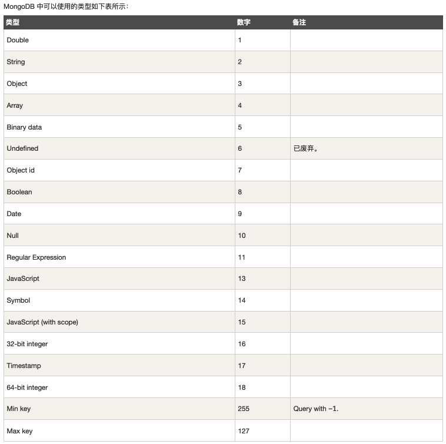

## 2. 安装及连接
### 2.1 安装
- 客户端使用[NoSQLBooster](https://www.mongobooster.com/)
- 云数据库使用[MongoDB cloud services](https://cloud.mongodb.com/)

### 2.2 连接
- 标准 URI 连接语法：
```markdown
`mongodb://[username:password@]host1[:port1][,host2[:port2],...[,hostN[:portN]]][/[database][?options]]`
- mongodb:// 这是固定的格式，必须要指定
- username:password@ 可选项，如果设置，在连接数据库服务器之后，驱动都会尝试登录这个数据库
- host1 必须的指定至少一个host, host1 是这个URI唯一要填写的。它指定了要连接服务器的地址。如果要连接复制集，请指定多个主机地址
- portX 可选的指定端口，如果不填，默认为27017
- /database 如果指定username:password@，连接并验证登录指定数据库。若不指定，默认打开 test 数据库
- ?options 是连接选项。如果不使用/database，则前面需要加上/。所有连接选项都是键值对name=value，键值对之间通过&或;（分号）隔开
```
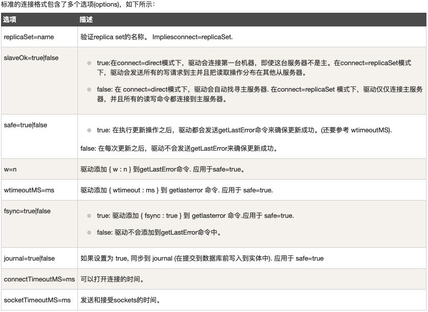

## 3. 基本操作
> 操作符:
> - (>) 大于 - $gt
> - (<) 小于 - $lt
> - (>=) 大于等于 - $gte
> - (<= ) 小于等于 - $lte
> - 基于BSON类型来检索集合中匹配的数据类型，并返回结果 - $type
如，想获取 "col" 集合中 title 为 String 的数据，你可以使用以下命令：
```js
db.col.find({"title" : {$type : 2}})
或
db.col.find({"title" : {$type : 'string'}})
```

### 3.1 增
- 创建数据库：`use 数据库名`
- 创建集合。`db.createCollection(name, options)`
如：
```js
db.createCollection("demo")
```
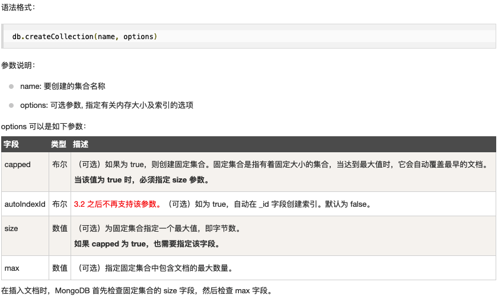
:::tip
也可以使用插入文档的方式创建集合，当往集合中插入文档时，若该集合不存在则MongoDB 会自动创建集合。
:::
- 插入文档：`db.集合名.insert(document实例)`或者`db.集合名.save(document实例)`。使用insert方法，若插入的数据主键已经存在，则会抛 org.springframework.dao.DuplicateKeyException 异常，提示主键重复，不保存当前数据。
:::warning
如果不指定 _id 字段 save() 方法类似于 insert() 方法。如果指定 _id 字段，则会更新该 _id 的数据。
3.2 版本之后新增了 db.collection.insertOne() 和 db.collection.insertMany()，废弃了 save()
:::
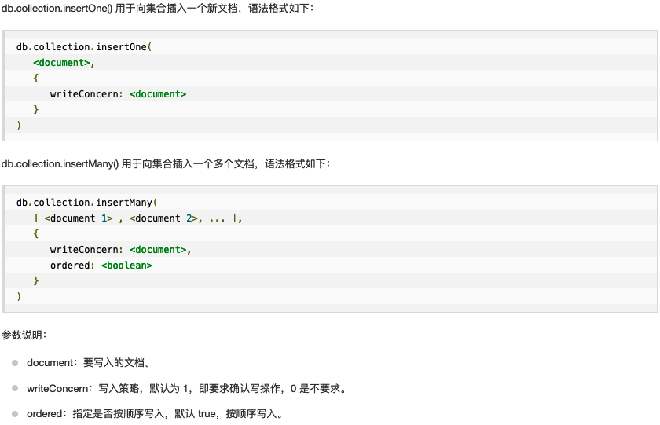

如：
```js
db.demo.insert({title:'demo'})
```
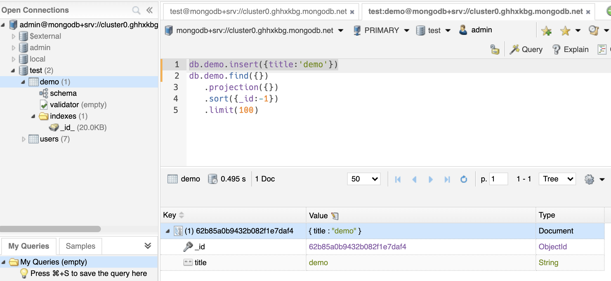

### 3.2 删
- 删除数据库。首先使用`use`切换到要删除的数据库，然后执行`db.dropDatabase()`
- 删除集合。首先使用`use`切换到要删除的数据库，然后执行`db.集合名.drop()`，如果成功删除选定集合，则 drop() 方法返回 true，否则返回 false
- 删除文档。`db.collection.remove()`，在执行 remove() 函数前先执行 find() 命令来判断执行的条件是否正确，这是一个比较好的习惯
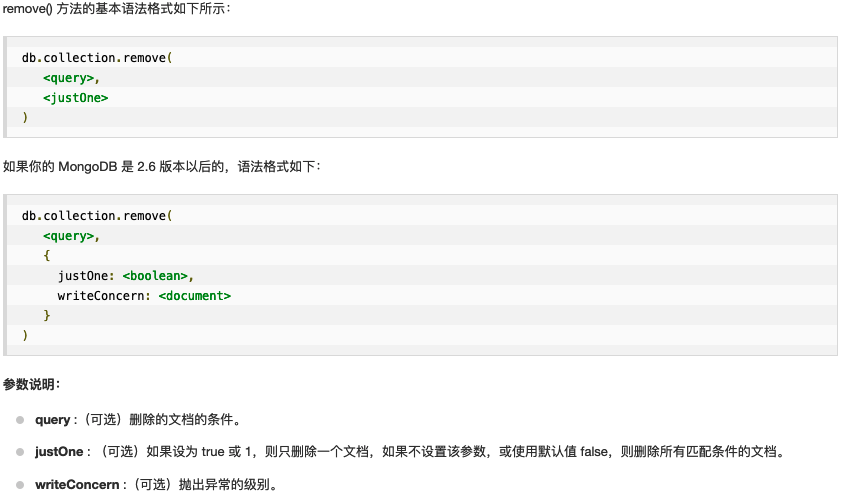
如：
```js
db.demo.remove({title:'demo1'}) // 删除所有满足条件的

db.demo.remove({title:'demo3'}，1) // 删除第一条满足条件的

// 使用remove({})删除集合的所有文档
db.demo.remove({})
```

### 3.3 改
- 更新文档：`db.collection.update()`或者`db.collection.save()`
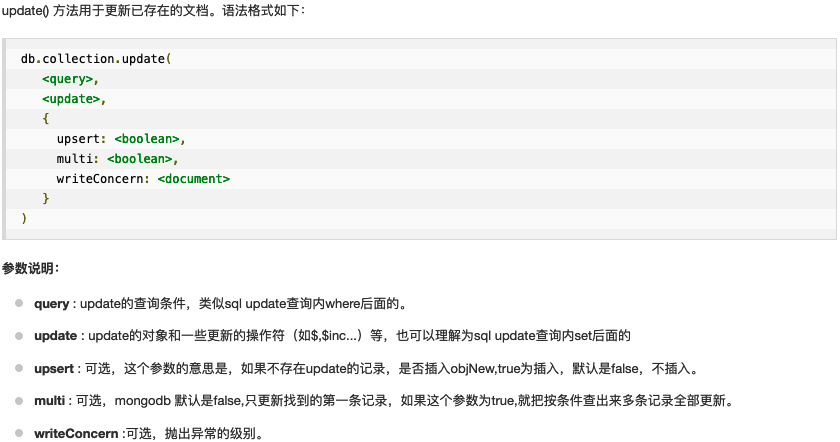
如：
```js
db.demo.update({'title':'demo'},{$set:{'title':'Demo'}}) // 更新找到的第一条

db.demo.update({'title':'demo'},{$set:{'title':'Demo'}},{multi:true}) // 把按条件查出来的多条文档全部更新
```

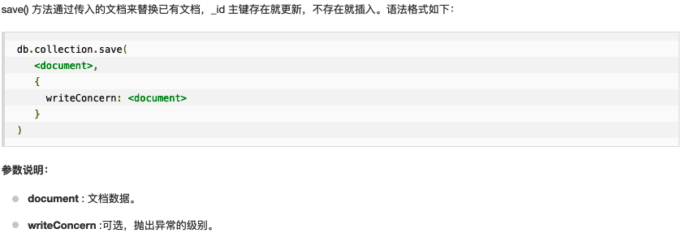
如：
```js
// 更新_id为62b85d679432b082f1e7daf9的文档数据
db.demo.save({
  _id: ObjectId('62b85d679432b082f1e7daf9'),
  title: 'demo3'
})
```

### 3.4 查
- 查看所有数据库：`show dbs`
- 查看当前数据库：`db`
- 查看某个数据库下的所有集合：`show collections`或者`show tables`
- 查看当前集合：`db`
- 查看文档：`db.集合名.find()`，`db.集合名.find().pretty()`
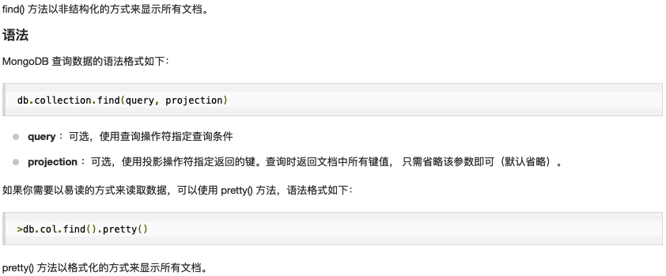
- 查看文档AND条件：`db.集合名.find({key1:value1, key2:value2}).pretty()`
- 查看文档OR条件：
```js
db.集合名.find(
   {
      $or: [
         {key1: value1}, {key2:value2}
      ]
   }
).pretty()
```
- 查看文档Where语句：
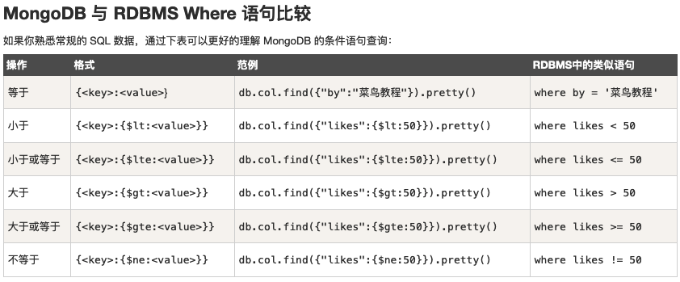

- 查看一个文档：`db.集合名.findOne()`

## 4. [mongoosejs](https://mongoosejs.com/)
> [常用API](https://blog.csdn.net/scarlett_dream/article/details/105124386)