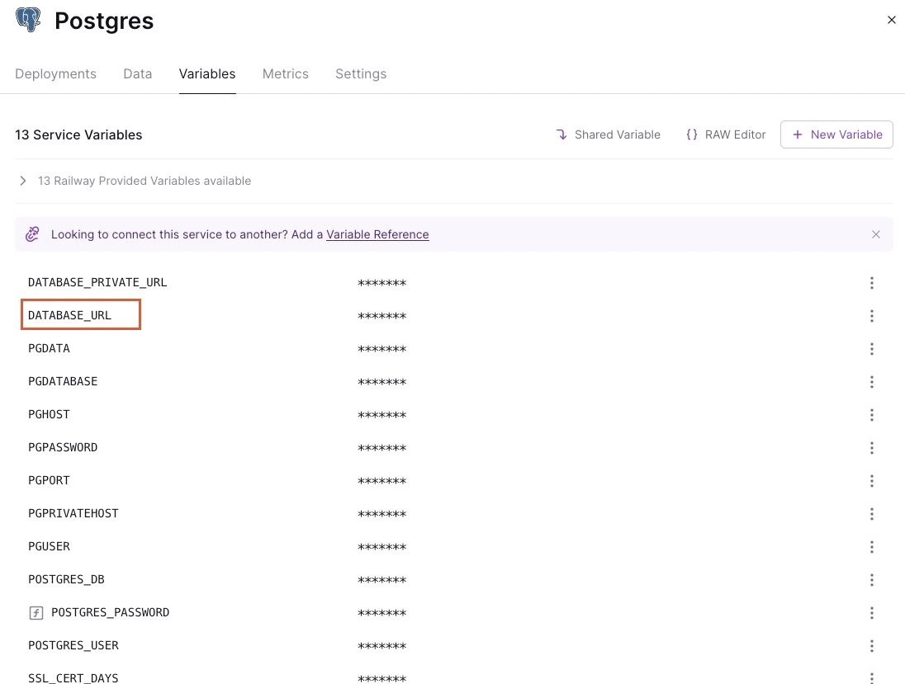
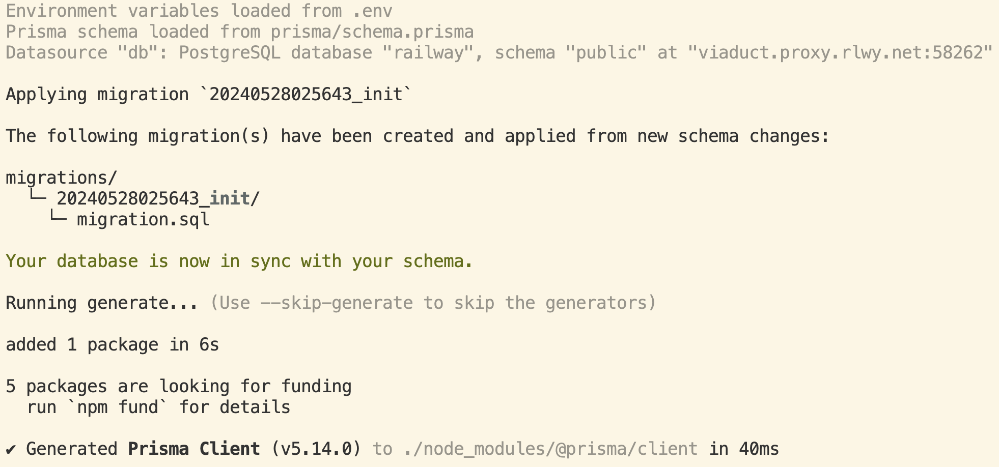
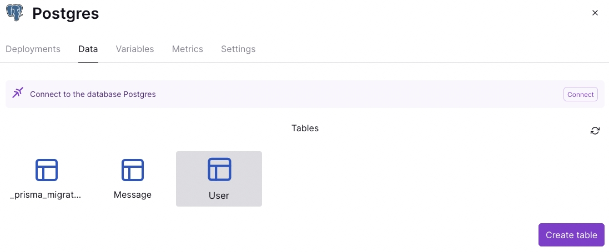
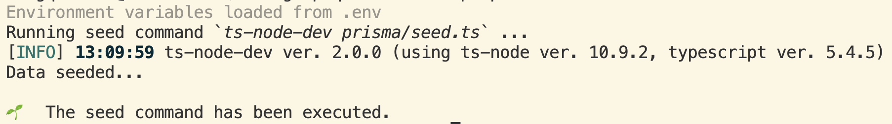
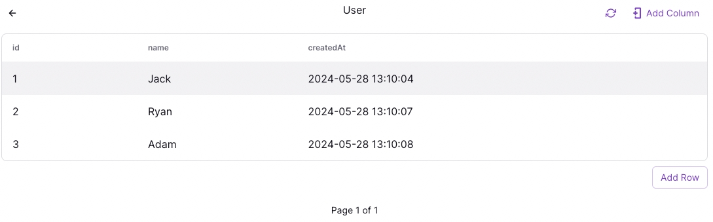
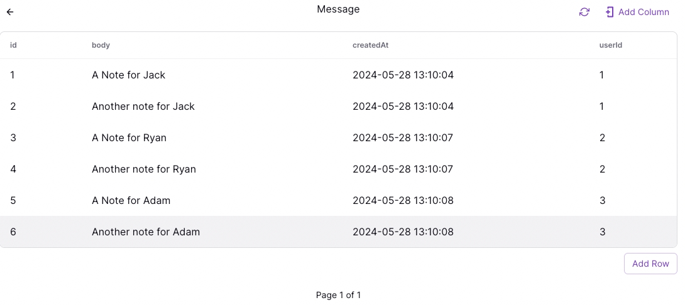

[Prisma ORM](https://www.prisma.io/docs/orm) 是一个 Node.js 和 TypeScript ORM，具有直观的数据模型、自动迁移、类型安全和自动完成功能。

## [使用Prisma](https://www.prisma.io/blog/e2e-type-safety-graphql-react-2-j9mEyHY0Ej)
### 前期准备
1. `npm i -D ts-node-dev typescript @types/node`
     - `@types/node`：Node.js 的 TypeScript 类型定义
     - `ts-node-dev`：编译并运行您的 TypeScript 代码并监视文件更改。当应用程序中的文件发生更改时，它将重新编译并重新运行您的代码。
      ```json title="package.json"
      "scripts": {
        "dev": "ts-node-dev src/index.ts"
      },
      ```
  
2. `npx tsc --init`：生成`tsconfig.json`
   
3. `npm i -D prisma`
   
4. 初始化 Prisma：`npx prisma init` 此命令将在您的项目中创建一个新的 `prisma` 文件夹，此文件夹包含一个文件 `schema.prisma`，该文件使用 Prisma Schema Language (PSL) ，您将在其中定义数据库的表和字段。此命令还创建了一个 `.env` 文件，其中声明了一个变量`DATABASE_URL`，用于保存Prisma用于连接到部署的数据库。

  `schema.prisma`文件通常包含3个部分：
     - Data source：指定您的数据库连接。例如使用`postgresql`数据库：
        ```prisma title="prisma/schema.prisma"
        datasource db {
          provider = "postgresql"
          url      = env("DATABASE_URL") // url可以是本地文件路径，如："file:./dev.db"
        }
        ```
     - Generator：表示您要生成Prisma Client
        ```prisma title="prisma/schema.prisma"
        generator client {
          provider = "prisma-client-js"
        }
        ```
     - Data model：定义您的应用程序模型，每个模型都会映射到底层数据库中的一张表
  
  :::tip
   使用Railway部署的数据库，`DATABASE_URL`在变量选项卡下：
   
  :::

5. 安装[Prisma VSCode Extension](https://marketplace.visualstudio.com/items?itemName=Prisma.prisma)，用于`schema.prisma`文件的高亮及自动补全

### 设计数据库表
对 `User` 表进行建模，该表需要以下列：
- `id`：数据库记录的唯一ID
- `name`：用户的名称
- `createdAt`：每个`user`创建时间的时间戳

```prisma title="prisma/schema.prisma"
model User {
  id        Int      @id @default(autoincrement())
  name      String
  createdAt DateTime @default(now())
}
```

`Message`表需要以下列：
- `id`：数据库记录的唯一ID
- `body`：message的内容
- `createdAt`：每个`message`创建时间的时间戳
```prisma title="prisma/schema.prisma"
model Message {
  id        Int      @id @default(autoincrement())
  body   String
  createdAt DateTime @default(now())
}
```

在 `User` 表和 `Message` 表之间建立一对多关系：
```prisma title="prisma/schema.prisma"
model User {
  id        Int       @id @default(autoincrement())
  name      String
  createdAt DateTime  @default(now())
  messages  Message[]
}

model Message {
  id        Int      @id @default(autoincrement())
  body   String
  createdAt DateTime @default(now())
  userId    Int
  user      User     @relation(fields: [userId], references: [id])
}
```

### 将本地设计的数据库表迁移到部署的数据库
使用 `npx prisma migrate dev --name init` 创建一个名为 `init` 的新迁移文件，将该迁移应用到您的数据库，最后根据`schema`生成 Prisma Client。

```sql title="prisma/migrations/20240528025643_init/migration.sql"
-- CreateTable
CREATE TABLE "User" (
    "id" SERIAL NOT NULL,
    "name" TEXT NOT NULL,
    "createdAt" TIMESTAMP(3) NOT NULL DEFAULT CURRENT_TIMESTAMP,

    CONSTRAINT "User_pkey" PRIMARY KEY ("id")
);

-- CreateTable
CREATE TABLE "Message" (
    "id" SERIAL NOT NULL,
    "body" TEXT NOT NULL,
    "createdAt" TIMESTAMP(3) NOT NULL DEFAULT CURRENT_TIMESTAMP,
    "userId" INTEGER NOT NULL,

    CONSTRAINT "Message_pkey" PRIMARY KEY ("id")
);

-- AddForeignKey
ALTER TABLE "Message" ADD CONSTRAINT "Message_userId_fkey" FOREIGN KEY ("userId") REFERENCES "User"("id") ON DELETE RESTRICT ON UPDATE CASCADE;
```


### [Prisma Client](https://www.prisma.io/docs/orm/prisma-client)
`npm i -D @prisma/client`，使用Prisma Client可以在代码中访问数据库进行操作

#### 在数据库中添加一些初始数据
- 在`prisma`文件夹下创建一个文件`seed.ts`，使用Prisma Client新增一些数据
  ```ts title="prisma/seed.ts"
  import { PrismaClient } from "@prisma/client";
  const prisma = new PrismaClient();

  async function main() {
    // Delete all `User` and `Message` records
    await prisma.message.deleteMany({});
    await prisma.user.deleteMany({});
    // (Re-)Create dummy `User` and `Message` records
    await prisma.user.create({
      data: {
        name: "Jack",
        messages: {
          create: [
            {
              body: "A Note for Jack",
            },
            {
              body: "Another note for Jack",
            },
          ],
        },
      },
    });
    await prisma.user.create({
      data: {
        name: "Ryan",
        messages: {
          create: [
            {
              body: "A Note for Ryan",
            },
            {
              body: "Another note for Ryan",
            },
          ],
        },
      },
    });
    await prisma.user.create({
      data: {
        name: "Adam",
        messages: {
          create: [
            {
              body: "A Note for Adam",
            },
            {
              body: "Another note for Adam",
            },
          ],
        },
      },
    });
  }

  main().then(() => {
    console.log("Data seeded...");
  }).finally(async () => {
    await prisma.$disconnect() // 执行后断开数据库连接
  })
  ```

- 添加执行命令执行`seed.ts`
  ```json title="package.json"
  // ...
  "prisma": {
    "seed": "ts-node-dev prisma/seed.ts"
  },
  // ...
  ```

- 执行`npx prisma db seed`
  
  
  
  :::tip
  如果报错`PrismaClientInitializationError: Invalid prisma.message.deleteMany() invocation`，可能是连接不上数据库，再次执行就可以了。
  :::

### [Prisma Studio](https://github.com/prisma/studio)
Prisma 附带的强大的数据库 GUI，您可以在其中与数据进行交互。

运行以下命令会自动在浏览器中访问`http://localhost:5555`，展示了连接的数据库表
```bash
npx prisma studio
```