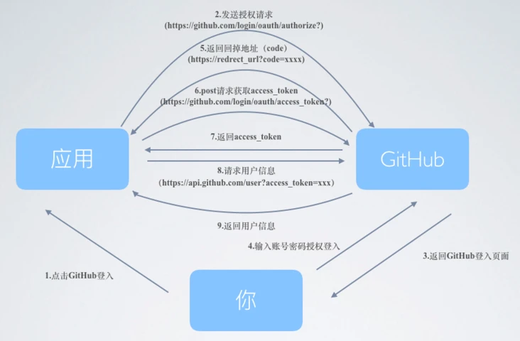
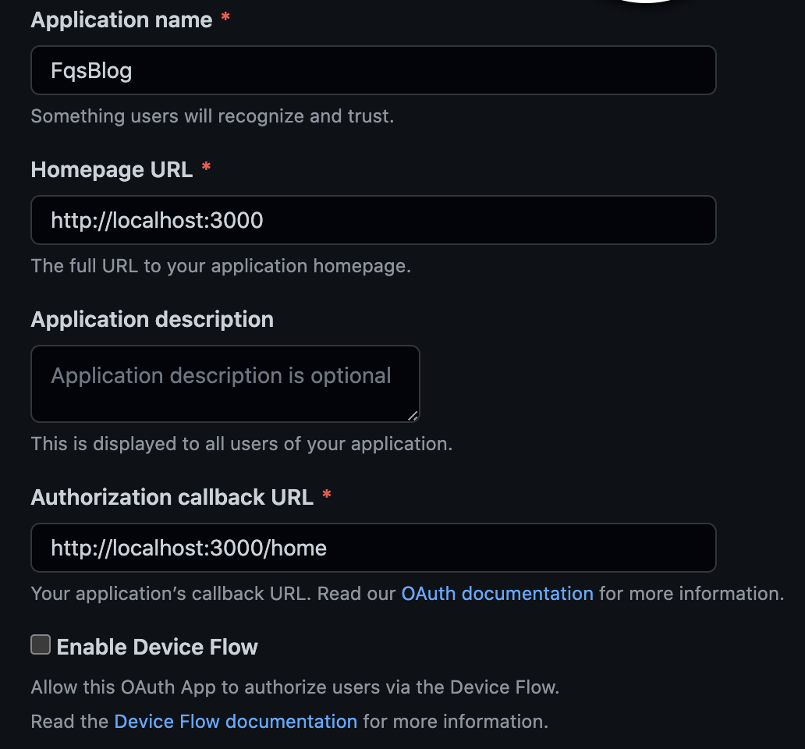
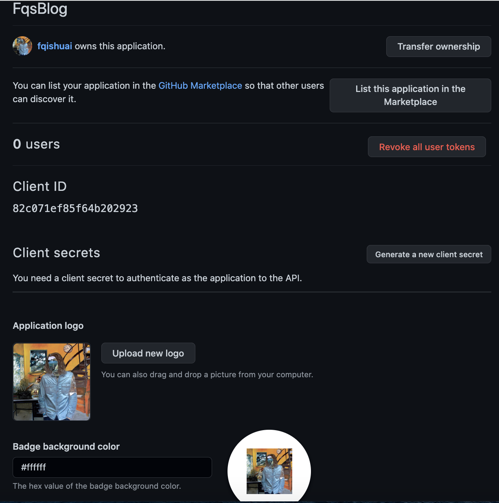
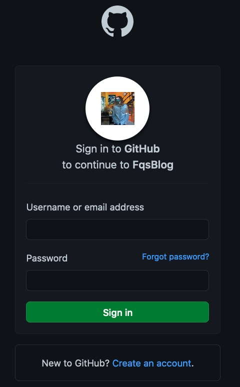
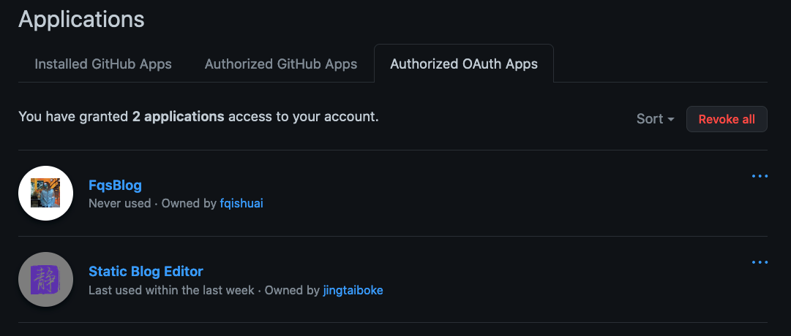

:::tip
[github访问不了的解决办法](https://cloud.tencent.com/developer/article/2310963)：1.浏览器打开[ipaddress](https://www.ipaddress.com/) 2. 查询`www.github.com`的IP 3. 本地配置host （注意：github的ip经常变，隔断时间访问不了的话可以重复以上步骤）

[git常用命令](https://hx.dcloud.net.cn/Tutorial/SourceControl/Git/README)
:::

## 1. 使用git rebase合并分支
(e.g.master合并dev)：`git rebase dev`

## 2. 使用git rebase合并commits
命令语法：`git rebase -i [start-commitid]  [end-commitid]`
:::tip
注意：不包含start-commitid，包含end-commitid
:::
- pick：保留该commit（缩写:p）
- reword：保留该commit，但我需要修改该commit的注释（缩写:r）
- edit：保留该commit, 但我要停下来修改该提交(不仅仅修改注释)（缩写:e）
- squash：将该commit和前一个commit合并（缩写:s）
- fixup：将该commit和前一个commit合并，但我不要保留该提交的注释信息（缩写:f）
- exec：执行shell命令（缩写:x）
- drop：我要丢弃该commit（缩写:d）

## 3. git pull 报错：fatal: Exiting because of unfinished merge.
解决方法（放弃本地修改）：`git reset --hard origin/master`

## 4. 不要使用git rebase修改已经push到远端的commit
否则rebase后push的时候会报错（因为git的push操作默认是假设远端的分支和你本地的分支可以进行fast-forward操作，换句话说就是这个push命令假设你的本地分支和远端分支的唯一区别是你本地有几个新的commit，而远端没有）让先pull，而pull后会有一堆冲突。

## 5. 强制推送到远端分支(e.g. feature分支)
使用  `git push --force-with-lease origin feature`  来保证分支安全

## 6. 查看git graph
`git log --graph --decorate --oneline --simplify-by-decoration --all`
- `--decorate` 标记会让git log显示每个commit的引用(如:分支、tag等)
- `--oneline` 一行显示
- `--simplify-by-decoration` 只显示被branch或tag引用的commit
- `--all` 表示显示所有的branch，如果想显示分支ABC的关系，则将`--all`替换为branchA branchB branchC
## 7. git commit message规范
- feat：新功能（feature）
- fix：修补bug
- docs：文档（documentation）
- style： 格式（不影响代码运行的变动）
- refactor：重构（即不是新增功能，也不是修改bug的代码变动）
- test：增加测试
- chore：构建过程或辅助工具的变动

## 8. [如何切换git本地账号](https://www.jianshu.com/p/dca5e36d404e)
1. 查看配置：git config --list
2. 切换账号
- `git config --global user.name "xxx"`
- `git config --global user.email "xxx"`

## 9. 创建一个新的存储库
1. `git clone https://xxx`
2. `git add README.md`
3. `git commit -m "add README"`
4. `git push -u origin main`

## 10. 推送现有空的存储库
1. `cd existing_folder`
2. `git init`
3. `git remote add origin https://xxx`
4. `git add .`
5. `git commit -m "Initial commit"`
6. `git push -u origin main`

## 11. 推送已有存储库
1. `cd existing_repo`
2. `git remote set-url origin https://xxx`
3. `git push --all https://xxx`

## 12. git大文件push 
> You may want to try Git Large File Storage - https://git-lfs.github.com.

使用git lfs，步骤：
1. 开启上传大文件的开关命令：`git lfs install`
2. 生成跟踪后缀文件：`git lfs track "*.pdf"` (`*.pdf`是大文件后缀，这里可以做修改，修改为大文件后缀即可 )
3. 添加属性跟踪文件：`git add .gitattributes`
4. 按git上传顺序进行操作
```bash
git add bookA.pdf
git commit -m "feat: 上传大文件bookA"
git push
```

## 13. git branch --set-upstream-to=origin/remote_branch local_branch
## 14. 查看某个stash改动的文件
`git stash show stash@{0}`

## 15. 查看某个stash具体内容
`git stash show -p stash@{0}`

## 16. git subtree
## 17. 取出指定的stash
`git stash apply --index stash的索引`

## 18. [git cherry-pick](https://www.ruanyifeng.com/blog/2020/04/git-cherry-pick.html)
- 转移一个提交：`git cherry-pick <Hash>`
- cherry-pick 支持一次转移多个提交
> - `git cherry-pick <HashA> <HashB>`
> - 上面的命令将 A 和 B 两个提交应用到当前分支。这会在当前分支生成两个对应的新提交。
> - 如果想要转移一系列的连续提交，可以使用下面的简便语法。
> - `git cherry-pick A..B`
> - 上面的命令可以转移从 A 到 B 的所有提交。它们必须按照正确的顺序放置：提交 A 必须早于提交 B，否则命令将失败，但不会报错。
> - 注意，使用上面的命令，提交 A 将不会包含在 Cherry pick 中。如果要包含提交 A，可以使用下面的语法。
> - `git cherry-pick A^..B`

## 19. [如何在 GitHub 提交第一个 pull request](https://chinese.freecodecamp.org/news/how-to-make-your-first-pull-request-on-github/)
- 1) fork仓库A
- 2) 将你账户中的仓库A克隆到本地
- 3）本地打开仓库A并新建一个分支用来修改
- 4）修改并提交
- 5）把变更推送到github
  - 推送前先确认远程库的名称，使用**git remote**查看
  - 确认后推送：git push origin [Branch Name]。注意：这里的origin是git remote查看的结果
- 6）GitHub上在你fork的仓库中可以看到一个“Compare & pull request”按钮，点击它。
- 7）write这次pr的内容，然后点击Create pull request
- 8）pr被接受的话，你将会收到邮件通知（不被接受也会收到邮件通知，本人第一个pr被拒了，哎~）

## 20. git fetch
- git pull 和 git fetch 的区别
> - [使用 git pull 、git fetch 获取最新版本](https://blog.csdn.net/weixin_44653603/article/details/87874110)
> - [git fetch & pull详解](https://juejin.cn/post/6844903921794859021)

## 21. [git凭据](https://www.codenong.com/15381198/)
- github从2021.08.13开始，访问仓库时不再支持用户名-密码的形式进行身份验证
- Settings/Developer settings/Personal access tokens 设置token，使用用户名-token的形式访问
- 更换密码或token
  - windows可以在控制面板/用户帐户/凭据管理器/Windows凭据中将git的凭据删除  或者  使用git config --global --unset credential.helper禁用对Git凭据缓存的使用
  - macos：启动台中打开钥匙串--->系统根证书--->搜索git，删掉github.com的密码

## 22. [github使用文档](https://docs.github.com/cn/github)

## 23. git撤销，放弃本地修改
### (1) 未使用git add缓存代码时
```js
/*
可以使用git checkout -- filename，比如git checkout -- readme.md
不要忘记"--"，不然就成了检出分支了。
放弃所有的文件修改(包括内容修改和文件删除)，使用git checkout .
*/
```
### (2) 已经使用了git add
```js
/*
可以使用git reset HEAD filename，比如git reset HEAD readme.md，来放弃指定文件的缓存
放弃所有的缓存可以使用，git reset HEAD .
此命令相当于撤销了git add的工作，使用该命令后，本地的修改并不会消失，继续使用
git checkout -- filename，就可以放弃本地的修改
*/
```
### (3) 已经使用了git commit提交了代码
```js
/*
可以使用git reset --hard HEAD^ 回退到上一次commit的状态
此命令可以用来回退到任意版本：git reset --hard commitId
可以使用git log来查看提交历史，commit后面的一串儿就是commitId
*/
```

## 24. 修改commit message
- [amend](https://docs.github.com/cn/github/committing-changes-to-your-project/creating-and-editing-commits/changing-a-commit-message)

## 25. [Git 拉取项目中指定文件或文件夹](https://www.jianshu.com/p/b1da4b0fea6e): 所用知识点为稀疏检出
```js
cd 一个空文件夹
git init    //git初始化
git remote add -f origin http://githhub/projectName.git   //添加远程仓库地址
git config core.sparsecheckout true    //开启sparse checkout功能
echo "fileName" >> .git/info/sparse-checkout   //fileName需要拉去的文件夹名称--->注意：windows上fileName加引号无效！！！
cat .git/info/sparse-checkout   //查看配置文件信息
git pull origin master    //拉取远程哪个分支的文件目录，这里是master上的分支
```
> **注意：** 可以 echo 某个目录名 >> .git/info/sparse-checkout；也可以 echo 某个文件名 >> .git/info/sparse-checkout；多个文件或目录的话可以遍历执行 echo 某个目录名或某个文件名 >> .git/info/sparse-checkout
> **注意：** 一旦设置拉取的文件后，后续就不能再添加或者减少拉取或者提交的代码范围，修改sparse-checkout无效。除非按照步骤再来一遍：echo 某个目录名或某个文件名 >> .git/info/sparse-checkout，然后拉取
> **注意：** 添加文件进行稀疏检出时，该文件需要有后缀

## 26. [稀疏检出和浅克隆](https://www.worldhello.net/gotgit/08-git-misc/090-sparse-checkout-and-shallow-clone.html)

## 27. 查看远程分支的git log： git log 远程分支名

## 28. git rebase有冲突时
- 先解决冲突，然后git add，然后git rebase --continue
- 也可以git rebase --skip跳过该commit
- 也可以git rebase --abort放弃本次rebase
> 工作时的操作：从master拉一个release分支并push到远程，用release分支rebase开发分支，解决冲突--->git add--->git rebase --continue，反复该过程直到本次rebase successfully，然后git status，根据status执行不同的命令，比如git fetch，然后rebase origin/release，然后push
> 注意：避免用rebase过开发分支的分支再去rebase新的开发分支

## 29. 修改本地分支：git branch -m oldname newname  或者 git branch -M newname

## 30. git push时报错：remote: Permission to rawlinsfeng/ignore-but-use-plugin.git denied to VimPy.
## 31. git clone时报错：https://xxx.git not found.
> 30和31这两种报错都是git 凭据导致的，如果你有两个github账号，使用不同账号的代码仓库时需要先删掉本机存的github凭据，或者设置本机不保存github凭据。

## 32. 仓库只有一个git commit，怎么撤掉该git commit？

## 33. [git tag](https://git-scm.com/book/zh/v2/Git-%E5%9F%BA%E7%A1%80-%E6%89%93%E6%A0%87%E7%AD%BE)
- 列出标签：git tag
- push本地所有标签：git push origin --tags
- tag内容：git tag -a v1.4 -m "my version 1.4"
- 给某次commit追加tag：git tag -a tag名 commit的hash，例如：git tag -a v1.2 9fceb02
- 将tag提交到远程仓库：git push origin tag名
- 回滚切换到某个tag：
  - git checkout tag名
  - git reset –hard xxxxxxx
- 删除某个tag：
  - 本地删除：git tag -d tag名
  - 远程删除（一般不删除远程）：git push origin :refs/tags/tag名
- 查看具体某一个 tag 的详情：git show tag名

## 34. 当用自己的网访问不了github时，可以使用[dev-sidecar](https://gitee.com/docmirror/dev-sidecar)，亲测可用。

## 35. gitbook的用法
- npm install -g gitbook-cli
- 在一个文件夹下执行gitbook init，生成两个文件：
>- readme.md---书籍的介绍文件
>- summary.md---书籍的目录结构的配置文件

## 36. github pages
### (1) github.io
- 创建一个public的仓库，命名为username.github.io（比如：fqishuai.github.io）
- 新建一个index.html，随便写点啥内容，然后push
- 访问https://fqishuai.github.io

### (2) [Jekyll](http://jekyllcn.com/)
> Jekyll 是一个静态站点生成器，内置 GitHub Pages 支持和简化的构建过程。Jekyll 的核心其实是一个文本转换引擎。它的概念其实就是：你用你最喜欢的标记语言来写文章，可以是 Markdown, 也可以是 Textile, 或者就是简单的 HTML, 然后 Jekyll 就会帮你套入一个或一系列的布局中。
- 可以通过编辑 [_config.yml](http://jekyllcn.com/docs/configuration/) 文件来配置大多数 Jekyll 设置

- 默认情况下，Jekyll 不会构建以下文件或文件夹：
>- 位于文件夹 /node_modules 或 /vendor 中
>- 开头为 _ 或 . 或 #
>- 结尾为 ~
>- 被配置文件中的 exclude 设置排除

- [安装jekyll的前提条件](https://jekyllrb.com/docs/installation/#requirements)
> macos环境直接执行：gem install --user-install bundler jekyll
> - 安装成功后可以使用jekyll -v 查看版本
> - 使用 `jekyll new [site-name]` 创建一个本地的静态站点
> - cd到刚才创建的文件夹下，执行`bundle exec jekyll serve`
> - 浏览器访问127.0.0.1:4000就可以看到这个静态站点页面
> - 如果你希望把 jekyll 安装到当前目录，你可以运行 jekyll new . 来代替。如果当前目录非空，你还需要增添 --force 参数，所以命令应为 jekyll new . --force。
> - 生成的目录结构：_config.yml--->保存配置数据。很多配置选项都可以直接在命令行中进行设置，但是如果你把那些配置写在这儿，你就不用非要去记住那些命令了；_posts--->这里放的就是你的文章了。文件格式很重要，必须要符合: YEAR-MONTH-DAY-title.MARKUP。 永久链接 可以在文章中自己定制，但是数据和标记语言都是根据文件名来确定的；_site--->一旦 Jekyll 完成转换（本地执行bundle exec jekyll serve后就会生成该目录），就会将生成的页面放在这里（默认）,最好将这个目录放进你的 .gitignore 文件中
> - 把生成的目录直接push到fqishuai.github.io这个仓库，访问 https://fqishuai.github.io 就可以看到和本地启动bundle exec jekyll serve访问127.0.0.1:4000时一样的页面

- jekyll生成的目录详解
>- 如果根目录下有index.html，则该html文件的内容就是fqishuai.github.io的首页，在该html中可以使用如下形式来加载其他html内容
```html
---
layout: default
---

<!-- 以上写法，就会把项目_layouts目录下的default.html的内容加载进来-->
```
>- 在html文件中还可以使用``来加载_includes目录下的文件
```html
<div>
  
</div>
```

- 使用[Jekyll 主题](http://jekyllthemes.org)
> 其实一个主题就是一个使用Jekyll生成的项目，可以下载到本地或者clone到本地，然后在此基础上按自己的想法再修改修改就可以成为自己的Jekyll博客模版
> 也可以[安装主题](http://jekyllcn.com/docs/themes/)

> 注意：使用安装主题这种方式的时候，本地需要有该主题对应的**gemspec文件**！

### (3) gh-pages
- react项目(my-app)部到GitHub page
>- yarn create react-app my-app --template typescript
>- yarn add gh-pages --dev
>- 修改package.json: (1)scripts增加"predeploy": "yarn build", "deploy": "gh-pages -d build" (2)增加"homepage": "./",

### (4) deployments
> 注意： If your GitHub Pages site is built from a public repository, it is built and deployed with a GitHub Actions workflow run unless you've configured your GitHub Pages site to use a different CI tool. 
- Environments--->github-pages的状态如果是Failure则说明没有部署成功，可以点进去查看原因，比如：github-pages 223 | Error:  The jekyll-theme-chirpy theme could not be found.

### (5) [Liquid语法](https://liquid.bootcss.com/)

### (6) 分页插件[jekyll-paginate](https://blog.csdn.net/henryhu712/article/details/84800410)

## 37. git 修改远程分支名称
- 首先 git branch -m 旧分支名 新分支名
- 其次 git push --delete origin 旧分支名
- 将新分支名推上去 git push origin 新分支名
- 将新本地分支和远程相连 git branch --set-upstream-to origin/新分支名

> 注意：如果修改远程master分支的名字，则：在Settings--->Branches中进行修改，然后：
> - git branch -m master main
> - git fetch origin
> - git branch -u origin/main main
> - git remote set-head origin -a

## 38. 设置git识别文件名大小写变化
> git config core.ignorecase false

## 39. github查看安装的github应用（Installed GitHub Apps）、授权的github应用（Authorized Github Apps）、授权的OAuth应用（Authorized OAuth Apps）
- github--->settings--->applications

## 40. github授权登录
> 第三方登录的实质就是 OAuth 授权

### (1) 授权流程
> 整个流程如图所示


- 授权的总体流程：
> - 用户进入到我的网站,我想要获取到用户的 GitHub 信息
> - 跳转到 GitHub 授权页面,然后问用户是否允许我获得他的信息,授予权限
> - 同意,我的网站会获得 GitHub 发回的一个授权码,使用该授权码向 GitHub 申请一个令牌
> - GitHub 授权码进行验证,没问题就会返回一个令牌(这个令牌只在短时间内有效)
> - 我的网站获得令牌,然后向 GitHub 的 user 发起请求
> - GitHub 验证令牌,没问题用户信息就返回过来了
> - 我们通过返回的用户信息然后创建一个用户,并生成 token 返回给 client
> - 然后根据 token 进行登录验证,来保持登录

### (2) 操作步骤
- 首先新建一个GitHub App或者一个OAuth App（github--->settings--->Developer settings--->GitHub Apps/OAuth Apps）

> 其中，Authorization callback URL对应的页面用来接收github返回的code，将code传给服务端，服务端用该code以及client ID 和 client secret调用GitHub API来鉴权获取GitHub账户信息

- 会生成一个Client ID，并且可以生成一个Client secret


- 可以访问`https://github.com/login/oauth/authorize?client_id=[你申请之后的client_id]&redirect_uri=[你的回调地址（也就是callback URL）]`看下此时的页面效果，有GitHub登录态和没有GitHub登录态的效果不一样，如果所示


> - 注意：有登录态的这个页面只会在未授权前出现，授权后有登录态的情况下不会再出现
> - 此时可以去授权该oauth app的GitHub账户查看Authorized OAuth App，发现多了一个刚才授权的应用，如图所示

> - 当然也可以撤销授权，点击Revoke，撤销授权后该应用就不能访问你的GitHub账户了

### (3) 代码参考
- [vue+node实现第三方登录——github](https://blog.csdn.net/YY_WYG/article/details/109027872)

## 41. github api
- [github-api](https://www.npmjs.com/package/github-js)

## 42. 本地新建分支后push到远程
> git push --set-upstream origin 分支名

## 43. 报错：HTTP/2 stream 1 was not closed cleanly before end of the underlying stream
是git默认使用的通信协议出现了问题，可以通过将默认通信协议修改为 http/1.1 来解决该问题：
```bash
git config --global http.version HTTP/1.1
```

## 44. 撤销中间某次commit
> [git revert 撤销中间某次commit](https://www.jianshu.com/p/bca969bfda7d)

- 想要撤回中间某次commit，可以使用命令: `git revert commit_id`
- 如果想撤销的不是一次commit，而是连着的几次，那么: `git revert --no-commit commit1..commit2`
- 如果这次提交是别的分支合并过来的，按照提示可知需要加参数`-m`: `git revert -m commit_id`

## 45. 查询本地所有操作记录
> git reflog

## 46. 创建新分支
```bash
git branch <branch_name>

# 新建一个分支并切换至新分支
git checkout -b <branch_name>
```

## 47. 本地远程同步修改仓库名
```bash
# 1. 查看关联的远程仓库信息
git remote -v

# 2. 删除远程仓库关联
git remote rm origin

# 3. 在GitHub上操作rename仓库名
# 4. 本地仓库文件夹重命名

# 5. git remote add origin xxx （如：git remote add origin https://github.com/fqishuai/fqishuai.onrender.com.git）

# 6. 拉取
git pull

# 7. 关联分支
git branch --set-upstream-to=origin/main main
```

## 48. `git pull`时报错fatal: refusing to merge unrelated histories
解决：`git pull --allow-unrelated-histories`

## 49. `.gitattributes`
`.gitattributes` 文件是一个 Git 配置文件，它允许你为特定的文件和目录设置特定的属性。这些属性可以影响 Git 如何处理文件的内容和变更。

`.gitattributes` 文件通常位于 Git 仓库的根目录中，但也可以在子目录中有额外的 `.gitattributes` 文件来覆盖或补充根目录下的设置。

以下是 `.gitattributes` 文件中可以设置的一些常见属性：
- 文本属性：指定文件是否应被视为文本文件，以及如何处理行尾（EOL）转换。
  - `*.txt text`：确保文本文件在检出时具有正确的行尾。
  - `*.jpg binary`：指定 JPEG 文件为二进制文件，避免进行行尾转换。

- 过滤器属性：定义自定义过滤器，如 Git LFS（大文件存储）。
  - `*.psd filter=lfs diff=lfs merge=lfs -text`：为 Photoshop 文件使用 Git LFS。

- 合并策略属性：为特定文件指定合并策略。
  - `*.properties merge=ours`：在合并时，对于 `.properties` 文件，总是保留当前分支的版本。

  - `pnpm-lock.yaml merge=text`：指定当发生合并冲突时，对于 `pnpm-lock.yaml` 文件应该使用文本合并策略。这意味着 Git 将尝试自动解决这个文件的合并冲突，就像它处理普通文本文件一样。然而，对于锁文件来说，这种自动合并可能并不总是安全的，因为合并的结果可能会破坏锁文件的结构，导致依赖关系不一致。在实践中，更安全的做法通常是在合并时手动解决 `pnpm-lock.yaml` 的冲突，或者使用 pnpm 的命令来重新生成锁文件，确保依赖关系的正确性。如果你选择使用 `pnpm-lock.yaml merge=text`，请确保在合并后检查锁文件的完整性和项目的依赖关系。

  - `shrinkwrap.yaml merge=binary`：表示你希望 Git 将 `shrinkwrap.yaml` 文件视为二进制文件，并在合并时使用二进制合并策略。这意味着如果在合并过程中出现冲突，Git 不会尝试合并 `shrinkwrap.yaml` 文件的内容，而是会提示冲突，让用户手动解决。

- 导出忽略属性：指定在导出（如 `git archive` 命令）时应忽略的文件。
  - `*.log export-ignore`：在创建归档文件时忽略日志文件。

- 语言统计属性：影响 `git diff` 和 GitHub 上的语言统计。
  - `*.rb linguist-language=Java`：将 `.rb` 文件标记为 Java 语言，而不是 Ruby。
  
  - `*.html linguist-vendored`：告诉 GitHub 的 Linguist（这是 GitHub 用来检测仓库中文件语言的工具），将所有 `.html` 文件标记为 "vendored"。"vendored" 文件通常是指第三方库的文件，比如框架、库或者是自动生成的代码。当 Linguist 将文件识别为 "vendored" 时，这些文件在语言统计中会被忽略，不会计入仓库的语言分布图表。这有助于更准确地反映项目的主要编程语言，因为不会把第三方库或自动生成的代码计算在内。例如，如果你的项目中包含了大量的第三方 HTML 模板或者文档，你可能不希望这些文件影响你的项目的语言统计。这样，GitHub 在统计代码语言时就会忽略 `.html` 文件。如果你想要取消这个设置，可以使用 `*.html linguist-vendored=false` 这会将 `.html` 文件从 "vendored" 状态中移除，使其重新计入语言统计。

  - `*.json linguist-language=JSON-with-Comments`：告诉 GitHub 的 Linguist 工具，所有 `.json` 文件应该被识别为“JSON with Comments”语言类型。Linguist 是 GitHub 使用的工具，用于在仓库概览中显示项目的语言统计信息。JSON 本身是不支持注释的，但是一些项目可能会使用 `.json` 文件扩展名来存储支持注释的 JSON 格式（例如 VS Code 的配置文件），或者使用一些工具处理可以包含注释的 JSON 文件。在这种情况下，你可能希望 Linguist 将这些文件识别为支持注释的 JSON，而不是标准的 JSON。

- 差异和合并属性：自定义 `git diff` 和 `git merge` 的行为。
  - `*.txt diff=custom`：为 `.txt` 文件使用自定义的差异算法。

`.gitattributes` 文件中的属性设置对于确保跨不同操作系统和环境的一致性非常有用，特别是在处理行尾转换和大文件时。它也可以帮助 Git 更有效地处理仓库中的文件。

## 50. `.github/workflows/ci.yml`
`ci.yml` 是一个 GitHub Actions 工作流配置文件，用于定义一个持续集成 (CI) 流程。这个文件应该位于你的 GitHub 仓库的 `.github/workflows/` 目录中。GitHub Actions 是 GitHub 提供的一个自动化平台，可以用来自动执行软件开发工作流程，例如构建、测试和部署代码。

下面是一个简单的 `ci.yml` 文件示例，它定义了一个基本的 CI 工作流，当有新的推送（push）或者拉取请求（pull request）到 main 分支时，会自动运行：
```yml title=".github/workflows/ci.yml"
name: Continuous Integration

# 触发工作流的事件
on:
  push:
    branches: [ main ]
  pull_request:
    branches: [ main ]

# on: [push, pull_request] 这意味着每当推送提交到任何分支或者当有人创建或更新一个拉取请求时，都会执行定义在该工作流文件中的任务。

# 工作流中的作业
jobs:
  build-and-test: # 作业的 ID，可以自定义
    runs-on: ubuntu-latest # 指定运行作业的GitHub Actions虚拟环境

    steps:
    - uses: actions/checkout@v2 # 是 GitHub Actions 的一个官方动作（action），用于在工作流程中检出（即克隆）你的仓库代码。当你在 GitHub Actions 工作流程中需要访问仓库中的代码时，通常会在步骤（steps）中的第一个位置使用这个动作。
    - name: Set up Node.js
      uses: actions/setup-node@v2 # 是 GitHub Actions 的一个官方动作（action），用于在工作流程中设置 Node.js 环境。这个动作允许你选择特定的 Node.js 版本来运行你的代码，确保你的 CI/CD 流程中使用的 Node.js 环境与开发和生产环境保持一致。
      with: # 用于配置action的选项
        node-version: '14' # 指定 Node.js 版本

    - name: Install dependencies
      run: npm install # 安装依赖

    - name: Run tests
      run: npm test # 运行测试
```
这个工作流包含以下部分：
- `name`: 工作流的名称。
- `on`: 定义触发工作流的事件和条件。
- `jobs`: 定义工作流中的作业，可以包含一个或多个作业。
- `build-and-test`: 一个作业的 ID，可以自定义。
- `runs-on`: 指定运行作业的 GitHub Actions 虚拟环境。
- `steps`: 定义作业中的步骤，每个步骤可以执行一个操作（如 actions/checkout）或运行一个脚本（如 npm install）。

这只是一个基本的 CI 工作流示例。根据你的项目需求，你可以添加更多的步骤，比如代码风格检查、构建应用、部署到服务器等。GitHub Actions 提供了大量的官方和第三方动作（actions），可以帮助你定制和扩展你的 CI/CD 流程。

`actions/setup-node` 动作支持多种配置选项，例如：
- `node-version`: 指定 Node.js 的版本号。
- `registry-url`: 设置 npm 注册表的 URL，用于安装依赖。
- `scope`: 设置 npm scope，用于配置私有包的安装。
- `cache`: 指定要缓存的依赖管理器的文件夹，如 npm 或 yarn。

:::tip
GitHub Actions 中的 "workflows" 是独立运行的，没有内置的执行顺序。每个 workflow 都是基于特定的事件（如 push、pull request、release 等）或者是按照设定的时间表（cron 表达式）触发的。如果你需要控制 workflows 的执行顺序，你需要在 workflows 之间建立逻辑依赖，比如：
- 在一个 workflow 完成后，使用 `repository_dispatch` 或 `workflow_dispatch` 事件手动触发另一个 workflow。

- 使用 `outputs` 将数据从一个 job 传递到另一个 job，或者从一个 workflow 传递到另一个 workflow。

- 使用条件（`if`）语句和 job 的 `needs` 关键字来创建 job 之间的依赖关系，确保按照特定的顺序执行。

但是，这些方法都需要你手动设置，因为 GitHub Actions 默认不会对 workflows 或 jobs 进行排序。
:::

## 51. GitHub Apps
GitHub Apps 是 GitHub 平台上的一种集成应用，它可以帮助你通过使用 GitHub 提供的 API 来自动化、扩展和改进开发工作流程。

GitHub Apps 的主要特点包括：
- 精细的权限控制：与传统的 OAuth 应用相比，GitHub Apps 允许更精细的权限设置，这意味着它们可以只访问它们需要的特定信息，而不是用户或仓库的全部权限。

- 独立身份：GitHub Apps 拥有自己的用户身份，这意味着它们可以拥有自己的用户资料页面、可以被安装在用户或组织账户下，并且可以独立于个人用户进行操作。

- Webhooks 支持：GitHub Apps 可以订阅特定的事件，例如当有新的推送、拉取请求或者问题被创建时。当这些事件发生时，GitHub 会发送一个 webhook 到 App，App 可以据此执行相应的操作。

- 安装和访问控制：GitHub Apps 可以被安装在个人账户或组织账户的特定仓库上，或者可以访问账户下的所有仓库。这为用户提供了更好的控制，可以选择只在需要的地方使用 App。

- 自动化和集成：GitHub Apps 常用于自动化常见的开发任务，如持续集成、代码审查、项目管理等。它们也可以与外部服务集成，如 CI/CD 工具、聊天应用、部署服务等。

- 市场可用性：开发者可以创建自己的 GitHub Apps 并将它们发布到 GitHub Marketplace，让其他用户发现和使用。

GitHub Apps 是为了提高开发效率和改善工作流程而设计的，它们为开发者提供了一个强大的工具集，可以帮助他们更好地管理和操作 GitHub 仓库。

## 52. 撤销合并
merge时发现有需要修改的代码，不想merge了，虽然都discard了，但是使用`git status`查看还是提示`All conflicts fixed but you are still merging.`

此时，可以使用`git reset --merge 最新的commitid`来撤销合并