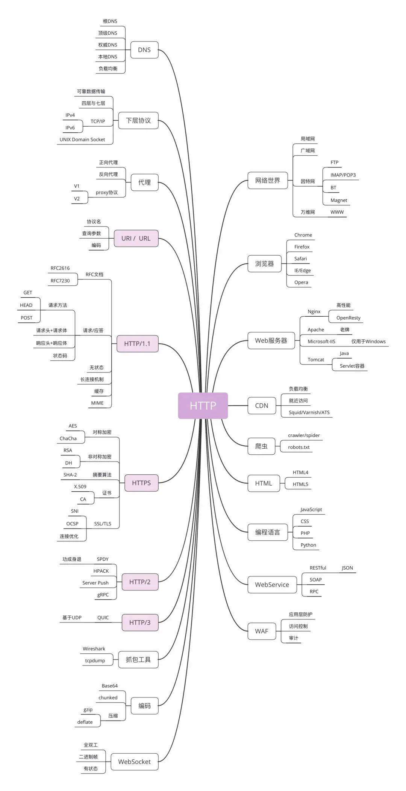
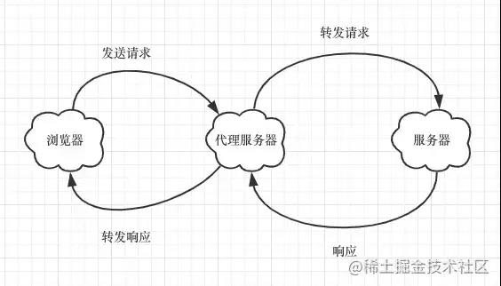

- [一、浏览器缓存](#一浏览器缓存)
  - [2. webpack 缓存指南](#2-webpack-缓存指南)
  - [3. 清除缓存](#3-清除缓存)
- [二、请求](#二请求)
  - [1. pv和uv的区别](#1-pv和uv的区别)
  - [2. Axios的Post请求传参的两种方式](#2-axios的post请求传参的两种方式)
  - [3. encodeURIComponent](#3-encodeuricomponent)
- [三、跨域](#三跨域)
  - [1. 浏览器的同源策略：协议、域名、端口都相同就是同源](#1-浏览器的同源策略协议域名端口都相同就是同源)
  - [2. CORS（Cross-Origin Resource Sharing）的全称叫 跨域资源共享](#2-corscross-origin-resource-sharing的全称叫-跨域资源共享)
  - [3. Nginx 反向代理](#3-nginx-反向代理)
  - [4. Node 中间件代理](#4-node-中间件代理)
- [四、cdn](#四cdn)
- [五、cookie](#五cookie)
  - [1. HttpOnly](#1-httponly)
  - [2. Domain](#2-domain)
  - [3. SameSite](#3-samesite)
  - [4. Expires / Max-Age](#4-expires--max-age)
  - [5. js获取cookie](#5-js获取cookie)
- [六、优化相关](#六优化相关)
  - [1. Web 性能优化：控制关键请求的优先级](#1-web-性能优化控制关键请求的优先级)
- [七、安全](#七安全)
  - [1. Content-Security-Policy](#1-content-security-policy)


## 一、浏览器缓存

### 2. [webpack 缓存指南](https://webpack.docschina.org/guides/caching/)
### 3. 清除缓存
- [vue打包优化3：hash解决浏览器缓存](https://www.jianshu.com/p/822af1648831)
- 清除浏览器缓存的几种方法：
> - 修改html入口文件
```html
<meta http-equiv="pragram" content="no-cache">
<meta http-equiv="cache-control" content="no-cache, no-store, must-revalidate">
<meta http-equiv="expires" content="0">
```
> - 修改nginx
```xml
## 如果是部署在nginx上，在nginx的配置文件 nginx.config添加：
location = /index.html {
  add_header Cache-Control "no-cache, no-store";
}
## 或者设置expires为0

## 如果是用nginx做反向代理的：
location = /xx（xx为你的代理的项目名） {
  add_header Cache-Control "no-cache, no-store";
}

## 如果nginx上有 proxy_cache 的配置，也考虑删掉，这是nginx的服务器缓存
```
> - 修改构建配置文件：output的filename和chunkFilename加上时间戳

## 二、请求
### 1. pv和uv的区别
PV具体是指网站的是页面浏览量或者点击量，页面被刷新一次就计算一次，UV指访问网站的一台电脑客户端为一个访客。UV访客的统计是24小时内相同的客户端只被计算一次。一个UV可以用很多PV，一个PV也只能对应一个IP。PV是和IP的数量是成正比的，因为页面被刷新一次那么PV就会被记录一次，所以IP越多，说明网站的PV数据也就随之增多。但是需要注意的是PV并不是网站的页面的访问者数量，而是网站被访问的页面数量。因为一个访问者可以多次刷新页面，增加PV数量。

### 2. Axios的Post请求传参的两种方式
:::tip
[Axios](https://axios-http.com/)是一个基于 promise 的网络请求库，可以用于浏览器和 node.js
:::

- [Axios的Post请求传参的两种方式](https://www.jianshu.com/p/41d248172028)

- [ajax post请求怎么传参_怎么让axios发送json格式的请求数据？](https://blog.csdn.net/weixin_31236935/article/details/112481242)

- 表单 Form Data
- json字符串 Request Payload

### 3. [encodeURIComponent](https://developer.mozilla.org/zh-CN/docs/Web/JavaScript/Reference/Global_Objects/encodeURIComponent)
> 访问链接上带参为啥需要用encodeURIComponent？
> - 比如要访问的链接是：`https://xxx/aaa/bbb?a={b:1}` 服务端渲染，根据链接上的路由/aaa/bbb到服务端controller的方法，这个时候这个方法接参接不到
```js
// 改成如下就能正确接到参数
`https://xxx/aaa/bbb?a=${encodeURIComponent({b:1})}`
```

4. timeout of xxx
当axios设置了[timeout](https://axios-http.com/zh/docs/req_config)，超时的情况有以下几种：
- 后端在部署时前端有请求
- 请求到了后端，后端有异常导致本次请求超时
- 请求没到后端(拦截器日志都没打印出来说明没到后端)，比如后端服务只允许企业内网访问，当用户断开了内网自动连接了手机热点等非内部网络时，请求一直pending，超出设置的值后请求变为canceled，报错timeout of xxx

## 三、跨域
- [用最简单的方式讲清楚常见的几种跨域解决方案](https://mp.weixin.qq.com/s/BUROGy6x-o37TPWHfLpwpQ)
### 1. 浏览器的同源策略：协议、域名、端口都相同就是同源
不同源的影响：
- cookie、local storage、indexdb等存储性内容无法读取
- dom节点无法访问
- ajax请求发出去了，但是响应被浏览器拦截了。XXX has been blocked by CORS policy: No 'Access-Control-Allow-Origin' header is present on the requested resource.

### 2. CORS（Cross-Origin Resource Sharing）的全称叫 跨域资源共享
- 跨域的请求其实是发出去了的，只不过被浏览器给拦截了，因为不安全，其实就是服务器不允许，服务器允许了就安全了。
- CORS 实现的原理：使用额外的 HTTP 头来告诉浏览器，让运行在某一个 origin 上的 Web 应用允许访问来自不同源服务器上的指定的资源。
> - CORS 需要浏览器和服务器同时支持，整个 CORS 的通信过程，都是浏览器自动完成。怎么个自动法 ？简单来说，浏览器一旦发现请求是一个跨域请求，首先会判断请求的类型，如果是简单请求，会在请求头中增加一个 Origin 字段，表示这次请求是来自哪一个源。而服务器接受到请求后，会返回一个响应，响应头中会包含一个叫 Access-Control-Allow-Origin 的字段，它的值要么包含由 Origin 首部字段所指明的域名，要么是一个 "*"，表示接受任意域名的请求。如果响应头中没有这个字段，就说明当前源不在服务器的许可范围内，浏览器就会报错。
> - 如果是非简单请求，会在正式通信之前，发送一个预检请求（preflight），目的在于询问服务器，当前网页所在的域名是否在服务器的许可名单之中，以及可以使用哪些 HTTP 动词和头信息字段，只有得到肯定答复，浏览器才会发出正式的请求，否则就报错。你可能发现我们在日常的开发中，会看到很多使用 OPTION 方法发起的请求，它其实就是一个预检请求。
> - 哪些是简单请求，哪些是非简单请求 ？不会触发 CORS 预检的，就是简单请求。哪些请求不会触发预检 ？使用以下方法之一：GET, HEAD, POST,并且 Content-Type 的值仅限于下列三者之一：text/plain、multipart/form-data、application/x-www-form-urlencoded。不符合上述条件的就是非简单请求。
> - 实现 CORS 的关键是服务器，只要服务器实现了 CORS 的相关接口，就可以实现跨域。

### 3. Nginx 反向代理
- 同源策略限制的是浏览器向服务器发送跨域请求需要遵循的标准。那如果是服务器向服务器发送跨域请求呢？答案当然是，不受浏览器的同源策略限制。
- 利用这个思路，我们就可以搭建一个代理服务器，接受客户端请求，然后将请求转发给服务器，拿到响应后，再将响应转发给客户端。

```xml
# nginx.config
# ...
server {
  listen       80;
  server_name  www.domain1.com;
  location / {
    proxy_pass   http://www.domain2.com:8080;  #反向代理
    proxy_cookie_domain www.domain2.com www.domain1.com; #修改cookie里域名
    index  index.html index.htm;

    # 当用 webpack-dev-server 等中间件代理接口访问 nignx 时，此时无浏览器参与，故没有同源限制，下面的跨域配置可不启用
    add_header Access-Control-Allow-Origin *;
    add_header Access-Control-Allow-Credentials true;
    # ...
  }
}
```

### 4. Node 中间件代理
- 实现的原理和nginx代理服务器的原理一样。需要注意的是，浏览器向代理服务器请求时仍然遵循同源策略，别忘了在 Node 层通过 CORS 做跨域处理。
```js
const https = require('https')
// 接受客户端请求
const sever = https.createServer((req, res) => {
  ...
  const { method, headers } = req
  // 设置 CORS 允许跨域
  res.writeHead(200, {
    'Access-Control-Allow-Origin': '*',
    'Access-Control-Allow-Methods': '*',
    'Access-Control-Allow-Headers': 'Content-Type',
    ...
  })
  // 请求服务器
  const proxy = https.request({ host: 'xxx', method, headers, ...}, response => {
    let body = ''
    response.on('data', chunk => { body = body + chunk })
    response.on('end', () => {
      // 响应结果转发给客户端
      res.end(body)
    })
  })
  // 结束请求
  proxy.end()
})
```

## 四、cdn

## 五、cookie
### 1. HttpOnly
### 2. Domain
### 3. SameSite
### 4. Expires / Max-Age
### 5. js获取cookie
```js
const getCookie = (cookieName: string) => {
  const cookies = document.cookie;
  const name = cookieName + "=";
  var cookieArray = cookies.split(';');
  for (let i=0; i<cookieArray.length; i++) {
    let cookie = cookieArray[i].trim();
    if (cookie.indexOf(name) == 0) return cookie.substring(name.length,cookie.length);
  }
  return "";
}
```

## 六、优化相关
### 1. [Web 性能优化：控制关键请求的优先级](https://mp.weixin.qq.com/s/P63LEMaXLMyWGYVdLiWxZw)

## 七、安全
### 1. [Content-Security-Policy](https://developer.mozilla.org/zh-CN/docs/Web/HTTP/Headers/Content-Security-Policy)
> 示例: 禁用不安全的内联/动态执行, 只允许通过 https加载这些资源 (images, fonts, scripts, etc.)
```markdown
// header
Content-Security-Policy: default-src https:
// meta tag
<meta http-equiv="Content-Security-Policy" content="default-src https:">
```