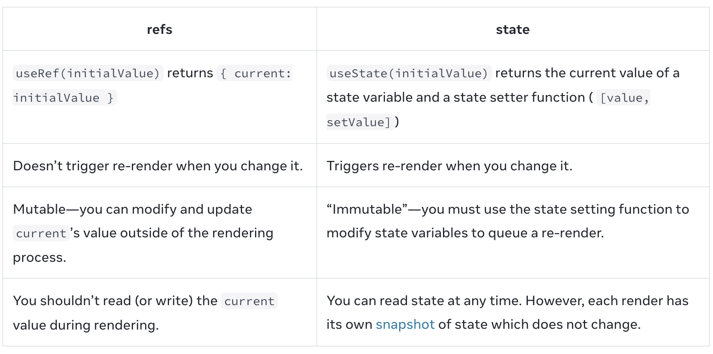

[React 内置 Hooks](https://zh-hans.react.dev/reference/react/hooks)

## State Hooks
### `useState`
:::tip
[How to store and update arrays in React useState hook](https://www.codingdeft.com/posts/react-usestate-array/)
:::

#### `setState`传入函数与非函数的区别
在 React 中，`setState` 可以接受一个新的状态值或一个返回新状态值的函数。这两种方式有一些重要的区别，特别是在处理异步状态更新时。

##### 传入非函数值

当你直接传入一个非函数值（例如一个对象或基本类型值）时，`setState` 会将该值作为新的状态。

```jsx
import React, { useState } from 'react';

function Counter() {
  const [count, setCount] = useState(0);

  const increment = () => {
    setCount(count + 1);
  };

  return (
    <div>
      <p>Count: {count}</p>
      <button onClick={increment}>Increment</button>
    </div>
  );
}

export default Counter;
```

在这个示例中，`setCount(count + 1)` 直接将 `count + 1` 作为新的状态值。

##### 传入函数

当你传入一个函数时，React 会将当前的状态值作为参数传递给这个函数，并使用函数的返回值作为新的状态。这种方式在需要基于当前状态计算新状态时非常有用，尤其是在处理异步状态更新时。

```jsx
import React, { useState } from 'react';

function Counter() {
  const [count, setCount] = useState(0);

  const increment = () => {
    setCount(prevCount => prevCount + 1);
  };

  return (
    <div>
      <p>Count: {count}</p>
      <button onClick={increment}>Increment</button>
    </div>
  );
}

export default Counter;
```

在这个示例中，`setCount(prevCount => prevCount + 1)` 使用了一个函数，该函数接收当前的状态值 `prevCount` 并返回新的状态值 `prevCount + 1`。

##### 区别和使用场景

1. **直接传入值**：
   - 简单且直观，适用于不依赖当前状态计算新状态的情况。
   - 适用于状态更新是同步的情况。

2. **传入函数**：
   - 更加灵活，适用于需要基于当前状态计算新状态的情况。
   - 适用于状态更新是异步的情况，确保状态更新的正确性。
   - 避免了由于异步更新导致的状态不一致问题。

假设我们有一个按钮，每次点击时会增加计数器的值。如果用户快速点击按钮多次，直接传入值的方式可能会导致状态更新不正确。

以下示例中，快速点击按钮可能会导致计数器的值不正确，因为 `setCount(count + 1)` 两次调用都基于相同的 `count` 值。
```jsx
import React, { useState } from 'react';

function Counter() {
  const [count, setCount] = useState(0);

  const increment = () => {
    setCount(count + 1);
    setCount(count + 1);
  };

  return (
    <div>
      <p>Count: {count}</p>
      <button onClick={increment}>Increment</button>
    </div>
  );
}

export default Counter;
```

以下示例中，`setCount(prevCount => prevCount + 1)` 确保每次状态更新都是基于最新的状态值，因此计数器的值会正确增加。
```jsx
import React, { useState } from 'react';

function Counter() {
  const [count, setCount] = useState(0);

  const increment = () => {
    setCount(prevCount => prevCount + 1);
    setCount(prevCount => prevCount + 1);
  };

  return (
    <div>
      <p>Count: {count}</p>
      <button onClick={increment}>Increment</button>
    </div>
  );
}

export default Counter;
```

#### `useState`怎么区分不同的`state`？
调用useState时，只传了state的初始值，并没有传是哪个state的标识，它是怎么知道返回哪个state variables的？
- 答案是：Hooks 在同一组件的每个渲染器上都依赖于稳定的调用顺序。Hooks rely on a stable call order on every render of the same component. 因为遵循“只在顶层调用 Hooks”的规则(而不是在某个函数内调用useState()等hooks)，那么Hooks 将总是以相同的顺序被调用。
- 不在顶层调用Hooks会报错：Rendered fewer hooks than expected. This may be caused by an accidental early return statement. 必须无条件地且始终以相同的顺序调用 Hooks！
```jsx live
function FeedbackForm() {
  const [isSent, setIsSent] = useState(false);
  if (isSent) {
    return <h1>Thank you!</h1>;
  } else {
    // eslint-disable-next-line
    const [message, setMessage] = useState('');
    return (
      <form onSubmit={e => {
        e.preventDefault();
        alert(`Sending: "${message}"`);
        setIsSent(true);
      }}>
        <textarea
          placeholder="Message"
          value={message}
          onChange={e => setMessage(e.target.value)}
        />
        <br />
        <button type="submit">Send</button>
      </form>
    );
  }
}
```
- 在内部，React 为每个组件保存一个数组用来存放状态对。
- 下面这个示例**简单阐述useState是怎么工作的**：
```js
let componentHooks = []; // 存放[state,setState]的数组,本例：[[0, setState],[false, setState]]
let currentHookIndex = 0;

// How useState works inside React (simplified).
function useState(initialState) {
  let pair = componentHooks[currentHookIndex];
  if (pair) {
    // This is not the first render, so the state pair already exists.
    // Return it and prepare for next Hook call.
    currentHookIndex++;
    return pair;
  }

  // This is the first time we're rendering, so create a state pair and store it.
  pair = [initialState, setState]; // 在堆内存中创建了一个数组，变量pair存储了该数组在堆内存中的地址

  function setState(nextState) { // 是一个闭包。闭包是由函数以及声明该函数的词法环境组合而成的，该环境包含了这个闭包创建时作用域内的任何局部变量。
    // When the user requests a state change, put the new value into the pair.
    pair[0] = nextState;
    updateDOM();
  }

  // Store the pair for future renders and prepare for the next Hook call.下次渲染时调用useState()
  componentHooks[currentHookIndex] = pair; // componentHooks[currentHookIndex] 也存储了数组在堆内存中的地址
  currentHookIndex++;
  return pair;
}

function Gallery() {
  // Each useState() call will get the next pair.
  const [index, setIndex] = useState(0);
  console.log(index) // setIndex会再次执行Gallery()，此时index（重新创建了变量index）是最新的，但是setIndex执行后立即log的index的值还是上次的（这里应该怎么理解？--->看下面的“close over”，还是闭包的影响）
  const [showMore, setShowMore] = useState(false);
  /**
   * 1. 调用外层的updateDOM进行初次渲染，currentHookIndex置为0，然后调用Gallery()
   * 2. 按顺序先执行useState(0)：创建pair变量（pair = componentHooks[0]），设置pair为 [0, setState]，componentHooks[0] = pair，currentHookIndex++，返回 [0, function setState(nextState) { pair[0]=nextState; updateDOM(); }]，将 0 赋值给index，将 function setState 赋值给setIndex
   * 3. 然后执行useState(false)：创建pair变量（pair = componentHooks[1]），设置pair为 [false, setState]，componentHooks[1] = pair，currentHookIndex++，返回 [false, function setState(nextState) { pair[0]=nextState; updateDOM(); }]，将 false 赋值给showMore，将 function setState 赋值给setShowMore
   * 
   * componentHooks：[[0, setState], [false, setState]]
   */

  function handleNextClick() {
    setIndex(index + 1);
    /**
     * 调用setState(1)
     * 结果：
     * 1. 改变pair的值为[1,setState]，这个pair与componentHooks[0]的指向一致，所以componentHooks[0]为[1,setState]
     * 2. 调用updateDOM(); currentHookIndex置为0; 调用Gallery()
     * 3. 按顺序调用useState(0)，此时componentHooks[0]有值，所以 currentHookIndex++，然后返回pair，即[1,setState]
     * 4. 按顺序调用useState(false)，此时currentHookIndex为1，componentHooks[1]有值，所以 currentHookIndex++，然后返回pair，即[false,setState]
     * 
     * componentHooks：[[1,setState], [false,setState]]
     */
    console.log(index) // index的值还是上次的
  }

  function handleMoreClick() {
    setShowMore(!showMore);
    /**
     * 调用setState(true)
     * 结果：
     * 1. 改变pair的值为[true,setState]，这个pair与componentHooks[1]的指向一致，所以componentHooks[1]为[true,setState]
     * 2. 调用updateDOM(); currentHookIndex置为0; 调用Gallery()
     * 3. 按顺序调用useState(0)，此时componentHooks[0]有值，所以 currentHookIndex++，然后返回pair，即[1,setState]
     * 4. 按顺序调用useState(false)，此时currentHookIndex为1，componentHooks[1]有值，所以 currentHookIndex++，然后返回pair，即[true,setState]
     * 
     * componentHooks：[[1,setState], [true,setState]]
     */
  }

  let sculpture = sculptureList[index];
  // This example doesn't use React, so return an output object instead of JSX.
  return {
    onNextClick: handleNextClick,
    onMoreClick: handleMoreClick,
    header: `${sculpture.name} by ${sculpture.artist}`,
    counter: `${index + 1} of ${sculptureList.length}`,
    more: `${showMore ? 'Hide' : 'Show'} details`,
    description: showMore ? sculpture.description : null,
    imageSrc: sculpture.url,
    imageAlt: sculpture.alt
  };
}

function updateDOM() {
  // Reset the current Hook index before rendering the component.
  currentHookIndex = 0;
  let output = Gallery();

  // Update the DOM to match the output.
  // This is the part React does for you.
  nextButton.onclick = output.onNextClick;
  header.textContent = output.header;
  moreButton.onclick = output.onMoreClick;
  moreButton.textContent = output.more;
  image.src = output.imageSrc;
  image.alt = output.imageAlt;
  if (output.description !== null) {
    description.textContent = output.description;
    description.style.display = '';
  } else {
    description.style.display = 'none';
  }
}

let nextButton = document.getElementById('nextButton');
let header = document.getElementById('header');
let moreButton = document.getElementById('moreButton');
let description = document.getElementById('description');
let image = document.getElementById('image');
let sculptureList = [{
  name: 'Homenaje a la Neurocirugía',
  artist: 'Marta Colvin Andrade',
  description: 'Although Colvin is predominantly known for abstract themes that allude to pre-Hispanic symbols, this gigantic sculpture, an homage to neurosurgery, is one of her most recognizable public art pieces.',
  url: 'https://i.imgur.com/Mx7dA2Y.jpg',
  alt: 'A bronze statue of two crossed hands delicately holding a human brain in their fingertips.'  
}, {
  name: 'Floralis Genérica',
  artist: 'Eduardo Catalano',
  description: 'This enormous (75 ft. or 23m) silver flower is located in Buenos Aires. It is designed to move, closing its petals in the evening or when strong winds blow and opening them in the morning.',
  url: 'https://i.imgur.com/ZF6s192m.jpg',
  alt: 'A gigantic metallic flower sculpture with reflective mirror-like petals and strong stamens.'
}, {
  name: 'Eternal Presence',
  artist: 'John Woodrow Wilson',
  description: 'Wilson was known for his preoccupation with equality, social justice, as well as the essential and spiritual qualities of humankind. This massive (7ft. or 2,13m) bronze represents what he described as "a symbolic Black presence infused with a sense of universal humanity."',
  url: 'https://i.imgur.com/aTtVpES.jpg',
  alt: 'The sculpture depicting a human head seems ever-present and solemn. It radiates calm and serenity.'
}, {
  name: 'Moai',
  artist: 'Unknown Artist',
  description: 'Located on the Easter Island, there are 1,000 moai, or extant monumental statues, created by the early Rapa Nui people, which some believe represented deified ancestors.',
  url: 'https://i.imgur.com/RCwLEoQm.jpg',
  alt: 'Three monumental stone busts with the heads that are disproportionately large with somber faces.'
}, {
  name: 'Blue Nana',
  artist: 'Niki de Saint Phalle',
  description: 'The Nanas are triumphant creatures, symbols of femininity and maternity. Initially, Saint Phalle used fabric and found objects for the Nanas, and later on introduced polyester to achieve a more vibrant effect.',
  url: 'https://i.imgur.com/Sd1AgUOm.jpg',
  alt: 'A large mosaic sculpture of a whimsical dancing female figure in a colorful costume emanating joy.'
}, {
  name: 'Ultimate Form',
  artist: 'Barbara Hepworth',
  description: 'This abstract bronze sculpture is a part of The Family of Man series located at Yorkshire Sculpture Park. Hepworth chose not to create literal representations of the world but developed abstract forms inspired by people and landscapes.',
  url: 'https://i.imgur.com/2heNQDcm.jpg',
  alt: 'A tall sculpture made of three elements stacked on each other reminding of a human figure.'
}, {
  name: 'Cavaliere',
  artist: 'Lamidi Olonade Fakeye',
  description: "Descended from four generations of woodcarvers, Fakeye's work blended traditional and contemporary Yoruba themes.",
  url: 'https://i.imgur.com/wIdGuZwm.png',
  alt: 'An intricate wood sculpture of a warrior with a focused face on a horse adorned with patterns.'
}, {
  name: 'Big Bellies',
  artist: 'Alina Szapocznikow',
  description: "Szapocznikow is known for her sculptures of the fragmented body as a metaphor for the fragility and impermanence of youth and beauty. This sculpture depicts two very realistic large bellies stacked on top of each other, each around five feet (1,5m) tall.",
  url: 'https://i.imgur.com/AlHTAdDm.jpg',
  alt: 'The sculpture reminds a cascade of folds, quite different from bellies in classical sculptures.'
}, {
  name: 'Terracotta Army',
  artist: 'Unknown Artist',
  description: 'The Terracotta Army is a collection of terracotta sculptures depicting the armies of Qin Shi Huang, the first Emperor of China. The army consisted of more than 8,000 soldiers, 130 chariots with 520 horses, and 150 cavalry horses.',
  url: 'https://i.imgur.com/HMFmH6m.jpg',
  alt: '12 terracotta sculptures of solemn warriors, each with a unique facial expression and armor.'
}, {
  name: 'Lunar Landscape',
  artist: 'Louise Nevelson',
  description: 'Nevelson was known for scavenging objects from New York City debris, which she would later assemble into monumental constructions. In this one, she used disparate parts like a bedpost, juggling pin, and seat fragment, nailing and gluing them into boxes that reflect the influence of Cubism’s geometric abstraction of space and form.',
  url: 'https://i.imgur.com/rN7hY6om.jpg',
  alt: 'A black matte sculpture where the individual elements are initially indistinguishable.'
}, {
  name: 'Aureole',
  artist: 'Ranjani Shettar',
  description: 'Shettar merges the traditional and the modern, the natural and the industrial. Her art focuses on the relationship between man and nature. Her work was described as compelling both abstractly and figuratively, gravity defying, and a "fine synthesis of unlikely materials."',
  url: 'https://i.imgur.com/okTpbHhm.jpg',
  alt: 'A pale wire-like sculpture mounted on concrete wall and descending on the floor. It appears light.'
}, {
  name: 'Hippos',
  artist: 'Taipei Zoo',
  description: 'The Taipei Zoo commissioned a Hippo Square featuring submerged hippos at play.',
  url: 'https://i.imgur.com/6o5Vuyu.jpg',
  alt: 'A group of bronze hippo sculptures emerging from the sett sidewalk as if they were swimming.'
}];

// Make UI match the initial state.
updateDOM();

```
[查看执行结果](https://codesandbox.io/s/stupefied-microservice-bdv0tp?file=/index.js)
:::info
- [只有1个state的例子](https://replit.com/@fqishuai/Jian-Yi-Ban-useState#script.js)
- 对闭包的认识不够啊!
> [闭包例子](https://replit.com/@fqishuai/Bi-Bao#script.js)

- setIndex会再次执行Gallery()，此时index（重新创建了变量index）是最新的，但是setIndex执行后立即log的index的值还是上次的，这是因为event handler functions “[close over](https://developer.mozilla.org/en-US/docs/Web/JavaScript/Closures)” any variables declared while rendering.事件处理程序函数“关闭”了渲染时声明的任何变量。
```jsx live
// 可以在浏览器的控制台查看console.log
function Form() {
  let firstName = '';
  let lastName = '';

  function handleFirstNameChange(e) {
    console.log('e.target.value::', e.target.value)
    firstName = e.target.value;
    console.log('firstName::', firstName)
  }

  function handleLastNameChange(e) {
    lastName = e.target.value;
  }

  function handleReset() {
    firstName = '';
    lastName = '';
  }

  return (
    <form onSubmit={e => e.preventDefault()}>
      <input
        placeholder="First name"
        value={firstName}
        onChange={handleFirstNameChange}
      />
      <input
        placeholder="Last name"
        value={lastName}
        onChange={handleLastNameChange}
      />
      <h1>Hi, {firstName} {lastName}</h1>
      <button onClick={handleReset}>Reset</button>
    </form>
  );
}
```
```jsx live
function Form() {
  let [firstName,setFirstName] = useState('');
  let [lastName,setLastName] = useState('');

  function handleFirstNameChange(e) {
    console.log('e.target.value::', e.target.value)
    setFirstName(e.target.value);
    console.log('firstName::', firstName)
  }

  function handleLastNameChange(e) {
    setLastName(e.target.value);
  }

  function handleReset() {
    setFirstName('');
    setLastName('');
  }

  return (
    <form onSubmit={e => e.preventDefault()}>
      <input
        placeholder="First name"
        value={firstName}
        onChange={handleFirstNameChange}
      />
      <input
        placeholder="Last name"
        value={lastName}
        onChange={handleLastNameChange}
      />
      <h1>Hi, {firstName} {lastName}</h1>
      <button onClick={handleReset}>Reset</button>
    </form>
  );
}
```
:::

### `useReducer`
在组件的顶层作用域调用 `useReducer` 以创建一个用于管理状态的 `reducer`。

语法：`const [state, dispatch] = useReducer(reducer, initialArg, init?)`
- `reducer`：用于更新 `state` 的纯函数。参数为 `state` 和 `action`，返回值是更新后的 `state`。`state` 与 `action` 可以是任意合法值。（`action` 可以是任意类型，不过通常至少是一个存在 `type` 属性的对象。也就是说它需要携带计算新的 `state` 值所必须的数据。）
  ```js
  function reducer(state, action) {
    // ...
  }
  ```
- `initialArg`：用于初始化 `state` 的任意值。初始值的计算逻辑取决于接下来的 `init` 参数。
- 可选参数 `init`：用于计算初始值的函数。如果存在，使用 `init(initialArg)` 的执行结果作为初始值，否则使用 `initialArg`。

`useReducer` 返回一个由两个值组成的数组：
1. 当前的 `state`。初次渲染时，它是 `init(initialArg)` 或 `initialArg` （如果没有 `init` 函数）。
2. `dispatch` 函数。它需要传入一个 `action` 作为参数（可以是任意类型的值。通常来说 `action` 是一个对象，其中 `type` 属性标识类型，其它属性携带额外信息。），用于更新 `state` 并触发组件的重新渲染。`dispatch` 函数没有返回值。**React 会把当前的 `state` 和这个 `action` 一起作为参数传给 `reducer` 函数，然后 `reducer` 计算并返回新的 `state`，最后 React 保存新的 `state`，并使用它渲染组件和更新 UI。**

示例：
```jsx
import { useReducer } from 'react';

function reducer(state, action) {
  if (action.type === 'incremented_age') {
    return {
      age: state.age + 1
    };
  }
  throw Error('Unknown action.');
}

export default function Counter() {
  const [state, dispatch] = useReducer(reducer, { age: 42 });

  return (
    <>
      <button onClick={() => {
        dispatch({ type: 'incremented_age' })
      }}>
        Increment age
      </button>
      <p>Hello! You are {state.age}.</p>
    </>
  );
}
```

:::tip
- `dispatch` 函数 是为下一次渲染而更新 `state`。因此在调用 `dispatch` 函数后读取 `state` 并不会拿到更新后的值，也就是说只能获取到调用前的值。

- 如果你提供的新值与当前的 `state` 相同（使用 `Object.is` 比较），React 会 跳过组件和子组件的重新渲染，这是一种优化手段。虽然在跳过重新渲染前 React 可能会调用你的组件，但是这不应该影响你的代码。

- React 会批量更新 `state`。`state` 会在 所有事件函数执行完毕 并且已经调用过它的 `set` 函数后进行更新，这可以防止在一个事件中多次进行重新渲染。如果在访问 DOM 等极少数情况下需要强制 React 提前更新，可以使用 `flushSync`。

- `useReducer` 和 `useState` 非常相似，但是它可以让你把状态更新逻辑从事件处理函数中移动到组件外部。[对比 `useState` 和 `useReducer`](https://zh-hans.react.dev/learn/extracting-state-logic-into-a-reducer#comparing-usestate-and-usereducer)
:::

:::warning
`state` 是只读的。即使是对象或数组也不要尝试修改它：

```js
function reducer(state, action) {
  switch (action.type) {
    case 'incremented_age': {
      // 🚩 不要像下面这样修改一个对象类型的 state：
      state.age = state.age + 1;
      return state;
    }
```

正确的做法是返回新的对象：

```
function reducer(state, action) {
  switch (action.type) {
    case 'incremented_age': {
      // ✅ 正确的做法是返回新的对象
      return {
        ...state,
        age: state.age + 1
      };
    }
```
:::

#### 避免重新创建初始值 
```jsx
function createInitialState(username) {
  // ...
}

function TodoList({ username }) {
  const [state, dispatch] = useReducer(reducer, createInitialState(username));
  // ...
```

虽然 `createInitialState(username)` 的返回值只用于初次渲染，但是在每一次渲染的时候都会被调用。如果它创建了比较大的数组或者执行了昂贵的计算就会浪费性能。

你可以通过给 `useReducer` 的第三个参数传入 初始化函数 来解决这个问题：
```jsx
function createInitialState(username) {
  // ...
}

function TodoList({ username }) {
  const [state, dispatch] = useReducer(reducer, username, createInitialState);
  // ...
```

需要注意的是你传入的参数是 `createInitialState` 这个 函数自身，而不是执行 `createInitialState()` 后的返回值。这样传参就可以保证初始化函数不会再次运行。

在上面这个例子中，`createInitialState` 有一个 `username` 参数。如果初始化函数不需要参数就可以计算出初始值，可以把 `useReducer` 的第二个参数改为 `null`。

## Context Hooks
### `useContext`

## Ref Hooks
:::tip
- Refs 让组件保存一些不用于渲染的信息，例如 DOM节点或超时ID。与state不同，更新ref不会重新渲染您的组件。当您希望组件“记住”某些信息，但不希望该信息触发新的渲染时，可以使用 ref。
- ref 可以和 state 一起使用，需要重新渲染的信息使用state存储，不需要重新渲染的使用ref
- **Don’t read or write ref.current during rendering.** 在 React 中，每次更新都分为两个阶段(render、commit)：在渲染期间，React 调用您的组件来确定屏幕上应该显示什么；在提交期间，React 将差异应用于 DOM。一般来说，您不想在渲染期间访问refs。在第一次渲染期间，DOM 节点尚未创建，因此 `ref.current` 将为 `null`，并且在渲染更新的过程中，DOM节点还没有被更新。React 在提交期间设置 `ref.current`，在更新 DOM 之前，React 将受影响的 `ref.current` 值设置为 `null`，更新 DOM 后，React 立即将它们设置为相应的 DOM 节点。[示例: 不同状态时查看ref.current](https://code.juejin.cn/pen/7293051768584273920)
:::
### `useRef`
`useRef` 返回一个这样的对象：
```js
{ 
  current: 0 // 你向 useRef 传入的值
}
```
你可以用 `ref.current` 属性访问该 ref 的当前值。这个值是有意被设置为可变的，意味着你既可以读取它也可以写入它。

1. 使用ref存储不需要重新渲染的信息
```tsx
import { useRef } from 'react';

export default function Counter() {
  let ref = useRef(0);

  function handleClick() {
    ref.current = ref.current + 1;
    alert('You clicked ' + ref.current + ' times!');
  }

  return (
    <button onClick={handleClick}>
      Click me!
    </button>
  );
}
```
`useRef` 返回一个对象，类似：
```js
{ 
  current: 0 // The value you passed to useRef
}
```
```tsx
import { useState, useRef } from 'react';

export default function Stopwatch() {
  const [startTime, setStartTime] = useState(null);
  const [now, setNow] = useState(null);
  const intervalRef = useRef(null);

  function handleStart() {
    setStartTime(Date.now());
    setNow(Date.now());

    clearInterval(intervalRef.current);
    intervalRef.current = setInterval(() => {
      setNow(Date.now());
    }, 10);
  }

  function handleStop() {
    clearInterval(intervalRef.current);
  }

  let secondsPassed = 0;
  if (startTime != null && now != null) {
    secondsPassed = (now - startTime) / 1000;
  }

  return (
    <>
      <h1>Time passed: {secondsPassed.toFixed(3)}</h1>
      <button onClick={handleStart}>
        Start
      </button>
      <button onClick={handleStop}>
        Stop
      </button>
    </>
  );
}
```



2. 使用ref控制DOM
- `<input ref={inputRef}>` tells React to put this `<input>’s` DOM node into `inputRef.current`.
```jsx
import { useRef } from 'react';

export default function Form() {
  const inputRef = useRef(null);

  function handleClick() {
    inputRef.current.focus();
  }

  return (
    <>
      <input ref={inputRef} />
      <button onClick={handleClick}>
        Focus the input
      </button>
    </>
  );
}
```

- ref callback function
  ```jsx
  <div ref={(node) => console.log(node)} />
  ```

  例子：在 map 方法中渲染多个 div 并为每个 div 生成一个对应的 ref
  ```jsx
  function Example() {
    const divRefs = useRef([]);

    return (
      <div>
        {items.map((item, index) => (
          <div
            key={index}
            ref={(ele) => (divRefs.current[index] = ele)}
          >
            {item}
          </div>
        ))}
      </div>
    )
  }
  ```

  :::tip
    - Do not return anything from the ref callback.
    
    - When the `<div>` DOM node is added to the screen, React will call your ref callback with the DOM node as the argument. When that `<div>` DOM node is removed, React will call your ref callback with `null`.(当 `<div>` DOM 节点添加到屏幕上时，React 将以 DOM 节点作为参数调用您的 ref 回调。当该 `<div>` DOM 节点被删除时，React 将使用 `null` 调用您的 ref 回调。)
    
    - React will also call your ref callback whenever you pass a different ref callback. In the above example, `(node) => { ... }` is a different function on every render. When your component re-renders, the previous function will be called with `null` as the argument, and the next function will be called with the DOM node.(每当您传递不同的 ref 回调时，React 也会调用您的 ref 回调。在上面的示例中， `(node) => { ... }` 在每次渲染上都是不同的函数。当您的组件重新渲染时，将使用 `null` 作为参数调用前一个函数，并使用 DOM 节点调用下一个函数。)

    - 参数`node`: A DOM node or `null`. React will pass you the DOM node when the ref gets attached, and `null` when the ref gets detached. Unless you pass the same function reference for the ref callback on every render, the callback will get temporarily detached and re-attached during every re-render of the component.(当引用被附加时，React 会向你传递 DOM 节点，当引用被分离时，React 会传递给你 null。除非您在每次渲染时为 ref 回调传递相同的函数引用，否则回调将在组件的每次重新渲染期间暂时分离并重新附加。)
  :::

  [示例: ref callback function](https://code.juejin.cn/pen/7290371092995440700)

### `useImperativeHandle`
自定义组件使用ref时，使用`useImperativeHandle`自定义接收到的ref可以使用的方法

语法：`useImperativeHandle(ref, createHandle, dependencies?)`
- `ref`是 `forwardRef`函数的第二个参数
- `createHandle`函数没有参数，通常返回一个对象，包含要暴露的方法
- 可选的 `dependencies`：函数 `createHandle` 代码中所用到的所有反应式的值的列表。反应式的值包含 `props`、`state`和其他所有直接在你组件体内声明的变量和函数。该列表的长度必须是一个常数项，并且必须按照 `[dep1, dep2, dep3]` 的形式罗列各依赖项。React 会使用 `Object.is` 来比较每一个依赖项与其对应的之前值。如果一次重新渲染导致某些依赖项发生了改变，或你没有提供这个参数列表，你的函数 `createHandle` 将会被重新执行，而新生成的句柄则会被分配给 ref。
- `useImperativeHandle` 返回 `undefined`

```jsx
import { forwardRef, useRef, useImperativeHandle } from 'react';

const MyInput = forwardRef((props, forwardedRef) => {
  const realInputRef = useRef(null); // 保存实际的 input DOM 节点
  useImperativeHandle(forwardedRef, () => ({
    // 只暴露focus()方法
    focus() {
      realInputRef.current.focus();
    },
  }));
  return <input {...props} ref={realInputRef} />;
});

export default function Form() {
  const inputRef = useRef(null);

  function handleClick() {
    inputRef.current.focus(); // 此时 inputRef.current 引用的不是 DOM node，而是 useImperativeHandle调用中创建的自定义对象
  }

  return (
    <>
      <MyInput ref={inputRef} />
      <button onClick={handleClick}>
        Focus the input
      </button>
    </>
  );
}
```

## Effect Hooks
### `useEffect`
#### 组件卸载时使用
在 React 中，当组件卸载时，你可以使用 `useEffect` 钩子来执行清理操作。`useEffect` 钩子可以返回一个清理函数，这个清理函数会在组件卸载时执行。

以下是一个示例，展示如何在组件卸载时执行清理操作：

```jsx
import React, { useEffect } from 'react';

const MyComponent = () => {
  useEffect(() => {
    // 组件挂载时执行的操作
    console.log('Component mounted');

    // 返回一个清理函数，组件卸载时执行
    return () => {
      console.log('Component unmounted');
      // 在这里执行清理操作，例如取消订阅、清除计时器等
    };
  }, []); // 空依赖数组，确保只在组件挂载和卸载时执行

  return (
    <div>
      My Component
    </div>
  );
};

export default MyComponent;
```

在这个示例中：

1. `useEffect` 钩子在组件挂载时执行。
2. 返回的清理函数会在组件卸载时执行。
3. 空依赖数组 `[]` 确保 `useEffect` 只在组件挂载和卸载时执行一次。

以下是一个更实际的示例，展示如何在组件卸载时取消订阅和清除计时器：

```jsx
import React, { useEffect, useState } from 'react';

const TimerComponent = () => {
  const [count, setCount] = useState(0);

  useEffect(() => {
    // 设置一个计时器
    const timer = setInterval(() => {
      setCount(prevCount => prevCount + 1);
    }, 1000);

    // 返回一个清理函数，组件卸载时清除计时器
    return () => {
      clearInterval(timer);
      console.log('Timer cleared');
    };
  }, []); // 空依赖数组，确保只在组件挂载和卸载时执行

  return (
    <div>
      Timer: {count}
    </div>
  );
};

export default TimerComponent;
```

在这个示例中：

1. `useEffect` 钩子在组件挂载时设置一个计时器。
2. 返回的清理函数会在组件卸载时清除计时器，防止内存泄漏。

通过这种方式，你可以确保在组件卸载时执行必要的清理操作，保持应用的性能和稳定性。

### `useLayoutEffect`
useLayoutEffect 会损害性能。尽可能首选 useEffect。

### `useInsertionEffect`
useInsertionEffect 适用于 CSS-in-JS 库作者。除非您正在开发 CSS-in-JS 库并且需要一个地方来注入样式，否则您可能需要 useEffect 或 useLayoutEffect。

### `useEffectEvent`
`useEffectEvent` 是 React 18.2 引入的一个实验性 Hook，用于在 `useEffect` 中处理事件处理函数。它的主要作用是确保事件处理函数在依赖项发生变化时不会重新创建，从而提高性能和稳定性。

主要特点:
1. **稳定的引用**：`useEffectEvent` 返回的事件处理函数在组件的整个生命周期内保持稳定的引用，不会因为依赖项的变化而重新创建。
2. **性能优化**：减少不必要的重新渲染和副作用的重新执行，从而提高性能。

使用示例:
```javascript
import { useEffect, useEffectEvent } from 'react';

function MyComponent() {
  const [count, setCount] = useState(0);

  const handleClick = useEffectEvent(() => {
    console.log('Count:', count);
  });

  useEffect(() => {
    document.addEventListener('click', handleClick);
    return () => {
      document.removeEventListener('click', handleClick);
    };
  }, [handleClick]);

  return (
    <div>
      <p>{count}</p>
      <button onClick={() => setCount(count + 1)}>Increment</button>
    </div>
  );
}
```

注意事项:
- `useEffectEvent` 目前是实验性 API，可能会在未来的版本中发生变化。
- 需要确保 React 版本是 18.2 或更高。

通过使用 `useEffectEvent`，可以更好地管理副作用中的事件处理函数，避免不必要的性能开销。

## Performance Hooks
### `useMemo`
`useMemo` 在多次重新渲染中缓存了 `calculateValue` 函数计算的结果直到依赖项的值发生变化。

语法：`useMemo(calculateValue, dependencies)`：
- `calculateValue`：要缓存计算值的函数。**它应该是一个没有任何参数的纯函数，并且可以返回任意类型。**

- `dependencies`：所有在 `calculateValue` 函数中使用的响应式变量组成的数组。响应式变量包括 `props`、`state` 和所有你直接在组件中定义的变量和函数。依赖项数组的长度必须是固定的并且必须写成 `[dep1, dep2, dep3]` 这种形式。React 使用 `Object.is` 将每个依赖项与其之前的值进行比较。

返回值：
- 在初次渲染时，你从 `useMemo` 得到的 值 将会是 `calculateValue` 函数执行的结果。
- 在随后的每一次渲染中，React 将会比较前后两次渲染中的 所有依赖项 是否相同。如果通过 `Object.is` 比较所有依赖项都没有发生变化，那么 `useMemo` 将会返回之前已经计算过的那个值。否则，React 将会重新执行 `calculateValue` 函数并且返回一个新的值。

:::tip
在严格模式下，为了 帮你发现意外的错误，React 将会 调用你的计算函数两次。这只是一个开发环境下的行为，并不会影响到生产环境。如果计算函数是一个纯函数（它本来就应该是），这将不会影响到代码逻辑。其中一次的调用结果将被忽略。
:::
:::warning
`useMemo` 不会让首次渲染更快，它只会帮助你跳过不必要的更新工作。你应该仅仅把 `useMemo` 作为性能优化的手段。如果没有它，你的代码就不能正常工作，那么请先找到潜在的问题并修复它。然后再添加 `useMemo` 以提高性能。
:::

#### 应该在所有地方添加 `useMemo` 吗？
使用 `useMemo` 进行优化仅在少数情况下有价值：
- 你在 `useMemo` 中进行的计算明显很慢，而且它的依赖关系很少改变。

- 将计算结果作为 `props` 传递给包裹在 `memo` 中的组件。当计算结果没有改变时，你会想跳过重新渲染。（如下面的使用场景2的示例）

- 你传递的值稍后用作某些 Hook 的依赖项。例如，也许另一个 `useMemo` 计算值依赖它，或者 `useEffect` 依赖这个值。

在实践中，你可以通过遵循一些原则来避免 `useMemo` 的滥用：
1. 首选本地 `state`，非必要不进行 [状态提升](https://zh-hans.react.dev/learn/sharing-state-between-components)。
   
2. 保持你的 [渲染逻辑纯粹](https://zh-hans.react.dev/learn/keeping-components-pure)。如果重新渲染组件会导致一些问题或产生一些明显的视觉错误，那么它就是组件中的错误！修复错误而不是使用记忆化。
   
3. 避免 [不必要地更新 state 的 Effect](https://zh-hans.react.dev/learn/you-might-not-need-an-effect)。React 应用程序中的大多数性能问题都是由 Effect 创造的更新链引起的，这些更新链导致组件反复重新渲染。
   
4. 尽力 [从 Effect 中移除不必要的依赖项](https://zh-hans.react.dev/learn/removing-effect-dependencies)。例如, 相比于记忆化，在 Effect 内部或组件外部移动某些对象或函数通常更简单。

#### 使用场景1：组件重新渲染时避免函数的重复调用
**默认情况下，React 会在每次重新渲染时重新运行整个组件。**

例如，如果 `TodoList` 更新了 `state` 或从父组件接收到新的 `props`，`filterTodos` 函数将会重新运行。如果计算速度很快，这将不会产生问题。但是，当正在过滤转换一个大型数组，或者进行一些昂贵的计算，而数据没有改变，那么可能希望跳过这些重复计算。
```jsx
function TodoList({ todos, tab, theme }) {
  const visibleTodos = filterTodos(todos, tab);
}
```

如果 `todos` 与 `tab` 都与上次渲染时相同，那么将计算函数包装在 `useMemo` 中，便可以重用已经计算过的 `visibleTodos`。
```jsx
import { useMemo } from 'react';

function TodoList({ todos, tab, theme }) {
  const visibleTodos = useMemo(
    () => filterTodos(todos, tab),
    [todos, tab]
  );
}
```

:::tip
如何衡量计算过程的开销是否昂贵？ 一般来说，除非要创建或循环遍历数千个对象，否则开销可能并不大。可以在控制台来测量花费这上面的时间：
```js
onsole.time('filter array');
const visibleTodos = filterTodos(todos, tab);
console.timeEnd('filter array');
```
:::

#### 使用场景2：结合`memo`避免子组件重新渲染
**默认情况下，当一个组件重新渲染时，React 会递归地重新渲染它的所有子组件。** 
```jsx title="TodoList"
export default function TodoList({ todos, tab, theme }) {
  // 每当 `theme` 发生变化时，`filterTodos` 函数将会重新运行，这将生成一个不同的数组
  const visibleTodos = filterTodos(todos, tab);
  return (
    <div className={theme}>
      {/* 所以List的props永远不会一样，每次都会重新渲染 */}
      <List items={visibleTodos} />
    </div>
  );
}
```

使用 `React.memo` 包裹 `List` 后，如果 `List` 的所有 `props` 都与上次渲染时相同，则 `List` 将跳过重新渲染。
```jsx title="List"
import { memo } from 'react';

function List({ items }) {

}

export default memo(List);
```

但是由于上述 `filterTodos` 函数总是创建一个不同数组，这意味着 `List` 的 `props` 永远不会相同，所以你的 `memo` 优化将不起作用。这就是 `useMemo` 派上用场的地方：
```jsx
export default function TodoList({ todos, tab, theme }) {
  // 告诉 React 在重新渲染之间缓存你的计算结果
  const visibleTodos = useMemo(
    () => filterTodos(todos, tab),
    [todos, tab] // 只要这些依赖项不变
  );
  return (
    <div className={theme}>
      {/* List 也就会接受到相同的 props 并且会跳过重新渲染 */}
      <List items={visibleTodos} />
    </div>
  );
}
```
通过将 `visibleTodos` 的计算函数包裹在 `useMemo` 中，你可以确保它在重新渲染之间具有相同值，直到依赖项发生变化。

#### 使用场景3：防止过于频繁地触发 Effect

### `useCallback`
语法：`useCallback(fn, dependencies)`:
- `fn`：想要缓存的函数。此函数可以接受任何参数并且返回任何值。在初次渲染时，React 将把函数返回给你（而不是调用它！）。当进行下一次渲染时，如果 `dependencies` 相比于上一次渲染时没有改变，那么 React 将会返回相同的函数。否则，React 将返回在最新一次渲染中传入的函数，并且将其缓存以便之后使用。React 不会调用此函数，而是返回此函数。你可以自己决定何时调用以及是否调用。

- `dependencies`：有关是否更新 `fn` 的所有响应式值的一个列表。响应式值包括 `props`、`state`，和所有在你组件内部直接声明的变量和函数。如果你的代码检查工具 配置了 React，那么它将校验每一个正确指定为依赖的响应式值。依赖列表必须具有确切数量的项，并且必须像 `[dep1, dep2, dep3]` 这样编写。React 使用 `Object.is` 比较每一个依赖和它的之前的值。

- 在初次渲染时，在 `useCallback` 处接收的 返回函数 将会是已经传入 `fn` 函数。在之后的渲染中，React 将会使用 `Object.is` 把 当前的依赖 和已传入之前的依赖进行比较。如果没有任何依赖改变，`useCallback` 将会返回与之前一样的函数。否则 `useCallback` 将返回 此次 渲染中传递的函数。

:::tip
除非有特定的理由，React 将不会丢弃已缓存的函数。例如，在开发中，当编辑组件文件时，React 会丢弃缓存。在生产和开发环境中，如果你的组件在初次挂载中暂停，React 将会丢弃缓存。在未来，React 可能会增加更多利用了丢弃缓存机制的特性。例如，如果 React 未来内置了对虚拟列表的支持，那么在滚动超出虚拟化表视口的项目时，抛弃缓存是有意义的。如果你依赖 `useCallback` 作为一个性能优化途径，那么这些对你会有帮助。否则请考虑使用 `state` 变量 或 `ref`。
:::
:::warning
`useCallback` 只应作用于性能优化。如果代码在没有它的情况下无法运行，请找到根本问题并首先修复它，然后再使用 `useCallback`。
:::

#### 使用场景：组件的`props`是函数时避免组件重新渲染
```jsx title="ProductPage.jsx"
function ProductPage({ productId, referrer, theme }) {
  // 每当 theme 改变时，都会生成一个不同的函数
  function handleSubmit(orderDetails) {
    post('/product/' + productId + '/buy', {
      referrer,
      orderDetails,
    });
  }
  
  return (
    <div className={theme}>
      {/* 这将导致 ShippingForm props 永远都不会是相同的，并且每次它都会重新渲染 */}
      <ShippingForm onSubmit={handleSubmit} />
    </div>
  );
}
```

**默认情况下，当一个组件重新渲染时， React 将递归渲染它的所有子组件**，因此每当因 `theme` 更改导致 `ProductPage` 组件重新渲染时，`ShippingForm` 组件也会重新渲染。这对于不需要大量计算去重新渲染的组件来说影响很小。但如果你发现某次重新渲染很慢，你可以将 `ShippingForm` 组件包裹在 `memo` 中。**如果 `props` 和上一次渲染时相同**，那么 `ShippingForm` 组件将跳过重新渲染:
```jsx title="ShippingForm.jsx"
import { memo } from 'react';

const ShippingForm = memo(function ShippingForm({ onSubmit }) {
  // ...
});
```

与字面量对象 `{}` 总是会创建新对象类似，在 JavaScript 中，`function () {}` 或者 `() => {}` 总是会生成不同的函数。这意味着 `ShippingForm` `props` 将永远不会是相同的，所以 `memo` 对性能的优化永远不会生效。而这就是 `useCallback` 起作用的地方：
```jsx title="ProductPage.jsx"
function ProductPage({ productId, referrer, theme }) {
  // 在多次渲染中缓存函数
  const handleSubmit = useCallback((orderDetails) => {
    post('/product/' + productId + '/buy', {
      referrer,
      orderDetails,
    });
  }, [productId, referrer]); // 只要这些依赖没有改变

  return (
    <div className={theme}>
      {/* ShippingForm 就会收到同样的 props 并且跳过重新渲染 */}
      <ShippingForm onSubmit={handleSubmit} />
    </div>
  );
}
```
将 `handleSubmit` 传递给 `useCallback` 就可以确保 依赖未发生改变的话，它在多次重新渲染之间是相同的函数。

#### `useCallback`与`useMemo`的区别
```jsx
import { useMemo, useCallback } from 'react';

function ProductPage({ productId, referrer }) {
  const product = useData('/product/' + productId);

  const requirements = useMemo(() => { //调用函数并缓存结果
    return computeRequirements(product);
  }, [product]);

  const handleSubmit = useCallback((orderDetails) => { // 缓存函数本身
    post('/product/' + productId + '/buy', {
      referrer,
      orderDetails,
    });
  }, [productId, referrer]);

  return (
    <div className={theme}>
      <ShippingForm requirements={requirements} onSubmit={handleSubmit} />
    </div>
  );
}
```
区别在于你需要缓存什么:
- `useMemo` 缓存函数调用的结果。在这里，它缓存了调用 `computeRequirements(product)` 的结果。除非 `product` 发生改变，否则它将不会发生变化。这让你向下传递 `requirements` 时而无需不必要地重新渲染 `ShippingForm`。必要时，React 将会调用传入的函数重新计算结果。

- `useCallback` 缓存函数本身。不像 `useMemo`，它不会调用你传入的函数。相反，它缓存此函数。从而除非 `productId` 或 `referrer` 发生改变，`handleSubmit` 自己将不会发生改变。这让你向下传递 `handleSubmit` 函数而无需不必要地重新渲染 `ShippingForm`。直至用户提交表单，你的代码都将不会运行。

`useMemo` 可以像 `useCallback` 一样使用，如下这个例子。

假设 `Form` 组件被包裹在 `memo` 中，你想将一个函数作为 `props` 传递给它：
```jsx
export default function ProductPage({ productId, referrer }) {
  function handleSubmit(orderDetails) {
    post('/product/' + productId + '/buy', {
      referrer,
      orderDetails
    });
  }

  return <Form onSubmit={handleSubmit} />;
}
```
正如 `{}` 每次都会创建不同的对象一样，像 `function() {}` 这样的函数声明和像 `() => {}` 这样的表达式在每次重新渲染时都会产生一个 不同 的函数。

使用 `useMemo` :
```jsx
export default function Page({ productId, referrer }) {
  const handleSubmit = useMemo(() => {
    return (orderDetails) => {
      post('/product/' + productId + '/buy', {
        referrer,
        orderDetails
      });
    };
  }, [productId, referrer]);

  return <Form onSubmit={handleSubmit} />;
}
```

使用 `useCallback` :
```jsx
export default function Page({ productId, referrer }) {
  const handleSubmit = useCallback((orderDetails) => {
    post('/product/' + productId + '/buy', {
      referrer,
      orderDetails
    });
  }, [productId, referrer]);

  return <Form onSubmit={handleSubmit} />;
}
```

上面使用 `useMemo` 和 使用 `useCallback` 是完全等价的。`useCallback` 的唯一好处是它可以让你避免在内部编写额外的嵌套函数。它没有做任何其他事情。

#### 使用场景：优化自定义 Hook
如果你正在编写一个 自定义 Hook，建议将它返回的任何函数包裹在 `useCallback` 中。例如：
```jsx
function useRouter() {
  const { dispatch } = useContext(RouterStateContext);

  const navigate = useCallback((url) => {
    dispatch({ type: 'navigate', url });
  }, [dispatch]);

  const goBack = useCallback(() => {
    dispatch({ type: 'back' });
  }, [dispatch]);

  return {
    navigate,
    goBack,
  };
}
```

这确保了 Hook 的使用者在需要时能够优化自己的代码。

#### 使用场景：`ref` 的值设置为一个 `useCallback` 缓存的函数
当 `ref` 的值是一个函数时，这个函数会在以下几种情况下被调用：
1. **组件挂载时**：当组件第一次渲染并将 DOM 元素附加到页面时，`ref` 函数会被调用，参数是对应的 DOM 元素。
2. **组件更新时**：如果组件重新渲染并且 `ref` 所指向的 DOM 元素发生变化，`ref` 函数会被调用两次：第一次参数为 `null`，表示旧的 DOM 元素被移除；第二次参数为新的 DOM 元素。
3. **组件卸载时**：当组件从页面中移除时，`ref` 函数会被调用，参数是 `null`，表示该元素已经被移除。

在 React 中，如果你使用 `useCallback` 来缓存一个 `ref` 回调函数，并且没有依赖项，这个回调函数会在组件挂载、更新和卸载时被调用。使用 `useCallback` 可以确保回调函数在组件的整个生命周期内保持不变，从而避免不必要的重新渲染。

下面是一个示例，展示如何在函数式组件中使用 `useCallback` 来缓存 `ref` 回调函数：

```jsx
import React, { useCallback, useEffect, useRef } from 'react';

const MyComponent = () => {
  const myRef = useRef(null);

  const setMyRef = useCallback(element => {
    myRef.current = element;
    if (element) {
      // 元素挂载或更新时的逻辑
      console.log('Element mounted or updated:', element);
    } else {
      // 元素卸载时的逻辑
      console.log('Element unmounted');
    }
  }, []); // 空依赖数组，确保回调函数只创建一次

  useEffect(() => {
    console.log('Component did mount:', myRef.current);
    return () => {
      console.log('Component will unmount');
    };
  }, []);

  return <div ref={setMyRef}>Hello, world!</div>;
};

export default MyComponent;
```

在这个例子中：

- `useCallback` 用来创建一个缓存的 `setMyRef` 回调函数，并且由于依赖数组是空的（`[]`），这个回调函数在组件的整个生命周期内只会创建一次。
- `setMyRef` 函数会在以下情况下被调用：
  - `div` 元素第一次挂载时，`myRef.current` 会被设置为该 `div` 元素。
  - 如果组件更新导致 `div` 元素发生变化，`myRef.current` 会被更新为新的 `div` 元素。
  - 当组件卸载时，`myRef.current` 会被设置为 `null`。

通过这种方式，你可以确保 `ref` 回调函数在组件的整个生命周期内保持不变，从而避免不必要的重新渲染。

### `useTransition`
在不阻塞 UI 的情况下更新状态

### `useDeferredValue`
推迟更新部分UI

## Resource Hooks
### `use`
读取 Promise 或上下文等资源的值。

## Other Hooks
以下hooks对库作者比较有用，日常开发中并不常用：
### `useDebugValue`

### `useId`

### `useSyncExternalStore`

[React useSyncExternalStore 一览](https://www.pipipi.net/19786.html)

[React系列useSyncExternalStore怎么应用](https://www.yisu.com/zixun/724693.html)

`useSyncExternalStore` 是 React 18 中引入的一个新的 Hook，它允许你在 React 组件中安全、高效地订阅外部数据源。这个 Hook 是 `useSubscription` 的替代品，它提供了更好的并发特性，与 React 18 的新特性如自动批处理和转换更新（transitions）更加兼容。

`useSyncExternalStore` 接收三个参数：
- `subscribe`: 一个函数，当外部数据源更新时，它会被调用。这个函数应该接收一个监听器回调，并在数据源更新时调用它。返回清除订阅的函数。
- `getSnapshot`: 一个函数，用于获取外部数据源的最新状态。
- `getServerSnapshot` (可选): 一个函数，用于在服务端渲染时获取数据源的状态。

使用 `useSyncExternalStore` 可以确保你的组件在数据变化时能够及时更新，并且与 React 的并发特性（如 Suspense 和时间切片）兼容，同时避免不必要的重渲染，提高应用性能。

`useSyncExternalStore` 的使用场景主要是当你需要在 React 组件中订阅一个外部数据源，并希望这个订阅与 React 的状态更新和并发特性保持一致时。以下是一些具体的使用场景：
- 集成非 React 状态管理库：如果你正在使用 Redux、MobX 或其他状态管理库，`useSyncExternalStore` 可以帮助你将这些库的状态安全地集成到 React 组件中。

- 订阅浏览器 API 或 DOM 事件：例如，你可能想要订阅 window 对象的 resize 事件来响应浏览器窗口大小的变化。

- 实时数据订阅：如果你的应用需要处理实时数据，如通过 WebSocket 接收的数据，`useSyncExternalStore` 可以帮助你将这些数据流集成到 React 组件中。

- 与自定义订阅逻辑集成：当你有复杂的订阅逻辑，比如需要处理缓存、数据依赖或者优先级时，`useSyncExternalStore` 提供了一个标准的方式来确保这些逻辑与 React 的更新机制兼容。

- 服务端渲染（SSR）：`useSyncExternalStore` 支持服务端渲染，它可以确保在服务端和客户端渲染的数据保持一致。

#### 用处：订阅浏览器 API
当你想订阅一些由浏览器暴露的并随时间变化的值时。例如，假设你想要组件展示网络连接是否正常。浏览器通过一个叫做 `navigator.onLine` 的属性暴露出这一信息。这个值可能在 React 不知道的情况下改变，所以你应当通过 `useSyncExternalStore` 来读取它。
```jsx
function subscribe(callback) {
  window.addEventListener('online', callback);
  window.addEventListener('offline', callback);
  return () => {
    window.removeEventListener('online', callback);
    window.removeEventListener('offline', callback);
  };
}

function useOnlineStatus() {
  // ✅ Good: Subscribing to an external store with a built-in Hook
  return useSyncExternalStore(
    subscribe, // React won't resubscribe for as long as you pass the same function
    () => navigator.onLine, // How to get the value on the client
    () => true // How to get the value on the server
  );
}

function ChatIndicator() {
  const isOnline = useOnlineStatus();
  // ...
}
```

通常不会在组件里直接用 `useSyncExternalStore`，而是在自定义 Hook 里调用它。这使得你可以在不同组件里使用相同的外部 store。例如：这里自定义的 useOnlineStatus Hook 追踪网络是否在线：
```js title="useOnlineStatus.js"
import { useSyncExternalStore } from 'react';

export function useOnlineStatus() {
  const isOnline = useSyncExternalStore(subscribe, getSnapshot);
  return isOnline;
}

function getSnapshot() {
  return navigator.onLine;
}

function subscribe(callback) {
  window.addEventListener('online', callback);
  window.addEventListener('offline', callback);
  return () => {
    window.removeEventListener('online', callback);
    window.removeEventListener('offline', callback);
  };
}
```
对比使用`useState`和`useEffect`实现的`useOnlineStatus`:
```js
import { useState, useEffect } from 'react';

export function useOnlineStatus() {
  const [isOnline, setIsOnline] = useState(true);
  useEffect(() => {
    function handleOnline() {
      setIsOnline(true);
    }
    function handleOffline() {
      setIsOnline(false);
    }
    window.addEventListener('online', handleOnline);
    window.addEventListener('offline', handleOffline);
    return () => {
      window.removeEventListener('online', handleOnline);
      window.removeEventListener('offline', handleOffline);
    };
  }, []);
  return isOnline;
}
```

在使用外部数据时，`useSyncExternalStore` 有助于避免 UI 的不一致。
