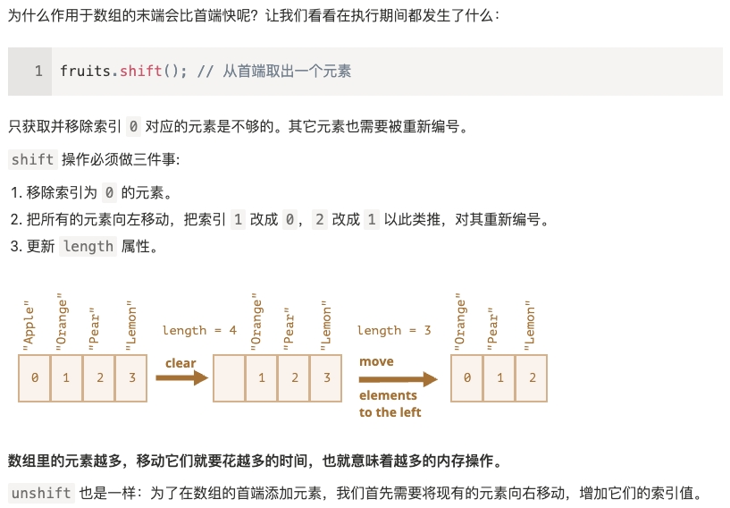
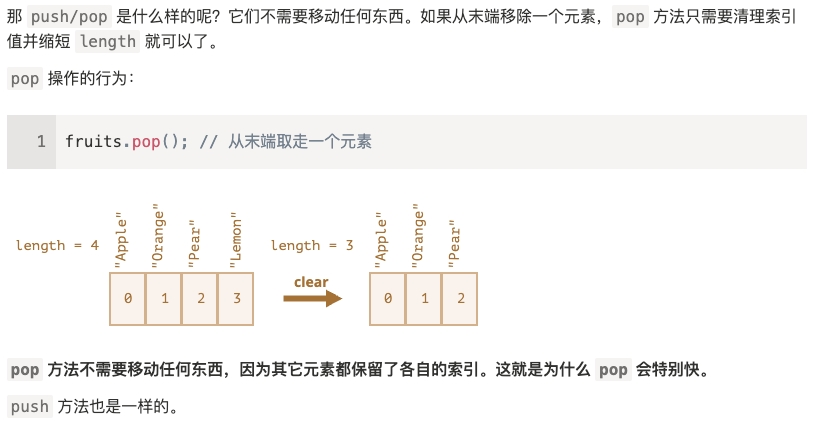
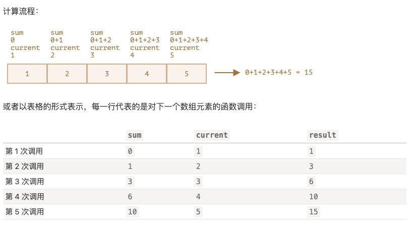
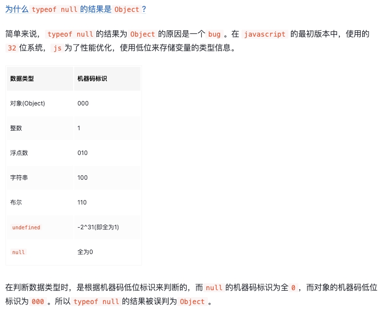

:::info
JavaScript 没有输入或输出的概念，它是一个在宿主环境（host environment）下运行的脚本语言，任何与外界沟通的机制都是由宿主环境提供的。浏览器是最常见的宿主环境，但在非常多的其他程序中也包含 JavaScript 解释器，如 Adobe Acrobat、Adobe Photoshop、SVG 图像、Yahoo！的 Widget 引擎，Node.js 之类的服务器端环境，NoSQL 数据库（如开源的 [Apache CouchDB](https://couchdb.apache.org/))、嵌入式计算机，以及包括 [GNOME](https://www.gnome.org/)（注：GNU/Linux 上最流行的 GUI 之一）在内的桌面环境等等。

JavaScript 是一种多范式的“动态类型”（dynamically typed）语言，它包含类型、运算符、标准内置（built-in）对象和方法。
> “动态类型”（dynamically typed）的编程语言，意思是虽然编程语言中有不同的数据类型，但是你定义的变量并不会在定义后，被限制为某一数据类型。

JavaScript 支持面向对象编程。JavaScript是通过**[原型链（prototype chain）](https://developer.mozilla.org/zh-CN/docs/Web/JavaScript/Inheritance_and_the_prototype_chain)**而不是 [类](https://developer.mozilla.org/zh-CN/docs/Web/JavaScript/Reference/Classes) 来支持面向对象编程。

JavaScript 也支持函数式编程。在JavaScript中，函数也是对象，函数也可以被保存在变量中，并且像其他对象一样被传递。

学习资料：
- [重新介绍 JavaScript](https://developer.mozilla.org/zh-CN/docs/Web/JavaScript/Language_Overview)
- [Learn ES2015](https://babeljs.io/docs/en/learn)
- [ecma](https://www.ecma-international.org/)
- [tc39](https://tc39.es/) 所属 Ecma International 的 TC39 是一个由 JavaScript 开发者、实现者、学者等组成的团体，与 JavaScript 社区合作维护和发展 JavaScript 的标准。
:::

## 严格模式
- "use strict" 或者 'use strict'，当它处于脚本文件的顶部（请确保 "use strict" 出现在脚本的最顶部，否则严格模式可能无法启用。只有注释可以出现在 "use strict" 的上面。）时，则整个脚本文件都将以“现代”模式进行工作。
- "use strict" 可以被放在函数体的开头，这样则可以只在该函数中启用严格模式。
- 现代 JavaScript 支持 “class” 和 “module”，它们会自动启用 use strict。因此，如果我们使用它们，则无需添加 "use strict" 指令。

例如，旧版本中可以简单地通过赋值来创建一个变量。现在如果我们不在脚本中使用 use strict 声明启用严格模式，这仍然可以正常工作，这是为了保持对旧脚本的兼容。
```js
// 注意：这个例子中没有 "use strict"

num = 5; // 如果变量 "num" 不存在，就会被创建

alert(num); // 5
```
```js
"use strict";

num = 5; // 错误：num 未定义
```

## 数据类型-概述
在 JavaScript 中有 8 种基本的数据类型（7 种原始类型和 1 种引用类型）：
1. 七种原始数据类型：
- "number" 用于任何类型的数字：整数或浮点数，在 ±(2^53-1) 范围内的整数。
- "bigint" 用于任意长度的整数。
- "string" 用于字符串：一个字符串可以包含 0 个或多个字符，所以没有单独的单字符类型。
- "boolean" 用于 true 和 false。
- "null" 用于未知的值 —— 只有一个 `null` 值的独立类型。
- "undefined" 用于未定义的值 —— 只有一个 `undefined` 值的独立类型。
- "symbol" 用于唯一的标识符。

2. 一种非原始数据类型：
- "object" 用于更复杂的数据结构。

## 数据类型-Number类型
Number 类型，包括整数和浮点数，还包括所谓的“特殊数值（special numeric values）”：`Infinity`、`-Infinity` 和 `NaN`。
- `Infinity` 代表数学概念中的 无穷大 ，是一个比任何数字都大的特殊值。`alert( 1 / 0 ); // Infinity` `alert( 1e500 ); // Infinity`

- `NaN` 代表一个计算错误。它是一个不正确的或者一个未定义的数学操作所得到的结果。`NaN` 是粘性的:任何对 `NaN` 的进一步数学运算都会返回 `NaN`（只有一个例外：`NaN ** 0` 结果为 1）。
> 幂（`**`）运算符返回第一个操作数取第二个操作数的幂的结果。它等价于 `Math.pow()`，不同之处在于，它还接受 `BigInt` 作为操作数。

<CodeRun>
{
  `
  console.log( "not a number" / 2 ); // NaN，这样的除法是错误的
  console.log( NaN + 1 ); // NaN
  console.log( 3 * NaN ); // NaN
  console.log( "not a number" / 2 - 1 ); // NaN
  console.log( NaN ** 0 ); // 1
  `
}
</CodeRun>

- `isNaN(value)` 将`value`转换为数字，然后测试它是否为 `NaN`
  ```js
  alert( isNaN(NaN) );   // true
  alert( isNaN("str") ); // true
  ```

- `isFinite(value)` 将`value`转换为数字，转换后如果是常规数字而不是 `NaN`或`Infinity`或`-Infinity`，则返回 true
  ```js
  alert( isFinite("15") );     // true
  alert( isFinite("str") );    // false，因为是一个特殊的值：NaN
  alert( isFinite(Infinity) ); // false，因为是一个特殊的值：Infinity
  alert( isFinite(null) );     // true
  alert( isFinite('') );       // true
  ```

:::tip
请注意，在所有数字函数中，包括 `isFinite`，空字符串或仅有空格的字符串均被视为 `0`。
:::

- 下划线分隔符 使得数字具有更强的可读性。JavaScript 引擎会直接忽略数字之间的 `_`
  ```js
  let billion = 1_000_000_000;
  ```

- 使用字母`e`指定零的个数来缩短数字。例如 `e3`表示`乘以10的3次方`；`e-3`表示`除以10的3次方`
  ```js
  let billion = 1e9;  // 10 亿，字面意思：数字 1 后面跟 9 个 0

  alert( 7.3e9 );  // 73 亿（与 7300000000 和 7_300_000_000 相同）

  1e3 === 1 * 1000; // e3 表示 *1000

  1.23e6 === 1.23 * 1000000; // e6 表示 *1000000

  0.000001 === 1e-6; // 1 / 10**6
  ```

- 十六进制数字使用`0x`前缀，二进制数字使用`0b`前缀，八进制数字使用`0o`前缀。只有这三种进制支持这种写法。对于其他进制，应该使用函数`parseInt`
  ```js
  alert( 0xff ); // 255
  alert( 0xFF ); // 255（一样，大小写没影响）

  let a = 0b11111111; // 二进制形式的 255
  let b = 0o377;      // 八进制形式的 255
  alert( a == b );    // true，两边是相同的数字，都是 255
  ```

- 存在两个零：0 和 -0。这是因为在存储时，使用一位来存储符号（64位存储一个数字：其中 52位被用于存储这些数字，11位用于存储小数点的位置，1位用于符号），因此对于包括零在内的任何数字，可以设置这一位或者不设置。

### `toString(base)`
方法 `toString(base)` 返回给定 `base` 进制 的字符串表示形式。`base` 的范围可以从 2 到 36。默认情况下是 10。
- base=16 用于十六进制颜色，字符编码等，数字可以是 0..9 或 A..F。
- base=2 主要用于调试按位操作，数字可以是 0 或 1。
  ```js
  let num = 255;

  alert( num.toString(16) );  // ff
  alert( num.toString(2) );   // 11111111
  ```
- base=36 是最大进制，数字可以是 0..9 或 A..Z。所有拉丁字母都被用于了表示数字。对于 36 进制来说，一个有趣且有用的例子是，当我们需要将一个较长的数字标识符转换成较短的时候，例如做一个短的 URL。可以简单地使用基数为 36 的数字系统表示:
  ```js
  alert( 123456..toString(36) ); // 2n9c
  ```

:::info
如果我们想直接在一个数字上调用一个方法，比如上面例子中的 toString，那么我们需要在它后面放置两个点 `..`。如果我们放置一个点：`123456.toString(36)`，那么就会出现一个 error，因为 JavaScript 语法隐含了第一个点之后的部分为小数部分。如果我们再放一个点，那么 JavaScript 就知道小数部分为空，现在使用该方法。也可以写成 `(123456).toString(36)`。
:::

### 舍入
对数字进行舍入的内建函数:
- `Math.floor` 向下舍入
- `Math.ceil` 向上舍入
- `Math.round` 向最近的整数舍入（0到4 会被舍去，而 5到9 会进一位）
- `Math.trunc` 移除小数点后的所有内容而没有舍入


#### 将数字舍入到小数点后 n 位
有两种方式:
1. 乘除法。例如，要将数字舍入到小数点后两位，我们可以将数字乘以 100，调用舍入函数，然后再将其除回。
   ```js
   let num = 1.23456;

   alert( Math.round(num * 100) / 100 ); // 1.23456 -> 123.456 -> 123 -> 1.23
   ```

2. 函数 `toFixed(n)` 将数字舍入到小数点后 n 位（这会向上或向下舍入到最接近的值(0到4 会被舍去，而 5到9 会进一位)，类似于 `Math.round`），并以字符串形式返回结果。
   ```js
   let num = 12.34;
   alert( num.toFixed(1) ); // "12.3"

   let num = 12.36;
   alert( num.toFixed(1) ); // "12.4"

   // 注意 toFixed 的结果是一个字符串。如果小数部分比所需要的短，则在结尾添加零
   let num = 12.34;
   alert( num.toFixed(5) ); // "12.34000"，在结尾添加了 0，以达到小数点后五位
   ```

### 精度损失
- 在十进制数字系统中，可以保证以 10 的整数次幂作为除数能够正常工作，但是以 3 作为除数则不能（1/3 是无限循环小数 0.33333(3)）。同样的原因，在二进制数字系统中，可以保证以 2 的整数次幂作为除数时能够正常工作，但 1/10（0.1）就变成了一个无限循环的二进制小数（0.0 0011 0011 0011(0011) 0011无限循环）。在内部，数字是以 64 位格式 IEEE-754 表示的，所以正好有 64 位可以存储一个数字：其中 52 位被用于存储这些数字，其中 11 位用于存储小数点的位置，而 1 位用于符号。无限循环小数超出64位，会被截断处理，就会损失精度。
  ```js
  alert( 0.1 + 0.2 == 0.3 ); // false

  alert( 0.1 + 0.2 ); // 0.30000000000000004
  ```

- IEEE-754 数字格式通过将数字舍入到最接近的可能数字来解决此问题。这些舍入规则通常不允许我们看到“极小的精度损失”，但是它确实存在。
  ```js
  alert( 0.1.toFixed(20) ); // 0.10000000000000000555
  alert( 9999999999999999 ); // 显示 10000000000000000
  ```

- 最可靠的方法是借助方法 `toFixed(n)` 对结果进行舍入，以解决精度损失的问题（即，在必要时剪掉其“尾巴”来对其进行舍入）
  ```js
  let sum = 0.1 + 0.2;
  alert( sum.toFixed(2) ); // "0.30"
  alert( +sum.toFixed(2) ); // 0.3
  ```
  :::warning
  为什么 6.35 被舍入为 6.3 而不是 6.4？
  <CodeRun>{`
  console.log( 6.35.toFixed(1) ); // "6.3"
  console.log( 1.35.toFixed(1) ); // "1.4"
  `}</CodeRun>
  在内部，6.35 的小数部分是一个无限的二进制，它的存储会造成精度损失。精度损失可能会导致数字的增加和减小。
  <CodeRun>{`
  // 可以看到 6.35 存储的其实是 6.34999...
  console.log( 6.35.toFixed(20) ); // "6.34999999999999964473"
  console.log( 1.35.toFixed(20) ); // "1.35000000000000008882"
  `}</CodeRun>
  应该如何解决 6.35 的舍入问题呢？在进行舍入前，我们应该使其更接近整数：
  <CodeRun>{`
  console.log( Math.round(6.35 * 10) / 10); // 6.35 -> 63.5 -> 64(rounded) -> 6.4
  // 63.5 完全没有精度损失。这是因为小数部分 0.5 实际上是 1/2，以 2 的整数次幂为分母的小数在二进制数字系统中可以被精确地表示。
  console.log( (6.35 * 10).toFixed(20) );   // "63.50000000000000000000"
  `}</CodeRun>
  :::

- 乘/除法可以减少误差，但不能完全消除误差。
  ```js
  alert( (0.1 * 10 + 0.2 * 10) / 10 ); // 0.3
  alert( (0.28 * 100 + 0.14 * 100) / 100); // 0.4200000000000001
  ```

- 由于精度损失的问题存在，所以在处理小数时应避免相等性检查。

### `parseInt` 和 `parseFloat`
`parseInt` 和 `parseFloat` 可以从字符串中“读取”数字，直到无法读取为止。如果发生 error，则返回收集到的数字。函数 `parseInt` 返回一个整数，而 `parseFloat` 返回一个浮点数
<CodeRun>{`
console.log( parseInt('100px') );    // 100
console.log( parseFloat('12.5em') ); // 12.5
console.log( parseInt('12.3') );     // 12，只有整数部分被返回了
console.log( parseFloat('12.3.4') ); // 12.3，在第二个点处停止了读取
`}</CodeRun>

- 如果第一个字符就是非数字，则会返回`NaN`
  <CodeRun>{`
  console.log( parseInt('a123') );
  console.log( parseFloat('a123') );
  `}</CodeRun>

- `parseInt` 函数具有可选的第二个参数，它指定了数字系统的基数，因此 `parseInt` 还可以解析十六进制数字、二进制数字等的字符串
  <CodeRun>{`
  console.log( parseInt('0xff', 16) ); // 255
  console.log( parseInt('ff', 16) );   // 255，没有 0x 仍然有效
  console.log( parseInt('2n9c', 36) ); // 123456
  `}</CodeRun>

### 其他数学函数
JavaScript 有一个内建的 Math 对象，它包含了一个小型的数学函数和常量库。
- `Math.random()` 返回一个从 0 到 1 的随机数（不包括 1）
- `Math.max(a, b, c...)` 从任意数量的参数中返回最大值
- `Math.min(a, b, c...)` 从任意数量的参数中返回最小值
- `Math.pow(n, power)` 返回 n 的给定（power）次幂
- ...等等

## 数据类型-BigInt类型
- 在 JavaScript 中，Number 类型超出安全整数范围 ±(2^53-1) 会出现精度问题，因为并非所有数字都适合固定的 64 位存储。因此，可能存储的是“近似值”。如下两个数字（正好超出了安全整数范围）是相同的：
<CodeRun>
{
  `
  console.log(9007199254740991 + 1); // 9007199254740992
  console.log(9007199254740991 + 2); // 9007199254740992
  `
}
</CodeRun>

- BigInt 类型用于表示任意长度的整数。可以通过将 `n` 附加到整数字段的末尾来创建 BigInt 值。
  ```js
  // 尾部的 "n" 表示这是一个 BigInt 类型
  const bigInt = 1234567890123456789012345678901234567890n;
  ```


## 数据类型-String类型
- 字符串的内部使用 UTF-16 编码(即：每个字符都有对应的数字代码)，它不依赖于页面编码。
- 单引号和双引号基本相同。反引号允许我们通过 `${…}` 将任何表达式嵌入到字符串中。使用反引号的另一个优点是它们允许字符串跨行。
- 反引号还允许我们在第一个反引号之前指定一个“模版函数”。语法是：
  ```js
  func`string` // 函数 func 被自动调用，接收字符串和嵌入式表达式，并处理它们。
  ```

- 要获取在 `pos` 位置的一个字符，可以使用方括号 `[pos]` 或者调用 `charAt(pos)` 方法（第一个字符从零位置开始）。它们之间的唯一区别是，如果没有找到字符，方括号 `[pos]` 返回 `undefined`，而 `charAt(pos)` 方法 返回一个空字符串。
  ```js
  let str = `Hello`;

  alert( str[1000] );        // undefined
  alert( str.charAt(1000) ); // ''（空字符串）
  ```

- 也可以使用 `for..of` 遍历字符
  ```js
  for (let char of "Hello") {
    alert(char); // H,e,l,l,o
  }
  ```

- 在 JavaScript 中，字符串不可更改。
  ```js
  let str = 'Hi';

  str[0] = 'h'; // 非严格模式下会忽略；严格模式下会报错 TypeError: Cannot assign to read only property '0' of string 'Hi'
  console.log(str[0]);
  ```

- `toLowerCase()` 和 `toUpperCase()` 方法可以改变大小写
  ```js
  alert( 'Interface'.toUpperCase() );    // INTERFACE
  alert( 'Interface'.toLowerCase() );    // interface
  alert( 'Interface'[0].toLowerCase() ); // 'i'
  ```

### 特殊字符
- 所有的特殊字符都以反斜杠字符 `\` 开始。它也被称为“转义字符”。


- 注意：反斜杠 `\` 在 JavaScript 中用于正确读取字符串，然后消失。用作转义字符时，内存中的字符串没有 `\`。

换行符：
```js
let str1 = "Hello\nWorld"; // 使用“换行符”创建的两行字符串

// 使用反引号和普通的换行创建的两行字符串
let str2 = `Hello
World`;

alert(str1 == str2); // true
```

Unicode 示例:
```js
alert( "\u00A9" );    // ©
alert( "\u{20331}" ); // 佫，罕见的中国象形文字（长 Unicode）
alert( "\u{1F60D}" ); // 😍，笑脸符号（另一个长 Unicode）
```

### `length`属性
`length`属性表示字符串长度。请注意 `length` 是一个属性，而不是函数，后面不需要添加括号。
```js
alert( `My\n`.length ); // 3 注意 \n 是一个单独的“特殊”字符
```

### 查找子字符串
#### `indexOf(substr, pos)` 和 `lastIndexOf(substr, position)`
`indexOf(substr, pos)` 从给定位置 `pos`(可选参数) 开始，在 str 中查找 substr，如果没有找到，则返回 -1，否则返回匹配成功的位置。检索是大小写敏感的。
```js
let str = 'Widget with id';

alert( str.indexOf('Widget') ); // 0，因为 'Widget' 一开始就被找到
alert( str.indexOf('widget') ); // -1，没有找到，检索是大小写敏感的

alert( str.indexOf("id") ); // 1，"id" 在位置 1 处（……idget 和 id）
// 从位置 2 开始检索
alert( str.indexOf('id', 2) ) // 12
```

查找子字符串的所有位置：
```js
let str = "As sly as a fox, as strong as an ox";
let target = "as";

let pos = -1;
while ((pos = str.indexOf(target, pos + 1)) != -1) {
  alert( pos );
}
```

`lastIndexOf(substr, position)` 从字符串的末尾开始搜索到开头。

#### Bitwise NOT (`~`) 按位取反
- `~` 将数字转换为 32-bit 整数（如果存在小数部分，则删除小数部分），然后对其二进制表示形式中的所有位均取反。
- 对于 32-bit 整数，`~n` 等于 `-(n+1)`。
  ```js
  alert( ~2 );  // -3，和 -(2+1) 相同
  alert( ~1 );  // -2，和 -(1+1) 相同
  alert( ~0 );  // -1，和 -(0+1) 相同
  alert( ~-1 ); // 0，和 -(-1+1) 相同
  ```
- 如上，只有当 `n == -1` 时，`~n` 才为零（适用于任何 32-bit 带符号的整数 n）。可以用它来简写 `indexOf` 检查: 仅当 `indexOf` 的结果不是 -1 时，检查 `if ( ~str.indexOf("...") )` 才为真。注意：种检查只有在字符串没有那么长的情况下才是正确的。
  ```js
  let str = "Widget";

  if (~str.indexOf("Widget")) {
    alert( 'Found it!' ); // 正常运行
  }
  ```

#### includes，startsWith，endsWith
`str.includes(substr, pos)` 根据 str 中是否包含 substr 来返回 true/false。第二个可选参数是开始搜索的起始位置。
```js
alert( "Widget".includes("id") );    // true
alert( "Widget".includes("id", 3) ); // false, 从位置 3 开始没有 "id"
```
```js
alert( "Widget".startsWith("Wid") ); // true，"Widget" 以 "Wid" 开始
alert( "Widget".endsWith("get") );   // true，"Widget" 以 "get" 结束
```

### 获取子字符串
JavaScript 中有三种获取字符串的方法：substring、substr 和 slice。

#### `str.slice(start [, end])`
返回字符串从 start 到（但不包括）end 的部分。如果没有第二个参数，slice 会一直运行到字符串末尾。不影响原字符串。
```js
let str = "stringify";
alert( str.slice(0, 5) ); // 'strin'，从 0 到 5 的子字符串（不包括 5）
alert( str.slice(0, 1) ); // 's'，从 0 到 1，但不包括 1，所以只有在 0 处的字符
alert( str.slice(2) );    // 'ringify' 从第二个位置直到结束
```

start/end 也有可能是负值，意思是起始位置从字符串结尾计算
```js
let str = "stringify";

// 从右边的第四个位置开始，在右边的第一个位置结束
alert( str.slice(-4, -1) ); // 'gif'
```

#### `str.substring(start [, end])`
返回字符串从 start 到（但不包括）end 的部分。与 `slice` 的区别是，`substring` 允许 start 大于 end；`substring` 不支持负参数（负参数被视为 0）。
```js
let str = "stringify";

// 如下对于 substring 是相同的
alert( str.substring(2, 6) ); // "ring"
alert( str.substring(6, 2) ); // "ring"

// ……但对 slice 是不同的：
alert( str.slice(2, 6) ); // "ring"（一样）
alert( str.slice(6, 2) ); // ""（空字符串）
```

#### `str.substr(start [, length])`
返回字符串从 start 开始的给定 length 的部分。第一个参数可能是负数，表示从结尾算起。
```js
let str = "stringify";
alert( str.substr(2, 4) );  // 'ring'，从位置 2 开始，获取 4 个字符
alert( str.substr(-4, 2) ); // 'gi'，从第 4 位获取 2 个字符
```
:::warning
`substr` 有一个小缺点：它不是在 JavaScript 核心规范中描述的，而是在附录 B 中。附录 B 的内容主要是描述因历史原因而遗留下来的仅浏览器特性。因此，理论上非浏览器环境可能无法支持 `substr`，但实际上它在别的地方也都能用。
:::

## 数据类型-Boolean类型
Boolean类型仅包含两个值：true 和 false。

## 数据类型-null
JavaScript 中的 `null` 仅仅是一个代表“无”、“空”或“值未知”的特殊值。

## 数据类型-undefined
`undefined` 的含义是 未被赋值。如果一个变量已被声明，但未被赋值，那么它的值就是 `undefined`。从技术上讲，可以显式地将 `undefined` 赋值给变量，但是不建议这样做。**通常，使用 `null` 将一个“空”或者“未知”的值写入变量中，而 `undefined` 则保留作为未进行初始化的事物的默认初始值。**

## 数据类型-Symbol类型
- 可以使用 `Symbol()` 来创建这种类型的值，Symbol 类型的值表示唯一的标识符。
  ```js
  let id = Symbol();
  ```

- 创建时，我们可以给 symbol 一个描述（也称为 symbol 名）。symbol 保证是唯一的。即使我们创建了许多具有相同描述的 symbol，它们的值也是不同。描述只是一个标签，不影响任何东西。
  <CodeRun>{`
  let id1 = Symbol("id");
  let id2 = Symbol("id");
  console.log( id1 == id2 ); // false
  `}</CodeRun>

- Symbol值 不会被自动转换为字符串
  ```js
  let id = Symbol("id");
  alert(id); // TypeError: Cannot convert a Symbol value to a string 类型错误：无法将 Symbol 值转换为字符串。
  ```
  <CodeRun>{`
  let id = Symbol("id");
  console.log( id.toString() );  // "Symbol(id)"
  console.log( id.description ); // "id"
  `}</CodeRun>

- Symbol值 可以作为对象的“隐藏”属性。如果我们想要向“属于”另一个脚本或者库的对象添加一个属性，我们可以创建一个 symbol 并使用它作为属性的键。使用 `Symbol("id")` 作为键，比起用字符串 "id" 来有什么好处呢？假如我们使用第三方库的`user`对象，向它添加字符串属性是不安全的，因为可能会影响代码库中的其他预定义行为。但 symbol 属性不会被意外访问到。第三方代码不会知道新定义的 symbol，因此将 symbol 添加到 `user` 对象是安全的。
  ```js
  let user = { // 假设属于第三方代码库
    name: "John"
  };

  let id = Symbol("id");

  user[id] = 1;

  let id = Symbol("id");

  user[id] = "Their id value"; // 不会有冲突，因为 symbol 总是不同的，即使它们有相同的名字。

  // 如果使用字符串作为属性key
  user.id = "Our id value";

  user.id = "Their id value"; // 无意中重写了 id！
  ```
  :::info
  从技术上说，symbol 不是 100% 隐藏的。有一个内建方法 `Object.getOwnPropertySymbols(obj)` 允许我们获取所有的 symbol。还有一个名为 `Reflect.ownKeys(obj)` 的方法可以返回一个对象的 所有 键，包括 symbol。但大多数库、内建方法和语法结构都没有使用这些方法。
  :::

- 在对象字面量 `{...}` 中使用 symbol，需要使用方括号把它括起来。
  ```js
  let id = Symbol("id");

  let user = {
    name: "John",
    [id]: 123 // 而不是 "id"：123
  };
  ```

- symbol属性在 `for…in`、`Object.keys(...)` 中会被忽略。
  <CodeRun>{`
  let id = Symbol("id");
  let user = {
    name: "John",
    age: 30,
    [id]: 123
  };
  // for..in 会忽略symbol属性
  for (let key in user) console.log( key );             // "name" "age"（没有 symbol）
  // 可以直接访问
  console.log( "Direct: " + user[id] );                 // "Direct: 123"
  // Object.keys(...) 会忽略symbol属性
  Object.keys(user).forEach(key => console.log( key )); // "name" "age"（没有 symbol）
  `}</CodeRun>

- `Object.assign` 会同时复制字符串和 symbol 属性。
  <CodeRun>{`
  let id = Symbol("id");
  let user = {
    [id]: 123
  };
  let clone = Object.assign({}, user);
  console.log( clone[id] ); // 123
  `}</CodeRun>

### 全局symbol
- 通常所有的 symbol 都是不同的，即使它们有相同的名字。但有时我们想要名字相同的 symbol 具有相同的实体。

- 使用 `Symbol.for(key)` 可以检查全局symbol注册表，如果有一个描述为 `key` 的 symbol，则返回该 symbol，否则将创建一个新 symbol（`Symbol(key)`），并通过给定的 `key` 将其存储在注册表中。注册表内的 symbol 被称为 全局symbol。使用 `Symbol.for(key)` 多次调用 `key` 相同的 symbol 时，返回的就是同一个 symbol。
  <CodeRun>{`
  // 从全局注册表中读取
  let id = Symbol.for("id"); // 如果该 symbol 不存在，则创建它
  // 再次读取（可能是在代码中的另一个位置）
  let idAgain = Symbol.for("id");
  // 相同的 symbol
  console.log( id === idAgain );                        // true
  console.log( Symbol.for("id") === Symbol.for("id") ); // true
  console.log( Symbol("id") === Symbol("id") )          // false
  `}</CodeRun>

- 对于全局symbol，`Symbol.for(key)` 按名字返回一个 symbol；`Symbol.keyFor(sym)`通过全局symbol 返回一个名字。
  <CodeRun>{`
  // 通过 name 获取 symbol
  let sym = Symbol.for("name");
  let sym2 = Symbol.for("id");
  // 通过 symbol 获取 name
  console.log( Symbol.keyFor(sym) );  // "name"
  console.log( Symbol.keyFor(sym2) ); // "id"
  `}</CodeRun>

- `Symbol.keyFor` 内部使用全局symbol注册表来查找 symbol 的键，所以它不适用于非全局 symbol。如果 symbol 不是全局的，它将无法找到它并返回 `undefined`。
  <CodeRun>{`
  let globalSymbol = Symbol.for("name");
  let localSymbol = Symbol("name");
  console.log( Symbol.keyFor(globalSymbol) ); // "name"，全局 symbol
  console.log( Symbol.keyFor(localSymbol) );  // undefined，非全局
  console.log( localSymbol.description );     // "name"，可以使用description属性获取symbol名字
  `}</CodeRun>

### 系统symbol
JavaScript 内部有很多“系统” symbol，我们可以使用它们来改变一些内建行为。它们都被列在了 [众所周知的 symbol](https://tc39.es/ecma262/#sec-well-known-symbols) 中:
- `Symbol.hasInstance`
- `Symbol.isConcatSpreadable`
- `Symbol.iterator`
- `Symbol.toPrimitive`
- ……等等。

## 数据类型-Object类型
- 创建对象的2种语法: 构造函数、字面量(object literal)。
  ```js
  let user = new Object(); // “构造函数” 的语法
  let user = {};  // “字面量” 的语法
  ```

- 对象的属性(`key`)是字符串类型 或者 Symbol类型（其他类型会被自动地转换为字符串），属性的值可以是任意类型。
  ```js
  let user = {
    name: "John",         // 键 "name"，值 "John"
    age: 30,              // 键 "age"，值 30
    "likes birds": true   // 多词属性名必须加引号
    0: "test"             // 等同于 "0": "test"
  };

  // 相同的属性（数字 0 被转为字符串 "0"）
  alert( obj["0"] ); // test
  alert( obj[0] );   // test
  ```

- 可以使用 点符号 或者 方括号 访问/设置属性值。点符号要求 `key` 是有效的变量标识符，这意味着：不包含空格，不以数字开头，也不包含特殊字符（允许使用 `$` 和 `_`）。使用方括号，可用于任何字符串。方括号同样提供了一种可以通过任意表达式来获取属性名的方式(点符号不能以类似的方式使用)。
  ```js
  alert( user.name ); // John
  alert( user.age ); // 30
  alert( user["likes birds"] );
  ```
  ```js
  let key = "likes birds";

  user[key] = true; // 跟 user["likes birds"] = true; 一样

  alert( user.key ) // undefined
  ```

- 可以用 `delete` 操作符移除属性
  ```js
  delete user.age;
  delete user["likes birds"];
  ```

- 作为对象属性的函数被称为 方法(method)。
  ```js
  let user = {
    sayHi: function() {
      alert("Hello");
    }
  };

  // 方法简写
  let user = {
    sayHi() { // 与 "sayHi: function(){...}" 一样
      alert("Hello");
    }
  };
  ```

### 对象方法中的`this`
```js
let user = {
  name: "John",
  age: 30,

  sayHi() {
    // "this" 指的是“当前的对象”
    alert(this.name);
  }

};

user.sayHi(); // John
```

- 技术上讲，也可以在不使用 `this` 的情况下，通过外部变量名来引用它，但这样的代码是不可靠的。例如：
  ```js
  let user = {
    name: "John",
    age: 30,

    sayHi() {
      alert( user.name );
    }
  };

  let admin = user;
  user = null; // 重写

  admin.sayHi(); // TypeError: Cannot read property 'name' of null
  ```

  使用`this`可以避免上述错误：
  <CodeRun>{`
  let user = {
    name: "John",
    age: 30,
    sayHi() {
      console.log( this.name );
    }
  };
  let admin = user;
  user = null; // 重写
  admin.sayHi();
  `}</CodeRun>

### 计算属性
当创建一个对象时，我们可以在对象字面量中使用方括号。这叫做 计算属性。
```js
let fruit = prompt("Which fruit to buy?", "apple");

let bag = {
  [fruit]: 5, // 属性名是从 fruit 变量中得到的
};

alert( bag.apple ); // 5 如果一个用户输入 "apple"，bag 将变为 {apple: 5}。
```
<CodeRun>
{`
let fruit = 'apple';
let bag = {
  [fruit + 'Computers']: 5 // bag.appleComputers = 5
};
console.log( bag.appleComputers )
`}
</CodeRun>

### `in`操作符
- JavaScript 的对象有一个需要注意的特性：能够被访问任何属性。即使属性不存在也不会报错！读取不存在的属性只会得到 `undefined`。
  ```js
  let user = {};

  alert( user.noSuchProperty === undefined ); // true 意思是没有这个属性
  ```

- 可以使用`in`操作符检查属性是否存在。请注意，`in` 的左边必须是 属性名，通常是一个带引号的字符串。如果我们省略引号，就意味着左边是一个变量，它应该包含要判断的实际属性名。
  <CodeRun>
  {`
  let user = { name: "John", age: 30 };
  console.log( "age" in user );           // true，user.age 存在
  console.log( "blabla" in user );        // false，user.blabla 不存在。
  let key = "age";
  console.log( key in user );             // true，属性 "age" 存在
  `}
  </CodeRun>

- 大部分情况下与 `undefined` 进行比较来判断属性是否存在就可以了。当 属性存在但存储的值是 `undefined` 时，这种比对方式会有问题，而 `in` 运算符的判断结果仍是对的。
  <CodeRun>
  {`
  let obj = {
    test: undefined
  };
  console.log( obj.test );       // 显示 undefined，所以属性不存在？
  console.log( "test" in obj );  // true，属性存在！
  `}
  </CodeRun>

- 通常情况下不应该给对象属性赋值 `undefined`。我们通常会用 `null` 来表示未知的或者空的值。

### 对象引用和复制
- 原始类型的复制
  ```js
  let message = "Hello!";
  let phrase = message;
  ```
  

- 赋值了对象(如下方的`{name:"John"}`)的变量(如下方的`user`) 存储的不是对象本身，而是该对象“在内存中的地址”，换句话说就是对该对象的“引用”。
  ```js
  let user = {
    name: "John"
  };
  // 该对象被存储在内存中的某个位置（在下图的右侧），而变量 user（在下图的左侧）保存的是对其的“引用”。
  ```
  

- 当一个对象变量被复制，其实是引用被复制，而该对象自身并没有被复制。
  ```js
  let user = { name: "John" };

  let admin = user; // 现在我们有了两个变量，它们保存的都是对同一个对象的引用。

  // 仍然只有一个对象，但现在有两个引用它的变量。

  // 可以通过其中任意一个变量来访问该对象并修改它的内容
  admin.name = 'Pete'; // 通过 "admin" 引用来修改

  alert(user.name); // 'Pete'，修改能通过 "user" 引用看到
  ```
  

- 仅当两个变量都引用同一个对象时，它们才相等。
  <CodeRun>
  {`
  let a = {};
  let b = a; // 复制引用
  console.log( a == b );  // true，都引用同一对象
  console.log( a === b ); // true
  // 引用两个独立的对象的变量并不相等，即使它们看起来很像（如都为空时）
  let c = {};
  let d = {};
  console.log( c == d );  // false
  `}
  </CodeRun>

### 对象的克隆与合并
- 克隆对象 可以创建一个新对象，通过遍历已有对象的属性，并在原始类型值的层面复制它们，以实现对已有对象结构的复制。
  <CodeRun>
  {`
  let user = {
    name: "John",
    age: 30,
  };
  let clone = {}; // 新的空对象
  // 将 user 中所有的属性拷贝到其中
  for (let key in user) {
    clone[key] = user[key];
  }
  // 现在 clone 是带有相同内容的完全独立的对象
  clone.name = "Pete"; // 改变了其中的数据
  console.log( clone );
  console.log( user.name ); // 原来的对象中的 name 属性依然是 John
  `}
  </CodeRun>

- 可以使用 `Object.assign(dest, [src1, src2, src3...])` 方法进行对象的合并及“浅拷贝”（嵌套对象被通过引用进行拷贝，即如果对象的属性也是一个对象，则拷贝后该属性的值被共享），该方法将从第二个开始的所有参数的属性都被拷贝到第一个参数的对象中。调用结果返回 `dest`。如果被拷贝的属性的属性名已经存在，那么它会被覆盖。
  <CodeRun>
  {`
  let user = { name: "John" };
  let permissions1 = { canView: true };
  let permissions2 = { canEdit: true };
  // 将 permissions1 和 permissions2 中的所有属性都拷贝到 user 中
  let cloneResult = Object.assign(user, permissions1, permissions2);
  console.log( user );
  console.log( cloneResult );
  let cloneResult2 = Object.assign(user, { name: "Pete" });
  console.log( user );
  console.log( cloneResult2 );
  `}
  </CodeRun>

- 也可以用 `Object.assign` 代替 `for..in` 循环来进行简单克隆
  <CodeRun>
  {`
  let user = {
    name: "John",
    age: 30,
  };
  let clone = Object.assign({}, user);
  console.log( clone );
  `}
  </CodeRun>

- 还可以使用 `spread` 语法 克隆对象
  <CodeRun>{`
  let user = {
    name: "John",
    age: 30,
  };
  let clone = {...user};
  console.log( clone );
  `}</CodeRun>

### 深层克隆对象
对象的属性可以是对其他对象的引用，这时简单的克隆对象后，该属性的值会以引用形式被拷贝。
<CodeRun>{`
let user = {
  name: "John",
  sizes: {
    height: 182,
    width: 50
  }
};
let clone = Object.assign({}, user);
console.log( user.sizes === clone.sizes ); // true，同一个对象
// user 和 clone 共享同一个 sizes
user.sizes.width++;                        // 通过其中一个改变属性值
console.log(clone.sizes.width);            // 51，能从另外一个获取到变更后的结果
`}</CodeRun>

为了解决这个问题，并让 `user` 和 `clone` 成为两个真正独立的对象，我们应该使用一个拷贝循环来检查 `user[key]` 的每个值，如果它是一个对象，那么也复制它的结构。这就是所谓的“深拷贝”。我们可以使用递归来实现它。或者为了不重复造轮子，采用现有的实现，例如 [lodash](https://lodash.com/) 库的 [`_.cloneDeep(obj)`](https://lodash.com/docs#cloneDeep)。

### 对象的属性标志
- 使用 `const` 声明的对象也是可以被修改的。如下使用`const`声明的变量`user`的值是一个常量，它必须始终引用同一个对象，但该对象的属性可以被自由修改。
  <CodeRun>{`
  const user = {
    name: "John"
  };
  user.name = "Pete";
  console.log(user.name); // Pete
  `}</CodeRun>

### 对象到原始值的转换
对于类似 `obj1 > obj2` 的比较，或者跟一个原始类型值的比较 `obj == 5`，对象都会被转换为原始值。
#### hint
JavaScript 是通过 hint 决定对象转换为哪种原始值的，如[规范](https://tc39.github.io/ecma262/#sec-toprimitive)所述，有3种hint：
1. "string"
   当我们对期望一个字符串的对象执行操作时，如 `alert(obj)` `anotherObj[obj]`(将对象作为属性键)，对象转换为字符串。

2. "number"
   当我们对 对象 进行数学运算时，对象转换为数字。
   ```js
   // 显式转换
   let num = Number(obj);

   // 数学运算（除了二元加法）
   let n = +obj; // 一元加法
   let delta = date1 - date2;

   // 小于/大于的比较
   let greater = user1 > user2;
   ```

3. "default"
   当运算符“不确定”期望值的类型时，将依据 "default" hint 来对 对象 进行转换。例如，二元加法 可用于字符串（连接），也可以用于数字（相加）。此外，如果对象被用于与字符串、数字或 symbol 进行 == 比较，这时到底应该进行哪种转换也不是很明确，因此使用 "default" hint。
   ```js
   // 二元加法使用默认 hint
   let total = obj1 + obj2;

   // obj == number 使用默认 hint
   if (user == 1) { ... };
   ```

:::info
像 `<` 和 `>` 这样的小于/大于比较运算符，也可以同时用于字符串和数字。不过，它们使用 “number” hint，而不是 “default” hint。这是历史原因。
:::

#### 转换规则
为了进行转换，JavaScript 尝试查找并调用三个对象方法：
1. 如果对象有 `[Symbol.toPrimitive](hint)` 方法的话，调用该方法（这个方法是带有 symbol 键 `Symbol.toPrimitive`（系统 symbol）的方法），
2. 如果对象没有 `[Symbol.toPrimitive](hint)` 方法，那么 JavaScript 将尝试寻找 `toString` 和 `valueOf` 方法：
- 对于 hint 是 "string"：调用 `toString` 方法，如果它不存在，则调用 `valueOf` 方法（因此，对于字符串转换，优先调用 `toString`）。
- 对于hint 是 "number" 或 "default"：调用 `valueOf` 方法，如果它不存在，则调用 `toString` 方法（因此，对于数学运算，优先调用 `valueOf` 方法）。

:::info
默认情况下，普通对象具有 `toString` 和 `valueOf` 方法：
- `toString` 方法返回一个字符串 "[object Object]"。
- `valueOf` 方法返回对象自身。

```js
let user = {name: "John"};

alert(user);                     // [object Object]，尝试将一个对象当做字符串来使用
alert(user.valueOf() === user);  // true
```
:::
:::tip
至于布尔值，所有的对象在布尔上下文（context）中均为 `true`。
:::

对象有 `[Symbol.toPrimitive](hint)` 方法的例子：
<CodeRun>{`
let obj = {
  [Symbol.toPrimitive]: function (hint) {
    switch(hint) {
      case 'number':
        return 3;
      case 'string':
        return 'string case';
      case 'default':
      default:
        return 'default case';
    }
  }
};
console.log( 3 + obj );     // "3default case", 二元加法 使用"default"hint
console.log( 3 - obj );     // 0
console.log( String(obj) ); // "string case"
`}</CodeRun>
<CodeRun>{`
let user = {
  name: "John",
  money: 1000,
  [Symbol.toPrimitive](hint) {
    console.log( "hint: " + hint );
    return hint == "string" ? "name: " + this.name : this.money;
  }
};
// 转换演示：
console.log( String(user) );       // hint: string -> "name: John"
console.log( +user );              // hint: number -> 1000
console.log( user + 500 );         // hint: default -> 1500
`}</CodeRun>

对象没有 `[Symbol.toPrimitive](hint)` 方法的例子：
<CodeRun>{`
let user = {
  name: "John",
  money: 1000,
  // 对于 hint="string"
  toString() {
    return "name: " + this.name;
  },
  // 对于 hint="number" 或 "default"
  valueOf() {
    return this.money;
  }
};
console.log( String(user) );       // toString -> "name: John"
console.log( +user );              // valueOf -> 1000
console.log( user + 500 );         // valueOf -> 1500
`}</CodeRun>

如果没有 `[Symbol.toPrimitive](hint)` 方法 和 `valueOf` 方法，`toString` 方法将处理所有原始转换：
<CodeRun>{`
let user = {
  name: "John",
  toString() {
    return this.name;
  }
};
console.log( String(user) ); // toString -> John
console.log( user + 500 );   // toString -> John500
`}</CodeRun>

:::warning
注意，对象转换原始值 不一定会返回 “hint” 的原始值。比如 hint 是 "number"，转换后不一定是number类型的原始值。唯一强制性的事情是：这些方法必须返回一个原始值，而不是对象。由于历史原因，如果 `toString` 或 `valueOf` 返回一个对象，则不会出现 error，但是这种值会被忽略（就像这种方法根本不存在）。`[Symbol.toPrimitive](hint)` 更严格，它 必须 返回一个原始值，否则就会出现 error。
<CodeRun>{`
let user = {
  name: "John",
  money: 1000,
  // 对于 hint="string"
  toString() {
    return "name: " + this.name;
  },
  // 对于 hint="number" 或 "default"
  valueOf() {
    return this.money + "";
  }
};
console.log( String(user) );       // toString -> "name: John"
console.log( +user );              // valueOf -> 1000
console.log( user + 500 );         // valueOf -> "1000500"
`}</CodeRun>
:::

#### 进一步的转换
如果对象作为操作数参与运算，则会出现两个运算阶段：
1. 对象被转换为原始值。
2. 如果还需要进一步计算，则生成的原始值会被进一步转换。

<CodeRun>{`
let obj = {
  // toString 在没有其他方法的情况下处理所有转换
  toString() {
    return "2";
  }
};
console.log( obj * 2 ); // 4，对象被转换为原始值字符串 "2"，之后它被乘法转换为数字 2。
`}</CodeRun>
<CodeRun>{`
let obj = {
  toString() {
    return "2";
  }
};
console.log( obj + 2 ); // 22（"2" + 2）被转换为原始值字符串
`}</CodeRun>

### 其他对象
有时候大家会说“Array 类型”或“Date 类型”，但其实它们并不是自身所属的类型，而是属于一个对象类型即 “object”。它们以不同的方式对 “object” 做了一些扩展。
- Function（函数）
- Array 用于存储有序数据集合
- Date 用于存储时间日期
- RegExp（正则表达式）
- Error 用于存储错误信息

## 对象包装器(object wrappers)
- 为了允许访问字符串、数字、布尔值和 symbol 的方法和属性，JavaScript创建了提供额外功能的特殊“对象包装器”，**使用后即被销毁**。
<CodeRun>{`
let str = "Hello";
console.log( str.toUpperCase() ); // HELLO
// 1. 字符串 str 是一个原始值。因此，在访问其属性时，会创建一个包含字符串字面值的特殊对象，并且具有可用的方法，例如 toUpperCase()。
// 2. 该方法运行并返回一个新的字符串。
// 3. 特殊对象被销毁，只留下原始值 str。
`}</CodeRun>
<CodeRun>{`
let n = 1.23456;
console.log( n.toFixed(2) ); // 1.23
`}</CodeRun>

- 从形式上讲，原始类型（字符串、数字(number、bigint)、布尔值、symbol）的方法通过临时对象工作，但 JavaScript 引擎可以很好地调整，以在内部对其进行优化，因此调用它们并不需要太高的成本。

- `null` 和 `undefined` 没有对应的“对象包装器”。

- 原始类型不是对象，它们不能存储额外的数据。
  ```js
  let str = "Hello";

  str.test = 5;

  alert(str.test);

  /*
  根据你是否开启了严格模式 use strict，会得到如下结果：undefined（非严格模式）; 报错（严格模式）
  1. 当访问 str 的属性时，一个“对象包装器”被创建了。
  2. 在严格模式下，向其写入内容会报错。
  3. 否则，将继续执行带有属性的操作，该对象将获得 test 属性，但是此后，“对象包装器”将消失，因此在最后一行，str 并没有该属性的踪迹。
  */
  ```

### [包装对象的设计目的](https://wangdoc.com/javascript/stdlib/wrapper)
包装对象的设计目的，首先是使得“对象”这种类型可以覆盖 JavaScript 所有的值，整门语言有一个通用的数据模型，其次是使得原始类型的值也有办法调用自己的方法。某些场合，原始类型的值会自动当作包装对象调用，即调用包装对象的属性和方法。这时，JavaScript 引擎会自动将原始类型的值转为包装对象实例，并在使用后立刻销毁实例。
```js
var str = 'abc';
str.length // 3

// 等同于
var strObj = new String(str)
// String {
//   0: "a", 1: "b", 2: "c", length: 3, [[PrimitiveValue]]: "abc"
// }
strObj.length // 3

/*
 abc是一个字符串，本身不是对象，不能调用length属性。JavaScript 引擎自动将其转为包装对象，在这个对象上调用length属性(字符串abc的包装对象提供了多个属性，length只是其中之一)。调用结束后，这个临时对象就会被销毁。
 */
```
```js
var s = 'Hello World';
s.x = 123;
s.x // undefined

/*
 使用结束后，包装对象实例会自动销毁。这意味着，下一次使用字符串的属性时，实际会新生成一个包装对象，而不是上一次调用时生成的那个对象，所以取不到赋值在上一个对象的属性。
*/
```

:::tip
如果要为 原始类型 添加属性和方法，只有在它的原型对象上定义
<CodeRun>{`
String.prototype.double = function () {
  return this.valueOf() + this.valueOf();
};
console.log( 'abc'.double() ) // "abcabc"
Number.prototype.double = function () {
  return this.valueOf() + this.valueOf();
};
console.log( (123).double() ) // 246
`}</CodeRun>
:::

:::info
Number、String和Boolean这三个对象，作为构造函数使用（带有`new`）时，可以将原始类型的值转为对象；作为普通函数使用时（不带有`new`），可以将任意类型的值，转为原始类型的值。
<CodeRun>{`
var v1 = new Number(123);
var v2 = new String('abc');
var v3 = new Boolean(true);
console.log( typeof v1 )    // "object"
console.log( typeof v2 )    // "object"
console.log( typeof v3 )    // "object"
console.log( v1 === 123 )   // false
console.log( v2 === 'abc' ) // false
console.log( v3 === true )  // false
`}</CodeRun>
<CodeRun>{`
// 字符串转为数值
console.log( Number('123') ) // 123
// 数值转为字符串
console.log( String(123) )   // "123"
// 数值转为布尔值
console.log( Boolean(123) )  // true
`}</CodeRun>
:::

### 包装对象共有的方法
包装对象各自提供了许多实例方法。它们共同具有的、从Object对象继承的方法：`valueOf()` 和 `toString()`。
- `valueOf()`方法返回包装对象实例对应的原始类型的值。
  <CodeRun>{`
  console.log( 'abc'.valueOf() )             // "abc"
  // 上面等同于
  console.log( new String('abc').valueOf() ) // "abc"
  console.log( new Number(123).valueOf() )   // 123
  console.log( new Boolean(true).valueOf() ) // true
  `}</CodeRun>

- `toString()`方法返回对应的字符串形式。
  <CodeRun>{`
  console.log( (123).toString() )             // "123" 注意：123外面必须要加上圆括号，否则后面的点运算符（.）会被解释成小数点
  // 上面等同于
  console.log( new Number(123).toString() )   // "123"
  console.log( new String('abc').toString() ) // "abc"
  console.log( new Boolean(true).toString() ) // "true"
  `}</CodeRun>

## 数据类型的转换
> [数据类型的转换](https://wangdoc.com/javascript/features/conversion)

### 手动强制转换
强制转换主要指使用 `Number()`、`String()`和`Boolean()` 三个函数，手动将各种类型的值，分别转换成数字、字符串或者布尔值。

#### `Number()`
1. 参数是原始类型值

转换规则：
转换规则.png)
<CodeRun>
{
  `
  console.log( Number("   123   ") ); // 123
  console.log( Number("123z") );      // NaN（从字符串“读取”数字，读到 "z" 时出现错误）
  console.log( Number("") );          // 0
  console.log( Number(true) );        // 1
  console.log( Number(false) );       // 0
  console.log( Number(undefined) );   // NaN
  console.log( Number(null) );        // 0
  console.log( Number("+49") );       // 49 这个解析规则是怎样的
  console.log( Number("-49") );       // -49 这个解析规则是怎样的
  console.log( Number("*49") );       // NaN
  console.log( Number("/49") );       // NaN
  `
}
</CodeRun>

:::tip
`Number`函数 及 加号`+` 将字符串转为数值，要比`parseInt`函数严格很多。`parseInt`逐个解析字符，而`Number`函数 及 加号`+` 整体转换字符串的类型。
<CodeRun>
{
  `
  console.log( parseInt('42 cats') )         // 42
  console.log( Number('42 cats') )           // NaN
  console.log( +'42 cats' )                  // NaN
  console.log( parseInt('12.34') )           // 12
  console.log( Number('12.34') )             // 12.34
  console.log( +'12.34' )                    // 12.34
  `
}
</CodeRun>
:::

2. 参数是对象

`Number()`的参数是对象时，将返回 `NaN`，除非是包含单个数值的数组。
<CodeRun>
{
  `
  console.log( Number({a: 1}) )      // NaN
  console.log( Number([1, 2, 3]) )   // NaN
  console.log( Number([5]) )         // 5
  console.log( Number({}) )          // NaN
  console.log( Number([]) )          // 0
  console.log([].toString())         // ''
  `
}
</CodeRun>

转换规则：
- 第一步，调用对象自身的 `valueOf` 方法。如果返回原始类型的值，则直接对该值使用Number函数，不再进行后续步骤。
- 第二步，如果 `valueOf` 方法返回的还是对象，则改为调用对象自身的 `toString` 方法。如果 `toString` 方法返回原始类型的值，则对该值使用Number函数，不再进行后续步骤。
- 第三步，如果 `toString` 方法返回的是对象，就报错。
<CodeRun>
{
  `
  var obj = {x: 1};
  console.log( Number(obj) ) // NaN
  console.log(obj.valueOf(), typeof obj.valueOf(), obj.toString())
  // 等同于
  if (typeof obj.valueOf() === 'object') {
    console.log( Number(obj.toString()) );
  } else {
    console.log( Number(obj.valueOf()) );
  }
  /*
  首先调用obj.valueOf方法, 结果返回对象本身；于是，继续调用obj.toString方法，这时返回字符串[object Object]，对这个字符串使用Number函数，得到NaN。
  */
  `
}
</CodeRun>
<CodeRun>
{
  `
  var obj = {
    valueOf: function () {
      return {};
    },
    toString: function () {
      return {};
    }
  };
  console.log( Number(obj) ) // TypeError: Cannot convert object to primitive value
  /*
  valueOf和toString方法，返回的都是对象，所以转成数值时会报错。
  */
  `
}
</CodeRun>
<CodeRun>
{
  `
  console.log( Number({
    valueOf: function () {
      return 2;
    }
  }) ) // 2
  console.log( Number({
    toString: function () {
      return 3;
    }
  }) ) // 3
  console.log( Number({
    valueOf: function () {
      return 2;
    },
    toString: function () {
      return 3;
    }
  }) ) // 2
  `
}
</CodeRun>

#### `String()`
1. 参数是原始类型值

转换规则：
- 数值：转为相应的字符串。
- 字符串：转换后还是原来的值。
- 布尔值：true转为字符串"true"，false转为字符串"false"。
- `undefined`：转为字符串"undefined"。
- `null`：转为字符串"null"。
<CodeRun>
{
  `
  console.log( String(123) )       // "123"
  console.log( String('abc') )     // "abc"
  console.log( String(true) )      // "true"
  console.log( String(undefined) ) // "undefined"
  console.log( String(null) )      // "null"
  `
}
</CodeRun>

2. 参数是对象

转换规则：
- 先调用对象自身的 `toString` 方法。如果返回原始类型的值，则对该值使用String函数，不再进行以下步骤。
- 如果 `toString` 方法返回的是对象，再调用原对象的 `valueOf` 方法。如果 `valueOf` 方法返回原始类型的值，则对该值使用String函数，不再进行以下步骤。
- 如果 `valueOf` 方法返回的是对象，就报错。
<CodeRun>
{
  `
  console.log( String([1, 2, 3]) ) // "1,2,3"
  console.log( String([{a:1}, {b:2}, {c:3}]) ) // "[object Object],[object Object],[object Object]"
  console.log( [1, 2, 3].toString() )
  console.log( [{a:1}, {b:2}, {c:3}].toString() )
  // 先调用对象{a: 1}的toString方法，发现返回的是字符串[object Object]，就不再调用valueOf方法了
  console.log( String({a: 1}) )    // "[object Object]"
  console.log( {a: 1}.toString() )
  `
}
</CodeRun>
<CodeRun>
{
  `
  // toString和valueOf方法，返回的都是对象，就会报错
  var obj = {
    valueOf: function () {
      return {};
    },
    toString: function () {
      return {};
    }
  };
  console.log( String(obj) ) // TypeError: Cannot convert object to primitive value
  `
}
</CodeRun>
<CodeRun>
{
  `
  console.log( String({
    toString: function () {
      return 3;
    }
  }) ) // "3"
  console.log( String({
    valueOf: function () {
      return 2;
    }
  }) ) // "[object Object]"
  console.log( String({
    valueOf: function () {
      return 2;
    },
    toString: function () {
      return 3;
    }
  }) ) // "3"
  `
}
</CodeRun>

#### `Boolean()`
转换规则：除了以下五个值的转换结果为`false`，其他的值全部为`true`
- `undefined`
- `null`
- `0`（包含`-0` 和 `+0`）
- `NaN`
- ''（空字符串）
<CodeRun>
{
  `
  console.log( Boolean(undefined) ) // false
  console.log( Boolean(null) )      // false
  console.log( Boolean(0) )         // false
  console.log( Boolean(NaN) )       // false
  console.log( Boolean('') )        // false
  `
}
</CodeRun>

:::warning
注意，所有对象（包括空对象）的转换结果都是`true`，甚至连`false`对应的布尔对象`new Boolean(false)`也是`true`
<CodeRun>
{
  `
  console.log( Boolean({}) )                 // true
  console.log( Boolean([]) )                 // true
  console.log( Boolean(new Boolean(false)) ) // true
  `
}
</CodeRun>
:::

### 自动转换
遇到以下三种情况时，JavaScript 会自动转换数据类型:
1. 不同类型的数据互相运算。虽然变量的数据类型是不确定的，但是各种运算符对数据类型是有要求的。如果运算符发现，运算元的类型与预期不符，就会自动转换类型。
   - **除了加法运算符（+）有可能把运算元转为字符串，其他运算符都会把运算元自动转成数值（会自动调用`Number()`函数）**。
   - 字符串的自动转换，主要发生在字符串的加法运算时，只要任意一个运算元是字符串，那么另一个运算元也将被转化为字符串（会自动调用`String()`函数）。
<CodeRun>
{
  `
  console.log( "6" / "2" )           // 3
  console.log( '5' - '2' )           // 3
  console.log( '5' * '2' )           // 10
  console.log( true - 1 )            // 0
  console.log( false - 1 )           // -1
  console.log( '1' - 1 )             // 0
  console.log( '5' * [] )            // 0
  console.log( false / '5' )         // 0
  console.log( 'abc' - 1 )           // NaN
  console.log( null + 1 )            // 1
  console.log( undefined + 1 )       // NaN
  console.log( "" + 1 + 0 )          // "10"
  console.log( "" - 1 + 0 )          // -1
  console.log( "  -9  " + 5 )        // "  -9  5"
  console.log( "  -9  " - 5 )        // -14
  `
}
</CodeRun>

   ```js
   console.log( " \t \n" - 2 )        // -2
   ```
   <CodeRun>
   {
     `
     console.log( 123 + 'abc' )         // "123abc"
     console.log( '5' + 1 )             // '51'
     console.log( '5' + true )          // "5true"
     console.log( '5' + false )         // "5false"
     console.log( '5' + {} )            // "5[object Object]"
     console.log( '5' + [] )            // "5"
     console.log( '5' + function (){} ) // "5function (){}"
     console.log( '5' + undefined )     // "5undefined"
     console.log( '5' + null )          // "5null"
     `
   }
   </CodeRun>

2. JavaScript 遇到预期为布尔值的地方（比如if语句的条件部分），就会将非布尔值的参数自动转换为布尔值（会自动调用`Boolean()`函数）。
<CodeRun>
{
  `
  if ('abc') {
    console.log('hello')
  }
  // 下面两种写法，有时也用于将一个表达式转为布尔值。它们内部调用的也是Boolean()函数。
  // 写法一
  expression ? true : false
  // 写法二
  !! expression
  `
}
</CodeRun>

3. 对非数值类型的值使用一元运算符（即+和-），会把运算元转成数值。
<CodeRun>
{
  `
  console.log( +{foo: 'bar'} )  // NaN
  console.log( -[1, 2, 3] )     // NaN
  console.log( +'abc' )         // NaN
  console.log( -'abc' )         // NaN
  console.log( +true )          // 1
  console.log( -false )         // 0
  console.log( +"" )            // 0
  `
}
</CodeRun>

## 值的比较
### 字符串比较
字符串是按字符（母）逐个进行比较的(遵循 Unicode 编码顺序)：
1. 首先比较两个字符串的首位字符大小。
2. 如果一方字符较大（或较小），则该字符串大于（或小于）另一个字符串。算法结束。
3. 否则，如果两个字符串的首位字符相等，则继续取出两个字符串各自的后一位字符进行比较。
4. 重复上述步骤进行比较，直到比较完成某字符串的所有字符为止。
5. 如果两个字符串的字符同时用完，那么则判定它们相等，否则未结束（还有未比较的字符）的字符串更大。
<CodeRun>
{
  `
  console.log( 'Z' > 'A' );       // true
  console.log( 'Glow' > 'Glee' ); // true
  console.log( 'Bee' > 'Be' );    // true
  `
}
</CodeRun>

#### 字符串比较对字母大小写是敏感的
所有的字符串都使用 UTF-16 编码。即：每个字符都有对应的数字代码。字符通过数字代码进行比较，越大的代码意味着字符越大。a（97）的代码大于 Z（90）的代码。
- `codePointAt(pos)` 返回在 `pos` 位置的字符代码
  ```js
  // 不同的字母有不同的代码
  alert( "z".codePointAt(0) ); // 122
  alert( "Z".codePointAt(0) ); // 90
  ```

- `String.fromCodePoint(code)` 通过数字 code 创建字符
  ```js
  alert( String.fromCodePoint(90) ); // 'Z'
  // 还可以用 \u 后跟十六进制代码，在十六进制系统中 90 为 5a
  alert( '\u005a' ); // Z
  ```
  ```js
  let str = '';

  for (let i = 65; i <= 220; i++) {
    str += String.fromCodePoint(i);
  }
  alert( str );
  // ABCDEFGHIJKLMNOPQRSTUVWXYZ[\]^_`abcdefghijklmnopqrstuvwxyz{|}~€‚ƒ„
  // ¡¢£¤¥¦§¨©ª«¬­®¯°±²³´µ¶·¸¹º»¼½¾¿ÀÁÂÃÄÅÆÇÈÉÊËÌÍÎÏÐÑÒÓÔÕÖ×ØÙÚÛÜ
  ```

#### [`localeCompare`](https://developer.mozilla.org/zh-CN/docs/Web/JavaScript/Reference/Global_Objects/String/localeCompare)
所有现代浏览器（IE10 需要额外的库 [Intl.JS](https://github.com/andyearnshaw/Intl.js/)）都支持国际化标准 [ECMA-402](http://www.ecma-international.org/ecma-402/1.0/ECMA-402.pdf)。它提供了`localeCompare`方法来比较不同语言的字符串，遵循它们的规则。

调用 `str.localeCompare(str2)` 会根据语言规则返回一个整数，这个整数能指示字符串 str 在排序顺序中排在字符串 str2 前面、后面、还是相同：
- 如果 str 排在 str2 前面，则返回负数。
- 如果 str 排在 str2 后面，则返回正数。
- 如果它们在相同位置，则返回 0。

```js
alert( 'Österreich'.localeCompare('Zealand') ); // -1
```

`localeCompare`方法 还指定了两个额外的参数，这两个参数允许它指定语言（默认语言从环境中获取，字符顺序视语言不同而不同）并设置诸如区分大小写，或应该将 "a" 和 "á" 作相同处理等附加的规则。


### 不同类型间的比较
**当对不同类型的值进行比较时，JavaScript 会首先将其转化为数字（number）再判定大小。**
:::warning
`undefined` 和 `null` 在相等性检查 `==` 中不会进行任何的类型转换，它们有自己独立的比较规则: 除了它们之间互等外，不会等于任何其他的值。
:::

<CodeRun>
{
  `
  console.log( '2' > 1 );    // true，字符串 '2' 会被转化为数字 2
  console.log( '01' == 1 );  // true，字符串 '01' 会被转化为数字 1
  // 对于布尔类型值，true 会被转化为 1、false 转化为 0
  console.log( true == 1 );  // true
  console.log( false == 0 ); // true
  console.log( "2" > "12" ); // true 注意：不同类型的值进行比较时会先将其转化为数字再判定大小；同类型字符串比较按 Unicode 编码顺序比较，首位字符 "2" 大于 "1"
  `
}
</CodeRun>

#### 严格相等
普通的相等性检查 `==` 存在一个问题，它不能区分出 `0` 和 `false` 以及 空字符串 和 `false`，这是因为在比较不同类型的值时，处于相等判断符号 `==` 两侧的值会先被转化为数字。空字符串和 `false` 也是如此，转化后它们都为数字 `0`。
<CodeRun>
{
  `
  console.log( 0 == false );  // true
  console.log( '' == false ); // true
  `
}
</CodeRun>

严格相等运算符 `===` 在进行比较时不会做任何的类型转换。换句话说，如果 `a` 和 `b` 属于不同的数据类型，那么 `a === b` 不会做任何的类型转换而立刻返回 `false`。
<CodeRun>
{
  `
  console.log( 0 === false ); // false，因为被比较值的数据类型不同
  `
}
</CodeRun>

#### `null` 或 `undefined` 参与的值比较
1. 当使用严格相等 `===` 比较二者时，它们不相等，因为它们属于不同的类型。
   <CodeRun>
   {
    `
    console.log( null === undefined ); // false
    `
   }
   </CodeRun>

2. **当使用非严格相等 `==` 比较时，`null`、`undefined`仅仅等于对方而不等于其他任何的值。**
<CodeRun>
{
  `
  console.log( undefined == null ) // true
  console.log( undefined == 0 )    // false
  console.log( null == 0 )         // false
  `
}
</CodeRun>

3. 当使用数学式或其他比较方法 `<` `>` `<=` `>=` 时，`null`、`undefined` 会被转化为数字：`null` 被转化为 `0`，`undefined` 被转化为 `NaN`。**`NaN` 是一个特殊的数值型值，它与任何值(包括它自身)进行比较都会返回 `false`。**
<CodeRun>
{
  `
  console.log( null > 0 );       // false
  console.log( null == 0 );      // false
  console.log( null >= 0 );      // true
  console.log( undefined > 0 );  // false
  console.log( undefined < 0 );  // false
  console.log( undefined == 0 ); // false
  console.log( NaN === NaN );    // false
  `
}
</CodeRun>

### `Object.is`
在所有其他情况下，`Object.is(a, b)` 与 `a === b` 相同。以下两种情况不同：
1. `NaN`自身的比较
<CodeRun>{`
console.log( Object.is(NaN, NaN) ); // true
console.log( NaN === NaN );         // false
`}</CodeRun>

2. 0 和 -0
<CodeRun>{`
console.log( Object.is(0, -0) ); // false 从技术上讲 0 和 -0 是不同的，因为在内部，数字的符号位可能会不同，即使其他所有位均为零。
console.log( 0 === -0 );         // true
`}</CodeRun>

## 函数
- 在函数中声明的变量只在该函数内部可见。
- 函数对外部变量拥有全部的访问权限。函数也可以修改外部变量。
  <CodeRun>
  {`
  let userName = 'John';
  function showMessage() {
    userName = "Bob"; // (1) 改变外部变量
    let message = 'Hello, ' + userName;
    console.log(message);
  }
  console.log( userName ); // John 在函数调用之前
  showMessage();
  console.log( userName ); // Bob，值被函数修改了
  `}
  </CodeRun>
- 只有在没有局部变量的情况下才会使用外部变量。
  <CodeRun>
  {`
  let userName = 'John';
  function showMessage() {
    let userName = "Bob"; // 声明一个局部变量
    let message = 'Hello, ' + userName; // Bob
    console.log(message);
  }
  // 函数会创建并使用它自己的 userName
  showMessage();
  console.log( userName ); // John，未被更改，函数没有访问外部变量。
  `}
  </CodeRun>
- 函数的参数也是局部变量。作为参数传递给函数的值，会被复制到函数的局部变量。
  <CodeRun>
  {`
  function showMessage(from, text) {
    from = '*' + from + '*'; // 让 "from" 看起来更优雅
    console.log( from + ': ' + text );
  }
  let from = "Ann";
  showMessage(from, "Hello"); // *Ann*: Hello
  // "from" 值相同，函数修改了一个局部的副本。
  console.log( from ); // Ann
  `}
  </CodeRun>
- 在 JavaScript 中，每次函数在没带个别参数的情况下被调用，默认参数会被计算出来。
  ```js
  function showMessage(from, text = anotherFunction()) {
    // anotherFunction() 仅在没有给定 text 时执行
    // 其运行结果将成为 text 的值
    // 如果传递了参数 text，那么 anotherFunction() 就不会被调用。
  }
  ```
- 空值的 `return` 或没有 `return` 的函数返回值为 `undefined`
  <CodeRun>
  {`
  function doNothing() { /* 没有代码 */ }
  console.log( doNothing() === undefined ); // true
  function doNothing2() {
    return;
  }
  console.log( doNothing2() === undefined ); // true
  `}
  </CodeRun>

### 函数表达式
-  用 函数声明 的方式创建函数
  ```js
  function sum(a, b) {
    return a + b;
  }
  ```
- 用 函数表达式 的方式创建函数
  ```js
  let sum = function(a, b) {
    return a + b;
  };
  ```

- JavaScript 引擎 对于 函数声明 与 函数表达式 创建函数的时机不同。在函数声明被定义之前，它就可以被调用。例如，一个全局函数声明对整个脚本来说都是可见的，无论它被写在这个脚本的哪个位置。这是内部算法的缘故。当 JavaScript 准备 运行脚本时，首先会在脚本中寻找全局函数声明，并创建这些函数。我们可以将其视为“初始化阶段”。在处理完所有函数声明后，代码才被执行。所以运行时能够使用这些函数。
  <CodeRun>
  {`
  sayHi("John"); // 在函数声明被定义之前，它就可以被调用
  function sayHi(name) { // 函数声明 sayHi 是在 JavaScript 准备运行脚本时被创建的，在这个脚本的任何位置都可见。
    console.log( 'Hello' + name );
  }
  `}
  </CodeRun>

- 函数表达式 是在代码执行到它时才会被创建，并且仅从那一刻起可用。一旦代码执行到赋值表达式 `let sum = function…` 的右侧，此时就会开始创建该函数，并且可以从现在开始使用（分配，调用等）。
  <CodeRun>
  {`
  sayHi("John"); // ReferenceError: sayHi is not defined
  let sayHi = function(name) {
    console.log( 'Hello' + name );
  };
  `}
  </CodeRun>

- 严格模式下，当一个函数声明在一个代码块内时，它在该代码块内的任何位置都是可见的。但在代码块外不可见。
  ```js
  let age = 16;

  if (age < 18) {
    welcome();               // \   (运行)
                             //  |
    function welcome() {     //  |
      alert("Hello!");       //  |  函数声明在声明它的代码块内任意位置都可用
    }                        //  |
                             //  |
    welcome();               // /   (运行)

  } else {

    function welcome() {
      alert("Greetings!");
    }
  }

  // 在这里，我们在花括号外部调用函数，我们看不到它们内部的函数声明。
  welcome(); // Error: welcome is not defined
  ```
  ```js
  // 使用函数表达式
  let age = prompt("What is your age?", 18);

  let welcome;

  if (age < 18) {

    welcome = function() {
      alert("Hello!");
    };

  } else {

    welcome = function() {
      alert("Greetings!");
    };

  }

  welcome(); // 现在可以了
  ```
  ```js
  // 使用问号运算符 ? 来进一步对代码进行简化
  let age = prompt("What is your age?", 18);

  let welcome = (age < 18) ?
    function() { alert("Hello!"); } :
    function() { alert("Greetings!"); };

  welcome(); // 现在可以了
  ```

- 无论函数是如何创建的，函数都是一个值。可以像使用其他类型的值一样使用它。
  ```js
  function sayHi() {   // 声明创建了函数，并把它放入到变量 sayHi
    alert( "Hello" );
  }

  let func = sayHi;    // 将 sayHi 复制到了变量 func

  func();              // 运行复制的值（正常运行）输出 Hello
  sayHi();             // 运行输出 Hello
  ```

- 在大多数情况下，当我们需要声明一个函数时，最好使用函数声明，因为函数在被声明之前也是可见的。这使我们在代码组织方面更具灵活性，通常也会使得代码可读性更高。仅当函数声明不适合对应的任务时，才应使用函数表达式。

### 回调函数
主要思想是我们传递一个函数，并期望在稍后必要时将其“回调”。如下例子中，`showOk` 是回答 “yes” 的回调，`showCancel` 是回答 “no” 的回调。
```js
function ask(question, yes, no) {
  if (confirm(question)) yes()
  else no();
}

function showOk() {
  alert( "You agreed." );
}

function showCancel() {
  alert( "You canceled the execution." );
}

// 用法：函数 showOk 和 showCancel 被作为参数传入到 ask
ask("Do you agree?", showOk, showCancel);
```

- 可以使用函数表达式来编写一个等价的、更简洁的函数。直接在 `ask(...)` 调用内声明两个匿名函数，这样的函数在 `ask` 外无法访问（因为没有对它们分配变量），这正符合 JavaScript 语言的思想。
  ```js
  function ask(question, yes, no) {
    if (confirm(question)) yes()
    else no();
  }

  ask(
    "Do you agree?",
    function() { alert("You agreed."); },
    function() { alert("You canceled the execution."); }
  );
  ```

- [如何将js回调函数中的数据返回给最外层函数？](https://segmentfault.com/q/1010000013400193/a-1020000013407882)

### 箭头函数
创建函数还有另外一种非常简单的语法，并且这种方法通常比函数表达式更好，即箭头函数:
```js
// 创建了一个函数 func，它接受参数 arg1..argN，然后使用参数对右侧的 expression 求值并返回其结果
let func = (arg1, arg2, ..., argN) => expression;

// 上面是下面这段代码的更短的版本
let func = function(arg1, arg2, ..., argN) {
  return expression;
};

// 如果没有参数，括号则是空的（但括号必须保留）
let sayHi = () => alert("Hello!");
```

- 箭头函数可以像函数表达式一样使用。
  ```js
  let age = prompt("What is your age?", 18);

  let welcome = (age < 18) ?
    () => alert('Hello!') :
    () => alert("Greetings!");

  welcome();
  ```

- 多行的箭头函数: 用花括号括起来，需要包含 return 才能返回值
  ```js
  let sum = (a, b) => {  // 花括号表示开始一个多行函数
    let result = a + b;
    return result; // 如果我们使用了花括号，那么我们需要一个显式的 “return”
  };

  alert( sum(1, 2) ); // 3
  ```

- 箭头函数没有自己的 `this`。当我们并不想要一个独立的 `this`，反而想从外部上下文中获取时，它很有用。
  <CodeRun>{`
  let user = {
    firstName: "Ilya",
    sayHi() {
      let arrow = () => console.log(this.firstName);
      arrow();
    }
  };
  user.sayHi(); // Ilya
  `}</CodeRun>

### 构造函数
构造函数(或简称构造器)在技术上是常规函数。不过有两个约定：
- 它们的命名以大写字母开头。
- 它们只能由 `new` 操作符来执行。

<CodeRun>{`
function User(name) {
  this.name = name;
  this.isAdmin = false;
}
let user = new User("Jack");
console.log(user.name);    // Jack
console.log(user.isAdmin); // false
`}</CodeRun>

`new User(...)` 做的事情可以简单理解为：
```js
function User(name) {
  // this = {};（隐式创建）

  // 添加属性到 this
  this.name = name;
  this.isAdmin = false;

  // return this;（隐式返回）
}
```

```js
function User(name) {
  this.name = name;
  // 添加方法到 this
  this.sayHi = function() {
    alert( "My name is: " + this.name );
  };
}

let john = new User("John");

john.sayHi(); // My name is: John

/*
john = {
  name: "John",
  sayHi: function() { ... }
}
*/
```

- 构造器的主要目的: 创建多个类似的对象。
- 从技术上讲，任何函数（除了箭头函数，它没有自己的 `this`）都可以用作构造器。
- 如果没有参数，可以省略括号，但不建议这样做
  ```js
  let user = new User; // <-- 没有参数
  // 等同于
  let user = new User();
  ```

#### `new function() { … }`
可以用 `new function() { … }` 封装构建单个对象的代码，而无需将来重用。这个构造函数不能被再次调用，因为它不保存在任何地方，只是被创建和调用。如果我们有许多行用于创建单个复杂对象的代码，就可以使用 `new function() { … }`，例如：
```js
let user = new function() {
  this.name = "John";
  this.isAdmin = false;

  // ……用于用户创建的其他代码
  // 也许是复杂的逻辑和语句
  // 局部变量等
};
```

#### `new.target`
在一个函数内部，我们可以使用 `new.target` 属性来检查它是否被使用 `new` 进行调用了。对于常规调用，它为 `undefined`，对于使用 `new` 的调用，则等于该函数。
<CodeRun>{`
function User() {
  console.log(new.target);
}
// 不带 "new"：
User();      // undefined
// 带 "new"：
new User();  // function User { ... }
`}</CodeRun>

如下方式有时被用在库中以使语法更加灵活。这样人们在调用函数时，无论是否使用了 `new`，程序都能工作。
<CodeRun>{`
function User(name) {
  if (!new.target) { // 如果你没有通过 new 运行我
    return new User(name); // ……我会给你添加 new
  }
  this.name = name;
}
let john = User("John");
console.log(john.name); // John
`}</CodeRun>

#### 构造器的`return`
通常，构造器没有 `return` 语句。如果有，则：
- 如果 `return` 返回的是一个对象，则返回这个对象，而不是 `this`。
- 如果 `return` 返回的是一个原始类型，则忽略。

<CodeRun>{`
function BigUser() {
  this.name = "John";
  return { name: "Godzilla" };  // <-- 返回这个对象
}
console.log( new BigUser().name );  // Godzilla
`}</CodeRun>
<CodeRun>{`
function SmallUser() {
  this.name = "John";
  return; // <-- 返回 this
}
console.log( new SmallUser().name );  // John
`}</CodeRun>

### pure functions and side effects
[What are Pure Functions and Side Effects in JavaScript?](https://blog.greenroots.info/what-are-pure-functions-and-side-effects-in-javascript)

## 数组
- 数组扩展了对象，提供了特殊的方法来处理有序的数据集合以及 length 属性。但从本质上讲，它仍然是一个对象。但是数组真正特殊的是它的内部实现。JavaScript 引擎尝试把这些元素一个接一个地存储在连续的内存区域，而且还有一些其它的优化，以使数组更好地作用于连续的有序数据。如果我们不像“有序集合”那样使用数组，而是像常规对象那样使用数组，从技术上讲，这是可以的，因为数组是基于对象的，但是这些优化就都不生效了。
  ```js
  let fruits = []; // 创建一个数组

  // 以下操作不会报错，但是Javascript 引擎会发现，我们在像使用常规对象一样使用数组，那么针对数组的优化就不再适用了
  fruits[99999] = 5; // 分配索引远大于数组长度的属性

  fruits.age = 25; // 创建一个具有任意名称的属性
  ```

- 数组是存储有序数据的集合。数组元素从 0 开始编号。数组可以存储任何类型的元素。
  ```js
  // 混合值
  let arr = [ 'Apple', { name: 'John' }, true, function() { alert('hello'); } ];

  // 获取索引为 1 的对象然后显示它的 name
  alert( arr[1].name ); // John

  // 获取索引为 3 的函数并执行
  arr[3](); // hello
  ```

- `length`属性不是数组里元素的个数，而是最大的数字索引值加一。
  ```js
  let fruits = [];
  fruits[123] = "Apple";

  console.log( fruits.length ); // 124

  // 查找数组最中间的元素(要求适用于任何奇数长度的数组)
  arr[Math.floor((arr.length - 1) / 2)]
  ```

- `length`属性是可写的。如果我们减少它，数组就会被截断，该过程是不可逆的。所以，清空数组最简单的方法就是：`arr.length = 0;`。
  ```js
  let arr = [1, 2, 3, 4, 5];

  arr.length = 2; // 截断到只剩 2 个元素
  console.log( arr ); // [1, 2]

  arr.length = 5; // 又把 length 加回来
  console.log( arr[3] ); // undefined：被截断的那些数值并没有回来
  ```

- 如果使用单个参数（即数字）调用 `new Array`，那么它会创建一个 指定了长度，却没有任何项 的数组。
  ```js
  let arr = new Array("Apple", "Pear", "etc");

  let arr = new Array(2);
  alert( arr[0] ); // undefined！没有元素。
  alert( arr.length ); // length 2
  ```

- 数组里的项也可以是数组。我们可以将其用于多维数组，例如存储矩阵：
  ```js
  let matrix = [
    [1, 2, 3],
    [4, 5, 6],
    [7, 8, 9]
  ];

  alert( matrix[1][1] ); // 最中间的那个数
  ```

- 在数组上下文调用
  <CodeRun>{`
  // this的隐式绑定
  let arr = ["a", "b"];
  arr.push(function() {
    console.log( this );
  });
  arr[2](); // ["a", "b", function()]
  /*
  arr[2]() 调用从句法来看可以类比于 obj[method]()，与 obj 对应的是 arr，与 method 对应的是 2。
  所以调用 arr[2] 函数也就是调用对象函数。自然地，它接收 this 引用的对象 arr 然后输出该数组
  */
  `}</CodeRun>

### `Array.prototype.at()`
接收一个整数值并返回该索引对应的元素，允许正数和负数。负整数从数组中的最后一个元素开始倒数。
- 如果 `i >= 0`，则 `arr.at(i)` 与 `arr[i]` 完全相同。
- 如果 `i` 为负数，则从数组的尾部向前数。
```js
let fruits = ["Apple", "Orange", "Plum"];

// 与 fruits[fruits.length-1] 相同
alert( fruits.at(-1) ); // Plum
```

### pop/push, shift/unshift 方法
JavaScript 中的数组既可以用作队列(First-In-First-Out)，也可以用作栈(Last-In-First-Out)。它们允许你从首端/末端来添加/删除元素。[双端队列](https://wangtunan.github.io/blog/books/javascript/algorithm.html#%E5%8F%8C%E7%AB%AF%E9%98%9F%E5%88%97%E6%95%B0%E6%8D%AE%E7%BB%93%E6%9E%84)
- `pop` 取出并返回数组的最后一个元素
  ```js
  let fruits = ["Apple", "Orange", "Pear"];

  alert( fruits.pop() ); // 移除 "Pear" 然后 alert 显示出来

  alert( fruits );       // Apple, Orange
  ```

- `push` 在数组末端添加元素。调用 `fruits.push(...)` 与 `fruits[fruits.length] = ...` 是一样的。

- `shift` 取出数组的第一个元素并返回它
  ```js
  let fruits = ["Apple", "Orange", "Pear"];

  alert( fruits.shift() ); // 移除 Apple 然后 alert 显示出来

  alert( fruits ); // Orange, Pear
  ```

- `unshift` 在数组的首端添加元素。`push` 和 `unshift` 方法都可以一次添加多个元素
  ```js
  let fruits = ["Apple"];

  fruits.push("Orange", "Peach");
  fruits.unshift("Pineapple", "Lemon");

  // ["Pineapple", "Lemon", "Apple", "Orange", "Peach"]
  alert( fruits );
  ```
  
- push/pop 方法运行的比较快，而 shift/unshift 比较慢。
  
  

### splice/slice 方法
:::warning
splice 方法 修改的是数组本身。
:::

- 如何从数组中删除元素？数组是对象，所以我们可以尝试使用 `delete`，如下发现元素被删除了，但数组仍然有 3 个元素。这是因为 `delete obj.key` 是通过 `key` 来移除对应的值。对于普通对象来说是可以的。但是对于数组来说，我们通常希望剩下的元素能够移动并占据被释放的位置。
<CodeRun>{`
let arr = ["I", "go", "home"];
delete arr[1]; // remove "go"
console.log( arr[1] ); // undefined
console.log( arr.toString() ); // now arr = ["I",  , "home"];
cosole.log( arr.length ); // 3
`}</CodeRun>

- `arr.splice(start[, deleteCount, elem1, ..., elemN])` 可以添加、删除和插入元素。它从索引 `start` 开始修改 `arr`：删除 `deleteCount` 个元素并在当前位置插入 `elem1, ..., elemN`，最后返回被删除的元素所组成的数组。(当只填写了 splice 的 `start` 参数时，将删除从索引 `start` 开始的所有数组项)
  ```js
  let arr = ["I", "study", "JavaScript"];

  arr.splice(1, 1); // 从索引 1 开始删除 1 个元素

  alert( arr ); // ["I", "JavaScript"]
  ```
  ```js
  let arr = ["I", "study", "JavaScript", "right", "now"];

  // 删除数组的前三项，并使用其他内容代替它们
  arr.splice(0, 3, "Let's", "dance");

  alert( arr ) // 现在 ["Let's", "dance", "right", "now"]
  ```
  ```js
  // splice 返回被删除的元素所组成的数组
  let arr = ["I", "study", "JavaScript", "right", "now"];

  // 删除前两个元素
  let removed = arr.splice(0, 2);

  alert( removed ); // "I", "study" <-- 被从数组中删除了的元素
  ```
  ```js
  // 将 deleteCount 设置为 0，splice 方法就能够插入元素而不用删除任何元素
  let arr = ["I", "study", "JavaScript"];

  // 从索引 2 开始
  // 删除 0 个元素
  // 然后插入 "complex" 和 "language"
  arr.splice(2, 0, "complex", "language");

  alert( arr ); // "I", "study", "complex", "language", "JavaScript"
  ```
  ```js
  // 允许负向索引
  let arr = [1, 2, 5];

  // 从索引 -1（尾端前一位）
  // 删除 0 个元素，
  // 然后插入 3 和 4
  arr.splice(-1, 0, 3, 4);

  alert( arr ); // 1,2,3,4,5
  ```

  <CodeRun>{`
  // 若a ≤ arr[i] ≤ b 则保留，否则删除
  function filterRangeInPlace(arr, a, b) {
    for (let i = 0; i < arr.length; i++) {
      let val = arr[i];
      // 如果超出范围，则删除
      if (val < a || val > b) {
        arr.splice(i, 1);
        i--;
      }
    }
  }
  let arr = [5, 3, 8, 1];
  filterRangeInPlace(arr, 1, 4);
  console.log( arr ); // [3, 1]
  `}</CodeRun>

- `arr.slice([start], [end])` 创建一个新数组，将所有从索引 `start` 到 `end`（不包括 `end`）的数组项复制到一个新的数组。`start` 和 `end` 都可以是负数，在这种情况下，从末尾计算索引。我们也可以不带参数地调用它：`arr.slice()` 会创建一个 `arr` 的副本。其通常用于获取副本，以进行不影响原始数组的进一步转换。
  ```js
  let arr = ["t", "e", "s", "t"];

  alert( arr.slice(1, 3) ); // e,s（复制从位置 1 到位置 3 的元素）

  alert( arr.slice(-2) );   // s,t（复制从位置 -2 到尾端的元素）
  ```
  <CodeRun>{`
  // 对字符串数组arr进行排序，但保持 arr 不变。
  function copySorted(arr) {
    return arr.slice().sort(); // 使用 slice() 来创建一个副本并对其进行排序
  }
  let arr = ["HTML", "JavaScript", "CSS"];
  let sorted = copySorted(arr);
  console.log( sorted );
  console.log( arr );
  `}</CodeRun>

### concat 方法
- `arr.concat(arg1, arg2...)` 创建一个新数组，其中包含来自于 `arr`，然后是 `arg1`，`arg2` 的元素。它接受任意数量的参数(数组或值都可以，如果参数是一个数组，那么其中的所有元素都会被复制，否则，将复制参数本身)。
  ```js
  let arr = [1, 2];

  // 从 arr 和 [3,4] 创建一个新数组
  alert( arr.concat([3, 4]) );         // 1,2,3,4

  // 从 arr、[3,4] 和 [5,6] 创建一个新数组
  alert( arr.concat([3, 4], [5, 6]) ); // 1,2,3,4,5,6

  // 从 arr、[3,4]、5 和 6 创建一个新数组
  alert( arr.concat([3, 4], 5, 6) );   // 1,2,3,4,5,6
  ```

- concat的参数如果是个类数组对象，通常会被作为一个整体添加。但是，如果类数组对象具有 `Symbol.isConcatSpreadable` 属性，那么它就会被 concat 当作一个数组来处理：此对象中的元素将被添加。
  ```js
  let arr = [1, 2];

  let arrayLike = {
    0: "something",
    length: 1
  };

  alert( arr.concat(arrayLike) ); // 1,2,[object Object]
  ```
  <CodeRun>{`
  let arr = [1, 2];
  let arrayLike = {
    0: "something",
    1: "else",
    [Symbol.isConcatSpreadable]: true,
    length: 2
  };
  console.log( String(arr.concat(arrayLike)) ); // 1,2,something,else
  `}</CodeRun>

### indexOf/lastIndexOf 和 includes 方法
- `arr.indexOf(item, from)` 从索引 `from` 开始搜索 `item`，如果找到则返回索引，否则返回 -1。默认情况下，搜索是从头开始的。

- `arr.includes(item, from)` 从索引 `from` 开始搜索 `item`，如果找到则返回 true，否则返回 false。默认情况下，搜索是从头开始的。

- 方法 `lastIndexOf` 与 `indexOf` 相似，但从右向左查找。

```js
let arr = [1, 0, false];

alert( arr.indexOf(0) );     // 1
alert( arr.indexOf(false) ); // 2
alert( arr.indexOf(null) );  // -1

alert( arr.includes(1) );    // true

let fruits = ['Apple', 'Orange', 'Apple'];

alert( fruits.indexOf('Apple') );     // 0（第一个 Apple）
alert( fruits.lastIndexOf('Apple') ); // 2（最后一个 Apple）
```

:::tip
- `indexOf` 和 `includes` 使用严格相等 `===` 进行比较。

- 方法 `includes` 可以正确地处理 `NaN`，而 `indexOf`不能
  <CodeRun>{`
  const arr = [NaN];
  alert( arr.indexOf(NaN) );  // -1（错，应该为 0）
  alert( arr.includes(NaN) ); // true（正确）
  `}</CodeRun>
:::

### find 和 findIndex/findLastIndex
- `arr.find(function(item, index, array) {...})` 依次对数组中的每个元素调用该函数，如果该函数返回 true，则搜索停止，并返回 `item`。对于假值（falsy）的情况，则返回 `undefined`。
  ```js
  let users = [
    {id: 1, name: "John"},
    {id: 2, name: "Pete"},
    {id: 3, name: "Mary"}
  ];

  let user = users.find(item => item.id == 1);

  alert(user.name); // John
  ```

- `findIndex` 方法与 `find` 具有相同的语法，但它返回找到的元素的索引，而不是元素本身。如果没找到，则返回 -1。
- `findLastIndex` 方法类似于 `findIndex`，但从右向左搜索
  ```js
  let users = [
    {id: 1, name: "John"},
    {id: 2, name: "Pete"},
    {id: 3, name: "Mary"},
    {id: 4, name: "John"}
  ];

  // 寻找第一个 John 的索引
  alert(users.findIndex(user => user.name == 'John')); // 0

  // 寻找最后一个 John 的索引
  alert(users.findLastIndex(user => user.name == 'John')); // 3
  ```

### filter 方法
返回的是所有匹配元素组成的数组。对于假值（falsy）的情况，则返回空数组。
```js
let users = [
  {id: 1, name: "John"},
  {id: 2, name: "Pete"},
  {id: 3, name: "Mary"}
];

// 返回前两个用户的数组，回调函数使用箭头函数
let someUsers = users.filter(item => item.id < 3);

alert(someUsers.length); // 2
```
<CodeRun>{`
let users = [
  {id: 1, name: "John"},
  {id: 2, name: "Pete"},
  {id: 3, name: "Mary"}
];
// 返回前两个用户的数组
let someUsers = users.filter(callbackFn);
function callbackFn(user) {
  return user.id < 3;
}
console.log( someUsers ); // [ { id: 1, name: 'John' }, { id: 2, name: 'Pete' } ]
`}</CodeRun>

### map 方法
对数组的每个元素都调用函数，并返回结果数组。
```js
let lengths = ["Bilbo", "Gandalf", "Nazgul"].map(item => item.length);
alert(lengths); // 5,7,6
```
```js
let john = { name: "John", surname: "Smith", id: 1 };
let pete = { name: "Pete", surname: "Hunt", id: 2 };
let mary = { name: "Mary", surname: "Key", id: 3 };

let users = [ john, pete, mary ];

let usersMapped = users.map(user => ({ // 把要返回的对象直接包在括号里，这样可以省略写return
  fullName: `${user.name} ${user.surname}`,
  id: user.id
}));

/*
usersMapped = [
  { fullName: "John Smith", id: 1 },
  { fullName: "Pete Hunt", id: 2 },
  { fullName: "Mary Key", id: 3 }
]
*/

alert( usersMapped[0].id ); // 1
alert( usersMapped[0].fullName ); // John Smith
```

### sort 方法
:::warning
sort 方法 修改的是数组本身。
:::

- 对数组进行 原位（in-place，是指在此数组内，而非生成一个新数组）排序，更改元素的顺序(**默认情况下按字符串进行排序**)。
<CodeRun>{`
let arr = [ 1, 2, 15 ];
arr.sort(); // 该方法重新排列 arr 的内容，所有元素都被转换为字符串，然后进行比较，"2" > "15"
console.log( arr.toString() );  // "1,15,2"
`}</CodeRun>

- 要使用我们自己的排序顺序，我们需要提供一个函数作为 `sort()` 的参数。
  <CodeRun>{`
  function compareNumeric(a, b) {
    if (a > b) return 1;
    if (a == b) return 0;
    if (a < b) return -1;
  }
  let arr = [ 1, 15, 2 ];
  arr.sort(compareNumeric);
  console.log(arr);  // [1, 2, 15]
  `}</CodeRun>

- 比较函数只需要返回一个正数表示“大于”，一个负数表示“小于”。
  <CodeRun>{`
  let arr = [ 1, 15, 2 ];
  arr.sort(function(a, b) { return a - b; });
  console.log( arr );  // [1, 2, 15]
  `}</CodeRun>
  <CodeRun>{`
  let arr = [ 1, 15, 2 ];
  arr.sort( (a, b) => a - b );
  console.log( arr );  // [1, 2, 15]
  `}</CodeRun>
  <CodeRun>{`
  function sortByAge(arr) {
    arr.sort((a, b) => a.age - b.age);
  }
  let john = { name: "John", age: 25 };
  let pete = { name: "Pete", age: 30 };
  let mary = { name: "Mary", age: 28 };
  let arr = [ pete, john, mary ];
  sortByAge(arr);
  // 排序后的数组为：[john, mary, pete]
  console.log(arr[0].name); // "John"
  console.log(arr[1].name); // "Mary"
  console.log(arr[2].name); // "Pete"
  `}</CodeRun>

- 对于许多字母，最好使用 `localeCompare` 方法正确地对字母进行排序
  ```js
  let countries = ['Österreich', 'Andorra', 'Vietnam'];

  alert( countries.sort( (a, b) => a > b ? 1 : -1) ); // Andorra, Vietnam, Österreich（错的）

  alert( countries.sort( (a, b) => a.localeCompare(b) ) ); // Andorra,Österreich,Vietnam（对的！）
  ```

### reverse 方法
:::warning
reverse 方法 修改的是数组本身。
:::

`reverse()` 方法就地反转数组中的元素，并返回同一数组的引用。要在不改变原始数组的情况下反转数组中的元素，使用 `toReversed()`。
```js
const array1 = ['one', 'two', 'three'];
const reversed = array1.reverse();
console.log('reversed:', reversed); // "reversed:" Array ["three", "two", "one"]
console.log('array1:', array1);     // "array1:" Array ["three", "two", "one"]
```

### split 和 join
- `split(delim)` 方法通过给定的分隔符 `delim` 将字符串分割成一个数组。`split` 方法有一个可选的第二个数字参数用于对数组长度进行限制。如果提供了，那么额外的元素会被忽略。若`split`方法参数为空字符串，则会将字符串拆分为字母数组。
  ```js
  let names = 'Bilbo, Gandalf, Nazgul';

  let arr = names.split(', ');

  for (let name of arr) {
    alert( `A message to ${name}.` ); // A message to Bilbo（和其他名字）
  }

  // 限制数组长度
  let arr2 = 'Bilbo, Gandalf, Nazgul, Saruman'.split(', ', 2);
  console.log( arr2 ); // ['Bilbo', 'Gandalf']

  // 参数为空字符串，会将字符串拆分为字母数组
  let str = "test";
  alert( str.split('') ); // t,e,s,t
  ```

- join() 方法将一个数组（或一个类数组对象）的所有元素连接成一个字符串并返回这个字符串，用逗号（默认）或指定的分隔符分隔。如果数组只有一个元素，那么将返回该元素而不使用分隔符。
  ```js
  const elements = ['Fire', 'Air', 'Water'];

  console.log(elements.join());   // "Fire,Air,Water"
  console.log(elements.join('')); // "FireAirWater"
  ```

### reduce/reduceRight
- `reduce`方法 第一个参数本质上是累加器，用于存储所有先前执行的组合结果。
  ```js
  let value = array.reduce(function(accumulator, item, index, array) {
    // ...
  }, [initial]);
  /*
  accumulator —— 是上一个函数调用的结果，第一次等于 initial（如果提供了 initial 的话）。
  item —— 当前的数组元素。
  index —— 当前索引。
  array —— 数组本身。
  */
  ```
  <CodeRun>{`
  let arr = [1, 2, 3, 4, 5];
  let result = arr.reduce((sum, current) => sum + current, 0);
  console.log( result ); // 15
  `}</CodeRun>

  

- 如果没有初始值，那么 `reduce` 会将数组的第一个元素作为初始值，并从第二个元素开始迭代。
  <CodeRun>{`
  let arr = [1, 2, 3, 4, 5];
  let result = arr.reduce((sum, current) => sum + current);
  console.log( result ); // 15
  `}</CodeRun>

- 如果初始值存在，空数组的reduce运算结果为该初始值；否则报错
  <CodeRun>{`
  let arr = [];
  let result = arr.reduce((sum, current) => sum + current, 0);
  console.log( result ); // 0
  `}</CodeRun>
  <CodeRun>{`
  let arr = [];
  arr.reduce((sum, current) => sum + current); // TypeError: Reduce of empty array with no initial value
  `}</CodeRun>

- `reduceRight` 和 `reduce` 方法的功能一样，只是遍历为从右到左。
  <CodeRun>{`
  let users = [
    {id: 'john', name: "John Smith", age: 20},
    {id: 'ann', name: "Ann Smith", age: 24},
    {id: 'pete', name: "Pete Peterson", age: 31},
  ];
  let usersById = groupById(users);
  // 创建一个函数 groupById(arr) 从该数组创建对象，以 id 为键（key），数组项为值。
  function groupById(array) {
    return array.reduceRight((obj, value) => {
      obj[value.id] = value;
      return obj;
    }, {})
  }
  console.log( usersById )
  /*
  {
    pete: { id: 'pete', name: 'Pete Peterson', age: 31 },
    ann: { id: 'ann', name: 'Ann Smith', age: 24 },
    john: { id: 'john', name: 'John Smith', age: 20 }
  }
  */
  `}</CodeRun>

### some 和 every
- `some(callbackFn, [thisArg])` 是一个迭代方法。它为数组中的每个元素调用一次指定的 `callbackFn` 函数，直到 `callbackFn` 返回一个真值。如果找到这样的元素，`some` 方法将会立即返回 true 并停止遍历数组。否则，如果 `callbackFn` 对所有元素都返回假值，`some` 就会返回 false。

- `every(callbackFn, [thisArg])` 是一个迭代方法。它为数组中的每个元素调用一次指定的 `callbackFn` 函数，直到 `callbackFn` 返回一个假值。如果找到这样的元素，`every` 方法将会立即返回 false 并停止遍历数组。否则，如果 `callbackFn` 为每个元素返回一个真值，`every` 就会返回 true。
  ```js
  // 可以使用every方法比较简单数组
  function arraysEqual(arr1, arr2) {
    return arr1.length === arr2.length && arr1.every((value, index) => value === arr2[index]);
  }

  alert( arraysEqual([1, 2], [1, 2])); // true
  ```

### fill
`fill(value, [start], [end])` 用一个固定值填充一个数组中从start（默认为 0）到end（默认为 array.length）内的全部元素。返回修改后的数组。

### copyWithin
`copyWithin(target, [start], [end])` 浅复制数组的一部分到同一数组中的另一个位置，并返回它，**不会改变原数组的长度**。copyWithin 将会拷贝到该位置，但不包括 end 这个位置的元素。
<CodeRun>{`
const array1 = ['a', 'b', 'c', 'd', 'e'];
// 从索引3复制到索引4，不包含索引4(总共复制了1个元素)，然后赋值给索引0
console.log(array1.copyWithin(0, 3, 4));
console.log(array1)
// 从索引3复制到最后(总共复制了2个元素)，然后赋值给索引1开始的2个元素，不会改变原数组的长度
console.log(array1.copyWithin(1, 3));
console.log(array1)
`}</CodeRun>

### flat/flatMap
从多维数组创建一个新的扁平数组

### forEach
`Array.prototype.forEach()` 允许为数组的每个元素都运行一个函数(该函数的结果（如果它有返回）会被抛弃和忽略)。
```js
["Bilbo", "Gandalf", "Nazgul"].forEach((item, index, array) => {
  alert(`${item} is at index ${index} in ${array}`);
});
```

### `Array.isArray`
`Array.isArray(value)` 如果 `value` 是一个数组，则返回 true；否则返回 false。
```js
alert(Array.isArray({})); // false
alert(Array.isArray([])); // true

alert(typeof {}); // object
alert(typeof []); // object（相同）
```

### `Array.of`
`Array.of(element0, element1, /* … ,*/ elementN)` 通过可变数量的参数创建一个新的 Array 实例，而不考虑参数的数量或类型。
```js
console.log( Array.of('foo', 2, 'bar', true) ); // ["foo", 2, "bar", true]

console.log( Array.of() ); // []
```

### `Array.from`
`Array.from(arrayLike, [mapFn], [thisArg])` 从可迭代或类数组对象创建一个新的浅拷贝的数组实例。
```js
console.log(Array.from('foo')); // ["f", "o", "o"]

console.log(Array.from([1, 2, 3], (x) => x + x)); // [2, 4, 6]
```

### 数组方法的`thisArg`参数
- 许多数组方法接受`thisArg`作为可选的最后一个参数，例如`find(callbackFn, thisArg)`，`filter(callbackFn, thisArg)`，`map(callbackFn, thisArg)`等

- `thisArg` 参数（默认为 `undefined`）将在调用 `callbackFn` 时用作 `this` 值。对于使用 箭头函数 定义的任何 `callbackFn` 来说，`thisArg` 参数都是无关紧要的，因为箭头函数没有自己的 `this` 绑定。
  <CodeRun>{`
  let army = {
    minAge: 18,
    maxAge: 27,
    canJoin(user) {
      console.log( this );
      if (this) return user.age >= this.minAge && user.age < this.maxAge;
    }
  };
  let users = [
    {age: 16},
    {age: 20},
    {age: 23},
    {age: 30}
  ];
  // 找到 army.canJoin 返回 true 的 user
  let soldiers = users.filter(army.canJoin, army);
  console.log( soldiers ) // [ {age: 20}, {age: 23} ]
  // 没传thisArg，则army.canJoin 将被作为独立函数调用，并且这时 this为globalThis(严格模式为undefined)
  let soldiers1 = users.filter(army.canJoin);
  console.log( soldiers1 ) // []
  // 使用箭头函数
  let soldiers2 = users.filter(user => army.canJoin(user));
  console.log( soldiers2 ) // [ {age: 20}, {age: 23} ]
  `}</CodeRun>

### 数组的转换
- **数组没有 `Symbol.toPrimitive`，也没有 `valueOf`，它们只能执行 `toString` 进行转换。** 数组的 `toString` 方法，会返回以逗号隔开的元素列表。
  <CodeRun>{`
  let arr = [1, 2, 3];
  console.log( String(arr) === '1,2,3' ); // true
  console.log( [] + 1 );                  // "1"
  console.log( [1] + 1 );                 // "11"
  console.log( [1,2] + 1 );               // "1,21"
  `}</CodeRun>

- 不要使用 `==` 比较数组，该运算符不会对数组进行特殊处理，它会像处理任意对象那样处理数组。所以，如果我们使用 `==` 来比较数组，除非我们比较的是两个引用同一数组的变量，否则它们永远不相等。
  ```js
  alert( [] == [] );   // false
  alert( [0] == [0] ); // false
  ```

- 数组和原始类型进行比较时，数组会被转换为原始类型以进行比较，比如`[]`会被转换为一个空字符串 ''
  ```js
  alert( 0 == [] ); // true 数组(对象)与原始类型比较先被转换为原始类型（[]会被转换为一个空字符串 ''），不同原始类型比较会被转换为Number类型以进行比较（'' 被转换成了数字 0）

  alert('0' == [] ); // false
  ```


## 运算符
所有的运算符中都隐含着优先级顺序。[优先级汇总表](https://developer.mozilla.org/zh-CN/docs/Web/JavaScript/Reference/Operators/Operator_Precedence#%E6%B1%87%E6%80%BB%E8%A1%A8)
- 圆括号拥有最高优先级
- 一元运算符优先级高于二元运算符
- 如果优先级相同，则按照由左至右的顺序执行

### 赋值运算符
在 JavaScript 中，所有运算符都会返回一个值。**语句 `x = value` 将值 `value` 写入 `x` 然后返回 `value`。**
```js
// (a = b + 1) 的结果是 赋给 a 的值（也就是 3）。然后该值被用于进一步的运算。
let a = 1;
let b = 2;

let c = 3 - (a = b + 1);

alert( a ); // 3
alert( c ); // 0
```

### “修改并赋值”运算符
所有算术和位运算符都有简短的“修改并赋值”运算符：`/=` 和 `-=` 等。这类运算符的优先级与普通赋值运算符的优先级相同，所以它们在大多数其他运算之后执行:
<CodeRun>
{
  `
  let n = 2;
  n *= 3 + 5;
  console.log( n ); // 16 （右边部分先被计算，等同于 n *= 8）
  `
}
</CodeRun>

### 位运算符
- 按位与 ( `&` )
- 按位或 ( `|` )
- 按位异或 ( `^` )
- 按位非 ( `~` )
- 左移 ( `<<` )
- 右移 ( `>>` )
- 无符号右移 ( `>>>` )

### 逗号运算符
逗号运算符能让我们处理多个表达式，使用 `,` 将它们分开，每个表达式都运行了，但是只有最后一个的结果会被返回。
<CodeRun>
{
  `
  let a = (1 + 2, 3 + 4); // 逗号运算符的优先级非常低，比 = 还要低，因此此处圆括号非常重要
  console.log(a) // 7（3 + 4 的结果）
  // 一行上有三个运算符
  for (a = 1, b = 3, c = a * b; a < 10; a++) {
   // ...
  }
  `
}
</CodeRun>

### 逻辑运算符
JavaScript 中有四个逻辑运算符：`||`（或），`&&`（与），`!`（非），`??`（空值合并运算符, Nullish Coalescing）。

#### 或运算寻找第一个真值
一个或运算 `||` 的链，将返回第一个真值，如果不存在真值，就返回该链的最后一个值。
```js
result = value1 || value2 || value3;
```
- 从左到右依次计算操作数。
- 处理每一个操作数时，**都将其转化为布尔值**。如果结果是 `true`，就停止计算，返回这个操作数的初始值。
- 如果所有的操作数都被计算过（也就是，转换结果都是 `false`），则返回最后一个操作数。
<CodeRun>
{
  `
  console.log( 1 || 0 );                 // 1（1 是真值）
  console.log( null || 1 );              // 1（1 是第一个真值）
  console.log( null || 0 || 1 );         // 1（第一个真值）
  console.log( undefined || null || 0 ); // 0（都是假值，返回最后一个值）
  `
}
</CodeRun>

#### 短路求值（Short-circuit evaluation）
- 或运算符 `||` 在遇到 “真值” 时立即停止运算
<CodeRun>
{
  `
  // 或运算符 || 在遇到 true 时立即停止运算
  true || console.log("not printed");
  false || console.log("printed");
  // 先输出1然后输出2
  // 第一个或运算 || 对它的左值 console.log(1) 进行了计算。这就显示了第一条信息 1。
  // 函数console.log没有返回值，或者说返回的是 undefined。所以或运算继续检查第二个操作数以寻找真值
  console.log( console.log(1) || 2 || console.log(3) );
  `
}
</CodeRun>

- 与运算符 `&&` 在遇到 “假值” 时立即停止运算
<CodeRun>
{
  `
  // 先输出1然后输出undefined
  console.log( console.log(1) && console.log(2) );
  `
}
</CodeRun>

#### 与运算寻找第一个假值
与运算返回第一个假值，如果没有假值就返回最后一个值。
```js
result = value1 && value2 && value3;
```
- 从左到右依次计算操作数。
- 在处理每一个操作数时，都将其转化为布尔值。如果结果是 `false`，就停止计算，并返回这个操作数的初始值。
- 如果所有的操作数都被计算过（例如都是真值），则返回最后一个操作数。
<CodeRun>
{
  `
  // 与运算寻找第一个假值，找不到就返回最后一个操作数的初始值
  console.log( 1 && 0 );                // 0
  console.log( 1 && 5 );                // 5
  console.log( 1 && 2 && null && 3 );   // null
  // 如果第一个操作数是假值，
  // 与运算将直接返回它。后面的操作数会被忽略
  console.log( null && 5 );             // null
  console.log( 0 && "no matter what" ); // 0
  `
}
</CodeRun>

:::tip
与运算 `&&` 的优先级比或运算 `||` 要高。`a && b || c && d` 等同于 `(a && b) || (c && d)`
<CodeRun>
{
  `
  // 与运算 && 的优先级比 || 高，所以它第一个被执行。
  console.log( null || 2 && 3 || 4 );
  `
}
</CodeRun>
:::

#### 逻辑非运算符
逻辑非运算符接受一个参数，并按如下运作：
1. 将操作数转化为布尔类型：`true` 或 `false`。
2. 返回相反的值。

- **两个非运算 `!!` 用来将某个值转化为布尔类型**
<CodeRun>
{
  `
  // 第一个非运算将该值转化为布尔类型并取反，第二个非运算再次取反。
  console.log( !!"non-empty string" );        // true
  console.log( !!null );                      // false
  // 内建的 Boolean 函数也可以实现同样的效果
  console.log( Boolean("non-empty string") ); // true
  console.log( Boolean(null) );               // false
  `
}
</CodeRun>

- 非运算符 `!` 的优先级在所有逻辑运算符里面最高

#### 空值合并运算符`??`
如果第一个操作数不是 `null` 或 `undefined`，则 `??` 返回第一个操作数。否则，返回第二个操作数。
```js
result = a ?? b;
// 等同于
result = (a !== null && a !== undefined) ? a : b;
```

`||` 无法区分 `false`、`0`、空字符串 ""、 `null`、`undefined`。它们都一样是假值（falsy values）。如果其中任何一个是 `||` 的第一个操作数，那么我们将得到第二个操作数作为结果。
```js
let height = 0;
console.log(height || 100); // 100
console.log(height ?? 100); // 0
```

`??` 运算符的优先级与 `||` 相同

### 可选链运算符`?.`
- 可选链(Optional chaining operator) 是一种访问嵌套对象属性的安全的方式。即使中间的属性不存在，也不会出现错误。
- 不使用可选链时，可以使用`&&`运算符
  <CodeRun>{`
  let user = {};
  console.log( user.address && user.address.street && user.address.street.name ); // undefined（不报错）
  `}</CodeRun>

- 短链效应：如果可选链 `?.` 前面的值为 `undefined` 或者 `null`，它会立即停止运算并返回 `undefined`。
  ```js
  let user = null;
  console.log( user?.address ); // undefined

  let x = 0;
  user?.sayHi(x++); // 代码执行没有到达 sayHi 调用和 x++

  alert(x); // 0，值没有增加
  ```

:::warning
- 不要过度使用可选链。例如，如果根据我们的代码逻辑，`user` 对象必须存在，但 `address` 是可选的，那么我们应该这样写 `user.address?.street`，而不是这样 `user?.address?.street`。如果 `user` 恰巧为 `undefined`，我们会看到一个编程错误并修复它。否则，如果我们滥用 `?.`，会导致代码中的错误在不应该被消除的地方消除了，这会导致调试更加困难。

- `?.` 左边的变量必须已声明。可选链仅适用于已声明的变量。

- 可选链 `?.` 不能用在赋值语句的左侧。
  ```js
  let user = null;

  user?.name = "John"; // SyntaxError: Invalid left-hand side in assignment
  // 因为它在计算的是：undefined = "John"
  ```
:::

#### 可选函数调用`?.()`
`?.()` 用于调用一个可能不存在的函数。
```js
let userAdmin = {
  admin() {
    alert("I am admin");
  }
};

let userGuest = {};

// ?.() 会检查它左边的部分：如果 admin 函数存在，那么就调用运行它（对于 userAdmin）。否则（对于 userGuest）运算停止，没有报错。
userAdmin.admin?.(); // I am admin
userGuest.admin?.(); // 啥都没发生（没有这样的方法）
console.log( userGuest.admin?.() ); // undefined
```

#### 另一种语法`?.[]`
`?.[]` 用于从一个可能不存在的对象上安全地读取属性。
```js
let key = "firstName";

let user1 = {
  firstName: "John"
};

let user2 = null;

// 如果 obj 存在则返回 obj[prop]，否则返回 undefined。
alert( user1?.[key] ); // John
alert( user2?.[key] ); // undefined
```

### `typeof` 运算符
`typeof` 是一个操作符，不是一个函数。`typeof(x)` 与 `typeof x` 相同，但是这里的括号不是 `typeof` 的一部分，它是数学运算分组的括号。
```jsx live
function typeofDemo() {
  function showResult() {
    alert( typeof undefined );      // 'undefined'
    alert( typeof 0 );              // 'number'
    // console.log( typeof 10n );   // 'bigint'
    alert( typeof true );           // 'boolean'
    alert( typeof "foo" );          // 'string'
    alert( typeof Symbol("id") );   // 'symbol'
    alert( typeof Math );           // 'object'
    alert( typeof null );           // 'object'
    alert( typeof console.log );    // 'function'
  }

  return (
    <div>
      <p onClick={showResult}>查看执行结果</p>
    </div>
  );
}
```
- `Math` 是一个提供数学运算的内建 object。

- 在 JavaScript 语言中没有一个特别的 “function” 类型。函数隶属于 object 类型。但是 `typeof` 会对函数区分对待，并返回 "function"。这也是来自于 JavaScript 语言早期的问题。从技术上讲，这种行为是不正确的，但在实际编程中却非常方便。

- `typeof null` 的结果为 "object"，这是官方承认的 `typeof` 的错误，这个问题来自于 JavaScript 语言的早期阶段，并为了兼容性而保留了下来。`null` 绝对不是一个 `object`。`null` 有自己的类型，它是一个特殊值。
  

## 循环
循环体的单次执行叫作 一次迭代。
### `for` 循环
```js
for (begin; condition; step) {
  // ……循环体……
}

// 变量 i 是在循环中声明的，这叫做“内联”变量声明
for (let i = 0; i < 3; i++) { // 结果为 0、1、2
  alert(i);
}
```
- `for` 循环的任何语句段都可以被省略。
```js
let i = 0; // 我们已经声明了 i 并对它进行了赋值

for (; i < 3; i++) { // 不再需要 "begin" 语句段
  alert( i ); // 0, 1, 2
}
for (; i < 3;) {
  alert( i++ );
}
for (;;) {
  // 无限循环
}
```

### `for..of`
`for..of` 语句在可迭代对象（包括 `Array`，`Map`，`Set`，`String`，`TypedArray`，`arguments`，DOM 元素集合(比如一个`NodeList`对象) 等等）上创建一个迭代循环，调用自定义迭代钩子，并为每个不同属性的值执行语句
```js
let fruits = ["Apple", "Orange", "Plum"];

// 遍历数组元素
for (let fruit of fruits) {
  alert( fruit );
}
```
:::tip
对于`for...of`的循环，可以由 `break`, `throw` 或 `return` 终止。
:::

### `for..in`
- 为了遍历一个对象的所有键（`key`），可以使用一个特殊形式的循环：`for..in`。注意，所有的 “for” 结构体都允许我们在循环中定义变量，像如下的 `let prop`。
<CodeRun>
{`
let user = {
  name: "John",
  age: 30,
  isAdmin: true
};
for (let prop in user) {
  // keys
  console.log( prop );  // name, age, isAdmin
  // 属性键的值
  console.log( user[prop] ); // John, 30, true
}
`}
</CodeRun>

- 遍历一个对象时，整数属性会被进行排序，其他属性则按照创建的顺序显示。
  > 这里的“整数属性”指的是一个可以在不做任何更改的情况下与一个整数进行相互转换的字符串。例如："49" 是一个整数属性名（因为我们把它转换成整数，再转换回来，它还是一样的。），但是 “+49” 和 “1.2” 就不是。

  <CodeRun>
  {`
  let codes = {
    "49": "Germany",
    "41": "Switzerland",
    "44": "Great Britain",
    // ..,
    "1": "USA"
  };
  for(let code in codes) {
    console.log(code); // "1", "41", "44", "49"
  }
  `}
  </CodeRun>
  <CodeRun>
  {`
  let user = {
    name: "John",
    surname: "Smith"
  };
  user.age = 25; // 增加一个
  // 非整数属性是按照创建的顺序来排列的
  for (let prop in user) {
    console.log( prop ); // "name", "surname", "age"
  }
  `}
  </CodeRun>

- 技术上来讲，因为数组也是对象，所以使用 `for..in` 也是可以的，但是会有一些潜在问题存在：
  1. `for..in`循环会遍历所有属性(不仅仅是数组的数字属性)，如果使用`for..in`遍历类数组对象(类数组对象看似是数组，也就是说，它们有 length 和索引属性，但是也可能有其它的非数字的属性和方法)，非数字的属性也会被遍历；

  2. `for..in` 循环适用于普通对象，并且做了对应的优化。但是不适用于数组，因此速度要慢 10-100 倍(当然即使是这样也依然非常快,只有在遇到瓶颈时可能会有问题)。**通常来说，我们不应该用 `for..in` 来处理数组。**

### 使用 `break` 指令跳出循环
```js
let sum = 0;

while (true) {

  let value = +prompt("Enter a number", '');

  if (!value) break; // 执行后立刻终止循环，将控制权传递给循环后的第一行，即alert( 'Sum: ' + sum );

  sum += value;

}
alert( 'Sum: ' + sum );
```

### 使用 `continue` 指令继续下一次迭代
`continue` 不会停掉整个循环，而是停止当前这一次迭代，并强制启动新一轮循环（如果条件允许的话）。
<CodeRun>
{`
for (let i = 0; i < 10; i++) {
  //如果为真，跳过循环体的剩余部分。
  if (i % 2 == 0) continue;
  console.log(i); // 1，然后 3，5，7，9
}
`}
</CodeRun>

### break/continue 标签
- 用于一次从多层嵌套的循环中跳出来或跳转到标记循环的下一次迭代
- 标签 是在循环之前带有冒号的标识符
  ```js
  labelName: for (...) {
    ...
  }
  ```
- `break <labelName>` 语句跳出循环至标签处
  ```js
  outer: for (let i = 0; i < 3; i++) {

    for (let j = 0; j < 3; j++) {

      let input = prompt(`Value at coords (${i},${j})`, '');

      // 如果是空字符串或被取消，则中断并跳出这两个循环。
      if (!input) break outer; // 执行后 向上寻找名为 outer 的标签并跳出当前循环，控制权转至 alert('Done!')。

      // 用得到的值做些事……
    }
  }

  alert('Done!');
  ```
- `continue` 指令也可以与标签一起使用。在这种情况下，执行跳转到标记循环的下一次迭代。

## `switch` 语句
```js
switch(x) {
  case 'value1':  // if (x === 'value1')
    ...
    [break]

  case 'value2':  // if (x === 'value2')
    ...
    [break]

  default:
    ...
    [break]
}
```
- 比较 `x` 值与第一个 `case`（也就是 `value1`）**是否严格相等(被比较的值必须是相同的类型才能进行匹配)**，然后比较第二个 `case`（`value2`）以此类推。
- 如果相等，`switch` 语句就执行相应 `case` 下的代码块，直到遇到最靠近的 `break` 语句（或者直到 `switch` 语句末尾）。
- 如果没有符合的 `case`，则执行 `default` 代码块（如果 `default` 存在）。

- 如果没有 `break`，程序将不经过任何检查就会继续执行下一个 `case`。
  <CodeRun>
  {`
  let a = 2 + 2;
  switch (a) {
    case 3:
      console.log( 'Too small' );
    case 4:
      console.log( 'Exactly!' );
    case 5:
      console.log( 'Too big' );
    default:
      console.log( "I don't know such values" );
  }
  `}
  </CodeRun>

- `switch` 和 `case` 都允许任意表达式。
  <CodeRun>
  {`
  let a = "1";
  let b = 0;
  switch (+a) {
    case b + 1:
      console.log("this runs, because +a is 1, exactly equals b+1");
      break;
    default:
      console.log("this doesn't run");
  }
  `}
  </CodeRun>

- 共享同一段代码的几个 `case` 分支可以被分为一组
  <CodeRun>
  {`
  let a = 3;
  switch (a) {
    case 4:
      console.log('Right!');
      break;
    case 3: // (*) 下面这两个 case 被分在一组
    case 5:
      console.log('Wrong!');
      console.log("Why don't you take a math class?");
      break;
    default:
      console.log('The result is strange. Really.');
  }
  `}
  </CodeRun>

## 异步
```jsx live
function AsyncDemo(props) {
  
  const showResult = () => {
    async function async1() {
      alert('async1 start');
      await async2();
      alert('async1 end');
    }
    async function async2() {
      alert('async2');
    }
    alert('script start');
    setTimeout(function() {
      alert('setTimeout');
    }, 0);
    async1();
    new Promise(function(resolve) {
      alert('promise1');
      resolve();
    }).then(function() {
      alert('promise2');
    });
    alert('script end');
    /*
    正确结果：
    script start
    async1 start
    async2
    promise1
    script end
    async1 end
    promise2
    setTimeout
    */
  }
  return (
    <div>
      <p onClick={showResult}>查看执行结果</p>
    </div>
  );
}
```

## [JavaScript modules](https://developer.mozilla.org/en-US/docs/Web/JavaScript/Guide/Modules)
- 随着运行大量 JavaScript 脚本的复杂程序的出现，以及 JavaScript 被用在其他环境（例如 Node.js），将 JavaScript 程序拆分为可按需导入的单独模块的机制 就尤为重要。
- 最新的浏览器开始原生支持模块功能了，浏览器能够最优化加载模块，使它比使用库更有效率（使用库通常需要做额外的客户端处理）。
- 演示模块的使用的例子集合：[simple set of examples](https://github.com/mdn/js-examples/tree/master/module-examples)

## 拷贝
:::tip
In JavaScript, all standard built-in object-copy operations (
  - spread syntax
  - Array.prototype.concat()
  - Array.prototype.slice()
  - Array.from()
  - Object.assign()
  - Object.create()
) create shallow copies rather than deep copies.
:::
### [Shallow copy](https://developer.mozilla.org/en-US/docs/Glossary/Shallow_copy)

### [Deep copy](https://developer.mozilla.org/en-US/docs/Glossary/Deep_copy)

### [`structuredClone()`](https://developer.mozilla.org/en-US/docs/Web/API/structuredClone)
[structuredClone() - the simplest way to clone an object in JavaScript](https://www.crocoder.dev/blog/how-to-clone-object-in-javascript/)

## throw
:::info
throw 语句用来抛出一个用户自定义的异常，当前函数的执行将被停止（throw 之后的语句将不会执行），并且控制将被传递到调用堆栈中的第一个 catch 块。如果调用者函数中没有 catch 块，程序将会终止。
:::

## ES2015风格的计算属性命名功能
> [计算属性名](https://developer.mozilla.org/zh-CN/docs/Web/JavaScript/Reference/Operators/Object_initializer#%E8%AE%A1%E7%AE%97%E5%B1%9E%E6%80%A7%E5%90%8D)

ES2015中，使用字面量创建对象时也可以使用变量来创建属性名，具体方案是使用计算属性名（computed property name），使用形式是 `[property]` 或 `[表达式]`，如：
```js
var i = 1;
var obj = {
  [i]: 3
};
console.log(obj); // {'1': 3}

var obj = {
  a: 1
};
obj.b = 2;
var k = 'c';
obj[k] = 3;
obj['a'] = 0;
console.log(obj);

// [表达式]
var i = 0;
var a = {
  ["foo" + ++i]: i,
  ["foo" + ++i]: i,
  ["foo" + ++i]: i
};

console.log(a.foo1); // 1
console.log(a.foo2); // 2
console.log(a.foo3); // 3

var param = 'size';
var config = {
  [param]: 12,
  ["mobile" + param.charAt(0).toUpperCase() + param.slice(1)]: 4
};

console.log(config); // { size: 12, mobileSize: 4 }
```

## [Ajax（Asynchronous JavaScript and XML）](https://developer.mozilla.org/en-US/docs/Web/Guide/AJAX/Getting_Started)
Asynchronous JavaScript and XML, or Ajax, is not a technology in itself, but rather an approach to using a number of existing technologies together, including HTML or [XHTML](https://developer.mozilla.org/en-US/docs/Glossary/XHTML), CSS, JavaScript, DOM, XML, [XSLT](https://developer.mozilla.org/en-US/docs/Web/XSLT), and most importantly the XMLHttpRequest object. 异步 JavaScript 和 XML(或 Ajax) 本身并不是一种技术，而是一种结合使用多种现有技术的方法，包括 HTML 或 XHTML、CSS、JavaScript、DOM、XML、XSLT，以及最重要的 XMLHttpRequest 对象。

当这些技术结合在 Ajax 模型中时，Web 应用程序能够对用户界面进行快速、增量更新，而无需重新加载整个浏览器页面。这使应用程序更快，对用户操作的响应更快。

虽然 Ajax 中的 X 代表 XML，但首选 JSON，因为它的大小更轻，而且是用 JavaScript 编写的。 JSON 和 XML 都用于 Ajax 模型中的信息打包。

## 解构
```js
const { data } = undefined
// TypeError: Cannot destructure property 'data' of 'undefined' as it is undefined.
```

## Arguments 对象
- arguments 是一个对应于传递给函数的参数的**类数组对象**
- “类数组”意味着 arguments 有 length 属性 并且属性的索引是从零开始的，但是它没有 Array的 内置方法，例如 `forEach()` 和 `map()`都是没有的。
- arguments对象是所有（非箭头）函数中都可用的局部变量。你可以使用arguments对象在函数中引用函数的参数。此对象包含传递给函数的每个参数，第一个参数在索引 0 处。
<CodeRun>
{
  `
  function func1(a, b, c) {
    console.log(arguments[0]); // Expected output: 1
    console.log(arguments[1]); // Expected output: 2
    console.log(arguments[2]); // Expected output: 3
  }
  func1(1, 2, 3);
  `
}
</CodeRun>

### `arguments.callee`
callee 是 arguments 对象的一个属性。它可以用于引用该函数的函数体内当前正在执行的函数。这在函数的名称是未知时很有用，例如在没有名称的函数表达式 (也称为“匿名函数”) 内。

如下定义一个递归函数：
<CodeRun>
{
  `
  function factorial (n) {
    return !(n > 1) ? 1 : factorial(n - 1) * n;
  }
  [1,2,3,4,5].map(factorial);
  `
}
</CodeRun>

但是，匿名函数时应该怎么写：
```js
[1,2,3,4,5].map(function (n) {
  return !(n > 1) ? 1 : /* what goes here? */ (n - 1) * n;
});
```

为了解决这个问题， `arguments.callee` 添加进来了：
<CodeRun>
{
  `
  [1,2,3,4,5].map(function (n) {
    return !(n > 1) ? 1 : arguments.callee(n - 1) * n;
  });
  `
}
</CodeRun>

:::caution
在严格模式下，第 5 版 ECMAScript (ES5) 禁止使用 `arguments.callee()`。当一个函数必须调用自身的时候，避免使用 `arguments.callee()`，通过要么给函数表达式一个名字，要么使用一个函数声明。
:::
