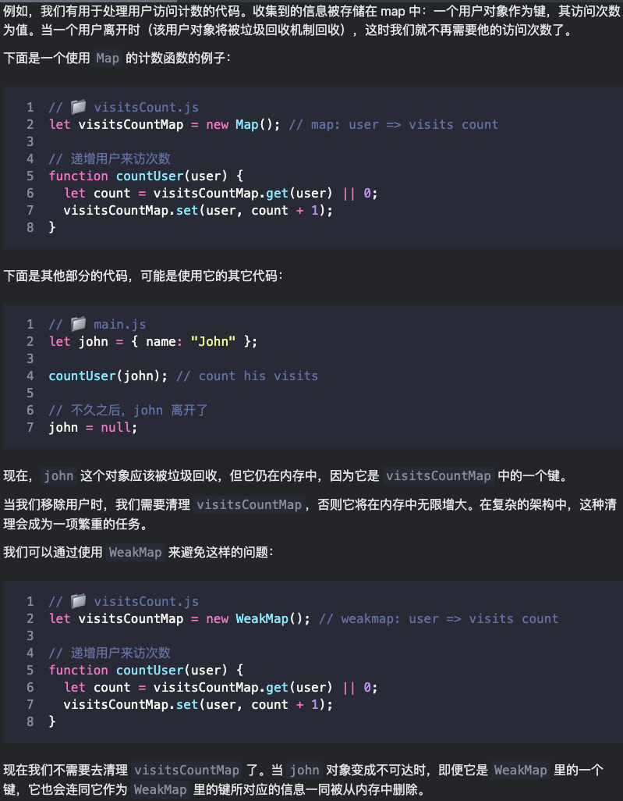
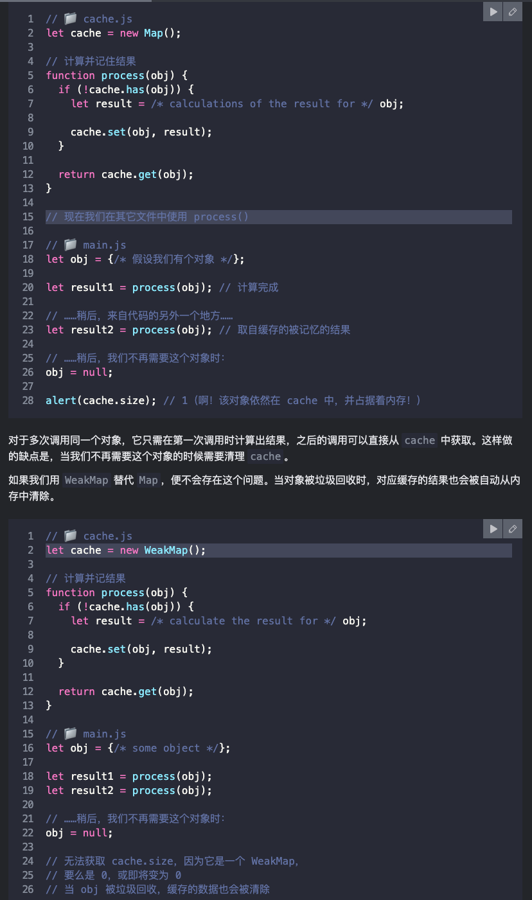

## Map
Map 是一个带键(键是唯一的)的数据项的**可迭代、有序**集合(它会记住键的插入顺序)。使用Map构造函数可以传入一个带有键值对的数组（或其它可迭代对象）来进行初始化。
<CodeRun>{`
let map = new Map();
console.log( Object.prototype.toString.call(map) ); // "[object Map]"
console.log( typeof map);                           // "object"
`}</CodeRun>

:::info
[Map与Object的比较](https://developer.mozilla.org/zh-CN/docs/Web/JavaScript/Reference/Global_Objects/Map#object_%E5%92%8C_map_%E7%9A%84%E6%AF%94%E8%BE%83)

Map 使用 [SameValueZero 算法](https://tc39.github.io/ecma262/#sec-samevaluezero) 来比较键是否相等。它和严格等于 `===` 差不多，但区别是 `NaN` 被看成是等于 `NaN`。所以 `NaN` 也可以被用作键。这个算法不能被改变或者自定义。
:::

<CodeRun>{`
// Map 还可以使用对象作为键。
let john = { name: "John" };
// 存储每个用户的来访次数
let visitsCountMap = new Map();
// john 是 Map 中的键
visitsCountMap.set(john, 123);
console.log( visitsCountMap.get(john) ); // 123
// plain object会将键转化为字符串
let ben = { name: "Ben" };
let visitsCountObj = {};
visitsCountObj[ben] = 234; // 尝试将对象 ben 用作键
visitsCountObj[john] = 123; // 尝试将对象 john 用作键，但我们会发现使用对象 ben 作为键存下的值会被替换掉
// 变成这样了！
console.log( visitsCountObj["[object Object]"] ); // 123
`}</CodeRun>

### Map的方法和属性
- `new Map([iterable])` —— 创建 map，入参（可选）为一个元素是键值对的数组或其他可迭代对象（例如，包含两个元素的数组，如 `[[ 1, 'one' ],[ 2, 'two' ]]`）每个键值对都被添加到新的 Map 中。
- `map.set(key, value)` —— 根据键存储值。每一次 `map.set` 调用都会返回 `map` 本身，所以我们可以进行“链式”调用：`map.set('1', 'str1').set(1, 'num1').set(true, 'bool1');`
- `map.get(key)` —— 根据键来返回值，如果 map 中不存在对应的 key，则返回 `undefined`。
- `map.has(key)` —— 如果 key 存在则返回 true，否则返回 false。
- `map.delete(key)` —— 删除指定键的值，如果在调用时 key 存在，则返回 true，否则返回 false。
- `map.clear()` —— 清空 map。
- `map.size` —— 返回当前元素个数。
- `map.keys()` —— 遍历并返回一个包含所有键的可迭代对象。
- `map.values()` —— 遍历并返回一个包含所有值的可迭代对象。
- `map.entries()` —— 遍历并返回一个包含所有实体 `[key, value]` 的可迭代对象，`map`应用`for..of`时 在默认情况下使用的就是这个。
- `map.forEach()` —— 迭代map

<CodeRun>{`
// 使用 键值对[key, value]数组 初始化Map
let recipeMap = new Map([
  ['cucumber', 500],
  ['tomatoes', 350],
  ['onion',    50]
]);
// 遍历所有的键
for (let vegetable of recipeMap.keys()) {
  console.log( vegetable ); // "cucumber", "tomatoes", "onion"
}
// 遍历所有的值
for (let amount of recipeMap.values()) {
  console.log( amount ); // 500, 350, 50
}
// 遍历所有的实体 [key, value]
for (let entry of recipeMap) { // 与 recipeMap.entries() 相同
  console.log(entry); // ["cucumber", 500] ["tomatoes", 350] ["onion", 50]
}
// 对每个键值对 (key, value) 运行 forEach 函数
recipeMap.forEach( (value, key, map) => {
  console.log(key + ': ' + value); // "cucumber: 500" "tomatoes: 350" "onion: 50"
});
`}</CodeRun>

## Set
Set 是一个特殊的类型集合 —— “值的集合”（没有键），它的每一个值(无论是原始值还是对象引用)只能出现一次。可以按照插入顺序迭代集合中的元素。
<CodeRun>{`
let set = new Set();
console.log( Object.prototype.toString.call(set) );
console.log( typeof set);
`}</CodeRun>

### Set的方法和属性
- `new Set([iterable])` —— 如果传入一个可迭代对象（如数组`[1, 2, 3, 4, 5]`），它的所有元素将不重复地被添加到新的 Set 中。如果不指定此参数或其值为 `null`，则新的 Set 为空。
- `set.add(value)` —— 添加一个值，返回 set 本身
- `set.delete(value)` —— 删除值，如果 value 在这个方法调用的时候存在则返回 true ，否则返回 false。
- `set.has(value)` —— 如果 value 在 set 中，返回 true，否则返回 false。
- `set.clear()` —— 清空 set。
- `set.size` —— 返回元素个数。
- `set.keys()` —— 遍历并返回一个包含所有值的可迭代对象。
- `set.values()` —— 与 `set.keys()` 作用相同，这是为了兼容 Map。
- `set.entries()` —— 遍历并返回一个包含所有的实体 `[value, value]` 的可迭代对象，它的存在也是为了兼容 Map。
- `set.forEach((value,value,set)=>{})` —— 迭代set（注意：回调函数的前两个入参是同一个值，也是为了兼容 Map）

<CodeRun>{`
let set = new Set();
let john = { name: "John" };
let pete = { name: "Pete" };
let mary = { name: "Mary" };
// visits，一些访客来访好几次
set.add(john);
set.add(pete);
set.add(mary);
set.add(john);
set.add(mary);
// set 只保留不重复的值
console.log( set.size );  // 3
for (let user of set) {
  console.log(user.name); // "John"（然后 "Pete" 和 "Mary"）
}
`}</CodeRun>

## WeakMap
:::info
通常，当对象、数组之类的数据结构在内存中时，它们的子元素，如对象的属性、数组的元素都被认为是可达的。例如:
- 如果把一个对象放入到数组中，那么只要这个数组存在，那么这个对象也就存在，即使没有其他对该对象的引用。
  <CodeRun>{`
  let john = { name: "John" };
  let array = [ john ];
  john = null; // 覆盖引用
  // 前面由 john 所引用的那个对象被存储在了 array 中
  // 所以它不会被垃圾回收机制回收
  // 我们可以通过 array[0] 获取到它
  console.log( array[0] ) // {name: "John"}
  `}</CodeRun>

- 如果我们使用对象作为常规 Map 的键，那么当 Map 存在时，该对象也将存在。它会占用内存，并且不会被（垃圾回收机制）回收。
  <CodeRun>{`
  let john = { name: "John" };
  let map = new Map();
  map.set(john, "...");
  john = null; // 覆盖引用
  // john 被存储在了 map 中
  console.log( map.has(john) ) // false
  // 我们可以使用 map.keys() 来获取它
  for (let key of map.keys()) {
    console.log( key ) // {name: "John"}
  }
  `}</CodeRun>
:::

### WeakMap的方法
:::tip
WeakMap 的键必须是对象，不能是原始值。

```js
let weakMap = new WeakMap();

let obj = {};

weakMap.set(obj, "ok"); // 正常工作（以对象作为键）

// 不能使用字符串作为键
weakMap.set("test", "Whoops"); // TypeError: Invalid value used as weak map key，因为 "test" 不是一个对象
```
:::

- WeakMap 只有以下的方法：
  - weakMap.get(key)
  - weakMap.set(key, value)
  - weakMap.delete(key)
  - weakMap.has(key)

- WeakMap **不支持迭代**以及 keys()，values() 和 entries() 方法。所以没有办法获取 WeakMap 的所有键或值。

### WeakMap与垃圾回收
- WeakMap 不会阻止垃圾回收机制对作为键的对象（key object）的回收。如果在 WeakMap 中使用一个对象作为键，并且没有其他对这个对象的引用，则该对象将会被从内存中自动清除。
  <CodeRun>{`
  let john = { name: "John" };
  let weakMap = new WeakMap();
  weakMap.set(john, "...");
  john = null; // 覆盖引用
  // john 被从内存中删除了！
  console.log( weakMap.get(john) ) // undefined
  `}</CodeRun>

:::info
如果一个对象丢失了其它所有引用，那么它就会被垃圾回收机制自动回收。但是不能准确知道 何时会被回收。这些都是由 JavaScript 引擎决定的。JavaScript 引擎可能会选择立即执行内存清理，如果现在正在发生很多删除操作，那么 JavaScript 引擎可能就会选择等一等，稍后再进行内存清理。
:::

### WeakMap的应用场景
- WeakMap 的主要应用场景是 额外数据的存储。



- WeakMap 的另一个应用场景是缓存，存储（“缓存”）函数的结果，以便将来对同一个对象的调用可以重用这个结果。



## WeakSet
- 只能向 WeakSet 添加对象（而不能是原始值）。

- 对象只有在其它某个（些）地方能被访问的时候，才能留在 WeakSet 中。

- WeakSet 支持 add，has 和 delete 方法，但不支持 size 和 keys()，并且**不可迭代**。

<CodeRun>{`
let visitedSet = new WeakSet();
let john = { name: "John" };
let pete = { name: "Pete" };
let mary = { name: "Mary" };
visitedSet.add(john); // John 访问了我们
visitedSet.add(pete); // 然后是 Pete
visitedSet.add(john); // John 再次访问
// visitedSet 现在有两个用户了
// 检查 John 是否来访过？
console.log( visitedSet.has(john) ); // true
// 检查 Mary 是否来访过？
console.log(visitedSet.has(mary)); // false
john = null;
// visitedSet 将被自动清理(即自动清除其中已失效的值 john)
console.log( visitedSet.has(john) ); // false
`}</CodeRun>