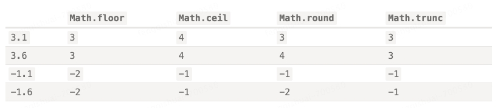
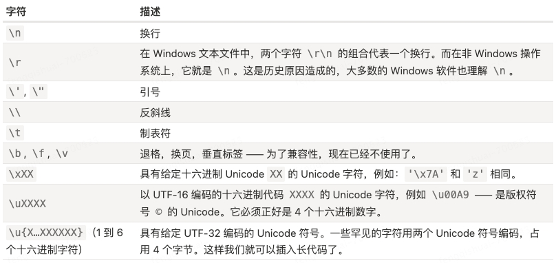
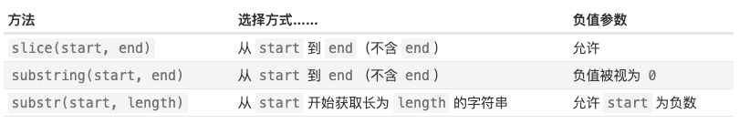
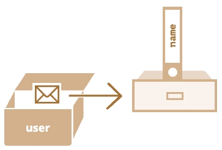
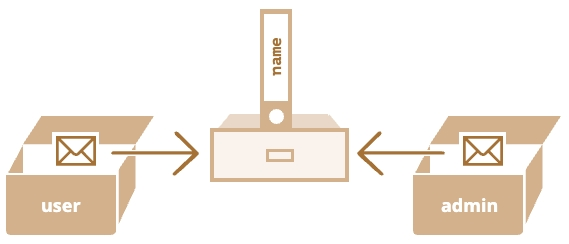

:::info
JavaScript 没有输入或输出的概念，它是一个在宿主环境（host environment）下运行的脚本语言，任何与外界沟通的机制都是由宿主环境提供的。浏览器是最常见的宿主环境，但在非常多的其他程序中也包含 JavaScript 解释器，如 Adobe Acrobat、Adobe Photoshop、SVG 图像、Yahoo！的 Widget 引擎，Node.js 之类的服务器端环境，NoSQL 数据库（如开源的 [Apache CouchDB](https://couchdb.apache.org/))、嵌入式计算机，以及包括 [GNOME](https://www.gnome.org/)（注：GNU/Linux 上最流行的 GUI 之一）在内的桌面环境等等。

JavaScript 是一种多范式的“动态类型”（dynamically typed）语言，它包含类型、运算符、标准内置（built-in）对象和方法。
> “动态类型”（dynamically typed）的编程语言，意思是虽然编程语言中有不同的数据类型，但是你定义的变量并不会在定义后，被限制为某一数据类型。

JavaScript 支持面向对象编程。JavaScript是通过**[原型链（prototype chain）](https://developer.mozilla.org/zh-CN/docs/Web/JavaScript/Inheritance_and_the_prototype_chain)**而不是 [类](https://developer.mozilla.org/zh-CN/docs/Web/JavaScript/Reference/Classes) 来支持面向对象编程。

JavaScript 也支持函数式编程。在JavaScript中，函数也是对象，函数也可以被保存在变量中，并且像其他对象一样被传递。

学习资料：
- [重新介绍 JavaScript](https://developer.mozilla.org/zh-CN/docs/Web/JavaScript/Language_Overview)
- [Learn ES2015](https://babeljs.io/docs/en/learn)
- [ecma](https://www.ecma-international.org/)
- [tc39](https://tc39.es/) 所属 Ecma International 的 TC39 是一个由 JavaScript 开发者、实现者、学者等组成的团体，与 JavaScript 社区合作维护和发展 JavaScript 的标准。
:::

## 严格模式
- "use strict" 或者 'use strict'，当它处于脚本文件的顶部（请确保 "use strict" 出现在脚本的最顶部，否则严格模式可能无法启用。只有注释可以出现在 "use strict" 的上面。）时，则整个脚本文件都将以“现代”模式进行工作。
- "use strict" 可以被放在函数体的开头，这样则可以只在该函数中启用严格模式。
- 现代 JavaScript 支持 “class” 和 “module”，它们会自动启用 use strict。因此，如果我们使用它们，则无需添加 "use strict" 指令。

例如，旧版本中可以简单地通过赋值来创建一个变量。现在如果我们不在脚本中使用 use strict 声明启用严格模式，这仍然可以正常工作，这是为了保持对旧脚本的兼容。
```js
// 注意：这个例子中没有 "use strict"

num = 5; // 如果变量 "num" 不存在，就会被创建

alert(num); // 5
```
```js
"use strict";

num = 5; // 错误：num 未定义
```

## 数据类型-概述
在 JavaScript 中有 8 种基本的数据类型（7 种原始类型和 1 种引用类型）：
1. 七种原始数据类型：
- "number" 用于任何类型的数字：整数或浮点数，在 ±(2^53-1) 范围内的整数。
- "bigint" 用于任意长度的整数。
- "string" 用于字符串：一个字符串可以包含 0 个或多个字符，所以没有单独的单字符类型。
- "boolean" 用于 true 和 false。
- "null" 用于未知的值 —— 只有一个 `null` 值的独立类型。
- "undefined" 用于未定义的值 —— 只有一个 `undefined` 值的独立类型。
- "symbol" 用于唯一的标识符。

2. 一种非原始数据类型：
- "object" 用于更复杂的数据结构。

## 数据类型-Number类型
Number 类型，包括整数和浮点数，还包括所谓的“特殊数值（special numeric values）”：`Infinity`、`-Infinity` 和 `NaN`。
- `Infinity` 代表数学概念中的 无穷大 ，是一个比任何数字都大的特殊值。`alert( 1 / 0 ); // Infinity` `alert( 1e500 ); // Infinity`

- `NaN` 代表一个计算错误。它是一个不正确的或者一个未定义的数学操作所得到的结果。`NaN` 是粘性的:任何对 `NaN` 的进一步数学运算都会返回 `NaN`（只有一个例外：`NaN ** 0` 结果为 1）。
> 幂（`**`）运算符返回第一个操作数取第二个操作数的幂的结果。它等价于 `Math.pow()`，不同之处在于，它还接受 `BigInt` 作为操作数。

<CodeRun>
{
  `
  console.log( "not a number" / 2 ); // NaN，这样的除法是错误的
  console.log( NaN + 1 ); // NaN
  console.log( 3 * NaN ); // NaN
  console.log( "not a number" / 2 - 1 ); // NaN
  console.log( NaN ** 0 ); // 1
  `
}
</CodeRun>

- `isNaN(value)` 将`value`转换为数字，然后测试它是否为 `NaN`
  ```js
  alert( isNaN(NaN) );   // true
  alert( isNaN("str") ); // true
  ```

- `isFinite(value)` 将`value`转换为数字，转换后如果是常规数字而不是 `NaN`或`Infinity`或`-Infinity`，则返回 true
  ```js
  alert( isFinite("15") );     // true
  alert( isFinite("str") );    // false，因为是一个特殊的值：NaN
  alert( isFinite(Infinity) ); // false，因为是一个特殊的值：Infinity
  alert( isFinite(null) );     // true
  alert( isFinite('') );       // true
  ```

:::tip
请注意，在所有数字函数中，包括 `isFinite`，空字符串或仅有空格的字符串均被视为 `0`。
:::

- 下划线分隔符 使得数字具有更强的可读性。JavaScript 引擎会直接忽略数字之间的 `_`
  ```js
  let billion = 1_000_000_000;
  ```

- 使用字母`e`指定零的个数来缩短数字。例如 `e3`表示`乘以10的3次方`；`e-3`表示`除以10的3次方`
  ```js
  let billion = 1e9;  // 10 亿，字面意思：数字 1 后面跟 9 个 0

  alert( 7.3e9 );  // 73 亿（与 7300000000 和 7_300_000_000 相同）

  1e3 === 1 * 1000; // e3 表示 *1000

  1.23e6 === 1.23 * 1000000; // e6 表示 *1000000

  0.000001 === 1e-6; // 1 / 10**6
  ```

- 十六进制数字使用`0x`前缀，二进制数字使用`0b`前缀，八进制数字使用`0o`前缀。只有这三种进制支持这种写法。对于其他进制，应该使用函数`parseInt`
  ```js
  alert( 0xff ); // 255
  alert( 0xFF ); // 255（一样，大小写没影响）

  let a = 0b11111111; // 二进制形式的 255
  let b = 0o377;      // 八进制形式的 255
  alert( a == b );    // true，两边是相同的数字，都是 255
  ```

- 存在两个零：0 和 -0。这是因为在存储时，使用一位来存储符号（64位存储一个数字：其中 52位被用于存储这些数字，11位用于存储小数点的位置，1位用于符号），因此对于包括零在内的任何数字，可以设置这一位或者不设置。

### `toString(base)`
方法 `toString(base)` 返回给定 `base` 进制 的字符串表示形式。`base` 的范围可以从 2 到 36。默认情况下是 10。
- base=16 用于十六进制颜色，字符编码等，数字可以是 0..9 或 A..F。
- base=2 主要用于调试按位操作，数字可以是 0 或 1。
  ```js
  let num = 255;

  alert( num.toString(16) );  // ff
  alert( num.toString(2) );   // 11111111
  ```
- base=36 是最大进制，数字可以是 0..9 或 A..Z。所有拉丁字母都被用于了表示数字。对于 36 进制来说，一个有趣且有用的例子是，当我们需要将一个较长的数字标识符转换成较短的时候，例如做一个短的 URL。可以简单地使用基数为 36 的数字系统表示:
  ```js
  alert( 123456..toString(36) ); // 2n9c
  ```

:::info
如果我们想直接在一个数字上调用一个方法，比如上面例子中的 toString，那么我们需要在它后面放置两个点 `..`。如果我们放置一个点：`123456.toString(36)`，那么就会出现一个 error，因为 JavaScript 语法隐含了第一个点之后的部分为小数部分。如果我们再放一个点，那么 JavaScript 就知道小数部分为空，现在使用该方法。也可以写成 `(123456).toString(36)`。
:::

### 舍入
对数字进行舍入的内建函数:
- `Math.floor` 向下舍入
- `Math.ceil` 向上舍入
- `Math.round` 向最近的整数舍入（0到4 会被舍去，而 5到9 会进一位）
- `Math.trunc` 移除小数点后的所有内容而没有舍入



#### 将数字舍入到小数点后 n 位
有两种方式:
1. 乘除法。例如，要将数字舍入到小数点后两位，我们可以将数字乘以 100，调用舍入函数，然后再将其除回。
   ```js
   let num = 1.23456;

   alert( Math.round(num * 100) / 100 ); // 1.23456 -> 123.456 -> 123 -> 1.23
   ```

2. 函数 `toFixed(n)` 将数字舍入到小数点后 n 位（这会向上或向下舍入到最接近的值(0到4 会被舍去，而 5到9 会进一位)，类似于 `Math.round`），并以字符串形式返回结果。
   ```js
   let num = 12.34;
   alert( num.toFixed(1) ); // "12.3"

   let num = 12.36;
   alert( num.toFixed(1) ); // "12.4"

   // 注意 toFixed 的结果是一个字符串。如果小数部分比所需要的短，则在结尾添加零
   let num = 12.34;
   alert( num.toFixed(5) ); // "12.34000"，在结尾添加了 0，以达到小数点后五位
   ```

### 精度损失
- 在十进制数字系统中，可以保证以 10 的整数次幂作为除数能够正常工作，但是以 3 作为除数则不能（1/3 是无限循环小数 0.33333(3)）。同样的原因，在二进制数字系统中，可以保证以 2 的整数次幂作为除数时能够正常工作，但 1/10（0.1）就变成了一个无限循环的二进制小数（0.0 0011 0011 0011(0011) 0011无限循环）。在内部，数字是以 64 位格式 IEEE-754 表示的，所以正好有 64 位可以存储一个数字：其中 52 位被用于存储这些数字，其中 11 位用于存储小数点的位置，而 1 位用于符号。无限循环小数超出64位，会被截断处理，就会损失精度。
  ```js
  alert( 0.1 + 0.2 == 0.3 ); // false

  alert( 0.1 + 0.2 ); // 0.30000000000000004
  ```

- IEEE-754 数字格式通过将数字舍入到最接近的可能数字来解决此问题。这些舍入规则通常不允许我们看到“极小的精度损失”，但是它确实存在。
  ```js
  alert( 0.1.toFixed(20) ); // 0.10000000000000000555
  alert( 9999999999999999 ); // 显示 10000000000000000
  ```

- 最可靠的方法是借助方法 `toFixed(n)` 对结果进行舍入，以解决精度损失的问题（即，在必要时剪掉其“尾巴”来对其进行舍入）
  ```js
  let sum = 0.1 + 0.2;
  alert( sum.toFixed(2) ); // "0.30"
  alert( +sum.toFixed(2) ); // 0.3
  ```
  :::warning
  为什么 6.35 被舍入为 6.3 而不是 6.4？
  <CodeRun>{`
  console.log( 6.35.toFixed(1) ); // "6.3"
  console.log( 1.35.toFixed(1) ); // "1.4"
  `}</CodeRun>
  在内部，6.35 的小数部分是一个无限的二进制，它的存储会造成精度损失。精度损失可能会导致数字的增加和减小。
  <CodeRun>{`
  // 可以看到 6.35 存储的其实是 6.34999...
  console.log( 6.35.toFixed(20) ); // "6.34999999999999964473"
  console.log( 1.35.toFixed(20) ); // "1.35000000000000008882"
  `}</CodeRun>
  应该如何解决 6.35 的舍入问题呢？在进行舍入前，我们应该使其更接近整数：
  <CodeRun>{`
  console.log( Math.round(6.35 * 10) / 10); // 6.35 -> 63.5 -> 64(rounded) -> 6.4
  // 63.5 完全没有精度损失。这是因为小数部分 0.5 实际上是 1/2，以 2 的整数次幂为分母的小数在二进制数字系统中可以被精确地表示。
  console.log( (6.35 * 10).toFixed(20) );   // "63.50000000000000000000"
  `}</CodeRun>
  :::

- 乘/除法可以减少误差，但不能完全消除误差。
  ```js
  alert( (0.1 * 10 + 0.2 * 10) / 10 ); // 0.3
  alert( (0.28 * 100 + 0.14 * 100) / 100); // 0.4200000000000001
  ```

- 由于精度损失的问题存在，所以在处理小数时应避免相等性检查。

### `parseInt` 和 `parseFloat`
`parseInt` 和 `parseFloat` 可以从字符串中“读取”数字，直到无法读取为止。如果发生 error，则返回收集到的数字。函数 `parseInt` 返回一个整数，而 `parseFloat` 返回一个浮点数
<CodeRun>{`
console.log( parseInt('100px') );    // 100
console.log( parseFloat('12.5em') ); // 12.5
console.log( parseInt('12.3') );     // 12，只有整数部分被返回了
console.log( parseFloat('12.3.4') ); // 12.3，在第二个点处停止了读取
`}</CodeRun>

- 如果第一个字符就是非数字，则会返回`NaN`
  <CodeRun>{`
  console.log( parseInt('a123') );
  console.log( parseFloat('a123') );
  `}</CodeRun>

- `parseInt` 函数具有可选的第二个参数，它指定了数字系统的基数，因此 `parseInt` 还可以解析十六进制数字、二进制数字等的字符串
  <CodeRun>{`
  console.log( parseInt('0xff', 16) ); // 255
  console.log( parseInt('ff', 16) );   // 255，没有 0x 仍然有效
  console.log( parseInt('2n9c', 36) ); // 123456
  `}</CodeRun>

### 其他数学函数
JavaScript 有一个内建的 Math 对象，它包含了一个小型的数学函数和常量库。
- `Math.random()` 返回一个从 0 到 1 的随机数（不包括 1）
- `Math.max(a, b, c...)` 从任意数量的参数中返回最大值
- `Math.min(a, b, c...)` 从任意数量的参数中返回最小值
- `Math.pow(n, power)` 返回 n 的给定（power）次幂
- ...等等

## 数据类型-BigInt类型
- 在 JavaScript 中，Number 类型超出安全整数范围 ±(2^53-1) 会出现精度问题，因为并非所有数字都适合固定的 64 位存储。因此，可能存储的是“近似值”。如下两个数字（正好超出了安全整数范围）是相同的：
<CodeRun>
{
  `
  console.log(9007199254740991 + 1); // 9007199254740992
  console.log(9007199254740991 + 2); // 9007199254740992
  `
}
</CodeRun>

- BigInt 类型用于表示任意长度的整数。可以通过将 `n` 附加到整数字段的末尾来创建 BigInt 值。
  ```js
  // 尾部的 "n" 表示这是一个 BigInt 类型
  const bigInt = 1234567890123456789012345678901234567890n;
  ```


## 数据类型-String类型
- 字符串的内部使用 UTF-16 编码(即：每个字符都有对应的数字代码)，它不依赖于页面编码。
- 单引号和双引号基本相同。反引号允许我们通过 `${…}` 将任何表达式嵌入到字符串中。使用反引号的另一个优点是它们允许字符串跨行。
- 反引号还允许我们在第一个反引号之前指定一个“模版函数”。语法是：
  ```js
  func`string` // 函数 func 被自动调用，接收字符串和嵌入式表达式，并处理它们。
  ```

- 要获取在 `pos` 位置的一个字符，可以使用方括号 `[pos]` 或者调用 `charAt(pos)` 方法（第一个字符从零位置开始）。它们之间的唯一区别是，如果没有找到字符，方括号 `[pos]` 返回 `undefined`，而 `charAt(pos)` 方法 返回一个空字符串。
  ```js
  let str = `Hello`;

  alert( str[1000] );        // undefined
  alert( str.charAt(1000) ); // ''（空字符串）
  ```

- 也可以使用 `for..of` 遍历字符串，即字符串是可迭代的。
  ```js
  for (let char of "Hello") {
    alert(char); // H,e,l,l,o
  }
  ```

- 在 JavaScript 中，字符串不可更改。
  ```js
  let str = 'Hi';

  str[0] = 'h'; // 非严格模式下会忽略；严格模式下会报错 TypeError: Cannot assign to read only property '0' of string 'Hi'
  console.log(str[0]);
  ```

- `toLowerCase()` 和 `toUpperCase()` 方法可以改变大小写
  ```js
  alert( 'Interface'.toUpperCase() );    // INTERFACE
  alert( 'Interface'.toLowerCase() );    // interface
  alert( 'Interface'[0].toLowerCase() ); // 'i'
  ```

### 特殊字符
- 所有的特殊字符都以反斜杠字符 `\` 开始。它也被称为“转义字符”。


- 注意：反斜杠 `\` 在 JavaScript 中用于正确读取字符串，然后消失。用作转义字符时，内存中的字符串没有 `\`。

换行符：
```js
let str1 = "Hello\nWorld"; // 使用“换行符”创建的两行字符串

// 使用反引号和普通的换行创建的两行字符串
let str2 = `Hello
World`;

alert(str1 == str2); // true
```

Unicode 示例:
```js
alert( "\u00A9" );    // ©
alert( "\u{20331}" ); // 佫，罕见的中国象形文字（长 Unicode）
alert( "\u{1F60D}" ); // 😍，笑脸符号（另一个长 Unicode）
```

### `length`属性
`length`属性表示字符串长度。请注意 `length` 是一个属性，而不是函数，后面不需要添加括号。
```js
alert( `My\n`.length ); // 3 注意 \n 是一个单独的“特殊”字符
```

### 查找子字符串
#### `indexOf(substr, pos)` 和 `lastIndexOf(substr, position)`
`indexOf(substr, pos)` 从给定位置 `pos`(可选参数) 开始，在 str 中查找 substr，如果没有找到，则返回 -1，否则返回匹配成功的位置。检索是大小写敏感的。
```js
let str = 'Widget with id';

alert( str.indexOf('Widget') ); // 0，因为 'Widget' 一开始就被找到
alert( str.indexOf('widget') ); // -1，没有找到，检索是大小写敏感的

alert( str.indexOf("id") ); // 1，"id" 在位置 1 处（……idget 和 id）
// 从位置 2 开始检索
alert( str.indexOf('id', 2) ) // 12
```

查找子字符串的所有位置：
```js
let str = "As sly as a fox, as strong as an ox";
let target = "as";

let pos = -1;
while ((pos = str.indexOf(target, pos + 1)) != -1) {
  alert( pos );
}
```

`lastIndexOf(substr, position)` 从字符串的末尾开始搜索到开头。

#### Bitwise NOT (`~`) 按位取反
- `~` 将数字转换为 32-bit 整数（如果存在小数部分，则删除小数部分），然后对其二进制表示形式中的所有位均取反。
- 对于 32-bit 整数，`~n` 等于 `-(n+1)`。
  ```js
  alert( ~2 );  // -3，和 -(2+1) 相同
  alert( ~1 );  // -2，和 -(1+1) 相同
  alert( ~0 );  // -1，和 -(0+1) 相同
  alert( ~-1 ); // 0，和 -(-1+1) 相同
  ```
- 如上，只有当 `n == -1` 时，`~n` 才为零（适用于任何 32-bit 带符号的整数 n）。可以用它来简写 `indexOf` 检查: 仅当 `indexOf` 的结果不是 -1 时，检查 `if ( ~str.indexOf("...") )` 才为真。注意：种检查只有在字符串没有那么长的情况下才是正确的。
  ```js
  let str = "Widget";

  if (~str.indexOf("Widget")) {
    alert( 'Found it!' ); // 正常运行
  }
  ```

#### includes，startsWith，endsWith
`str.includes(substr, pos)` 根据 str 中是否包含 substr 来返回 true/false。第二个可选参数是开始搜索的起始位置。
```js
alert( "Widget".includes("id") );    // true
alert( "Widget".includes("id", 3) ); // false, 从位置 3 开始没有 "id"
```
```js
alert( "Widget".startsWith("Wid") ); // true，"Widget" 以 "Wid" 开始
alert( "Widget".endsWith("get") );   // true，"Widget" 以 "get" 结束
```

### 获取子字符串
JavaScript 中有三种获取字符串的方法：substring、substr 和 slice。

#### `str.slice(start [, end])`
返回字符串从 start 到（但不包括）end 的部分。如果没有第二个参数，slice 会一直运行到字符串末尾。不影响原字符串。
```js
let str = "stringify";
alert( str.slice(0, 5) ); // 'strin'，从 0 到 5 的子字符串（不包括 5）
alert( str.slice(0, 1) ); // 's'，从 0 到 1，但不包括 1，所以只有在 0 处的字符
alert( str.slice(2) );    // 'ringify' 从第二个位置直到结束
```

start/end 也有可能是负值，意思是起始位置从字符串结尾计算
```js
let str = "stringify";

// 从右边的第四个位置开始，在右边的第一个位置结束
alert( str.slice(-4, -1) ); // 'gif'
```

#### `str.substring(start [, end])`
返回字符串从 start 到（但不包括）end 的部分。与 `slice` 的区别是，`substring` 允许 start 大于 end；`substring` 不支持负参数（负参数被视为 0）。
```js
let str = "stringify";

// 如下对于 substring 是相同的
alert( str.substring(2, 6) ); // "ring"
alert( str.substring(6, 2) ); // "ring"

// ……但对 slice 是不同的：
alert( str.slice(2, 6) ); // "ring"（一样）
alert( str.slice(6, 2) ); // ""（空字符串）
```

#### `str.substr(start [, length])`
返回字符串从 start 开始的给定 length 的部分。第一个参数可能是负数，表示从结尾算起。
```js
let str = "stringify";
alert( str.substr(2, 4) );  // 'ring'，从位置 2 开始，获取 4 个字符
alert( str.substr(-4, 2) ); // 'gi'，从第 4 位获取 2 个字符
```
:::warning
`substr` 有一个小缺点：它不是在 JavaScript 核心规范中描述的，而是在附录 B 中。附录 B 的内容主要是描述因历史原因而遗留下来的仅浏览器特性。因此，理论上非浏览器环境可能无法支持 `substr`，但实际上它在别的地方也都能用。
:::

## 数据类型-Boolean类型
Boolean类型仅包含两个值：true 和 false。

## 数据类型-null
JavaScript 中的 `null` 仅仅是一个代表“无”、“空”或“值未知”的特殊值。

## 数据类型-undefined
`undefined` 的含义是 未被赋值。如果一个变量已被声明，但未被赋值，那么它的值就是 `undefined`。从技术上讲，可以显式地将 `undefined` 赋值给变量，但是不建议这样做。**通常，使用 `null` 将一个“空”或者“未知”的值写入变量中，而 `undefined` 则保留作为未进行初始化的事物的默认初始值。**

## 数据类型-Symbol类型
- 可以使用 `Symbol()` 来创建这种类型的值，Symbol 类型的值表示唯一的标识符。
  ```js
  let id = Symbol();
  ```

- 创建时，我们可以给 symbol 一个描述（也称为 symbol 名）。symbol 保证是唯一的。即使我们创建了许多具有相同描述的 symbol，它们的值也是不同。描述只是一个标签，不影响任何东西。
  <CodeRun>{`
  let id1 = Symbol("id");
  let id2 = Symbol("id");
  console.log( id1 == id2 ); // false
  `}</CodeRun>

- Symbol值 不会被自动转换为字符串
  ```js
  let id = Symbol("id");
  alert(id); // TypeError: Cannot convert a Symbol value to a string 类型错误：无法将 Symbol 值转换为字符串。
  ```
  <CodeRun>{`
  let id = Symbol("id");
  console.log( id.toString() );  // "Symbol(id)"
  console.log( id.description ); // "id"
  `}</CodeRun>

- Symbol值 可以作为对象的“隐藏”属性。如果我们想要向“属于”另一个脚本或者库的对象添加一个属性，我们可以创建一个 symbol 并使用它作为属性的键。使用 `Symbol("id")` 作为键，比起用字符串 "id" 来有什么好处呢？假如我们使用第三方库的`user`对象，向它添加字符串属性是不安全的，因为可能会影响代码库中的其他预定义行为。但 symbol 属性不会被意外访问到。第三方代码不会知道新定义的 symbol，因此将 symbol 添加到 `user` 对象是安全的。
  ```js
  let user = { // 假设属于第三方代码库
    name: "John"
  };

  let id = Symbol("id");

  user[id] = 1;

  let id = Symbol("id");

  user[id] = "Their id value"; // 不会有冲突，因为 symbol 总是不同的，即使它们有相同的名字。

  // 如果使用字符串作为属性key
  user.id = "Our id value";

  user.id = "Their id value"; // 无意中重写了 id！
  ```
  :::info
  从技术上说，symbol 不是 100% 隐藏的。有一个内建方法 `Object.getOwnPropertySymbols(obj)` 允许我们获取所有的 symbol。还有一个名为 `Reflect.ownKeys(obj)` 的方法可以返回一个对象的 所有 键，包括 symbol。但大多数库、内建方法和语法结构都没有使用这些方法。
  :::
  :::tip
  [使用Reflect.ownKeys判断对象自身为空](https://mp.weixin.qq.com/s/0vSXkIgoGNIGN6mNOTQCiA)，`Reflect.ownKeys` 方法返回一个由目标对象自身的属性组成的数组，它的返回值等同于 `Object.getOwnPropertyNames(target).concat(Object.getOwnPropertySymbols(target))`
  <CodeRun>{`
  const a = Symbol()
  const obj1 = {
    [a]: 1
  }
  const obj2 = {b: 2}
  const obj3 = {}
  Object.defineProperty(obj3, 'a', {
    value: 1,
    enumerable: false
  })
  const obj4 = {}
  // 测试
  console.log(Reflect.ownKeys(obj1).length === 0)  // false
  console.log(Reflect.ownKeys(obj2).length === 0)  // false
  console.log(Reflect.ownKeys(obj3).length === 0)  // false
  console.log(Reflect.ownKeys(obj4).length === 0)  // true
  `}</CodeRun>
  :::

- 在对象字面量 `{...}` 中使用 symbol，需要使用方括号把它括起来。
  ```js
  let id = Symbol("id");

  let user = {
    name: "John",
    [id]: 123 // 而不是 "id"：123
  };
  ```

- symbol属性在 `for…in`、`Object.keys(...)`、`Object.values(...)`、`Object.entries(...)` 中会被忽略。
  <CodeRun>{`
  let id = Symbol("id");
  let user = {
    name: "John",
    age: 30,
    [id]: 123
  };
  // for..in 会忽略symbol属性
  for (let key in user) console.log( key );             // "name" "age"（没有 symbol）
  // 可以直接访问
  console.log( "Direct: " + user[id] );                 // "Direct: 123"
  // Object.keys(...) 会忽略symbol属性
  Object.keys(user).forEach(key => console.log( key )); // "name" "age"（没有 symbol）
  `}</CodeRun>

- `Object.assign` 会同时复制字符串和 symbol 属性。
  <CodeRun>{`
  let id = Symbol("id");
  let user = {
    [id]: 123
  };
  let clone = Object.assign({}, user);
  console.log( clone[id] ); // 123
  `}</CodeRun>

### 全局symbol
- 通常所有的 symbol 都是不同的，即使它们有相同的名字。但有时我们想要名字相同的 symbol 具有相同的实体。

- 使用 `Symbol.for(key)` 可以检查全局symbol注册表，如果有一个描述为 `key` 的 symbol，则返回该 symbol，否则将创建一个新 symbol（`Symbol(key)`），并通过给定的 `key` 将其存储在注册表中。注册表内的 symbol 被称为 全局symbol。使用 `Symbol.for(key)` 多次调用 `key` 相同的 symbol 时，返回的就是同一个 symbol。
  <CodeRun>{`
  // 从全局注册表中读取
  let id = Symbol.for("id"); // 如果该 symbol 不存在，则创建它
  // 再次读取（可能是在代码中的另一个位置）
  let idAgain = Symbol.for("id");
  // 相同的 symbol
  console.log( id === idAgain );                        // true
  console.log( Symbol.for("id") === Symbol.for("id") ); // true
  console.log( Symbol("id") === Symbol("id") )          // false
  `}</CodeRun>

- 对于全局symbol，`Symbol.for(key)` 按名字返回一个 symbol；`Symbol.keyFor(sym)`通过全局symbol 返回一个名字。
  <CodeRun>{`
  // 通过 name 获取 symbol
  let sym = Symbol.for("name");
  let sym2 = Symbol.for("id");
  // 通过 symbol 获取 name
  console.log( Symbol.keyFor(sym) );  // "name"
  console.log( Symbol.keyFor(sym2) ); // "id"
  `}</CodeRun>

- `Symbol.keyFor` 内部使用全局symbol注册表来查找 symbol 的键，所以它不适用于非全局 symbol。如果 symbol 不是全局的，它将无法找到它并返回 `undefined`。
  <CodeRun>{`
  let globalSymbol = Symbol.for("name");
  let localSymbol = Symbol("name");
  console.log( Symbol.keyFor(globalSymbol) ); // "name"，全局 symbol
  console.log( Symbol.keyFor(localSymbol) );  // undefined，非全局
  console.log( localSymbol.description );     // "name"，可以使用description属性获取symbol名字
  `}</CodeRun>

### 系统symbol
JavaScript 内部有很多“系统” symbol，我们可以使用它们来改变一些内建行为。它们都被列在了 [众所周知的 symbol](https://tc39.es/ecma262/#sec-well-known-symbols) 中:
- `Symbol.hasInstance`
- `Symbol.isConcatSpreadable`
- `Symbol.iterator` 可以用作对象的属性为对象定义默认的迭代器。
  <CodeRun>{`
  const iterable1 = {};
  iterable1[Symbol.iterator] = function* () {
    yield 1;
    yield 2;
    yield 3;
  };
  console.log( [...iterable1] ); // [1, 2, 3]
  for(let item of iterable1) {
    console.log( item );
  }
  `}</CodeRun>
- `Symbol.toPrimitive`
- ……等等。

## 数据类型-Object类型
- 创建对象的2种语法: 构造函数、字面量(object literal)。
  ```js
  let user = new Object(); // “构造函数” 的语法
  let user = {};  // “字面量” 的语法
  ```

- 对象的属性(`key`)是字符串类型 或者 Symbol类型（其他类型会被自动地转换为字符串），属性的值可以是任意类型。
  ```js
  let user = {
    name: "John",         // 键 "name"，值 "John"
    age: 30,              // 键 "age"，值 30
    "likes birds": true   // 多词属性名必须加引号
    0: "test"             // 等同于 "0": "test"
  };

  // 相同的属性（数字 0 被转为字符串 "0"）
  alert( obj["0"] ); // test
  alert( obj[0] );   // test
  ```

- 可以使用 点符号 或者 方括号 访问/设置属性值。点符号要求 `key` 是有效的变量标识符，这意味着：不包含空格，不以数字开头，也不包含特殊字符（允许使用 `$` 和 `_`）。使用方括号，可用于任何字符串。方括号同样提供了一种可以通过任意表达式来获取属性名的方式(点符号不能以类似的方式使用)。
  ```js
  alert( user.name ); // John
  alert( user.age ); // 30
  alert( user["likes birds"] );
  ```
  ```js
  let key = "likes birds";

  user[key] = true; // 跟 user["likes birds"] = true; 一样

  alert( user.key ) // undefined
  ```

- 可以用 `delete` 操作符移除属性
  ```js
  delete user.age;
  delete user["likes birds"];
  ```

- 作为对象属性的函数被称为 方法(method)。
  ```js
  let user = {
    sayHi: function() {
      alert("Hello");
    }
  };

  // 方法简写
  let user = {
    sayHi() { // 与 "sayHi: function(){...}" 一样
      alert("Hello");
    }
  };
  ```

### 对象方法中的`this`
```js
let user = {
  name: "John",
  age: 30,

  sayHi() {
    // "this" 指的是“当前的对象”
    alert(this.name);
  }

};

user.sayHi(); // John
```

- 技术上讲，也可以在不使用 `this` 的情况下，通过外部变量名来引用它，但这样的代码是不可靠的。例如：
  ```js
  let user = {
    name: "John",
    age: 30,

    sayHi() {
      alert( user.name );
    }
  };

  let admin = user;
  user = null; // 重写

  admin.sayHi(); // TypeError: Cannot read property 'name' of null
  ```

  使用`this`可以避免上述错误：
  <CodeRun>{`
  let user = {
    name: "John",
    age: 30,
    sayHi() {
      console.log( this.name );
    }
  };
  let admin = user;
  user = null; // 重写
  admin.sayHi();
  `}</CodeRun>

### 计算属性
当创建一个对象时，我们可以在对象字面量中使用方括号。这叫做 计算属性。
> [计算属性名](https://developer.mozilla.org/zh-CN/docs/Web/JavaScript/Reference/Operators/Object_initializer#%E8%AE%A1%E7%AE%97%E5%B1%9E%E6%80%A7%E5%90%8D)

```js
let fruit = prompt("Which fruit to buy?", "apple");

let bag = {
  [fruit]: 5, // 属性名是从 fruit 变量中得到的
};

alert( bag.apple ); // 5 如果一个用户输入 "apple"，bag 将变为 {apple: 5}。
```
<CodeRun>
{`
let fruit = 'apple';
let bag = {
  [fruit + 'Computers']: 5 // bag.appleComputers = 5
};
console.log( bag.appleComputers )
`}
</CodeRun>

### `in`操作符
- JavaScript 的对象有一个需要注意的特性：能够被访问任何属性。即使属性不存在也不会报错！读取不存在的属性只会得到 `undefined`。
  ```js
  let user = {};

  alert( user.noSuchProperty === undefined ); // true 意思是没有这个属性
  ```

- 可以使用`in`操作符检查属性是否存在。请注意，`in` 的左边必须是 属性名，通常是一个带引号的字符串。如果我们省略引号，就意味着左边是一个变量，它应该包含要判断的实际属性名。
  <CodeRun>
  {`
  let user = { name: "John", age: 30 };
  console.log( "age" in user );           // true，user.age 存在
  console.log( "blabla" in user );        // false，user.blabla 不存在。
  let key = "age";
  console.log( key in user );             // true，属性 "age" 存在
  `}
  </CodeRun>

- 大部分情况下与 `undefined` 进行比较来判断属性是否存在就可以了。当 属性存在但存储的值是 `undefined` 时，这种比对方式会有问题，而 `in` 运算符的判断结果仍是对的。
  <CodeRun>
  {`
  let obj = {
    test: undefined
  };
  console.log( obj.test );       // 显示 undefined，所以属性不存在？
  console.log( "test" in obj );  // true，属性存在！
  `}
  </CodeRun>

- 通常情况下不应该给对象属性赋值 `undefined`。我们通常会用 `null` 来表示未知的或者空的值。

### 对象引用和复制
- 原始类型的复制
  ```js
  let message = "Hello!";
  let phrase = message;
  ```
  

- 赋值了对象(如下方的`{name:"John"}`)的变量(如下方的`user`) 存储的不是对象本身，而是该对象“在内存中的地址”，换句话说就是对该对象的“引用”。
  ```js
  let user = {
    name: "John"
  };
  // 该对象被存储在内存中的某个位置（在下图的右侧），而变量 user（在下图的左侧）保存的是对其的“引用”。
  ```
  

- 当一个对象变量被复制，其实是引用被复制，而该对象自身并没有被复制。
  ```js
  let user = { name: "John" };

  let admin = user; // 现在我们有了两个变量，它们保存的都是对同一个对象的引用。

  // 仍然只有一个对象，但现在有两个引用它的变量。

  // 可以通过其中任意一个变量来访问该对象并修改它的内容
  admin.name = 'Pete'; // 通过 "admin" 引用来修改

  alert(user.name); // 'Pete'，修改能通过 "user" 引用看到
  ```
  

- 仅当两个变量都引用同一个对象时，它们才相等。
  <CodeRun>
  {`
  let a = {};
  let b = a; // 复制引用
  console.log( a == b );  // true，都引用同一对象
  console.log( a === b ); // true
  // 引用两个独立的对象的变量并不相等，即使它们看起来很像（如都为空时）
  let c = {};
  let d = {};
  console.log( c == d );  // false
  `}
  </CodeRun>

### 对象的克隆与合并
- 克隆对象 可以创建一个新对象，通过遍历已有对象的属性，并在原始类型值的层面复制它们，以实现对已有对象结构的复制。
  <CodeRun>
  {`
  let user = {
    name: "John",
    age: 30,
  };
  let clone = {}; // 新的空对象
  // 将 user 中所有的属性拷贝到其中
  for (let key in user) {
    clone[key] = user[key];
  }
  // 现在 clone 是带有相同内容的完全独立的对象
  clone.name = "Pete"; // 改变了其中的数据
  console.log( clone );
  console.log( user.name ); // 原来的对象中的 name 属性依然是 John
  `}
  </CodeRun>

- 可以使用 `Object.assign(dest, [src1, src2, src3...])` 方法进行对象的合并及“浅拷贝”（嵌套对象被通过引用进行拷贝，即如果对象的属性也是一个对象，则拷贝后该属性的值被共享），该方法将从第二个开始的所有参数的属性都被拷贝到第一个参数的对象中。调用结果返回 `dest`。如果被拷贝的属性的属性名已经存在，那么它会被覆盖。
  <CodeRun>
  {`
  let user = { name: "John" };
  let permissions1 = { canView: true };
  let permissions2 = { canEdit: true };
  // 将 permissions1 和 permissions2 中的所有属性都拷贝到 user 中
  let cloneResult = Object.assign(user, permissions1, permissions2);
  console.log( user );
  console.log( cloneResult );
  let cloneResult2 = Object.assign(user, { name: "Pete" });
  console.log( user );
  console.log( cloneResult2 );
  `}
  </CodeRun>

- 也可以用 `Object.assign` 代替 `for..in` 循环来进行简单克隆
  <CodeRun>
  {`
  let user = {
    name: "John",
    age: 30,
  };
  let clone = Object.assign({}, user);
  console.log( clone );
  `}
  </CodeRun>

- 还可以使用 `spread` 语法 克隆对象
  <CodeRun>{`
  let user = {
    name: "John",
    age: 30,
  };
  let clone = {...user};
  console.log( clone );
  `}</CodeRun>

### 深层克隆对象
对象的属性可以是对其他对象的引用，这时简单的克隆对象后，该属性的值会以引用形式被拷贝。
<CodeRun>{`
let user = {
  name: "John",
  sizes: {
    height: 182,
    width: 50
  }
};
let clone = Object.assign({}, user);
console.log( user.sizes === clone.sizes ); // true，同一个对象
// user 和 clone 共享同一个 sizes
user.sizes.width++;                        // 通过其中一个改变属性值
console.log(clone.sizes.width);            // 51，能从另外一个获取到变更后的结果
`}</CodeRun>

为了解决这个问题，并让 `user` 和 `clone` 成为两个真正独立的对象，我们应该使用一个拷贝循环来检查 `user[key]` 的每个值，如果它是一个对象，那么也复制它的结构。这就是所谓的“深拷贝”。我们可以使用递归来实现它。或者为了不重复造轮子，采用现有的实现，例如 [lodash](https://lodash.com/) 库的 [`_.cloneDeep(obj)`](https://lodash.com/docs#cloneDeep)。

### 对象的属性标志
- 使用 `const` 声明的对象也是可以被修改的。如下使用`const`声明的变量`user`的值是一个常量，它必须始终引用同一个对象，但该对象的属性可以被自由修改。
  <CodeRun>{`
  const user = {
    name: "John"
  };
  user.name = "Pete";
  console.log(user.name); // Pete
  `}</CodeRun>

### 对象到原始值的转换
对于类似 `obj1 > obj2` 的比较，或者跟一个原始类型值的比较 `obj == 5`，对象都会被转换为原始值。
#### hint
JavaScript 是通过 hint 决定对象转换为哪种原始值的，如[规范](https://tc39.github.io/ecma262/#sec-toprimitive)所述，有3种hint：
1. "string"
   当我们对期望一个字符串的对象执行操作时，如 `alert(obj)` `anotherObj[obj]`(将对象作为属性键)，对象转换为字符串。

2. "number"
   当我们对 对象 进行数学运算时，对象转换为数字。
   ```js
   // 显式转换
   let num = Number(obj);

   // 数学运算（除了二元加法）
   let n = +obj; // 一元加法
   let delta = date1 - date2;

   // 小于/大于的比较
   let greater = user1 > user2;
   ```

3. "default"
   当运算符“不确定”期望值的类型时，将依据 "default" hint 来对 对象 进行转换。例如，二元加法 可用于字符串（连接），也可以用于数字（相加）。此外，如果对象被用于与字符串、数字或 symbol 进行 == 比较，这时到底应该进行哪种转换也不是很明确，因此使用 "default" hint。
   ```js
   // 二元加法使用默认 hint
   let total = obj1 + obj2;

   // obj == number 使用默认 hint
   if (user == 1) { ... };
   ```

:::info
像 `<` 和 `>` 这样的小于/大于比较运算符，也可以同时用于字符串和数字。不过，它们使用 “number” hint，而不是 “default” hint。这是历史原因。
:::

#### 转换规则
为了进行转换，JavaScript 尝试查找并调用三个对象方法：
1. 如果对象有 `[Symbol.toPrimitive](hint)` 方法的话，调用该方法（这个方法是带有 symbol 键 `Symbol.toPrimitive`（系统 symbol）的方法），
2. 如果对象没有 `[Symbol.toPrimitive](hint)` 方法，那么 JavaScript 将尝试寻找 `toString` 和 `valueOf` 方法：
- 对于 hint 是 "string"：调用 `toString` 方法，如果它不存在，则调用 `valueOf` 方法（因此，对于字符串转换，优先调用 `toString`）。
- 对于hint 是 "number" 或 "default"：调用 `valueOf` 方法，如果它不存在，则调用 `toString` 方法（因此，对于数学运算，优先调用 `valueOf` 方法）。

:::info
默认情况下，普通对象具有 `toString` 和 `valueOf` 方法：
- `toString` 方法返回一个字符串 "[object Object]"。
- `valueOf` 方法返回对象自身。

```js
let user = {name: "John"};

alert(user);                     // [object Object]，尝试将一个对象当做字符串来使用
alert(user.valueOf() === user);  // true
```
:::
:::tip
至于布尔值，所有的对象在布尔上下文（context）中均为 `true`。
:::

对象有 `[Symbol.toPrimitive](hint)` 方法的例子：
<CodeRun>{`
let obj = {
  [Symbol.toPrimitive]: function (hint) {
    switch(hint) {
      case 'number':
        return 3;
      case 'string':
        return 'string case';
      case 'default':
      default:
        return 'default case';
    }
  }
};
console.log( 3 + obj );     // "3default case", 二元加法 使用"default"hint
console.log( 3 - obj );     // 0
console.log( String(obj) ); // "string case"
`}</CodeRun>
<CodeRun>{`
let user = {
  name: "John",
  money: 1000,
  [Symbol.toPrimitive](hint) {
    console.log( "hint: " + hint );
    return hint == "string" ? "name: " + this.name : this.money;
  }
};
// 转换演示：
console.log( String(user) );       // hint: string -> "name: John"
console.log( +user );              // hint: number -> 1000
console.log( user + 500 );         // hint: default -> 1500
`}</CodeRun>

对象没有 `[Symbol.toPrimitive](hint)` 方法的例子：
<CodeRun>{`
let user = {
  name: "John",
  money: 1000,
  // 对于 hint="string"
  toString() {
    return "name: " + this.name;
  },
  // 对于 hint="number" 或 "default"
  valueOf() {
    return this.money;
  }
};
console.log( String(user) );       // toString -> "name: John"
console.log( +user );              // valueOf -> 1000
console.log( user + 500 );         // valueOf -> 1500
`}</CodeRun>

如果没有 `[Symbol.toPrimitive](hint)` 方法 和 `valueOf` 方法，`toString` 方法将处理所有原始转换：
<CodeRun>{`
let user = {
  name: "John",
  toString() {
    return this.name;
  }
};
console.log( String(user) ); // toString -> John
console.log( user + 500 );   // toString -> John500
`}</CodeRun>

:::warning
注意，对象转换原始值 不一定会返回 “hint” 的原始值。比如 hint 是 "number"，转换后不一定是number类型的原始值。唯一强制性的事情是：这些方法必须返回一个原始值，而不是对象。由于历史原因，如果 `toString` 或 `valueOf` 返回一个对象，则不会出现 error，但是这种值会被忽略（就像这种方法根本不存在）。`[Symbol.toPrimitive](hint)` 更严格，它 必须 返回一个原始值，否则就会出现 error。
<CodeRun>{`
let user = {
  name: "John",
  money: 1000,
  // 对于 hint="string"
  toString() {
    return "name: " + this.name;
  },
  // 对于 hint="number" 或 "default"
  valueOf() {
    return this.money + "";
  }
};
console.log( String(user) );       // toString -> "name: John"
console.log( +user );              // valueOf -> 1000
console.log( user + 500 );         // valueOf -> "1000500"
`}</CodeRun>
:::

#### 进一步的转换
如果对象作为操作数参与运算，则会出现两个运算阶段：
1. 对象被转换为原始值。
2. 如果还需要进一步计算，则生成的原始值会被进一步转换。

<CodeRun>{`
let obj = {
  // toString 在没有其他方法的情况下处理所有转换
  toString() {
    return "2";
  }
};
console.log( obj * 2 ); // 4，对象被转换为原始值字符串 "2"，之后它被乘法转换为数字 2。
`}</CodeRun>
<CodeRun>{`
let obj = {
  toString() {
    return "2";
  }
};
console.log( obj + 2 ); // 22（"2" + 2）被转换为原始值字符串
`}</CodeRun>

### 对象与Map的转换
#### 从对象创建 Map
`Object.entries(obj)` 方法返回对象的键/值对数组，是 Map初始化 所需的格式。
<CodeRun>{`
let obj = {
  name: "John",
  age: 30
};
let initMapArg = Object.entries(obj); // [ ["name","John"], ["age", 30] ]
let map = new Map(initMapArg);
console.log( map.get('name') );       // "John"
`}</CodeRun>

#### 从 Map 创建对象
`Object.fromEntries` 方法会根据给定的可迭代对象创建一个对象。
<CodeRun>{`
let map = new Map();
map.set('banana', 1);
map.set('orange', 2);
map.set('meat', 4);
// 创建一个普通对象（plain object）入参为键/值对数组
let obj = Object.fromEntries(map.entries());
// obj = { banana: 1, orange: 2, meat: 4 }
console.log( obj.orange ); // 2
// 创建一个普通对象（plain object）入参为可迭代对象map（map 的标准迭代会返回跟 map.entries() 一样的键/值对）
let obj1 = Object.fromEntries(map);
console.log( obj1.meat ); // 4
`}</CodeRun>

### 其他对象
有时候大家会说“Array 类型”或“Date 类型”，但其实它们并不是自身所属的类型，而是属于一个对象类型即 “object”。它们以不同的方式对 “object” 做了一些扩展。
- Function（函数）
- Array 用于存储有序数据集合
- Date 用于存储时间日期
- RegExp（正则表达式）
- Error 用于存储错误信息

#### JavaScript 的标准内置对象Date
:::tip
创建一个新Date对象的唯一方法是通过 `new` 操作符，例如：`let now = new Date();` 若将它作为常规函数调用（即不加 `new` 操作符），将返回一个字符串，而非 Date 对象。
:::

- 语法：
```js
new Date();
new Date(value); // value是一个时间戳，表示自 1970 年 1 月 1 日 00:00:00 UTC（the Unix epoch）以来的毫秒数，忽略了闰秒。
new Date(dateString); // dateString表示日期的字符串值。该字符串应该能被 Date.parse() 方法正确识别
new Date(year, monthIndex [, day [, hours [, minutes [, seconds [, milliseconds]]]]]); // monthIndex表示月份的整数值，从 0（1 月）到 11（12 月）。
```

- 对象的方法：
  - `Date.prototype.getFullYear()` 根据本地时间，获取年份（4 位数）
  - `Date.prototype.getMonth()` 根据本地时间，获取月份，从 0 到 11
  - `Date.prototype.getDate()` 根据本地时间，获取当月的具体日期，从 1 到 31
  - `Date.prototype.getHours()` 根据本地时间，返回一个指定的日期对象的小时，0 到 23 之间的整数值
  - `Date.prototype.getMinutes()` 根据本地时间，返回一个指定的日期对象的分钟数，0 到 59 的整数值
  - `Date.prototype.getSeconds()` 根据本地时间，返回一个指定的日期对象的秒数，0 到 59 的整数值
  - `Date.prototype.getMilliseconds()` 根据本地时间，返回一个指定的日期对象的毫秒数，0 到 999 的整数
  - `Date.prototype.getDay()` 根据本地时间，返回一个具体日期中一周的第几天，从 0（星期日）到 6（星期六）
  - `Date.prototype.getUTCFullYear()` 以世界时为标准，返回一个指定的日期对象的年份
  - `Date.prototype.getUTCMonth()` 以世界时为标准，返回一个指定的日期对象的月份，它是从 0 开始计数的（0 代表一年的第一个月）0 到 11 的整数
  - `Date.prototype.getUTCDay()` 以世界时为标准，返回一个指定的日期对象为一星期中的第几天，0 代表星期天
  - `Date.prototype.toJSON()` 返回一个 JSON 格式字符串表示该日期对象的值

  ```js
  //  当前日期
  let date = new Date();

  // 当地时区的小时数
  alert( date.getHours() );

  // 在 UTC+0 时区的小时数（非夏令时的伦敦时间）
  alert( date.getUTCHours() );
  ```

  - `Date.prototype.getTime()` 返回一个数值，表示从 1970 年 1 月 1 日 0 时 0 分 0 秒（UTC，即协调世界时）距离该日期对象所代表时间的毫秒数。
  - `Date.prototype.getTimezoneOffset()` 返回 UTC 与本地时区之间的时差，以分钟为单位

  - `Date.prototype.setFullYear(yearValue[, monthValue[, dayValue]])`
  - `Date.prototype.setMonth(monthValue[, dayValue])`
  - `Date.prototype.setDate(dayValue)`
  - `Date.prototype.setHours(hoursValue[, minutesValue[, secondsValue[, msValue]]])`
  - `Date.prototype.setMinutes(minutesValue[, secondsValue[, msValue]])`
  - `Date.prototype.setSeconds(secondsValue[, msValue])`
  - `Date.prototype.setMilliseconds(millisecondsValue)`
  - `Date.prototype.setTime(timeValue)`

- 自动校准 是 Date 对象的一个非常方便的特性。我们可以设置超范围的数值，它会自动校准。
  ```js
  let date = new Date(2013, 0, 32); // 32 Jan 2013 ?!?
  alert(date); // 是 1st Feb 2013!
  ```

- 当 Date 对象被转化为数字时，得到的是对应的时间戳，与使用 `date.getTime()` 的结果相同。
  ```js
  let date = new Date();
  alert(+date); // 以毫秒为单位的数值，与使用 date.getTime() 的结果相同
  ```

- 日期对象可以相减，相减的结果是以毫秒为单位时间差。
  ```js
  let start = new Date(); // 开始测量时间

  // do the job
  for (let i = 0; i < 100000; i++) {
    let doSomething = i * i * i;
  }

  let end = new Date(); // 结束测量时间

  alert( `The loop took ${end - start} ms` ); // The loop took 2 ms
  ```

- `Date.now()` 会返回当前的时间戳。
  ```js
  let start = Date.now(); // 从 1 Jan 1970 至今的时间戳

  // do the job
  for (let i = 0; i < 100000; i++) {
    let doSomething = i * i * i;
  }

  let end = Date.now();

  alert( `The loop took ${end - start} ms` ); // The loop took 2 ms
  ```

- `Date.parse(dateString)` 解析一个表示某个日期的字符串(字符串的格式应该为：YYYY-MM-DDTHH:mm:ss.sssZ，其中，字符 "T" 是一个分隔符，可选字符 'Z' 为 +-hh:mm 格式的时区。单个字符 Z 代表 UTC+0 时区。)，并返回从 1970-1-1 00:00:00 UTC 到该日期对象（该日期对象的 UTC 时间）的毫秒数，如果该字符串无法识别，或者一些情况下，包含了不合法的日期数值（如：2015-02-31），则返回值为 `NaN`。

- JavaScript 自身并没有测量微秒的方法（百万分之一秒），但大多数运行环境会提供。例如：浏览器有 `performance.now()` 方法来给出从页面加载开始的以毫秒为单位的微秒数（精确到毫秒的小数点后三位）；Node.js 可以通过 `microtime` 模块或使用其他方法。从技术上讲，几乎所有的设备和环境都允许获取更高精度的时间数值，只不过不是使用 Date 对象。

#### JavaScript 的标准内置对象JSON
- `JSON.stringify` 将对象转换为 JSON字符串。JSON 中没有单引号或反引号。所以 'John' 被转换为 "John"。对象的属性名称也会被转换为双引号的字符串，比如 `age:30` 被转换成 `"age":30`。

- `JSON.parse` 将 JSON字符串 转换回对象。

- `JSON.stringify` 也可以应用于原始（primitive）数据类型。
  ```js
  console.log( JSON.stringify(1) )          // 1
  console.log( JSON.stringify('test') )     // "test"
  console.log( JSON.stringify(true) );      // true
  console.log( JSON.stringify([1, 2, 3]) ); // [1,2,3]
  ```

- JSON 是语言无关的纯数据规范，因此一些特定于 JavaScript 的对象属性（**函数属性**、**Symbol类型的键和值**、**存储`undefined`的属性**）会被 `JSON.stringify` 跳过。
  <CodeRun>{`
  let user = {
    sayHi() { // 被忽略
      alert("Hello");
    },
    [Symbol("id")]: 123, // 被忽略
    something: undefined // 被忽略
  };
  console.log( JSON.stringify(user) ); // "{}"
  `}</CodeRun>

- 如果对象有循环引用，则对该对象使用JSON.stringify会报错
  ```js
  let room = {
    number: 23
  };

  let meetup = {
    title: "Conference",
    participants: ["john", "ann"]
  };

  meetup.place = room;       // meetup 引用了 room
  room.occupiedBy = meetup;  // room 引用了 meetup

  JSON.stringify(room);      // Uncaught TypeError: Converting circular structure to JSON
  JSON.stringify(meetup);    // Uncaught TypeError: Converting circular structure to JSON
  ```

- JSON.stringify 的完整语法是：
  ```js
  let json = JSON.stringify(value[, replacer, space]);
  // value 要编码的值
  // replacer 要编码的属性数组或映射函数 function(key, value)
  // space 用于格式化的空格数量
  ```
  ```js
  // 属性数组作为replacer
  let room = {
    number: 23
  };

  let meetup = {
    title: "Conference",
    participants: [{name: "John"}, {name: "Alice"}],
    place: room // meetup 引用了 room
  };

  room.occupiedBy = meetup; // room 引用了 meetup

  alert( JSON.stringify(meetup, ['title', 'participants']) ); // {"title":"Conference","participants":[{},{}]}

  // 由于 name 不在指定的属性列表中，所以 participants: [{name: "John"}, {name: "Alice"}] 被转换为 "participants":[{},{}]
  ```
  ```js
  // 指定除了会导致循环引用的 room.occupiedBy 之外的所有属性
  let room = {
    number: 23
  };

  let meetup = {
    title: "Conference",
    participants: [{name: "John"}, {name: "Alice"}],
    place: room // meetup 引用了 room
  };

  room.occupiedBy = meetup; // room 引用了 meetup

  alert( JSON.stringify(meetup, ['title', 'participants', 'place', 'name', 'number']) );
  /*
  {
    "title":"Conference",
    "participants":[{"name":"John"},{"name":"Alice"}],
    "place":{"number":23}
  }
  */
  ```
  <CodeRun>{`
  // 使用一个函数代替数组作为 replacer
  let room = {
    number: 23
  };
  let meetup = {
    title: "Conference",
    participants: [{name: "John"}, {name: "Alice"}],
    place: room  // meetup 引用了 room
  };
  room.occupiedBy = meetup; // room 引用了 meetup
  console.log( JSON.stringify(meetup, function replacer(key, value) {
    console.log(key + ': ' + value);
    return (key == 'occupiedBy') ? undefined : value;
  }));
  /*
  key value如下：
  ": [object Object]" // 第一个 (key, value) 对的键是空的，并且该值是整个目标对象。它是使用特殊的“包装对象”制作的：{"": meetup}
  "title: Conference"
  "participants: [object Object],[object Object]"
  "0: [object Object]"
  "name: John"
  "1: [object Object]"
  "name: Alice"
  "place: [object Object]"
  "number: 23"
  "occupiedBy: [object Object]"
  */
  `}</CodeRun>

  :::tip
  `replacer` 函数会获取每个键/值对，包括嵌套对象和数组项。它被递归地应用。`replacer` 中的 `this` 的值是包含当前属性的对象。
  :::

  ```js
  // space 参数专门用于调整出更美观的输出
  let user = {
    name: "John",
    age: 25,
    roles: {
      isAdmin: false,
      isEditor: true
    }
  };

  alert(JSON.stringify(user, null, 2));
  /* 两个空格的缩进：
  {
    "name": "John",
    "age": 25,
    "roles": {
      "isAdmin": false,
      "isEditor": true
    }
  }
  */

  /* 对于 JSON.stringify(user, null, 4) 的结果会有更多缩进：
  {
      "name": "John",
      "age": 25,
      "roles": {
          "isAdmin": false,
          "isEditor": true
      }
  }
  */
  ```

## Iterable object（可迭代对象）
- 可以应用 `for..of` 的对象被称为 可迭代对象。
  ```js
  let range = {
    from: 1,
    to: 5
  };

  for (const item of range) { // TypeError: range is not iterable
    console.log( item )
  }
  ```

- 技术上来说，可迭代对象必须实现 `Symbol.iterator` 方法。`obj[Symbol.iterator]()` 的结果被称为 迭代器（iterator），由它处理进一步的迭代过程。一个迭代器必须有 `next()` 方法，它返回一个 `{done: Boolean, value: any}` 对象，这里 `done:true` 表明迭代结束，否则 `value` 就是下一个值。
  <CodeRun>{`
  let range = {
    from: 1,
    to: 5
  };
  // 1. 实现 Symbol.iterator方法, for..of首先会调用这个方法(如果没找到，就会报错), 它返回迭代器对象（iterator object）
  range[Symbol.iterator] = function() {
    // 2. 接下来，for..of 仅与下面的迭代器对象一起工作，要求它提供下一个值
    return {
      current: this.from,
      last: this.to,
      // 3. next() 在 for..of 的每一轮循环迭代中被调用
      next() {
        // 4. next方法将会返回 {done: Boolean, value: any} 格式的对象
        if (this.current <= this.last) {
          return { done: false, value: this.current++ };
        } else {
          return { done: true };
        }
      }
    };
  };
  // 现在它可以运行了！
  for (let num of range) {
    console.log( num ); // 1, 然后是 2, 3, 4, 5
  }
  `}</CodeRun>

- 迭代器对象和与其进行迭代的对象是分开的。如上，`range` 自身没有 `next()` 方法，而是通过调用 `range[Symbol.iterator]()` 创建了另一个对象，即所谓的“迭代器”对象，并且它的 `next` 会为迭代生成值。从技术上说，可以将 `range` 自身作为迭代器来简化代码，但缺点是，就不能同时在 `range` 上运行两个 `for..of` 循环了：它们将共享迭代状态，因为只有一个迭代器，即对象本身。
  <CodeRun>{`
  let range = {
    from: 1,
    to: 5,
    [Symbol.iterator]() {
      this.current = this.from;
      return this;
    },
    next() {
      if (this.current <= this.to) {
        return { done: false, value: this.current++ };
      } else {
        return { done: true };
      }
    }
  };
  for (let num of range) {
    console.log( num ); // 1, 然后是 2, 3, 4, 5
  }
  `}</CodeRun>

- `Symbol.iterator` 方法会被 `for..of` 自动调用，但我们也可以直接调用它。
  <CodeRun>{`
  let str = "Hello";
  // 和 for..of 做相同的事 for (let char of str) console.log(char);
  let iterator = str[Symbol.iterator]();
  while (true) {
    let result = iterator.next();
    if (result.done) break;
    console.log( result.value ); // 一个接一个地输出字符
  }
  `}</CodeRun>

- 可迭代（iterable）和 类数组（array-like）是两个不同的概念：
  1. Iterable object 是实现了 `Symbol.iterator` 方法的对象。
  2. Array-like object 是有索引和 `length` 属性的对象，所以它们看起来很像数组。
  3. 一个可迭代对象也许不是类数组对象。反之亦然，类数组对象可能不可迭代。
   ```js
   let arrayLike = { // 有索引和 length 属性 => 类数组对象
     0: "Hello",
     1: "World",
     length: 2
   };

   // TypeError: arrayLike is not iterable (没有 Symbol.iterator)
   for (let item of arrayLike) {}
   ```
  4. 字符串既是可迭代的（`for..of` 对它们有效），又是类数组的（它们有数值索引和 `length` 属性）。

## 对象包装器(object wrappers)
- 为了允许访问字符串、数字、布尔值和 symbol 的方法和属性，JavaScript创建了提供额外功能的特殊“对象包装器”，**使用后即被销毁**。
<CodeRun>{`
let str = "Hello";
console.log( str.toUpperCase() ); // HELLO
// 1. 字符串 str 是一个原始值。因此，在访问其属性时，会创建一个包含字符串字面值的特殊对象，并且具有可用的方法，例如 toUpperCase()。
// 2. 该方法运行并返回一个新的字符串。
// 3. 特殊对象被销毁，只留下原始值 str。
`}</CodeRun>
<CodeRun>{`
let n = 1.23456;
console.log( n.toFixed(2) ); // 1.23
`}</CodeRun>

- 从形式上讲，原始类型（字符串、数字(number、bigint)、布尔值、symbol）的方法通过临时对象工作，但 JavaScript 引擎可以很好地调整，以在内部对其进行优化，因此调用它们并不需要太高的成本。

- `null` 和 `undefined` 没有对应的“对象包装器”。

- 原始类型不是对象，它们不能存储额外的数据。
  ```js
  let str = "Hello";

  str.test = 5;

  alert(str.test);

  /*
  根据你是否开启了严格模式 use strict，会得到如下结果：undefined（非严格模式）; 报错（严格模式）
  1. 当访问 str 的属性时，一个“对象包装器”被创建了。
  2. 在严格模式下，向其写入内容会报错。
  3. 否则，将继续执行带有属性的操作，该对象将获得 test 属性，但是此后，“对象包装器”将消失，因此在最后一行，str 并没有该属性的踪迹。
  */
  ```

### [包装对象的设计目的](https://wangdoc.com/javascript/stdlib/wrapper)
包装对象的设计目的，首先是使得“对象”这种类型可以覆盖 JavaScript 所有的值，整门语言有一个通用的数据模型，其次是使得原始类型的值也有办法调用自己的方法。某些场合，原始类型的值会自动当作包装对象调用，即调用包装对象的属性和方法。这时，JavaScript 引擎会自动将原始类型的值转为包装对象实例，并在使用后立刻销毁实例。
```js
var str = 'abc';
str.length // 3

// 等同于
var strObj = new String(str)
// String {
//   0: "a", 1: "b", 2: "c", length: 3, [[PrimitiveValue]]: "abc"
// }
strObj.length // 3

/*
 abc是一个字符串，本身不是对象，不能调用length属性。JavaScript 引擎自动将其转为包装对象，在这个对象上调用length属性(字符串abc的包装对象提供了多个属性，length只是其中之一)。调用结束后，这个临时对象就会被销毁。
 */
```
```js
var s = 'Hello World';
s.x = 123;
s.x // undefined

/*
 使用结束后，包装对象实例会自动销毁。这意味着，下一次使用字符串的属性时，实际会新生成一个包装对象，而不是上一次调用时生成的那个对象，所以取不到赋值在上一个对象的属性。
*/
```

:::tip
如果要为 原始类型 添加属性和方法，只有在它的原型对象上定义
<CodeRun>{`
String.prototype.double = function () {
  return this.valueOf() + this.valueOf();
};
console.log( 'abc'.double() ) // "abcabc"
Number.prototype.double = function () {
  return this.valueOf() + this.valueOf();
};
console.log( (123).double() ) // 246
`}</CodeRun>
:::

:::info
Number、String和Boolean这三个对象，作为构造函数使用（带有`new`）时，可以将原始类型的值转为对象；作为普通函数使用时（不带有`new`），可以将任意类型的值，转为原始类型的值。
<CodeRun>{`
var v1 = new Number(123);
var v2 = new String('abc');
var v3 = new Boolean(true);
console.log( typeof v1 )    // "object"
console.log( typeof v2 )    // "object"
console.log( typeof v3 )    // "object"
console.log( v1 === 123 )   // false
console.log( v2 === 'abc' ) // false
console.log( v3 === true )  // false
`}</CodeRun>
<CodeRun>{`
// 字符串转为数值
console.log( Number('123') ) // 123
// 数值转为字符串
console.log( String(123) )   // "123"
// 数值转为布尔值
console.log( Boolean(123) )  // true
`}</CodeRun>
:::

### 包装对象共有的方法
包装对象各自提供了许多实例方法。它们共同具有的、从Object对象继承的方法：`valueOf()` 和 `toString()`。
- `valueOf()`方法返回包装对象实例对应的原始类型的值。
  <CodeRun>{`
  console.log( 'abc'.valueOf() )             // "abc"
  // 上面等同于
  console.log( new String('abc').valueOf() ) // "abc"
  console.log( new Number(123).valueOf() )   // 123
  console.log( new Boolean(true).valueOf() ) // true
  `}</CodeRun>

- `toString()`方法返回对应的字符串形式。
  <CodeRun>{`
  console.log( (123).toString() )             // "123" 注意：123外面必须要加上圆括号，否则后面的点运算符（.）会被解释成小数点
  // 上面等同于
  console.log( new Number(123).toString() )   // "123"
  console.log( new String('abc').toString() ) // "abc"
  console.log( new Boolean(true).toString() ) // "true"
  `}</CodeRun>

## 数据类型的转换
> [数据类型的转换](https://wangdoc.com/javascript/features/conversion)

### 手动强制转换
强制转换主要指使用 `Number()`、`String()`和`Boolean()` 三个函数，手动将各种类型的值，分别转换成数字、字符串或者布尔值。

#### `Number()`
1. 参数是原始类型值

转换规则：
转换规则.png)
<CodeRun>
{
  `
  console.log( Number("   123   ") ); // 123
  console.log( Number("123z") );      // NaN（从字符串“读取”数字，读到 "z" 时出现错误）
  console.log( Number("") );          // 0
  console.log( Number(true) );        // 1
  console.log( Number(false) );       // 0
  console.log( Number(undefined) );   // NaN
  console.log( Number(null) );        // 0
  console.log( Number("+49") );       // 49 这个解析规则是怎样的
  console.log( Number("-49") );       // -49 这个解析规则是怎样的
  console.log( Number("*49") );       // NaN
  console.log( Number("/49") );       // NaN
  `
}
</CodeRun>

:::tip
`Number`函数 及 加号`+` 将字符串转为数值，要比`parseInt`函数严格很多。`parseInt`逐个解析字符，而`Number`函数 及 加号`+` 整体转换字符串的类型。
<CodeRun>
{
  `
  console.log( parseInt('42 cats') )         // 42
  console.log( Number('42 cats') )           // NaN
  console.log( +'42 cats' )                  // NaN
  console.log( parseInt('12.34') )           // 12
  console.log( Number('12.34') )             // 12.34
  console.log( +'12.34' )                    // 12.34
  `
}
</CodeRun>
:::

2. 参数是对象

`Number()`的参数是对象时，将返回 `NaN`，除非是包含单个数值的数组。
<CodeRun>
{
  `
  console.log( Number({a: 1}) )      // NaN
  console.log( Number([1, 2, 3]) )   // NaN
  console.log( Number([5]) )         // 5
  console.log( Number({}) )          // NaN
  console.log( Number([]) )          // 0
  console.log([].toString())         // ''
  `
}
</CodeRun>

转换规则：
- 第一步，调用对象自身的 `valueOf` 方法。如果返回原始类型的值，则直接对该值使用Number函数，不再进行后续步骤。
- 第二步，如果 `valueOf` 方法返回的还是对象，则改为调用对象自身的 `toString` 方法。如果 `toString` 方法返回原始类型的值，则对该值使用Number函数，不再进行后续步骤。
- 第三步，如果 `toString` 方法返回的是对象，就报错。
<CodeRun>
{
  `
  var obj = {x: 1};
  console.log( Number(obj) ) // NaN
  console.log(obj.valueOf(), typeof obj.valueOf(), obj.toString())
  // 等同于
  if (typeof obj.valueOf() === 'object') {
    console.log( Number(obj.toString()) );
  } else {
    console.log( Number(obj.valueOf()) );
  }
  /*
  首先调用obj.valueOf方法, 结果返回对象本身；于是，继续调用obj.toString方法，这时返回字符串[object Object]，对这个字符串使用Number函数，得到NaN。
  */
  `
}
</CodeRun>
<CodeRun>
{
  `
  var obj = {
    valueOf: function () {
      return {};
    },
    toString: function () {
      return {};
    }
  };
  console.log( Number(obj) ) // TypeError: Cannot convert object to primitive value
  /*
  valueOf和toString方法，返回的都是对象，所以转成数值时会报错。
  */
  `
}
</CodeRun>
<CodeRun>
{
  `
  console.log( Number({
    valueOf: function () {
      return 2;
    }
  }) ) // 2
  console.log( Number({
    toString: function () {
      return 3;
    }
  }) ) // 3
  console.log( Number({
    valueOf: function () {
      return 2;
    },
    toString: function () {
      return 3;
    }
  }) ) // 2
  `
}
</CodeRun>

#### `String()`
1. 参数是原始类型值

转换规则：
- 数值：转为相应的字符串。
- 字符串：转换后还是原来的值。
- 布尔值：true转为字符串"true"，false转为字符串"false"。
- `undefined`：转为字符串"undefined"。
- `null`：转为字符串"null"。
<CodeRun>
{
  `
  console.log( String(123) )       // "123"
  console.log( String('abc') )     // "abc"
  console.log( String(true) )      // "true"
  console.log( String(undefined) ) // "undefined"
  console.log( String(null) )      // "null"
  `
}
</CodeRun>

2. 参数是对象

转换规则：
- 先调用对象自身的 `toString` 方法。如果返回原始类型的值，则对该值使用String函数，不再进行以下步骤。
- 如果 `toString` 方法返回的是对象，再调用原对象的 `valueOf` 方法。如果 `valueOf` 方法返回原始类型的值，则对该值使用String函数，不再进行以下步骤。
- 如果 `valueOf` 方法返回的是对象，就报错。
<CodeRun>
{
  `
  console.log( String([1, 2, 3]) ) // "1,2,3"
  console.log( String([{a:1}, {b:2}, {c:3}]) ) // "[object Object],[object Object],[object Object]"
  console.log( [1, 2, 3].toString() )
  console.log( [{a:1}, {b:2}, {c:3}].toString() )
  // 先调用对象{a: 1}的toString方法，发现返回的是字符串[object Object]，就不再调用valueOf方法了
  console.log( String({a: 1}) )    // "[object Object]"
  console.log( {a: 1}.toString() )
  `
}
</CodeRun>
<CodeRun>
{
  `
  // toString和valueOf方法，返回的都是对象，就会报错
  var obj = {
    valueOf: function () {
      return {};
    },
    toString: function () {
      return {};
    }
  };
  console.log( String(obj) ) // TypeError: Cannot convert object to primitive value
  `
}
</CodeRun>
<CodeRun>
{
  `
  console.log( String({
    toString: function () {
      return 3;
    }
  }) ) // "3"
  console.log( String({
    valueOf: function () {
      return 2;
    }
  }) ) // "[object Object]"
  console.log( String({
    valueOf: function () {
      return 2;
    },
    toString: function () {
      return 3;
    }
  }) ) // "3"
  `
}
</CodeRun>

#### `Boolean()`
转换规则：除了以下五个值的转换结果为`false`，其他的值全部为`true`
- `undefined`
- `null`
- `0`（包含`-0` 和 `+0`）
- `NaN`
- ''（空字符串）
<CodeRun>
{
  `
  console.log( Boolean(undefined) ) // false
  console.log( Boolean(null) )      // false
  console.log( Boolean(0) )         // false
  console.log( Boolean(NaN) )       // false
  console.log( Boolean('') )        // false
  `
}
</CodeRun>

:::warning
注意，所有对象（包括空对象）的转换结果都是`true`，甚至连`false`对应的布尔对象`new Boolean(false)`也是`true`
<CodeRun>
{
  `
  console.log( Boolean({}) )                 // true
  console.log( Boolean([]) )                 // true
  console.log( Boolean(new Boolean(false)) ) // true
  `
}
</CodeRun>
:::

### 自动转换
遇到以下三种情况时，JavaScript 会自动转换数据类型:
1. 不同类型的数据互相运算。虽然变量的数据类型是不确定的，但是各种运算符对数据类型是有要求的。如果运算符发现，运算元的类型与预期不符，就会自动转换类型。
   - **除了加法运算符（+）有可能把运算元转为字符串，其他运算符都会把运算元自动转成数值（会自动调用`Number()`函数）**。
   - 字符串的自动转换，主要发生在字符串的加法运算时，只要任意一个运算元是字符串，那么另一个运算元也将被转化为字符串（会自动调用`String()`函数）。
<CodeRun>
{
  `
  console.log( "6" / "2" )           // 3
  console.log( '5' - '2' )           // 3
  console.log( '5' * '2' )           // 10
  console.log( true - 1 )            // 0
  console.log( false - 1 )           // -1
  console.log( '1' - 1 )             // 0
  console.log( '5' * [] )            // 0
  console.log( false / '5' )         // 0
  console.log( 'abc' - 1 )           // NaN
  console.log( null + 1 )            // 1
  console.log( undefined + 1 )       // NaN
  console.log( "" + 1 + 0 )          // "10"
  console.log( "" - 1 + 0 )          // -1
  console.log( "  -9  " + 5 )        // "  -9  5"
  console.log( "  -9  " - 5 )        // -14
  `
}
</CodeRun>

   ```js
   console.log( " \t \n" - 2 )        // -2
   ```
   <CodeRun>
   {
     `
     console.log( 123 + 'abc' )         // "123abc"
     console.log( '5' + 1 )             // '51'
     console.log( '5' + true )          // "5true"
     console.log( '5' + false )         // "5false"
     console.log( '5' + {} )            // "5[object Object]"
     console.log( '5' + [] )            // "5"
     console.log( '5' + function (){} ) // "5function (){}"
     console.log( '5' + undefined )     // "5undefined"
     console.log( '5' + null )          // "5null"
     `
   }
   </CodeRun>

2. JavaScript 遇到预期为布尔值的地方（比如if语句的条件部分），就会将非布尔值的参数自动转换为布尔值（会自动调用`Boolean()`函数）。
<CodeRun>
{
  `
  if ('abc') {
    console.log('hello')
  }
  // 下面两种写法，有时也用于将一个表达式转为布尔值。它们内部调用的也是Boolean()函数。
  // 写法一
  expression ? true : false
  // 写法二
  !! expression
  `
}
</CodeRun>

3. 对非数值类型的值使用一元运算符（即+和-），会把运算元转成数值。
<CodeRun>
{
  `
  console.log( +{foo: 'bar'} )  // NaN
  console.log( -[1, 2, 3] )     // NaN
  console.log( +'abc' )         // NaN
  console.log( -'abc' )         // NaN
  console.log( +true )          // 1
  console.log( -false )         // 0
  console.log( +"" )            // 0
  `
}
</CodeRun>

## 值的比较
### 字符串比较
字符串是按字符（母）逐个进行比较的(遵循 Unicode 编码顺序)：
1. 首先比较两个字符串的首位字符大小。
2. 如果一方字符较大（或较小），则该字符串大于（或小于）另一个字符串。算法结束。
3. 否则，如果两个字符串的首位字符相等，则继续取出两个字符串各自的后一位字符进行比较。
4. 重复上述步骤进行比较，直到比较完成某字符串的所有字符为止。
5. 如果两个字符串的字符同时用完，那么则判定它们相等，否则未结束（还有未比较的字符）的字符串更大。
<CodeRun>
{
  `
  console.log( 'Z' > 'A' );       // true
  console.log( 'Glow' > 'Glee' ); // true
  console.log( 'Bee' > 'Be' );    // true
  `
}
</CodeRun>

#### 字符串比较对字母大小写是敏感的
所有的字符串都使用 UTF-16 编码。即：每个字符都有对应的数字代码。字符通过数字代码进行比较，越大的代码意味着字符越大。a（97）的代码大于 Z（90）的代码。
- `codePointAt(pos)` 返回在 `pos` 位置的字符代码
  ```js
  // 不同的字母有不同的代码
  alert( "z".codePointAt(0) ); // 122
  alert( "Z".codePointAt(0) ); // 90
  ```

- `String.fromCodePoint(code)` 通过数字 code 创建字符
  ```js
  alert( String.fromCodePoint(90) ); // 'Z'
  // 还可以用 \u 后跟十六进制代码，在十六进制系统中 90 为 5a
  alert( '\u005a' ); // Z
  ```
  ```js
  let str = '';

  for (let i = 65; i <= 220; i++) {
    str += String.fromCodePoint(i);
  }
  alert( str );
  // ABCDEFGHIJKLMNOPQRSTUVWXYZ[\]^_`abcdefghijklmnopqrstuvwxyz{|}~€‚ƒ„
  // ¡¢£¤¥¦§¨©ª«¬­®¯°±²³´µ¶·¸¹º»¼½¾¿ÀÁÂÃÄÅÆÇÈÉÊËÌÍÎÏÐÑÒÓÔÕÖ×ØÙÚÛÜ
  ```

#### [`localeCompare`](https://developer.mozilla.org/zh-CN/docs/Web/JavaScript/Reference/Global_Objects/String/localeCompare)
所有现代浏览器（IE10 需要额外的库 [Intl.JS](https://github.com/andyearnshaw/Intl.js/)）都支持国际化标准 [ECMA-402](http://www.ecma-international.org/ecma-402/1.0/ECMA-402.pdf)。它提供了`localeCompare`方法来比较不同语言的字符串，遵循它们的规则。

调用 `str.localeCompare(str2)` 会根据语言规则返回一个整数，这个整数能指示字符串 str 在排序顺序中排在字符串 str2 前面、后面、还是相同：
- 如果 str 排在 str2 前面，则返回负数。
- 如果 str 排在 str2 后面，则返回正数。
- 如果它们在相同位置，则返回 0。

```js
alert( 'Österreich'.localeCompare('Zealand') ); // -1
```

`localeCompare`方法 还指定了两个额外的参数，这两个参数允许它指定语言（默认语言从环境中获取，字符顺序视语言不同而不同）并设置诸如区分大小写，或应该将 "a" 和 "á" 作相同处理等附加的规则。


### 不同类型间的比较
**当对不同类型的值进行比较时，JavaScript 会首先将其转化为数字（number）再判定大小。**
:::warning
`undefined` 和 `null` 在相等性检查 `==` 中不会进行任何的类型转换，它们有自己独立的比较规则: 除了它们之间互等外，不会等于任何其他的值。
:::

<CodeRun>
{
  `
  console.log( '2' > 1 );    // true，字符串 '2' 会被转化为数字 2
  console.log( '01' == 1 );  // true，字符串 '01' 会被转化为数字 1
  // 对于布尔类型值，true 会被转化为 1、false 转化为 0
  console.log( true == 1 );  // true
  console.log( false == 0 ); // true
  console.log( "2" > "12" ); // true 注意：不同类型的值进行比较时会先将其转化为数字再判定大小；同类型字符串比较按 Unicode 编码顺序比较，首位字符 "2" 大于 "1"
  `
}
</CodeRun>

#### 严格相等
普通的相等性检查 `==` 存在一个问题，它不能区分出 `0` 和 `false` 以及 空字符串 和 `false`，这是因为在比较不同类型的值时，处于相等判断符号 `==` 两侧的值会先被转化为数字。空字符串和 `false` 也是如此，转化后它们都为数字 `0`。
<CodeRun>
{
  `
  console.log( 0 == false );  // true
  console.log( '' == false ); // true
  `
}
</CodeRun>

严格相等运算符 `===` 在进行比较时不会做任何的类型转换。换句话说，如果 `a` 和 `b` 属于不同的数据类型，那么 `a === b` 不会做任何的类型转换而立刻返回 `false`。
<CodeRun>
{
  `
  console.log( 0 === false ); // false，因为被比较值的数据类型不同
  `
}
</CodeRun>

#### `null` 或 `undefined` 参与的值比较
1. 当使用严格相等 `===` 比较二者时，它们不相等，因为它们属于不同的类型。
   <CodeRun>
   {
    `
    console.log( null === undefined ); // false
    `
   }
   </CodeRun>

2. **当使用非严格相等 `==` 比较时，`null`、`undefined`仅仅等于对方而不等于其他任何的值。**
<CodeRun>
{
  `
  console.log( undefined == null ) // true
  console.log( undefined == 0 )    // false
  console.log( null == 0 )         // false
  `
}
</CodeRun>

3. 当使用数学式或其他比较方法 `<` `>` `<=` `>=` 时，`null`、`undefined` 会被转化为数字：`null` 被转化为 `0`，`undefined` 被转化为 `NaN`。**`NaN` 是一个特殊的数值型值，它与任何值(包括它自身)进行比较都会返回 `false`。**
<CodeRun>
{
  `
  console.log( null > 0 );       // false
  console.log( null == 0 );      // false
  console.log( null >= 0 );      // true
  console.log( undefined > 0 );  // false
  console.log( undefined < 0 );  // false
  console.log( undefined == 0 ); // false
  console.log( NaN === NaN );    // false
  `
}
</CodeRun>

### `Object.is`
在所有其他情况下，`Object.is(a, b)` 与 `a === b` 相同。以下两种情况不同：
1. `NaN`自身的比较
<CodeRun>{`
console.log( Object.is(NaN, NaN) ); // true
console.log( NaN === NaN );         // false
`}</CodeRun>

2. 0 和 -0
<CodeRun>{`
console.log( Object.is(0, -0) ); // false 从技术上讲 0 和 -0 是不同的，因为在内部，数字的符号位可能会不同，即使其他所有位均为零。
console.log( 0 === -0 );         // true
`}</CodeRun>