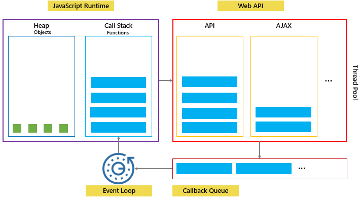

## [JavaScript Event Loop](https://www.javascripttutorial.net/javascript-event-loop/)
:::tip
**The event loop is a constantly running process that coordinates the tasks between the call stack and callback queue to achieve concurrency. 事件循环是一个不断运行的进程，协调调用栈和回调队列之间的任务以实现并发。**

**If the call stack is not empty, the event loop waits until it is empty and places the next function from the callback queue to the call stack. If the callback queue is empty, nothing will happen. 事件循环同时监视回调队列和调用栈，如果调用栈不为空，则事件循环等待直到它为空，然后将回调队列中的下一个函数放入调用栈。如果回调队列为空，则什么也不会发生。**


:::

As mentioned earlier, the JavaScript engine can do only one thing at a time. However, it’s more precise to say that the JavaScript runtime can do one thing at a time. 如前所述，JavaScript 引擎一次只能做一件事。但是，更准确地说，JavaScript 运行时一次只能做一件事。

A function that takes a long time to complete is called a blocking function. Technically, a blocking function blocks all the interactions on the webpage, such as mouse click. 需要很长时间才能完成的函数称为阻塞函数。从技术上讲，阻塞函数会阻止网页上的所有交互，例如鼠标单击。

An example of a blocking function is a function that calls an API from a remote server.

Web 浏览器不仅仅有JavaScript 引擎，When you call the setTimeout() function, make a fetch request, or click a button, the web browser can do these activities concurrently and asynchronously. The setTimeout(), fetch requests, and DOM events are parts of the Web APIs of the web browser. 当您调用 setTimeout() 函数、发出获取请求或单​​击按钮时，Web 浏览器可以并发和异步地执行这些活动。setTimeout()、获取请求和 DOM 事件是 Web 浏览器的 Web API 的一部分。

```js
console.log('Start script...');

setTimeout(() => {
  task('Download a file.');
}, 1000);

console.log('Done!');
```
1. when calling the `setTimeout()` function, the JavaScript engine places it on the call stack, and the Web API creates a timer that expires in 1 second. 当调用 setTimeout() 函数时，JavaScript 引擎将其放置在调用栈中，Web API 创建一个 1 秒后到期的计时器。


2. Then JavaScript engine place the `task()` function is into a queue called a callback queue or a task queue. 然后 JavaScript 引擎将 task() 函数放入一个称为回调队列或任务队列的队列中。


3. 事件循环同时监视回调队列和调用栈，如果调用栈不为空，则事件循环等待直到它为空，然后将回调队列中的下一个函数放入调用栈。如果回调队列为空，则什么也不会发生。


## [What are the microtask and macrotask within an event loop in JavaScript ?](https://www.geeksforgeeks.org/what-are-the-microtask-and-macrotask-within-an-event-loop-in-javascript/)