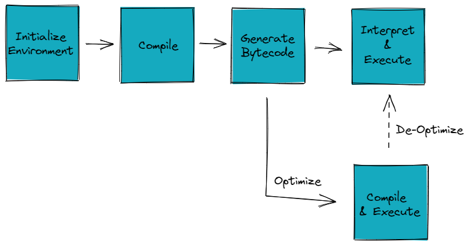
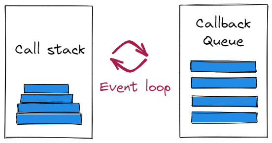
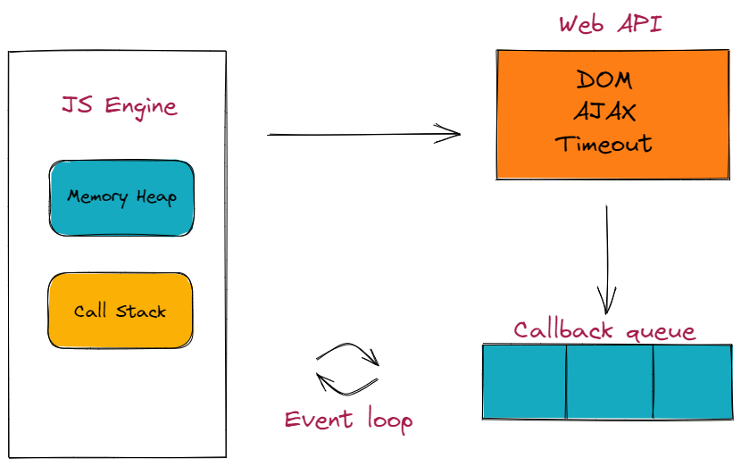

:::tip
可视化 javascript 运行时工具：[loupe](http://latentflip.com/loupe/)
An online AST explorer: [astexplorer](https://astexplorer.net/)
:::

## [Introduction to JS Engines and Runtimes](https://algodaily.com/lessons/introduction-to-js-engines-and-runtimes)

### 1. JavaScript Engine
:::tip
A JavaScript engine is a program whose main task is to read and execute code. So, the way that this program works is:
- Read the code
- Translate it into machine code
- Run that machine code
The JavaScript engines are embedded in JavaScript runtime environments such as browsers, Node.js, or even Java Runtime Environment (JRE).

JavaScript 引擎是一个程序，其主要任务是读取和执行代码。所以，这个程序的工作方式是：
- 阅读代码
- 将其翻译成机器码
- 运行该机器码
JavaScript 引擎嵌入在 JavaScript 运行时环境中，例如浏览器、Node.js，甚至是 Java 运行时环境 (JRE)。
:::

The JavaScript Engine has 6 main components that work together as a whole. We will take a short look into all of them, and show how are they connected and how they work together:
1. Parser - The source code is sent to a decoder which decodes the contents inside the HTML script tag into tokens that are sent to the parser. The engine tries to avoid parsing code that’s not necessary right away in order to save time. 源代码被发送给一个解码器，解码器将 HTML 脚本标记内的内容 解码为tokens（标记），将其发送到解析器。引擎会尝试 避免解析不是立即需要的代码 以节省时间。

2. AST - The parser creates nodes based on the tokens it receives. With these nodes, it creates an Abstract Syntax Tree (AST). 解析器根据它接收到的标记创建节点。通过这些节点，它创建了一个抽象语法树 (AST)。

3. Interpreter - It generates byte code, by reading the code line by line. Once the byte code is generated, the AST is deleted and memory space is cleared up. 解释器通过逐行读取代码来生成字节码。生成字节码后，删除AST并清理内存空间。

4. Profiler - Monitors and watches code to optimize it. 分析器，监视代码以优化代码。

5. Compiler - Works ahead of time and creates a translation of the code that has been written and compiles it down to a lower level language that machines can read. 编译器，提前工作，将已编写的代码编译为机器可以读取的低级语言。

6. Optimized code - Code needs to be optimized to be run quicker.

### 2. Call Stack and Memory Heap
The Call Stack and the Memory Heap are both important parts of the JS engine.

- The Call Stack keeps track of where we are in the code. It uses first in and last out.

- The Memory Heap stores and writes information, where memory is allocated, used, and removed. 分配、使用、删除内存

The Call Stack calls a function from the Memory Heap and after executing removes it from the stack. When the maximum call stack has been reached, e.g. with an infinite loop, is called a stack overflow. 当达到最大调用栈时，例如无限循环，称为栈溢出。

### 3. JavaScript Runtime
:::tip
A runtime is the environment in which a programming language executes. The runtime system facilitates storing functions, variables, and managing memory by using data structures such as queues, heaps, and stacks. 运行时是编程语言执行的环境。运行时系统通过使用队列、堆和栈等数据结构来促进存储函数、变量及管理内存。

The JavaScript runtime is a program that extends the JavaSciript engine and provides additional functionalities, so it can interact with the outside world. Also, the JS runtime provides features/APIs to build Javascript based software. This means both browsers, and JavaScript based frameworks have runtimes, but different ones based on their needs. JavaScript 运行时是一个扩展 JavaSciript 引擎并提供附加功能的程序，因此它可以与外界交互。此外，JS 运行时提供功能/API 来构建基于 Javascript 的软件。这意味着浏览器和基于 JavaScript 的框架都有运行时，但根据它们的需要而具有不同的运行时。
:::

There are three main concepts to discuss when talking about JS Runtime and how it works. Web APIs/Callback queue/Event loop. 在谈论 JS 运行时及其工作原理时，需要讨论三个主要概念。
#### 3.1 Web APIs
There are a large number of APIs available in modern browsers that allow us to do a wide variety of things. 现代浏览器中有大量可用的 API，可以让我们做各种各样的事情。比如：

- Manipulate documents - The DOM API allows developers to manipulate HTML and CSS, letting us create, change and even remove HTML and dynamically apply styles to web pages. 操作文档 —— DOM API 允许开发人员操作 HTML 和 CSS，让我们创建、更改甚至删除 HTML 并将样式动态应用到网页。

- Draw and manipulate graphics - The Canvas API and the Web Graphics Library API allow to programmatically update pixel data contained in a `<canvas>` element. 绘制和操作图形 —— Canvas API 和 Web Graphics Library API 允许以编程方式更新包含在 `<canvas>` 元素中的像素数据。

- Fetch data from a server - The Fetch API provides an interface for fetching resources across the network by using generic definitions of the Request and Response objects. 从服务器获取数据 -- Fetch API 提供了一个接口，用于通过 使用Request和Response对象的通用定义 来跨网络获取资源。

Features like `event listeners`, `timing functions` and `AJAX requests` all sit in the Web APIs container until an action gets triggered. When a request finishes receiving its data, a timer reaches its set time or a click happens and this triggers a callback function to be sent to the Callback queue. 事件侦听器、计时函数和 AJAX 请求等功能都位于 Web API 容器中，直到触发操作。当请求完成接收数据、计时器到达其设定时间、发生点击，这都将 触发回调函数 并加入到回调队列中。

#### 3.2 Callback queue
The Callback queue stores the callback functions sent from the Web APIs in the order in which they were added. This queue is a data structure that runs in FIFO order. 回调队列按添加顺序存储从 Web API 发送的回调函数。这个队列是一个按照先进先出顺序运行的数据结构

Callback functions will sit in the queue until the call stack is empty, they are then moved into the stack by the event loop. 回调函数将在队列中等待，直到调用栈为空，然后通过事件循环将它们移入调用栈。

#### 3.3 Event loop
The Event loop constantly monitors the state of the call stack and the callback queue. If the stack is empty it will grab a callback from the callback queue and put it onto the call stack, scheduling it for execution. 事件循环不断地监视调用栈和回调队列的状态。如果调用栈为空，它将从回调队列中获取一个回调并将其放入调用栈，安排它执行。

By pushing callbacks from the Web APIs to the callback queue, the event loop can constantly add those callbacks to the call stack, which makes us think of JavaScript as being able to run asynchronously. 通过将回调从 Web API 推送到回调队列，事件循环可以不断地将这些回调添加到调用栈，这让我们认为 JavaScript 可以异步运行。

### 4. How do JavaScript Engine and Runtime work together?
The first thing that needs to happen before code execution is for JavaScript to understand the code. This means analyzing the code against the grammar of JavaScript language and determining the format of a sentence. 在代码执行之前需要发生的第一件事是让 JavaScript 理解代码。这意味着根据 JavaScript 语言的语法分析代码并确定句子的格式。

After understanding the code, JavaScript needs to do some other tasks to execute the code like resolving functions, values of parameters, managing returns, ordering function calls, collecting garbage memories, and preparing machine instructions. All of this is job of the Engine. 理解代码后，JavaScript 需要执行一些其他任务来执行代码，如解析函数、参数值、管理返回值、排序函数调用、收集垃圾内存和准备机器指令。所有这些都是引擎的工作。

After the Engine has finished its job, the Runtime comes to play. As explained above, it checks the callback queue, and the event loop grabs whatever is inside it to schedule it for execution. 引擎完成其工作后，运行时开始运行。如上所述，它检查回调队列，事件循环获取其中的任何内容以安排它执行。

:::info
- A `JavaScript engine` reads, translates and executes code and is embedded in `JavaScript runtime environments` such as browsers, `Node.js` or `JRE`. JavaScript 引擎读取、翻译和执行代码，并嵌入到 JavaScript 运行时环境中，例如浏览器、Node.js 或 JRE。

- this statement is **false**: the JavaScript engine's execution of the code is the final stage that actually runs it. 这个说法是**错误的**：JavaScript 引擎对代码的执行是实际运行它的最后阶段。

- The JavaScript Engine works with a Parser, an Abstract Syntax Tree (AST), an Interpreter, a Profiler, a Compiler, and optimized code, as well as a Call Stack and Memory Heap, to process code quickly and efficiently. JavaScript 引擎与解析器、抽象语法树 (AST)、解释器、分析器、编译器和优化代码以及调用栈和内存堆一起工作，以快速高效地处理代码。

- The Profiler watches the code and makes optimizations, improving the performance of the JavaScript Engine. 分析器 监视代码并进行优化，从而提高 JavaScript 引擎的性能。

- A runtime is a program that extends the JavaScript engine and provides additional functionalities, such as relevant APIs to interact with the outside world, so as to build JavaScript based software. 运行时是一个程序，它扩展了 JavaScript 引擎并提供额外的功能，例如与外界交互的相关 API，从而构建基于 JavaScript 的软件。

- The JavaScript Runtime consists of Web APIs, the Callback queue, and the Event loop, which together enable JavaScript to run asynchronously by scheduling callbacks from the Web APIs to be added to the stack. JavaScript 运行时由 Web APIs、回调队列和事件循环组成，它们共同使 JavaScript 能够 通过调度来自要添加到调用栈的 Web APIs 的回调来 异步运行。

- The Event Loop monitors the Callstack and Callback Queue and allows asynchronous execution of callback functions by continuously pushing them onto the Callstack. Event Loop 监控 Callstack 和 Callback Queue，并通过不断地将回调函数推送到 Callstack 来允许异步执行。

- **The JavaScript Engine analyzes and prepares the code for execution, while the Runtime executes the code and manages the queues that are associated with code execution.** JavaScript 引擎分析并准备执行代码，而运行时执行代码并管理与代码执行相关联的队列。

- No, the JavaScript Engine is responsible for syntactic analysis of the source code and creating a machine understandable code, while the Runtime is used for executing the code. JavaScript 引擎负责源代码的语法分析并创建机器可理解的代码，而运行时用于执行代码。
:::

## [Javascript Foundation: Javascript RunTime](https://medium.com/@allansendagi/javascript-foundation-javascript-runtime-b7f515969d79)

## [Javascript Fundamentals — Call Stack and Memory Heap](https://medium.com/@allansendagi/javascript-fundamentals-call-stack-and-memory-heap-401eb8713204)

## [Javascript Foundation — Inside the Javascript Engine](https://medium.com/@allansendagi/javascript-foundation-inside-the-javascript-engine-2acf5de3f8ec)