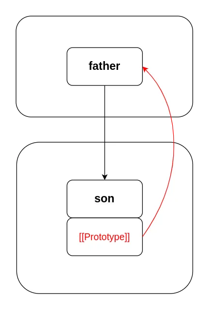
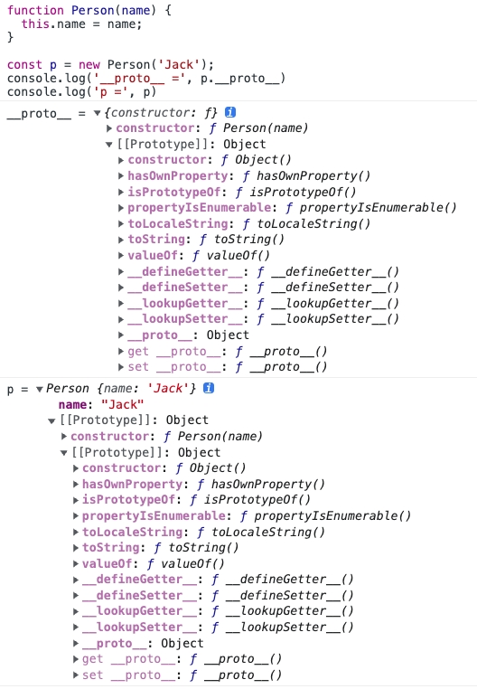
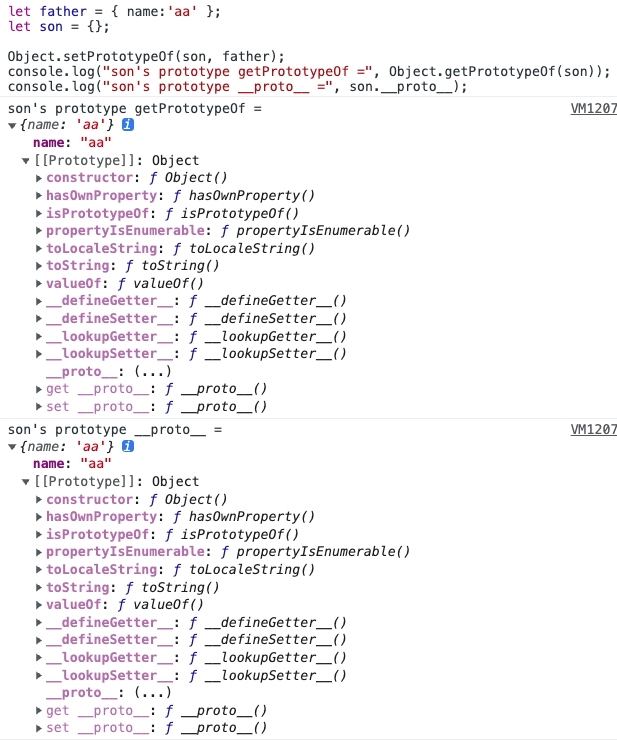
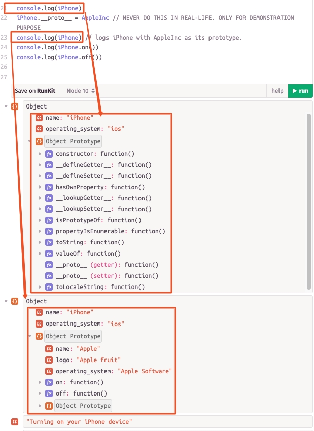

## [`[[Prototype]]` vs `__proto__` vs `.prototype` in Javascript](https://medium.com/@eamonocallaghan/prototype-vs-proto-vs-prototype-in-javascript-6758cadcbae8)
> ## [A simplified overview of JavaScript prototypes and prototypical inheritance.](https://medium.com/launch-school/a-simplified-overview-of-javascript-prototypes-and-prototypical-inheritance-f00c7af8a93c)

### `[[Prototype]]`
- **`[[Prototype]]` 是 Javascript 中所有对象都具有的隐藏私有属性，它保存着对对象原型的引用。**`[[Prototype]]` is a hidden private property that all objects have in Javascript, it holds a reference to the object’s prototype.

- An object’s prototype is the object that an object inherits or descends from. 对象的原型是对象继承或派生的对象。

- In the following diagram the object `son` descends from `father`, so **`father` is the prototype of `son`. That means the hidden `[[Prototype]]` property of `son` points to `father`**.



### `__proto__`
- `__proto__` 是 `Object.prototype` 的一个属性，它公开对象的隐藏 `[[Prototype]]` 属性并允许您访问或修改它。您不应该使用它，因为它已被弃用。
```js
function Person(name) {
  this.name = name;
}

const p = new Person('Jack');
console.log('__proto__ =', p.__proto__)
console.log('p =', p)
```


- 访问对象原型的现代方法是使用 `Object.getPrototypeOf(obj)`。您还可以使用 `Object.setPrototypeOf(obj, prototype)` 修改对象的原型。
```js
let father = { name:'aa' };
let son = {};

Object.setPrototypeOf(son, father);
console.log("son's prototype getPrototypeOf =", Object.getPrototypeOf(son));
console.log("son's prototype __proto__ =", son.__proto__);
console.log(Object.getPrototypeOf(son) === son.__proto__); // true
```


### `.prototype`
- **`.prototype` 是一个几乎所有函数都具有的特殊属性，仅在将函数作为构造函数调用时使用**。说几乎所有是因为使用简洁语法定义的箭头函数和方法没有 `.prototype` 属性，不能用作构造函数。`.prototype` is a special property that almost all functions have that is only used when a function is invoked as a constructor function. I say almost all because arrow functions and methods defined using the concise syntax do not have `.prototype` properties and cannot be used as constructors.

- **`.prototype` 属性包含对对象的引用，当构造函数用于实例化或创建新对象时，`.prototype` 被设置为新对象的原型**。

- **当构造函数`ObjectFactory`实例化一个对象`obj`，`obj`的内部隐藏属性`[[Prototype]]` 和 `ObjectFactory.prototype` 指向的是同一个对象（`obj`’s `[[Prototype]]` property references the same object as `ObjectFactory.prototype`）**。这意味着`ObjectFactory.prototype` 中定义的任何属性或方法都可以被 `obj` 访问。
```js
function ObjectFactory() {
  this.property = `Hi, I'm a property`;
}

let obj = new ObjectFactory();

console.log(typeof ObjectFactory.prototype);              // object
console.log(ObjectFactory.prototype.isPrototypeOf(obj));  // true
console.log(obj.__proto__ === ObjectFactory.prototype);   // true
console.log(obj.__proto__ === ObjectFactory.prototype === Object.prototype);  // false
console.log(Object.getPrototypeOf(ObjectFactory.prototype) === Object.prototype); // true
console.log(Object.prototype.isPrototypeOf(ObjectFactory.prototype)); // true

ObjectFactory.prototype.prop = `I'm a property of ObjectFactory.prototype`;

console.log(obj.__proto__.prop); // I'm a property of ObjectFactory.prototype
console.log(obj);                // ObjectFactory {property: "Hi, I'm a property"}
console.log(obj.prop);           // I'm a property of ObjectFactory.prototype
```
```js
var obj1 = new Object();
var obj2 = {};
var obj3 = { a: 1 };

console.log( Object.getPrototypeOf( obj1 ) === Object.prototype );    // 输出：true 
console.log( Object.getPrototypeOf( obj2 ) === Object.prototype );    // 输出：true
console.log( Object.getPrototypeOf( obj3 ) === Object.prototype );    // 输出：true
```
:::info
- `prototype`是所有构造函数都具有的属性；`[[Prototype]]`是所有对象都具有的隐藏私有属性；当构造函数`ObjectFactory`实例化一个对象`obj`，`obj`的内部隐藏属性`[[Prototype]]` 指向 `obj`的原型，即`ObjectFactory.prototype`。

- `ObjectFactory.prototype` 的原型，即`Object.prototype`。也就是说，构造函数`.prototype`的原型 是 `Object.prototype`。

- 使用构造函数`Object` 或 字面量`{  }` 创造的对象，其原型是`Object.prototype`。
:::


## [Understanding Prototypal Inheritance In JavaScript](https://dev.to/lawrence_eagles/understanding-prototypal-inheritance-in-javascript-4f31)
要理解原型继承，我们需要理解这三个关键概念，即：继承(inheritance)、原型(prototype)、原型链(prototype chain)

- 继承是指一个对象可以访问另一个对象的属性和方法的过程。
- 一个对象、它的原型和它的原型的原型，一直到最后一个原型之间的对象引用链称为原型链。
```js
const AppleInc = {
  name: "Apple",
  logo: "Apple fruit",
  operating_system: "Apple Software",
  on () {
   console.log("Turning on your " + this.name + " device")
  },
  off () {
   console.log("Turning off your " + this.name + " device")
  }
}

const iPhone = {
  name: "iPhone",
  operating_system: "ios"
}

console.log(iPhone)
// sets AppleInc to be the prototype of the iPhone object.
iPhone.__proto__ = AppleInc // NEVER DO THIS IN REAL-LIFE. ONLY FOR DEMONSTRATION PURPOSE
console.log(iPhone) // logs iPhone with AppleInc as its prototype.
console.log(iPhone.on())  // Turning on your iPhone device
console.log(iPhone.off()) // Turning off your iPhone device
console.log(iPhone.name)
```


- 结合`this`查看原型链
<CodeRun>
{
  `
  const Company = {
    category: "Technology",
    getNews () {
     console.log("viewing " + this.category + " news on my " + this.name + " device")
    }
  }
  const AppleInc = {
    name: "Apple",
    logo: "Apple fruit",
    operating_system: "Apple Software",
    store: "Apple Store",
    on () {
     console.log("Turning on my " + this.name + " device")
    },
    off () {
     console.log("Turning off my " + this.name + " device")
    },
    getDevice() {
     console.log("I just bought my " + this.name + " from " + this.store)
    }
  }
  const iPhone = {
    name: "iPhone",
    operating_system: "ios"
  }
  AppleInc.__proto__ = Company // NEVER DO THIS IN REAL-LIFE. ONLY FOR DEMONSTRATION PURPOSE
  iPhone.__proto__ = AppleInc // NEVER DO THIS IN REAL-LIFE. ONLY FOR DEMONSTRATION PURPOSE
  // let's buy an iPhone from the Apple store, then let's turn on and off our iPhone.
  console.log(iPhone.getDevice())
  console.log(iPhone.on())
  console.log(iPhone.off())
  console.log(iPhone.getNews())
  console.log(Company.__proto__)
  console.log(Company.__proto__ === Object.prototype)
  `
}
</CodeRun>

:::info
`this` 首先指向发起调用的对象，因为它可以在 `iPhone` 对象中找到`name property`，所以它指向该对象。但它无法在 `iPhone` 对象中找到`store property`，因此它指向其原型并在那里查找该属性并找到它。
:::

- All data types in JavaScript have a prototype object, JavaScript 中的**根对象**是 `Object.prototype`，`Object.prototype`的原型对象是`null`
<CodeRun>
{
  `
  const simpleArray = []
  const simpleFunction = function simpleFunction () {}
  const simpleString = ""
  console.log(simpleArray.__proto__)
  console.log(simpleArray.__proto__ === Array.prototype)
  console.log(simpleFunction.__proto__)
  console.log(simpleFunction.__proto__ === Function.prototype)
  console.log(simpleString.__proto__)
  console.log(simpleString.__proto__ === String.prototype)
  console.log(simpleArray.__proto__.__proto__)
  console.log(simpleArray.__proto__.__proto__ === Object.prototype)
  console.log(simpleFunction.__proto__.__proto__)
  console.log(simpleFunction.__proto__.__proto__ === Object.prototype)
  console.log(simpleString.__proto__.__proto__)
  console.log(simpleString.__proto__.__proto__ === Object.prototype)
  console.log('------')
  console.log(Object.prototype.__proto__ === null)
  `
}
</CodeRun>

## [An Easy Guide To Understanding Constructors In JavaScript](https://dev.to/lawrence_eagles/an-easy-guide-to-understanding-constructors-in-javascript-2mf6)
### constructors
- 构造函数 实际上是普通的 JavaScript 函数。它们的特别之处在于它们总是与 JavaScript 中一个非常强大的运算符一起调用，称为 `new` 运算符。
```js
function Person () {
  this.firstname = "Lawrence"
  this.lastname = "Eagles"
  this.occupation = "Software Developer"
  this.gender = "male"
}
Person(); // 不使用new则就是普通函数调用
console.log('此时this指向全局对象 --->', window.firstname); // 此时this指向全局对象 ---> Lawrence
```
<CodeRun>
{
  `
  // regular function
  function person () {}
  const regularDeveloper = person()
  console.log("regular function result", regularDeveloper)
  // constructor 
  function Person () {
    console.log("this binds to", this)
  }
  const constructorDeveloper = new Person()
  console.log("Person constructor result", constructorDeveloper)
  function BadPerson () {
    console.log("this binds to", this)
    this.name = 'Jack666';
    return {name: "Jack", age: "70"}
  }
  const BadJack = new BadPerson()
  console.log("BadPerson constructor result", BadJack)
  console.log("BadPerson name --->", BadJack.name)
  `
}
</CodeRun>