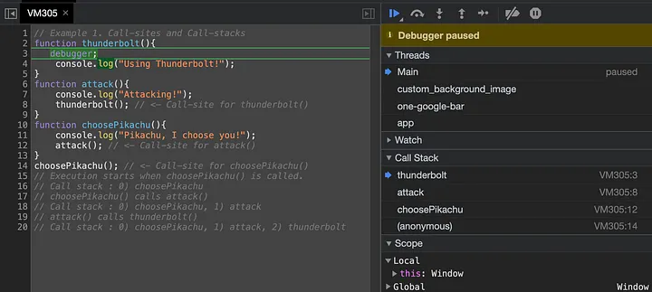

## [How well do you know “this” in JavaScript?](https://javascript.plainenglish.io/how-well-do-you-know-this-ce4355bc9b)
> 用最简单的术语来说，JavaScript 关键字 `this` 是指它在运行时所属的对象，具体取决于调用它的地方(call-site)。

:::info
`this` can have the following values depending upon where it is accessed:
- By default : `this` refers to the global object.

- Inside a function : `this` refers to the global object. In strict mode, however, `this` will be `undefined`.

- Inside a method : `this` refers to the owner object. (A method is a function that belongs inside an object. In other words, it’s a function that’s an object’s property.)

- In an event : `this` refers to the element on which the event was triggered.

- Inside an Immediately Invoked Function Expression (IIFE) : `this` refers to the global object. In strict mode,`this` will be `undefined`, just like any other function in a global context.

- Inside a Fat-Arrow function : When a fat arrow `()=>` is used to define a function, it doesn’t create a new value for `this`, instead, it keeps referring to the same object it was referring to outside of the function. 箭头函数内的`this`一直引用它在函数外部引用的同一个对象
:::

### Call-Site and Call-Stack
- `this` 是为每个函数调用创建的运行时绑定(runtime-binding)，这完全取决于调用它的确切位置。

- 代码中调用相关函数的位置称为调用点(call-site)。

```js
// Example: Call-sites and Call-stacks
function thunderbolt(){
  debugger;
  console.log("Using Thunderbolt!");
}

function attack(){
  console.log("Attacking!");
  thunderbolt(); // <- Call-site for thunderbolt()
}

function choosePikachu(){
  console.log("Pikachu, I choose you!");
  attack(); // <- Call-site for attack()
}

choosePikachu(); // <- Call-site for choosePikachu()

// Execution starts when choosePikachu() is called.
// Call stack : 0) choosePikachu
// choosePikachu() calls attack()
// Call stack : 0) choosePikachu, 1) attack
// attack() calls thunderbolt()
// Call stack : 0) choosePikachu, 1) attack, 2) thunderbolt
```

> `(anonymous)` at the bottom of the stack, refers to the initial global call to `choosePikachu()`. 在调用栈底部的`(anonymous)`，指的是对 `choosePikachu()` 的初始全局调用。

### Binding rules for `this`
There are four general rules：Default Binding、Implicit Binding、Explicit Binding、`new` Binding

#### Default Binding 默认绑定
独立函数调用:
```js
function getPokémon(){
  console.log("Pokémon in Ultra Ball is : ", this.ultraBall);
}

var ultraBall = "Articuno";
getPokémon();
// Output
// Pokémon in Ultra Ball is : Articuno
```
- 使用`var`在全局作用域中声明的变量(如上的`ultraBall`) 等同于 在全局对象中声明一个同名的属性。
- 在 `getPokemon()` 内部，对 `this` 的引用默认为全局对象。`this.ultraBall`的值 即 全局对象的属性`ultraBall`的值，也即使用`var`在全局作用域中声明的变量`ultraBall`的值。
- 如果在全局或在函数内部使用严格模式，则全局对象不允许默认绑定。`this` is `undefined`
```js
function getPokémon(){
  'use strict'
  console.log("Pokémon in Ultra Ball is : ", this.ultraBall);
}

var ultraBall = "Articuno";
getPokémon(); // TypeError: Cannot read properties of undefined (reading 'ultraBall')
```
```js
function getName() {
  console.log(11, this.name1);
  console.log(12, this.name2);
  console.log(13, this.name3);
}

const name1 = 'Kingsley';
var name2 = 'Jack';
getName();
// 11 undefined  (const定义的变量)
// 12 'Jack'     (var定义的变量)
// 13 undefined
```

#### Implicit Binding 隐式绑定
```js
// Example: Simple Implicit Binding
function getBaseSpeed(){
  console.log("Base Speed Stat is : ", this.baseSpeed);
}

var pikachu = {
  baseSpeed : 90,
  getBaseSpeed : getBaseSpeed
};

pikachu.getBaseSpeed();
// Output
// Base Speed Stat is : 90
```
```js
// Example: Last level of an Object property chain
//            matters for Implicit 'this' binding
function getBaseSpeed(){
  console.log("Base Speed Stat is : ", this.baseSpeed);
}

var pikachu = {
  baseSpeed : 90,
  getBaseSpeed : getBaseSpeed
};

var raichu = {
  baseSpeed : 110,
  pikachu : pikachu
};

raichu.pikachu.getBaseSpeed();
// Output
// Base Speed Stat is : 90  // bound to its direct caller
```
- As we can see, the `baseSpeed` value is still 90. That’s because **the call to `getBaseSpeed` is bound to its direct caller, `pikachu`, which serves as its this binding**. In this context, the `baseSpeed` value is 90.

```js
// Example: Lost implicit "this" binding #1
function getBaseSpeed(){
  console.log("Base Speed Stat is : ", this.baseSpeed);
}

var pikachu = {
  baseSpeed : 90,
  getBaseSpeed : getBaseSpeed
};

var baseSpeedFunction = pikachu.getBaseSpeed;
var baseSpeed = 50;
baseSpeedFunction();
// Output
// Base Speed Stat is : 50
```
- 上面代码在将`pikachu.getBaseSpeed`分配给变量`baseSpeedFunction`时，丢失了对`pikachu` 的 `implicit this binding`.

- 函数回调丢失它们的 `this` 绑定是很常见的，如下：
```js
// Example: Lost implicit "this" binding #2
function getBaseSpeed(){
  console.log("Base Speed Stat is : ", this.baseSpeed);
}

function executeFunction(fn) {
  fn();
}

var pikachu = {
  baseSpeed : 90,
  getBaseSpeed : getBaseSpeed
};

var baseSpeed = 50;
// Execute getBaseSpeed of pikachu via callback
executeFunction(pikachu.getBaseSpeed);
// Output
// Base Speed Stat is : 50
```

#### Explicit Binding 显式绑定
- 为了解决隐式绑定时 `this` 的意外丢失，我们可以将 `this` 的值显式设置为函数调用的给定对象。
- 有几种内置方法可以帮助我们实现显式绑定:
  - `bind()`
  - `call()`
  - `apply()`

##### The `bind()` method
- `bind()` 是 `Function.prototype` 属性的一个方法。这意味着 `bind()` 可以被每个函数使用。

- `bind()` 返回一个新函数，该函数被硬编码为使用指定的 `this 上下文集` 调用原始函数。（`bind()` returns a new function that is hardcoded to call the original function with the `this context set` as specified.）
- 也就是说，`var fn2 = fn1.bind(obj1)`，调用`fn2`就是调用`fn1`，只不过此时的`this`被指向了`obj1`。
```js
// Example: 'this' binding with bind()
var bulbasaur = {
  pokédexNo: "001",
  getPokédexNo: function() {
    return this.pokédexNo;
  }
};

var unboundGetPokédexNo = bulbasaur.getPokédexNo;
console.log(unboundGetPokédexNo());
// The function gets invoked at the global scope
// Output: undefined

var boundGetPokédexNo = unboundGetPokédexNo.bind(bulbasaur);
console.log(boundGetPokédexNo());
// Output: "001"
```

##### The `call()` and `apply()` methods
- `call()` 和 `apply()` 也是 `Function.prototype` 属性的方法，用法相似但略有不同，它们在调用时立即执行函数，而 `bind()` 不是立即执行一个函数，而是返回一个可以稍后执行的函数。
- `call()` 方法 使用给定的`this`值和单独提供的参数 调用函数。而 `apply()` 方法调用 具有给定`this`值 的函数，并将参数作为数组（或类似数组的对象）提供。
- `call()`、`apply()`、`bind()`的区别：
```js
// call()
var obj = { num: 2 };

function add(a, b){
  return this.num + a + b;
}

console.log(add.call(obj, 3, 5));

// call()
var obj = { num: 2 };

function add(args){
  return this.num + args[0] + args[1];
}

console.log(add.call(obj, [3, 5])); // 10

// apply()
var obj = { num: 2 };

function add(a, b){
  return this.num + a + b;
}

console.log(add.apply(obj, [3, 5]));

// bind()
var obj = { num: 2 };

function add(a, b){
  return this.num + a + b;
}

const func = add.bind(obj, 3, 5);
func(); // Returns 10

// call() apply() bind()
var obj = { num: 2 };

function add(a, b){
  return this.num + a + b;
}

const resultCall  = add.call(obj, 3, 5);
const resultApply = add.apply(obj, [3, 5]);
const funcBind    = add.bind(obj, 3, 5)
const resultBind  = funcBind();

console.log(resultCall, resultApply, resultBind); // 10 10 10
```

- 通过 `Pokémon.call()` 或 `Pokémon.apply()` 显式绑定调用 `Pokémon` 允许我们强制其 `this` 成为函数 `PokémonExtension` 的 `this`：
```js
// Example: 'this' binding with call() or apply()
function Pokémon(name, type) {
  this.name = name;
  this.type = type;
}

function PokémonExtension(name, type, species) {
  // with call()
  Pokémon.call(this, name, type);
  // with apply()
  // Pokémon.apply(this, [name, type]);
  this.species = species;
}

var quilava = new PokémonExtension("Quilava", "Fire", "Volcano Pokémon");
console.log(quilava.name, quilava.type, quilava.species);
// Output
// "Quilava" "Fire" "Volcano Pokémon"
```

- 使用 `call()` 调用函数并且指定上下文的 `this`
```js
// 使用 call 方法调用函数并且指定上下文的 'this'
function greet() {
  var reply = [this.animal, 'typically sleep between', this.sleepDuration].join(' ');
  console.log(reply);
}

var obj = {
  animal: 'cats',
  sleepDuration: '12 and 16 hours'
};

// 当调用 greet 方法的时候，该方法的this值会绑定到 obj 对象
greet.call(obj);  // cats typically sleep between 12 and 16 hours
```

- 使用 `call()` 改变对象的值
```js
let obj = {};

function add(a, b){
  this.num = a;
}

console.log('obj = ', JSON.stringify(obj)); // obj =  {}
add.call(obj, 3, 5);
console.log('obj = ', JSON.stringify(obj)); // obj =  {"num":3}
```

- 使用 `apply()` 将数组各项添加到另一个数组
```js
/*
用 apply 将数组各项添加到另一个数组:
如果 push 的参数是数组，它会将该数组作为单个元素添加，而不是将这个数组内的每个元素添加进去，因此我们最终会得到一个数组内的数组。
如果不想这样呢？concat 符合我们的需求，但它并不是将元素添加到现有数组，而是创建并返回一个新数组。
然而我们需要将元素追加到现有数组，apply 正派上用场！
*/
const array = ['a', 'b'];
const elements = [0, 1, 2];
array.push.apply(array, elements);
console.info(array); // ["a", "b", 0, 1, 2]
```

##### [When to Use Bind(), Call(), and Apply() in JavaScript](https://betterprogramming.pub/when-to-use-bind-call-and-apply-in-javascript-1ae9d7fa66d5)
1. Use `Call()` to Chain Object Constructors
```js
function Item(name, price) {
  this.name = name;
  this.price = price;
  this.description = `${this.name}, ${this.price}€`;
}

function Car(name, price) {
  Item.call(this, name, price);
  // You can add other car specific fields here
}

function Fruit(name, price) {
  Item.call(this, name, price);
  // You can add other fruit specific fields here
}

const bmw = new Car("BMW", 120000); // Car {name: 'BMW', price: 120000, description: 'BMW, 120000€'}
const banana = new Fruit("Banana", 1); // Fruit {name: 'Banana', price: 1, description: 'Banana, 1€'}
```

2. Use `Call()` to Invoke an Anonymous Function
```js
const queue = [
  { name: 'Matt' },
  { name: 'Jack' }
];

for (let i = 0; i < queue.length; i++) {
  (function(i) {
    this.displayInfo = function() {
      console.log(`Position ${i}: ${this.name}`);
    }
    this.displayInfo();
  }).call(queue[i], i);
}
// Position 0: Matt
// Position 1: Jack
```

3. Use `Call()` to Run a Function with an Object
```js
var obj = { num: 2 };

function add(a, b){
  return this.num + a + b;
}

console.log(add.call(obj, 3, 5)); // 10
```

4. Use `Apply()` to Append an Array to Another Array
```js
const numbers = [1, 2, 3];
const moreNumbers = [4, 5, 6];

numbers.push.apply(numbers, moreNumbers);

console.log(numbers); // [1, 2, 3, 4, 5, 6]
```

5. Use `Apply()` to Chain Object Constructors
```js
function Item(name, price) {
  this.name = name;
  this.price = price;
  this.description = `${this.name}, ${this.price}€`;
}

function Car(details) {
  Item.apply(this, details);
  // You can add other car specific fields here
}

function Fruit(details) {
  Item.apply(this, details);
  // You can add other fruit specific fields here
}

const carDetails = ["BMW", 120000]
const bmw = new Car(carDetails); // Car {name: 'BMW', price: 120000, description: 'BMW, 120000€'}

const fruitDetails = ["Banana", 2]
const banana = new Fruit(fruitDetails); // Fruit {name: 'Banana', price: 2, description: 'Banana, 2€'}
```

6. Create Bound Functions with `Bind()`
```js
var obj = { num: 2 };

function add(a, b){
  return this.num + a + b;
}

const func = add.bind(obj, 3, 5);
func(); // Returns 10
```

7. Use `Bind()` to Make SetTimeout Work
```js
// 以下代码的结果和你预期的不一样
let person = {
  name: 'John',
  getName: function() {
    console.log('name = ', this.name, typeof this.name); // name =   string
    console.log('this = ', this, this === window); // this =  Window {0: Window, window: Window, self: Window, document: document, name: '', location: Location, …}  true
  }
};

window.setTimeout(person.getName, 1000);
```
:::info
To understand why this happens, let’s re-write the last line in another equivalent way:
```js
let func = person.getName;
window.setTimeout(func, 1000);
```

When `window` calls its `setTimeout()` method, its `this` object is `the window object`.

To overcome this, bind the function to the `person` object using the `bind()` method. This way no matter where you call the function, it has still access to the `name` of the `person`:
```js
let person = {
  name: 'John',
  getName: function() {
    console.log(this.name); // John
  }
};

let func = person.getName.bind(person);
setTimeout(func, 1000);
```
:::


#### `new` Binding
- 在 JavaScript 中，实际上没有“构造函数”这样的东西，而是函数的构造调用。（In JavaScript, there is really no such thing as “constructor functions”, but rather construction call of functions.）

- 当一个函数在它前面加上 `new` 被调用时，也就是所谓的构造函数调用，下面的事情会自动完成：
1. 一个全新的对象被创建(或者说被构造)
2. The newly constructed object is `[[Prototype]]-linked`.
3. 新构造的对象被设置为该函数调用的 `this` 绑定 (The newly constructed object is set as the this binding for that function call.)
4. 除非函数返回它自己的备用对象，否则 `new` 调用的函数 将自动返回新构造的对象

```js
// Example: Simple 'this' binding in case of new
function setPokémon(name) {
  this.name = name;
}

var catchPokémon = new setPokémon("Blastoise");
console.log(catchPokémon.name);
// Output
// "Blastoise"
```

##### [Implement JavaScript’s new() operator yourself](https://csdigitalnomad.medium.com/implement-javascripts-new-operator-yourself-a-killer-frontend-interview-question-68468ad0a227)
- 创建一个名为 New 的函数。它有几个参数，第一个参数是传入的构造函数。我们使用 rest 语法将其余参数收集到名为 args 的数组中。
```js
function New(constructor, ...args) {

}
```

- Step 1. Creates a blank, plain JavaScript object
```js
function New(constructor, ...args) {
  // 1. Create a new empty object
  const obj = {};
  // const obj = new Object();
  // const obj = Object.create(null);

}
```
:::tip
there are three ways to create an empty object:
```js
const obj = {};
const obj = new Object();
const obj = Object.create(null);
```
:::

- Step 2. Links (sets the constructor of) this object to another object
> 为对象 obj 建立原型链。它很关键，因为它证明了 JS 中的对象依赖于原型和原型链。
```js
function New(constructor, ...args) {
  // 1. Create a new empty object
  const obj = {};
  // const obj = new Object();
  // const obj = Object.create(null);

  // 2. Assign the constructor’s prototype property to the new empty object’s __protp__ property
  obj.__proto__ = constructor.prototype;
  // Object.setPrototypeOf(obj, constructor.prototype);

}
```
:::tip
Below these two lines do the same thing---sets up the prototype chain for the object obj:
```js
obj.__proto__ = constructor.prototype;
Object.setPrototypeOf(obj, constructor.prototype);
```
通常推荐使用 `Object.setPrototypeOf()`。`__proto__`是`Object.prototype`的一个隐藏属性，在Chrome、Firefox等浏览器中，`__proto__`被公开出来。
:::

- Step 3. Passes the newly created object from Step 1 as the `this` context
```js
function New(constructor, ...args) {
  // 1. Create a new empty object
  const obj = {};
  // const obj = new Object();
  // const obj = Object.create(null);

  // 2. Assign the constructor’s prototype property to the new empty object’s __protp__ property
  obj.__proto__ = constructor.prototype;
  // Object.setPrototypeOf(obj, constructor.prototype);

  // 3. Execute the constructor, set obj as the context of `this` when the constructor runs
  const result = constructor.call(obj, args);

}
```

- Step 4. Returns `this` if the function doesn’t return an object
```js
function New(constructor, ...args) {
  // 1. Create a new empty object
  const obj = {};
  // const obj = new Object();
  // const obj = Object.create(null);

  // 2. Assign the constructor’s prototype property to the new empty object’s __protp__ property
  obj.__proto__ = constructor.prototype;
  // Object.setPrototypeOf(obj, constructor.prototype);

  console.log('obj = ', JSON.stringify(obj))

  // 3. Execute the constructor, set obj as the context of `this` when the constructor runs
  const result = constructor.call(obj, args);

  console.log('obj = ', JSON.stringify(obj))
  console.log('result = ', typeof result, result)

  // 4. Return the object
  return typeof result === 'object' ? result : obj;
}
```

- All done, let’s test it out.
```js
function Employee(args) {
  this.name = args[0];
  this.title = args[1];
  console.log('constructor, this = ', this);
}

const employeeA = New(Employee, 'Joe', 27);
console.log('employeeA = ', employeeA);
```
-operator.jpg)

### All binding rules in action
> 默认绑定是四个规则中优先级最低的。The default binding is the lowest priority rule of the four.

#### Implicit versus Explicit
> 显式绑定比隐式绑定具有更高的优先级。Explicit binding is of higher precedence than implicit binding.

```js
// Example: Implicit versus Explicit
function catchPokémon() {
  console.log("Pokémon caught : ", this.name);
}

var firstAttempt = {
  name : "Flareon",
  catchPokémon : catchPokémon
}

var secondAttempt = {
  name : "Vaporeon",
  catchPokémon : catchPokémon
}

// Implicit binding
firstAttempt.catchPokémon(); // "Pokémon Caught : Flareon"
secondAttempt.catchPokémon(); // "Pokémon Caught : Vaporeon"

// Explicit binding to swap contexts 显示绑定来交换上下文
firstAttempt.catchPokémon.call(secondAttempt); // "Pokémon Caught : Vaporeon"
secondAttempt.catchPokémon.call(firstAttempt); // "Pokémon Caught : Flareon"
```
如上，`firstAttempt.catchPokémon` 与 `secondAttempt` 的显式绑定优先于其自身的隐式绑定

#### Implicit versus `new`
> `new` binding比隐式绑定具有更高的优先级。 `new` binding is more precedent than implicit binding.

```js
// Example: Implicit versus new
function catchPokémon(name) {
  this.name = name;
}

var firstAttempt = {
  catchPokémon : catchPokémon
};

var secondAttempt = {};

firstAttempt.catchPokémon("Jolteon");
console.log(firstAttempt.name); // Output : "Jolteon"

firstAttempt.catchPokémon.call(secondAttempt, "Umbreon");
console.log(secondAttempt.name); // Output : "Umbreon"

var thirdAttempt = new firstAttempt.catchPokémon("Eevee");
console.log(firstAttempt.name); // Output : "Jolteon"
console.log(thirdAttempt.name); // Output : "Eevee"
```

#### Explicit versus `new`
> `new` is able to override hard-binding.

`new` 和 `call` 或 `apply` 不能一起使用:
```js
function catchPokémon(name) {
  this.name = name;
}

var firstAttempt = {
  catchPokémon : catchPokémon
};
var fourthAttempt = new catchPokémon.call(firstAttempt); // TypeError: catchPokémon.call is not a constructor
```

```js
// Example: Explicit versus new through hard-binding
function catchPokémon(name) {
  this.name = name;
}

var firstAttempt = {};

var attemptBinder = catchPokémon.bind(firstAttempt);
attemptBinder("Onix");

console.log(firstAttempt.name); // Output : "Onix"

var secondAttempt = new attemptBinder("Steelix");
console.log(firstAttempt.name); // Output : "Onix"
console.log(secondAttempt.name); // Output : "Steelix"
```

- `attemptBinder` is hard-bound against `firstAttempt`, but `new attemptBinder(“Steelix”)` did not change `firstAttempt.name` to "Steelix", as we may have expected, but it remained "Onix". Instead, the hard-bound call to `attemptBinder("Steelix")` is able to be overridden with `new` .

:::info
- Is the function called with `new` ? If so, `this` is the newly constructed object (New binding). Example, `var attempt = new catchPokémon("Pidgey");`

- Is the function called with `call` or `apply` , even hidden inside a `bind` hard-binding? If so, `this` is the explicitly specified object (Explicit binding). Example, `var attempt = catchPokémon.call("Pidgeotto");`

- Is the function called with a context, otherwise known as an owning or containing object? (调用的函数是否带有上下文，也称为 拥有对象 或 包含对象？) If so, `this` is that context object (Implicit binding). Example, `var attempt = firstAttempt.catchPokémon("Pidgeot");`

- Otherwise, `this` defaults to the `global` object, or `undefined` in strict mode (Default binding).
:::
