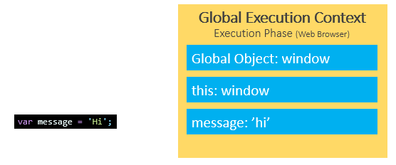
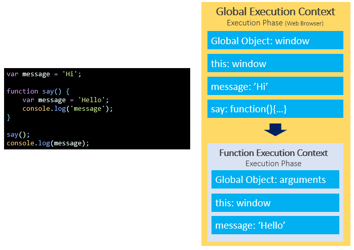
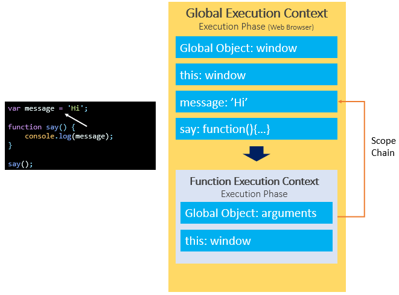

## [JavaScript Variable Scopes](https://www.javascripttutorial.net/javascript-variable-scope/)
:::tip
Scope determines the visibility and accessibility of a variable. JavaScript has three scopes:
- The global scope
- Local scope
- Block scope (started from ES6)

:::

### 1. The global scope
When the JavaScript engine executes a script, it creates a global execution context. Also, it also assigns variables that you declare outside of functions to the global execution context. These variables are in the global scope. They are also known as global variables. 当 JavaScript 引擎执行脚本时，它会创建一个全局执行上下文。此外，它还将您在函数外部声明的变量分配给全局执行上下文。这些变量在全局作用域内。它们也称为全局变量。



### 2. Local scope
The variables that you declare inside a function are local to the function. They are called local variables.


When the JavaScript engine executes the `say()` function, it creates a function execution context. The variable `message` declared inside the `say()` function is bound to the function execution context of the function, not the global execution context.

### 3. Scope chain
The way that JavaScript resolves a variable is by looking at it in its current scope, if it cannot find the variable, it goes up to the outer scope, which is called the scope chain. JavaScript 解析变量的方式是在其当前作用域中查找变量，如果找不到该变量，则向上查找外部作用域，这称为作用域链。


```js
var y = 20;

function bar() {
  var y = 200;

  function baz() {
    console.log(y);
  }

  baz();
}

bar();
```
- First, the JavaScript engine finds the variable `y` in the scope of the `baz()` function. It cannot find any. So it goes out of this scope.
- Then, the JavaScript engine finds the variable `y` in the `bar()` function. It can find the variable `y` in the scope of the `bar()` function so it stops searching.

### 4. Global variable leaks: the weird part of JavaScript
> 全局变量泄漏：JavaScript 的奇怪部分

```js
function getCounter() {
  counter = 10;
  return counter;
}

console.log(getCounter());
```
In this example, we assigned 10 to the `counter` variable without the `var`, `let`, or `const` keyword and then returned it. 能正常输出 10，这个问题被称为全局变量的泄漏（the leaks of the global variables）。
- the JavaScript engine first looks up the `counter` variable in the local scope of the `getCounter()` function. Because there is no `var`, `let`, or `const` keyword, the `counter` variable is not available in the local scope. It hasn’t been created. 由于没用`var`, `let`, 或 `const`关键字声明，counter变量在局部作用域不可用，它还没有创建。

- Then, the JavaScript engine follows the scope chain and looks up the counter variable in the global scope. The global scope also doesn’t have the counter variable, so the JavaScript engine creates the counter variable in the global scope. 然后，JavaScript 引擎沿着作用域链在全局作用域中查找counter变量。全局作用域也没有counter变量，因此 JavaScript 引擎在全局作用域内创建counter变量。

:::tip
使用 'use strict' 可以避免全局变量泄漏
```js
'use strict'

function getCounter() {
  counter = 10;
  return counter;
}

console.log(getCounter()); // Uncaught ReferenceError: counter is not defined
```

```js
function getCounter() {
  'use strict'
  counter = 10;
  return counter;
}

console.log(getCounter()); // Uncaught ReferenceError: counter is not defined
```
:::

### 5. Block scope
Generally, whenever you see curly brackets `{}`, it is a block. It can be the area within the `if`, `else`, `switch` conditions or `for`, `do while`, and `while` loops.

ES6 provides the `let` and `const` keywords that allow you to declare variables in block scope.

```js
function say(message) {
  if(!message) {
    let greeting = 'Hello'; // block scope
    console.log(greeting);
  }
  
  console.log(greeting); // ReferenceError
}

say();
```
In this example, we reference the variable `greeting` outside the `if` block that results in an error.

## [Lexical Scope in JavaScript – What Exactly Is Scope in JS?](https://www.freecodecamp.org/news/javascript-lexical-scope-tutorial/)

### 1. Scope
:::tip
- Scope refers to the area where an item (such as a function or variable) is visible and accessible to other code.
- JavaScript scope is all about space.
:::
```js
const fullName = 'Oluwatobi Sofela';

function profile() {
  function sayName() {
    function writeName() {
      return fullName;
    }
    return writeName();
  }
  return sayName();
}

console.log(profile());
```
Keep in mind that whenever the `writeName()` function gets invoked, the computer will not go straight to the global scope to call the `fullName` variable. Instead, it must sequentially go through the `scope chain` to look for `fullName`. 请记住，无论何时调用 writeName() 函数，计算机都不会直接进入全局作用域来调用 fullName 变量。相反，它必须按顺序通过作用域链来查找 fullName。

### 2. Scope Chain
:::tip
A scope chain refers to the unique spaces that exist from the scope where a variable got called to the global scope. 作用域链指的是 从调用变量的作用域到全局作用域 存在的唯一空间。
:::
```js
const fullName = 'Oluwatobi Sofela';

function profile() {
  function sayName() {
    function writeName() {
      return fullName;
    }
    return writeName();
  }
  return sayName();
}

console.log(profile());
```
In the snippet above, observe that the `fullName` variable got called from the `writeName()` function's scope.

Therefore, the scope chain that exists from the variable’s call to the global scope is: `writeName() scope ---> sayName() scope ---> profile() scope ---> global scope`

In other words, there are four (4) spaces from fullName’s invocation scope to **its lexical scope (the global scope in this instance)**. 从它的调用作用域到它的词法作用域

:::tip
Note: The global scope is the last link in JavaScript's scope chain. 注意：全局作用域是 JavaScript 作用域链中的最后一环。
:::

### 3. How Does the Scope Chain Work?
:::tip
JavaScript's scope chain determines the hierarchy of places the computer must go through — one after the other — to find the lexical scope (origin) of the specific variable that got called. JavaScript 的作用域链决定了计算机必须经过的层次结构——一个接一个——以找到被调用的特定变量的词法作用域（起点）。
:::
```js
const fullName = 'Oluwatobi Sofela';

function profile() {
  function sayName() {
    function writeName() {
      return fullName;
    }
    return writeName();
  }
  return sayName();
}

console.log(profile());
```
here are the sequential steps the computer must take to locate fullName's lexical scope 以下是计算机必须采取的顺序步骤来定位 fullName 的词法作用域：
1. Firstly, the computer will check if `fullName` got defined locally within the `writeName()` function. But it will find no `fullName` definition there, so it moves up to the next scope to continue its quest. 首先，计算机将检查 fullName 是否在 writeName() 函数中本地定义。但是它在那里找不到 fullName 定义，因此它向上移动到下一个作用域以继续其探索。

2. Secondly, the computer will search for `fullName`'s definition in `sayName()` (the next space in the scope chain). Still, it doesn't find it there, so it climbs up the ladder to the next scope.

3. Thirdly, the computer will search for `fullName`'s definition in the `profile()` function. Yet still, `fullName` is not found there. So the computer goes forward to seek `fullName`'s lexical scope in the next region of the scope chain.

4. Fourthly, the computer goes to the global scope (the following scope after `profile()`). Fortunately, it finds `fullName`'s definition there! Therefore, it gets its content (`"Oluwatobi Sofela"`) and returns it.

:::tip
- Suppose the computer did not find fullName's definition in any of the scopes. In such a case, the computer will return Uncaught ReferenceError: fullName is not defined.

- The global scope is always the last scope of any JavaScript scope chain. In other words, the global scope is where all searches will end. 全局作用域始终是任何 JavaScript 作用域链的最后一个作用域。换句话说，全局作用域是所有搜索结束的地方。

- An inner (child) scope has access to its parent (outer) scope, but an outer scope does not have access to its child scope. 内部（子）作用域可以访问其父（外部）作用域，但外部作用域不能访问其子作用域。例如，在上面的代码片段中，writeName() 可以访问其任何父作用域（sayName()、profile() 或全局作用域）内的代码。但是，无论是 sayName()、profile() 还是全局作用域都不能访问 writeName() 的任何代码。
:::

### 4. Lexical Scope
:::tip
- Lexical refers to the definition of things. 词法是指事物的定义。

- Lexical scope is the definition area of an expression. 词法作用域是表达式的定义区域。

- In other words, an item's lexical scope is the place in which the item got created. xx的词法作用域 是 xx被创建的地方。

- Another name for lexical scope(or lexical scoping) is static scope(or static scoping). 词法作用域的另一个名称是静态作用域。

- The place an item got invoked (or called) is not necessarily the item's lexical scope. Instead, an item's definition space is its lexical scope.

- only code within an item's lexical scope can access the item.
:::

例1:
```js
// Define a variable in the global scope:
const myName = "Oluwatobi";

// Call myName variable from a function:
function getName() {
  return myName;
}
```
In the snippet above, notice that we defined the `myName` variable in the global scope and called it in the `getName()` function. Remember that **lexical scope means definition space — not invocation space**. Therefore, `myName`’s lexical scope is the global scope because we defined `myName` in the global environment.

例2:
```js
function getName() {
  const myName = "Oluwatobi";
  return myName;
}
```
Notice that we created and called `myName` within `getName()`. Therefore, `myName`’s lexical scope is `getName()’s local environment` because `getName()` is `myName`’s definition space.

例3:
```js
// Define a function:
function showLastName() {
  const lastName = "Sofela";
  return lastName;
}

// Define another function:
function displayFullName() {
  const fullName = "Oluwatobi " + lastName;
  return fullName;
}

// Invoke displayFullName():
console.log(displayFullName());

// The invocation above will return: Uncaught ReferenceError: lastName is not defined
```
`lastName`’s definition space is `showLastName()` while `displayFullName()`’s lexical scope is the global environment.

例4:
```js
function showLastName() {
  const lastName = "Sofela";
  return lastName;
}

// Define another function:
function displayFullName() {
  const fullName = "Oluwatobi " + showLastName();
  return fullName;
}

// Invoke displayFullName():
console.log(displayFullName());

// The invocation above will return: "Oluwatobi Sofela"
```
displayFullName() 无法访问 showLastName() 的 lastName 变量。displayFullName() 调用了 showLastName(), 然后返回其 lastName 变量的内容。

`displayFullName()` could invoke `showLastName()` because the two functions are both defined in the global scope. `displayFullName()` and `showLastName()` are in the same lexical scope.