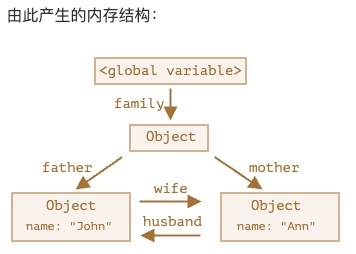
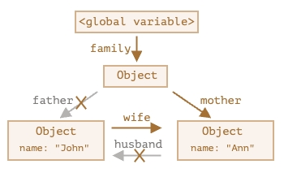
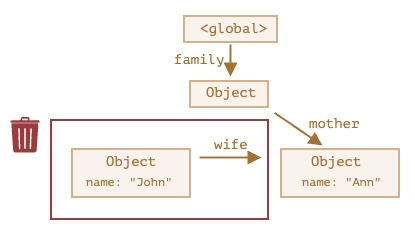
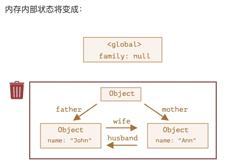
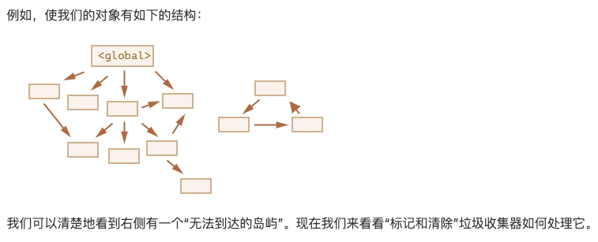
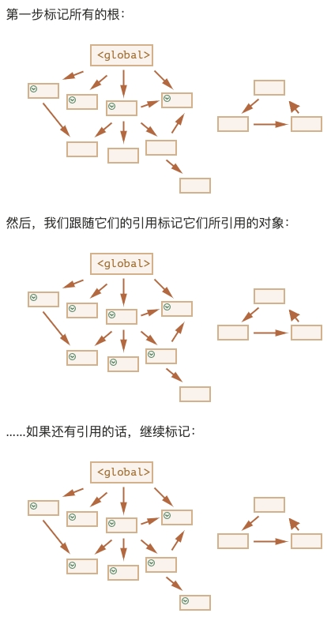
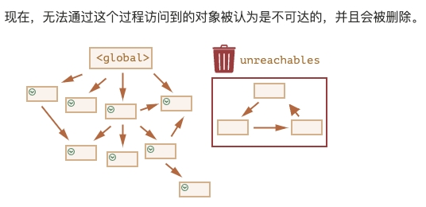

## [垃圾回收](https://zh.javascript.info/garbage-collection)（javascript.info）
对于开发者来说，JavaScript 的内存管理是自动的、无形的。我们创建的原始值、对象、函数……这一切都会占用内存。

### 可达性（Reachability）
- “可达”值是那些以某种方式可访问或可用的值。它们一定是存储在内存中的。

- JavaScript 引擎中有一个后台进程，称为 垃圾回收器（garbage collector）。它监控着所有对象的状态，并删除掉那些已经不可达的。

- 如下，全局变量 user 最初引用了对象 `{name："John"}`，后面 user 的值被重写了，这个引用就没了，对象 `{name："John"}`变成不可达的了。因为没有引用了，就不能访问到它了，所以垃圾回收器会认为该对象是垃圾数据并进行回收，然后释放内存。
  ```js
  let user = {
    name: "John"
  };
  user = null;
  ```

- 对外引用不重要，只有传入引用才可以使对象可达。
  ```js
  function marry(man, woman) {
    woman.husband = man;
    man.wife = woman;

    return {
      father: man,
      mother: woman
    }
  }

  let family = marry({
    name: "John"
  }, {
    name: "Ann"
  });
  ```
  
  ```js
  delete family.father;
  delete family.mother.husband;
  ```
  

  现在对象`father`是不可达的（虽热它有对外引用），将被从内存中删除，同时对象`father`内的所有数据也将变得不可达。
  

- 无法到达的岛屿：几个对象相互引用，但外部没有对其任意对象的引用，这些对象也可能是不可达的，并被从内存中删除。
  ```js
  function marry(man, woman) {
    woman.husband = man;
    man.wife = woman;

    return {
      father: man,
      mother: woman
    }
  }

  let family = marry({
    name: "John"
  }, {
    name: "Ann"
  });

  family = null;
  ```
  

### 内部算法
垃圾回收的基本算法被称为 “mark-and-sweep”（标记和清除）。

根（roots）：固有的可达值的基本集合。比如：
- 当前执行的函数，它的局部变量和参数。
- 当前嵌套调用链上的其他函数、它们的局部变量和参数。
- 全局变量。
- 等等......

垃圾回收器定期执行以下“垃圾回收”步骤：
- 垃圾回收器找到所有的根，并“标记”（记住）它们。
- 然后它遍历并“标记”来自它们的所有引用。
- 然后它遍历标记的对象并标记 它们的 引用。所有被遍历到的对象都会被记住，以免将来再次遍历到同一个对象。
- ……如此操作，直到所有可达的（从根部）引用都被访问到。
- 没有被标记的对象都会被删除。





### 垃圾回收算法的优化
- 分代收集（Generational collection）: 对象被分成两组：“新的”和“旧的”。在典型的代码中，许多对象的生命周期都很短：它们出现、完成它们的工作并很快死去，因此在这种情况下跟踪新对象并将其从内存中清除是有意义的。那些长期存活的对象会变得“老旧”，并且被检查的频次也会降低。

- 增量收集（Incremental collection）: 如果有许多对象，并且我们试图一次遍历并标记整个对象集，则可能需要一些时间，并在执行过程中带来明显的延迟。因此，引擎将现有的整个对象集拆分为多个部分，然后将这些部分逐一清除。这样就会有很多小型的垃圾收集，而不是一个大型的。这需要它们之间有额外的标记来追踪变化，但是这样会带来许多微小的延迟而不是一个大的延迟。

- 闲时收集（Idle-time collection）: 垃圾收集器只会在 CPU 空闲时尝试运行，以减少可能对代码执行的影响。