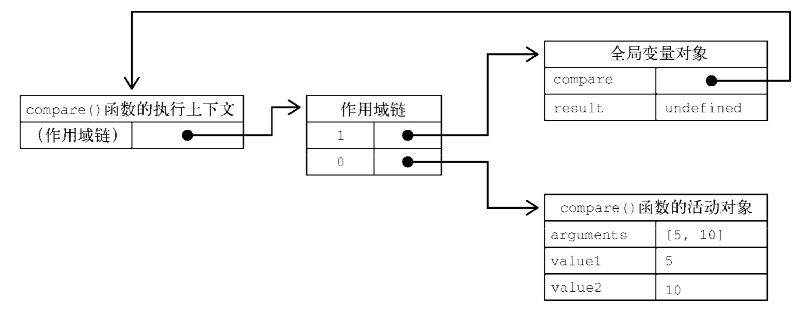
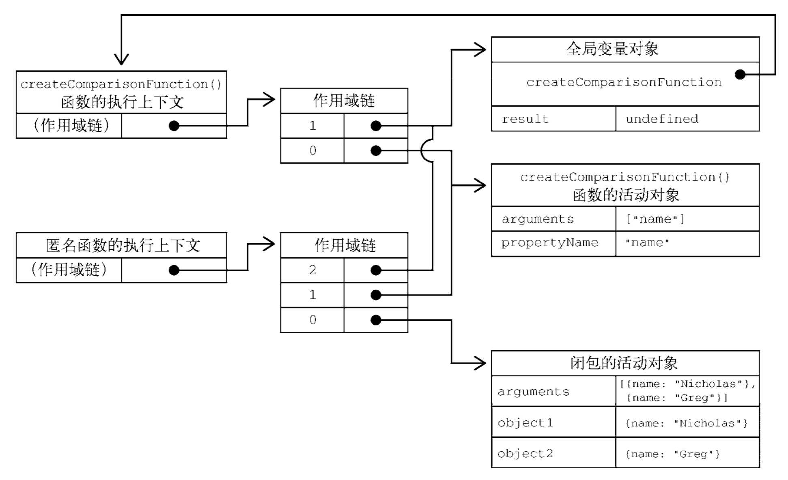

## 闭包（红宝书4）
:::tip
- 闭包是 引用了另一个函数作用域中的变量的 函数，通常是在嵌套函数中实现的。
- 理解作用域链创建和使用的细节对理解闭包非常重要。
:::

### 作用域链
- 函数执行时，每个执行上下文中都会有一个包含该执行上下文中的变量的对象。全局上下文中的叫变量对象，它会在代码执行期间始终存在。而函数局部上下文中的叫活动对象，只在函数执行期间存在。
- 在调用一个函数时，会为这个函数调用创建一个执行上下文，并创建一个作用域链。然后用 `arguments` 和其他命名参数来初始化这个函数的活动对象。
- 外部函数的活动对象是内部函数作用域链上的第二个对象。
- 这个作用域链一直向外串起了所有包含函数的活动对象，直到全局执行上下文才终止。
- 作用域链其实是一个包含指针的列表，每个指针分别指向一个变量对象，但物理上并不会包含相应的对象。

```js
function compare(value1, value2) { 
  if (value1 < value2) {  
    return -1; 
  } else if (value1 > value2) { 
    return 1; 
  } else { 
    return 0; 
  } 
} 
 
let result = compare(5, 10);
```
- 如上定义的`compare()`函数是在全局上下文中调用的。
- 第一次调用`compare()`时，会为它创建一个包含`arguments`、`value1` 和`value2` 的活动对象，这个对象是其作用域链上的第一个对象。
- 全局上下文的变量对象则是`compare()`作用域链上的第二个对象，其中包含`this`、`result` 和`compare`。


### 匿名函数的作用域链
```js
function createComparisonFunction(propertyName) { 
  return function(object1, object2) { // 内部函数（匿名函数）
    let value1 = object1[propertyName]; 
    let value2 = object2[propertyName]; 
 
    if (value1 < value2) { 
      return -1; 
    } else if (value1 > value2) { 
      return 1; 
    } else { 
      return 0; 
    } 
  }; 
}
let compare = createComparisonFunction('name'); 
let result = compare({ name: 'Nicholas' }, { name: 'Matt' });

// 解除对函数的引用，这样就可以释放内存了 
compare = null;
```
- 如上内部函数（匿名函数）中，引用了外部函数的变量`propertyName`，这个内部函数被返回并在其他地方被使用后，它仍然引用着那个变量。这是因为内部函数的作用域链包含`createComparisonFunction()`函数的作用域。

- 在函数A内部定义的函数B 会把函数A的活动对象 添加到函数B的作用域链中。



- `createComparisonFunction()`的活动对象并不能在它执行完毕后销毁，因为匿名函数的作用域链中仍然有对它的引用。在 `createComparisonFunction()`执行完毕后，其执行上下文的作用域链会销毁，但它的活动对象仍然会保留在内存中，直到匿名函数被销毁后才会被销毁(如上面的`compare = null;`)

:::tip
因为闭包会保留外层函数的作用域，所以比其他函数更占用内存。过度使用闭包可能导致内存过度占用，因此建议仅在十分必要时使用。V8 等优化的JavaScript 引擎会
努力回收被闭包困住的内存，不过我们还是建议在使用闭包时要谨慎。
:::

### 闭包中的this
- 如果内部函数没有使用箭头函数定义，则`this` 对象会在运行时绑定到执行函数的上下文。
```js
window.identity = 'The Window';

let object = { 
  identity: 'My Object',  
  getIdentityFunc() { 
    return function() { 
      return this.identity; 
    }; 
  } 
};

console.log(object.getIdentityFunc()()); // 'The Window'
```
- 每个函数在被调用时都会自动创建两个特殊变量：`this` 和 `arguments`。内部函数永远不可能直接访问外部函数的这两个变量。但是，如果把`this` 保存到闭包可以访问的另一个变量中，则是行得通的。
```js
window.identity = 'The Window'; 
 
let object = {  
  identity: 'My Object', 
  getIdentityFunc() { 
    let that = this; 
    return function() { 
      return that.identity; 
    }; 
  } 
}; 
 
console.log(object.getIdentityFunc()()); // 'My Object'
```
:::tip
`this` 和 `arguments` 都是不能直接在内部函数中访问的。如果想访问包含作用域中的`arguments` 对象，则同样需要将其引用先保存到闭包能访问的另一个变量中。
:::

- 在一些特殊情况下，`this` 值可能并不是我们所期待的值。
```js
window.identity = 'The Window'; 
let object = {  
  identity: 'My Object', 
  getIdentity () { 
    return this.identity; 
  } 
};
object.getIdentity();                         // 'My Object' 
(object.getIdentity)();                       // 'My Object' 
(object.getIdentity = object.getIdentity)();  // 'The Window'
```
>- 第一行调用 `object.getIdentity()` 是正常调用，会返回"My Object"，因为 `this.identity` 就是 `object.identity`。
>- 第二行在调用时把 `object.getIdentity` 放在了括号里。虽然加了括号之后看起来是对一个函数的引用，但 `this` 值并没有变。这是因为按照规范，`object.getIdentity` 和 `(object.getIdentity)` 是相等的。
>- 第三行执行了一次赋值，然后再调用赋值后的结果。因为赋值表达式的值是函数本身，`this` 值不再与任何对象绑定，所以返回的是"The Window"。

### 内存泄漏
由于IE 在IE9 之前对JScript 对象和COM 对象使用了不同的垃圾回收机制，所以闭包在这些旧版本IE 中可能会导致问题。在这些版本的IE 中，把HTML 元素保存在某个闭包的作用域中，就相当于宣布该元素不能被销毁。
```js
function assignHandler() {  
  let element = document.getElementById('someElement'); 
  element.onclick = () => console.log(element.id); 
}
```
以上代码创建了一个闭包，即 element 元素的事件处理程序，而这个处理程序又创建了一个循环引用，即 匿名函数引用着 `assignHandler()`的活动对象，这样就阻止了对 element 的引用计数归零。只要这个匿名函数存在，element 的引用计数就至少等于 1。也就是说，内存不会被回收。
```js
function assignHandler() {  
  let element = document.getElementById('someElement'); 
  let id = element.id; 
 
  element.onclick = () => console.log(id); 
 
  element = null; 
}
```
在这个修改后的版本中，闭包改为引用一个保存着element.id 的变量id，从而消除了循环引用。不过，光有这一步还不足以解决内存问题。因为闭包还是会引用包含函数的活动对象，而其中包含element。即使闭包没有直接引用element，包含函数的活动对象上还是保存着对它的引用。因此，必须再把element 设置为`null`。这样就解除了对这个COM 对象的引用，其引用计数也会减少，从而确保其内存可以在适当的时候被回收。

## 闭包（JS设计模式与开发实践）
:::tip
闭包的形成与变量的作用域以及变量的生存周期密切相关。
:::

### 变量的作用域
- 变量的作用域，就是指变量的有效范围。
- 在 JavaScript 中，函数可以用来创造函数作用域。在函数里面可以看到外面的变量，而在函数外面则无法看到函数里面的变量。这是因为当在函数中搜索一个变量的时候，如果该函数内并没有声明这个变量，那么此次搜索的过程会随着代码执行环境创建的作用域链往外层逐层搜索，一直搜索到全局对象为止。变量的搜索是从内到外而非从外到内的。
<CodeRun>
{
  `
  var a = 1; 
  var func1 = function(){ 
    var b = 2; 
    var func2 = function(){ 
      var c = 3;     
      console.log ( b );     // 输出：2 
      console.log ( a );     // 输出：1 
    } 
    func2(); 
    console.log ( c );    // 输出：Uncaught ReferenceError: c is not defined 
  }; 
  func1();
  `
}
</CodeRun>

### 变量的生存周期
- 全局变量的生存周期是永久的，除非我们主动销毁这个全局变量。
- 对于在函数内用var 关键字声明的局部变量来说，当退出函数时，这些局部变量即失去了它们的价值，它们都会随着函数调用的结束而被销毁。
- 以下代码中，当退出函数后，局部变量a 并没有消失，而是似乎一直在某个地方存活着。这是因为当执行`var f = func();`时，返回了一个匿名函数的引用，它可以访问到func()被调用时产生的环境，而局部变量a 一直处在这个环境里。既然局部变量所在的环境还能被外界访问，这个局部变量就有了不被销毁的理由。
<CodeRun>
{
  `
  var func = function(){ 
    var a = 1; 
    return function(){ 
      a++; 
      console.log ( a );
    } 
  }; 
  var f = func();
  f();
  f();
  f();
  f();
  `
}
</CodeRun>

- 在闭包的帮助下，把每次循环的i 值都封闭起来。当在事件函数中顺着作用域链中从内到外查找变量i 时，会先找到被封闭在闭包环境中的i
> [闭包应用场景](https://code.juejin.cn/pen/7257779268506091578)

<CodeRun>
{
  `
  var Type = {}; 
  for ( var i = 0, type; type = [ 'String', 'Array', 'Number' ][ i++ ]; ){ // type为undefined，即为false时，退出循环
    console.log('type = ', type)
    Type[ 'is' + type ] = function( obj ){ 
      console.log('i ---> ', i)
      console.log('type ---> ', type)
      return Object.prototype.toString.call( obj ) === '[object '+ type +']'; 
    } 
  };
  console.log ( Type.isArray( [] ) );     // 输出：true 
  console.log ( Type.isString( "str" ) );     // 输出：true
  `
}
</CodeRun>
<CodeRun>
{
  `
  var Type = {}; 
  for ( var i = 0, type; type = [ 'String', 'Array', 'Number' ][ i++ ]; ){ 
    (function (type) {
      console.log('type = ', type)
      Type[ 'is' + type ] = function( obj ){ 
        console.log('i ---> ', i)
        console.log('type ---> ', type)
        return Object.prototype.toString.call( obj ) === '[object '+ type +']'; 
      }
    })(type) 
  };
  console.log ( Type.isArray( [] ) );     // 输出：true 
  console.log ( Type.isString( "str" ) );     // 输出：true
  `
}
</CodeRun>

### 闭包的作用
#### 封装变量
闭包可以帮助把一些不需要暴露在全局的变量封装成“私有变量”。
<CodeRun>
{
  `
  var cache = {};
  var mult = function(){ 
    var args = Array.prototype.join.call( arguments, ',' ); 
    if ( cache[ args ] ){ 
      return cache[ args ]; 
    }
    var a = 1; 
    for ( var i = 0, l = arguments.length; i < l; i++ ){ 
      a = a * arguments[i];  
    } 
    return cache[ args ] = a; 
  };
  console.log ( mult( 1,2,3 ) );     // 输出：6 
  console.log ( mult( 1,2,3 ) );     // 输出：6
  `
}
</CodeRun>
如上，cache 这个变量仅仅在mult 函数中被使用，与其让cache 变量跟mult 函数一起平行地暴露在全局作用域下，不如把它封闭在 mult 函数内部，这样可以减少页面中的全局变量，以避免这个变量在其他地方被不小心修改而引发错误。如果在一个大函数中有一些代码块能够独立出来，我们常常把这些代码块封装在独立的小函数里面。独立出来的小函数有助于代码复用，如果这些小函数有一个良好的命名，它们本身也起到了注释的作用。如果这些小函数不需要在程序的其他地方使用，最好是把它们用闭包封闭起来。
<CodeRun>
{
  `
  var mult = (function() {
    var cache = {};
    var calculate = function(){   // 封闭calculate 函数 
      var a = 1; 
      for ( var i = 0, l = arguments.length; i < l; i++ ){ 
        a = a * arguments[i];  
      } 
      return a; 
    };
    return function(){ 
      var args = Array.prototype.join.call( arguments, ',' ); 
      if ( args in cache ){ 
        return cache[ args ]; 
      }
      return cache[ args ] = calculate.apply( null, arguments ); 
    }
  })();
  console.log ( mult( 1,2,3 ) );     // 输出：6
  `
}
</CodeRun>

#### 延续局部变量的寿命
> 局部变量本来应该在函数退出的时候被解除引用，但如果局部变量被封闭在闭包形成的环境中，那么这个局部变量就能一直生存下去。

闭包写法：
<CodeRun>
{
  `
  var extent = function(){ 
    var value = 0; 
    return { 
      call: function(){ 
        value++; 
        console.log( value ); 
      }
    } 
  }; 
  var extent = extent(); 
  extent.call();     // 输出：1 
  extent.call();     // 输出：2 
  extent.call();     // 输出：3 
  `
}
</CodeRun>
面向对象写法：
<CodeRun>
{
  `
  var extent = { 
    value: 0, 
    call: function(){ 
      this.value++; 
      console.log( this.value ); 
    } 
  }; 
  extent.call();     // 输出：1 
  extent.call();     // 输出：2 
  extent.call();     // 输出：3
  `
}
</CodeRun>
<CodeRun>
{
  `
  var Extent = function(){ 
    this.value = 0; 
  }; 
  Extent.prototype.call = function(){ 
    this.value++; 
    console.log( this.value ); 
  }; 
  var extent = new Extent(); 
  extent.call(); 
  extent.call(); 
  extent.call();
  `
}
</CodeRun>

### 闭包与内存管理
- 使用闭包的一部分原因是我们选择主动把一些变量封闭在闭包中，因为可能在以后还需要使用这些变量，把这些变量放在闭包中和放在全局作用域，对内存方面的影响是一致的，这里并不能说成是内存泄露。如果在将来需要回收这些变量，我们可以手动把这些变量设为`null`。

- 使用闭包的同时比较容易形成循环引用，如果闭包的作用域链中保存着一些DOM 节点，这时候就有可能造成内存泄露。但这本身并非闭包的问题，也并非 JavaScript 的问题。(在基于引用计数策略的垃圾回收机制中，如果两个对象之间形成了循环引用，那么这两个对象都无法被回收，但循环引用造成的内存泄露在本质上也不是闭包造成的。同样，如果要解决循环引用带来的内存泄露问题，我们只需要把循环引用中的变量设为`null`即可。将变量设置为 `null` 意味着切断变量与它此前引用的值之间的连接。当垃圾收集器下次运行时，就会删除这些值并回收它们占用的内存。)


## [JavaScript Closures](https://www.javascripttutorial.net/javascript-closure/)
:::tip
In JavaScript, a closure is a function that references variables in the outer scope from its inner scope. The closure preserves the outer scope inside its inner scope. 一个闭包是一个函数，它从其内部作用域引用外部作用域中的变量。闭包将外部作用域保留在其内部作用域内。
:::

### 1. Lexical scoping 词法作用域
:::tip
Lexical scoping defines the scope of a variable by the position of that variable declared in the source code. 词法作用域 通过变量在代码中声明的位置 来定义变量的作用域。

JavaScript engine uses the scope to manage the variable accessibility.
:::
```js
let name = 'John';

function greeting() { 
  let message = 'Hi';
  console.log(message + ' '+ name);
}
```
- The variable `name` is a global variable. It is accessible from anywhere including within the `greeting()`function.
- The variable `message` is a local variable that is accessible only within the `greeting()` function.
- If you try to access the `message` variable outside the `greeting()` function, you will get an error.

According to lexical scoping, the scopes can be nested and the inner function can access the variables declared in its outer scope. 根据词法作用域，作用域可以嵌套，内部函数可以访问在其外部作用域中声明的变量。
```js
function greeting() {
  let message = 'Hi';

  function sayHi() {
    console.log(message);
  }

  sayHi();
}

greeting();
```
- The `greeting()` function creates a local variable named `message` and a function named `sayHi()`.
- The `sayHi()` is the inner function that is available only within the body of the `greeting()` function.
- The `sayHi()` function can access the variables of the outer function such as the `message` variable of the `greeting()` function.
- Inside the `greeting()` function, we call the `sayHi()` function to display the message Hi.

### 2. JavaScript closures 闭包
```js
function greeting() {
  let message = 'Hi';

  function sayHi() {
    console.log(message);
  }

  return sayHi;
}
// assigned the hi variable the value returned by the greeting() function, which is a reference of the sayHi() function. 为 hi 变量分配了 greeting() 函数返回的值，这是 sayHi() 函数的引用。
let hi = greeting();
hi(); // still can access the message variable
```
通常情况下，局部变量仅在函数执行期间存在。这意味着当 greeting() 函数执行完毕后，message变量将无法再访问。在这个例子中，我们执行引用 sayHi() 函数的 hi() 函数，message变量仍然存在。**sayHi() 函数是一个闭包。**

**A closure is a function that preserves the outer scope in its inner scope.**

```js
function greeting(message) {
  return function(name) {
    return message + ' ' + name;
  }
}
let sayHi = greeting('Hi');
let sayHello = greeting('Hello');

console.log(sayHi('John')); // Hi John
console.log(sayHello('John')); // Hello John
```
- The `greeting()` function behaves like a function factory. It creates `sayHi()` and `sayHello()` functions.
- **The `sayHi()` and `sayHello()` are closures.** They share the same function body but store different scopes.
- In the `sayHi() closure`, the `message` is Hi, while in the `sayHello() closure` the `message` is Hello.

### 3. JavaScript closures in a loop
```jsx live
function showAlert() {

  function showResult() {
    // begin
    for (var index = 1; index <= 3; index++) {
      setTimeout(function () {
        alert('after ' + index + ' second(s):' + index);
      }, index * 1000);
    }
    // end
  }

  return <div>
    <button onClick={showResult}>查看结果</button>
  </div>
}
```
- The reason you see the same message after 4 seconds is that the callback passed to the `setTimeout()` a closure. It remembers the value of `i` from the last iteration of the loop, which is 4. 您在 4 秒后看到相同消息的原因是回调传递给 setTimeout() 一个闭包。它会记住循环最后一次迭代中 i 的值，即 4。

- In addition, all three closures created by the for-loop share the same global scope access the same value of `i`. 此外，for 循环创建的所有三个闭包共享相同的全局作用域访问相同的 i 值。

To fix this issue, you need to create a new closure scope in each iteration of the loop. 要解决此问题，您需要在循环的每次迭代中创建一个新的闭包作用域。There are two popular solutions: IIFE & `let` keyword.
1. Using the IIFE solution

In this solution, you use an `immediately invoked function expression` (a.k.a IIFE) because an IIFE creates a new scope by declaring a function and immediately execute it. 在此解决方案中，您使用一个立即调用的函数表达式（又名 IIFE），因为 IIFE 通过声明一个函数并立即执行它来创建一个新的作用域。
```jsx live
function showAlert() {

  function showResult() {
    // begin
    for (var index = 1; index <= 3; index++) {
      (function (index) {
        setTimeout(function () {
          alert('after ' + index + ' second(s):' + index);
        }, index * 1000);
      })(index);
    }
    // end
  }

  return <div>
    <button onClick={showResult}>查看结果</button>
  </div>
}
```

2. Using let keyword in ES6

If you use the `let` keyword in the for-loop, it will create a new lexical scope in each iteration. In other words, you will have a new `index` variable in each iteration. 

In addition, the new lexical scope is chained up to the previous scope so that the previous value of the index is copied from the previous scope to the new one. 此外，新的词法作用域链接到先前的作用域，以便将index的先前值从先前的作用域复制到新的作用域。
```jsx live
function showAlert() {

  function showResult() {
    // begin
    for (let index = 1; index <= 3; index++) {
      setTimeout(function () {
        alert('after ' + index + ' second(s):' + index);
      }, index * 1000);
    }
    // end
  }

  return <div>
    <button onClick={showResult}>查看结果</button>
  </div>
}
```