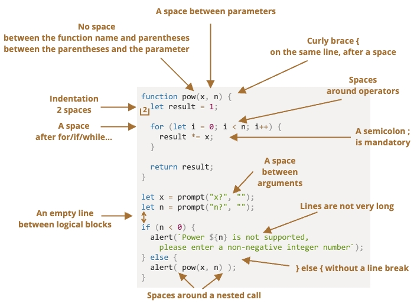

## [代码风格](https://zh.javascript.info/coding-style)

一些受欢迎的风格指南：
- [Google JavaScript 风格指南](https://google.github.io/styleguide/jsguide.html)
- [Airbnb JavaScript 风格指南](https://github.com/airbnb/javascript)
- [Idiomatic.JS](https://github.com/rwaldron/idiomatic.js)
- [StandardJS](https://standardjs.com/)

## 检查器
检查器（Linters）是可以自动检查代码，并提出改进建议的工具。

### [ESLint](https://eslint.org/)