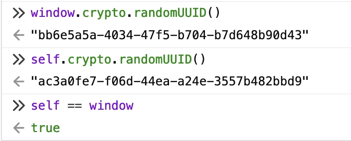

# JavaScript
:::info
JavaScript 没有输入或输出的概念，它是一个在宿主环境（host environment）下运行的脚本语言，任何与外界沟通的机制都是由宿主环境提供的。浏览器是最常见的宿主环境，但在非常多的其他程序中也包含 JavaScript 解释器，如 Adobe Acrobat、Adobe Photoshop、SVG 图像、Yahoo！的 Widget 引擎，Node.js 之类的服务器端环境，NoSQL 数据库（如开源的 [Apache CouchDB](https://couchdb.apache.org/))、嵌入式计算机，以及包括 [GNOME](https://www.gnome.org/)（注：GNU/Linux 上最流行的 GUI 之一）在内的桌面环境等等。

JavaScript 是一种多范式的动态语言，它包含类型、运算符、标准内置（built-in）对象和方法。

JavaScript 支持面向对象编程。JavaScript是通过**[原型链（prototype chain）](https://developer.mozilla.org/zh-CN/docs/Web/JavaScript/Inheritance_and_the_prototype_chain)**而不是 [类](https://developer.mozilla.org/zh-CN/docs/Web/JavaScript/Reference/Classes) 来支持面向对象编程。

JavaScript 也支持函数式编程。在JavaScript中，函数也是对象，函数也可以被保存在变量中，并且像其他对象一样被传递。

学习资料：
- [重新介绍 JavaScript](https://developer.mozilla.org/zh-CN/docs/Web/JavaScript/Language_Overview)
- [Learn ES2015](https://babeljs.io/docs/en/learn)
- [ecma](https://www.ecma-international.org/)
- [tc39](https://tc39.es/) 所属 Ecma International 的 TC39 是一个由 JavaScript 开发者、实现者、学者等组成的团体，与 JavaScript 社区合作维护和发展 JavaScript 的标准。
:::

## 一、基础
### 1. 类型
- Number（数字）
- String（字符串）
- Boolean（布尔）
- Symbol（符号）（ES2015 新增）
- Object（对象）
  - Function（函数）
  - Array（数组）
  - Date（日期）
  - RegExp（正则表达式）
- null（空）
- undefined（未定义）

JavaScript 还有一种内置的 [Error（错误）](https://developer.mozilla.org/zh-CN/docs/Web/JavaScript/Reference/Global_Objects/Error)类型。

JavaScript 还有一种内置的 [BigInt](https://developer.mozilla.org/zh-CN/docs/Web/JavaScript/Reference/Global_Objects/BigInt) 类型。

```jsx live
alert(undefined == null)
alert(undefined == 0)
alert(null == 0)
```

### 2. 异步
```jsx live
function AsyncDemo(props) {
  
  const showResult = () => {
    async function async1() {
      alert('async1 start');
      await async2();
      alert('async1 end');
    }
    async function async2() {
      alert('async2');
    }
    alert('script start');
    setTimeout(function() {
      alert('setTimeout');
    }, 0);
    async1();
    new Promise(function(resolve) {
      alert('promise1');
      resolve();
    }).then(function() {
      alert('promise2');
    });
    alert('script end');
    /*
    正确结果：
    script start
    async1 start
    async2
    promise1
    script end
    async1 end
    promise2
    setTimeout
    */
  }
  return (
    <div>
      <p onClick={showResult}>查看执行结果</p>
    </div>
  );
}
```

### 3. 正则表达式
#### 3.1 提取小括号中的内容
```jsx live
function demo(props) {
  // 提取小括号中的内容
  let sourceStr = 'aa(bb)cc';
  let regex = /\((.+)\)/g; // 匹配小括号
  let tempString = sourceStr.match(regex)[0];
  let result = tempString.substring(1,tempString.length-1);

  return (
    <p>结果为：{result}</p>
  )
}
```

#### 3.2 手机号码中间 4 位用星号（*）替换显示
```jsx live
function demo(props) {
  // 提取小括号中的内容
  let phone = '13701134148';
  let result = phone.replace(/^(\d{3})\d{4}(\d+)/, '$1****$2');

  return (
    <p>结果为：{result}</p>
  )
}
```

### 4. [JavaScript modules](https://developer.mozilla.org/en-US/docs/Web/JavaScript/Guide/Modules)
- 随着运行大量 JavaScript 脚本的复杂程序的出现，以及 JavaScript 被用在其他环境（例如 Node.js），将 JavaScript 程序拆分为可按需导入的单独模块的机制 就尤为重要。
- 最新的浏览器开始原生支持模块功能了，浏览器能够最优化加载模块，使它比使用库更有效率（使用库通常需要做额外的客户端处理）。
- 演示模块的使用的例子集合：[simple set of examples](https://github.com/mdn/js-examples/tree/master/module-examples)

### 5. 函数
[如何将js回调函数中的数据返回给最外层函数？](https://segmentfault.com/q/1010000013400193/a-1020000013407882)

### 6. 拷贝
:::tip
In JavaScript, all standard built-in object-copy operations (
  - spread syntax
  - Array.prototype.concat()
  - Array.prototype.slice()
  - Array.from()
  - Object.assign()
  - Object.create()
) create shallow copies rather than deep copies.
:::
#### 6.1 [Shallow copy](https://developer.mozilla.org/en-US/docs/Glossary/Shallow_copy)

#### 6.2 [Deep copy](https://developer.mozilla.org/en-US/docs/Glossary/Deep_copy)

### 7. throw
:::info
throw 语句用来抛出一个用户自定义的异常，当前函数的执行将被停止（throw 之后的语句将不会执行），并且控制将被传递到调用堆栈中的第一个 catch 块。如果调用者函数中没有 catch 块，程序将会终止。
:::

### 8. ES2015风格的计算属性命名功能
> [计算属性名](https://developer.mozilla.org/zh-CN/docs/Web/JavaScript/Reference/Operators/Object_initializer#%E8%AE%A1%E7%AE%97%E5%B1%9E%E6%80%A7%E5%90%8D)

ES2015中，使用字面量创建对象时也可以使用变量来创建属性名，具体方案是使用计算属性名（computed property name），使用形式是 `[property]` 或 `[表达式]`，如：
```js
var i = 1;
var obj = {
  [i]: 3
};
console.log(obj); // {'1': 3}

var obj = {
  a: 1
};
obj.b = 2;
var k = 'c';
obj[k] = 3;
obj['a'] = 0;
console.log(obj);

// [表达式]
var i = 0;
var a = {
  ["foo" + ++i]: i,
  ["foo" + ++i]: i,
  ["foo" + ++i]: i
};

console.log(a.foo1); // 1
console.log(a.foo2); // 2
console.log(a.foo3); // 3

var param = 'size';
var config = {
  [param]: 12,
  ["mobile" + param.charAt(0).toUpperCase() + param.slice(1)]: 4
};

console.log(config); // { size: 12, mobileSize: 4 }
```

### 9. [Ajax（Asynchronous JavaScript and XML）](https://developer.mozilla.org/en-US/docs/Web/Guide/AJAX/Getting_Started)
Asynchronous JavaScript and XML, or Ajax, is not a technology in itself, but rather an approach to using a number of existing technologies together, including HTML or [XHTML](https://developer.mozilla.org/en-US/docs/Glossary/XHTML), CSS, JavaScript, DOM, XML, [XSLT](https://developer.mozilla.org/en-US/docs/Web/XSLT), and most importantly the XMLHttpRequest object. 异步 JavaScript 和 XML(或 Ajax) 本身并不是一种技术，而是一种结合使用多种现有技术的方法，包括 HTML 或 XHTML、CSS、JavaScript、DOM、XML、XSLT，以及最重要的 XMLHttpRequest 对象。

当这些技术结合在 Ajax 模型中时，Web 应用程序能够对用户界面进行快速、增量更新，而无需重新加载整个浏览器页面。这使应用程序更快，对用户操作的响应更快。

虽然 Ajax 中的 X 代表 XML，但首选 JSON，因为它的大小更轻，而且是用 JavaScript 编写的。 JSON 和 XML 都用于 Ajax 模型中的信息打包。

## 二、API(应区分JS内置API和宿主环境API)
### 1. Object
#### 1.1 Object.fromEntries
:::note
Object.fromEntries() 方法接收一个键值对的列表参数，并返回一个带有这些键值对的新对象。这个迭代参数应该是一个能够实现@@iterator方法的的对象，返回一个迭代器对象。它生成一个具有两个元素的类数组的对象，第一个元素是将用作属性键的值，第二个元素是与该属性键关联的值。
Object.fromEntries() 执行与 Object.entries 互逆的操作。
:::
```js
// Map 转化为 Object
const map = new Map([ ['foo', 'bar'], ['baz', 42] ]);
const obj = Object.fromEntries(map);
console.log(obj); // { foo: "bar", baz: 42 }

// Array 转化为 Object
const arr = [ ['0', 'a'], ['1', 'b'], ['2', 'c'] ];
const obj = Object.fromEntries(arr);
console.log(obj); // { 0: "a", 1: "b", 2: "c" }
```

#### 1.2 [Object.create](https://developer.mozilla.org/zh-CN/docs/Web/JavaScript/Reference/Global_Objects/Object/create)
:::note
Object.create() 方法用于创建一个新对象，使用现有的对象来作为新创建对象的原型（prototype）。
:::

#### 1.3 [Object.getPrototypeOf](https://developer.mozilla.org/zh-CN/docs/Web/JavaScript/Reference/Global_Objects/Object/GetPrototypeOf)
:::note
Object.getPrototypeOf() 方法返回指定对象的原型（内部[[Prototype]]属性的值）。
:::

#### 1.4 Object.is
用于判断两个值是否相同。
```js
// Case 1: Evaluation result is the same as using ===
Object.is(25, 25); // true
Object.is("foo", "foo"); // true
Object.is("foo", "bar"); // false
Object.is(null, null); // true
Object.is(undefined, undefined); // true
Object.is(window, window); // true
Object.is([], []); // false
const foo = { a: 1 };
const bar = { a: 1 };
const sameFoo = foo;
Object.is(foo, foo); // true
Object.is(foo, bar); // false
Object.is(foo, sameFoo); // true

// Case 2: Signed zero
Object.is(0, -0); // false
Object.is(+0, -0); // false
Object.is(-0, -0); // true

// Case 3: NaN
Object.is(NaN, 0 / 0); // true
Object.is(NaN, Number.NaN); // true
```

### 2. HTMLElement
#### 2.1 dragstart
> 当用户开始拖动一个元素或者一个选择文本的时候 dragstart 事件就会触发。

#### 2.2 dragend
> dragend 事件在拖放操作结束时触发（通过释放鼠标按钮或单击 escape 键）。该事件无法取消。

#### 2.3 dragenter
> 当拖动的元素或被选择的文本进入有效的放置目标时， dragenter 事件被触发。

#### 2.4 dragleave
> dragleave 事件在拖动的元素或选中的文本离开一个有效的放置目标时被触发。此事件不可取消。

#### 2.5 dragover
> 当元素或者选择的文本被拖拽到一个有效的放置目标上时，触发 dragover 事件（每几百毫秒触发一次）。这个事件在可被放置元素的节点上触发。

#### 2.6 drag
> drag 事件在用户拖动元素或选择的文本时，每隔几百毫秒就会被触发一次。

#### 2.7 drop
> drop 事件在元素或选中的文本被放置在有效的放置目标上时被触发。


- 在 dragstart 事件处理器中，获得对用户拖动的元素的引用。
- 在目标容器的 dragover 事件处理器中，调用 event.preventDefault()，以使得该元素能够接收 drop 事件。
- 在放置区域的 drop 事件处理器中，将可拖动元素从原先的容器移动到该放置区域。

### 3. 循环
#### 3.1 Array.prototype.forEach()
:::info
除了抛出异常以外，没有办法中止或跳出 forEach() 循环。若你需要提前终止循环，你可以使用：
- 一个简单的 for 循环
- for...of / for...in 循环
- Array.prototype.every()
- Array.prototype.some()
- Array.prototype.find()
- Array.prototype.findIndex()
:::

forEach中的return：退出当前函数，但迭代继续。

#### 3.2 for...of
- 对于for...of的循环，可以由 break, throw 或 return 终止。
- for...of 语句遍历可迭代对象定义要迭代的数据。
> 若一个对象拥有迭代行为，那么这个对象便是一个可迭代对象。为了实现可迭代，一个对象必须实现 @@iterator 方法，这意味着这个对象（或其原型链中的任意一个对象）必须具有一个带 Symbol.iterator 键（key）的属性。
```js
// 自定义可迭代对象
var myIterable = {
  *[Symbol.iterator]() {
    yield 1;
    yield 2;
    yield 3;
  }
}

for (let value of myIterable) {
  console.log(value);
}

console.log([...myIterable])
```
[查看执行结果](https://code.juejin.cn/pen/7163182011257978884)

#### 3.3 for...in
- for...in 语句以任意顺序迭代一个对象的除Symbol以外的可枚举属性，包括继承的可枚举属性。
> 可枚举属性是指那些内部“可枚举”标志设置为 true 的属性，对于通过直接的赋值和属性初始化的属性，该标识值默认为 true，对于通过 `Object.defineProperty` 等定义的属性，该标识值默认为 false。

- for...in不应该用于迭代一个关注索引顺序的 Array。
- for...in是为遍历对象属性而构建的，不建议与数组一起使用，数组可以用Array.prototype.forEach()和for...of

#### 3.4 for...of 和 for...in的区别
```js
Object.prototype.objCustom = function() {};
Array.prototype.arrCustom = function() {};

let iterable = [3, 5, 7];
iterable.foo = 'hello';

for (let i in iterable) {
  console.log('forin::', i); // 0 1 2 foo arrCustom objCustom
}

for (let i in iterable) {
  if (iterable.hasOwnProperty(i)) {
    console.log('forin-iterable has property::', i);  // 0 1 2 foo
  }
}

for (let i of iterable) {
  console.log('forof::', i); // 3 5 7
}
```
[查看执行结果](https://code.juejin.cn/pen/7163183675436171299)

### 4. export
- export 语句用于从模块中导出实时绑定的函数、对象或原始值，以便其他程序可以通过 import 语句使用它们。
- 无论您是否声明，导出的模块都处于严格模式。export 语句不能用在嵌入式脚本中。

### 5. Intl
> Intl 对象是 ECMAScript 国际化 API 的一个命名空间，它提供了精确的字符串对比、数字格式化，和日期时间格式化。

### 6. [Crypto](https://developer.mozilla.org/en-US/docs/Web/API/Crypto)
> Crypto 接口提供了基本的加密功能，可用于当前的上下文中。

- 在浏览器控制台可以如下使用：


- 但是在js中不能使用`randomUUID()`及`self`对象，可以使用`getRandomValues`：
```js
const array = new Uint32Array(1);
window.crypto.getRandomValues(array);
console.log(JSON.stringify(array));
```
[查看执行结果](https://code.juejin.cn/pen/7163899016164409380)

### 7. base64
[url、base64、blob相互转换方法](https://juejin.cn/post/6959003541457502222)

#### 7.1 base64解密
> 参考：[原来浏览器原生支持JS Base64编码解码](https://www.zhangxinxu.com/wordpress/2018/08/js-base64-atob-btoa-encode-decode/)
- 浏览器中
```js
const decodedData = window.atob(encodedData);
```
- Service Workers和Web Workers中
```js
const decodedData = self.atob(encodedData);
```
#### 7.2 base64加密
- 浏览器中
```js
const encodedData = window.btoa(stringToEncode);
```
- Service Workers和Web Workers中
```js
const encodedData = self.btoa(stringToEncode);
```

### 8. switch
Switch case 使用严格比较（===）。

值必须与要匹配的类型相同。

只有操作数属于同一类型时，严格比较才能为 true。

### 9. Window
#### 9.1 window.prompt
> 显示一个对话框，对话框中包含一条文字信息，用来提示用户输入文字。
```js
result = window.prompt(text, value);

// result 用来存储用户输入文字的字符串，或者是 null。
// text 用来提示用户输入文字的字符串，如果没有任何提示内容，该参数可以省略不写。
// value 文本输入框中的默认值，该参数也可以省略不写。不过在 Internet Explorer 7 和 8 中，省略该参数会导致输入框中显示默认值"undefined"。
```

### 10. Node
> 各种类型的 DOM API 对象会从这个接口继承

#### 10.1 Node.appendChild()

### 11. XMLHttpRequest
XMLHttpRequest (XHR) 对象用于与服务器交互，这使网页可以只更新页面的一部分，而不会中断用户正在做的事情。

### 12. Fetch API
#### 12.1 `fetch()`

### 13. FormData
FormData 接口提供了一种表示表单数据的键值对 key/value 的构造方式，可以使用 fetch() 或 XMLHttpRequest.send() 方法发送这些值。如果编码类型设置为“multipart/form-data”，它使用的格式与表单使用的格式相同。

### 14. URL API
#### 14.1 URLSearchParams
```js
const paramsString1 = 'http://example.com/search?query=%40';
const searchParams1 = new URLSearchParams(paramsString1);

console.log(searchParams1.has('query')); // false
console.log(searchParams1.has('http://example.com/search?query')); // true

console.log(searchParams1.get('query')); // null
console.log(searchParams1.get('http://example.com/search?query')); // "@" (equivalent to decodeURIComponent('%40'))

const paramsString2 = '?query=value';
const searchParams2 = new URLSearchParams(paramsString2);
console.log(searchParams2.has('query')); // true

const url = new URL('http://example.com/search?query=%40');
const searchParams3 = new URLSearchParams(url.search);
console.log(searchParams3.has('query')); // true

```

## 三、手写函数
### 1. 去重
```js
/**
 * 去重
 */
handleDeduplicate(sourceArray,keyName) {
  let deduplicationList = [];
  let obj = {};
  for (let item of sourceArray) {
    if (!obj[item[keyName]]) {
      deduplicationList.push(item);
      obj[item[keyName]] = 1;
    }
  }
  return deduplicationList;
},
```

### 2. 循环删数组元素
```js
var arr = [1,2,2,3,4,5];
var i = arr.length;
// 从后往前遍历
while(i--){
  if(arr[i]==2){
    arr.splice(i,1);
  }
}
console.log(arr);
```
> 也可以使用filter实现
```js
var stuArr = [
  {name:'Jesse',gender:'male'},
  {name:'Leo',gender:'male'},
  {name:'Sophia',gender:'female'},
  {name:'Kathy',gender:'female'},
  {name:'Gaviin',gender:'male'}
];

stuArr = stuArr.filter(function(item){
  return item.gender !== 'male';
})
// 运行结果，删除后数组当前值
[
  {name:'Sophia',gender:'female'},
  {name:'Kathy',gender:'female'},
]
```

### 3. 使用weakmap实现深拷贝
```js
/**
 * 使用weakmap手写深拷贝
 */
deepClone(obj, hash = new WeakMap()) {
  const isComplexDataType = obj => (typeof obj === 'object' || typeof obj === 'function') && (obj !== null);
  if (obj.constructor === Date) return new Date(obj);
  if (obj.constructor === RegExp) return new RegExp(obj);
  if (hash.has(obj)) return hash.get(obj);
  let allDesc = Object.getOwnPropertyDescriptor(obj);
  let cloneObj = Object.create(Object.getPrototypeOf(obj), allDesc);
  hash.set(obj, cloneObj);
  for (const key of Reflect.ownKeys(obj)) {
    cloneObj[key] = (isComplexDataType(obj[key]) && typeof obj[key] !== 'function') ? this.deepClone(obj[key], hash) : obj[key];
  }
  return cloneObj;
},
```

### 4. 数组转树；树转数组
> 参考：[list和tree的相互转换](https://juejin.cn/post/6952442048708345863)
