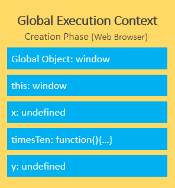
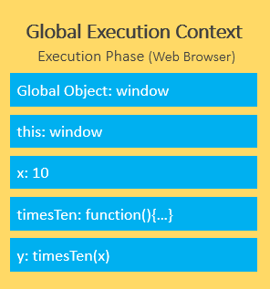
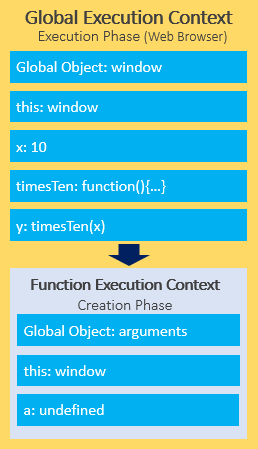
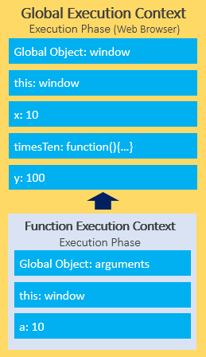

## 1. 作用域

## 2. [this](https://developer.mozilla.org/en-US/docs/Web/JavaScript/Reference/Operators/this)
> [Understanding Javascript ‘this’ keyword (Context)](https://towardsdatascience.com/javascript-context-this-keyword-9a78a19d5786)
:::tip
this 的值取决于它出现的上下文：函数、类或全局。The value of this depends on in which context it appears: function, class, or global.
:::

### 6.1 全局上下文环境
无论是否在严格模式下，在全局执行环境中（在任何函数体外部）this 都指向全局对象。
```js
console.log(this === window); // true
```
:::tip
可以使用 [globalThis](https://developer.mozilla.org/zh-CN/docs/Web/JavaScript/Reference/Global_Objects/globalThis) 获取全局对象，无论你的代码是否在当前上下文运行。
:::

### 6.2 函数上下文(function context)环境
- 在函数内部，this的值取决于函数被调用的方式。在绝大多数情况下，函数的调用方式决定了 this 的值（运行时绑定）。
- this 不能在执行期间被赋值，并且在每次函数被调用时 this 的值也可能会不同。
- ES5 引入了 bind 方法来设置函数的 this 值，而不用考虑函数如何被调用的。
- ES2015 引入了箭头函数，箭头函数不提供自身的 this 绑定（this 的值将保持为 闭合词法上下文(the enclosing lexical context) 的值）。

- 一般而言，this 的值是访问该函数的对象。换句话说，如果函数调用的形式是 `obj.f()`，那么 this 指的是 `obj`。
- this 的值总是根据函数的调用方式而变化，即使函数是在创建对象时定义的
```jsx live
function showAlert() {

  // begin
  const test = {
    prop: 42,
    func: function() {
      return this.prop;
    },
  };

  const obj4 = {
    name: "obj4",
    getThis() {
      return this;
    },
  };
  const obj5 = { name: "obj5" };
  obj5.getThis = obj4.getThis;
  // end

  function showResult() {
    alert(test.func());
  }
  function showResult2() {
    alert(obj5.getThis());
  }
  return (
    <div>
      <button onClick={showResult}>查看test.func()的结果</button>
      <button onClick={showResult2}>查看obj5.getThis()的结果</button>
    </div>
  );
}
```

- 注意：The value of `this` is not the object that has the function as an own property, but the object that is used to call the function. You can prove this by calling a method of an object up in the prototype chain. this 的值不是 将该函数作为自身属性 的对象，而是 调用该函数 的对象
```jsx live
function showAlert() {

  // begin
  function getThis() {
    return this;
  }

  const obj1 = { name: "obj1" };
  obj1.getThis = getThis;

  const obj3 = {
    __proto__: obj1,
    name: "obj3",
  };
  // end

  function showResult() {
    alert(JSON.stringify(obj1.getThis()))
  }
  function showResult2() {
    alert(JSON.stringify(obj3.getThis()));
  }
  return (
    <div>
      <button onClick={showResult}>查看obj1.getThis()的结果</button>
      <button onClick={showResult2}>查看obj3.getThis()的结果</button>
    </div>
  );
}
```

- 严格模式和非严格模式。在非严格模式下，this总是指向一个对象(In non-strict mode, a special process called this substitution ensures that the value of this is always an object. )，在严格模式下可以是任意值。
```jsx live
function showAlert() {
  // begin
  function getThisStrict() {
    "use strict"; // Enter strict mode
    return this;
  }
  function getThis() {
    return this;
  }
  // end

  function showResult() {
    alert(typeof getThis()); // object
  }
  function showResult2() {
    alert(typeof getThisStrict()); // undefined
  }
  function showResult3() {
    alert(getThis() === globalThis); // true
  }
  return (
    <div>
      <button onClick={showResult}>查看typeof getThis()的结果</button>
      <button onClick={showResult2}>查看typeof getThisStrict()的结果</button>
      <button onClick={showResult3}>查看getThis() === globalThis的结果</button>
    </div>
  );
}
```

- 可以使用 Function.prototype.call()、Function.prototype.apply() 或 Reflect.apply() 方法显式设置 this 的值。

- 使用 Function.prototype.bind()，您可以创建一个 this具有特定值 的新函数，无论函数如何调用，该this值都不会改变。

- 当函数作为回调传递时，this 的值取决于回调的调用方式。直接调用回调函数(而不将其附加到任何对象)时，严格模式下，回调函数的this值为undefined，非严格模式下，回调函数的this值为globalThis。
```jsx live
function showAlert() {
  // begin
  function logThisStrict() {
    "use strict";
    alert(this); // undefined undefined undefined
  }
  function logThis() {
    alert(this);
    alert(this === globalThis);
  }

  function showResult() {
    [1, 2, 3].forEach(logThisStrict);
  }
  function showResult2() {
    [1, 2, 3].forEach(logThis);
  }
  // end

  return <div>
    <button onClick={showResult}>查看严格模式回调函数this</button>
    <button onClick={showResult2}>查看非严格模式回调函数this</button>
  </div>
}
```

- 一些API允许设置回调函数的this值，比如所有迭代数组的API，接收一个可选的参数thisArg
```jsx live
function showAlert() {
  // begin
  function logThisStrict() {
    "use strict";
    alert(JSON.stringify(this));
  }
  function logThis() {
    alert(JSON.stringify(this));
  }
  // end

  function showResult() {
    [1, 2, 3].forEach(logThisStrict, { name: "obj" });
  }
  function showResult2() {
    [1, 2, 3].forEach(logThis, { name: "obj" });
  }
  return <div>
    <button onClick={showResult}>查看有thisArg参数的forEach回调的this</button>
    <button onClick={showResult2}>查看有thisArg参数的forEach回调的this</button>
  </div>
}
```


## 3. 执行上下文（execution context）
:::tip
- [Execution Contexts](https://tc39.es/ecma262/#sec-execution-contexts)
- [JavaScript Execution Context – How JS Works Behind The Scenes](https://www.freecodecamp.org/news/execution-context-how-javascript-works-behind-the-scenes/)
- [Javascript Execution Context and Hoisting](https://levelup.gitconnected.com/javascript-execution-context-and-hoisting-c2cc4993e37d)
- [JavaScript Execution Context](https://www.javascripttutorial.net/javascript-execution-context/)
:::

- When the JavaScript engine executes the JavaScript code, it creates execution contexts.

- Each execution context has two phases: the creation phase and the execution phase. 创建阶段 和 执行阶段

### 10.1 The creation phase 创建阶段
:::tip
**When the JavaScript engine executes a script for the first time, it creates the global execution context.** During this phase, the JavaScript engine performs the following tasks:
- Create the `global object` i.e., `window` in the web browser or `global` in Node.js.

- Create the `this` object and bind it to the global object.

- Setup a memory heap for storing variables and function references.

- Store the function declarations in the memory heap and variables within the global execution context with the initial values as `undefined`.
:::

```js
let x = 10;

function timesTen(a) {
  return a * 10;
}

let y = timesTen(x);

console.log(y); // 100
```
When the JavaScript engine executes the code example above, it does the following in the creation phase:
- First, store the variables `x` and `y` and function declaration `timesTen()` in the global execution context.

- Second, initialize the variables `x` and `y` to `undefined`.



### 10.2 The execution phase 执行阶段
During the execution phase, the JavaScript engine executes the code line by line, assigns the values to variables, and executes the function calls.


**For each function call, the JavaScript engine creates a new function execution context.** JavaScript引擎对每一个函数调用 创建一个新的 函数执行上下文。

The function execution context is similar to the global execution context. But instead of creating the global object, the JavaScript engine creates the `arguments` object that is a reference to all the parameters of the function.
```js
function timesTen(a) {
  return a * 10;
}
```
The function execution context creates the `arguments` object that references all parameters passed into the function, sets `this` value to the global object, and initializes the `a` parameter to `undefined`.


During the execution phase of the function execution context, the JavaScript engine assigns `10` to the parameter `a` and returns the result (100) to the global execution context.


:::tip
To keep track of all the execution contexts, including the global execution context and function execution contexts, the JavaScript engine uses the `call stack`.
:::

## 4. 调用栈（call stack）
:::tip
- 调用栈用于 跟踪JavaScript引擎 在调用多个函数的代码中 的位置，它包含有关当前正在运行的函数以及从该函数中调用了哪些函数的信息。
- 此外，JavaScript引擎使用调用栈管理执行上下文(Global execution context、function execution contexts)

- The call stack works based on the LIFO principle（last-in-first-out）

- When you execute a script, the JavaScript engine creates a global execution context and pushes it on top of the call stack.

- Whenever a function is called, the JavaScript engine creates a function execution context for the function, pushes it on top of the call stack, and starts executing the function.

- If a function calls another function, the JavaScript engine creates a new function execution context for the function being called and pushes it on top of the call stack.

- When the current function completes, the JavaScript engine pops it off the call stack and resumes the execution where it left off. 当当前函数完成时，JavaScript 引擎将其从调用栈中弹出并从中断处继续执行。

- The script will stop when the call stack is empty.
:::

```js
function add(a, b) {
  return a + b;
}

function average(a, b) {
  return add(a, b) / 2;
}

let x = average(10, 20);
```
1. 当 JavaScript 引擎执行上述脚本时，它会将全局执行上下文（由 main() 或 global() 函数表示）放在调用栈上。


## JS数据结构和常用算法
## JS设计模式
## Promise
## 闭包
## 原型链([prototype chain](https://developer.mozilla.org/en-US/docs/Web/JavaScript/Inheritance_and_the_prototype_chain))

## JS运行机制
## Google V8引擎
:::tip
[V8](https://v8.dev/) 是 Google 的开源高性能 JavaScript 和 WebAssembly 引擎，用 C++ 编写。它用于 Chrome 和 Node.js 等。它实现了 ECMAScript 和 WebAssembly，V8 可以独立运行，也可以嵌入到任何 C++ 应用程序中。
:::
### 内存管理

## 9. 函数柯里化
:::tip
- 柯里化是一种函数的转换，柯里化不会调用函数。它只是对函数进行转换。
:::

### 9.1 简单的例子：
```js
// 执行柯里化转换
function curry(f) {
  return function(a) {
    return function(b) {
      return f(a, b);
    };
  };
}

// 用法
function sum(a, b) {
  return a + b;
}

let curriedSum = curry(sum);

alert( curriedSum(1)(2) ); // 3
```

- `curry(func)` 的结果就是一个包装器 `function(a)`
- 当它被像 `curriedSum(1)` 这样调用时，**它的参数会被保存在词法环境中**，然后返回一个新的包装器 `function(b)`
- 然后这个包装器被以 2 为参数调用，并且，它将该调用传递给原始的 sum 函数

### 9.2 柯里化更高级的实现
例如 lodash 库的 `_.curry`，会返回一个包装器，该包装器允许函数被正常调用或者以部分应用函数（partial）的方式调用：
```js
function sum(a, b) {
  return a + b;
}

let curriedSum = _.curry(sum); // 使用来自 lodash 库的 _.curry

alert( curriedSum(1, 2) ); // 3，仍可正常调用
alert( curriedSum(1)(2) ); // 3，以部分应用函数的方式调用
```

### 9.3 柯里化的好处
柯里化让我们能够更容易地获取 部分应用函数(partially applied function)（或者说 部分函数(partial)）。
```js
// 例如一个普通的日志函数
function log(date, importance, message) {
  alert(`[${date.getHours()}:${date.getMinutes()}] [${importance}] ${message}`);
}
// 将它柯里化
log = _.curry(log);

log(new Date(), "DEBUG", "some debug"); // (a, b, c)形式使用
log(new Date())("DEBUG")("some debug"); // (a)(b)(c)形式使用

// 为当前日志创建便捷函数
let logNow = log(new Date()); // logNow 会是带有固定第一个参数的日志的部分应用函数
logNow("INFO", "message"); // [HH:mm] INFO message

let debugNow = logNow("DEBUG");
debugNow("message"); // [HH:mm] DEBUG message
```

### 9.4 手写实现柯里化
- 如果传入的 args 长度与原始函数所定义的（func.length）相同或者更长，那么只需要使用 func.apply 将调用传递给它即可。
- 否则，获取一个部分应用函数，它将重新应用 curried，将之前传入的参数与新的参数一起传入。
- 然后，如果我们再次调用它，我们将得到一个新的部分应用函数（如果没有足够的参数），或者最终的结果。
- 这种方式实现的柯里化，要求函数具有固定数量的参数；使用 rest 参数的函数，例如 f(...args)，不能以这种方式进行柯里化。

```js
function curry(func) {

  return function curried(...args) {
    if (args.length >= func.length) {
      return func.apply(this, args);
    } else {
      return function(...args2) {
        return curried.apply(this, args.concat(args2));
      }
    }
  };

}

// 用例
function sum(a, b, c) {
  return a + b + c;
}

let curriedSum = curry(sum);

alert( curriedSum(1, 2, 3) ); // 6，仍然可以被正常调用
alert( curriedSum(1)(2,3) ); // 6，对第一个参数的柯里化
alert( curriedSum(1)(2)(3) ); // 6，全柯里化
```

### 9.5 柯里化在实际项目中的应用
请求是多样化的，比如method的不同；有的需要data，有的没有入参不需要data；有的需要配置请求头等参数，有的不需要配置：
```js
// get
fn('a/b', {header:{}})
fn('a/b')

// post
fn('a/b', {a:1}, {header:{}})
fn('a/b', {a:1})
fn('a/b', {header:{}})
```

我封装了2个版本（还有更好更优雅的封装方式）：
- 调用时得写两个括号
```js
// fn('a/b')({header:{}})
// fn('a/b', {a:1})({header:{}})
// fn('a/b')()
// fn('a/b', {a:1})()
function requestApi(...rest: any[]) {
  const {tokenReducer} = store.getState();
  
  let params;
  if (rest.length > 1) {
    params = {
      method: rest[0] ?? 'POST',
      url: rest[1],
      data: rest[2],
    };
  } else {
    params = { url: rest[0], method: 'POST', };
  }
  return async function withConfig(config?: any) {
    const result = await Taro.request({
      ...params,
      header: {
        'Authorization': `Bearer ${tokenReducer.token || my.getStorageSync({ key: 'selfAppToken' })?.data}`
      }
    });
    return result.data;
  };
}

// 使用
export const getStudentInfoListApi = () => requestApi('POST', `${prefix}student/queryStudentInfoList`);

let childrenResult = await getStudentInfoListApi()();
```

- 使用柯里化
```js
function curry(func) {
  return function curried(...args) {
    if (args.length >= func.length) {
      return func.apply(this, args);
    } else {
      return function(...args2) {
        return curried.apply(this, args.concat(args2));
      }
    }
  }
}
// fn('a/b', {a:1}, {header:{}})
// fn('a/b', {a:1})
// fn('a/b', {header:{}})
function commonRequest(method: keyof Taro.request.Method | undefined, url: string, {data, config}: {data: any, config: any} = {} as {data: any, config: any}) { // 使用对象解构可以不用考虑data config顺序不固定的问题
  const {tokenReducer} = store.getState();
  const prefix = 'https://xxx/';
  return new Promise((resolve, reject) => {
    Taro.request({
      method,
      url: `${prefix}${url}`,
      ...{
        data,
        config,
        header: {
          'Authorization': `Bearer ${tokenReducer.token || my.getStorageSync({ key: 'selfAppToken' })?.data}`
        }
      },
      success: function (successResult) {
        resolve(successResult.data);
      },
      fail: function (failResult) {
        reject(failResult);
      }
    });
  }).catch(error => {
    Taro.showToast({
      title: error,
      icon: 'error',
      duration: 1500,
    });
  })
}

const postApi = curry(commonRequest)('POST');
const getApi = curry(commonRequest)('GET');

// 使用
export const getParentInfoApi = () => postApi('getParentInfo');

let result = await getParentInfoApi();
```