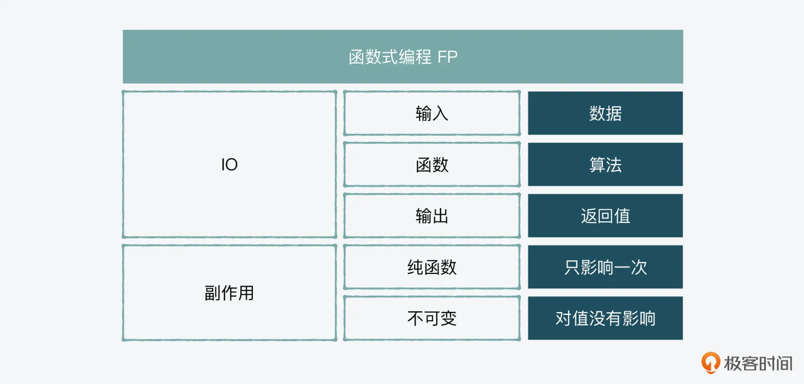
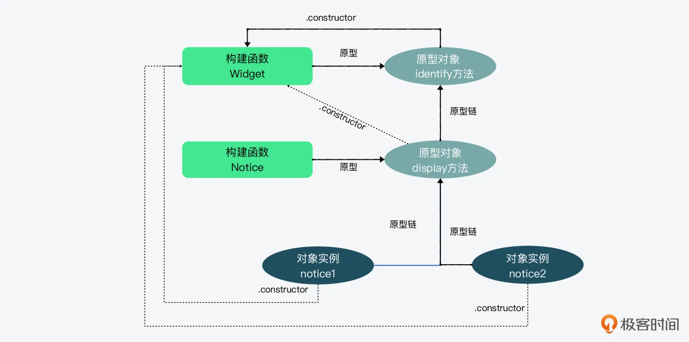
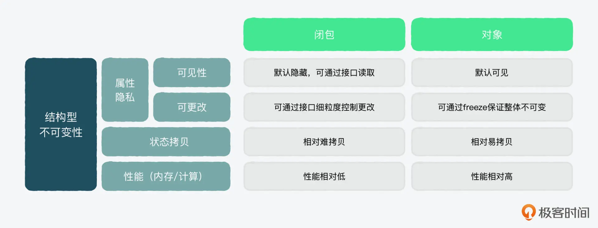

# 深入JS_1
> JavaScript进阶实战课 笔记

## 一、编程模式
:::tip
从编程模式的角度看，JS是结构化的、事件驱动的动态语言，且支持声明式（函数式）和指令式（面向对象）两种模式。
:::
### 1. 函数式编程(FP functional programming)
:::tip
- 在函数式编程中，通常会把各种干扰(不确定性)叫做**副作用（Side effect）**。
- 函数式编程最核心的就是输入、输出、中间的算法，要解决的核心问题就是副作用。
- 可以使用“纯函数”和“不可变”的概念解决副作用。
- “纯函数”强调的是自身的稳定性，对结果只影响一次；“不可变”强调的是和外界的交互中。尽量减少相互间负面的影响。
:::
- 形参：parameter
- 实参：argument
- 返回值：returned value
- 高阶函数：higher order functions，输入和输出都是函数的函数
- 幂等：idempotence，在数学中幂等的意思是不管我们把一个函数嵌套多少次来执行，它的结果都应该是一样的；在计算机中幂等的意思是，一个程序执行多次结果是一样的。

### 1.1 函数的副作用
常见的副作用有：
1. 全局变量（global variable）
2. IO影响（IO effects），IO有浏览器中的用户行为如鼠标和键盘的输入；也有服务器端(Node)的文件系统、网络连接以及stream的stdin(标准输入)和stdout(标准输出)
3. 网络请求

如何减少副作用？
1. 纯函数（pure function）。纯函数更多解决的是“内循环”。纯函数可以通过减少对外界不确定因素的依赖，来减少副作用。
:::info
纯函数，即一个函数的返回结果的变化只依赖其参数，并且执行过程中没有副作用。
:::
```js
// 下面为一个纯函数：无论有什么干扰，它都不会返回一个不是 5 的数字，除非你换一个参数
function calculateGST( productPrice ) {
  return productPrice * 0.05;
}
calculateGST(100); // return 5

var rate = 0.05;
// 下面就不是一个纯函数了，因为随着这个变量的变化，计算结果会有所不同
function calculateGST( productPrice ) {
  return productPrice * rate;
}
calculateGST(100); // return 5
```


:::note
- 如果一个函数只要输入值一样，返回的结果就一样，那这个函数就是纯函数。
- 同理，如果React组件通过相同的state和props得出相同的输出，则称它是纯组件。
:::

2. 不可变（immutability）。不可变更多考虑的是“外循环”。
:::info
不可变就是在减少程序被外界影响的同时，也减少对外界的影响。
:::
```js
// 在开发中，如果要保证不可变，就要使用slice，而不能使用splice
const beforeList = [1,2,3,4]
console.log(beforeList.splice(0,2))
console.log(beforeList.splice(0,2))
//[ 1, 2 ]
//[ 3, 4 ]

const beforeList = [1,2,3,4]
console.log(beforeList.slice(0,2))
console.log(beforeList.slice(0,2))
//[ 1, 2 ]
//[ 1, 2 ]
```

:::tip
从值的角度来看，“纯函数”对值只影响一次，而"不可变"完全不影响。
- splice 更像是一块**橡皮泥**，一开始它可能是个方块儿，你可以捏出腿和脑袋，它就成了一个小人儿，也就是说它本身发生了变化。而 slice 在处理完后是形成了一个新的数组，但原始的数组完好无损，它是把值当成**乐高积木**，而不是橡皮泥。
- 把这种思想用到状态管理里，你就会记录状态的变化，而不会篡改状态。
:::

:::note
JavaScript 中的常量（const，constant）算不算不可变呢？
- 对于“原始类型值”，如数字、字符串是不可变的；对于像数组这样的“对象类型值”，仍然是可变的。
- 所以常量只是做到“赋值动作”的不可变，而不是做到“值”本身的不可变。

这里的不可变我们要搞清楚是值不可变，还是变量的不可变。

```js
// 比如我们给num赋值数组，值还是可变
const num = [3];
num[0] = 5; // 返回：5

// 反之，我们没法拷贝原数组，slice后再赋值给原来的变量
const sliceNums = [1,2,3,4,5];
sliceNums = sliceNums.slice(0,2); // 返回错误 TypeError: Assignment to constant variable.
```

所以const还是蛮多坑的，在Java中用的就是final，而不是const。

也是因为这些坑，在JS中，通常const更多用于原始类型的值，比如数理常量、字节顺序或版本号：
```js
const H0 = 74; // 哈勃常数 (km/s/Mpc)
const PI = 3.141592; // 圆周率
const C = 299792.458; // 光速 (km/s)
```
:::



### 1.2 Monad
:::tip
参考：
- [图解 Monad](https://www.ruanyifeng.com/blog/2015/07/monad.html)
:::

- 函数可以返回值，也可以返回数据类型。数据类型就是对值的一种封装，不仅包括值本身，还包括相关的属性和方法。
- 因为数据类型是带有运算方法的，如果函数的输入和输出都是数据类型，每一步返回的都是数据类型的实例，就可以把它们连接起来，称为Monad。
- Monad是一种设计模式，表示将一个运算过程，通过函数拆解成互相连接的多个步骤。你只要提供下一步运算所需的函数，整个运算就会自动进行下去。

### 2. 面向对象编程(OOP object oriented programming)
:::tip
**JavaScript使用的是基于原型的面向对象！！**
- **工具和方法通常是服务于对象的**。比如，站在岸边的“你”，这个“你”就是对象，如果没有对象，就算是有一个工具（function），比如有快艇在岸边，它也只能停靠在那儿；或者你有游泳这个方法（method），但它也只有在你身上才能发挥作用。
- 如果说函数➕对象组成了生产力，则封装、重用、继承组成了生产关系。
:::

- 封装，通常用在组件化设计的时候，封装组件或模块。
- 重用，就是把可以重复使用的功能抽象到一个类里，每次只是创建一个它的实例对象来使用。
- 继承，可以把通用功能放到抽象类，将一些特定的行为或属性通过继承放到实现类中。
- 组合（composition），一个子类不是继承的某个父类，而是通过组合多个类，来形成一个类。
:::tip
通常，“组合”优于“继承”，因为如果父类有了问题，就会牵一发动全身，而且抽象的层级过多也会让代码难以理解。不过在实际情况下，继承也不是完全不可取的，在开发中，我们使用哪种思想还是要根据情况具体分析。
:::

### 2.1 基于原型的继承
:::info
JS里的对象和“类”，不存在拷贝从属关系，而是**原型链接关系**。
- 在传统的面向对象语言，比如 Java 里，当我们用到继承时，一个类的属性和功能是可以被基于这个类创建的对象“拷贝”过去的。
- 在 JavaScript 里，实例并没有将类的属性和功能拷贝过来，而是默认通过原型链来寻找原型中的功能，然后利用“链接”而不是“拷贝”来。
:::

```js
function Widget(widgetName) {
  this.widgetName = widgetName;
}
Widget.prototype.identify = function() {
  return "这是" + this.widgetName;
}

// 通过函数自带的 call() 方法和对象自带的 Object.create() 方法，让 Notice 作为子类继承 Widget 父类的属性和方法
function Notice(widgetName) {
  Widget.call(this, widgetName);
}
Notice.prototype = Object.create(Widget.prototype);

Notice.prototype.display = function() {
  console.log("你好，" + this.identify());
}

var notice1 = new Notice("应用A");
var notice2 = new Notice("应用B");

console.log('结果1::', Object.getPrototypeOf(notice1) === Notice.prototype);
console.log('结果2::', Object.getPrototypeOf(notice2) === Notice.prototype);

// 调用的是原型链里 Notice 的原型中的方法
notice1.display();
notice2.display();
/*
虽然我们用 Notice 创建了 notice1 和 notice2，但是它俩并没有将其属性和功能拷贝过来，而是默认通过原型链来寻找原型中的功能，然后利用“链接”而不是“拷贝”来
*/

// 除了 Notice 自己的原型对象和自己的 display 功能之外，它也链接了 Widget 里的 identify 功能
for (var method in Notice.prototype) {
  console.log("found: " + method);
}

console.log('结果3::', Notice.prototype.constructor);
console.log('结果4::', notice1.constructor);
console.log('结果5::', notice1.constructor);

console.log('结果6::', notice1.identify());
console.log('结果7::', notice2.identify());
```
[运行](https://code.juejin.cn/pen/7147272771171516449)



### 2.2 基于类的继承

:::tip
在JavaScript中，面向对象的特殊性是基于原型的继承，这种继承更像是“授权”，而不是传统意义的“父子”继承。
:::

## 二、闭包和对象
- 在 React.js 里，props 和 state 都是用对象来储存状态的。
- 一个应用肯定需要和用户交互，而一旦有交互，我们就需要管理值的状态（state） 和围绕值设计一系列行为（behavior）。在这个过程中，我们需要考虑的就是一个值的**结构性不可变的问题**。
- 闭包（closure）和对象（object），这二者都可以对一个状态值进行封装和创建行为。

### 1. 闭包
:::tip
闭包最大的特点是**可以突破生命周期和作用域的限制**。
- 突破生命周期的限制是指，当一个外部函数内嵌一个内部函数时，如果内嵌函数引用了外部函数的变量，则这个变量就会突破生命周期的限制，即在函数结束执行后，仍然存在。
- 突破作用域的限制是指，可以把一个内部函数返回成一个方法在外部调用。
```js
function counter() {
  let name = '计数';
  let curVal = 0;
  function counting() {
    curVal++;
  }
  function getCount() {
    console.log(`${name}是${curVal}`);
  }
  return {counting, getCount};
}

var counter1 = counter();

counter1.counting();
counter1.counting();
counter1.counting();
counter1.getCount();
```
[运行](https://code.juejin.cn/pen/7149796681096265743)
:::

### 2. 对象
- 可以通过对象来封装一个状态，并创建一个方法来作用于这个状态值
```js
var counter = {
  name: '计数',
  curVal: 0,
  counting() {
    this.curVal++;
    console.log(`${this.name}是${this.curVal}`);
  }
};

counter.counting();
counter.counting();
counter.counting();
```

### 3. 闭包和对象的异同点
- 单纯从值的状态管理和围绕它的一系列行为的角度来看，可以说闭包和对象是同形态的(isomorphic)，即可以起到异曲同工的作用。闭包中的状态，就是对象中的属性；闭包中创建的针对值的行为，可以在对象中通过方法来实现。
- 闭包和对象在 隐私(privacy)、状态拷贝(state cloning)、性能(performance) 有一定的差别，而这些差别在结构性地处理值的问题上，具有不同的优劣势。



- 闭包是带数据的行为，对象是带行为的数据。

### 3.1 属性的查改
- 对于闭包，除非是通过接口，也就是在外部函数中返回内部函数的方法，不然内部的值是**对外不可见的**，所以通过闭包，可以细粒度地控制想要暴露或隐藏的属性及相关的操作。
- 对于对象，可以直接获取对象中的属性及重新赋值。若想要遵循不可变的原则，则可以通过`Object.freeze()`设置对象所有的属性变得只读。

### 3.2 状态的拷贝
> 不对原始的对象和数组值做改变，而是拷贝之后，在拷贝的版本上做变更。

```js
// 数组浅拷贝
var a = [ 1, 2 ];
var b = [ ...a ];
b.push( 3 );
console.log('a的值::', a); // [1,2]
console.log('b的值::', b); // [1,2,3]

// 对象浅拷贝
var o = {
  x: 1,
  y: 2
};
var p = { ...o };
p.y = 3; 
console.log('o.y::', o.y); // 2
console.log('p.y::', p.y); // 3
```

- 如果系统中有值不停在改变，每次都拷贝的话，就会占据大量内存。可以通过链表等数据结构及相关算法来解决这类拷贝导致的性能问题，比如[immutable.js](https://immutable-js.com/)

- 闭包相对更难拷贝；从性能的角度来讲，对象的内存和运算通常要优于闭包。

```js
function PrintMessageA() {
  return `${this.name}，你好！`;
}
var greetings1 = PrintMessageA.bind( { name: '先生' } );
greetings1();

// 闭包
function PrintMessageB(name) {
  return function printName() {
    return `${name}，你好！`;
  };
}
var greetings2 = PrintMessageB('先生');
greetings2();
```

### 3.3 React为什么选择使用对象(而不是闭包)作为 props 和 state 的值类型?
- 选择使用对象作为 props 和 state 的值类型，能更容易保证props和state的值整体不可变，在需要state变化时，也更容易拷贝。
- 闭包虽然在属性和方法的隐私方面更有优势，并且能更细粒度地获取或重新给属性赋值，可是在应用交互和状态管理这个场景下，它并没有什么实际的作用。

## 三、柯里化（currying）
