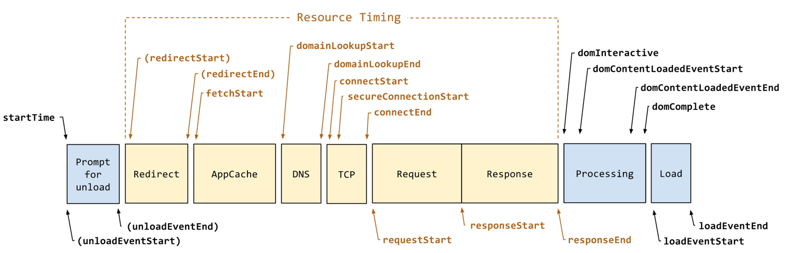

# 前端监控
## 页面性能指标
页面性能指标是通过 `performance.getEntriesByType('navigation')[0]` 或 `performance.timing` 来计算的，前者为最新计算方式，后者为旧版本计算方式。以下 `navigationTiming` 表示前者返回的值，`timing` 表示后者返回的值，没有指定，表示这两个对象中都包含该字段。

![performance.getEntriesByType('navigation')[0]](img/性能指标(getEntriesByType).jpg)
.jpg)

性能指标计算方式参考图：


### 重定向个数
指当前页面是经过几次重定向到达的，如果没有重定向，该值为 0

计算方式：`navigationTiming.redirectCount` 或 `performance.navigation.redirectCount`

### 重定向耗时
指重定向所用时间

计算方式：`redirectEnd - redirectStart`

### 读取缓存耗时
指读取缓存数据所用时间

计算方式：`domainLookupStart - fetchStart`

### DNS解析耗时
指通过域名解析服务（DNS），将指定的域名解析成IP地址所消耗的时间，例如把 `www.baidu.com` 解析成 `xxx.xxx.xxx.xxx` 的耗时，一般 2 到 3 毫秒

计算方式：`domainLookupEnd - domainLookupStart`

### TCP连接耗时
指浏览器和WEB服务器建立TCP/IP连接所用的时间

计算方式：`connectEnd - connectStart`

### SSL安全连接耗时
只在 HTTPS 下有效，属于TCP连接耗时的一部分，指[安全连接握手耗时](https://www.w3.org/TR/resource-timing-2/#dom-performanceresourcetiming-secureconnectionstart)

计算方式：`location.protocol === 'https:' ? connectEnd - secureConnectionStart : 0`

### 网络请求耗时
指开始发送请求到服务器返回第一个字节所需要的时间

计算方式：`responseStart - requestStart`

### 数据传输耗时
指页面返回第一个字节到最后一个字节所用的时间

计算方式：`responseEnd - responseStart`

### DOM解析耗时
指页面请求完成（`responseEnd`）后，到整个 DOM 解析完所用的时间，页面的复杂度决定了 DOM 解析耗时

计算方式：`domContentLoadedEventEnd - responseEnd`

### 资源加载耗时
指 DOM 解析完成后到页面完全加载完所用的时间

计算方式：`loadEventEnd - domContentLoadedEventEnd`

### 页面渲染耗时
指页面请求完成（`responseEnd`）后，到页面完全加载完间隔的时间（包含DOM解析和资源加载），页面渲染时间等于页面完全加载时间 - HTML 加载完成时间

计算方式：`loadEventEnd - responseEnd`

### 首包时间
从页面请求到浏览器开始接收到数据所用的时间

计算方式：`responseStart - startTime`

### 白屏时间
也指首次渲染时间，指页面出现第一个文字或图像所花费的时间

计算方式：优先使用最新标准 `performance.getEntriesByType('paint')[0].startTime`，不支持的话使用 Chrome、IE 提供的 `firstPaintTime`，`chrome.loadTimes().firstPaintTime` 或 `performance.msFirstPaint`，还没有获取到计算 `head` 中 `link` 和 `script` 下载时间，然后取其最大值，最后如果 `head` 中没有 `link` 或 `script` 时，取 `domInteractive - startTime`

说明：老版本 chrome 浏览器可以使用 `chrome.loadTimes().firstPaintTime`，新版本中该 api [已被废弃](https://developers.google.cn/web/updates/2017/12/chrome-loadtimes-deprecated)

以下为官方给出的计算方式:
```js
function firstPaintTime() {
  if (window.PerformancePaintTiming) {
    const fpEntry = performance.getEntriesByType('paint')[0];
    if (fpEntry) {
      return fpEntry.startTime;
    }
    return 0;
  }
}
```

### 首次可交互时间
指页面 `DOMContentLoaded` 事件触发的开始时间，这时候页面可以交互

计算方式：`domInteractive - startTime`

### HTML 加载完成时间
指页面所有 HTML 加载完成（不包括页面渲染时间），即包括 `DNS`、`TCP`、`Request` 和 `Response`

计算方式：`responseEnd - startTime`

### 页面完全加载时间
指页面完全加载完所用的时间，这时候触发完成了 `onload` 事件

计算方式：`loadEventEnd - startTime`

### 首屏时间
首屏时间，也称用户完全可交互时间，即整个页面首屏完全渲染出来，用户完全可以交互，一般首屏时间小于页面完全加载时间，该指标值可以衡量页面访问速度

计算方式：
- 第一种计算方式是通过计算首屏区域内的所有图片加载时间，然后取其最大值；
- 第二种计算方式是通过 `window.MutationObserver` 来监听首屏所有元素变化情况，并记录时间，最后取其最大值（会去掉得分相同重复的值），算出的时间需要加上 `domInteractive`（可交互时间），通常采用第二种计算方式

说明：对于首屏中出现的动画或者轮播图等，不会影响实际计算时间

### 最大内容绘制(LCP)
LCP(Largest Contentful Paint)是从真实用户视角度量页面可见区域内容加载时间的指标，通常被近似看作首屏时间，LCP耗时较长，用户需要等待较长时间才能看到可见区域的内容，通常来说需要您特别关注下页面可见区域内的元素数量，以及是否存在大元素，或耗时较长的元素并进行优化。

### 累积布局偏移(CLS)
CLS(Cumulative Layout Shift)用来衡量页面整个生命周期中发生的所有意外样式移动的总和，用来评估页面视觉稳定性影响，CLS系数较大，用户受页面中内容发生的意外移动的影响也越大，通常需要您特别关注下发生了样式偏移的元素，并仔细检查导致其发生偏移的原因（可能是其他元素加载导致其位置变化）。

### 首次输入延迟(FID)
FID(First Input Delay)测量的是用户首次发出交互指令到页面可以响应为止的时间差，FID耗时较长，用户能够明显的感知页面处理交互响应的延迟，其主要原因是JS执行过长，优化JS的解析、编译、执行可以直接降低 FID。

### 首次内容绘制(FCP)
FCP(First Contentful Paint)测量的是页面首页有内容渲染的耗时，FCP耗时较长时，页面将有较长时间处于空白状态，该指标通常也被近似看作白屏时间，通常您需要关注DOM是否过于复杂，以及TTFB耗时。

### 首字节耗时(TTFB)
TTFB(Time to First Byte)测量的是客户端接收到服务器返回的第一个字节响应信息的耗时，TTFB较长，可能是由于网络延迟大造成的，也可能是由于服务器响应慢造成的，您需要特别关注页面基础文档的DNS、TCP、SSL、Response耗时，以此来判断性能问题的原因。

### FP

### 可交互时间(TTI)

### 总阻塞时间(TBT)

### 交互到下一次绘制(INP)

## Apdex指标
Apdex 指标也称页面满意度，全称 Application Performance Index，是一个国际通用的页面性能计算标准，该标准将用户对于页面的满意度分为三个等级：满意（0 ~ T）、可容忍（T ~ 4T）、不满意（大于 4T）

计算公式为：Apdex = (满意样本数量 + 可容忍样本数量 / 2) / 所有样本数量

计算结果为 0 到 1 之间的数值，数值越大，表示页面满意度越高。

页面满意度主要取决于 "T" 值的设定和计算指标：
- "T" 值的设定：比如设为 2 秒，则 0~2 秒表示满意，2~8 秒表示可容忍，超过 8 秒表示不满意
- 计算指标：比如取页面白屏时间（页面首次渲染时间）作为计算指标

前端监控中，默认 "T" 为 2 秒，计算指标取页面白屏时间

## 异常捕获
[需要处理哪些异常](https://github.com/closertb/closertb.github.io/issues/46)