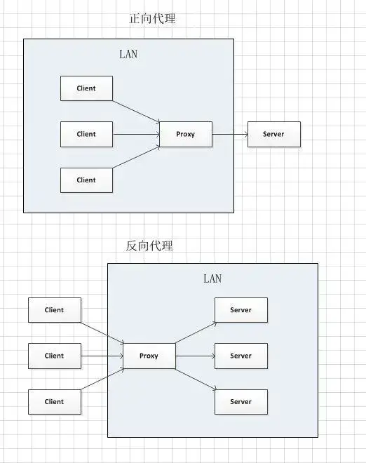

在微服务的体系之下，Nginx 正在被越来越多的项目采用作为网关来使用，配合 Lua 做限流、熔断等控制。


## 使用`-c`指定配置文件
```bash
# 指定配置文件启动
/usr/local/nginx/sbin/nginx -c /usr/local/nginx/conf/nginx.conf
```

## 代理
nginx反向代理：Nginx 根据接收到的请求的端口，域名，url，将请求转发给不同的机器，不同的端口（或直接返回结果），然后将返回的数据返回给客户端。



### 反向代理
反向代理: 客户端 一> 代理 <一> 服务端

反向代理的特点：
- Nginx 没有自己的地址，它的地址就是服务器的地址，如 `www.baidu.com`，对外部来讲，它就是数据的生产者。

- Nginx 明确的知道应该去哪个服务器获取数据（在未接收到请求之前，已经确定应该连接哪台服务器）

用租房举例:

A(客户端) 想租一个房子, B(代理) 就把这个房子租给了他。实际上 C(服务端) 才是房东。B(代理) 是中介把这个房子租给了 A(客户端)。

这个过程中 A(客户端) 并不知道这个房子到底谁才是房东，他都有可能认为这个房子就是 B(代理) 的。

以下为配置反向代理的例子：
```bash
location /demo/ {
  proxy_next_upstream     http_500 http_502 http_503 http_504 error timeout invalid_header;
  proxy_set_header        Host example.com;
  proxy_set_header        X-Forwarded-For $proxy_add_x_forwarded_for;
  proxy_pass              http://example.com/demo/;
  proxy_cache             off;
  expires                 0;
}
```

#### `location`
用于匹配 URL

#### `proxy_pass`
用于设置被代理服务器的地址

#### `proxy_set_header`
用来设置被代理服务器接收到的 header 信息（请求头）

#### `proxy_cache`
`proxy_cache` 是 Nginx 中用于配置代理缓存的指令。通过使用代理缓存，Nginx 可以缓存从后端服务器获取的响应，从而减少后端服务器的负载并提高响应速度。在 Nginx 中，`proxy_cache` 指令的默认值是 `off`，这意味着默认情况下代理缓存是禁用的。

以下是一个基本的 `proxy_cache` 配置示例：

```nginx
http {
  # 定义一个缓存区域，名称为 'my_cache'，大小为 10 MB
  proxy_cache_path /var/cache/nginx levels=1:2 keys_zone=my_cache:10m max_size=10g inactive=60m use_temp_path=off;

  server {
    listen 80;
    server_name example.com;

    location / {
      proxy_pass http://backend_server;
            
      # 启用缓存并指定缓存区域
      proxy_cache my_cache;
            
      # 设置缓存的有效期
      proxy_cache_valid 200 302 10m;
      proxy_cache_valid 404 1m;

      # 设置缓存键
      proxy_cache_key "$scheme$proxy_host$request_uri";

      # 添加缓存相关的头信息
      add_header X-Cache-Status $upstream_cache_status;
    }
  }
}
```

在这个示例中：

1. `proxy_cache_path` 指令定义了缓存存储的位置、缓存区域的名称和大小等参数。
2. `proxy_cache` 指令在 `location` 块中启用了缓存，并指定了缓存区域 `my_cache`。
3. `proxy_cache_valid` 指令设置了不同响应码的缓存有效期，例如，200 和 302 响应码的缓存有效期为 10 分钟，404 响应码的缓存有效期为 1 分钟。
4. `proxy_cache_key` 指令定义了缓存键，这里使用了请求的协议、主机和 URI 作为缓存键。
5. `add_header` 指令添加了一个自定义头 `X-Cache-Status`，用于指示缓存状态（如 `HIT`、`MISS` 等）。

通过这种配置，Nginx 可以有效地缓存后端服务器的响应，提高网站的性能和可扩展性。

### 正向代理
正向代理: 客户端 <一> 代理 一> 服务端

正向代理的特点：
- 客户端非常明确要访问的服务器地址；服务器只清楚请求来自哪个代理服务器，而不清楚来自哪个具体的客户端；

- 正向代理模式屏蔽或者隐藏了真实客户端信息。

用租房举例：

A(客户端) 想租 C(服务端) 的房子, 但是 A(客户端) 并不认识 C(服务端) 租不到。B(代理) 认识 C(服务端) 能租这个房子所以A(客户端)找了 B(代理) 帮忙租到了这个房子。

这个过程中 C(服务端) 不认识 A(客户端) 只认识 B(代理)，C(服务端) 并不知道 A(客户端) 租了房子，只知道房子租给了 B(代理)。

## A服务器访问B服务器的文件
> 参考:
> - [nginx访问另一台服务器上的文件](https://blog.csdn.net/sinat_15733233/article/details/123255654)
> - [proxy_pass配置多个ip](https://www.cnblogs.com/xinfang520/p/11653980.html)

- A服务器的配置
```bash
location /staticFile/ { # 自定义location名
  try_files $uri @staticFile;
}
location @staticFile { # 自定义location名
  proxy_redirect off;
  proxy_set_header Host $host;
  proxy_set_header X-Real-IP $remote_addr;
  proxy_set_header X-Forwarded-For $proxy_add_x_forwarded_for;
  proxy_pass http://B服务器的ip:B服务器的端口号;
}
```

- proxy_pass多个服务器ip
```bash
upstream proxy-staticServer { # 自定义upstream名
  server B服务器的ip:B服务器的端口号; # 不加端口号则默认80端口
  server C服务器的ip:C服务器的端口号;
}

location /staticFile/ {
  try_files $uri @staticFile;
}
location @staticFile {
  proxy_redirect off;
  proxy_set_header Host $host;
  proxy_set_header X-Real-IP $remote_addr;
  proxy_set_header X-Forwarded-For $proxy_add_x_forwarded_for;
  proxy_pass http://proxy-staticServer;
}
```

- B服务器的配置
假如静态资源目录为：/export/App/staticFile/
```bash
server {
  listen          80; # A服务器配置的B的端口号为80或者没配端口号时
  server_name     localhost;

  error_page 302 = http://错误页;

  location /staticFile/ {
    root /export/App/;
    try_files $uri $uri/ /staticFile/index.html;
    if ($request_filename ~* .*\.(?:htm|html)$)
    {
      add_header Cache-Control "no-store";
    }
    add_header Cache-Control "max-age=8420000";
  }
}
```

- C服务器的配置同B

## docker `/dev/shm/nginx_temp/client_body` 应该是一个目录
- 遇到过一个问题是把`/dev/shm/nginx_temp/client_body`设置成了文件，导致浏览器上传文件请求接口通过nginx转发时，上传的前2-3次可以成功，后面的上传报错500，nginx的错误日志为：`open() "/dev/shm/nginx_temp/client_body/0000000004" failed (20: Not a directory)`

- 这个问题很容易误导到 `ngx_http_core_module`的指令：`client_max_body_size`，而`client_max_body_size`是用来设置客户端请求体的大小的，如果一个请求的请求体超出了这个指令设置的值，将返回给客户端413(Request Entity Too Large)错误，请注意浏览器无法正确显示该错误。如果将该指令的值设置为0，则不检查 客户端请求体的大小。

## 一台服务器配置多个域名
例如，一台服务器配置了3个域名，分别是`example.org`、`example.net`、`example.com`。

Nginx优先在HTTP请求头中查找HOST字段以确定请求需要路由到的域名，如果没有匹配到任何一个域名，Nginx会使用默认的域名提供服务（若未配置，默认为第一个sever配置的`server_name`）。
```bash
server {
  listen      80;
  server_name example.org www.example.org;
  # ...
}

server {
  listen      80;
  server_name example.net www.example.net;
  # ...
}

server {
  listen      80;
  server_name example.com www.example.com;
  # ...
}
```

## nginx限流
> 参考：[Nginx之QPS限制模块解读](https://blog.csdn.net/m0_62436868/article/details/133199634)

NGINX通过 `limit_req_zone` 和 `limit_req` 两条指令来实现速率限制。指令 `limit_req_zone` 定义了限速的参数，指令 `limit_req` 在所在的`location`使用定义的速率。
### 按ip限流
```bash
http {
  limit_req_zone $http_j_forwarded_for zone=IP_LIMIT:100m rate=1r/s;
  server {
    location / {
      limit_req zone=IP_LIMIT;
      # ....
    }
  }
}
```

### 按URL限流
```bash
http {
  limit_req_zone $uri zone=IP_LIMIT:100m rate=1r/s;
  server {
    location / {
      limit_req zone=IP_LIMIT;
      # ....
    }
  }
}
```

## [nginx server中的root和location的root的区别](https://blog.csdn.net/fengzyf/article/details/102602782)

## 访问的域名 与 对应的服务器nginx的`server_name` 不一致
当你访问的域名与对应服务器的 Nginx `server_name` 不一致时，Nginx 会根据其配置来处理这个请求。具体处理方式取决于 Nginx 的配置文件（通常是 `nginx.conf` 或者在 `sites-available` 目录下的配置文件）。

以下是几种常见的处理方式：

1. **默认服务器（Default Server）：**
   如果请求的域名没有匹配到任何配置的 `server_name`，Nginx 会将请求交给默认服务器处理。默认服务器通常是第一个被定义的服务器块（`server`），或者明确指定为默认服务器的块（通过 `default_server` 选项）。

   ```nginx
   server {
       listen 80 default_server;
       server_name _;

       location / {
           return 444;  # 关闭连接而不发送响应
       }
   }
   ```

2. **返回 404 或其他错误代码：**
   你可以配置一个通用的服务器块来处理所有未匹配的请求，并返回一个特定的错误码，例如 404。

   ```nginx
   server {
       listen 80;
       server_name _;

       location / {
           return 404;
       }
   }
   ```

3. **重定向到特定的域名：**
   你可以配置 Nginx 将所有未匹配的请求重定向到一个特定的域名。

   ```nginx
   server {
       listen 80;
       server_name _;

       location / {
           return 301 http://example.com;
       }
   }
   ```

4. **处理所有请求：**
   你可以配置一个通用的服务器块来处理所有请求，不论域名是否匹配。

   ```nginx
   server {
       listen 80;
       server_name _;

       location / {
           # 通用处理逻辑
       }
   }
   ```

示例:

假设你有两个服务器块，一个是为 `example.com` 配置的，另一个是默认服务器：

```nginx
server {
    listen 80;
    server_name example.com;

    location / {
        # 处理 example.com 的请求
    }
}

server {
    listen 80 default_server;
    server_name _;

    location / {
        return 404;  # 未匹配的请求返回 404
    }
}
```

在这种配置下，如果你访问 `example.com`，第一个服务器块会处理请求。如果你访问其他任何域名，如 `otherdomain.com`，第二个服务器块（默认服务器）会处理请求并返回 404 错误。

总结:

Nginx 根据配置文件中的 `server` 块和 `server_name` 指令来处理请求。如果访问的域名与配置的不匹配，Nginx 会将请求交给默认服务器处理，或者根据你的具体配置返回特定的响应。

## nginx配置转发到同应用下的其他页面
在 Nginx 中，你可以配置将请求转发到同一应用下的其他页面。这样可以实现 URL 重写或路径重定向，以便将用户请求重定向到不同的路径或页面。

示例场景：

假设你有一个应用运行在 `example.com`，并希望实现以下重定向：

- 将 `/old-page` 重定向到 `/new-page`
- 将 `/blog` 重定向到 `/articles`


以下是一个 Nginx 配置示例，展示如何实现上述重定向：

```nginx
server {
    listen 80;
    server_name example.com;

    # 重定向 /old-page 到 /new-page
    location /old-page {
        return 301 /new-page;
    }

    # 重定向 /blog 到 /articles
    location /blog {
        return 301 /articles;
    }

    # 其他静态文件或应用的处理
    location / {
        try_files $uri $uri/ =404;
    }
}
```

配置解释：

1. **server 块**：定义一个虚拟服务器，监听 `example.com` 域名的 80 端口。

2. **location /old-page**：匹配 `/old-page` 路径的请求，并将其重定向到 `/new-page`。
   - `return 301 /new-page`：返回 301 永久重定向状态码，并重定向到 `/new-page`。

3. **location /blog**：匹配 `/blog` 路径的请求，并将其重定向到 `/articles`。
   - `return 301 /articles`：返回 301 永久重定向状态码，并重定向到 `/articles`。

4. **location /**：匹配根路径的请求，尝试查找文件，如果找不到则返回 404 错误。

### 临时重定向

如果你希望使用临时重定向而不是永久重定向，可以使用 302 状态码：

```nginx
location /old-page {
    return 302 /new-page;
}

location /blog {
    return 302 /articles;
}
```

### 重新加载 Nginx 配置

在修改 Nginx 配置文件后，重新加载 Nginx 以使更改生效：

```bash
sudo nginx -s reload
```


测试配置，确保你的 Nginx 配置语法没有错误：

```bash
sudo nginx -t
```

如果测试通过，重新加载 Nginx 配置：

```bash
sudo systemctl reload nginx
```

### 注意事项

- **确保路径正确**：在进行重定向时，确保目标路径存在并且正确。
- **SEO 考虑**：使用 301 永久重定向会告诉搜索引擎该页面已经永久移动，而 302 临时重定向则表示页面暂时移动。
- **避免循环重定向**：确保重定向不会导致循环重定向（即 A 重定向到 B，B 又重定向到 A）。

通过上述配置，你可以轻松地在 Nginx 中设置 URL 重定向，将用户请求转发到同一应用下的其他页面。