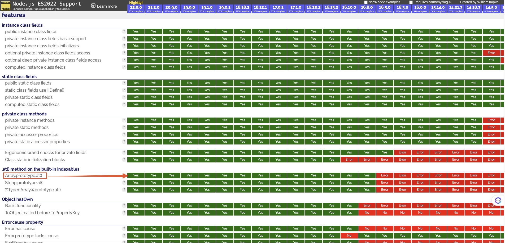

:::tip
- [node.js在线运行](https://toolin.cn/run-nodejs)

- [查看node.js不同版本所支持的ES版本特性](https://node.green/)。比如 `Array.prototype.at()` 是 ES2022的新特性，在Node.js16.8.0版本及以上才支持，否则报错TypeError: xxx.at is not a function
  

- Node.js 支持 `CommonJS` 和 `ES module systems` (自从 Node.js v12), 在 Node.js 中可以使用 `require()` 和 `import`。（`.mjs` 后缀是用于标识 ECMAScript 模块（ESM）的 JavaScript 文件的扩展名。这种文件格式允许在 Node.js 环境中使用模块化的 JavaScript 代码，它支持 `import` 和 `export` 语句来导入和导出模块。使用 `.mjs` 后缀可以明确地告诉 Node.js 这个文件应该作为一个 ES 模块来处理，而不是传统的 CommonJS 模块（通常使用 `.js` 后缀）。）

- [Node.js](https://roadmap.sh/nodejs) is perfect for data-intensive and real-time applications since it uses an event-driven, non-blocking I/O model, making it lightweight and efficient. Node.js 非常适合数据密集型和实时应用程序，因为它使用事件驱动、非阻塞 I/O 模型，使其轻量且高效。
:::

## Events
在 Node.js 中，Events 是一个内置的模块，它提供了创建、触发和监听自定义事件的能力。EventEmitter 是 Events 模块中最重要的类，用于处理事件。

EventEmitter 是 Events 模块提供的一个构造函数，你可以使用它来创建能够发射和监听事件的对象。这是 Node.js 实现事件驱动架构的基础。

## Process
process 对象提供有关当前 Node.js 进程的信息并对其进行控制。process 对象是EventEmitter的一个实例。

### process事件
#### `unhandledRejection`
每当 Promise 被拒绝并且在事件循环的一轮内没有错误处理程序附加到 Promise 时，就会发出 'unhandledRejection' 事件。

### `process.argv`
在Node.js中，`process.argv` 是一个数组，包含了启动Node.js进程时的命令行参数。数组的第一个元素是node的可执行文件的路径，第二个元素是正在执行的JavaScript文件的路径，其余元素是任何额外的命令行参数。
```json title="package.json"
"scripts": {
  "serve": "qs-tools-webpack start --template vue"
},
```
```js
// 执行rushx serve，此时process.argv的值为：
[
  '/.nvm/versions/node/v16.16.0/bin/node',
  '/qs-tools/packages/tools-webpack/bin/tools-webpack.js',
  'start',
  '--template',
  'vue'
]
```

### `process.env`
在Node.js中，`process.env` 是一个包含了用户环境的对象。当使用npm运行脚本时，npm会设置一些特定的环境变量，这些变量可以通过`process.env`访问。

`process.env.npm_command` 是一个特殊的环境变量，它包含了触发当前脚本运行的npm命令的名称。例如，如果你通过`npm start`运行了一个脚本，`process.env.npm_command` 将会是 `"start"`。

请注意，这个环境变量是npm设置的，只有在通过npm运行脚本时才会存在。如果你直接通过Node.js运行脚本（例如，使用`node script.js`），这个环境变量将不会被设置。

### `process.cwd`
`process.cwd()` 方法返回 Node.js 进程的当前工作目录。

### `process.execPath`
`process.execPath` 属性返回启动 Node.js 进程的可执行文件的绝对路径名。比如：`/.nvm/versions/node/v16.16.0/bin/node`

## Errors
