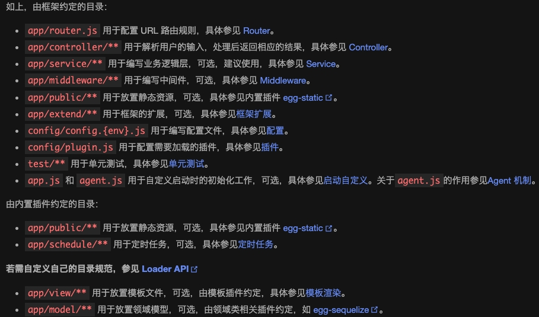
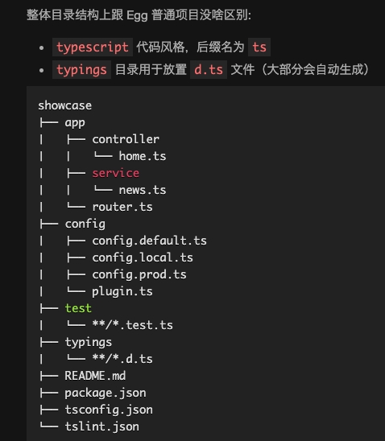
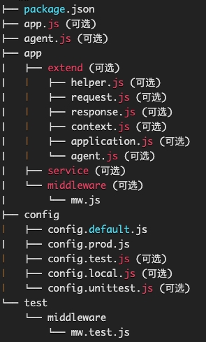

## 1.目录结构约定
[目录结构](https://www.eggjs.org/zh-CN/basics/structure)


### 1.1 框架的扩展(`app/extend/**`)
> [框架扩展](https://www.eggjs.org/zh-CN/basics/extend)

可以对如下对象进行自定义扩展，进一步加强框架的功能：
- Application。Application对象指的是 Koa 的全局应用对象，全局只有一个，在应用启动时被创建。
    > 会把 `app/extend/application.js` 中定义的对象与 Koa Application 的 prototype 对象进行合并，在应用启动时会基于扩展后的 prototype 生成 app 对象。

- Context。Context 指的是 Koa 的请求上下文，每次请求生成一个 Context 实例，通常我们也简写成 ctx。在所有的文档中，Context 和 ctx 都是指 Koa 的上下文对象。
    > 会把 `app/extend/context.js` 中定义的对象与 Koa Context 的 prototype 对象进行合并，在处理请求时会基于扩展后的 prototype 生成 ctx 对象。

- Request。Request 对象和 Koa 的 Request 对象相同，提供了大量请求相关的属性和方法供使用。**访问方式：`ctx.request`**
    > 会把 `app/extend/request.js` 中定义的对象与内置 request 的 prototype 对象进行合并，在处理请求时会基于扩展后的 prototype 生成 request 对象。

- Response。Response 对象和 Koa 的 Response 对象相同，提供了大量响应相关的属性和方法供使用。**访问方式：`ctx.response`**
    > 会把 `app/extend/response.js` 中定义的对象与内置 response 的 prototype 对象进行合并，在处理请求时会基于扩展后的 prototype 生成 response 对象。

- Helper。Helper 函数用来提供一些实用的 utility 函数。**访问方式：`ctx.helper`**
    > 会把 `app/extend/helper.js` 中定义的对象与内置 helper 的 prototype 对象进行合并，在处理请求时会基于扩展后的 prototype 生成 helper 对象。

- Agent
    > `app/extend/agent.js`  扩展 Agent 类

:::info
[例子：扩展Context，封装统一的response](https://code.juejin.cn/pen/7160667676237856798)
> 参考：[如何规范接口输出协议——Eggjs最佳实践系列（一）](https://juejin.cn/post/6963458879032131621)
:::


### 1.2 Application实例的访问方式
- `ctx.app`

- Controller，Middleware，Helper，Service 中都可以通过 `this.app` 访问到 Application 对象，例如 this.app.config 访问配置对象。

- 在 app.js 中 app 对象会作为第一个参数注入到入口函数中
```js
// app.js
module.exports = (app) => {
  // 使用 app 对象
};
```

### 1.3 Context实例的访问方式
- middleware 中 `this` 就是 `ctx`，例如 this.cookies.get('foo')。

- controller 有两种写法，类的写法通过 `this.ctx`，方法的写法直接通过 ctx 入参。

- helper，service 中的 this 指向 helper，service 对象本身，使用 `this.ctx` 访问 context 对象，例如 this.ctx.cookies.get('foo')。

### 1.4 启动自定义(`app.js`)
> [启动自定义](https://www.eggjs.org/zh-CN/basics/app-start)
提供了统一的入口文件（app.js）进行启动过程自定义，这个文件返回一个 Boot 类，我们可以通过定义 Boot 类中的生命周期方法(如下)来执行启动应用过程中的初始化工作。
- configWillLoad。配置文件即将加载，这是最后动态修改配置的时机
- configDidLoad。配置文件加载完成
- didLoad。文件加载完成
- willReady。插件启动完毕
- didReady。worker 准备就绪
- serverDidReady。应用启动完成
- beforeClose。应用即将关闭

### 1.5 ts目录结构
> [TypeScript](https://www.eggjs.org/zh-CN/tutorials/typescript)
```markdown
mkdir showcase && cd showcase
npm init egg --type=ts
npm i
npm run dev
```


问题：Property 'xxx' does not exist on type 'Application'，解决办法：在index.d.ts中进行声明：
```typescript title="项目根目录/typings/index.d.ts"
import 'egg';

declare module 'egg' {
  interface Application {
    xxx: any;
  }
}
```

## 2.自定义插件开发
```js
npm init egg --type=plugin
// 或者 yarn create egg --type=plugin
```


- 插件没有独立的 router 和 controller
- 插件没有 plugin.js

## 3.运行环境
### 3.1 指定运行环境
- 1）通过  `config/env` 文件指定，该文件的内容就是运行环境，如 prod。
```markdown
// config/env
prod
```

- 2）通过 EGG_SERVER_ENV 环境变量指定运行环境更加方便，比如在生产环境启动应用：`EGG_SERVER_ENV=prod npm start`

### 3.2 应用内获取运行环境
app.config.env

### 3.3 配置文件
- 不同的运行环境会对应不同的配置。`config.default.js` 为默认的配置文件，所有环境都会加载这个配置文件，一般也会作为开发环境的默认配置文件。

- 当指定 env 时会同时加载默认配置和对应的配置(具名配置)文件，具名配置和默认配置将合并(使用[extend2](https://www.npmjs.com/package/extend2)深拷贝)成最终配置，具名配置项会覆盖默认配置文件的同名配置。如 prod 环境会加载 config.prod.js 和 config.default.js 文件，config.prod.js 会覆盖 config.default.js 的同名配置。

### 3.4 线上环境
- **注意：如果项目需要在线上运行，请先使用 tsc 将 ts 编译成 js （ `npm run tsc` ）再运行 `npm start`**

- 运行 npm start 不会加载 ts。npm start 运行的是 egg-scripts start，而我们只在 egg-bin 中集成了 ts-node，也就是只有在使用 egg-bin 的时候才允许直接运行 ts 。

- prod环境不会在控制台输入log，而是写到项目的log目录下对应的文件中（项目目录下 `run/application_config.json` 的 config.logger定义了不同的log文件）

## 4. 部署
### 4.1 [Master进程](https://www.eggjs.org/zh-CN/core/cluster-and-ipc#master)
- 内置了 egg-cluster 来启动 Master 进程，Master 有足够的稳定性，不再需要使用 [pm2](https://github.com/Unitech/pm2) 等进程守护模块。

### 4.2 [egg-scripts](https://github.com/eggjs/egg-scripts) 用于支持线上环境的运行和停止

## 5. 路由
:::tip
- Router 主要用来描述请求 URL 和具体承担执行动作的 Controller 的对应关系， 框架约定了 `app/router.js` 文件用于统一所有路由规则。
- 在 Router 定义中， 可以支持多个 Middleware 串联执行
:::

## 6. 中间件

### 6.1 编写中间件
:::info
约定一个中间件是一个放置在 app/middleware 目录下的单独文件，它需要 exports 一个普通的 function，接受两个参数：
- options: 中间件的配置项，框架会将 `app.config[${middlewareName}]` 传递进来。
- app: 当前应用 Application 的实例。
```js
module.exports = (options) => {
  return async function fn(ctx, next) {
    
  }
}
```
:::

例子：封装中间件处理请求的路由未找到的情况
```typescript title="项目根目录/app/middleware/notFoundHandler.ts"
export default () => {
  return async function notFoundHandler(ctx, next) {
    await next(); // next()执行前用于处理请求，next()执行后用于处理响应
    if (ctx.status === 404 && !ctx.body) {
      ctx.body = ctx.acceptJSON ? {code: 0, message: 'Not Found'} : {code: 0, message: 'Page Not Found'};
    }
  }
}
```
```typescript title="项目根目录/config/config.default.ts"
config.middleware = [
  'notFoundHandler',
];

// 注意：用于router的中间件，不需要在此配置，在router.ts中使用即可。
```

### 6.2 使用中间件
> 中间件的加载是有顺序的

需要手动挂载中间件，支持以下方式：
- 在`config.default.js`中配置
```js
module.exports = {
  // 配置需要的中间件，数组顺序即为中间件的加载顺序
  middleware: ['gzip'],

  // 配置 gzip 中间件的配置
  gzip: {
    threshold: 1024, // 小于 1k 的响应体不压缩
  },
};

// 该配置最终将在启动时合并到 app.config.appMiddleware
```

- 框架和插件不支持在 `config.default.js` 中匹配 middleware，需要通过以下方式：
```js
// app.js
module.exports = (app) => {
  // 在中间件最前面统计请求时间
  app.config.coreMiddleware.unshift('report');
};

// app/middleware/report.js
module.exports = () => {
  return async function (ctx, next) {
    const startTime = Date.now();
    await next();
    // 上报请求时间
    reportTime(Date.now() - startTime);
  };
};
```
:::tip
  - 应用层定义的中间件（app.config.appMiddleware）和框架默认中间件（app.config.coreMiddleware）都会被加载器加载，并挂载到 app.middleware 上。
  - 以上两种方式配置的中间件是全局的，会处理每一次请求。
:::

- router 中使用中间件。如果只想针对单个路由生效，可以直接在 `app/router.js` 中实例化和挂载，如下：
```js
module.exports = (app) => {
  const gzip = app.middleware.gzip({ threshold: 1024 });
  app.router.get('/needgzip', gzip, app.controller.handler);
};
```

:::tip
无论是应用层加载的中间件还是框架自带中间件，都支持几个通用的配置项：
  - enable：控制中间件是否开启。
  - match：设置只有符合某些规则的请求才会经过这个中间件。
  - ignore：设置符合某些规则的请求不经过这个中间件。
:::

例子：在router中使用中间件gzip
```typescript title="项目根目录/app/router.ts"
import { Application } from 'egg';

export default (app: Application) => {
  const { controller, router, middleware } = app;
  const gzipHandler = middleware.gzip({ threshold: 1024 });

  router.post('/needgzip', gzipHandler, controller.handler);
};
```

## 7. 日志
eggjs产生的日志有三类:
- 业务日志
```plain
common-error.log
egg-agent.log
egg-web.log
${appInfo.name}-web.log
```

- 定时任务日志
```plain
egg-schedule.log
```

框架启动日志
```plain
master-stderr.log
master-stdout.log
```

默认情况下，业务日志和定时任务日志都在${appInfo.root}/logs/${appInfo.name}目录下，例如 /home/admin/logs/example-app。
而框架启动日志在${appInfo.root}/logs/目录下。

当你要把日志文件转移到指定目录下，分三步:
- 第一步对业务日志，需修改配置文件config.{env}.js
```js
config.logger = {
  dir: '日志目录路径',
};
```

- 第二步对定时任务日志，需修改配置文件config.{env}.js
```js
config.customLogger = {
  scheduleLogger: {
    consoleLevel: 'NONE',
    file: 'aaa/bbb/egg-schedule.log',   // 新日志文件路径
  },
 };

config.schedule = {
  directory: [],
};
```

- 第三步对框架启动日志，需要在启动命令上加参数
```bash
npm run start -- --stdout="/xx/master-stdout.log" --stderr="/xx/master-stderr.log"
```

> [基于Egg框架的日志链路追踪实践](https://www.nodejs.red/#/nodejs/logger?id=%e5%9f%ba%e4%ba%8eegg%e6%a1%86%e6%9e%b6%e7%9a%84%e6%97%a5%e5%bf%97%e9%93%be%e8%b7%af%e8%bf%bd%e8%b8%aa%e5%ae%9e%e8%b7%b5)

## 8. egg-ts-helper
ets clean 支持清除包含同名 tsx 文件的 js 文件

## 9. [eggjs处理jsonp请求](https://www.jianshu.com/p/afc0acc6206a)
jsonp作为前端跨域的一种解决方案，优缺点如下：
- 优点
  - 它不像`XMLHttpRequest`对象实现的`Ajax`请求那样受到同源策略的限制
  - 它的兼容性更好，在更加古老的浏览器中都可以运行，不需要`XMLHttpRequest`或`ActiveX`的支持
  - 并且在请求完毕后可以通过调用`callback`的方式回传结果

- 缺点
  - 它只支持`GET`请求而不支持`POST`等其它类型的HTTP请求
  - 它只支持跨域HTTP请求这种情况，不能解决不同域的两个页面之间如何进行JavaScript调用的问题

1. 安装 egg-jsonp 插件 `npm i -S egg-jsonp`
2. 配置`config/plugin.js`
```js
// {app_root}/config/plugin.js
exports.jsonp = {
  enable: true,
  package: 'egg-jsonp',
};
```

3. 配置`config/config.default.js`
```js
module.exports = appInfo => {
  /**
   * built-in config
   * @type {Egg.EggAppConfig}
   **/
  const config = exports = {};

  config.jsonp = {
    limit: 100,                               // 回调方法名的最大长度，默认为 50。
    // callback: [ '_callback', 'callback' ], // jsonp回调方法key值，默认为 [ '_callback', 'callback' ]
    // csrf: true,                            // 是否启用 csrf 防御检查。默认为 false。
    // whiteList: [                           // 请求referrer的白名单。类型可以是String、Array、RegExp。
    // 'localhost:4000/',
    // '127.0.0.1:4000/',
    // ],
  };
  /**
   * whiteList 为 字符串，如：{whiteList : '.test.com'}
   * whiteList 为 正则，如：{whiteList : / ^ https?: / / test.com / /}，如果 whiteList 的类型是正则，referrer 必须 匹配 whiteList，注意 first^和 last /。
   * whiteList 为 数组，如：{whiteList : [ '.foo.com' , '.bar.com' ]}
   */
  return {
    ...config,
  }
}
```

4. controller
```js
// app/controller/jsonp/index.js
'use strict';

const Controller = require('egg').Controller;

class JsonpController extends Controller {

  async list() {
    const { ctx } = this;
    ctx.body = [
      {
        id: 1,
        name: '天問', 
      },
      {
        id: 2,
        name: '天问', 
      },
      {
        id: 3,
        name: 'Tiven', 
      },
    ];
  }

}

module.exports = JsonpController;
```

5. router
```js
// app/router.js

module.exports = app => {
  const { router, controller } = app;
  const jsonp = app.jsonp();
  
  router.get('/api/v1/jsonp/list', jsonp, controller.jsonp.index.list);
};
```

6. 前端页面调用
```js
function getList(res) {
  if (!res) return
  // jsonp接口返回的数据
  // do ...
  console.log(res)
}
let script = document.createElement('script')
script.src = `http://127.0.0.1:7001/api/v1/jsonp/list?callback=getList&v=${Date.now()}`
document.body.appendChild(script)
```

7. jsonp返回的数据结构
打开控制台的network可以查看jsonp返回的数据结构：
```js
/**/ typeof getList === 'function' && getList([{ "id": 1, "name": '天問'}, { "id": 2,"name": '天问'},{"id": 3, "name": 'Tiven'}]);
```