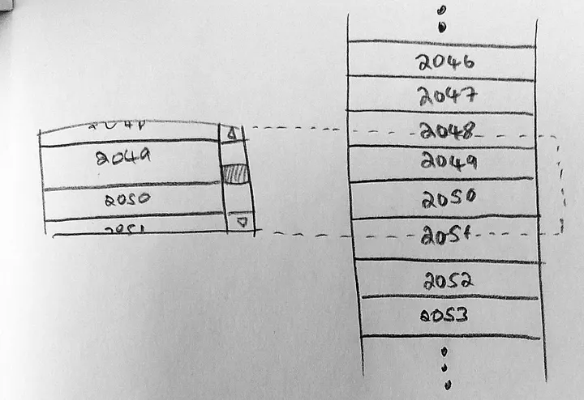
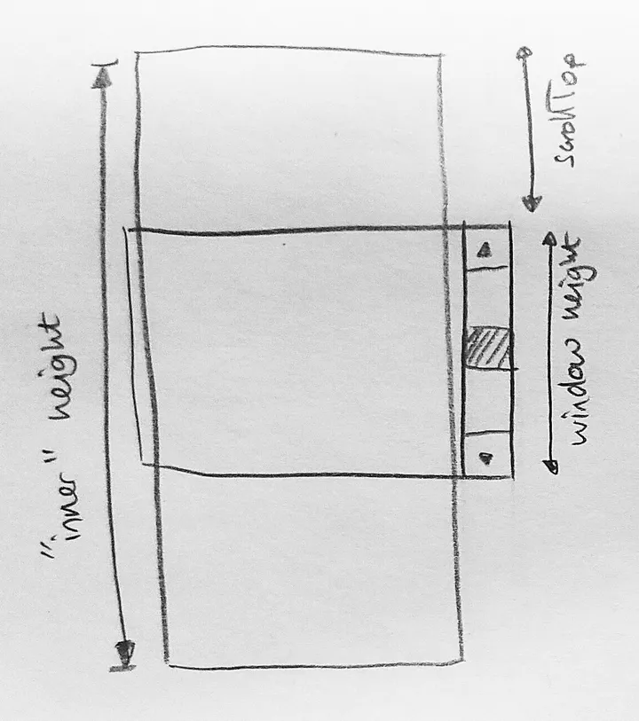

:::tip
虚拟列表（virtualized list）：渲染进入可视区的元素，动态取消渲染离开可视区的元素。可视区外渲染少量元素。

参考资料：
- [Building a virtualized list from scratch](https://medium.com/ingeniouslysimple/building-a-virtualized-list-from-scratch-9225e8bec120)
- [What I learned from building my own virtualized list library for React](https://dev.to/nishanbajracharya/what-i-learned-from-building-my-own-virtualized-list-library-for-react-45ik)
- [List Virtualization](https://www.patterns.dev/posts/virtual-lists/)
- [Rendering long lists using virtualization with React](https://wanago.io/2022/06/27/long-lists-react-virtualization/)

npm包：
- [react-window](https://github.com/bvaughn/react-window) is a rewrite of react-virtualized by the same author aiming to be smaller, faster and more tree-shakeable.
:::

### [Building a virtualized list from scratch](https://medium.com/ingeniouslysimple/building-a-virtualized-list-from-scratch-9225e8bec120)
UI “virtualization” is a technique for emulating a list with many elements while only rendering as few as possible to make the screen look correct. UI“虚拟化”是一种模拟包含许多元素的列表，同时只渲染尽可能少的元素以使屏幕看起来正确的技术。


- The “inner” height is the total height of the list itself. 在简单的例子中， 列表的总高度 一般为 每行的高度*行数
- The “window” height is the height of the scrollable area: a window into the full list. “窗口”高度是可滚动区域的高度：进入完整列表的窗口。
- scrollTop measures how far the inner container is scrolled. It’s the distance between the top of the inner container and its visible part. scrollTop 测量 inner container 滚动的距离。它是 inner container 顶部与其可见部分之间的距离。

- To find the elements which intersect the top and bottom edges of our scrollable area, we divide their pixel position by the height of the elements. We then use Math.floor() to turn the pixel position into a valid element index, and render all the elements between those two indexes. 为了找到与可滚动区域的顶部和底部边缘相交的元素，我们将它们的像素位置除以元素的高度。然后我们使用 Math.floor() 将像素位置转换为有效的元素索引，并渲染这两个索引之间的所有元素。
```jsx
const VirtualizedList = props => {
  const { numItems, itemHeight, renderItem, windowHeight } = props;
  const [scrollTop, setScrollTop] = useState(0);

  const innerHeight = numItems * itemHeight;
  const startIndex = Math.floor(scrollTop / itemHeight);
  const endIndex = Math.min(
    numItems - 1, // don't render past the end of the list
    Math.floor((scrollTop + windowHeight) / itemHeight)
  );

  const items = [];
  for (let i = startIndex; i <= endIndex; i++) {
    items.push(
      renderItem({
        index: i,
        style: {
          position: "absolute",
          top: `${i * itemHeight}px`,
          width: "100%"
        }
      })
    );
  }

  const onScroll = e => setScrollTop(e.currentTarget.scrollTop);

  return (
    <div className="scroll" style={{ overflowY: "scroll" }} onScroll={onScroll}>
      <div
        className="inner"
        style={{ position: "relative", height: `${innerHeight}px` }}
      >
        {items}
      </div>
    </div>
  );
};
```

### [What I learned from building my own virtualized list library for React](https://dev.to/nishanbajracharya/what-i-learned-from-building-my-own-virtualized-list-library-for-react-45ik)
A virtualized list doesn’t have any scrolling artifacts that you might expect considering it is rendering new items that come into view and un-rendering items that get out of the view on the fly. It works basically the same as a non virtualized list, showing the scrollbar on the side with the same functionality when dragging the scroll bar. 考虑到它正在渲染进入视图的新项目和动态地取消渲染离开视图的项目，虚拟化列表没有任何您可能期望的滚动工件。它的工作原理与非虚拟化列表基本相同，在拖动滚动条时在侧面显示具有相同功能的滚动条。

### [List Virtualization](https://www.patterns.dev/posts/virtual-lists/)
List virtualization (also known as windowing) is the idea of rendering only visible rows of content in a dynamic list instead of the entire list. The rows rendered are only a small subset of the full list with what is visible (the window) moving as the user scrolls. This can improve rendering performance. 列表虚拟化（也称为窗口化）是在动态列表中只呈现可见内容行而不是整个列表的想法。呈现的行只是完整列表的一小部分，可见内容（窗口）随着用户滚动而移动。这可以提高渲染性能。

### [Rendering long lists using virtualization with React](https://wanago.io/2022/06/27/long-lists-react-virtualization/)


虚拟列表的思路：只渲染展示当前可见区域内的内容，当内容已出可见区域外时只作简单渲染。
关键是要计算出哪些 dom 出现在可视区域需要实际渲染，哪些在视野外只需简单渲染。
传统方案一般是监听 scroll, 在回调方法中 手动计算偏移量然后计算定位，由于 scroll 事件密集发生，计算量很大，容易造成性能问题。
IntersectionObserver API 作为浏览器原生的API可以做到“观察”所需元素是否需要在页面上显示，以此来对大量数据的渲染进行优化。

最外层div的高度
最外层div的宽度
总条数
每条的高度
最外层div绑定onScroll事件
scrollTop
clientHeight
scrollHeight