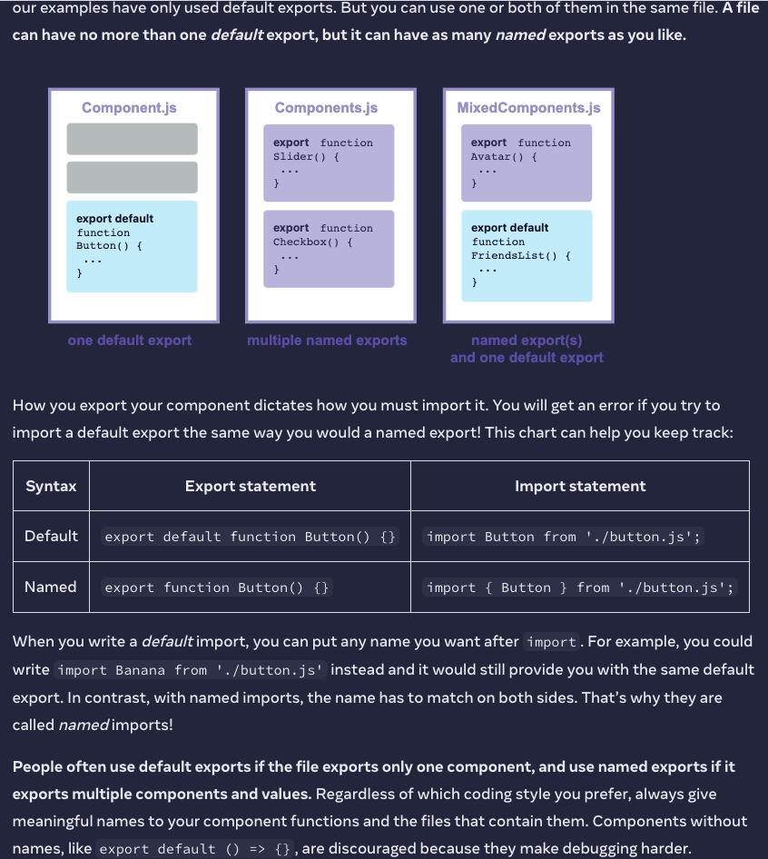
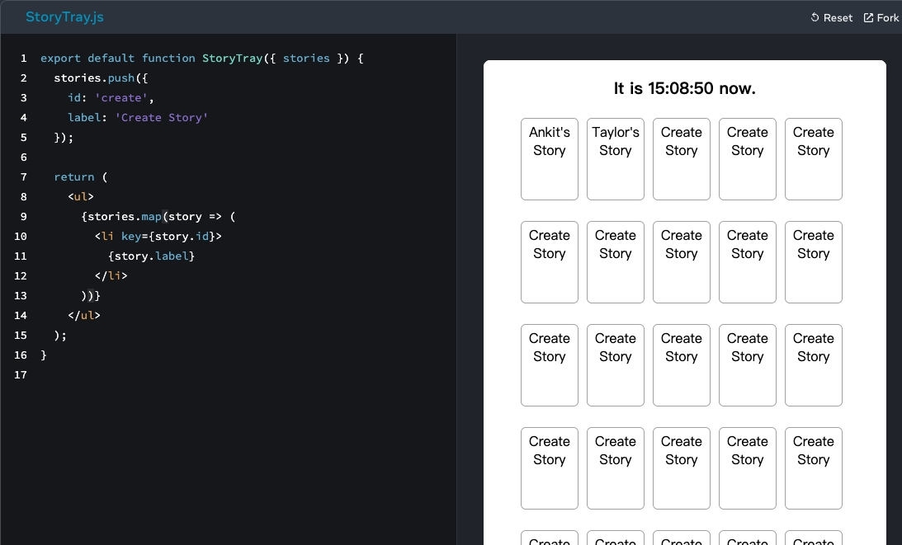
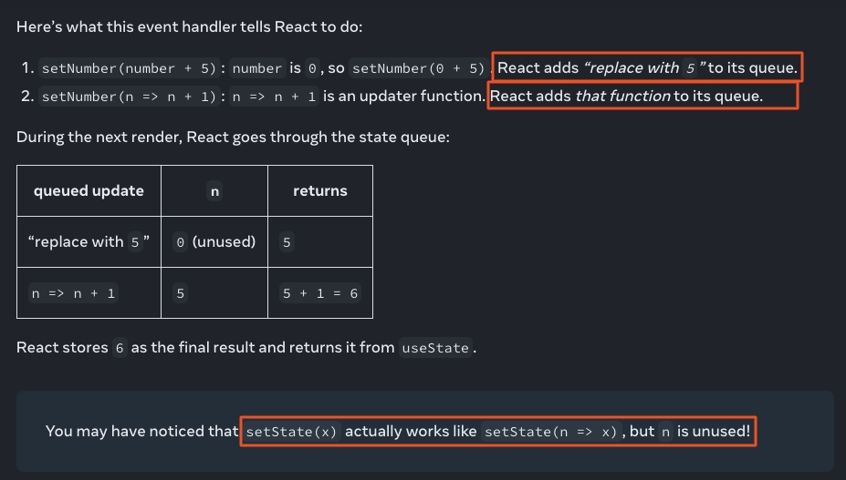

:::tip
[React](https://react.dev/) is a library that lets you organize UI code by breaking it apart into pieces called components. React doesn’t take care of routing or data management.This means there are several ways to start a new React project:
- Start with a minimal toolchain, adding more features to your project as you go. (Great for learning!)
- Start with an opinionated framework that has common features like data fetching and routing built-in.
:::

:::info
[React JS Best Practices From The New Docs](https://sebastiancarlos.medium.com/react-js-best-practices-from-the-new-docs-1c65570e785d)
:::

- [一、创建React工程](#一创建react工程)
  - [1. minimal toolchain---Create React App](#1-minimal-toolchain---create-react-app)
  - [2. full-featured framework---Next.js](#2-full-featured-framework---nextjs)
- [二、知识点](#二知识点)
  - [1. 事件处理](#1-事件处理)
    - [1.1 定义事件处理函数的3种方式](#11-定义事件处理函数的3种方式)
    - [1.2 Passing event handlers as props](#12-passing-event-handlers-as-props)
    - [1.3 Event propagation 事件传播(事件冒泡)](#13-event-propagation-事件传播事件冒泡)
    - [1.4 Stopping propagation 阻止事件冒泡](#14-stopping-propagation-阻止事件冒泡)
    - [1.5 Capture events 捕获事件](#15-capture-events-捕获事件)
    - [1.6 Preventing default behavior 防止默认行为](#16-preventing-default-behavior-防止默认行为)
  - [2. 组件](#2-组件)
    - [2.1 JSX](#21-jsx)
      - [2.1.1. JSX的规则：](#211-jsx的规则)
      - [2.1.2. JSX的花括号中可以写任何JS表达式](#212-jsx的花括号中可以写任何js表达式)
      - [2.1.3. JSX 元素不是“实例”(instances)，因为它们不保存任何内部状态，也不是真正的 DOM 节点。](#213-jsx-元素不是实例instances因为它们不保存任何内部状态也不是真正的-dom-节点)
      - [2.1.4. React的JSX中表达式为false时不会渲染任何内容。React将 false 视为 JSX 树中的“漏洞”，就像 null 或 undefined 一样，并不会在其位置渲染任何内容。](#214-react的jsx中表达式为false时不会渲染任何内容react将-false-视为-jsx-树中的漏洞就像-null-或-undefined-一样并不会在其位置渲染任何内容)
      - [2.1.5. JSX表达式中使用逻辑与操作符时，\&\&的左边不要放数字。JavaScript 自动将 \&\& 左侧转换为布尔值。如果左边是 0，那么整个表达式都会得到那个值 (0)，React 会渲染 0 而不是什么都没有。](#215-jsx表达式中使用逻辑与操作符时的左边不要放数字javascript-自动将--左侧转换为布尔值如果左边是-0那么整个表达式都会得到那个值-0react-会渲染-0-而不是什么都没有)
    - [2.2 Keeping components pure](#22-keeping-components-pure)
      - [2.2.1. 纯函数](#221-纯函数)
      - [2.2.2. Strict Mode](#222-strict-mode)
      - [2.2.3. side effects](#223-side-effects)
    - [2.3 组件库](#23-组件库)
    - [2.4 Props](#24-props)
      - [2.4.1. 可以通过它们传递任何 JavaScript 值，包括对象、数组和函数。](#241-可以通过它们传递任何-javascript-值包括对象数组和函数)
      - [2.4.2. React component functions accept a single argument, a `props` object.](#242-react-component-functions-accept-a-single-argument-a-props-object)
      - [2.4.3. 通常你不需要整个 props 对象本身，所以可以将它解构(destructuring)](#243-通常你不需要整个-props-对象本身所以可以将它解构destructuring)
      - [2.4.4. 给prop指定默认值](#244-给prop指定默认值)
      - [2.4.5. 使用JSX spread syntax传递props](#245-使用jsx-spread-syntax传递props)
      - [2.4.6. props的children](#246-props的children)
      - [2.4.7. 子组件不要改变props](#247-子组件不要改变props)
    - [2.5 Rendering Lists](#25-rendering-lists)
      - [2.5.1. 箭头函数的隐式返回(implicitly return)及block body](#251-箭头函数的隐式返回implicitly-return及block-body)
      - [2.5.2. map中的JSX必须得有key](#252-map中的jsx必须得有key)
      - [2.5.3. React组件不接收key作为prop，key仅被React本身在其整个生命周期内识别对应的数组的项。](#253-react组件不接收key作为propkey仅被react本身在其整个生命周期内识别对应的数组的项)
  - [3. Render and Commit](#3-render-and-commit)
    - [3.1 Triggering a render](#31-triggering-a-render)
    - [3.2 React renders your components](#32-react-renders-your-components)
    - [3.3 React commits changes to the DOM](#33-react-commits-changes-to-the-dom)
  - [4. State](#4-state)
    - [4.1 State as a Snapshot](#41-state-as-a-snapshot)
    - [4.2 Queueing a series of state updates](#42-queueing-a-series-of-state-updates)
      - [4.2.1 React batches state updates 批量状态更新](#421-react-batches-state-updates-批量状态更新)
      - [4.2.2 Updating the same state variable multiple times before the next render](#422-updating-the-same-state-variable-multiple-times-before-the-next-render)
      - [4.2.3 What happens if you update state after replacing it](#423-what-happens-if-you-update-state-after-replacing-it)
      - [4.2.4 What happens if you replace state after updating it](#424-what-happens-if-you-replace-state-after-updating-it)
    - [4.3 更改类型为对象或数组的state](#43-更改类型为对象或数组的state)
    - [4.4 用 Immer 编写简洁的更新逻辑](#44-用-immer-编写简洁的更新逻辑)
  - [5. Managing State](#5-managing-state)
    - [5.1 Reacting to Input with State](#51-reacting-to-input-with-state)
    - [5.2 Choosing the state structure](#52-choosing-the-state-structure)
      - [5.2.1 Principles for structuring state](#521-principles-for-structuring-state)
    - [5.3 Sharing state between components](#53-sharing-state-between-components)
    - [5.4 Preserving and resetting state 保留/重置状态](#54-preserving-and-resetting-state-保留重置状态)
    - [5.5 Extracting state logic into a reducer](#55-extracting-state-logic-into-a-reducer)
    - [5.6 Passing data deeply with context](#56-passing-data-deeply-with-context)
    - [5.7 Scaling up with reducer and context 使用 reducer 和 context 进行扩展](#57-scaling-up-with-reducer-and-context-使用-reducer-和-context-进行扩展)
- [三、Hooks](#三hooks)
  - [1. useState](#1-usestate)
    - [1.1 useState怎么区分不同的state？](#11-usestate怎么区分不同的state)
- [四、Optimizing Performance](#四optimizing-performance)
  - [1. Use the Production Build 使用生产版本](#1-use-the-production-build-使用生产版本)
  - [2. Profiling Components with the DevTools Profiler 使用 DevTools Profiler 分析组件](#2-profiling-components-with-the-devtools-profiler-使用-devtools-profiler-分析组件)
  - [3. Virtualize Long Lists 虚拟化长列表](#3-virtualize-long-lists-虚拟化长列表)
  - [4. Avoid Reconciliation 避免调合](#4-avoid-reconciliation-避免调合)
  - [5. shouldComponentUpdate In Action](#5-shouldcomponentupdate-in-action)

## 一、创建React工程
### 1. minimal toolchain---[Create React App](https://create-react-app.dev/)
Popular alternatives:
- [Vite](https://vitejs.dev/guide/)
- [Parcel](https://parceljs.org/getting-started/webapp/)

:::info
Custom toolchains 
> You may prefer to create and configure your own toolchain. A toolchain typically consists of:

- A package manager lets you install, update, and manage third-party packages. Popular package managers: [npm](https://www.npmjs.com/) (built into Node.js), [Yarn](https://yarnpkg.com/), [pnpm](https://pnpm.io/).
- A compiler lets you compile modern language features and additional syntax like JSX or type annotations for the browsers. Popular compilers: [Babel](https://babeljs.io/), [TypeScript](https://www.typescriptlang.org/), [swc](https://swc.rs/).
- A bundler lets you write modular code and bundle it together into small packages to optimize load time. Popular bundlers: [webpack](https://webpack.js.org/), [Parcel](https://parceljs.org/), [esbuild](https://esbuild.github.io/), [swc](https://swc.rs/).
- A minifier makes your code more compact so that it loads faster. Popular minifiers: [Terser](https://terser.org/), [swc](https://swc.rs/).
- A server handles server requests so that you can render components to HTML. Popular servers: [Express](https://expressjs.com/).
- A linter checks your code for common mistakes. Popular linters: [ESLint](https://eslint.org/).
- A test runner lets you run tests against your code. Popular test runners: [Jest](https://jestjs.io/).

If you prefer to set up your own JavaScript toolchain from scratch, [check out this guide](https://medium.com/@JedaiSaboteur/creating-a-react-app-from-scratch-f3c693b84658) that re-creates some of the Create React App functionality. A framework will usually also provide a routing and a data fetching solution. In a larger project, you might also want to manage multiple packages in a single repository with a tool like [Nx](https://nx.dev/) or [Turborepo](https://turbo.build/).
:::

:::info
install the JSX preprocessor:
```bash
npm install babel-cli@6 babel-preset-react-app@3
```
对src文件夹中的jsx进行编译转换成js:
```bash
npx babel --watch src --out-dir . --presets react-app/prod
```
Linting & Formatting:
- [ESLint with the recommended configuration for React](https://www.npmjs.com/package/eslint-config-react-app)，包含的校验规则为：[eslint-plugin-react-hooks](https://www.npmjs.com/package/eslint-plugin-react-hooks)
- 如果你的 ESLint 预设有格式规则，它们可能与 [Prettier](https://prettier.io/) 冲突。我们建议使用 [eslint-config-prettier](https://github.com/prettier/eslint-config-prettier) 禁用 ESLint 预设中的所有格式规则，以便 ESLint 仅用于捕获逻辑错误。
```bash
prettier --check "src/**/*.js"
```
[html-to-jsx](https://transform.tools/html-to-jsx)
:::

### 2. full-featured framework---[Next.js](https://nextjs.org/)
> Next.js 是一个很好的起点。 Next.js 是一个流行的轻量级框架，用于使用 React 构建的静态和服务器渲染应用程序。它预装了路由、样式和服务器端渲染等功能，让您的项目快速启动和运行。

Popular alternatives:
- [Gatsby](https://www.gatsbyjs.com/)
- [Remix](https://remix.run/)
- [Razzle](https://razzlejs.org/)

## 二、知识点
### 1. 事件处理
:::tip
React lets you add event handlers to your JSX. Event handlers are your own functions that will be triggered in response to user interactions like clicking, hovering, focusing on form inputs, and so on.
:::

#### 1.1 定义事件处理函数的3种方式
- 组件内部function handleXxx
```jsx
function MyButton() {
  function handleClick() {
    alert('You clicked me!');
  }

  return (
    <button onClick={handleClick}>
      Click me
    </button>
  );
}

// 注意 onClick={handleClick} 最后没有括号！不要调用事件处理函数，你只需要传递它。当用户单击按钮时，React 将调用您的事件处理程序。
```

- JSX行内定义function handleXxx
```jsx
<button onClick={function handleClick() {
  alert('You clicked me!');
}}>
```

- JSX行内定义箭头函数
```jsx
<button onClick={() => {
  alert('You clicked me!');
}}>
```
```jsx
export default function App() {
  return (
    <Toolbar
      onPlayMovie={() => alert('Playing!')}
      onUploadImage={() => alert('Uploading!')}
    />
  );
}

function Toolbar({ onPlayMovie, onUploadImage }) {
  return (
    <div>
      <Button onClick={onPlayMovie}>
        Play Movie
      </Button>
      <Button onClick={onUploadImage}>
        Upload Image
      </Button>
    </div>
  );
}

function Button({ onClick, children }) {
  return (
    <button onClick={onClick}>
      {children}
    </button>
  );
}
```

:::info
不要调用事件处理函数，只需要传递它。

handleClick() 末尾的 () 在渲染期间立即触发该函数，无需任何点击。这是因为 JSX 花括号中的 JavaScript 会立即执行。
:::

#### 1.2 Passing event handlers as props
父组件指定子组件的事件处理程序（[Everything you need to know about Design Systems](https://uxdesign.cc/everything-you-need-to-know-about-design-systems-54b109851969)）
```jsx
function Button({ onClick, children }) {
  return (
    <button onClick={onClick}>
      {children}
    </button>
  );
}

function PlayButton({ movieName }) {
  function handlePlayClick() {
    alert(`Playing ${movieName}!`);
  }

  return (
    <Button onClick={handlePlayClick}>
      Play "{movieName}"
    </Button>
  );
}

function UploadButton() {
  return (
    <Button onClick={() => alert('Uploading!')}>
      Upload Image
    </Button>
  );
}

export default function Toolbar() {
  return (
    <div>
      <PlayButton movieName="Kiki's Delivery Service" />
      <UploadButton />
    </div>
  );
}
```
[查看执行结果](https://code.juejin.cn/pen/7164647346758746148)

#### 1.3 Event propagation 事件传播(事件冒泡)
事件处理程序还将捕获来自您的组件可能拥有的任何子级的事件。
```jsx live
// 如果单击任一按钮，其 onClick 将首先运行，然后是父 <div> 的 onClick。所以会出现两条消息。如果您单击工具栏本身，则只有父 <div> 的 onClick 会运行。
function Toolbar() {
  return (
    <div className="Toolbar" onClick={() => {
      alert('You clicked on the toolbar!');
    }}>
      <button onClick={() => alert('Playing!')}>
        Play Movie
      </button>
      <button onClick={() => alert('Uploading!')}>
        Upload Image
      </button>
    </div>
  );
}
```
:::info
除了 onScroll ，所有事件都在 React 中传播。
:::

#### 1.4 Stopping propagation 阻止事件冒泡
- 事件处理程序接收一个事件对象作为其唯一参数。按照惯例，它通常被称为 `e`，代表“事件”。您可以使用此对象来读取有关事件的信息。
- 该事件对象还允许您停止传播。如果你想阻止事件到达父组件，你需要像这个 Button 组件一样调用 `e.stopPropagation()`
```jsx
// Since the propagation was stopped, the parent <div>’s onClick handler does not run.
function Button({ onClick, children }) {
  return (
    <button onClick={e => {
      e.stopPropagation();
      onClick();
    }}>
      {children}
    </button>
  );
}

export default function Toolbar() {
  return (
    <div className="Toolbar" onClick={() => {
      alert('You clicked on the toolbar!');
    }}>
      <Button onClick={() => alert('Playing!')}>
        Play Movie
      </Button>
      <Button onClick={() => alert('Uploading!')}>
        Upload Image
      </Button>
    </div>
  );
}
```
[查看执行结果](https://code.juejin.cn/pen/7164656358560628751)

#### 1.5 Capture events 捕获事件
:::info
捕获事件---在极少数情况下，您可能需要捕获子元素上的所有事件，即使它们停止传播。例如，您可能希望将每次点击记录到分析中，而不管传播逻辑如何。您可以通过在事件名称末尾添加 `Capture` 来做到这一点。
```jsx
<div onClickCapture={() => { /* this runs first */ }}>
  <button onClick={e => e.stopPropagation()} />
  <button onClick={e => e.stopPropagation()} />
</div>
```
:::

#### 1.6 Preventing default behavior 防止默认行为
**一些浏览器事件具有与之关联的默认行为。例如，`<form>` 提交事件，默认情况下会重新加载整个页面。**
```jsx
function Signup() {
  return (
    <form onSubmit={() => alert('Submitting!')}>
      <input />
      <button>Send</button>
    </form>
  );
}
```
[查看效果](https://codesandbox.io/s/uo78y9?file=/App.js:15-157&utm_medium=sandpack)

可以使用 `e.preventDefault()` 来阻止默认行为
```jsx live
function Signup() {
  return (
    <form onSubmit={e => {
      e.preventDefault();
      alert('Submitting!');
    }}>
      <input />
      <button>Send</button>
    </form>
  );
}
```
:::info
- [e.stopPropagation()](https://developer.mozilla.org/zh-CN/docs/Web/API/Event/stopPropagation) 用于阻止事件冒泡
- [e.preventDefault()](https://developer.mozilla.org/zh-CN/docs/Web/API/Event/preventDefault) 用于阻止少数事件的默认浏览器行为
:::

### 2. 组件
:::tip
- 应遵循单一职责原则(single responsibility principle)，即一个组件在理想情况下应该只做一件事。如果它最终增长，它应该被分解成更小的子组件。
- 单向数据流(one-way data flow): 数据从顶层组件向下流向树底部的组件。
- 组件可以小到一个按钮，也可以大到整个页面。
- DRY（Don't repeat yourself）原则
:::

[Thinking in React](https://code.juejin.cn/pen/7161767735733534728)
- Warning: You provided a `value` prop to a form field without an `onChange` handler. This will render a read-only field. If the field should be mutable use `defaultValue`. Otherwise, set either `onChange` or `readOnly`.
```jsx
<input type="text" value={filterText} placeholder="Search..." />
```
- Warning: You provided a `checked` prop to a form field without an `onChange` handler. This will render a read-only field. If the field should be mutable use `defaultChecked`. Otherwise, set either `onChange` or `readOnly`.
```jsx
<input type="checkbox" checked={inStockOnly} />
```

- props可以传递 对象、数组、函数，甚至可以传递JSX

- React 组件是常规的 JavaScript 函数（但它们的名称必须以大写字母开头，否则它们将不起作用！），返回JSX markup。
```jsx
function profile() {
  return (
    
  );
}

export default function Gallery() {
  return (
    <section>
      <h1>Amazing scientists</h1>
      <profile />
      <profile />
      <profile />
    </section>
  );
}

// Warning: The tag <profile> is unrecognized in this browser. If you meant to render a React component, start its name with an uppercase letter.
```

- 一个文件只能有一个默认导出（one default export），但可以有任意多个命名导出（many named exports）。
> 默认导出的文件导入时可以使用任何的名字；不要定义没有名字的组件。



- A component must return something. In some situations, you won’t want to render anything at all. In this case, you can return null.
```jsx
function Item({ name, isPacked }) {
  if (isPacked) {
    return null;
  }
  return <li className="item">{name}</li>;
}
```
:::tip
实际上，从组件返回 null 并不常见，更常见的是，有条件地包含或排除。
```jsx
// 使用三元运算符
function Item({ name, isPacked }) {
  return (
    <li className="item">
      {isPacked ? name + ' ✔' : name}
    </li>
  );
}
// 使用逻辑与操作符，逻辑与操作符左边为false时整个表达式为false，React将 false 视为 JSX 树中的“漏洞”，就像 null 或 undefined 一样，并不会在其位置渲染任何内容。
function Item({ name, isPacked }) {
  return (
    <li className="item">
      {name} {isPacked && '✔'}
    </li>
  );
}
```
:::

#### 2.1 JSX
:::tip
JSX and React are two separate things. They’re often used together, but you can [use them independently](https://reactjs.org/blog/2020/09/22/introducing-the-new-jsx-transform.html#whats-a-jsx-transform) of each other. JSX is a syntax extension, while React is a JavaScript library.
:::

##### 2.1.1. JSX的规则：
- (1) Return a single root element.
> To return multiple elements from a component, wrap them with a single parent tag. For example, you can use a `<div>`, If you don’t want to add an extra `<div>` to your markup, you can write `<>`and `</>` instead. This empty tag is called a [Fragment](https://beta.reactjs.org/apis/react/Fragment).Fragments let you group things without leaving any trace in the browser HTML tree.
```jsx
<>
  <h1>Hedy Lamarr's Todos</h1>
  
  <ul>
    ...
  </ul>
</>
```
:::info
JSX 看起来像 HTML，但在底层它被转换为纯 JavaScript 对象。正如 无法从函数返回两个对象（如果不将它们包装到数组中），你也不能返回两个 JSX 标签而不将它们包装到另一个标签或Fragment中。
:::

- (2) Close all the tags
> JSX 要求标签显式关闭，比如`` `<li>111</li>`

- (3) 属性小驼峰
> JSX被转成JS对象，其属性就是JS变量，JS对变量名有限制，例如，它们的名称不能包含破折号，不能是`class`等保留字，等等。
HTML `<ul style="background-color: black">`，JSX `<ul style={{ backgroundColor: 'black' }}>`

可以使用[转换器](https://transform.tools/html-to-jsx)转换，帮助写JSX，如：
```html
<!-- Hello world -->
<div class="awesome" style="border: 1px solid red">
  <label for="name">Enter your name: </label>
  <input type="text" id="name" />
</div>
<p>Enter your HTML here</p>
```
```jsx
<>
  {/* Hello world */}
  <div className="awesome" style={{ border: "1px solid red" }}>
    <label htmlFor="name">Enter your name: </label>
    <input type="text" id="name" />
  </div>
  <p>Enter your HTML here</p>
</>
```

##### 2.1.2. JSX的花括号中可以写任何JS表达式
> 包括函数调用，比如`{formatDate(new Date())}`；对象，比如`style={{backgroundColor: 'black',color: 'pink'}}`；花括号中也可以写JSX：
```jsx
function Item({ name, importance }) {
  return (
    <li className="item">
      {name}
      {importance > 0 && ' '}
      {importance > 0 &&
        <i>(Importance: {importance})</i>
      }
    </li>
  );
}
export default function PackingList() {
  return (
    <section>
      <h1>Sally Ride's Packing List</h1>
      <ul>
        <Item 
          importance={9} 
          name="Space suit" 
        />
        <Item 
          importance={0} 
          name="Helmet with a golden leaf" 
        />
        <Item 
          importance={6} 
          name="Photo of Tam" 
        />
      </ul>
    </section>
  );
}
```

##### 2.1.3. JSX 元素不是“实例”(instances)，因为它们不保存任何内部状态，也不是真正的 DOM 节点。

##### 2.1.4. React的JSX中表达式为false时不会渲染任何内容。React将 false 视为 JSX 树中的“漏洞”，就像 null 或 undefined 一样，并不会在其位置渲染任何内容。

##### 2.1.5. JSX表达式中使用逻辑与操作符时，&&的左边不要放数字。JavaScript 自动将 && 左侧转换为布尔值。如果左边是 0，那么整个表达式都会得到那个值 (0)，React 会渲染 0 而不是什么都没有。
```jsx
const list = [1,2];
const emptyList = [];
// 下面渲染出来的是hello
{
  list.length && <h1>hello</h1>
}
// 下面渲染出来的是数字0
{
  emptyList.length && <h1>666</h1>
}
```
[查看执行结果](https://code.juejin.cn/pen/7163629449186361352)

#### 2.2 Keeping components pure
##### 2.2.1. 纯函数
:::info
纯函数：
- Minds its own business. It does not change any objects or variables that existed before it was called. 不会改变 被调用前存在的 任何对象或变量
- Same inputs, same output. Given the same inputs, a pure function should always return the same result. 相同的输入总是有相同的输出
```js
function double(number) {
  return 2 * number;
}

// double is a pure function. If you pass it 3, it will return 6. Always.
```
:::

- 纯函数不会改变函数范围之外的变量或调用之前创建的对象！

- 将组件编写为纯函数，可以避免随着代码的增加出现一些令人困惑的错误和不可预测的行为。

- 每个组件都应该只“为自己考虑”，而不是在渲染过程中试图与其他组件协调或依赖。每个组件都应该自己计算 JSX！渲染可以随时发生，因此组件不应依赖于彼此的渲染顺序。

- 当您想要更改某些内容以响应用户输入时，您应该设置状态（set state）而不是写入变量。在渲染组件时，您永远不应该更改预先存在的变量或对象。

##### 2.2.2. Strict Mode
**注意：使用StrictMode和不使用StrictMode 渲染出的结果不一样，这是因为StrictMode时组件函数被调用了2次，而纯函数只计算，所以调用它们两次不会改变任何东西；不纯的函数则会产生不同的结果**
> [不纯的组件](https://code.juejin.cn/pen/7163198918887637004)

- React 提供了一种“严格模式”，它在开发过程中调用每个组件函数两次。通过调用组件函数两次，严格模式有助于找到违反这些规则的组件。
- 严格模式在生产中没有任何影响，因此它不会为您的用户减慢应用程序的速度。要选择严格模式，您可以将根组件包装到 `<React.StrictMode>` 中，一些框架默认执行此操作。

##### 2.2.3. side effects
- These changes—--updating the screen, starting an animation, changing the data—---are called side effects. They’re things that happen “on the side”, not during rendering. 不在渲染期间

- In React, side effects usually belong inside event handlers. Event handlers are functions that React runs when you perform some action—for example, when you click a button. Even though event handlers are defined inside your component, they don’t run during rendering! So event handlers don’t need to be pure. 在 React 中，副作用通常属于事件处理程序。事件处理程序是 在您执行某些操作时 React 运行的函数——例如，当您单击按钮时。**即使在组件内部定义了事件处理程序，它们也不会在渲染期间运行！**所以事件处理程序不需要是纯粹的。

- If you’ve exhausted all other options and can’t find the right event handler for your side effect, you can still attach it to your returned JSX with a useEffect call in your component. This tells React to execute it later, after rendering, when side effects are allowed. However, this approach should be your last resort. When possible, try to express your logic with rendering alone. 如果您已经用尽了所有其他选项仍无法为您的副作用找到正确的事件处理程序，您仍然可以使用组件中的 `useEffect` 将其附加到返回的 JSX。这告诉 React 在渲染之后执行它(不在渲染期间允许执行副作用)。但是，这种方法应该是您最后的手段。如果可能，请尝试仅通过渲染来表达您的逻辑。

:::info
Why does React care about purity?
- Your components could run in a different environment—for example, on the server! Since they return the same result for the same inputs, one component can serve many user requests.
- You can improve performance by [skipping rendering](https://beta.reactjs.org/apis/react/memo) components whose inputs have not changed. This is safe because pure functions always return the same results, so they are safe to cache.
- If some data changes in the middle of rendering a deep component tree, React can restart rendering without wasting time to finish the outdated render. Purity makes it safe to stop calculating at any time.
:::

（1）下面的示例中的副作用是 修改DOM。In this example, the side effect (modifying the DOM) was not necessary at all. You only needed to return JSX. 在此示例中，根本不需要副作用（修改 DOM）。你只需要返回 JSX


（2）下面的示例中，StoryTray函数 不纯。通过在接收到的 stories 数组（一个prop！）上调用 push，它正在改变一个在 StoryTray 开始渲染之前创建的对象。这使得它有缺陷并且很难预测。

```jsx
export default function StoryTray({ stories }) {
  // Copy the array!
  let storiesToDisplay = stories.slice();

  // Does not affect the original array:
  storiesToDisplay.push({
    id: 'create',
    label: 'Create Story'
  });

  return (
    <ul>
      {storiesToDisplay.map(story => (
        <li key={story.id}>
          {story.label}
        </li>
      ))}
    </ul>
  );
}

// It is useful to remember which operations on arrays mutate them, and which don’t. For example, push, pop, reverse, and sort will mutate the original array, but slice, filter, and map will create a new one.
```
[查看执行结果](https://codesandbox.io/s/zhz5w9?file=/StoryTray.js&utm_medium=sandpack)
```jsx
export default function StoryTray({ stories }) {
  let list = JSON.parse(JSON.stringify(stories));
  list.push({
    id: 'create',
    label: 'Create Story'
  });

  return (
    <ul>
      {list.map(story => (
        <li key={story.id}>
          {story.label}
        </li>
      ))}
    </ul>
  );
}
```
[查看执行结果](https://codesandbox.io/s/d66eg9?file=/StoryTray.js:0-303&utm_medium=sandpack)

#### 2.3 组件库
- [Chakra UI](https://chakra-ui.com/)
- [Material UI](https://mui.com/core/)

#### 2.4 Props
##### 2.4.1. 可以通过它们传递任何 JavaScript 值，包括对象、数组和函数。

##### 2.4.2. React component functions accept a single argument, a `props` object.
> 这里说的是React函数组件只接收一个入参，即props对象（但不应该还能接受ref这个入参吗？？）

##### 2.4.3. 通常你不需要整个 props 对象本身，所以可以将它解构(destructuring)
> [解构](https://developer.mozilla.org/zh-CN/docs/Web/JavaScript/Reference/Operators/Destructuring_assignment#Unpacking_fields_from_objects_passed_as_a_function_parameter)
```jsx
function Avatar(props) {
  let person = props.person;
  let size = props.size;
  // ...
}
// 通常你不需要整个 props 对象本身，所以可以将它解构
function Avatar({ person, size }) {}
```

##### 2.4.4. 给prop指定默认值
> 以下面Avatar的prop为例，The default value is only used if the size prop is missing or if you pass `size={undefined}`. But **if you pass `size={null}` or `size={0}`, the default value will not be used**.
```jsx
function Avatar({ person, size = 100 }) {
  // ...
}
```

##### 2.4.5. 使用JSX spread syntax传递props
> 适用于不直接使用任何props，仅仅是传递

```jsx
function Profile(props) {
  return (
    <div className="card">
      <Avatar {...props} />
    </div>
  );
}

// 上面等同于如下写法
function Profile({ person, size, isSepia, thickBorder }) {
  return (
    <div className="card">
      <Avatar
        person={person}
        size={size}
        isSepia={isSepia}
        thickBorder={thickBorder}
      />
    </div>
  );
}
```

:::info
JSX "spread" 语法，不仅仅可以用于props，比如：
```jsx
import { Pie } from '@ant-design/plots';

export default function PieDemo(props) {
  const pieConfig = {
    angleField: 'value',
    colorField: 'type',
    innerRadius: 0.7,
    label: null,
  };

  return <div>
    <div className='pie-container'>
      <Pie {...{...pieConfig,
        radius: 0.9,
      }} />
    </div>
  </div>
}
```
:::

##### 2.4.6. props的children
> When you nest content inside a JSX tag, the parent component will receive that content in a prop called children.

```jsx
function Card({ children }) {
  return (
    <div className="card">
      {children}
    </div>
  );
}
function Avatar({ person, size }) {
  return (
    
  );
}
export default function Profile() {
  return (
    <Card>
      <Avatar
        size={100}
        person={{ 
          name: 'Katsuko Saruhashi',
          imageId: 'YfeOqp2'
        }}
      />
    </Card>
  );
}
function getImageUrl(person, size = 's') {
  return (
    'https://i.imgur.com/' +
    person.imageId +
    size +
    '.jpg'
  );
}
```

:::tip
props的children对应的内容可以有多个标签（不需要有一个外层的标签包裹），例如：
```jsx
function Card({ children }) {
  return <div className="card">
    <div className="card-content">
      { children }
    </div>
  </div>
}
export default function Profile() {
  return (
    <div>
      <Card>
        <h1>Photo</h1>
        
      </Card>
      <Card>
        <h1>About</h1>
        <p>Aklilu Lemma was a distinguished Ethiopian scientist who discovered a natural treatment to schistosomiasis.</p>
      </Card>
    </div>
  );
}
```
[查看执行结果](https://code.juejin.cn/pen/7163614463877185539)
:::

##### 2.4.7. 子组件不要改变props
> 当一个组件需要改变它的 props 时，应该要求父组件传递另外不同的 props(一个新的object)，旧的 props 将被丢弃，最终 JavaScript 引擎将回收它们占用的内存。

:::tip
- Props are read-only snapshots in time: every render receives a new version of props.
- All React components must act like pure functions with respect to their props.
- 保证 React 单向数据流的设计模式，使状态可预测。如果允许子组件修改，那么一个父组件将状态传递给好几个子组件，这几个子组件随意修改，就完全不可预测，不知道在什么地方修改了状态。
:::

#### 2.5 Rendering Lists
##### 2.5.1. 箭头函数的隐式返回(implicitly return)及[block body](https://developer.mozilla.org/en-US/docs/Web/JavaScript/Reference/Functions/Arrow_functions#function_body)
```js
// concise body syntax, implied "return"
const func = (x) => x * x;

// with block body, explicit "return" needed
const func2 = (x, y) => {
  return x + y;
};
```


##### 2.5.2. map中的JSX必须得有key
>- 如果使用 Fragment （`<>...</>`）,`<>`不允许传key，这时可以使用[`<Fragment>`](https://beta.reactjs.org/apis/react/Fragment#rendering-a-list-of-fragments)
>- 不要即时生成key，例如`key={Math.random()}`，这将导致每次都重新创建所有组件和 DOM。这不仅速度慢，而且还会丢失列表项中的任何用户输入。

```jsx
import { Fragment } from 'react';

// ...

const listItems = people.map(person =>
  <Fragment key={person.id}>
    <h1>{person.name}</h1>
    <p>{person.bio}</p>
  </Fragment>
);

// 在DOM中<Fragment>本身将消失，最终渲染的是其包裹的内容
```

##### 2.5.3. React组件不接收key作为prop，key仅被React本身在其整个生命周期内识别对应的数组的项。
>- set key on each component in a collection so React can keep track of each of them even if their position or data changes.
>- 如果您的组件需要 key 对应的值，则必须将其作为单独的 prop 传递。Warning: Child: `key` is not a prop. Trying to access it will result in `undefined` being returned. If you need to access the same value within the child component, you should pass it as a different prop. (https://reactjs.org/link/special-props)
```jsx
function Child(props) {
  return <>
    key:: { props.key } -- { props.keyValue }
  </>
}
function Parent() {
  return <Child key={1} keyValue={1}></Child>
}
```
[查看执行结果](https://code.juejin.cn/pen/7163925086418763813)

### 3. Render and Commit
:::tip
1. Triggering a render
2. Rendering the component
3. Committing to the DOM
:::

#### 3.1 Triggering a render
:::info
组件渲染的原因有2个：
- 组件的初始渲染 initial render
- 组件(或其父组件)的state被更新 component’s (or one of its ancestors’) state has been updated
:::

1. initial render
> createRoot(); render();
```jsx
import Image from './Image.js';
import { createRoot } from 'react-dom/client';

const root = createRoot(document.getElementById('root'))
root.render(<Image />);
```

2. Re-renders when state updates
更新组件的状态会自动对渲染进行排队。Updating your component’s state automatically queues a render. 

#### 3.2 React renders your components
:::tip
“Rendering” means that React is calling your component, which is a function. 
:::
- 在初始渲染时，React 将调用根组件。
- 对于后续的渲染，React 将调用状态更新触发渲染的函数组件。
- 这个过程是递归的：如果更新的组件返回一些其他组件，React 将接下来渲染该组件，如果该组件也返回一些组件，它将接下来渲染该组件，依此类推。这个过程将一直持续到没有更多的嵌套组件并且 React 确切地知道应该在屏幕上显示什么。
```jsx
// index.js
import Gallery from './Gallery.js';
import { createRoot } from 'react-dom/client';

const root = createRoot(document.getElementById('root'))
root.render(<Gallery />);

/**
 * 在初始渲染期间，React 将为 <section>、<h1> 和三个  标签创建 DOM 节点（ Document.createElement() ）。
 * 在重新渲染期间，React 将计算它们的哪些属性（如果有）自上次渲染以来发生了变化。在下一步，即提交阶段之前，它不会对这些信息做任何事情。
 */

// Gallery.js
export default function Gallery() {
  return (
    <section>
      <h1>Inspiring Sculptures</h1>
      <Image />
      <Image />
      <Image />
    </section>
  );
}

function Image() {
  return (
    
  );
}
```

#### 3.3 React commits changes to the DOM
:::tip
React只在不同的渲染之间有差异时才会改变DOM节点。React only changes the DOM nodes if there’s a difference between renders. 比如这个例子：[时间变了input框的内容还在](https://codesandbox.io/s/7fc59g?file=/Clock.js&utm_medium=sandpack)
```jsx
function Clock({ time }) {
  return (
    <>
      <h1>{time}</h1>
      <input />
    </>
  );
}
// React仅仅使用新的time值更新<h1>的内容
// <input>出现在 JSX 中与上次相同的位置，因此 React 不会触及 <input> ！
// 如果渲染结果与上次相同，React 不会触及 DOM。React does not touch the DOM if the rendering result is the same as last time.
```
:::
- 在渲染（调用）你的组件后，React将修改DOM:
  - 对于初始渲染，React将使用[appendChild()](https://developer.mozilla.org/zh-CN/docs/Web/API/Node/appendChild)将上一步创建的所有DOM节点放在根节点下。
  - 对于重新渲染，React将应用最小的必要操作（在渲染时计算！）以使DOM符合最新的渲染输出。

- 渲染完成并且 React 更新 DOM(update the DOM tree) 后，浏览器将重新绘制屏幕repaint the screen。

### 4. State
:::tip
- In React, data that changes over time is called state. 在 React 中，随时间变化的数据称为状态。
- Unlike regular JavaScript variables, React state behaves more like a snapshot. Setting it does not change the state variable you already have, but instead triggers a re-render. 与常规的 JavaScript 变量不同，React 状态的行为更像是快照。设置它不会更改您已经拥有的状态变量，而是会触发重新渲染。对常规变量的更改不会触发渲染。
- useState 返回的数组总是正好有两项，可以使用数组解构（[array destructuring](https://javascript.info/destructuring-assignment)）获取数组的项。
```js
let [a,b] = [1,2];
a // 1
b // 2
```
- **视图层的state呈现的是setState()中的运算结果（自己的理解,记录于2022.11.17--->查看"简单阐述useState是怎么工作的"）**
```jsx
const [count, setCount] = useState(0);

console.log(count);  // 0
setCount(count + 1); // Request a re-render with 1
console.log(count);  // Still 0!
```
```jsx live
function Gallery() {
  const [count, setCount] = useState(0);

  function handleClick() {
    setCount(count + 1);
    setCount(3);
    setCount(4);
  }

  return (
    <>
      <button onClick={handleClick}> Count+1 </button>
      <h3> {count} </h3>
    </>
  );
}
```
- Here’s how that happens in action:
  - 1. 您的组件第一次呈现。因为您将 0 传递给 useState 作为 count 的初始值，所以它将返回 [0, setCount]。 React 记住 0 是最新的状态值。
  - 2. 您更新状态。当用户单击按钮时，它会调用 setCount(count + 1)。 count 为 0，所以它是 setCount(1)。这告诉 React 现在记住 count 为 1 并触发另一个渲染。
  - 3. 您的组件的第二次渲染。 React 仍然可以看到 useState(0)，但是因为 React 记得你将 count 设置为 1，所以它会返回 [1, setCount]。
  - 4. 以此类推。

- State is isolated and private, if you render the same component twice, each copy will have completely isolated state! Changing one of them will not affect the other.
:::

#### 4.1 State as a Snapshot
:::tip
- state的行为更像是快照。设置它不会更改已有的state变量，而是会触发重新渲染。
- 组件函数返回的 JSX 就像 UI 的及时快照，它的props、事件处理程序(event handlers，即使是异步的)和局部变量(local variables)都是**使用渲染时的state（用户与之交互时的状态快照a snapshot of the state）计算的**。Its value was “fixed” when React “took the snapshot” of the UI by calling your component.
- When React re-renders a component:
  - React calls your function again. 再次调用组件函数
  - Your function returns a new JSX snapshot.
  - React then updates the screen to match the snapshot you’ve returned. React更新屏幕（update the DOM tree）以匹配返回的快照

:::
```jsx live
// 下面例子中，先点击Send再将下拉框切换为Bob，alert的名字是啥？
// alert运行时state可能已经改变，但是props、事件处理程序(event handlers，即使是异步的)和局部变量(local variables)都是使用渲染时的state（用户与之交互时的状态快照）计算的
function Form() {
  const [to, setTo] = useState('Alice');
  const [message, setMessage] = useState('Hello');

  function handleSubmit(e) {
    e.preventDefault();
    setTimeout(() => {
      alert(`You said ${message} to ${to}`);
    }, 5000);
  }

  return (
    <form onSubmit={handleSubmit}>
      <label>
        To:{' '}
        <select
          value={to}
          onChange={e => setTo(e.target.value)}>
          <option value="Alice">Alice</option>
          <option value="Bob">Bob</option>
        </select>
      </label>
      <textarea
        placeholder="Message"
        value={message}
        onChange={e => setMessage(e.target.value)}
      />
      <button type="submit">Send</button>
    </form>
  );
}
```

#### 4.2 Queueing a series of state updates
- 下面这个组件有问题：点击“+3”只会增加一次分数。
```jsx live
function Counter() {
  const [score, setScore] = useState(0);

  function increment() {
    setScore(score + 1);
  }

  return (
    <>
      <button onClick={() => increment()}>+1</button>
      <button onClick={() => {
        increment();
        increment();
        increment();
      }}>+3</button>
      <h3>Score: {score}</h3>
    </>
  )
}
```
:::info
- Calling `setScore` will only change it for the next render, but will not affect the event handler from the previous render.
- State as a Snapshot explains why this is happening. Setting state requests a new re-render, but does not change it in the already running code. So score continues to be 0 right after you call setScore(score + 1). 设置状态会请求新的重新渲染，但不会在已经运行的代码中更改它。
- Setting state only changes it for the next render. 设置state仅仅会在下一次渲染时更改该state。
- **props、事件处理程序(event handlers，即使是异步的)和局部变量(local variables)都是使用渲染时的state（用户与之交互时的状态快照a snapshot of the state）计算的**。
```jsx
console.log(score);  // 0
setScore(score + 1); // setScore(0 + 1);
console.log(score);  // 0
setScore(score + 1); // setScore(0 + 1);
console.log(score);  // 0
setScore(score + 1); // setScore(0 + 1);
console.log(score);  // 0

// 既然一直是0，为啥渲染出来的是1呢？(疑问记录于2022.11.10) ---> 查看上面的 “Here’s how that happens in action” 可以解惑 (解惑记录于2022.11.11)

/**
 * Here is what this button’s click handler tells React to do:
 * 1. setScore(score + 1): score is 0 so setScore(0 + 1). React prepares to change score to 1 on the next render.
 * 2. setScore(score + 1): score is 0 so setScore(0 + 1). React prepares to change score to 1 on the next render.
 * 3. setScore(score + 1): score is 0 so setScore(0 + 1). React prepares to change score to 1 on the next render.
 * Even though you called setScore(score + 1) three times, in this render’s event handler score is always 0, so you set the state to 1 three times. 
 */
```
:::

##### 4.2.1 React batches state updates 批量状态更新
:::tip
- React waits until all code in the event handlers has run before processing your state updates. 在处理状态更新之前，React 会等到事件处理程序中的所有代码都已运行。这就是为什么重新渲染只发生在所有这些 setScore() 调用之后。
- batching(批处理)：在您的事件处理程序及其中的任何代码完成之前，UI 不会更新。这使您可以更新多个state变量(甚至来自多个组件)，而不会触发太多重新渲染，可以让你的 React 应用程序运行得更快。
- React does not batch across multiple intentional events like clicks—each click is handled separately. React 不会 跨事件 进行批处理，例如点击事件，每个点击事件都是单独处理的。例如，如果第一次单击按钮禁用了表单，则第二次单击不会再次提交它。
:::

##### 4.2.2 Updating the same state variable multiple times before the next render
- 如果您想在下一次渲染之前多次更新同一个state变量，可以传递一个 基于队列中的前一个状态计算下一个状态 的函数，如 `setScore(s => s + 1)`。这是一种告诉 React “用状态值做某事”而不是仅仅替换它的方法。
```jsx live
function Counter() {
  const [score, setScore] = useState(0);

  function increment() {
    setScore(s => s + 1);
  }

  return (
    <>
      <button onClick={() => increment()}>+1</button>
      <button onClick={() => {
        increment();
        increment();
        increment();
      }}>+3</button>
      <h3>Score: {score}</h3>
    </>
  )
}
```
:::info
`s => s + 1` is called an updater function. When you pass it to a state setter:
1. React queues this function to be processed after all the other code in the event handler has run. 在事件处理程序中的所有其他代码运行之后，React 将此函数排队等待处理。
2. During the next render, React goes through the queue and gives you the final updated state. 在下一次渲染期间，React 遍历队列并为您提供最终的更新后的状态。
:::


##### 4.2.3 What happens if you update state after replacing it
```jsx live
function Counter() {
  const [number, setNumber] = useState(0);

  return (
    <>
      <h3>{number}</h3>
      <button onClick={() => {
        setNumber(number + 5);
        setNumber(n => n + 1);
      }}>Increase the number</button>
    </>
  )
}
```


##### 4.2.4 What happens if you replace state after updating it
```jsx live
function Counter() {
  const [number, setNumber] = useState(0);

  return (
    <>
      <h3>{number}</h3>
      <button onClick={() => {
        setNumber(number + 5);
        setNumber(n => n + 1);
        setNumber(42);
      }}>Increase the number</button>
    </>
  )
}
```


:::info
state setter:
- An updater function (e.g. n => n + 1) gets added to the queue.
- Any other value (e.g. number 5) adds “replace with 5” to the queue, **ignoring what’s already queued**.
- After the event handler completes, React will trigger a re-render. During the re-render, React will process the queue.
- Updater functions run during rendering, so **updater functions must be pure and only return the result**.
- 不要尝试在updater function内部设置状态或运行其他副作用。
- 在严格模式下，React 将运行每个updater function两次（但丢弃第二次结果）以帮助您发现错误。
- updater function参数的命名：使用相应state变量的首字母(如：number--->`setNumber(n => n + 1)`)；或者使用state变量名(如：number--->`setNumber(number => number + 1)`)；或者使用前缀(如：number--->`setNumber(prevNumber => prevNumber + 1)`)
- React processes state updates after event handlers have finished running. This is called batching.


[搞懂这个例子](https://codesandbox.io/s/still-leftpad-e0gtx6?file=/App.js)
:::

#### 4.3 更改类型为对象或数组的state
:::tip
- treat state as read-only(immutable)
- When you store objects in state, mutating them will not trigger renders and will change the state in previous render “snapshots”. 当您将对象存储在状态中时，改变它们不会触发渲染，并且会更改先前渲染“快照”中的状态。
- Instead of mutating an object, create a new version of it, and trigger a re-render by setting state to it. 不应该直接修改类型为对象或数组的state，应该创建它的副本并更改副本。Usually, you will use the `...`([spread syntax](https://developer.mozilla.org/en-US/docs/Web/JavaScript/Reference/Operators/Spread_syntax#spread_in_object_literals)) to copy objects and arrays that you want to change. 或者，新建一个object或array用于setState
- you should only mutate objects that you have just created.
```jsx
const [position, setPosition] = useState({
  x: 0,
  y: 0
});
onPointerMove={e => {
  setPosition({
    x: e.clientX,
    y: e.clientY
  });
  // 或者
  const nextPosition = {};
  nextPosition.x = e.clientX;
  nextPosition.y = e.clientY;
  setPosition(nextPosition);
}}
```
- Spread syntax is shallow: it only copies one level deep.
- 也不应该使用改变数组的方法，比如 push() 和 pop()。
- When dealing with arrays inside React state, you will need to avoid the methods in the left column, and instead prefer the methods in the right column:


- Unfortunately, slice and splice are named similarly but are very different. In React, you will be using slice (no p!) a lot more often because you don’t want to mutate objects or arrays in state.
  - slice lets you copy an array or a part of it.
  - splice mutates the array (to insert or delete items).
:::

1. object state的例子
```jsx live
function Form() {
  const [person, setPerson] = useState({
    name: 'Niki de Saint Phalle',
    artwork: {
      title: 'Blue Nana',
      city: 'Hamburg',
      image: 'https://images.pexels.com/photos/14208426/pexels-photo-14208426.jpeg?auto=compress&cs=tinysrgb&w=1260&h=750&dpr=2',
    }
  });

  function handleNameChange(e) {
    setPerson({
      ...person,
      name: e.target.value
    });
  }

  function handleTitleChange(e) {
    setPerson({
      ...person,
      artwork: {
        ...person.artwork,
        title: e.target.value
      }
    });
  }

  function handleCityChange(e) {
    setPerson({
      ...person,
      artwork: {
        ...person.artwork,
        city: e.target.value
      }
    });
  }

  function handleImageChange(e) {
    setPerson({
      ...person,
      artwork: {
        ...person.artwork,
        image: e.target.value
      }
    });
  }

  return (
    <>
      <label>
        Name:
        <input
          value={person.name}
          onChange={handleNameChange}
        />
      </label>
      <label>
        Title:
        <input
          value={person.artwork.title}
          onChange={handleTitleChange}
        />
      </label>
      <label>
        City:
        <input
          value={person.artwork.city}
          onChange={handleCityChange}
        />
      </label>
      <label>
        Image:
        <input
          value={person.artwork.image}
          onChange={handleImageChange}
        />
      </label>
      <p>
        <i>{person.artwork.title}</i>
        {' by '}
        {person.name}
        <br />
        (located in {person.artwork.city})
      </p>
      
    </>
  );
}
```
```jsx live
// 合并事件，使用动态属性名[e.target.name]
function Form() {
  const [person, setPerson] = useState({
    firstName: 'Barbara',
    lastName: 'Hepworth',
    email: 'bhepworth@sculpture.com'
  });

  function handleChange(e) {
    setPerson({
      ...person,
      [e.target.name]: e.target.value // e.target.name 指的是赋予 <input> DOM 元素的 name 属性
    });
  }

  return (
    <>
      <label>
        First name:
        <input
          name="firstName"
          value={person.firstName}
          onChange={handleChange}
        />
      </label>
      <label>
        Last name:
        <input
          name="lastName"
          value={person.lastName}
          onChange={handleChange}
        />
      </label>
      <label>
        Email:
        <input
          name="email"
          value={person.email}
          onChange={handleChange}
        />
      </label>
      <p>
        {person.firstName}{' '}
        {person.lastName}{' '}
        ({person.email})
      </p>
    </>
  );
}
```

2. array state的例子
```jsx live
// copy array
function List() {
  let nextId = 3;
  const initialList = [
    { id: 0, title: 'Big Bellies' },
    { id: 1, title: 'Lunar Landscape' },
    { id: 2, title: 'Terracotta Army' },
  ];

  const [list, setList] = useState(initialList);

  function handleClick() {
    const nextList = [...list];
    nextList.reverse(); // 由于reverse()会改变原数组，所以不能直接使用list.reverse()
    setList(nextList);
  }

  return (
    <>
      <button onClick={handleClick}>
        Reverse
      </button>
      <ul>
        {list.map(artwork => (
          <li key={artwork.id}>{artwork.title}</li>
        ))}
      </ul>
    </>
  );
}
```
:::info
注意：
- even if you copy an array, you can’t mutate existing items inside of it directly. This is because copying is shallow—--the new array will contain the same items as the original one.
```jsx
const nextList = [...list];
nextList[0].title = '666'; // Problem: mutates list[0]
setList(nextList); 
```
- Although nextList and list are two different arrays, **`nextList[0]` and `list[0]` point to the same object**. So by changing `nextList[0].title`, you are also changing `list[0].title`. This is a state mutation, which you should avoid!
- Objects are not really located “inside” arrays. They might appear to be “inside” in code, but each object in an array is a separate value, to which the array “points”.
- When updating nested state, you need to create copies from the point where you want to update, and all the way up to the top level.
  - [错误的例子](https://codesandbox.io/s/46d808?file=/App.js:553-560&utm_medium=sandpack)
  - [正确的例子](https://codesandbox.io/s/8sk5hs?file=/App.js&utm_medium=sandpack)
```jsx
setMyList(myList.map(artwork => {
  if (artwork.id === artworkId) {
    // Create a *new* object with changes
    return { ...artwork, seen: nextSeen };
  } else {
    // No changes
    return artwork;
  }
});
```
[看这个例子的官方写法和自己的写法的区别](https://codesandbox.io/s/pensive-chihiro-0761e1?file=/App.js)

[数组的增删改](https://codesandbox.io/s/2mdzuq?file=/App.js&utm_medium=sandpack)

[数组的增删改(使用useImmer)](https://codesandbox.io/s/admiring-heyrovsky-2cii8l?file=/App.js)
:::

#### 4.4 用 Immer 编写简洁的更新逻辑
:::tip
Immer 提供的 draft 是一种特殊类型的对象，称为 [Proxy](https://developer.mozilla.org/en-US/docs/Web/JavaScript/Reference/Global_Objects/Proxy)，它会“记录”你用它做了什么。Immer 计算出 draft 的哪些部分被更改了，并生成一个全新对象，所以可以随意修改 draft。
:::
[不使用use-immer的数组state](https://codesandbox.io/s/egqo5y?file=/App.js&utm_medium=sandpack)

或者使用 [Immer](https://github.com/immerjs/use-immer)库 来减少重复代码：
```jsx
import { useImmer } from 'use-immer';

function Form() {
  const [person, updatePerson] = useImmer({
    name: 'Niki de Saint Phalle',
    artwork: {
      title: 'Blue Nana',
      city: 'Hamburg',
      image: 'https://images.pexels.com/photos/14208426/pexels-photo-14208426.jpeg?auto=compress&cs=tinysrgb&w=1260&h=750&dpr=2',
    }
  });

  function handleNameChange(e) {
    updatePerson(draft => {
      draft.name = e.target.value;
    });
  }

  function handleTitleChange(e) {
    updatePerson(draft => {
      draft.artwork.title = e.target.value;
    });
  }

  function handleCityChange(e) {
    updatePerson(draft => {
      draft.artwork.city = e.target.value;
    });
  }

  function handleImageChange(e) {
    updatePerson(draft => {
      draft.artwork.image = e.target.value;
    });
  }

  return (
    <>
      <label>
        Name:
        <input
          value={person.name}
          onChange={handleNameChange}
        />
      </label>
      <label>
        Title:
        <input
          value={person.artwork.title}
          onChange={handleTitleChange}
        />
      </label>
      <label>
        City:
        <input
          value={person.artwork.city}
          onChange={handleCityChange}
        />
      </label>
      <label>
        Image:
        <input
          value={person.artwork.image}
          onChange={handleImageChange}
        />
      </label>
      <p>
        <i>{person.artwork.title}</i>
        {' by '}
        {person.name}
        <br />
        (located in {person.artwork.city})
      </p>
      
    </>
  );
}
```
[查看执行结果](https://replit.com/@fqishuai/use-immer#src/App.jsx)

[使用use-immer的数组state](https://codesandbox.io/s/mclx2n?file=/App.js&utm_medium=sandpack)

### 5. Managing State
[以状态驱动的思维方式处理交互(approach interactions with a state-driven mindset)](https://codesandbox.io/s/xenodochial-golick-0645w2?file=/App.js)

#### 5.1 Reacting to Input with State
Remove non-essential state to avoid bugs and paradoxes. 删除非必要状态以避免错误和悖论。

如果在两种情况下都返回了相似的 JSX 树，那么最好将它们写成一个 JSX 片段；如果两个不同的 JSX 块描述同一棵树，则它们的嵌套必须对齐，否则切换不同的JSX将重新创建整棵树并重置其状态。
```jsx
import { useState } from 'react';

// 不同的情况下返回一个JSX
function Picture() {
  const [isActive, setIsActive] = useState(false);

  let backgroundClassName = 'background';
  let pictureClassName = 'picture';
  if (isActive) {
    pictureClassName += ' picture--active';
  } else {
    backgroundClassName += ' background--active';
  }

  return (
    <div
      className={backgroundClassName}
      onClick={() => setIsActive(false)}
    >
       {
          e.stopPropagation();
          setIsActive(true);
        }}
        className={pictureClassName}
        alt="Rainbow houses in Kampung Pelangi, Indonesia"
        src="https://i.imgur.com/5qwVYb1.jpeg"
      />
    </div>
  );
}

// 返回两个JSX，此时JSX的嵌套必须对齐(如下，第一个 `<div>` → 第一个 ``都对齐)，否则，切换 isActive 将重新创建整棵树并重置其状态。
function Picture() {
  const [isActive, setIsActive] = useState(false);
  if (isActive) {
    return (
      <div
        className="background"
        onClick={() => setIsActive(false)}
      >
         e.stopPropagation()}
        />
      </div>
    );
  }
  return (
    <div className="background background--active">
       setIsActive(true)}
      />
    </div>
  );
}
```

```jsx live
function EditProfile() {
  const [isEditing, setIsEditing] = useState(false);
  const [firstName, setFirstName] = useState('Jane');
  const [lastName, setLastName] = useState('Jacobs');

  return (
    <form onSubmit={e => {
      e.preventDefault();
      setIsEditing(!isEditing);
    }}>
      <label>
        First name:{' '}
        {isEditing ? (
          <input
            value={firstName}
            onChange={e => {
              setFirstName(e.target.value)
            }}
          />
        ) : (
          <b>{firstName}</b>
        )}
      </label>
      <label>
        Last name:{' '}
        {isEditing ? (
          <input
            value={lastName}
            onChange={e => {
              setLastName(e.target.value)
            }}
          />
        ) : (
          <b>{lastName}</b>
        )}
      </label>
      <button type="submit">
        {isEditing ? 'Save' : 'Edit'} Profile
      </button>
      <p><i>Hello, {firstName} {lastName}!</i></p>
    </form>
  );
}
```

React avoids touching the DOM for properties that have not changed since the last time they were set. React 避免触及 属性自上次设置后未更改的 DOM。

#### 5.2 Choosing the state structure
##### 5.2.1 Principles for structuring state
1. Group related state. 如果你总是同时更新两个或多个状态变量，请考虑将它们合并为一个状态变量。

```jsx
const [x, setX] = useState(0);
const [y, setY] = useState(0);

// 合并
const [position, setPosition] = useState({ x: 0, y: 0 });
```

注意：if you wanted to set x alone, you would either do `setPosition({ ...position, x: 100 })`, you can’t do `setPosition({ x: 100 })`.

```jsx live
function MovingDot() {
  const [position, setPosition] = useState({
    x: 0,
    y: 0
  });
  return (
    <div
      onPointerMove={e => {
        setPosition({
          x: e.clientX,
          y: e.clientY
        });
      }}
      style={{
        position: 'relative',
        width: '100vw',
        height: '100vh',
      }}>
      <div style={{
        position: 'absolute',
        backgroundColor: 'red',
        borderRadius: '50%',
        transform: `translate(${position.x}px, ${position.y}px)`,
        left: -10,
        top: -10,
        width: 20,
        height: 20,
      }} />
    </div>
  )
}
```

2. Avoid contradictions in state. 避免定义的多个state变量使某个状态相互矛盾。

3. Avoid redundant state. 避免定义冗余的state变量。如果你可以在渲染期间从组件的 props 或其现有状态变量中计算出一些信息，则不应将该信息放入该组件的状态中。

```jsx live
function Form() {
  const [firstName, setFirstName] = useState('');
  const [lastName, setLastName] = useState('');

  const fullName = firstName + ' ' + lastName; // When you call setFirstName or setLastName, you trigger a re-render, and then the next fullName will be calculated from the fresh data.

  function handleFirstNameChange(e) {
    setFirstName(e.target.value);
  }

  function handleLastNameChange(e) {
    setLastName(e.target.value);
  }

  return (
    <>
      <h2>Let’s check you in</h2>
      <label>
        First name:{' '}
        <input
          value={firstName}
          onChange={handleFirstNameChange}
        />
      </label>
      <label>
        Last name:{' '}
        <input
          value={lastName}
          onChange={handleLastNameChange}
        />
      </label>
      <p>
        Your ticket will be issued to: <b>{fullName}</b>
      </p>
    </>
  );
}
```

Here, a color state variable is initialized to the messageColor prop. **The problem is that if the parent component passes a different value of `messageColor` later (for example, 'red' instead of 'blue'), the `color` state variable would not be updated! The state is only initialized during the first render. When the prop changes, this does not affect the state variable!**
```jsx
function Message({ messageColor }) {
  const [color, setColor] = useState(messageColor);
}
```

Instead, use the messageColor prop directly in your code. If you want to give it a shorter name, use a constant. This way it won’t get out of sync with the prop passed from the parent component. 这样它就不会与从父组件传递的 prop 不同步。
```jsx
function Message({ messageColor }) {
  const color = messageColor;
}
```

4. Avoid duplication in state.

对比下面两个selectedItem的初始化，第一个是更改items后还需要手动更改selectedItem后`{selectedItem.title}`才是最新的；第二个是更改items后`{selectedItem.title}`就是最新的。
```jsx
import { useState } from 'react';

const initialItems = [
  { title: 'pretzels', id: 0 },
  { title: 'crispy seaweed', id: 1 },
  { title: 'granola bar', id: 2 },
];

export default function Menu() {
  const [items, setItems] = useState(initialItems);
  const [selectedItem, setSelectedItem] = useState(
    items[0]
  );

  function handleItemChange(id, e) {
    setItems(items.map(item => {
      if (item.id === id) {
        return {
          ...item,
          title: e.target.value,
        };
      } else {
        return item;
      }
    }));
  }

  return (
    <>
      <h2>What's your travel snack?</h2> 
      <ul>
        {items.map((item, index) => (
          <li key={item.id}>
            <input
              value={item.title}
              onChange={e => {
                handleItemChange(item.id, e)
              }}
            />
            {' '}
            <button onClick={() => {
              setSelectedItem(item);
            }}>Choose</button>
          </li>
        ))}
      </ul>
      <p>You picked {selectedItem.title}.</p>
    </>
  );
}

// Now if you edit the selected item, the message below will update immediately. 
// This is because setItems triggers a re-render, and items.find(...) would find the item with the updated title. 
// You didn’t need to hold the selected item in state, because only the selected ID is essential. The rest could be calculated during render.
export default function Menu() {
  const [items, setItems] = useState(initialItems);
  const [selectedId, setSelectedId] = useState(0);

  const selectedItem = items.find(item =>
    item.id === selectedId
  );

  function handleItemChange(id, e) {
    setItems(items.map(item => {
      if (item.id === id) {
        return {
          ...item,
          title: e.target.value,
        };
      } else {
        return item;
      }
    }));
  }

  return (
    <>
      <h2>What's your travel snack?</h2>
      <ul>
        {items.map((item, index) => (
          <li key={item.id}>
            <input
              value={item.title}
              onChange={e => {
                handleItemChange(item.id, e)
              }}
            />
            {' '}
            <button onClick={() => {
              setSelectedId(item.id);
            }}>Choose</button>
          </li>
        ))}
      </ul>
      <p>You picked {selectedItem.title}.</p>
    </>
  );
}
```

5. Avoid deeply nested state. 避免定义深度嵌套的state

If the state is too nested to update easily, consider making it “flat”(also known as “normalized”). 如果状态嵌套太多而不易更新，请考虑使其“扁平化”。

嵌套的数据结构（a tree-like structure）：
```js
export const initialTravelPlan = {
  id: 0,
  title: "(Root)",
  childPlaces: [
    {
      id: 1,
      title: "Earth",
      childPlaces: [
        {
          id: 2,
          title: "Africa",
          childPlaces: [
            {
              id: 3,
              title: "Botswana",
              childPlaces: []
            },
            {
              id: 4,
              title: "Egypt",
              childPlaces: []
            }
          ]
        }
      ]
    },
    {
      id: 43,
      title: "Moon",
      childPlaces: [
        {
          id: 44,
          title: "Rheita",
          childPlaces: []
        },
        {
          id: 45,
          title: "Piccolomini",
          childPlaces: []
        },
        {
          id: 46,
          title: "Tycho",
          childPlaces: []
        }
      ]
    },
    {
      id: 47,
      title: "Mars",
      childPlaces: [
        {
          id: 48,
          title: "Corn Town",
          childPlaces: []
        },
        {
          id: 49,
          title: "Green Hill",
          childPlaces: []
        }
      ]
    }
  ]
};
```

扁平的数据结构：
```js
export const initialTravelPlan = {
  0: {
    id: 0,
    title: "(Root)",
    childIds: [1, 43, 47]
  },
  1: {
    id: 1,
    title: "Earth",
    childIds: [2]
  },
  2: {
    id: 2,
    title: "Africa",
    childIds: [3, 4]
  },
  3: {
    id: 3,
    title: "Botswana",
    childIds: []
  },
  4: {
    id: 4,
    title: "Egypt",
    childIds: []
  },
  43: {
    id: 43,
    title: "Moon",
    childIds: [44, 45, 46]
  },
  44: {
    id: 44,
    title: "Rheita",
    childIds: []
  },
  45: {
    id: 45,
    title: "Piccolomini",
    childIds: []
  },
  46: {
    id: 46,
    title: "Tycho",
    childIds: []
  },
  47: {
    id: 47,
    title: "Mars",
    childIds: [48, 49]
  },
  48: {
    id: 48,
    title: "Corn Town",
    childIds: []
  },
  49: {
    id: 49,
    title: "Green Hill",
    childIds: []
  }
};
```

[使用useImmer删除扁平化后的嵌套数据](https://codesandbox.io/s/zim79i?file=/App.js&utm_medium=sandpack)

:::tip
一个优化点：使用 `Set.prototype.has()` 替代 `Array.prototype.includes()`，array search with `includes()` takes linear time, `Set` provides a fast `has()` operation.
- `new Set()`
- `has()`
- `add()`
- `delete()`

```jsx
import { useState } from 'react';
import { letters } from './data.js';
import Letter from './Letter.js';

// 使用Array
export default function MailClient() {
  const [selectedIds, setSelectedIds] = useState([]);

  const selectedCount = selectedIds.length;

  function handleToggle(toggledId) {
    // Was it previously selected?
    if (selectedIds.includes(toggledId)) {
      // Then remove this ID from the array.
      setSelectedIds(selectedIds.filter(id =>
        id !== toggledId
      ));
    } else {
      // Otherwise, add this ID to the array.
      setSelectedIds([
        ...selectedIds,
        toggledId
      ]);
    }
  }

  return (
    <>
      <h2>Inbox</h2>
      <ul>
        {letters.map(letter => (
          <Letter
            key={letter.id}
            letter={letter}
            isSelected={
              selectedIds.includes(letter.id)
            }
            onToggle={handleToggle}
          />
        ))}
        <hr />
        <p>
          <b>
            You selected {selectedCount} letters
          </b>
        </p>
      </ul>
    </>
  );
}

// 使用Set
export default function MailClient() {
  const [selectedIds, setSelectedIds] = useState(
    new Set()
  );

  const selectedCount = selectedIds.size;

  function handleToggle(toggledId) {
    // Create a copy (to avoid mutation).
    const nextIds = new Set(selectedIds);
    if (nextIds.has(toggledId)) {
      nextIds.delete(toggledId);
    } else {
      nextIds.add(toggledId);
    }
    setSelectedIds(nextIds);
  }

  return (
    <>
      <h2>Inbox</h2>
      <ul>
        {letters.map(letter => (
          <Letter
            key={letter.id}
            letter={letter}
            isSelected={
              selectedIds.has(letter.id)
            }
            onToggle={handleToggle}
          />
        ))}
        <hr />
        <p>
          <b>
            You selected {selectedCount} letters
          </b>
        </p>
      </ul>
    </>
  );
}
```
:::

#### 5.3 Sharing state between components
:::tip
Sometimes, you want the state of two components to always change together. To do it, remove state from both of them, move it to their closest common parent, and then pass it down to them via props. This is known as “lifting state up”, and it’s one of the most common things you will do writing React code.
:::

#### 5.4 Preserving and resetting state 保留/重置状态
:::tip
- When you re-render a component, React needs to decide which parts of the tree to keep (and update), and which parts to discard or re-create from scratch. In most cases, React’s automatic behavior works well enough. By default, React preserves the parts of the tree that “match up” with the previously rendered component tree. 当你重新渲染一个组件时，React 需要决定树的哪些部分要保留（和更新），哪些部分要丢弃或从头开始重新创建。在大多数情况下，React 的自动行为工作得很好。默认情况下，React 保留树中与先前渲染的组件树“匹配”的部分。
- React 允许您覆盖默认行为，通过向组件传递不同的 `key` 来强制组件重置其状态，即从头开始重新创建该组件。
:::

#### 5.5 Extracting state logic into a reducer
- useReducer 是useState的替代方案，当有多个event handlers更新一个state时，使用useReducer更合适
```jsx
// 使用useState
function Counter({initialCount}) {
  const [count, setCount] = useState(initialCount);
  return (
    <>
      Count: {count}
      <button onClick={() => setCount(initialCount)}>Reset</button>
      <button onClick={() => setCount(prevCount => prevCount - 1)}>-</button>
      <button onClick={() => setCount(prevCount => prevCount + 1)}>+</button>
    </>
  );
}

// 使用useReducer
const initialState = {count: 0};

function reducer(state, action) {
  switch (action.type) {
    case 'increment':
      return {count: state.count + 1};
    case 'decrement':
      return {count: state.count - 1};
    default:
      throw new Error();
  }
}

function Counter() {
  const [state, dispatch] = useReducer(reducer, initialState);
  return (
    <>
      Count: {state.count}
      <button onClick={() => dispatch({type: 'decrement'})}>-</button>
      <button onClick={() => dispatch({type: 'increment'})}>+</button>
    </>
  );
}
```

- 使用 useReducer 还能给那些会触发深更新的组件做性能优化，因为你可以向子组件传递 dispatch 而不是回调函数，比如[这个例子](https://codesandbox.io/s/39bmj9?file=/App.js&utm_medium=sandpack)

- To model the state more precisely, you can extract it into a reducer. Reducers let you unify multiple state variables into a single object and consolidate all the related logic! 为了更精确地对状态建模，您可以将其提取到reducer中。 Reducers 让您可以将多个状态变量统一到一个对象中，并整合所有相关逻辑！

#### 5.6 Passing data deeply with context
- createContext
- useContext

[查看示例](https://codesandbox.io/s/sbhymf?file=/Section.js&utm_medium=sandpack)

#### 5.7 Scaling up with reducer and context 使用 reducer 和 context 进行扩展
[reducer和context结合使用](https://codesandbox.io/s/rxg0dv?file=/TasksContext.js&utm_medium=sandpack)

## 三、Hooks
### 1. useState
#### 1.1 useState怎么区分不同的state？
调用useState时，只传了state的初始值，并没有传是哪个state的标识，它是怎么知道返回哪个state variables的？
- 答案是：Hooks 在同一组件的每个渲染器上都依赖于稳定的调用顺序。Hooks rely on a stable call order on every render of the same component. 因为遵循“只在顶层调用 Hooks”的规则(而不是在某个函数内调用useState()等hooks)，那么Hooks 将总是以相同的顺序被调用。
- 不在顶层调用Hooks会报错：Rendered fewer hooks than expected. This may be caused by an accidental early return statement. 必须无条件地且始终以相同的顺序调用 Hooks！
```jsx live
function FeedbackForm() {
  const [isSent, setIsSent] = useState(false);
  if (isSent) {
    return <h1>Thank you!</h1>;
  } else {
    // eslint-disable-next-line
    const [message, setMessage] = useState('');
    return (
      <form onSubmit={e => {
        e.preventDefault();
        alert(`Sending: "${message}"`);
        setIsSent(true);
      }}>
        <textarea
          placeholder="Message"
          value={message}
          onChange={e => setMessage(e.target.value)}
        />
        <br />
        <button type="submit">Send</button>
      </form>
    );
  }
}
```
- 在内部，React 为每个组件保存一个数组用来存放状态对。
- 下面这个示例**简单阐述useState是怎么工作的**：
```js
let componentHooks = []; // 存放[state,setState]的数组,本例：[[0, setState],[false, setState]]
let currentHookIndex = 0;

// How useState works inside React (simplified).
function useState(initialState) {
  let pair = componentHooks[currentHookIndex];
  if (pair) {
    // This is not the first render, so the state pair already exists.
    // Return it and prepare for next Hook call.
    currentHookIndex++;
    return pair;
  }

  // This is the first time we're rendering, so create a state pair and store it.
  pair = [initialState, setState]; // 在堆内存中创建了一个数组，变量pair存储了该数组在堆内存中的地址

  function setState(nextState) { // 是一个闭包。闭包是由函数以及声明该函数的词法环境组合而成的，该环境包含了这个闭包创建时作用域内的任何局部变量。
    // When the user requests a state change, put the new value into the pair.
    pair[0] = nextState;
    updateDOM();
  }

  // Store the pair for future renders and prepare for the next Hook call.下次渲染时调用useState()
  componentHooks[currentHookIndex] = pair; // componentHooks[currentHookIndex] 也存储了数组在堆内存中的地址
  currentHookIndex++;
  return pair;
}

function Gallery() {
  // Each useState() call will get the next pair.
  const [index, setIndex] = useState(0);
  console.log(index) // setIndex会再次执行Gallery()，此时index（重新创建了变量index）是最新的，但是setIndex执行后立即log的index的值还是上次的（这里应该怎么理解？--->看下面的“close over”，还是闭包的影响）
  const [showMore, setShowMore] = useState(false);
  /**
   * 1. 调用外层的updateDOM进行初次渲染，currentHookIndex置为0，然后调用Gallery()
   * 2. 按顺序先执行useState(0)：创建pair变量（pair = componentHooks[0]），设置pair为 [0, setState]，componentHooks[0] = pair，currentHookIndex++，返回 [0, function setState(nextState) { pair[0]=nextState; updateDOM(); }]，将 0 赋值给index，将 function setState 赋值给setIndex
   * 3. 然后执行useState(false)：创建pair变量（pair = componentHooks[1]），设置pair为 [false, setState]，componentHooks[1] = pair，currentHookIndex++，返回 [false, function setState(nextState) { pair[0]=nextState; updateDOM(); }]，将 false 赋值给showMore，将 function setState 赋值给setShowMore
   * 
   * componentHooks：[[0, setState], [false, setState]]
   */

  function handleNextClick() {
    setIndex(index + 1);
    /**
     * 调用setState(1)
     * 结果：
     * 1. 改变pair的值为[1,setState]，这个pair与componentHooks[0]的指向一致，所以componentHooks[0]为[1,setState]
     * 2. 调用updateDOM(); currentHookIndex置为0; 调用Gallery()
     * 3. 按顺序调用useState(0)，此时componentHooks[0]有值，所以 currentHookIndex++，然后返回pair，即[1,setState]
     * 4. 按顺序调用useState(false)，此时currentHookIndex为1，componentHooks[1]有值，所以 currentHookIndex++，然后返回pair，即[false,setState]
     * 
     * componentHooks：[[1,setState], [false,setState]]
     */
    console.log(index) // index的值还是上次的
  }

  function handleMoreClick() {
    setShowMore(!showMore);
    /**
     * 调用setState(true)
     * 结果：
     * 1. 改变pair的值为[true,setState]，这个pair与componentHooks[1]的指向一致，所以componentHooks[1]为[true,setState]
     * 2. 调用updateDOM(); currentHookIndex置为0; 调用Gallery()
     * 3. 按顺序调用useState(0)，此时componentHooks[0]有值，所以 currentHookIndex++，然后返回pair，即[1,setState]
     * 4. 按顺序调用useState(false)，此时currentHookIndex为1，componentHooks[1]有值，所以 currentHookIndex++，然后返回pair，即[true,setState]
     * 
     * componentHooks：[[1,setState], [true,setState]]
     */
  }

  let sculpture = sculptureList[index];
  // This example doesn't use React, so return an output object instead of JSX.
  return {
    onNextClick: handleNextClick,
    onMoreClick: handleMoreClick,
    header: `${sculpture.name} by ${sculpture.artist}`,
    counter: `${index + 1} of ${sculptureList.length}`,
    more: `${showMore ? 'Hide' : 'Show'} details`,
    description: showMore ? sculpture.description : null,
    imageSrc: sculpture.url,
    imageAlt: sculpture.alt
  };
}

function updateDOM() {
  // Reset the current Hook index before rendering the component.
  currentHookIndex = 0;
  let output = Gallery();

  // Update the DOM to match the output.
  // This is the part React does for you.
  nextButton.onclick = output.onNextClick;
  header.textContent = output.header;
  moreButton.onclick = output.onMoreClick;
  moreButton.textContent = output.more;
  image.src = output.imageSrc;
  image.alt = output.imageAlt;
  if (output.description !== null) {
    description.textContent = output.description;
    description.style.display = '';
  } else {
    description.style.display = 'none';
  }
}

let nextButton = document.getElementById('nextButton');
let header = document.getElementById('header');
let moreButton = document.getElementById('moreButton');
let description = document.getElementById('description');
let image = document.getElementById('image');
let sculptureList = [{
  name: 'Homenaje a la Neurocirugía',
  artist: 'Marta Colvin Andrade',
  description: 'Although Colvin is predominantly known for abstract themes that allude to pre-Hispanic symbols, this gigantic sculpture, an homage to neurosurgery, is one of her most recognizable public art pieces.',
  url: 'https://i.imgur.com/Mx7dA2Y.jpg',
  alt: 'A bronze statue of two crossed hands delicately holding a human brain in their fingertips.'  
}, {
  name: 'Floralis Genérica',
  artist: 'Eduardo Catalano',
  description: 'This enormous (75 ft. or 23m) silver flower is located in Buenos Aires. It is designed to move, closing its petals in the evening or when strong winds blow and opening them in the morning.',
  url: 'https://i.imgur.com/ZF6s192m.jpg',
  alt: 'A gigantic metallic flower sculpture with reflective mirror-like petals and strong stamens.'
}, {
  name: 'Eternal Presence',
  artist: 'John Woodrow Wilson',
  description: 'Wilson was known for his preoccupation with equality, social justice, as well as the essential and spiritual qualities of humankind. This massive (7ft. or 2,13m) bronze represents what he described as "a symbolic Black presence infused with a sense of universal humanity."',
  url: 'https://i.imgur.com/aTtVpES.jpg',
  alt: 'The sculpture depicting a human head seems ever-present and solemn. It radiates calm and serenity.'
}, {
  name: 'Moai',
  artist: 'Unknown Artist',
  description: 'Located on the Easter Island, there are 1,000 moai, or extant monumental statues, created by the early Rapa Nui people, which some believe represented deified ancestors.',
  url: 'https://i.imgur.com/RCwLEoQm.jpg',
  alt: 'Three monumental stone busts with the heads that are disproportionately large with somber faces.'
}, {
  name: 'Blue Nana',
  artist: 'Niki de Saint Phalle',
  description: 'The Nanas are triumphant creatures, symbols of femininity and maternity. Initially, Saint Phalle used fabric and found objects for the Nanas, and later on introduced polyester to achieve a more vibrant effect.',
  url: 'https://i.imgur.com/Sd1AgUOm.jpg',
  alt: 'A large mosaic sculpture of a whimsical dancing female figure in a colorful costume emanating joy.'
}, {
  name: 'Ultimate Form',
  artist: 'Barbara Hepworth',
  description: 'This abstract bronze sculpture is a part of The Family of Man series located at Yorkshire Sculpture Park. Hepworth chose not to create literal representations of the world but developed abstract forms inspired by people and landscapes.',
  url: 'https://i.imgur.com/2heNQDcm.jpg',
  alt: 'A tall sculpture made of three elements stacked on each other reminding of a human figure.'
}, {
  name: 'Cavaliere',
  artist: 'Lamidi Olonade Fakeye',
  description: "Descended from four generations of woodcarvers, Fakeye's work blended traditional and contemporary Yoruba themes.",
  url: 'https://i.imgur.com/wIdGuZwm.png',
  alt: 'An intricate wood sculpture of a warrior with a focused face on a horse adorned with patterns.'
}, {
  name: 'Big Bellies',
  artist: 'Alina Szapocznikow',
  description: "Szapocznikow is known for her sculptures of the fragmented body as a metaphor for the fragility and impermanence of youth and beauty. This sculpture depicts two very realistic large bellies stacked on top of each other, each around five feet (1,5m) tall.",
  url: 'https://i.imgur.com/AlHTAdDm.jpg',
  alt: 'The sculpture reminds a cascade of folds, quite different from bellies in classical sculptures.'
}, {
  name: 'Terracotta Army',
  artist: 'Unknown Artist',
  description: 'The Terracotta Army is a collection of terracotta sculptures depicting the armies of Qin Shi Huang, the first Emperor of China. The army consisted of more than 8,000 soldiers, 130 chariots with 520 horses, and 150 cavalry horses.',
  url: 'https://i.imgur.com/HMFmH6m.jpg',
  alt: '12 terracotta sculptures of solemn warriors, each with a unique facial expression and armor.'
}, {
  name: 'Lunar Landscape',
  artist: 'Louise Nevelson',
  description: 'Nevelson was known for scavenging objects from New York City debris, which she would later assemble into monumental constructions. In this one, she used disparate parts like a bedpost, juggling pin, and seat fragment, nailing and gluing them into boxes that reflect the influence of Cubism’s geometric abstraction of space and form.',
  url: 'https://i.imgur.com/rN7hY6om.jpg',
  alt: 'A black matte sculpture where the individual elements are initially indistinguishable.'
}, {
  name: 'Aureole',
  artist: 'Ranjani Shettar',
  description: 'Shettar merges the traditional and the modern, the natural and the industrial. Her art focuses on the relationship between man and nature. Her work was described as compelling both abstractly and figuratively, gravity defying, and a "fine synthesis of unlikely materials."',
  url: 'https://i.imgur.com/okTpbHhm.jpg',
  alt: 'A pale wire-like sculpture mounted on concrete wall and descending on the floor. It appears light.'
}, {
  name: 'Hippos',
  artist: 'Taipei Zoo',
  description: 'The Taipei Zoo commissioned a Hippo Square featuring submerged hippos at play.',
  url: 'https://i.imgur.com/6o5Vuyu.jpg',
  alt: 'A group of bronze hippo sculptures emerging from the sett sidewalk as if they were swimming.'
}];

// Make UI match the initial state.
updateDOM();

```
[查看执行结果](https://codesandbox.io/s/stupefied-microservice-bdv0tp?file=/index.js)
:::info
- [只有1个state的例子](https://replit.com/@fqishuai/Jian-Yi-Ban-useState#script.js)
- 对闭包的认识不够啊!
> [闭包例子](https://replit.com/@fqishuai/Bi-Bao#script.js)

- setIndex会再次执行Gallery()，此时index（重新创建了变量index）是最新的，但是setIndex执行后立即log的index的值还是上次的，这是因为event handler functions “[close over](https://developer.mozilla.org/en-US/docs/Web/JavaScript/Closures)” any variables declared while rendering.事件处理程序函数“关闭”了渲染时声明的任何变量。
```jsx live
// 可以在浏览器的控制台查看console.log
function Form() {
  let firstName = '';
  let lastName = '';

  function handleFirstNameChange(e) {
    console.log('e.target.value::', e.target.value)
    firstName = e.target.value;
    console.log('firstName::', firstName)
  }

  function handleLastNameChange(e) {
    lastName = e.target.value;
  }

  function handleReset() {
    firstName = '';
    lastName = '';
  }

  return (
    <form onSubmit={e => e.preventDefault()}>
      <input
        placeholder="First name"
        value={firstName}
        onChange={handleFirstNameChange}
      />
      <input
        placeholder="Last name"
        value={lastName}
        onChange={handleLastNameChange}
      />
      <h1>Hi, {firstName} {lastName}</h1>
      <button onClick={handleReset}>Reset</button>
    </form>
  );
}
```
```jsx live
function Form() {
  let [firstName,setFirstName] = useState('');
  let [lastName,setLastName] = useState('');

  function handleFirstNameChange(e) {
    console.log('e.target.value::', e.target.value)
    setFirstName(e.target.value);
    console.log('firstName::', firstName)
  }

  function handleLastNameChange(e) {
    setLastName(e.target.value);
  }

  function handleReset() {
    setFirstName('');
    setLastName('');
  }

  return (
    <form onSubmit={e => e.preventDefault()}>
      <input
        placeholder="First name"
        value={firstName}
        onChange={handleFirstNameChange}
      />
      <input
        placeholder="Last name"
        value={lastName}
        onChange={handleLastNameChange}
      />
      <h1>Hi, {firstName} {lastName}</h1>
      <button onClick={handleReset}>Reset</button>
    </form>
  );
}
```
:::

## 四、Optimizing Performance
> [Performance](https://reactjs.org/docs/optimizing-performance.html#gatsby-focus-wrapper)
### 1. Use the Production Build 使用生产版本
### 2. Profiling Components with the DevTools Profiler 使用 DevTools Profiler 分析组件
### 3. Virtualize Long Lists 虚拟化长列表
### 4. Avoid Reconciliation 避免调合
### 5. shouldComponentUpdate In Action