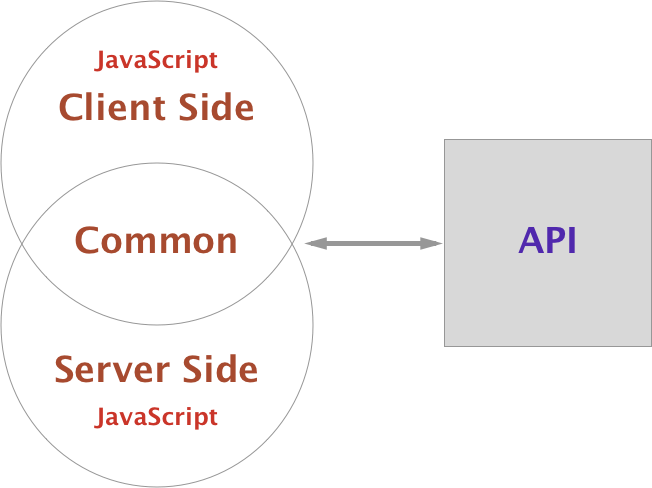

同构渲染的原理是相同的，弄清楚客户端和服务端能共用哪些以及不能共用哪些，针对不能共用的进行处理。共用的是渲染的页面组件，下面以React深入研究需要做处理的点。

### render
- 客户端部分不再需要`index.html`，node服务拦截请求，返回在服务端渲染好的html
- `ReactDOMServer`
  - `renderToString`，渲染组件为HTML字符串
  - `renderToStaticMarkup`，渲染组件为静态标记（static Markup），与`renderToString`的唯一区别是渲染时忽略所有React添加到DOM的HTML attributes（比如，key）
- `dangerouslySetInnerHTML` 避免被转义或造成XSS攻击
  - `__html`
- `ReactDOM`
  - `hydrate`，初次渲染时会复用已经存在的DOM节点，减少重新生成节点以及删除原本DOM节点的开销。
    `render` 和 `hydrate` 都会调用`legacyRenderSubtreeIntoContainer`（入参不同），`render`会触发`shouldHydrateDueToLegacyHeuristic`判断是否循环删除DOMContainer的子节点
- 客户端与服务端渲染的内容不一致时，客户端会重新渲染，右键查看源代码是服务端返回的html结构，页面显示的是客户端组件的内容
- `useEffect` 不会在服务端渲染时执行（原理探究）

### router
- `StaticRouter`（是无状态的）
  - `location`
  - `req.url`
  - `context`
- `BrowserRouter`
- 地址栏访问不同的路径服务端返回的内容是不同的，即当前路径对应的页面由服务端渲染
- 地址栏访问url或刷新 之外的导航（包括前进后退），都由客户端处理
- 重定向的处理
  - 如果仅仅使用`Redirect`，虽然也能正常渲染重定向后的页面，但是只有一次页面请求，查看页面的请求发现服务端返回的并不是重定向后的页面Html
  - 在`Redirect`的基础上，结合`StaticRouter`的`context`，使用node服务的`response`的`redirect`进行服务端重定向，此时会有两次页面请求，一次是302一次是200

### store
- 服务端`configureStore`并`Provider`组件，客户端也`configureStore`并`Provider`组件，共用初始`state`以及对应的`reducer`（而不是共用`store`实例）
- 初始`state`通过注入的script挂载到window上供客户端获取以共用
- 每个请求都创建一个`store`实例，避免状态越权及污染

### 初始数据/预取数据
- 由服务端请求数据，并将数据更新到对应的`store`的`state`，然后在被渲染的组件中使用，最终渲染成包含数据的html返回给客户端
- 避免导航到其他页面刷新丢失`store`数据，在初始页面的`useEffect`中判断如果`store`中没有相应的初始数据则客户端发起请求去获取数据并更新`store`的`state`（`createAsyncThunk`）
- 服务端不能使用`fetch API`

### bundle
- 服务端和客户端的打包配置处理，可以公用`babel-loader`对j(t)sx的编译以及`resolve`
- 客户端`webpack`配置不需要`HtmlWebpackPlugin`
- 配置服务端的`webpack`时，webpack5使用`externalsPresets:{ node:true }`
- 服务端注入初始html的js文件是客户端编译后的bundle
- 先打包客户端代码，再打包服务端代码，然后node执行服务端bundle