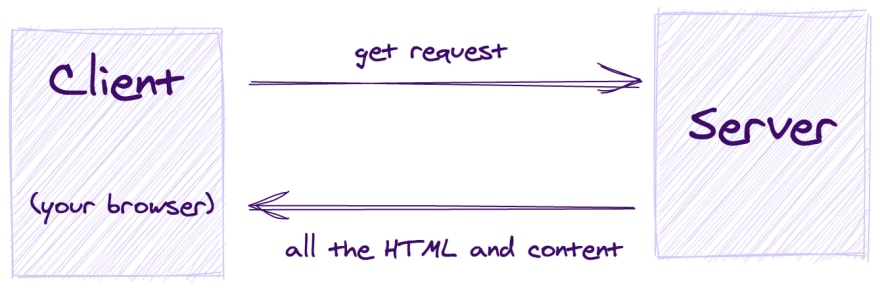
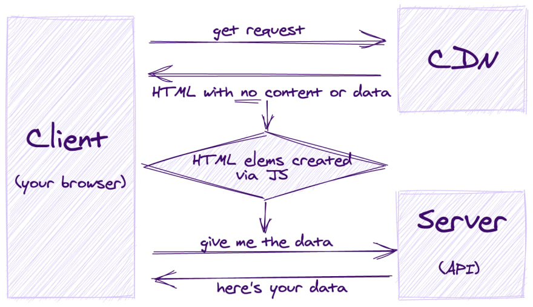
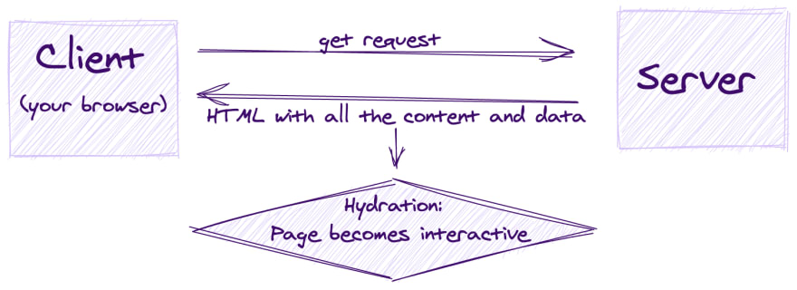

[mustache.js](https://github.com/janl/mustache.js)

在 Web 开发中，渲染是指将应用程序代码转换为交互式网页的过程。

- Server-side rendering，传统服务端渲染，其缺陷是导航到新页面或者页面数据有变动时，都会向服务器发出频繁的请求，并且从头开始渲染。
- isomorphic rendering 同构渲染，在客户端和服务器端处理相同的JavaScript代码。同构渲染的关键因素：1. 服务端运行时(runtime)，比如Node.js、Deno等；2. Virtual DOM

判断是不是SSR的两个方法：1. 右键查看源代码能看到页面所有内容 2.禁用JavaScript(在浏览器command面板中禁用)页面内容仍能显示

### SSR是如何工作的：
1. Client's HTTP request
客户端与服务器建立HTTP连接，向服务器发送对HTML文档的请求。

2. Data fetching
服务端从数据库或缓存或第三方API中获取需要的数据。

3. Server-side pre-rendering
服务端将JS组件编译成静态HTML。

4. Server's HTTP response
服务器将静态HTML文档发送给客户端。

5. Page load and rendering
客户端下载HTML文件并在页面上显示静态组件。

6. Hydration（“注水”）
客户端下载嵌入到HTML中的JS文件，解析JS代码，并将事件侦听器绑定到组件（HTML元素）上，使页面完全可交互。

### SSR解决了哪些问题：
- initial load time
CSR应用的第一个页面加载通常很慢，这是由于浏览器需要首先触发下载HTML和JavaScript的请求，然后解析JavaScript代码，由JS动态生成页面内容。因此，用户会在较长时间内看到空白屏幕或者loading。这会导致更差的用户体验和更高的跳出率。

- SEO/SMO
爬虫传统的工作方式：1）访问网站 2）读取服务器或CDN下发的HTML 3）保存。CSR请求的HTML是个空页面（页面中留出一个用于填充渲染内容的视图节点），爬虫爬取不到有意义的内容。
> 现在有些搜索引擎的爬虫也支持等待爬取JavaScript动态生成的内容。若对爬虫感兴趣，可以使用[Puppeteer](https://github.com/puppeteer/puppeteer)感受下。

对于SSR应用，浏览器触发请求后，得到的响应包含完整的HTML内容、JS代码及所需的数据，解决了以上两个问题。

### SSR与CSR的比较
更快地加载静态内容与更短的内容可见性和交互性之间的时间是服务器端和客户端渲染之间的权衡。

只有在下载和解析JS后，才能触发额外的请求去获取所需的数据

响应包含JS文件、HTML内容，以及所需的数据

### 理论上SSR的优缺点
> 实际取决于应用程序结构、页面权重、用户交互频率等

优点:
- 更好的SEO（Search Engine Optimization）效果
- 更快的初始页面加载
- 更快的最大内容绘制（LCP）
- 较低的累积布局偏移（CLS）
- 社交媒体支持效果更好。有些社交产品不支持爬取客户端渲染的应用。
- 更好地可访问性。弱网、老旧设备

缺点:
- 增加了复杂性（复杂的架构,开发层面等）
- 可能造成更高的首次输入延迟（FID）
- 难以缓存
- 可能存在第三方库和工具的兼容问题
- 更高的运行成本（服务器成本、运维成本）
- 潜在的HTML膨胀问题