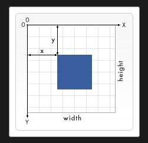

可缩放矢量图形（Scalable Vector Graphics，SVG）基于 XML 标记语言，用于描述二维的矢量图形。

本质上，SVG 相对于图像，就好比 HTML 相对于文本。

和传统的点阵图像模式（如 JPEG 和 PNG）不同的是，SVG 格式提供的是矢量图，这意味着它的图像能够被无限放大而不失真或降低质量，并且可以方便地修改内容，无需图形编辑器。

不同的浏览器支持 SVG 标准的程度不同，很可能你制作了一个 SVG 图形，并且用一个工具调试正常后，却在另外一个浏览器中无法正常显示。

一个简单的 SVG 文档由 `<svg>` 根元素和基本的形状元素构成。另外还有一个g元素，它用来把若干个基本形状编成一个组。
```xml
<svg
  version="1.1"
  baseProfile="full"
  width="300" height="200"
  xmlns="http://www.w3.org/2000/svg"
>
  <rect width="100%" height="100%" fill="red" />
  <circle cx="150" cy="100" r="80" fill="green" />
  <text x="150" y="125" font-size="60" text-anchor="middle" fill="white">SVG</text>
</svg>
```
<svg
  version="1.1"
  baseProfile="full"
  width="300" height="200"
  xmlns="http://www.w3.org/2000/svg"
>
  <rect width="100%" height="100%" fill="red" />
  <circle cx="150" cy="100" r="80" fill="green" />
  <text x="150" y="125" font-size="60" text-anchor="middle" fill="white">SVG</text>
</svg>

## 坐标
以页面的左上角为 (0,0) 坐标点，坐标以像素为单位，x 轴正方向是向右，y 轴正方向是向下。



:::tip
像素：

基本上，在 SVG 文档中的 1 个像素对应输出设备（比如显示屏）上的 1 个像素。但是这种情况是可以改变的，否则 SVG 的名字里也不至于会有“Scalable”（可缩放）这个词。如同 CSS 可以定义字体的绝对大小和相对大小，SVG 也可以定义绝对大小（比如使用“pt”或“cm”标识维度）同时 SVG 也能使用相对大小，**只需给出数字，不标明单位，输出时就会采用用户的单位**。
:::

## `<svg>`属性
### `version` 和 `baseProfile`
SVG 2 之前 `version` 属性和 `baseProfile` 属性用来供其他类型的验证识别 SVG 的版本。SVG 2 已弃用 `version` 和 `baseProfile` 这两个属性。

### `xmlns`
用于绑定命名空间

### `width`和`height` 
指定了 SVG 图像在 HTML 元素中所占据的宽度和高度。如果不指定这两个属性，SVG 图像默认大小是`300宽*150高`。

指定宽高，则内部元素宽高超出svg画布宽高的部分不可见：
```xml
<svg width="100" height="100" style={{background: "green"}} id="both-width-height">
  <rect x="0" y="0" width="150" height="100" fill="orange" />
</svg>
```
<svg width="100" height="100" style={{background: "green"}} id="both-width-height">
  <rect x="0" y="0" width="150" height="100" fill="orange" />
</svg>

只指定高，则svg画布宽度默认为300：
```xml
<svg height="100" style={{background: "green"}} id="only-height">
  <rect x="0" y="0" width="50" height="100" fill="orange" />
</svg>
```
<svg height="100" style={{background: "green"}} id="only-height">
  <rect x="0" y="0" width="50" height="100" fill="orange" />
</svg>

只指定宽，则svg画布高度默认为150：
```xml
<svg width="100" style={{background: "green"}} id="only-width">
  <rect x="0" y="0" width="150" height="100" fill="orange" />
</svg>
```
<svg width="100" style={{background: "green"}} id="only-width">
  <rect x="0" y="0" width="150" height="100" fill="orange" />
</svg>

### `viewBox`
`viewBox` 属性定义了画布上可以显示的区域，属性的值有四个数字，分别是左上角的横坐标和纵坐标、视口的宽度和高度。

例1，不设置`viewBox`:
```xml
<svg width="100" height="100">
  <rect x="0" y="0" width="100" height="100" fill="orange" />
  <rect x="0" y="0" width="50" height="50" fill="red" />
  <text x="10" y="20" font-size="16" fill="white">SVG</text>
</svg>
```
<svg width="100" height="100">
  <rect x="0" y="0" width="100" height="100" fill="orange" />
  <rect x="0" y="0" width="50" height="50" fill="red" />
  <text x="10" y="20" font-size="16" fill="white">SVG</text>
</svg>

例2，设置`viewBox`的宽高小于svg画布宽高，如下，这里定义的画布尺寸是 `100*100`。但是，`viewBox` 属性定义了画布上可以显示的区域：从 `(0,0)` 点开始，`50 宽*50 高`的区域。这个 `50*50` 的区域，会放到 `100*100` 的画布上显示。于是就形成了放大两倍的效果。
```xml
<svg width="100" height="100" viewBox="0 0 50 50">
  <rect x="0" y="0" width="100" height="100" fill="orange" />
  <rect x="0" y="0" width="50" height="50" fill="red" />
  <text x="10" y="20" font-size="16" fill="white">SVG</text>
</svg>
```
<svg width="100" height="100" viewBox="0 0 50 50">
  <rect x="0" y="0" width="100" height="100" fill="orange" />
  <rect x="0" y="0" width="50" height="50" fill="red" />
  <text x="10" y="20" font-size="16" fill="white">SVG</text>
</svg>

例3，设置`viewBox`的宽高大于svg画布宽高，实现缩小的效果。
```xml
<svg width="100" height="100" viewBox="0 0 150 150">
  <rect x="0" y="0" width="150" height="150" fill="green" />
  <rect x="0" y="0" width="100" height="100" fill="orange" />
  <rect x="0" y="0" width="50" height="50" fill="red" />
  <text x="10" y="20" font-size="16" fill="white">SVG</text>
</svg>
```
<svg width="100" height="100" viewBox="0 0 150 150">
  <rect x="0" y="0" width="150" height="150" fill="green" />
  <rect x="0" y="0" width="100" height="100" fill="orange" />
  <rect x="0" y="0" width="50" height="50" fill="red" />
  <text x="10" y="20" font-size="16" fill="white">SVG</text>
</svg>

#### SVG 作为 `<div>` 的子元素的情况
- svg的宽高超出div的宽高时，超出部分被隐藏，不占用空间

- svg的宽高跟根据div的宽高以及svg的`viewBox`属性进行计算。
  - 不设置`viewBox`时，svg的宽高默认为300*150(指定svg的宽高时则为指定的值)，不会自适应div的宽高，此时svg的内部元素不缩放，比如`<rect>`的宽高仍为指定其的宽高；
  
  - 设置`viewBox`时，默认svg的宽会自适应为div的宽，`svg的高=div的宽*(viewBox高/viewBox宽)`，此时svg的内部元素会缩放，比如`<rect>`的宽高为`指定值*(div的宽/viewBox宽)`；
  
  - 设置`viewBox`时，指定svg的宽高时则宽高为指定的值，此时svg的内部元素会缩放，比如`<rect>`的宽高为`指定值*(指定svg的宽/viewBox宽)`；
  
  - 设置`viewBox`时，如果只指定了svg的高，则svg的高为指定的值，`svg的宽=指定的高*(viewBox宽/viewBox高)`，此时svg的内部元素会缩放，比如`<rect>`的宽高为`指定值*(指定svg的高/viewBox高)`；
  
  - 设置`viewBox`时，如果只指定了svg的宽，则svg的宽为指定的值，`svg的高=指定的宽*(viewBox高/viewBox宽)`，此时svg的内部元素会缩放，比如`<rect>`的宽高为`指定值*(指定svg的宽/viewBox宽)`；
  
  例1，不指定svg的宽高，且不设置`viewBox`属性：
  ```html
  <div style={{width:'110px', height:'100px', backgroundColor:'#abcdef'}}>
    <!-- svg的宽为300 高为150 -->
    <svg>
      <!-- rect的宽为8 高为8 -->
      <rect x="20" y="16" width="8" height="8" fill="red" />
      <rect x="40" y="26" width="8" height="8" fill="red" />
    </svg>
  </div>
  ```
  <div style={{width:'110px', height:'100px', backgroundColor:'#abcdef'}}>
    <svg>
      <rect x="20" y="16" width="8" height="8" fill="red" />
      <rect x="40" y="26" width="8" height="8" fill="red" />
    </svg>
  </div>

  例2，指定svg的宽高，且不设置`viewBox`属性：
  ```html
  <div style={{width:'110px', height:'100px', backgroundColor:'#abcdef'}}>
    <!-- svg的宽为50 高为40 -->
    <svg width="50" height="40">
      <!-- rect的宽为8 高为8 -->
      <rect x="20" y="16" width="8" height="8" fill="red" />
      <rect x="40" y="26" width="8" height="8" fill="red" />
    </svg>
  </div>
  ```
  <div style={{width:'110px', height:'100px', backgroundColor:'#abcdef'}}>
    <svg width="50" height="40">
      <rect x="20" y="16" width="8" height="8" fill="red" />
      <rect x="40" y="26" width="8" height="8" fill="red" />
    </svg>
  </div>

  例3，不指定svg的宽高，设置`viewBox`属性：
  ```html
  <div style={{width:'110px', height:'100px', backgroundColor:'#abcdef'}}>
    <!-- svg的宽为110 高为110*(100/100) -->
    <svg viewBox="0 0 100 100">
      <!-- rect的宽为8.8 高为8.8（8*(110/100)） -->
      <rect x="20" y="16" width="8" height="8" fill="red" />
      <rect x="40" y="26" width="8" height="8" fill="red" />
    </svg>
  </div>
  ```
  <div style={{width:'110px', height:'100px', backgroundColor:'#abcdef'}}>
    <svg viewBox="0 0 100 100">
      <rect x="20" y="16" width="8" height="8" fill="red" />
      <rect x="40" y="26" width="8" height="8" fill="red" />
    </svg>
  </div>

  例3-1:
  ```html
  <div style={{width:'110px', height:'100px', backgroundColor:'#abcdef'}}>
    <!-- svg的宽为110 高为110*(40/100) -->
    <svg viewBox="0 0 100 40">
      <!-- rect的宽为6.6 高为6.6（6*(110/100)） -->
      <rect x="20" y="16" width="6" height="6" fill="red" />
      <rect x="40" y="26" width="6" height="6" fill="red" />
    </svg>
  </div>
  ```
  <div style={{width:'110px', height:'100px', backgroundColor:'#abcdef'}}>
    <svg viewBox="0 0 100 40">
      <rect x="20" y="16" width="6" height="6" fill="red" />
      <rect x="40" y="26" width="6" height="6" fill="red" />
    </svg>
  </div>

  例3-2:
  ```html
  <div style={{width:'20px', height:'13px', backgroundColor:'#abcdef'}}>
    <!-- svg的宽为20 高为20*(50/100) -->
    <svg viewBox="0 0 100 50">
      <!-- rect的宽为1.2 高为1.2（6*(20/100)） -->
      <rect x="20" y="16" width="6" height="6" fill="red" />
      <rect x="40" y="26" width="6" height="6" fill="red" />
    </svg>
  </div>
  ```
  <div style={{width:'20px', height:'13px', backgroundColor:'#abcdef'}}>
    <svg viewBox="0 0 100 50">
      <rect x="20" y="16" width="6" height="6" fill="red" />
      <rect x="40" y="26" width="6" height="6" fill="red" />
    </svg>
  </div>

  例3-3:
  ```html
  <div style={{width:'20px', height:'13px', backgroundColor:'#abcdef'}}>
    <!-- svg的宽为20 高为20*(50/100) -->
    <svg viewBox="0 0 100 50">
      <!-- rect的宽为1.2（6*(20/100)） 高为1.6（8*(20/100)） -->
      <rect x="20" y="16" width="6" height="8" fill="red" />
      <rect x="40" y="26" width="6" height="8" fill="red" />
    </svg>
  </div>
  ```
  <div style={{width:'20px', height:'13px', backgroundColor:'#abcdef'}}>
    <svg viewBox="0 0 100 50">
      <rect x="20" y="16" width="6" height="8" fill="red" />
      <rect x="40" y="26" width="6" height="8" fill="red" />
    </svg>
  </div>

  例4，指定svg的宽高，设置`viewBox`属性：
  ```html
  <div style={{width:'20px', height:'13px', backgroundColor:'#abcdef'}}>
    <!-- svg的宽为50 高为40 -->
    <svg width="50" height="40" viewBox="0 0 100 50">
      <!-- rect的宽为3 高为3（6*(50/100)） -->
      <rect x="20" y="16" width="6" height="6" fill="red" />
      <rect x="40" y="26" width="6" height="6" fill="red" />
    </svg>
  </div>
  ```
  <div style={{width:'20px', height:'13px', backgroundColor:'#abcdef'}}>
    <svg width="50" height="40" viewBox="0 0 100 50">
      <rect x="20" y="16" width="6" height="6" fill="red" />
      <rect x="40" y="26" width="6" height="6" fill="red" />
    </svg>
  </div>

  例5，只指定svg的高，设置`viewBox`属性：
  ```html
  <div style={{width:'20px', height:'13px', backgroundColor:'#abcdef'}}>
    <!-- svg的宽为40*(100/50) 高为40 -->
    <svg height="40" viewBox="0 0 100 50">
      <!-- rect的宽为4.8 高为4.8（6*(40/50)） -->
      <rect x="20" y="16" width="6" height="6" fill="red" />
      <rect x="40" y="26" width="6" height="6" fill="red" />
    </svg>
  </div>
  ```
  <div style={{width:'20px', height:'13px', backgroundColor:'#abcdef'}}>
    <svg height="40" viewBox="0 0 100 50">
      <rect x="20" y="16" width="6" height="6" fill="red" />
      <rect x="40" y="26" width="6" height="6" fill="red" />
    </svg>
  </div>

  例5-1:
  ```html
  <div style={{width:'100px'}}>
    <!-- svg的宽为40=16*(100/40) 高为16 -->
    <svg height="16" viewBox="0 0 100 40" style={{backgroundColor: 'green'}}>
      <rect x="20" y="8" width="8" height="8" fill="red" />
    </svg>
  </div>
  ```
  <div style={{width:'100px'}}>
    <svg height="16" viewBox="0 0 100 40" style={{backgroundColor: 'green'}}>
      <rect x="20" y="8" width="8" height="8" fill="red" />
    </svg>
  </div>

  例6，只指定svg的宽，设置`viewBox`属性：
  ```html
  <div style={{width:'20px', height:'13px', backgroundColor:'#abcdef'}}>
    <!-- svg的宽为60 高为60*(50/100) -->
    <svg width="60" viewBox="0 0 100 50">
      <!-- rect的宽为3.6 高为3.6（6*(60/100)） -->
      <rect x="20" y="16" width="6" height="6" fill="red" />
      <rect x="40" y="26" width="6" height="6" fill="red" />
    </svg>
  </div>
  ```
  <div style={{width:'20px', height:'13px', backgroundColor:'#abcdef'}}>
    <svg width="60" viewBox="0 0 100 50">
      <rect x="20" y="16" width="6" height="6" fill="red" />
      <rect x="40" y="26" width="6" height="6" fill="red" />
    </svg>
  </div>


### `transform`
`transform` 属性定义应用于元素及其子元素的变换规则列表。可以在任何 SVG 元素上使用此属性。属性值可以是：
- `translate(<x> [<y>])` 变换函数: 将对象移动 `x` 和 `y`。如果没有提供 `y`，那么其默认为 0。

  ```xml
  <svg width="100" height="100" viewBox="0 0 100 100" xmlns="http://www.w3.org/2000/svg">
    <!-- 未经平移 -->
    <rect x="5" y="5" width="40" height="40" fill="green" />

    <!-- 水平平移 -->
    <rect x="5" y="5" width="40" height="40" fill="blue" transform="translate(50)" />

    <!-- 垂直平移 -->
    <rect x="5" y="5" width="40" height="40" fill="red" transform="translate(0 50)" />

    <!-- 水平和垂直平移 -->
    <rect x="5" y="5" width="40" height="40" fill="yellow" transform="translate(50 50)" />
  </svg>
  ```
  <svg width="100" height="100" viewBox="0 0 100 100" xmlns="http://www.w3.org/2000/svg">
    <rect x="5" y="5" width="40" height="40" fill="green" />

    <rect x="5" y="5" width="40" height="40" fill="blue" transform="translate(50)" />

    <rect x="5" y="5" width="40" height="40" fill="red" transform="translate(0 50)" />

    <rect x="5" y="5" width="40" height="40" fill="yellow" transform="translate(50 50)" />
  </svg>

- `scale(<x> [<y>])` 变换函数: 指定一个按 `x` 和 `y` 进行缩放的操作。如果没有提供 `y`，那么假定其等同于 `x`。

  ```xml
  <svg width="100" height="100" viewBox="-50 -50 100 100" xmlns="http://www.w3.org/2000/svg">
    <!-- 等比缩放 -->
    <circle cx="0" cy="0" r="10" fill="red" transform="scale(4)" />

    <!-- 垂直缩放 -->
    <circle cx="0" cy="0" r="10" fill="yellow" transform="scale(1, 4)" />

    <!-- 水平缩放 -->
    <circle cx="0" cy="0" r="10" fill="pink" transform="scale(4, 1)" />

    <!-- 无缩放 -->
    <circle cx="0" cy="0" r="10" fill="black" />
  </svg>
  ```
  <svg width="100" height="100" viewBox="-50 -50 100 100" xmlns="http://www.w3.org/2000/svg">
    <circle cx="0" cy="0" r="10" fill="red" transform="scale(4)" />

    <circle cx="0" cy="0" r="10" fill="yellow" transform="scale(1, 4)" />

    <circle cx="0" cy="0" r="10" fill="pink" transform="scale(4, 1)" />

    <circle cx="0" cy="0" r="10" fill="black" />
  </svg>

- `rotate(<a> [<x> <y>])` 变换函数: 指定一个围绕给定点旋转 `a` 度的操作。如果没有提供可选参数 `x` 和 `y`，那么默认绕当前用户坐标系的原点旋转。否则，就以 `(x,y)` 为原点进行旋转。
  
  ```xml
  <svg width="100" height="100" viewBox="-12 -2 34 14" xmlns="http://www.w3.org/2000/svg">
    <rect x="0" y="0" width="10" height="10" />

    <!-- 绕 0,0 点旋转 -->
    <rect x="0" y="0" width="10" height="10" fill="red" transform="rotate(100)" />

    <!-- 绕 10,10 点旋转 -->
    <rect x="0" y="0" width="10" height="10" fill="green" transform="rotate(100, 10, 10)" />
  </svg>
  ```
  <svg width="100" height="100" viewBox="-12 -2 34 14" xmlns="http://www.w3.org/2000/svg">
    <rect x="0" y="0" width="10" height="10" />

    <rect x="0" y="0" width="10" height="10" fill="red" transform="rotate(100)" />

    <rect x="0" y="0" width="10" height="10" fill="green" transform="rotate(100, 10, 10)" />
  </svg>

- `skewX(<a>)` 变换函数: 指定沿 `x` 轴倾斜 `a` 度的倾斜变换。
  
  ```xml
  <svg width="100" height="100" viewBox="-5 -5 10 10" xmlns="http://www.w3.org/2000/svg">
    <rect x="-3" y="-3" width="6" height="6" />

    <rect x="-3" y="-3" width="6" height="6" fill="red" transform="skewX(30)" />
  </svg>
  ```
  <svg width="100" height="100" viewBox="-5 -5 10 10" xmlns="http://www.w3.org/2000/svg">
    <rect x="-3" y="-3" width="6" height="6" />

    <rect x="-3" y="-3" width="6" height="6" fill="red" transform="skewX(30)" />
  </svg>

- `skewY(<a>)` 变换函数: 指定了沿 `y` 轴倾斜 `a` 度的倾斜变换。
  
  ```xml
  <svg width="100" height="100" viewBox="-5 -5 10 10" xmlns="http://www.w3.org/2000/svg">
    <rect x="-3" y="-3" width="6" height="6" />

    <rect x="-3" y="-3" width="6" height="6" fill="red" transform="skewY(30)" />
  </svg>
  ```
  <svg width="100" height="100" viewBox="-5 -5 10 10" xmlns="http://www.w3.org/2000/svg">
    <rect x="-3" y="-3" width="6" height="6" />

    <rect x="-3" y="-3" width="6" height="6" fill="red" transform="skewY(30)" />
  </svg>

[理解SVG transform坐标变换](https://www.zhangxinxu.com/wordpress/2015/10/understand-svg-transform/)

## 基本形状
```xml
<svg width="200" height="250">
  <rect x="10" y="10" width="30" height="30" stroke="black" fill="transparent" stroke-width="5"/>
  <rect x="60" y="10" width="30" height="30" stroke="black" fill="transparent" stroke-width="5"
    rx="10" ry="10" />

  <circle cx="25" cy="75" r="20" stroke="red" fill="transparent" stroke-width="5"/>
  <ellipse cx="75" cy="75" rx="20" ry="5" stroke="red" fill="transparent" stroke-width="5"/>

  <line x1="10" x2="50" y1="110" y2="150" stroke="orange" stroke-width="5"/>
  <polyline
    points="60 110 65 120 70 115 75 130 80 125 85 140 90 135 95 150 100 145"
    stroke="orange"
    fill="transparent"
    stroke-width="5"
  />

  <polygon
    points="50 160 55 180 70 180 60 190 65 205 50 195 35 205 40 190 30 180 45 180"
    stroke="green"
    fill="transparent"
    stroke-width="5"
  />

  <path d="M20,230 Q40,205 50,230 T90,230" fill="none" stroke="blue" stroke-width="5"/>
</svg>
```
<svg width="200" height="250">
  <rect x="10" y="10" width="30" height="30" stroke="black" fill="transparent" stroke-width="5"/>
  <rect x="60" y="10" rx="10" ry="10" width="30" height="30" stroke="black" fill="transparent" stroke-width="5"/>

  <circle cx="25" cy="75" r="20" stroke="red" fill="transparent" stroke-width="5"/>
  <ellipse cx="75" cy="75" rx="20" ry="5" stroke="red" fill="transparent" stroke-width="5"/>

  <line x1="10" x2="50" y1="110" y2="150" stroke="orange" stroke-width="5"/>
  <polyline
    points="60 110 65 120 70 115 75 130 80 125 85 140 90 135 95 150 100 145"
    stroke="orange"
    fill="transparent"
    stroke-width="5"
  />

  <polygon
    points="50 160 55 180 70 180 60 190 65 205 50 195 35 205 40 190 30 180 45 180"
    stroke="green"
    fill="transparent"
    stroke-width="5"
  />

  <path d="M20,230 Q40,205 50,230 T90,230" fill="none" stroke="blue" stroke-width="5"/>
</svg>

### 矩形`<rect>`
`rx` 和 `ry` 属性用来控制圆角。如果没有设置圆角，则默认为 0。
- `x` 矩形左上角的 x 位置
- `y` 矩形左上角的 y 位置
- `width` 矩形的宽度
- `height` 矩形的高度
- `rx` 圆角的 x 方位的半径
- `ry` 圆角的 y 方位的半径

### 圆形`<circle>`
- `r` 圆的半径
- `cx` 圆心的 x 位置
- `cy` 圆心的 y 位置

### 椭圆`<ellipse>`
- `rx` 椭圆的 x 半径
- `ry` 椭圆的 y 半径
- `cx` 椭圆中心的 x 位置
- `cy` 椭圆中心的 y 位置

### 线条`<line>`
- `x1` 起点的 x 位置
- `y1` 起点的 y 位置
- `x2` 终点的 x 位置
- `y2` 终点的 y 位置

### 折线`<polyline>`
折线的的所有点位置都放在一个 points 属性中。
- `points` 点集数列。每个数字用空格、逗号、终止命令符或者换行符分隔开。每个点必须包含 2 个数字，一个是 x 坐标，一个是 y 坐标。所以点列表 `(0,0), (1,1) 和 (2,2)` 可以写成这样：`"0 0, 1 1, 2 2"`。

### 多边形`<polygon>`
多边形和折线很像，它们都是由连接一组点集的直线构成。不同的是，`polygon`的路径在最后一个点处自动回到第一个点。需要注意的是，矩形也是一种多边形，如果需要更多灵活性的话，你也可以用`polygon`创建一个矩形。
- `points` 点集数列。每个数字用空格、逗号、终止命令或者换行符分隔开。每个点必须包含 2 个数字，一个是 x 坐标，一个是 y 坐标。所以点列表 `(0,0), (1,1) 和 (2,2)` 可以写成这样：`"0 0, 1 1, 2 2"`。路径绘制完后闭合图形，所以最终的直线将从位置 `(2,2)` 连接到位置 `(0,0)`。

### 路径`<path>`
可以用 `path` 元素绘制矩形（直角矩形或者圆角矩形）、圆形、椭圆、折线形、多边形，以及一些其他的形状，例如贝塞尔曲线、2次曲线等曲线。
- `d` 一个点集数列以及其他关于如何绘制路径的信息。属性d的值是一个“命令 + 参数”的序列。

`path` 只需要设定很少的点，就可以创建平滑流畅的线条（比如曲线）。虽然`polyline`元素也能实现类似的效果，但是必须设置大量的点（点越密集，越接近连续，看起来越平滑流畅），并且这种做法不能够放大（放大后，点的离散更明显）。

每一个命令都用一个关键字母来表示，比如，字母“M”表示的是“Move to”命令，当解析器读到这个命令时，它就知道你是打算移动到某个点。跟在命令字母后面的，是你需要移动到的那个点的 x 和 y 轴坐标。比如移动到 (10,10) 这个点的命令，应该写成“M 10 10”。这一段字符结束后，解析器就会去读下一段命令。

每一个命令都有两种表示方式，一种是用大写字母，表示采用绝对定位。另一种是用小写字母，表示采用相对定位（例如：从上一个点开始，向上移动 10px，向左移动 7px）。

#### 直线命令
有 5 个画直线的命令

##### M(m)
“Move to”命令。它需要两个参数，分别是需要移动到的点的 x 轴和 y 轴的坐标。假设你的画笔当前位于一个点，在使用 M 命令移动画笔后，只会移动画笔，但不会在两点之间画线。所以 M 命令经常出现在路径的开始处，用来指明从何处开始画。

##### L(l)
“Line to”命令。需要两个参数，分别是一个点的 x 轴和 y 轴坐标，L 命令将会在当前位置和新位置（L 前面画笔所在的点）之间画一条线段。

##### H(h)
绘制水平线。该命令只带一个参数，标明在 x 轴移动到的位置。

##### V(v)
绘制垂直线。该命令只带一个参数，标明在 y 轴移动到的位置。

##### Z
闭合路径命令，不用区分大小写。

例1:
```xml
<svg width="100" height="100">
  <path d="M 10 10 H 90 V 90 H 10 L 10 10" fill="transparent" stroke="black" />
</svg>
```
<svg width="100" height="100">
  <path d="M 10 10 H 90 V 90 H 10 L 10 10" fill="transparent" stroke="black" />
</svg>

上述例子可以使用Z命令简化为：
```xml
<svg width="100" height="100">
  <path d="M10 10 H90 V90 H10 Z" fill="transparent" stroke="black" />
</svg>
```
<svg width="100" height="100">
  <path d="M10 10 H90 V90 H10 Z" fill="transparent" stroke="black" />
</svg>

例2(使用相对路径实现例1):
```xml
<svg width="100" height="100">
  <path d="M 10 10 h 80 v 80 h -80 Z" fill="transparent" stroke="black" />
</svg>
<!-- 画笔移动到 (10,10) 点，由此开始，向右移动 80像素，然后向下移动 80像素，然后向左移动 80像素，然后再回到起点。 -->
```
<svg width="100" height="100">
  <path d="M 10 10 h 80 v 80 h -80 Z" fill="transparent" stroke="black" />
</svg>

#### 曲线命令
绘制平滑曲线的命令用来绘制贝塞尔曲线，以及用来绘制弧形或者说是圆的一部分。
- C命令和S命令 用来绘制三次贝塞尔曲线
- Q命令和T命令 用来绘制二次贝塞尔曲线
- A命令 用来绘制弧形

##### C(c)
用 C 命令创建三次贝塞尔曲线，需要设置三组坐标参数: `C x1 y1, x2 y2, x y`。最后一个坐标 `(x,y)` 表示的是曲线的终点，另外两个坐标是控制点，`(x1,y1)` 是起点的控制点，`(x2,y2)` 是终点的控制点。

##### S(s)
S 命令可以用来创建与前面一样的贝塞尔曲线，但是，如果 S 命令跟在一个 C 或 S 命令后面，则它的第一个控制点会被假设成前一个命令曲线的第二个控制点的中心对称点。如果 S 命令单独使用，前面没有 C 或 S 命令，那当前点将作为第一个控制点。`S x2 y2, x y`

##### Q(q)
另一种可用的贝塞尔曲线是二次贝塞尔曲线 Q，它比三次贝塞尔曲线简单，只需要一个控制点，用来确定起点和终点的曲线斜率。因此它需要两组参数，控制点和终点坐标。`Q x1 y1, x y`

##### T(t)
就像三次贝塞尔曲线有一个 S 命令，二次贝塞尔曲线有一个差不多的 T 命令，可以通过更简短的参数，延长二次贝塞尔曲线。`T x y`

##### A(a)
仅仅根据半径和两点，可以画出四种弧形。为了保证创建的弧形唯一，A 命令需要用到比较多的参数：`A rx ry x-axis-rotation large-arc-flag sweep-flag x y`
- `rx` x轴半径
- `ry` y轴半径
- `x-axis-rotation` 表示弧形的旋转情况
- `large-arc-flag`（角度大小）决定弧线是大于还是小于 180 度，0 表示小角度弧，1 表示大角度弧。
- `sweep-flag`（弧线方向）表示弧线的方向，0 表示从起点到终点沿逆时针画弧，1 表示从起点到终点沿顺时针画弧。
- `x` `y` 指定弧形的终点


```xml
<svg width="325" height="325" xmlns="http://www.w3.org/2000/svg">
  <rect width="325" height="325" fill="#F6F8FA" />
  <path d="M 80 80
           A 45 45, 0, 0, 0, 125 125
           L 125 80 Z" fill="green"/>
  <path d="M 230 80
           A 45 45, 0, 1, 0, 275 125
           L 275 80 Z" fill="red"/>
  <path d="M 80 230
           A 45 45, 0, 0, 1, 125 275
           L 125 230 Z" fill="purple"/>
  <path d="M 230 230
           A 45 45, 0, 1, 1, 275 275
           L 275 230 Z" fill="blue"/>
</svg>
```
<svg width="325" height="325" xmlns="http://www.w3.org/2000/svg">
  <rect width="325" height="325" fill="#F6F8FA" />
  <path d="M 80 80
           A 45 45, 0, 0, 0, 125 125
           L 125 80 Z" fill="green"/>
  <path d="M 230 80
           A 45 45, 0, 1, 0, 275 125
           L 275 80 Z" fill="red"/>
  <path d="M 80 230
           A 45 45, 0, 0, 1, 125 275
           L 125 230 Z" fill="purple"/>
  <path d="M 230 230
           A 45 45, 0, 1, 1, 275 275
           L 275 230 Z" fill="blue"/>
</svg>

:::info
[svg用path画圆](https://www.cnblogs.com/LcxSummer/p/12420385.html)
<svg width="100" height="100">
  <path d="M 30,50 a 10 30 90 1 1 0 1 z" fill="none" stroke="black" stroke-width="5" id="circle" />
</svg>
:::

## 形状元素的属性

### `fill`
对于形状元素和文本，`fill`属性是外观属性，用来定义给定图形元素内部的颜色。哪一块算是“内部”取决于形状本身以及`fill-rule` 属性的值。作为一个外观属性，它可以直接用作 CSS 样式表内部的属性。属性值可以是：
- `currentColor`：使用当前元素的color值

默认地，当动画元素结束时，目标元素的外观属性不再应用该效果。在动画元素结束后，要还保持这个动画的的值，就需要用到`fill`属性。

### `fill-opacity`
控制填充色的不透明度

### `fill-rule`
用来确定一个多边形的内部区域（即可以被填充的区域）。如何判断一个路径组成的多边形的内部区域，从而给它上色，对于一个简单的、没有交错的路径来说，是很显然的；然而，对于一个更为复杂的路径，比如一条与自身相交的路径，或者是这条路径上的其中一段将另一段包围着，要解释什么是“内部”，就不再这么显然了。属性值可以是：
- `evenodd` 这个值用确定了某点属于该形状的“内部”还是“外部”：从该点向任意方向无限远处绘制射线，并统计这个形状所有的路径段中，与射线相交的路径段的数量。如果有奇数个路径段与射线相交，则点在内部；如果有偶数个，则点在外部。
  ```xml
  <svg wdith="200" height="200" viewBox="-10 -10 320 120" xmlns="http://www.w3.org/2000/svg">
    <!-- evenodd 填充规则被用于路径段会相交的形状上的效果 -->
    <polygon
      fill-rule="evenodd"
      stroke="red"
      points="50,0 21,90 98,35 2,35 79,90" />

    <!--
    evenodd 填充规则被用于一个形状在另一形状内部的效果
    这两个正方形的路径段方向相同（都是顺时针）
    -->
    <path
      fill-rule="evenodd"
      stroke="red"
      d="M110,0  h90 v90 h-90 z
             M130,20 h50 v50 h-50 z" />

    <!--
    这个例子与第二个例子几乎相同，唯一的区别是：两个形状的路径段方向相反
    外面的正方形是顺时针，里面的正方形则是逆时针
    -->
    <path
      fill-rule="evenodd"
      stroke="red"
      d="M210,0  h90 v90 h-90 z
             M230,20 v50 h50 v-50 z" />
  </svg>
  ```
  <svg wdith="200" height="200" viewBox="-10 -10 320 120" xmlns="http://www.w3.org/2000/svg">
    <polygon
      fill-rule="evenodd"
      stroke="red"
      points="50,0 21,90 98,35 2,35 79,90" />

    <path
      fill-rule="evenodd"
      stroke="red"
      d="M110,0  h90 v90 h-90 z
             M130,20 h50 v50 h-50 z" />

    <path
      fill-rule="evenodd"
      stroke="red"
      d="M210,0  h90 v90 h-90 z
             M230,20 v50 h50 v-50 z" />
  </svg>

- `nonzero`

### `stroke`
设置绘制对象的线条的颜色

### `stroke-opacity`
控制描边的不透明度

### `stroke-width`
定义了描边的宽度。注意，描边是以路径为中心线绘制的。

### `stroke-linecap`
用来定义线帽，也就是线条两端的形状。`stroke-linecap`属性的值有三种可能值：
- `butt` 用直边结束线条，线条边界 90 度垂直于描边的方向、贯穿它的终点。
- `round` 表示边框的终点是圆角，圆角的半径是由`stroke-width`控制的。
- `square` 的效果与`butt`差不多，但是会稍微超出实际路径的范围，超出的大小由`stroke-width`控制。


```xml
<svg width="200" height="100">
  <rect width="200" height="100" fill="orange" />
  <line x1="10" x2="80" y1="10" y2="10" stroke-linecap='butt' stroke="green" stroke-width="20" />
  <!-- 可以看到stroke-linecap为'square'或'round'时，线条比正常的长，长出来的两头极为线帽 -->
  <line x1="10" x2="80" y1="40" y2="40" stroke-linecap='square' stroke="green" stroke-width="20" />
  <line x1="10" x2="80" y1="70" y2="70" stroke-linecap='round' stroke="green" stroke-width="20" />
  <path d="M10 10 L80 10 M10 40 L80 40 M10 70 L80 70" stroke="white" />
  <!-- 圆圈加线帽为的是让圆圈完全闭合 -->
  <circle r="40" cx="150" cy="50" fill="green" stroke="white" stroke-width="10" stroke-linecap='square' />
  <path d="M110 50 a40 40, 0, 1, 1, 0 1 Z" stroke-width="2" stroke="black" fill="none" />
</svg>
```
<svg width="200" height="100">
  <rect width="200" height="100" fill="orange" />
  <line x1="10" x2="80" y1="10" y2="10" stroke-linecap='butt' stroke="green" stroke-width="20" />
  <line x1="10" x2="80" y1="40" y2="40" stroke-linecap='square' stroke="green" stroke-width="20" />
  <line x1="10" x2="80" y1="70" y2="70" stroke-linecap='round' stroke="green" stroke-width="20" />
  <path d="M10 10 L80 10 M10 40 L80 40 M10 70 L80 70" stroke="white" />
  <circle r="40" cx="150" cy="50" fill="green" stroke="white" stroke-width="10" stroke-linecap='square' />
  <path d="M110 50 a40 40, 0, 1, 1, 0 1 Z" stroke-width="2" stroke="black" fill="none" />
</svg>

### `stroke-linejoin`
用来控制两条描边线段之间，用什么方式连接。

### `stroke-dasharray`
将虚线类型应用在描边上。
```xml
<svg width="100" height="100">
  <!-- 虚线长10，间距10，然后重复 虚线长10，间距10 -->
  <line x1="0" x2="100" y1="10" y2="10" stroke-dasharray='10' stroke="orange" stroke-width="5" />
  <!-- 虚线长10，间距5，然后重复 虚线长10，间距5 -->
  <line x1="0" x2="100" y1="40" y2="40" stroke-dasharray='10 5' stroke="red" stroke-width="5" />
  <!-- 虚线长20，间距10，虚线长5，接着是间距20，虚线长10，间距5，之后开始如此循环 -->
  <line x1="0" x2="100" y1="80" y2="80" stroke-dasharray='20 10 5' stroke="green" stroke-width="5" />
</svg>
```
<svg width="100" height="100">
  <line x1="0" x2="100" y1="10" y2="10" stroke-dasharray='10' stroke="orange" stroke-width="5" />
  <line x1="0" x2="100" y1="40" y2="40" stroke-dasharray='10 5' stroke="red" stroke-width="5" />
  <line x1="0" x2="100" y1="80" y2="80" stroke-dasharray='20 10 5' stroke="green" stroke-width="5" />
</svg>

:::info
[react svg 实现spin loading](https://juejin.cn/post/7163306370672885768)
:::

### `stroke-dashoffset`
与`stroke-dasharray`配合使用，指定了虚线情况下相对于起始点的偏移，正数偏移x值的时候，相当于往左移动了x个长度单位，负数偏移x的时候，相当于往右移动了x个长度单位。

```xml
<svg width="100" height="100">
  <rect x="0" y="0" width="100" height="100" fill="yellow" />
  <!-- 虚线长20 间距5 以此循环 -->
  <line x1="0" x2="100" stroke-dasharray='20 5' stroke="green" stroke-width="5" y1="10" y2="10" />
  <!-- 虚线整体左移25个单位 -->
  <line x1="0" x2="100" stroke-dasharray='20 5' stroke-dashoffset="25" stroke="green" stroke-width="5" y1="30" y2="30" />
  <!-- 虚线整体左移20个单位 -->
  <line x1="0" x2="100" stroke-dasharray='20 5' stroke-dashoffset="20" stroke="green" stroke-width="5" y1="50" y2="50" />
  <!-- 虚线整体左移5个单位 -->
  <line x1="0" x2="100" stroke-dasharray='20 5' stroke-dashoffset="5" stroke="green" stroke-width="5" y1="70" y2="70" />
  <!-- 虚线整体右移20个单位 -->
  <line x1="0" x2="100" stroke-dasharray='20 5' stroke-dashoffset="-20" stroke="green" stroke-width="5" y1="90" y2="90" />
</svg>
```
<svg width="100" height="100">
  <rect x="0" y="0" width="100" height="100" fill="yellow" />
  <line x1="0" x2="100" stroke-dasharray='20 5' stroke="green" stroke-width="5" y1="10" y2="10" />
  <line x1="0" x2="100" stroke-dasharray='20 5' stroke-dashoffset="25" stroke="green" stroke-width="5" y1="30" y2="30" />
  <line x1="0" x2="100" stroke-dasharray='20 5' stroke-dashoffset="20" stroke="green" stroke-width="5" y1="50" y2="50" />
  <line x1="0" x2="100" stroke-dasharray='20 5' stroke-dashoffset="5" stroke="green" stroke-width="5" y1="70" y2="70" />
  <line x1="0" x2="100" stroke-dasharray='20 5' stroke-dashoffset="-20" stroke="green" stroke-width="5" y1="90" y2="90" />
</svg>

:::info
[SVG学习之stroke-dasharray 和 stroke-dashoffset 详解](https://www.cnblogs.com/daisygogogo/p/11044353.html)

[示例1: 圆形环绕一圈动画](https://code.juejin.cn/pen/7338367075410739210)

[示例2: 线段从无到有，由短变长](https://code.juejin.cn/pen/7338375339145429029)
:::

该属性的值通常以像素为单位，但也可以用百分比表示。当使用百分比时，`stroke-dashoffset` 的值是相对于整个路径长度的百分比。例如，如果路径长度是 100px，`stroke-dashoffset` 设置为 25%，则虚线的起始点将从路径的 25px 处开始。
```xml
<svg width="100" height="100">
  <rect width="100" height="100" fill="green" />
  <g fill='none'>
    <!-- stroke-dasharray为周长：Math.PI * 2 * 40 -->
    <circle cx="50" cy="50" r="40" strokeWidth='10' stroke='yellow' stroke-dasharray="251.3274" stroke-dashoffset='30%' />
  </g>
</svg>
```
<svg width="100" height="100">
  <rect width="100" height="100" fill="green" />
  <g fill='none'>
    <circle cx="50" cy="50" r="40" strokeWidth='10' stroke='yellow' stroke-dasharray="251.3274" stroke-dashoffset='30%' />
  </g>
</svg>

:::info
[笔记：SVG 环形动画（进度条）原理](https://moxo.io/blog/2017/07/22/svg-circular-animation/)

https://codepen.io/movii/pen/YxQzRd/

circle 描边的 起始位置 在 circle 的 3 点钟方向，使用 `transform: rotate()` 逆时针旋转 90 度可以使 起始位置 定位到 12 点方向。
:::

:::info
[svg使用stroke-dashoffset实现spin-loading](https://code.juejin.cn/pen/7341005028171186211)
:::

## `<text>`
用于绘制文本。`<text>`的`x`属性和`y`属性，表示文本区块基线（baseline）起点的横坐标和纵坐标。文字的样式可以用`class`或`style`属性指定。
```xml
<svg width="100" height="50">
  <text x="10" y="25" fill="green">Hello World</text>
</svg>
```
<svg width="100" height="50">
  <text x="10" y="25" fill="green">Hello World</text>
</svg>

## `<use>`
用于复制一个形状。`<use>` 的 `href` 属性指定所要复制的节点，`x` 属性和 `y` 属性是 `<use>` 左上角的坐标。另外，还可以指定 `width` 和 `height`坐标。
```xml
<svg viewBox="0 0 30 10" xmlns="http://www.w3.org/2000/svg">
  <circle id="myCircle" cx="5" cy="5" r="4"/>

  <use href="#myCircle" x="10" y="0" fill="blue" />
  <use href="#myCircle" x="20" y="0" fill="white" stroke="blue" />
</svg>
```
<svg viewBox="0 0 30 10" xmlns="http://www.w3.org/2000/svg">
  <circle id="myCircle" cx="5" cy="5" r="4"/>

  <use href="#myCircle" x="10" y="0" fill="blue" />
  <use href="#myCircle" x="20" y="0" fill="white" stroke="blue" />
</svg>

## `<g>`
添加到 `<g>` 上的变换会应用到其所有的子元素上，添加到 `<g>` 的属性会被其所有的子元素继承。
```xml
<svg width="100" height="40">
  <g fill="red">
    <rect x="0" y="0" width="10" height="10" />
    <rect x="20" y="0" width="10" height="10" />
  </g>
</svg>
```
<svg width="100" height="40">
  <g fill="red">
    <rect x="0" y="0" width="10" height="10" />
    <rect x="20" y="0" width="10" height="10" />
  </g>
</svg>

此外，`<g>` 也可以用来定义复杂的对象，之后可以通过 `<use>` 元素来引用它们。
```xml
<svg width="300" height="100">
  <g id="gCircle">
    <text x="25" y="20">圆形</text>
    <circle cx="50" cy="50" r="20"/>
  </g>

  <use href="#gCircle" x="100" y="0" fill="blue" />
  <use href="#gCircle" x="200" y="0" fill="white" stroke="blue" />
</svg>
```
<svg width="300" height="100">
  <g id="gCircle">
    <text x="25" y="20">圆形</text>
    <circle cx="50" cy="50" r="20"/>
  </g>

  <use href="#gCircle" x="100" y="0" fill="blue" />
  <use href="#gCircle" x="200" y="0" fill="white" stroke="blue" />
</svg>

`<g>`使用`transform`属性
<svg width="100" height="100" viewBox='0 0 100 40'>
  <rect width="100" height="100" fill="orange" />
  <rect x="20" y="0" width="10" height="10" />
  <g fill="red" transform="translate(-100.000000, -71.000000)">
    <g fill="red" transform="translate(95.000000, 71.000000)">
      <g fill="red" transform="translate(5.000000, 0.000000)">
        <rect x="20" y="20" width="10" height="10" />
      </g>
    </g>
  </g>
</svg>


## `<animate>`
放在形状元素的内部，用于产生动画效果。属性有：
- `attributeName`：发生动画效果的属性名。
- `from`：单次动画的初始值。
- `to`：单次动画的结束值。
- `dur`：单次动画的持续时间。
- `repeatCount`：动画的循环模式。
- `begin`：动画何时开始。这个属性值是一个分号分隔的数列值。
- `values`：定义在动画过程中使用的值序列。如果指定了此属性，则将忽略在元素上设置的任何 `from`, `to` 和 `by` 属性值。
- `keyTimes`：是一个以分号分隔的时间值列表，用于控制动画的执行步骤。列表中的每个值与 `values` 中的值一一对应，定义了 `values` 中的值在动画中何时执行，`keyTimes` 列表中的每一个值都是指定在 `[0-1]` 之间的浮点数，表示动画的完成时间。

```xml
<svg width="500" height="120">
  <rect x="0" y="0" width="100" height="100" fill="#feac5e">
    <animate attributeName="x" from="0" to="500" dur="2s" repeatCount="indefinite" />
  </rect>
</svg>
```
<svg width="500" height="120">
  <rect x="0" y="0" width="100" height="100" fill="#feac5e">
    <animate attributeName="x" from="0" to="500" dur="2s" repeatCount="indefinite" />
  </rect>
</svg>

可以在多个属性上面定义动画:
```xml
<svg width="500" height="120">
  <rect x="0" y="0" width="100" height="100" fill="#feac5e">
    <animate attributeName="x" from="0" to="500" dur="2s" repeatCount="indefinite" />
    <animate attributeName="width" to="500" dur="2s" repeatCount="indefinite" />
  </rect>
</svg>
```
<svg width="500" height="120">
  <rect x="0" y="0" width="100" height="100" fill="#feac5e">
    <animate attributeName="x" from="0" to="500" dur="2s" repeatCount="indefinite" />
    <animate attributeName="width" to="500" dur="2s" repeatCount="indefinite" />
  </rect>
</svg>

`values`和`keyTimes`配合使用:
```xml
<svg width="100" height="50">
  <rect width='8' height='8' rx='2' fill='currentColor'>
    <!-- 先往上再往下然后回到原点 -->
    <animate attributeName='y' dur='2s' begin="0.2s" repeatCount='indefinite'
      values='16; 6; 26; 16; 16'
      keyTimes='0; 0.1; 0.3; 0.4; 1' />
  </rect>
</svg>
```
<svg width="100" height="50">
  <rect width='8' height='8' rx='2' fill='currentColor'>
    <animate attributeName='y' dur='2s' begin="0.2s" repeatCount='indefinite'
      values='16; 6; 26; 16; 16'
      keyTimes='0; 0.1; 0.3; 0.4; 1' />
  </rect>
</svg>