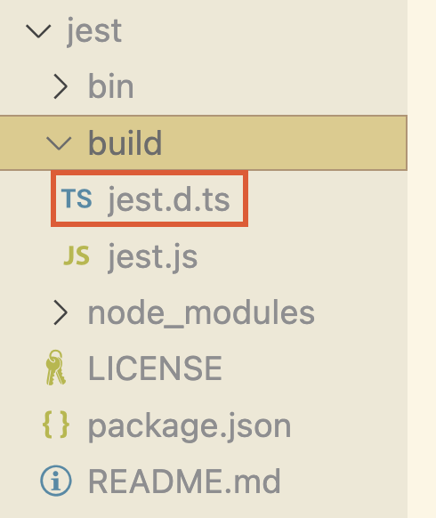
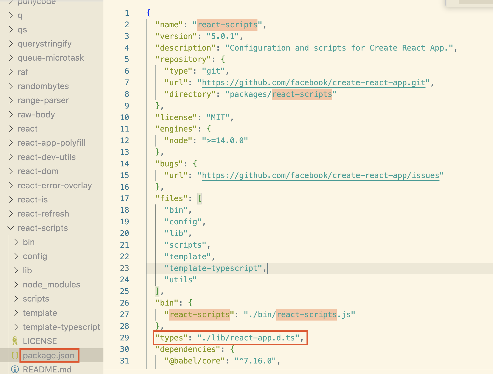

[阮一峰ts教程](https://wangdoc.com/typescript/)

## 类型推断
:::tip
- 类型声明并不是必需的，如果没有，TypeScript 会自己推断类型。TypeScript 也可以推断函数的返回值。

- TypeScript 的设计思想是，类型声明是可选的，你可以加，也可以不加。即使不加类型声明，依然是有效的 TypeScript 代码，只是这时不能保证 TypeScript 会正确推断出类型。由于这个原因，所有 JavaScript 代码都是合法的 TypeScript 代码。
:::

```js
let foo = 123;
foo = 'hello'; // 报错 Type 'string' is not assignable to type 'number'.
```
上面示例中，变量foo并没有类型声明，TypeScript 就会推断它的类型。由于它被赋值为一个数值，因此 TypeScript 推断它的类型为number。
后面，如果变量foo更改为其他类型的值，跟推断的类型不一致，TypeScript 就会报错。

```js
function toString(num:number) {
  return String(num);
}
```
上面示例中，函数`toString()`没有声明返回值的类型，但是 TypeScript 推断返回的是字符串。**正是因为 TypeScript 的类型推断，所以函数返回值的类型通常是省略不写的。**

## TypeScript 的编译
:::tip
- JavaScript 的运行环境（浏览器和 Node.js）不认识 TypeScript 代码。所以，TypeScript 项目要想运行，必须先转为 JavaScript 代码，这个代码转换的过程就叫做“编译”（compile）。

- TypeScript 官方没有做运行环境，只提供编译器。**编译时，会将类型声明和类型相关的代码全部删除，只留下能运行的 JavaScript 代码，并且不会改变 JavaScript 的运行结果。**

- 因此，TypeScript 的类型检查只是编译时的类型检查，而不是运行时的类型检查。一旦代码编译为 JavaScript，运行时就不再检查类型了。

- TypeScript 项目里面，其实存在两种代码，一种是底层的“值代码”，另一种是上层的“类型代码”。前者使用 JavaScript 语法，后者使用 TypeScript 的类型语法。TypeScript 的编译过程，实际上就是把“类型代码”全部拿掉，只保留“值代码”。
:::

### tsc 编译器
TypeScript 官方提供的编译器叫做 tsc。可以全局安装 tsc，也可以在项目中将 tsc 安装为一个依赖模块。
```bash
# 全局安装 tsc
npm install -g typescript
# 检查一下是否安装成功
tsc -v
```

下面命令会在当前目录下，生成一个`app.js`脚本文件，这个脚本就是编译后生成的 JavaScript 代码。
```bash
tsc app.ts
```

tsc命令也可以一次编译多个 TypeScript 脚本，下面命令会在当前目录生成三个 JavaScript 脚本文件`file1.js`、`file2.js`、`file3.js`。
```bash
tsc file1.ts file2.ts file3.ts
```

#### tsc 参数
tsc 有很多参数，可以调整编译行为：
1. `--outFile` 用于将多个 TypeScript 脚本编译成一个 JavaScript 文件
```bash
tsc file1.ts file2.ts --outFile app.js
```

2. `--outDir` 用于指定编译后生成的文件保存的目录（编译结果默认都保存在当前目录）
```bash
tsc app.ts --outDir dist
```

3. `--target` 用于指定编译后的 JavaScript 版本。为了保证编译结果能在各种 JavaScript 引擎运行，tsc 默认会将 TypeScript 代码编译成很低版本的 JavaScript，即3.0版本（以es3表示）
```bash
# 指定编译后的 JavaScript 版本 为 es2015
tsc --target es2015 app.ts
```

4. `--noEmitOnError` 用于设置一旦报错就停止编译，不生成编译产物（默认情况下如果编译报错，tsc命令就会显示报错信息，但是依然会编译生成 JavaScript 脚本。）
```bash
# 报错后，就不会生成app.js
tsc --noEmitOnError app.ts
```

5. `--noEmit` 用于设置只检查类型是否正确，不生成 JavaScript 文件
```bash
# 只检查是否有编译错误，不会生成app.js
tsc --noEmit app.ts
```

6. `--noImplicitAny` 用于设置只要推断出any类型就会报错
```bash
tsc --noImplicitAny app.ts
```
:::tip
有一个特殊情况：即使设置了`noImplicitAny`，使用`let`和`var`声明变量时不赋值也不指定类型，是不会报错的。
```ts
// 变量x和y声明时没有赋值，也没有指定类型，TypeScript 会推断它们的类型为any，即使设置了noImplicitAny，也不会报错
var x; // 不报错
let y; // 不报错

x = 123;
x = { foo: 'hello' };
```

由于这个原因，建议使用`let`和`var`声明变量时，如果不赋值，就一定要显式声明类型，否则可能存在安全隐患。
:::

7. `--strictNullChecks` 设置`strictNullChecks`以后，赋值为`undefined`的变量会被推断为`undefined`类型，赋值为`null`的变量会被推断为`null`类型；`undefined`和`null`就不能赋值给其他类型的变量（除了`any`类型和`unknown`类型）；`undefined`和`null`这两种值也不能互相赋值了。
```ts
// tsc --strictNullChecks app.ts

let age:number = 24;

age = null;      // 报错 Type 'null' is not assignable to type 'number'.
age = undefined; // 报错 Type 'undefined' is not assignable to type 'number'.

let x:undefined = null; // 报错 Type 'null' is not assignable to type 'undefined'.
let y:null = undefined; // 报错 Type 'undefined' is not assignable to type 'null'.

let x:any = undefined;
let y:unknown = null;
```

8. `--ExactOptionalPropertyTypes`。同时设置 `ExactOptionalPropertyTypes` 和 `strictNullChecks`，对象的可选属性就不能设为`undefined`。
```ts
// 设置 ExactOptionsPropertyTypes 和 strictNullChecks
const obj: {
  x: number;
  y?: number;
} = { x: 1, y: undefined }; // 报错 Type '{ x: number; y: undefined; }' is not assignable to type '{ x: number; y?: number; }' with 'exactOptionalPropertyTypes: true'. Types of property 'y' are incompatible(类型不兼容). Type 'undefined' is not assignable to type 'number'.
```

#### tsconfig.json
TypeScript 允许将tsc的编译参数，写在配置文件`tsconfig.json`。只要当前目录有这个文件，tsc就会自动读取，所以运行时可以不写参数。`tsc file1.ts file2.ts --outFile dist/app.js` 写成`tsconfig.json`就是下面这样，有了这个配置文件，编译时直接调用tsc命令就可以了`tsc`
```json
{
  "files": ["file1.ts", "file2.ts"],
  "compilerOptions": {
    "outFile": "dist/app.js"
  }
}
```

### ts-node 模块
[ts-node](https://github.com/TypeStrong/ts-node) 是一个非官方的 npm 模块，可以直接运行 TypeScript 代码。如果只是想简单运行 TypeScript 代码看看结果，ts-node 不失为一个便捷的方法。
```bash
# 全局安装
npm install -g ts-node

# 运行 TypeScript 脚本
ts-node script.ts

# 如果不安装 ts-node，也可以通过 npx 调用它来运行 TypeScript 脚本
npx ts-node script.ts
```

如果执行 `ts-node` 命令不带有任何参数，它会提供一个 TypeScript 的命令行 REPL 运行环境，你可以在这个环境中输入 TypeScript 代码，逐行执行。比如执行`npx ts-node`就会提供一个 TypeScript 的命令行 REPL 运行环境。要退出这个 REPL 环境，可以按下 `Ctrl + d`，或者输入`.exit`。

## 类型系统
### 基本类型
:::info
JavaScript 语言（注意，不是 TypeScript）将值分成8种类型。
- boolean
- string
- number
- bigint
- symbol
- object
- undefined
- null

TypeScript 继承了 JavaScript 的类型设计，以上8种类型可以看作 TypeScript 的基本类型。
:::
:::tip
注意，上面所有类型的名称都是小写字母，首字母大写的`Number`、`String`、`Boolean`等在 JavaScript 语言中都是内置对象，而不是类型名称。

另外，`undefined` 和 `null` 既可以作为值，也可以作为类型，取决于在哪里使用它们。作为值，它们有一个特殊的地方：任何其他类型的变量都可以赋值为`undefined`或`null`（不设置`strictNullChecks`的前提下）。
```ts
// strictNullChecks 为 false 的前提下
let age:number = 24;

age = null;      // 正确
age = undefined; // 正确
```
上面代码中，变量age的类型是number，但是赋值为null或undefined并不报错。这并不是因为undefined和null包含在number类型里面，而是故意这样设计，任何类型的变量都可以赋值为undefined和null，以便跟 JavaScript 的行为保持一致。JavaScript 的行为是，变量如果等于undefined就表示还没有赋值，如果等于null就表示值为空。所以，TypeScript 就允许了任何类型的变量都可以赋值为这两个值。
:::

#### 1.`boolean`类型
`boolean`类型只包含`true`和`false`两个布尔值。
```ts
const x:boolean = true;
const y:boolean = false;
```

#### 2.`string`类型
string类型包含所有字符串。普通字符串和模板字符串都属于 string 类型。
```ts
const x:string = 'hello';
const y:string = `${x} world`;
```

#### 3.`number`类型
number类型包含所有整数和浮点数。整数、浮点数和非十进制数都属于 number 类型。
```ts
const x:number = 123;
const y:number = 3.14;
const z:number = 0xffff;
```

#### 4.`bigint`类型
`bigint` 类型包含所有的大整数。
```ts
const x:bigint = 123n;
const y:bigint = 0xffffn;
```
:::tip
- bigint 与 number 类型不兼容。
```ts
// bigint类型赋值为整数和小数，都会报错。
const x:bigint = 123; // 报错 Type 'number' is not assignable to type 'bigint'.
const y:bigint = 3.14; // 报错 Type 'number' is not assignable to type 'bigint'.
```
- bigint 类型是 ES2020 标准引入的。如果使用这个类型，TypeScript 编译的目标 JavaScript 版本不能低于 ES2020（即编译参数`target`不低于`es2020`）。
:::

#### 5.`symbol`类型
symbol 类型包含所有的 Symbol 值。每一个 Symbol 值都是独一无二的，与其他任何值都不相等。
```ts
let x:symbol = Symbol();
let y:symbol = Symbol();

x === y // false
```
##### unique symbol
- symbol类型包含所有的 Symbol 值，但是无法表示某一个具体的 Symbol 值。为了解决这个问题，TypeScript 设计了symbol的一个子类型unique symbol，它表示单个的、某个具体的 Symbol 值，这个类型的变量是不能修改值的，只能用const命令声明，不能用let声明。
  ```ts
  // 正确
  const x:unique symbol = Symbol();

  // 报错 A variable whose type is a 'unique symbol' type must be 'const'.
  let y:unique symbol = Symbol();
  ```

- const命令为变量赋值 Symbol 值时，变量类型默认就是unique symbol，所以类型可以省略不写。
  ```ts
  const x:unique symbol = Symbol();
  // 等同于
  const x = Symbol();
  ```

- 每个声明为unique symbol类型的变量，它们的值都是不一样的，其实属于两个值类型。
  ```ts
  const a:unique symbol = Symbol();
  const b:unique symbol = Symbol();

  a === b // 报错 This comparison appears to be unintentional because the types 'typeof a' and 'typeof b' have no overlap.

  // 可以参考下面的例子来理解
  const a:'hello' = 'hello';
  const b:'world' = 'world';

  a === b // 报错 This comparison appears to be unintentional because the types '"hello"' and '"world"' have no overlap.

  const c:unique symbol = Symbol();
  const d:unique symbol = c; // 报错 Type 'typeof c' is not assignable to type 'typeof d'.

  const a:unique symbol = Symbol();
  const b:typeof a = a; // 正确
  ```

- 相同参数的 `Symbol.for()` 方法会返回相同的 Symbol 值。TypeScript 目前无法识别这种情况，所以可能出现多个 unique symbol 类型的变量，等于同一个 Symbol 值的情况。
  ```ts
  const a:unique symbol = Symbol.for('foo');
  const b:unique symbol = Symbol.for('foo');
  a === b; // 报错 This comparison appears to be unintentional because the types 'typeof a' and 'typeof b' have no overlap.
  ```

- unique symbol 类型是 symbol 类型的子类型，所以可以将前者赋值给后者，但是反过来就不行。
  ```ts
  const a:unique symbol = Symbol();

  const b:symbol = a; // 正确

  const c:unique symbol = b; // 报错 Type 'symbol' is not assignable to type 'unique symbol'.
  ```

- unique symbol 类型的一个作用，就是用作属性名，这可以保证不会跟其他属性名冲突。如果要把某一个特定的 Symbol 值当作属性名，那么它的类型只能是 unique symbol，不能是 symbol
  ```ts
  const x:unique symbol = Symbol();
  const y:symbol = Symbol();

  interface Foo {
    [x]: string; // 正确
    [y]: string; // 报错 A computed property name in an interface must refer to an expression whose type is a literal type or a 'unique symbol' type.
  }
  ```

- unique symbol类型也可以用作类（class）的属性值，但只能赋值给类的readonly static属性。
  ```ts
  class C {
    static readonly foo:unique symbol = Symbol(); // 注意，这时static和readonly两个限定符缺一不可，这是为了保证这个属性是固定不变的。
  }
  ```

- 如果变量声明时没有给出类型，TypeScript 会推断某个 Symbol 值变量的类型。`let`命令声明的变量，推断类型为 `symbol`。`const`命令声明的变量，推断类型为 `unique symbol`。但是，`const`命令声明的变量，如果赋值为另一个 symbol 类型的变量，则推断类型为 symbol。`let`命令声明的变量，如果赋值为另一个 unique symbol 类型的变量，则推断类型还是 symbol。
  ```ts
  // a 类型为 symbol
  let a = Symbol();

  // b 类型为 unique symbol
  const b = Symbol();

  // c 类型为 symbol
  const c = a;

  // d 类型为 symbol
  let d = b;
  ```


#### 6.`object`类型
object 类型包含了所有对象、数组和函数。
```ts
const x:object = { foo: 123 };
const y:object = [1, 2, 3];
const z:object = (n:number) => n + 1;
```

#### 7.`undefined`类型
undefined 类型只包含一个值undefined，表示未定义（即还未给出定义，以后可能会有定义）。
```ts
let x:undefined = undefined;
```

#### 8.`null`类型
null 类型也只包含一个值null，表示为空（即此处没有值）。
```ts
const x:null = null;
```
:::tip
没有声明类型的变量被赋值为 `undefined` 或 `null` 时，它们的类型会被推断为 `any`。
```ts
let a = undefined;   // any
const b = undefined; // any

let c = null;        // any
const d = null;      // any
```
可以设置`strictNullChecks`来避免上述情况
```ts
// 设置 strictNullChecks后
let a = undefined;   // undefined
const b = undefined; // undefined

let c = null;        // null
const d = null;      // null
```
:::

### 包装对象类型
:::info
JavaScript 的8种类型之中，`undefined`和`null`其实是两个特殊值，`object`属于复合类型，剩下的5种属于原始类型（primitive value），代表最基本的、不可再分的值。
- boolean
- string
- number
- bigint
- symbol

上面这5种原始类型的值，都有对应的包装对象（wrapper object）。所谓“包装对象”，指的是这些值在需要时，会自动产生的对象。
```js
'hello'.charAt(1) // 'e'
```
上面示例中，字符串hello执行了`charAt()`方法。但是，**在 JavaScript 语言中，只有对象才有方法，原始类型的值本身没有方法。这行代码之所以可以运行，就是因为在调用方法时，字符串会自动转为包装对象**，`charAt()`方法其实是定义在包装对象上。这样的设计省去了将原始类型的值手动转成对象实例的麻烦。

5种包装对象之中，symbol 类型和 bigint 类型无法直接获取它们的包装对象（**`Symbol()` 和 `BigInt()`不能作为构造函数使用**），但是剩下3种可以。
- `Boolean()`
- `String()`
- `Number()`

```js
const s = new String('hello');
typeof s // 'object'
s.charAt(1) // 'e'
```
上面示例中，`s` 就是字符串hello的包装对象，typeof运算符返回object，不是string。

注意，`String()`只有当作构造函数使用时（即带有`new`命令调用），才会返回包装对象。如果当作普通函数使用（不带有`new`命令），返回就是一个普通字符串。其他两个构造函数`Number()`和`Boolean()`也是如此。
:::

**由于包装对象的存在，导致每一个原始类型的值都有包装对象和字面量两种情况。**
```js
'hello' // 字面量
new String('hello') // 包装对象
```
为了区分这两种情况，TypeScript 对5种原始类型分别提供了大写和小写两种类型。
- Boolean 和 boolean
- String 和 string
- Number 和 number
- BigInt 和 bigint
- Symbol 和 symbol

其中，**大写类型同时包含包装对象和字面量两种情况，小写类型只包含字面量，不包含包装对象**。
```ts
const s1:String = 'hello'; // 正确
const s2:String = new String('hello'); // 正确

const s3:string = 'hello'; // 正确
const s4:string = new String('hello'); // 报错 Type 'String' is not assignable to type 'string'. 'string' is a primitive, but 'String' is a wrapper object. Prefer using 'string' when possible.
```
:::tip
建议只使用小写类型，不使用大写类型。因为绝大部分使用原始类型的场合，都是使用字面量，不使用包装对象。而且，TypeScript 把很多内置方法的参数，定义成小写类型，使用大写类型会报错。
```ts
const n1:number = 1;
const n2:Number = 1;

Math.abs(n1) // 1
Math.abs(n2) // 报错 Argument of type 'Number' is not assignable to parameter of type 'number'.'number' is a primitive, but 'Number' is a wrapper object. Prefer using 'number' when possible.
```
:::

### Object 类型与 object 类型
TypeScript 的对象类型也有大写Object和小写object两种。
- 大写的Object类型代表 JavaScript 语言里面的广义对象。所有可以转成对象的值，都是Object类型，这囊括了几乎所有的值。原始类型值、对象、数组、函数都是合法的Object类型。
```ts
let obj:Object;
 
obj = true;
obj = 'hi';
obj = 1;
obj = { foo: 123 };
obj = [1, 2];
obj = (a:number) => a + 1;
```

- 除了`undefined`和`null`这两个值不能转为对象，其他任何值都可以赋值给Object类型。
```ts
let obj:Object;

obj = undefined; // 报错 Type 'undefined' is not assignable to type 'Object'.
obj = null; // 报错 Type 'null' is not assignable to type 'Object'.
```

- 空对象`{}`是Object类型的简写形式，所以使用Object时常常用空对象代替。
```ts
let obj:{};
 
obj = true;
obj = 'hi';
obj = 1;
obj = { foo: 123 };
obj = [1, 2];
obj = (a:number) => a + 1;
```

- 小写的object类型代表 JavaScript 里面的狭义对象，即可以用字面量表示的对象，只包含对象、数组和函数，不包括原始类型的值。建议总是使用小写类型object，不使用大写类型Object。
```ts
let obj:object;
 
obj = { foo: 123 };
obj = [1, 2];
obj = (a:number) => a + 1;
obj = true; // 报错 Type 'boolean' is not assignable to type 'object'.
obj = 'hi'; // 报错 Type 'string' is not assignable to type 'object'.
obj = 1; // 报错 Type 'number' is not assignable to type 'object'.
```
:::tip
无论是大写的Object类型，还是小写的object类型，都只包含 JavaScript 内置对象原生的属性和方法，用户自定义的属性和方法都不存在于这两个类型之中。
```ts
const o1:Object = { foo: 0 };
const o2:object = { foo: 0 };

o1.toString() // 正确
o1.foo // 报错 Property 'foo' does not exist on type 'Object'.

o2.toString() // 正确
o2.foo // 报错 Property 'foo' does not exist on type 'object'.
```
:::

### 值类型
TypeScript 规定，单个值也是一种类型，称为“值类型”。
```ts
let x:'hello';

x = 'hello'; // 正确
x = 'world'; // 报错 Type '"world"' is not assignable to type '"hello"'.
```

**TypeScript 推断类型时，遇到`const`命令声明的变量，如果代码里面没有注明类型，就会推断该变量是值类型。(注意，`const`命令声明的变量，如果赋值为对象，并不会推断为值类型。)**
```ts
// x 的类型是 "https"
const x = 'https';

// y 的类型是 string
const y:string = 'https';

// z 的类型是 { foo: number }
const z = { foo: 1 };
```

**父类型不能赋值给子类型，子类型可以赋值给父类型。如果一定要让子类型可以赋值为父类型的值，就要用到类型断言**
:::tip
如果类型A的值可以赋值给类型B，那么类型A就称为类型B的子类型（subtype）。子类型继承了父类型的所有特征，所以子类型可以用在父类型的场合。但是，子类型还可能有一些父类型没有的特征，所以父类型不能用在子类型的场合。
:::
```ts
const x:5 = 4 + 1; // 报错 Type 'number' is not assignable to type '5'.

// 等号左侧的类型是数值5，等号右侧的类型TypeScript 推测为number。由于5是number的子类型，number是5的父类型，所以报错了。

let x:5 = 5;
let y:number = 4 + 1;

x = y; // 报错 Type 'number' is not assignable to type '5'.
y = x; // 正确

const x:5 = (4 + 1) as 5; // 正确。 告诉编译器，可以把4 + 1的类型视为值类型5
```

### 联合类型
联合类型（union types）指的是多个类型组成的一个新类型，使用符号`|`表示。联合类型`A|B`表示，任何一个类型只要属于`A`或`B`，就属于联合类型`A|B`。
```ts
let x:string|number;

x = 123; // 正确
x = 'abc'; // 正确
```

联合类型可以与值类型相结合，表示一个变量的值有若干种可能。
```ts
let setting:true|false;

let gender:'male'|'female';

let rainbowColor:'赤'|'橙'|'黄'|'绿'|'青'|'蓝'|'紫';

let name:string|null;

name = 'John';
name = null;
```

联合类型的第一个成员前面，也可以加上竖杠|，这样便于多行书写。
```ts
let x:
  | 'one'
  | 'two'
  | 'three'
  | 'four';
```

如果一个变量有多种类型，读取该变量时，往往需要进行“类型缩小”（type narrowing），区分该值到底属于哪一种类型，然后再进一步处理。
```ts
function printId( id:number|string ) {
  console.log(id.toUpperCase()); // 报错 Property 'toUpperCase' does not exist on type 'string | number'. Property 'toUpperCase' does not exist on type 'number'.
}
// toUpperCase方法只存在于字符串，不存在于数值

// 解决方法就是对参数id做一下类型缩小，确定它的类型以后再进行处理
function printId( id:number|string ) {
  if (typeof id === 'string') {
    console.log(id.toUpperCase());
  } else {
    console.log(id);
  }
}
```
:::tip
“类型缩小”是 TypeScript 处理联合类型的标准方法，凡是遇到可能为多种类型的场合，都需要先缩小类型，再进行处理。实际上，联合类型本身可以看成是一种“类型放大”（type widening），处理时就需要“类型缩小”（type narrowing）。
```ts
function getPort( scheme: 'http'|'https' ) {
  // 对参数变量scheme进行类型缩小，根据不同的值类型，返回不同的结果
  switch (scheme) {
    case 'http':
      return 80;
    case 'https':
      return 443;
  }
}
```
:::

### 交叉类型
交叉类型（intersection types）指的是多个类型组成的一个新类型，使用符号`&`表示。交叉类型`A&B`表示，任何一个类型必须同时属于`A`和`B`，才属于交叉类型`A&B`，即交叉类型同时满足`A`和`B`的特征。交叉类型的主要用途是表示对象的合成。交叉类型常常用来为对象类型添加新属性。
```ts
let x:number&string; // 变量x同时是数值和字符串，这当然是不可能的，所以 TypeScript 会认为x的类型实际是never。

type A = { foo: number };

type B = A & { bar: number }; // 类型B是一个交叉类型，用来在A的基础上增加了属性bar
```

### type 命令
type命令用来定义一个类型的别名。别名可以让类型的名字变得更有意义，也能增加代码的可读性，还可以使复杂类型用起来更方便，便于以后修改变量的类型。
```ts
type Age = number; // 为number类型定义了一个别名Age

let age:Age = 55;
```

别名不允许重名。
```ts
type Color = 'red';
type Color = 'blue'; // 报错 Duplicate identifier 'Color'.
```

别名的作用域是块级作用域。这意味着，代码块内部定义的别名，影响不到外部。
```ts
type Color = 'red';

if (Math.random() < 0.5) {
  type Color = 'blue';
}
```

别名支持使用表达式，也可以在定义一个别名时，使用另一个别名，即别名允许嵌套。
```ts
type World = "world";
type Greeting = `hello ${World}`;
```

### typeof 运算符
:::info
JavaScript 里面，`typeof`运算符的操作数是一个值，只可能返回八种结果，而且都是字符串。
```js
typeof undefined; // "undefined"
typeof true; // "boolean"
typeof 1337; // "number"
typeof "foo"; // "string"
typeof {}; // "object"
typeof parseInt; // "function"
typeof Symbol(); // "symbol"
typeof 127n // "bigint"
```
:::
TypeScript 将`typeof`运算符移植到了类型运算，它的操作数依然是一个值，但是返回的不是字符串，而是该值的 TypeScript 类型。这种用法的`typeof`返回的是 TypeScript 类型，所以只能用在类型运算之中（即跟类型相关的代码之中），不能用在值运算。
```ts
const a = { x: 0 };

type T0 = typeof a;   // { x: number }
type T1 = typeof a.x; // number
```

同一段代码可能存在两种`typeof`运算符，一种用在值相关的 JavaScript 代码部分，另一种用在类型相关的 TypeScript 代码部分。
```ts
let a = 1;
let b:typeof a; // 类型运算

if (typeof a === 'number') { // 值运算
  b = a;
}
```

由于编译时不会进行 JavaScript 的值运算，所以TypeScript 规定，`typeof` 的参数只能是标识符，不能是需要运算的表达式。
```ts
type T = typeof Date(); // 报错，原因是 typeof 的参数不能是一个值的运算式，而Date()需要运算才知道结果
```

`typeof`命令的参数不能是类型。
```ts
type Age = number;
type MyAge = typeof Age; // 报错 'Age' only refers to a type, but is being used as a value here.
```

### any 类型
- any 类型表示没有任何限制，该类型的变量可以赋予任意类型的值。从集合论的角度看，any类型可以看成是所有其他类型的全集，包含了一切可能的类型。TypeScript 将这种类型称为“顶层类型”（top type），意为涵盖了所有下层。
- 变量类型一旦设为any，TypeScript 实际上会关闭这个变量的类型检查。即使有明显的类型错误，只要句法正确，都不会报错。
```ts
let x:any;

x = 1; // 正确
x = 'foo'; // 正确
x = true; // 正确

let y:any = 'hello';

y(1) // 不报错
y.foo = 100; // 不报错
```

- 实际开发中，any类型主要适用以下两个场合:
  - 出于特殊原因，需要关闭某些变量的类型检查，就可以把该变量的类型设为any。
  - 为了适配以前老的 JavaScript 项目，让代码快速迁移到 TypeScript，可以把变量类型设为any。

- 对于开发者没有指定类型、TypeScript 必须自己推断类型的那些变量，如果无法推断出类型，TypeScript 就会认为该变量的类型是any。
```ts
function add(x, y) {
  return x + y;
}

add(1, [1, 2, 3]) // 不报错
// 函数add()的参数变量x和y，都没有足够的信息，TypeScript 无法推断出它们的类型，就会认为这两个变量和函数返回值的类型都是any。以至于后面就不再对函数add()进行类型检查了，怎么用都可以。
```

- any类型会“污染”其他变量。它可以赋值给其他任何类型的变量（因为没有类型检查），导致其他变量出错，把错误留到运行时才会暴露。
```ts
let x:any = 'hello';
let y:number;

y = x; // 不报错

y * 123 // 不报错
y.toFixed() // 不报错
```

- 当 `import` 一个没有类型声明的第三方库时，TypeScript 无法推断出 `import` 进来的是什么类型，就会认为是 any 类型，这就是隐式 any（implicit any）。

### unknown 类型
为了解决any类型“污染”其他变量的问题，TypeScript 3.0 引入了unknown类型。它与any含义相同，表示类型不确定，可能是任意类型。

- unknown跟any的相似之处，在于所有类型的值都可以分配给unknown类型。
```ts
let x:unknown;

x = true; // 正确
x = 42; // 正确
x = 'Hello World'; // 正确
```

- unknown类型跟any类型的不同之处在于:
  - unknown类型的变量，不能直接赋值给其他类型的变量（除了any类型和unknown类型），这就避免了污染问题，从而克服了any类型的一大缺点。
  ```ts
  let v:unknown = 123;

  let v1:boolean = v; // 报错 Type 'unknown' is not assignable to type 'boolean'.
  let v2:number = v; // 报错 Type 'unknown' is not assignable to type 'number'.
  ```
  - 不能直接调用unknown类型变量的方法和属性。
  ```ts
  let v1:unknown = { foo: 123 };
  v1.foo  // 报错 'v1' is of type 'unknown'.

  let v2:unknown = 'hello';
  v2.trim() // 报错 'v2' is of type 'unknown'.

  let v3:unknown = (n = 0) => n + 1;
  v3() // 报错 'v3' is of type 'unknown'.
  ```
  - unknown类型变量能够进行的运算是有限的，只能进行比较运算（运算符`==`、`===`、`!=`、`!==`、`||`、`&&`、`?`）、取反运算（运算符`!`）、`typeof`运算符和`instanceof`运算符这几种，其他运算都会报错。
  [unknown类型能够进行的运算](https://code.juejin.cn/pen/7266281434002751544)

- 只有经过“类型缩小”，才能使用unknown类型变量
```ts
let a:unknown = 1;

if (typeof a === 'number') {
  let r = a + 10; // 正确
}

let s:unknown = 'hello';

if (typeof s === 'string') {
  s.length; // 正确
}
```

- 一般来说，凡是需要设为any类型的地方，通常都应该优先考虑设为unknown类型。
- 从集合论的角度看，unknown也可以视为所有其他类型（除了any）的全集，所以它和any一样，也属于 TypeScript 的顶层类型。

### never 类型
“空类型”，即该类型为空，不包含任何值。如果变量的类型是never，就不可能赋给它任何值，否则都会报错。

- 不可能返回值的函数，返回值的类型就可以写成never
- 如果一个变量可能有多种类型（即联合类型），通常需要使用分支处理每一种类型。这时，处理所有可能的类型之后，剩余的情况就属于never类型。
```ts
function fn(x:string|number) {
  if (typeof x === 'string') {
    // ...
  } else if (typeof x === 'number') {
    // ...
  } else {
    x; // never 类型
  }
}
```
- never类型可以赋值给任意其他类型。
```ts
function f():never { // 函数f()会抛错，所以返回值类型可以写成never，即不可能返回任何值
  throw new Error('Error');
}

let v1:number = f(); // 不报错
let v2:string = f(); // 不报错
let v3:boolean = f(); // 不报错
```
- 集合论上，空集是任何集合的子集。TypeScript 就相应规定，任何类型都包含了never类型。因此，never类型是任何其他类型所共有的，TypeScript 把这种情况称为“底层类型”（bottom type）。

## 数组/元组 类型声明
JavaScript 数组在 TypeScript 里面分成两种类型，分别是数组（array）和元组（tuple）。
- TypeScript 数组有一个根本特征：所有成员的类型必须相同，但是成员数量是不确定的，可以是无限数量的成员，也可以是零成员。
- 元组（tuple）是 TypeScript 特有的数据类型，JavaScript 没有单独区分这种类型。元组的特征：各个成员的类型可以不同。

### 数组类型声明
1. 数组的类型有两种写法：
- 一种写法是在数组成员的类型后面加上一对方括号
```ts
let arr:number[] = [1, 2, 3];
let arr2:(number|string)[];
```

- 另一种写法是使用 TypeScript 内置的 Array 接口
```ts
let arr:Array<number> = [1, 2, 3];
let arr2:Array<number|string>;
```

2. 因为数组的成员是可以动态变化的，所以 TypeScript 不会对数组边界进行检查，越界访问数组并不会报错。
```ts
let arr:number[] = [1, 2, 3];
let foo = arr[3]; // 正确
```

3. TypeScript 允许使用方括号读取数组成员的类型。
```ts
type Names = string[];
type Name = Names[0]; // string
let a: Name = 1; // 报错 Type 'number' is not assignable to type 'string'.

// 由于数组成员的索引类型都是number，所以读取成员类型也可以写成下面这样
type Name2 = Names[number]; // string
let b: Name2 = 1; // 报错 Type 'number' is not assignable to type 'string'.
```

4. 如果数组变量没有声明类型，TypeScript 就会推断数组成员的类型。
- 如果变量的初始值是空数组，那么 TypeScript 会推断数组类型是any[]。为这个数组赋值时，TypeScript 会自动更新类型推断。
  ```ts
  const arr = [];
  arr // 推断为 any[]

  arr.push(123);
  arr // 推断类型为 number[]

  arr.push('abc');
  arr // 推断类型为 (string|number)[]
  ```
- 如果初始值不是空数组，类型推断就不会更新。
  ```ts
  // 推断类型为 number[]
  const arr = [123];

  arr.push('abc'); // 报错 Argument of type 'string' is not assignable to parameter of type 'number'.
  ```

5. readonly 关键字
TypeScript 允许声明只读数组，方法是在数组类型前面加上readonly关键字。
```ts
const arr:readonly number[] = [0, 1];

arr[1] = 2; // 报错 Index signature in type 'readonly number[]' only permits reading.
arr.push(3); // 报错 Property 'push' does not exist on type 'readonly number[]'.
delete arr[0]; // 报错 Index signature in type 'readonly number[]' only permits reading.
```

- TypeScript 将`readonly number[]` 与 `number[]`视为两种不一样的类型，后者是前者的子类型，这是因为只读数组没有`pop()`、`push()`之类会改变原数组的方法，所以`number[]`的方法数量要多于`readonly number[]`。子类型继承了父类型的所有特征，并加上了自己的特征，所以子类型`number[]`可以用于所有使用父类型的场合，反过来就不行。
  ```ts
  let a1:number[] = [0, 1];
  let a2:readonly number[] = a1; // 正确

  a1 = a2; // 报错 The type 'readonly number[]' is 'readonly' and cannot be assigned to the mutable type 'number[]'.

  function getSum(s:number[]) {
    // ...
  }

  const arr:readonly number[] = [1, 2, 3];

  getSum(arr) // 报错
  // 这个问题的解决方法是使用类型断言
  getSum(arr as number[])
  ```

- readonly关键字不能与数组的泛型写法一起使用。
  ```ts
  const arr:readonly Array<number> = [0, 1]; // 报错 'readonly' type modifier is only permitted on array and tuple literal types.
  ```

- TypeScript 提供了两个专门的泛型，用来生成只读数组的类型。`ReadonlyArray<T>` 和 `Readonly<T[]>`
  ```ts
  const a1:ReadonlyArray<number> = [0, 1];

  const a2:Readonly<number[]> = [0, 1];
  ```

6. 只读数组还有一种声明方法，就是使用“const 断言”。
```ts
const arr = [0, 1] as const;

arr[0] = [2]; // 报错 Cannot assign to '0' because it is a read-only property.
```

7. TypeScript 使用`T[][]`的形式，表示二维数组，T是最底层数组成员的类型。
```ts
var multi:number[][] = [[1,2,3], [23,24,25]];
```

### 元组类型声明
1. 元组必须明确声明每个成员的类型。不能省略类型声明，否则 TypeScript 会把一个值自动推断为数组。
```ts
const s:[string, string, boolean] = ['a', 'b', true];

// 变量a的值其实是一个元组，但是 TypeScript 会将其推断为一个联合类型的数组
let a = [1, true]; // 推断 a 的类型为 (number | boolean)[]
```

2. 元组成员的类型可以添加问号后缀（?），表示该成员是可选的。
```ts
let a:[number, number?] = [1]; // 元组a的第二个成员是可选的，可以省略。
```
:::tip
问号只能用于元组的尾部成员，也就是说，所有可选成员必须在必选成员之后。
```ts
// 元组myTuple的最后两个成员是可选的。也就是说，它的成员数量可能有两个、三个和四个。
type myTuple = [
  number,
  number,
  number?,
  string?
];
```
:::

3. 由于需要声明每个成员的类型，所以大多数情况下，元组的成员数量是有限的，从类型声明就可以明确知道，元组包含多少个成员，越界的成员会报错。
```ts
let x:[string, string] = ['a', 'b'];

x[2] = 'c'; // 报错 Tuple type '[string, string]' of length '2' has no element at index '2'.
```

4. 使用扩展运算符（`...`），可以表示不限成员数量的元组。扩展运算符用在元组的任意位置都可以，但是它(`...`)后面只能是数组或元组。
```ts
type NamedNums = [
  string,
  ...number[]
];

const a:NamedNums = ['A', 1, 2];
const b:NamedNums = ['B', 1, 2, 3];

type t1 = [string, number, ...boolean[]];
type t2 = [string, ...boolean[], number];
type t3 = [...boolean[], string, number];
```
如果不确定元组成员的类型和数量，可以写成下面这样。但是这样写，也就失去了使用元组和 TypeScript 的意义。
```ts
type Tuple = [...any[]];
```

5. 元组可以通过方括号，读取成员类型。
```ts
type Tuple = [string, number];
type Age = Tuple[1]; // number
```
由于元组的成员都是数值索引，即索引类型都是number，所以可以像下面这样读取。
```ts
type Tuple = [string, number, Date];
type TupleEl = Tuple[number];  // string|number|Date
```

6. 只读元组
- 有3种写法：
```ts
// 使用readonly关键字
type t = readonly [number, string]

// 使用范型Readonly<T>
type t = Readonly<[number, string]>

// 使用“const 断言”
let point = [3, 4] as const; // 生成的是只读数组，其实生成的同时也是只读元组。因为它生成的实际上是一个只读的“值类型”readonly [3, 4]，把它解读成只读数组或只读元组都可以。
```

- 只读元组是元组的父类型。所以，元组可以替代只读元组，而只读元组不能替代元组。
```ts
type t1 = readonly [number, number];
type t2 = [number, number];

let x:t2 = [1, 2];
let y:t1 = x; // 正确

x = y; // 报错 The type 't1' is 'readonly' and cannot be assigned to the mutable type 't2'.

function distanceFromOrigin([x, y]:[number, number]) {
  return Math.sqrt(x**2 + y**2);
}

let point = [3, 4] as const;

distanceFromOrigin(point); // 报错 Argument of type 'readonly [3, 4]' is not assignable to parameter of type '[number, number]'. The type 'readonly [3, 4]' is 'readonly' and cannot be assigned to the mutable type '[number, number]'.

// 上面报错的解决方法就是使用类型断言
distanceFromOrigin(
  point as [number, number]
)
```

7. 元组的成员数量
- 如果没有可选成员和扩展运算符，TypeScript 会推断出元组的成员数量（即元组长度）。
  ```ts
  function f(point: [number, number]) {
    if (point.length === 3) {  // 报错 This comparison appears to be unintentional because the types '2' and '3' have no overlap.
      // ...
    }
  }
  ```

- 如果包含了可选成员，TypeScript 会推断出可能的成员数量。
  ```ts
  function f(
    point:[number, number?, number?]
  ) {
    if (point.length === 4) {  // 报错 This comparison appears to be unintentional because the types '1 | 2 | 3' and '4' have no overlap.
      // ...
    }
  }
  ```

- 如果使用了扩展运算符，TypeScript 就无法推断出成员数量。**一旦扩展运算符使得元组的成员数量无法推断，TypeScript 内部就会把该元组当成数组处理。**
  ```ts
  const myTuple:[...string[]] = ['a', 'b', 'c'];

  if (myTuple.length === 4) { // 正确
    // ...
  }
  ```

:::tip
扩展运算符（`...`）将数组（注意，不是元组）转换成一个逗号分隔的序列，这时 TypeScript 会认为这个序列的成员数量是不确定的，因为数组的成员数量是不确定的。这导致如果函数调用时，使用扩展运算符传入函数参数，可能发生参数数量与数组长度不匹配的报错。有些函数可以接受任意数量的参数，这时使用扩展运算符就不会报错。
```ts
const arr = [1, 2];

function add(x:number, y:number){
  // ...
}

add(...arr) // 报错 A spread argument must either have a tuple type or be passed to a rest parameter.
// 报错原因是函数add()只能接受两个参数，但是传入的是...arr，TypeScript 认为转换后的参数个数是不确定的

// console.log()可以接受任意数量的参数，所以传入...arr就不会报错
const arr = [1, 2, 3];
console.log(...arr) // 正确
```

解决这个问题的一个方法，就是把成员数量不确定的数组，写成成员数量确定的元组，再使用扩展运算符。
```ts
const arr:[number, number] = [1, 2];

function add(x:number, y:number){
  // ...
}

add(...arr) // 正确
```

另一个方法是使用 “const” 断言。
```ts
const arr = [1, 2] as const; // TypeScript 会认为arr的类型是readonly [1, 2]，这是一个只读的值类型，可以当作数组，也可以当作元组

function add(x:number, y:number){
  // ...
}

add(...arr) // 正确
```
:::

## 函数 类型声明
- 如果不指定函数的参数类型，TypeScript 就会推断参数类型，如果缺乏足够信息，就会推断该参数的类型为any。
- 返回值的类型通常可以不写，因为 TypeScript 自己会推断出来。
- 如果变量被赋值为一个函数，变量的类型有两种写法。
  ```ts
  // 写法一: 通过等号右边的函数类型，推断出变量hello的类型。
  const hello = function (txt:string) {
    console.log('hello ' + txt);
  }

  // 写法二: 使用箭头函数的形式，为变量hello指定类型，参数的类型写在箭头左侧，返回值的类型写在箭头右侧。函数类型里面的参数名与实际参数名，可以不一致。
  const hello:
    (txt:string) => void
  = function (txt) {
    console.log('hello ' + txt);
  };
  ```
  :::tip
  如果函数的类型定义很冗长，或者多个函数使用同一种类型，写法二用起来就很麻烦。因此，往往用`type`命令为函数类型定义一个别名，便于指定给其他变量。
  ```ts
  type MyFunc = (txt:string) => void;

  const hello:MyFunc = function (txt) {
    console.log('hello ' + txt);
  };
  ```
  :::

- 函数的实际参数个数，可以少于类型指定的参数个数，但是不能多于，即 TypeScript 允许省略参数。
  ```ts
  let myFunc: (a:number, b:number) => number;

  myFunc = (a:number) => a; // 正确

  myFunc = (
    a:number, b:number, c:number
  ) => a + b + c; // 报错 Type '(a: number, b: number, c: number) => number' is not assignable to type '(a: number, b: number) => number'. Target signature provides too few arguments. Expected 3 or more, but got 2.
  ```

- 如果一个变量要套用另一个函数类型，有一个小技巧，就是使用`typeof`运算符。(**任何需要类型的地方，都可以使用`typeof`运算符从一个值获取类型。**)
  ```ts
  function add(
    x:number,
    y:number
  ) {
    return x + y;
  }

  const myAdd:typeof add = function (x, y) {
    return x + y;
  }
  ```

- 函数类型还可以采用对象的写法。这种写法平时很少用，但是非常合适用在一个场合：函数本身存在属性。
  ```ts
  let add:{
    (x:number, y:number):number
  };
   
  add = function (x, y) {
    return x + y;
  };

  function f(x:number) {
    console.log(x);
  }
  f.version = '1.0';

  let foo: {
    (x:number): void;
    version: string
  } = f;
  ```

- 函数类型也可以使用 `interface` 来声明，这种写法就是对象写法的翻版
  ```ts
  interface myfn {
    (a:number, b:number): number;
  }

  var add:myfn = (a, b) => a + b;
  ```

### Function 类型
- TypeScript 提供 Function 类型表示函数，任何函数都属于这个类型。
- Function 类型的值都可以直接执行。
- **Function 类型的函数可以接受任意数量的参数，每个参数的类型都是any，返回值的类型也是any**，代表没有任何约束，所以不建议使用这个类型，给出函数详细的类型声明会更好。
```ts
function doSomething(f:Function) {
  return f(1, 2, 3);
}
```

### 箭头函数类型声明
类型声明写在箭头函数的定义里面。其中，参数的类型写在参数名后面，返回值类型写在参数列表的圆括号后面。
```ts
const repeat = (
  str:string,
  times:number
):string => str.repeat(times);

/*
map()方法的参数是一个箭头函数(name):Person => ({name})
该箭头函数的参数name的类型省略了，因为可以从map()的类型定义推断出来，
箭头函数的返回值类型为Person。相应地，变量people的类型是Person[]。
箭头后面的({name})，表示返回一个对象，该对象有一个属性name，它的属性值为变量name的值。这里的圆括号是必须的，否则(name):Person => {name}的大括号表示函数体，即函数体内有一行语句name，同时由于没有return语句，这个函数不会返回任何值。
*/
type Person = { name: string };

const people = ['alice', 'bob', 'jan'].map(
  (name):Person => ({name})
);
```

### 可选参数
- 如果函数的某个参数可以省略，则在参数名后面加问号表示。参数名带有问号，表示该参数的类型实际上是`原始类型|undefined`，它有可能为undefined。
```ts
// 参数x是可选的，等同于说x可以赋值为undefined
function f(x?:number) {
  return x;
}
f(); // 正确
f(10); // 正确
f(undefined) // 正确

// 类型显式设为undefined的参数，就不能省略
function f(x:number|undefined) {
  return x;
}

f() // 报错 Expected 1 arguments, but got 0.
```

- 函数的可选参数只能在参数列表的尾部，跟在必选参数的后面。如果前部参数有可能为空，这时只能显式注明该参数类型可能为undefined。
```ts
let myFunc:
  (a?:number, b:number) => number; // 报错 A required parameter cannot follow an optional parameter.

let myFunc:
  (
    a:number|undefined,
    b:number
  ) => number;
```

- 函数体内部用到可选参数时，需要判断该参数是否为undefined。
```ts
let myFunc:
  (a:number, b?:number) => number; 

myFunc = function (x, y) {
  if (y === undefined) {
    return x;
  }
  return x + y;
}
```

### 参数默认值
- 设置了默认值的参数，就是可选的。如果不传入该参数，它就会等于默认值。
```ts
function createPoint(
  x = 0, y = 0
) {
  return [x, y];
}
```

- 可选参数与默认值不能同时使用。
```ts
// 报错 Parameter cannot have question mark and initializer.
function f(x?: number = 0) {
  return x;
}
```

- 设有默认值的参数，如果传入undefined，也会触发默认值。
```ts
function f(x = 456) {
  return x;
}

f(undefined) // 456
```

- 具有默认值的参数如果不位于参数列表的末尾，调用时不能省略，如果要触发默认值，必须显式传入undefined。
```ts
function add(
  x:number = 0,
  y:number
) {
  return x + y;
}

add(1) // 报错 Expected 2 arguments, but got 1.
add(undefined, 1) // 正确
```

### 参数解构的类型写法
参数解构可以结合类型别名（type 命令）一起使用，代码会看起来简洁一些。
```ts
type ABC = { a:number; b:number; c:number };

function sum({ a, b, c }:ABC) {
  console.log(a + b + c);
}
```

### rest参数
- rest参数表示函数剩余的所有参数，它可以是数组（剩余参数类型相同），也可能是元组（剩余参数类型不同）。
```ts
// rest 参数为数组
function joinNumbers(...nums:number[]) {
  // ...
}
function multiply(n:number, ...m:number[]) {
  return m.map((x) => n * x);
}

// rest 参数为元组
function f(...args:[boolean, number]) {
  // ...
}
// 如果元组里面的参数是可选的，则要使用可选参数。
function f(
  ...args: [boolean, string?]
) {}
```

- rest参数可以嵌套。
```ts
function f(...args:[boolean, ...string[]]) {
  // ...
}
```

- rest参数可以与变量解构结合使用。
```ts
function repeat(...[str, times]: [string, number]):string {
  return str.repeat(times);
}

// 等同于
function repeat(str: string, times: number):string {
  return str.repeat(times);
}
```

### 只读参数
如果函数内部不能修改某个参数，可以在函数定义时，在参数类型前面加上readonly关键字，表示这是只读参数。
```ts
function arraySum(arr:readonly number[]) {
  // ...
  arr[0] = 0; // 报错 Index signature in type 'readonly number[]' only permits reading.
}
```

### void 类型
- void 类型表示函数没有返回值。函数字面量如果声明了返回值是 void 类型，返回其他值就会报错。
```ts
function f():void {
  return 123; // 报错 Type 'number' is not assignable to type 'void'.
}
```
:::tip
如果 变量、对象的方法、函数的参数 的类型是 void 类型的函数，则该变量、对象方法和函数参数可以接受返回任意值的函数。这是因为，这时 TypeScript 认为，这里的 void 类型只是表示该函数的返回值没有利用价值，或者说不应该使用该函数的返回值。只要不用到这里的返回值，就不会报错。
```ts
type voidFunc = () => void;

const f:voidFunc = () => {
  return 123;
};

// 使用了这个函数的返回值，则会报错。
f() * 2 // 报错 The left-hand side of an arithmetic operation must be of type 'any', 'number', 'bigint' or an enum type.
```
这样设计是有现实意义的。举例来说，数组方法`Array.prototype.forEach(fn)`的参数fn是一个函数，而且这个函数应该没有返回值，即返回值类型是void。但是，实际应用中，很多时候传入的函数是有返回值，但是它的返回值不重要，或者不产生作用。
```ts
const src = [1, 2, 3];
const ret = [];

src.forEach(el => ret.push(el)); // push()有返回值，表示新插入的元素在数组里面的位置。但是，对于forEach()方法来说，这个返回值是没有作用的，根本用不到，所以 TypeScript 不会报错。
```
:::

- void 类型允许返回undefined或null。
:::tip
如果设置了`strictNullChecks`编译选项，那么 void 类型只允许返回undefined。如果返回null，就会报错。这是因为 JavaScript 规定，如果函数没有返回值，就等同于返回undefined。
:::
```ts
function f():void {
  return undefined; // 正确
}

function f():void {
  return null; // 正确（若设置了strictNullChecks则报错：Type 'null' is not assignable to type 'void'.）
}
```

### 局部类型
函数内部允许声明其他类型，该类型只在函数内部有效，称为局部类型。
```ts
function hello(txt:string) {
  type message = string;
  let newTxt:message = 'hello ' + txt;
  return newTxt;
}

const newTxt:message = hello('world'); // 报错 Exported variable 'newTxt' has or is using private name 'message'.
```

### 函数重载 的 类型声明
:::tip
根据参数类型不同，执行不同逻辑的行为，称为函数重载（function overload）。
:::

- 函数重载 先列举重载的各种情况，然后函数本身的类型声明必须与列举的重载声明兼容。
```ts
// reverse函数重载
function reverse(str:string):string;
function reverse(arr:any[]):any[];
function reverse(
  stringOrArray:string|any[]
):string|any[] {
  if (typeof stringOrArray === 'string')
    return stringOrArray.split('').reverse().join('');
  else
    return stringOrArray.slice().reverse();
}

// add函数重载
function add(
  x:number,
  y:number
):number;
function add(
  x:any[],
  y:any[]
):any[];
function add(
  x:number|any[],
  y:number|any[]
):number|any[] {
  if (typeof x === 'number' && typeof y === 'number') {
    return x + y;
  } else if (Array.isArray(x) && Array.isArray(y)) {
    return [...x, ...y];
  }

  throw new Error('wrong parameters');
}
```
:::tip
- 重载的各个类型描述与函数的具体实现之间，不能有其他代码，否则报错。
- 函数重载的每个类型声明之间，以及类型声明与函数实现的类型之间，不能有冲突。
  ```ts
  // 报错 This overload signature is not compatible with its implementation signature.
  function fn(x:boolean):void;
  function fn(x:string):void;
  function fn(x:number|string) {
    console.log(x);
  }
  ```
- 重载声明的排序很重要，因为 TypeScript 是按照顺序进行检查的，一旦发现符合某个类型声明，就不再往下检查了，所以类型最宽的声明应该放在最后面，防止覆盖其他类型声明。
  ```ts
  function f(x:any):number;
  function f(x:string): 0|1;
  function f(x:any):any {
    // ...
  }

  const a:0|1 = f('hi'); // 报错 Type 'number' is not assignable to type '0 | 1'.

  /*
  第一行类型声明x:any范围最宽，导致函数f()的调用都会匹配这行声明，无法匹配第二行类型声明
  */
  ```
:::

- 对象的方法也可以使用重载。
  ```ts
  class StringBuilder {
    #data = '';

    add(num:number): this;
    add(bool:boolean): this;
    add(str:string): this;
    add(value:any): this {
      this.#data += String(value);
      return this;
    }

    toString() {
      return this.#data;
    }
  }
  ```

- 函数重载也可以用来精确描述函数参数与返回值之间的对应关系。
  ```ts
  function createElement(
    tag:'a'
  ):HTMLAnchorElement;
  function createElement(
    tag:'canvas'
  ):HTMLCanvasElement;
  function createElement(
    tag:'table'
  ):HTMLTableElement;
  function createElement(
    tag:string
  ):HTMLElement {
    // ...
  }

  // 也可以用对象表示
  type CreateElement = {
    (tag:'a'): HTMLAnchorElement;
    (tag:'canvas'): HTMLCanvasElement;
    (tag:'table'): HTMLTableElement;
    (tag:string): HTMLElement;
  }
  ```

:::tip
由于重载是一种比较复杂的类型声明方法，为了降低复杂性，一般来说，如果可以的话，应该优先使用联合类型替代函数重载。
```ts
// 写法一
function len(s:string):number;
function len(arr:any[]):number;
function len(x:any):number {
  return x.length;
}

// 写法二
function len(x:any[]|string):number {
  return x.length;
}
```
:::

### 构造函数 的 类型声明
- 构造函数的类型声明，就是在参数列表前面加上new命令。
  ```ts
  class Animal {
    numLegs:number = 4;
  }

  type AnimalConstructor = new () => Animal;

  function create(c:AnimalConstructor):Animal {
    return new c();
  }

  const a = create(Animal);
  ```

- 构造函数还有另一种类型声明写法，就是采用对象形式。
  ```ts
  type F = {
    new (s:string): object;
  };
  ```

- 某些函数既是构造函数，又可以当作普通函数使用，比如`Date()`。这时，类型声明可以写成下面这样。
  ```ts
  type F = {
    new (s:string): object;
    (n?:number): number;
  }
  ```

## 对象 类型声明
- 对象类型的最简单声明方法，就是使用大括号表示对象，在大括号内部声明每个属性的类型。属性的类型可以用分号结尾，也可以用逗号结尾。最后一个属性后面，可以写分号或逗号，也可以不写。
  ```ts
  // 属性类型以分号结尾
  type MyObj = {
    x:number;
    y:number;
  };

  // 属性类型以逗号结尾
  type MyObj = {
    x:number,
    y:number,
  };
  ```

- 一旦声明了类型，对象赋值时，就不能缺少指定的属性，也不能有多余的属性。读写不存在的属性也会报错。也不能删除类型声明中存在的属性，修改属性值是可以的。
  ```ts
  type MyObj = {
    x:number;
    y:number;
  };

  const o1:MyObj = { x: 1 }; // 报错 Property 'y' is missing in type '{ x: number; }' but required in type 'MyObj'.
  const o2:MyObj = { x: 1, y: 1, z: 1 }; // 报错 Type '{ x: number; y: number; z: number; }' is not assignable to type 'MyObj'. Object literal may only specify known properties(对象字面量只能指定已知属性), and 'z' does not exist in type 'MyObj'.

  const obj:{
    x:number;
    y:number;
  } = { x: 1, y: 1 };

  console.log(obj.z); // 报错 Property 'z' does not exist on type '{ x: number; y: number; }'.
  obj.z = 1; // 报错 Property 'z' does not exist on type '{ x: number; y: number; }'.

  const myUser = {
    name: "Sabrina",
  };

  delete myUser.name // 报错 The operand of a 'delete' operator must be optional.(“delete”运算符的操作数必须是可选的)
  myUser.name = "Cynthia"; // 正确
  ```

- 对象的方法使用函数类型描述。
  ```ts
  const obj:{
    x: number;
    y: number;
    add(x:number, y:number): number;
    // 或者写成
    // add: (x:number, y:number) => number;
  } = {
    x: 1,
    y: 1,
    add(x, y) {
      return x + y;
    }
  };
  ```

- 对象类型可以使用方括号读取属性的类型。
  ```ts
  type User = {
    name: string,
    age: number
  };
  type Name = User['name']; // string
  ```

- 除了`type`命令可以为对象类型声明一个别名，TypeScript 还提供了`interface`命令，可以把对象类型提炼为一个接口。
  ```ts
  // 写法一
  type MyObj = {
    x:number;
    y:number;
  };

  const obj:MyObj = { x: 1, y: 1 };

  // 写法二
  interface MyObj {
    x: number;
    y: number;
  }

  const obj:MyObj = { x: 1, y: 1 };
  ```

- 注意，TypeScript 不区分对象自身的属性和继承的属性，一律视为对象的属性。
  ```ts
  interface MyInterface {
    toString(): string; // 继承的属性
    prop: number; // 自身的属性
  }

  const obj:MyInterface = { // 正确
    prop: 123,
  };
  /*
  obj只写了prop属性，但是不报错。因为它可以继承原型上面的toString()方法。
  */
  ```

### 可选属性
- 可选属性等同于允许赋值为`undefined`。读取一个没有赋值的可选属性时，返回`undefined`。
  ```ts
  const obj: {
    x: number;
    y?: number;
  } = { x: 1, y: undefined };

  type MyObj = {
    x: string,
    y?: string
  };
  const obj:MyObj = { x: 'hello' };
  obj.y.toLowerCase() // 报错 'obj.y' is possibly 'undefined'.
  ```

- 可选属性 与 允许设为`undefined`的必选属性是不等价的。
  ```ts
  type A = { x:number, y?:number };
  type B = { x:number, y:number|undefined };

  const ObjA:A = { x: 1 }; // 正确
  const ObjB:B = { x: 1 }; // 报错 Property 'y' is missing in type '{ x: number; }' but required in type 'B'.
  ```

### 只读属性
- 属性名前面加上`readonly`关键字，表示这个属性是只读属性，只能在对象初始化期间赋值，此后就不能修改该属性。
  ```ts
  interface MyInterface {
    readonly prop: number;
  }
  const person:{
    readonly age: number
  } = { age: 20 };

  person.age = 21; // 报错 Cannot assign to 'age' because it is a read-only property.
  ```

- 如果属性值是一个对象，`readonly`修饰符并不禁止修改该对象的属性，只是禁止完全替换掉该对象。
  ```ts
  interface Home {
    readonly resident: {
      name: string;
      age: number
    };
  }

  const h:Home = {
    resident: {
      name: 'Vicky',
      age: 42
    }
  };

  h.resident.age = 32; // 正确
  h.resident = {
    name: 'Kate',
    age: 23 
  } // 报错 annot assign to 'resident' because it is a read-only property.
  ```
  :::tip
  如果一个对象有两个引用，即两个变量对应同一个对象，其中一个变量是可写的，另一个变量是只读的，那么从可写变量修改属性，会影响到只读变量。
  ```ts
  interface Person {
    name: string;
    age: number;
  }

  interface ReadonlyPerson {
    readonly name: string;
    readonly age: number;
  }

  let w:Person = {
    name: 'Vicky',
    age: 42,
  };

  let r:ReadonlyPerson = w;

  w.age += 1;
  r.age // 43
  /*
  变量w和r指向同一个对象，其中w是可写的，r是只读的。那么，对w的属性修改，会影响到r。
  */
  ```
  :::

- 声明只读属性的另一种方法，就是在赋值时，在对象后面加上只读断言`as const`。
  ```ts
  const myUser = {
    name: "Sabrina",
  } as const;

  myUser.name = "Cynthia"; // 报错 Cannot assign to 'name' because it is a read-only property.
  ```
  :::tip
  上面的`as const`属于 TypeScript 的类型推断，如果变量明确地声明了类型，那么 TypeScript 会以声明的类型为准。如下，根据变量`myUser`的类型声明看出`name`不是只读属性，但是赋值时又使用只读断言`as const`，这时会以声明的类型为准，即`name`属性是可以修改的。
  ```ts
  const myUser:{ name: string } = {
    name: "Sabrina",
  } as const;

  myUser.name = "Cynthia"; // 正确
  ```
  :::

### 属性名的索引类型
如果对象的属性非常多，一个个声明类型就很麻烦，而且有些时候，无法事前知道对象会有多少属性，比如外部 API 返回的对象。这时可以采用属性名表达式的写法来描述类型，称为“属性名的索引类型”。
```ts
type MyObj = {
  [property: string]: string
};

const obj:MyObj = {
  foo: 'a',
  bar: 'b',
  baz: 'c',
};
```
- 上述`[property: string]`的`property`表示属性名，这个是可以随便起的，它的类型是string，即属性名类型为string。也就是说，不管这个对象有多少属性，只要属性名为字符串，且属性值也是字符串，就符合这个类型声明。

- JavaScript 对象的属性名（即上例的property）的类型有三种可能，除了上例的string，还有number和symbol。
  ```ts
  type T1 = {
    [property: number]: string
  };

  type T2 = {
    [property: symbol]: string
  };
  ```
  ```ts
  type MyArr = {
    [n:number]: number;
  };

  const arr:MyArr = [1, 2, 3];
  // 或者
  const arr:MyArr = {
    0: 1,
    1: 2,
    2: 3,
  };
  ```

- 属性的索引类型写法，建议谨慎使用，因为属性名的声明太宽泛，约束太少。

- 对象可以同时有多种类型的属性名索引，比如同时有数值索引和字符串索引。但是，数值索引不能与字符串索引发生冲突，必须服从后者，这是因为在 JavaScript 语言内部，所有的数值属性名都会自动转为字符串属性名。
  ```ts
  // 由于字符属性名的值类型是string，数值属性名的值类型只有同样为string，才不会报错。
  type MyType = {
    [x: number]: boolean; // 报错 'number' index type 'boolean' is not assignable to 'string' index type 'string'.
    [x: string]: string;
  }
  ```

- 可以既声明属性名索引，也声明具体的单个属性名。如果单个属性名符合属性名索引的范围，两者不能有冲突，否则报错。
  ```ts
  // 属性名foo符合属性名的字符串索引，但是两者的属性值类型不一样，所以报错了。
  type MyType = {
    foo: boolean; // 报错 Property 'foo' of type 'boolean' is not assignable to 'string' index type 'string'.
    [x: string]: string;
  }
  ```

- 属性名的数值索引不宜用来声明数组，因为采用这种方式声明数组，就不能使用各种数组方法以及length属性，因为类型里面没有定义这些东西。
  ```ts
  type MyArr = {
    [n:number]: number;
  };

  const arr:MyArr = [1, 2, 3];
  arr.length // 报错 Property 'length' does not exist on type 'MyArr'.
  ```

### 解构赋值的类型声明
解构赋值用于直接从对象中提取属性。
```js
const {id, name, price} = product; // 从对象product提取了三个属性，并声明属性名的同名变量。
```

- 对象解构里面的冒号是为这个属性指定新的变量名。
  ```js
  let { x: foo, y: bar } = obj;

  // 等同于
  let foo = obj.x;
  let bar = obj.y;

  // 上面示例中，冒号不是表示属性x和y的类型，而是为这两个属性指定新的变量名。如果要为x和y指定类型，不得不写成下面这样。
  let { x: foo, y: bar }
    : { x: string; y: number } = obj;
  ```

- 解构赋值的类型写法如下:
  ```ts
  const {id, name, price}:{
    id: string;
    name: string;
    price: number
  } = product;
  ```

### 结构类型原则
只要对象 B 满足 对象 A 的结构特征，TypeScript 就认为对象 B 兼容对象 A 的类型，这称为“结构类型”原则（structural typing）。
```ts
type A = {
  x: number;
};

type B = {
  x: number;
  y: number;
};

// 对象A只有一个属性x，类型为number。对象B满足这个特征，因此兼容对象A，只要可以使用A的地方，就可以使用B。
const B = {
  x: 1,
  y: 1
};

const A:{ x: number } = B; // 正确
```

:::tip
根据“结构类型”原则，TypeScript 检查某个值是否符合指定类型时，并不是检查这个值的类型名（即“名义类型”），而是检查这个值的结构是否符合要求（即“结构类型”）。
:::

- 如果类型 B 可以赋值给类型 A，TypeScript 就认为 B 是 A 的子类型（subtyping），A 是 B 的父类型。子类型满足父类型的所有结构特征，同时还具有自己的特征。凡是可以使用父类型的地方，都可以使用子类型，即子类型兼容父类型。这种设计有时会导致令人惊讶的结果。
  ```ts
  type myObj = {
    x: number,
    y: number,
  };

  function getSum(obj:myObj) {
    let sum = 0;

    for (const n of Object.keys(obj)) {
      const v = obj[n]; // 报错 Element implicitly has an 'any' type because expression of type 'string' can't be used to index type 'myObj'.
      sum += Math.abs(v);
    }

    return sum;
  }

  // 函数getSum()要求传入参数的类型是myObj，但是实际上所有与myObj兼容的对象都可以传入。这会导致const v = obj[n]这一行报错，原因是obj[n]取出的属性值不一定是数值（number），使得变量v的类型被推断为any。如果项目设置为不允许变量类型推断为any，代码就会报错。

  type MyObj = {
    x: number,
    y: number,
  };

  function getSum(obj:MyObj) {
    return Math.abs(obj.x) + Math.abs(obj.y);
  }
  
  ```

## `declare` 关键字
注意，`declare` 关键字只用来给出类型描述，是纯的类型代码，不允许设置变量的初始值，即不能涉及值。**类型声明文件里面，变量的类型描述必须使用`declare`命令，否则会报错，因为变量声明语句是值相关代码。**`interface` 类型有没有`declare`都可以，因为 `interface` 是完全的类型代码。
```ts
declare let foo:string; // 正确

interface Foo {} // 正确
declare interface Foo {} // 正确
```

## 类型声明文件
- 单独使用的模块，一般会同时提供一个单独的类型声明文件（declaration file），把本模块的外部接口的所有类型都写在这个文件里面，便于模块使用者了解接口，也便于编译器检查使用者的用法是否正确。

- 类型声明文件里面只有类型代码，没有具体的代码实现。它的文件名一般为`[模块名].d.ts`的形式，其中的d表示 declaration（声明）。

### 写类型声明文件
比如，有一个模块的代码如下：
```js title="demo.js"
const maxInterval = 12;

function getArrayLength(arr) {
  return arr.length;
}

module.exports = {
  getArrayLength,
  maxInterval,
};
```
它的类型声明文件可以写成下面这样：
```ts title="demo.d.ts"
export function getArrayLength(arr: any[]): number;
export const maxInterval: 12;
```

类型声明文件中，除了使用 `export` 输出，还可以使用 `export default` 或者 `export =`。比如：模块代码如下：
```js title="demo.js"
module.exports = 3.142;
```
它的类型声明文件可以写成下面这样：
```ts title="demo.d.ts"
declare const pi: number;
export default pi;
```
或者
```ts title="demo.d.ts"
declare const pi: number;
export = pi;
```

### 使用类型声明文件
- 手动导入
```ts title="types.d.ts"
export interface Character {
  catchphrase?: string;
  name: string;
}
```
```ts title="index.ts"
import { Character } from "./types";

export const character:Character = {
  catchphrase: "Yee-haw!",
  name: "Sandy Cheeks",
};
```

- 配置在tsconfig.json 文件里。比如，moment 模块的类型声明文件是 `moment.d.ts`，使用 moment 模块的项目可以将其加入项目的 `tsconfig.json` 文件。这样的话，编译器打包项目时，会自动将类型声明文件加入编译，而不必在每个脚本里面加载类型声明文件。
  ```json title="tsconfig.json"
  {
    "compilerOptions": {},
    "files": [
      "src/index.ts",
      "typings/moment.d.ts"
    ]
  }
  ```

### `declare module` 用于类型声明文件
我们可以为每个模块脚本，定义一个`.d.ts`文件，把该脚本用到的类型定义都放在这个文件里面。但是，更方便的做法是为整个项目，定义一个大的`.d.ts`文件，在这个文件里面使用`declare module`定义每个模块脚本的类型。如下，`url` 和 `path`都是单独的模块脚本，但是它们的类型都定义在`node.d.ts`这个文件里面:
```ts title="node.d.ts"
declare module "url" {
  export interface Url {
    protocol?: string;
    hostname?: string;
    pathname?: string;
  }

  export function parse(
    urlStr: string,
    parseQueryString?,
    slashesDenoteHost?
  ): Url;
}

declare module "path" {
  export function normalize(p: string): string;
  export function join(...paths: any[]): string;
  export var sep: string;
}
```

### 类型声明文件的来源
类型声明文件主要有以下三种来源：
- TypeScript编译器自动生成。
- TypeScript内置的类型声明文件。
- 外部模块的类型声明文件，需要自己安装。

#### TypeScript编译器自动生成
只要使用编译选项 `declaration`，编译器就会在编译时自动生成单独的类型声明文件。可以在配置文件里或者命令行打开这个选项。
```json title="tsconfig.json"
{
  "compilerOptions": {
    "declaration": true
  }
}
```
```bash
tsc --declaration
```

#### TypeScript内置的类型声明文件
TypeScript内置的类型声明文件主要是内置的全局对象（JavaScript语言接口 和 运行环境API）的类型声明。这些内置声明文件位于 TypeScript 语言安装目录的lib文件夹内（文件名统一为 `lib.[description].d.ts` 的形式，其中description部分描述了文件内容。比如，`lib.dom.d.ts`这个文件就描述了 DOM 结构的类型。），数量大概有几十个，下面是其中一些主要文件:
- lib.d.ts
- lib.dom.d.ts
- lib.es2015.d.ts
- lib.es2016.d.ts
- lib.es2017.d.ts
- lib.es2018.d.ts
- lib.es2019.d.ts
- lib.es2020.d.ts
- lib.es5.d.ts
- lib.es6.d.ts

**TypeScript 编译器会自动根据编译目标`target`的值，加载对应的内置声明文件**，所以不需要特别的配置。但是，**可以使用编译选项`lib`，指定加载哪些内置声明文件**。
```json title="tsconfig.json"
{
  "compilerOptions": {
    "lib": ["dom", "es2021"] // lib选项指定加载dom和es2021这两个内置类型声明文件
  }
}
```

编译选项`noLib`会禁止加载任何内置声明文件。

#### 外部模块的类型声明文件
如果项目中使用了外部的某个第三方代码库，那么就需要这个库的类型声明文件。这时又分成三种情况。
- 这个库自带了类型声明文件。
  
  一般来说，如果这个库的打包目录中包含了`[vendor].d.ts`文件，那么就自带了类型声明文件。其中的`vendor`表示这个库的名字，比如`jest`这个库就自带`jest.d.ts`。使用这个库可能需要单独加载它的类型声明文件。
  

- 这个库没有自带，但是可以找到社区制作的类型声明文件。
  
  第三方库如果没有提供类型声明文件，社区往往会提供。TypeScript 社区主要使用 [DefinitelyTyped 仓库](https://github.com/DefinitelyTyped/DefinitelyTyped)，各种类型声明文件都会提交到那里，已经包含了几千个第三方库。这些声明文件都会作为一个单独的库，发布到 npm 的 `@types` 名称空间之下。比如，jQuery 的类型声明文件就发布成 `@types/jquery` 这个库，使用时安装这个库就可以了。执行`npm install @types/jquery --save-dev`，`@types/jquery`这个库就安装到项目的`node_modules/@types/jquery`目录，里面的`index.d.ts`文件就是 jQuery 的类型声明文件。**如果类型声明文件不是`index.d.ts`，那么就需要在`package.json`的 `types` 或 `typings`字段，指定类型声明文件的文件名**。
  :::info
  TypeScript默认会自动加载`node_modules/@types`目录下的模块，但可以使用编译选项`typeRoots`改变这种行为。如下，TypeScript去跟`tsconfig.json`同级的 `typings`目录 和 `vendor/types`目录中加载类型模块，而不再加载`node_modules/@types`目录下的模块。
  ```json title="tsconfig.json"
  {
    "compilerOptions": {
      "typeRoots": ["./typings", "./vendor/types"]
    }
  }
  ```
  默认情况下，TypeScript会自动加载`typeRoots`目录里的所有模块，编译选项`types`可以指定加载哪些模块。`types`属性是一个数组，成员是所要加载的类型模块，要加载几个模块，这个数组就有几个成员，每个类型模块在`typeRoots`目录下都有一个自己的子目录。如下，TypeScript就会自动去jquery子目录，加载 jQuery 的类型声明文件：
  ```json title="tsconfig.json"
  {
    "compilerOptions": {
      "types" : ["jquery"]
    }
  }
  ```
  :::

- 找不到类型声明文件，需要自己写。

  有时实在没有第三方库的类型声明文件，又很难完整给出该库的类型描述，这时你可以告诉 TypeScript 相关对象的类型是`any`。比如，使用 jQuery 的脚本可以写成下面这样:
  ```ts
  declare var $:any

  // 或者
  declare type JQuery = any;
  declare var $:JQuery;
  ```
  :::info
  也可以采用下面的写法，将整个外部模块的类型声明为`any`:
  ```ts
  declare module '模块名';
  ```
  :::

### 类型声明文件发布
当前模块如果包含自己的类型声明文件，可以在 `package.json` 文件里面添加一个`types`字段 或 `typings`字段，指明类型声明文件的位置。
```json title="package.json"
{
  "name": "awesome",
  "author": "Vandelay Industries",
  "version": "1.0.0",
  "main": "./lib/main.js",
  "types": "./lib/main.d.ts"
}
```
:::tip
注意，如果类型声明文件名为`index.d.ts`，且在项目的根目录中，那就不需要在`package.json`里面注明了。
:::

如果依赖的第三方包的类型声明文件单独发布成了一个 npm 模块，那么引入该依赖包的同时，也需要引入该依赖包的类型声明文件。比如，项目中使用`browserify`，则也需要引入`@types/browserify`：
```json title="package.json"
{
  "name": "browserify-typescript-extension",
  "author": "Vandelay Industries",
  "version": "1.0.0",
  "main": "./lib/main.js",
  "types": "./lib/main.d.ts",
  "dependencies": {
    "browserify": "latest",
    "@types/browserify": "latest",
    "typescript": "next"
  }
}
```

### 三斜杠命令
- 三斜杠命令（`///`）是一个 TypeScript 编译器命令，用来指定编译器行为。它只能用在文件的头部，如果用在其他地方，会被当作普通的注释。另外，若一个文件中使用了三斜线命令，那么在三斜线命令之前只允许使用单行注释、多行注释和其他三斜线命令，否则三斜杠命令也会被当作普通的注释。

- 如果类型声明文件的内容非常多，可以拆分成多个文件，然后入口文件使用三斜杠命令，加载其他拆分后的文件。举例来说，入口文件是`main.d.ts`，里面的接口定义在`interfaces.d.ts`，函数定义在`functions.d.ts`。那么，`main.d.ts`里面可以用三斜杠命令，加载后面两个文件。
  ```ts title="main.d.ts"
  /// <reference path="./interfaces.d.ts" />
  /// <reference path="./functions.d.ts" />
  ```

- 三斜杠命令主要包含三个参数，代表三种不同的命令。
  - path
  - types
  - lib

#### `/// <reference path="" />`
- 编译器会在预处理阶段，找出所有三斜杠引用的文件，将其添加到编译列表中，然后一起编译。

- `path`参数指定了所引入文件的路径。如果该路径是一个相对路径，则基于当前脚本的路径进行计算。
  :::tip
  - `path`参数必须指向一个存在的文件，若文件不存在会报错。
  - `path`参数不允许指向当前文件。
  :::

- 默认情况下，每个三斜杠命令引入的脚本，都会编译成单独的 JS 文件。如果希望编译后只产出一个合并文件，可以使用编译选项`outFile`。但是，`outFile`编译选项不支持合并 CommonJS 模块和 ES 模块，只有当编译参数`module`的值设为 `None`、`System` 或 `AMD` 时，才能编译成一个文件。

- 如果打开了编译参数`noResolve`，则忽略三斜杠指令。将其当作一般的注释，原样保留在编译产物中。

#### `/// <reference types="" />`
:::tip
这个命令只应该用在`.d.ts`文件中
:::

`types` 参数用来告诉编译器当前脚本依赖某个类型声明文件。如果`types`的值对应有单独的类型声明模块，则编译时实际添加的脚本就是安装到`node_modules/@types`目录中对应的类型声明文件；如果`types`的值对应没有单独的类型声明模块，则编译时实际添加的脚本就是对应依赖的模块指定的类型声明文件的路径。举例如下：

例1: 这个三斜杠命令表示编译时添加 `Node.js` 的类型库，有单独的类型声明模块`@types/node`，所以编译时实际添加的脚本是`node_modules/@types/node/index.d.ts`。
```ts
/// <reference types="node" />
```

例2: 这个三斜杠命令表示编译时添加 `react-scripts` 的类型库，没有单独的类型声明模块`@types/react-scripts`，则编译时实际添加的脚本是`react-scripts`模块指定的类型声明文件的路径`node_modules/react-scripts/lib/react-app.d.ts`。
```ts title="src/react-app-env.d.ts"
/// <reference types="react-scripts" />
```


#### `/// <reference lib="" />`
这个命令允许脚本文件显式包含内置 lib 库，等同于在`tsconfig.json`文件里面使用lib属性指定 lib 库。如下，指定加载内置的`lib.es2017.string.d.ts`
```ts
/// <reference lib="es2017.string" />
```

## 泛型
- 泛型用于反映参数与返回值之间的类型关系。

- 泛型的特点就是带有“类型参数”（type parameter）。
  下面示例中，函数`getFirst()`的函数名后面尖括号的部分`<T>`，就是类型参数，参数要放在一对尖括号（`<>`）里面。本例只有一个类型参数`T`，可以将其理解为类型声明需要的变量，需要在调用时传入具体的参数类型。函数`getFirst()`的参数类型是`T[]`，返回值类型是`T`，就清楚地表示了两者之间的关系。比如，输入的参数类型是`number[]`，那么 `T` 的值就是`number`，因此返回值类型也是`number`。
  ```ts
  function getFirst<T>(arr:T[]):T {
    return arr[0];
  }
  ```

## `tsconfig.json`配置项
### `include`
- `include`属性指定所要编译的文件列表，既支持逐一列出文件，也支持通配符。文件位置相对于当前配置文件而定。

- 如果不指定文件后缀名，默认包括`.ts`、`.tsx`和`.d.ts`文件。如果打开了`allowJs`，那么还包括`.js`和`.jsx`。

- `include`属性支持三种通配符:
  - `?`：指代单个字符
  - `*`：指代任意字符，不含路径分隔符
  - `**`：指定任意目录层级。

```json
{
  "include": ["src/**/*", "tests/**/*"]
}
```