:::info
插件：Create File
> 参考：[Simple New File](https://github.com/fayras/vscode-simple-new-file)；[File Template](https://github.com/RalfZhang/File-Template)

预期产出：开发并发布一个vscode插件，作用是根据接口返回的数据 或者 json文件自动生成对应的目录及文件，其中vue文件有固定模板。
1.使用keybindings给命令添加快捷键，使用快捷键生成对应的目录及文件，并给文件以固定模板
2.命令可能记不住，所以开发一个activitybar，作用有两个：用来唤起quickpick，以及用来打开一个自定义webview
3.自定义webview的功能有：导入json文件；粘贴json并格式化；点击按钮根据json生成目录

TODO:
- activitybar加上icon
- 完成根据json生成目录的功能
- webview中搜索功能ctrl+f
- 该插件的功能点总结
:::

# vscode插件开发
Visual Studio Code 在构建时考虑到了可扩展性。从 UI 到编辑体验，几乎 VS Code 的每个部分都可以通过 Extension API 进行定制和增强。

## 一、参考文档
- 官网：[Your First Extension](https://code.visualstudio.com/api/get-started/your-first-extension)
- [官方的插件示例](https://github.com/microsoft/vscode-extension-samples)

## 二、生成开发extension的工程
### 1. install [Yeoman](https://yeoman.io/) and [VS Code Extension Generator](https://www.npmjs.com/package/generator-code)
```bash
npm install -g yo generator-code
```
### 2. `yo code`
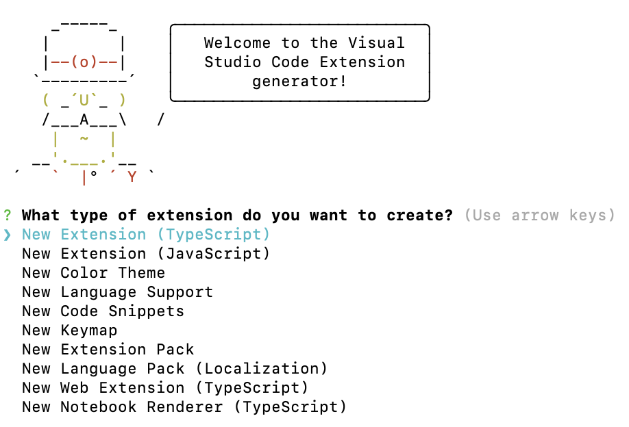
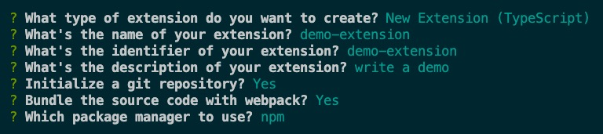

```text
Your extension demo-extension has been created!

To start editing with Visual Studio Code, use the following commands:

     cd demo-extension
     code .

Open vsc-extension-quickstart.md inside the new extension for further instructions
on how to modify, test and publish your extension.

To run the extension you need to install the recommended extension 'amodio.tsl-problem-matcher'.

For more information, also visit http://code.visualstudio.com and follow us @code.
```
目录结构如下：

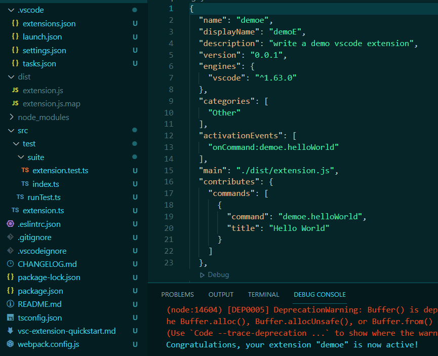

- `.vscodeignore` 类似 `.npmignore`，用于指定插件包里不包含的文件；
- `package.json`中各字段的详情：[Extension Manifest](https://code.visualstudio.com/api/references/extension-manifest#fields)
- `package.json`中的 `main` 指定插件的主入口文件，实际上就是 `src/extension.ts` 编译出来的产物；
- `package.json`中的 `contributes` 可以理解成 功能声明清单，插件有关的命令、配置、UI、snippets 等都在该字段里声明。contributes中可配置的项有：[Contribution Points](https://code.visualstudio.com/api/references/contribution-points)
- json中的 `contributes` 中的 commands 是各个command的集合，command的类型如下:
  ```js
  const commandType: IJSONSchema = {
    type: 'object',
    required: ['command', 'title'],
    properties: {
      command: {
        description: localize('vscode.extension.contributes.commandType.command', 'Identifier of the command to execute'),
        type: 'string'
      },
      title: {
        description: localize('vscode.extension.contributes.commandType.title', 'Title by which the command is represented in the UI'),
        type: 'string'
      },
      category: {
        description: localize('vscode.extension.contributes.commandType.category', '(Optional) Category string by the command is grouped in the UI'),
        type: 'string'
      },
      enablement: {
        description: localize('vscode.extension.contributes.commandType.precondition', '(Optional) Condition which must be true to enable the command'),
        type: 'string'
      },
      icon: {
        description: localize('vscode.extension.contributes.commandType.icon', '(Optional) Icon which is used to represent the command in the UI. Either a file path, an object with file paths for dark and light themes, or a theme icon references, like `\\$(zap)`'),
        anyOf: [
         {
           type: 'string'
         },
        {
          type: 'object',
          properties: {
            light: {
              description: localize('vscode.extension.contributes.commandType.icon.light', 'Icon path when a light theme is used'),
              type: 'string'
            },
            dark: {
              description: localize('vscode.extension.contributes.commandType.icon.dark', 'Icon path when a dark theme is used'),
              type: 'string'
            }
          }
        }
        ]
      }
    }
  };
  ```
- `package.json`中的 `engines.vscode` 指定了扩展所依赖的 VS Code API 的最低版本。

### 3.调试
- Run > Start Debugging，Run Extension 会自动打开一个新的vscode window（Extension Development Host），这个窗口会加载我们的插件
- 脚手架新建的插件项目默认注册了一个激活命令，叫Hello World。在`[Extension Development Host]`窗口中，使用 `ctrl(cmd) + shift + p` 呼出VSCode的命令面板，输入激活命令，然后右下角弹窗会展示该命令执行的结果。
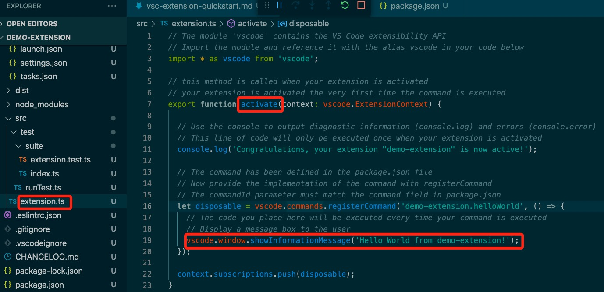


## 三、vscode的用户界面和布局
[User Interface](https://code.visualstudio.com/docs/getstarted/userinterface)

### 1. VSCode UI分为5个区域：Editor、Side Bar、Status Bar、Activity Bar、Panels。


#### 活动栏---Activity Bar
位于最左侧，可让用户在视图之间切换

#### 侧边栏---Side Bar
- 资源管理器面板
- 搜索面板
- 源代码管理面板
- 调试面板
- 插件面板

#### 编辑区---Editor

#### 状态栏---Status Bar
- 左边：显示Git分支、错误和问题数量。
- 右边：显示行数列数、空格数、字符编码、换行符、文件格式、反馈。

#### 面板---Panels
- 终端
- 调试控制台
- 问题
- 输出

#### 选项卡式标题---Tabs
- File: 打开或关闭文件、文件夹、工作区
- Edit: 编辑代码
- Selection: 在代码中进行选择
- View: 打开各种面板
- Go: 在代码中进行跳转
- Run: 调试代码
- Terminal: 配置任务
- Help: 查看帮助

#### 命令面板(默认隐藏)
- 用 `ctrl + p` 打开命令面板，可以快速调用各种命令
- 可以直接输入文件名快速切换文件
- 输入各种前缀符号执行特殊功能：
  - `>` 用于输入命令(也可以用 `F1` 或 `ctrl + shit + p` 直接进入)；
  - `?` 显示当前可进行的操作；
  - `:` 跳转到行数(可以用 `ctrl+g` 直接进入)；
  - `@` 跳转到变量或者函数(可以用 `ctrl + shift + o` 直接进入)；
  - `#` 根据名字查找Symbol(可以用 `ctrl + t` 直接进入)

### 2. 布局区域对应的menus
- [contributes.menus](https://code.visualstudio.com/api/references/contribution-points#contributes.menus)
- menu example:
  ```json
  {
    "contributes": {
      "menus": {
        "editor/title": [
          {
            "when": "resourceLangId == markdown",
            "command": "markdown.showPreview",
            "alt": "markdown.showPreviewToSide",
            "group": "navigation"
          }
        ]
      }
    }
  }
  ```

## 四、API
### 1. Tree View API
Tree View API允许插件在vscode的侧边栏中显示内容，内容采用树状结构，符合vscode内置视图的风格。

以构建一个名为 [Node Dependencies](https://github.com/microsoft/vscode-extension-samples/tree/main/tree-view-sample) 的插件为例，此插件将使用树视图显示当前文件夹中的所有Node.js依赖项。
- 设置 `package.json` 的 `contributes.views.explorer`、`activationEvents`
  ```json title="package.json"
  "activationEvents": ["onView:nodeDependencies"],
  "contributes": {
    "views": {
      "explorer": [
        {
          "id": "nodeDependencies",
          "name": "Node Dependencies"
        }
      ]
    }
  },
  ```
- `vscode.window.registerTreeDataProvider`
- `vscode.window.createTreeView`
- 当用户打开视图时，VSCode 会发出一个 `activationEvent onView:${viewId}`，使用 `registerTreeDataProvider` 给该 `viewId` 对应的视图注入数据
  ```json
  "activationEvents": [
    "onView: nodeDependencies",
  ],
  "contributes": {
    "viewsContainers": {
      "activitybar": [
    		{
    			"id": "package-explorer",
    			"title": "Package Explorer",
    			"icon": "media/dep.svg"
    		}
    	]
    },
    "views": {
      "package-explorer": [
  		{
  			"id": "nodeDependencies",
  			"name": "Node Dependencies",
  			"icon": "media/dep.svg"
  		}
  	],
    }
  }
  ```
  ```ts
  function activate(context: vscode.ExtensionContext) {
    const nodeDependenciesProvider = new DepNodeProvider();
  	vscode.window.registerTreeDataProvider('nodeDependencies', nodeDependenciesProvider);
  }
  ```
- 每当用户打开activity bar，`vscode.TreeDataProvider`的实现类中的`getChildren`和`getTreeItem`会被自动调用（没有参数），`getChildren`里返回的值(一个数组)的元素会作为`getTreeItem`的入参。
- `resolveTreeItem`会影响activity bar中节点的`tooltip`

### 2. Webview API
webview API允许插件在vscode中创建完全可自定义的视图。例如，内置的 Markdown 插件使用 webviews 来呈现 Markdown 预览。
- `createWebviewPanel`在编辑区创建并显示一个webview，然后可以设置webview的内容`webview.html`
  ```js
  function window.createWebviewPanel(viewType: string, title: string, showOptions: vscode.ViewColumn | {
    viewColumn: vscode.ViewColumn;
    preserveFocus?: boolean;
  }, options?: vscode.WebviewPanelOptions & vscode.WebviewOptions): vscode.WebviewPanel
  ```
- `registerWebviewPanelSerializer`用于注册一个新的 WebviewPanelSerializer，WebviewPanelSerializer负责从其持久状态恢复 webview 的内容. **Only a single serializer may be registered at a time for a given viewType.**
  ```js
  function window.registerWebviewPanelSerializer(viewType: string, serializer: vscode.WebviewPanelSerializer<unknown>): vscode.Disposable
  ```
- `WebviewPanelSerializer.deserializeWebviewPanel(webviewPanel: vscode.WebviewPanel, state: any): Thenable<void>` 当序列化的 webview 第一次变得可见时调用该方法，从序列化状态恢复 webview 面板

以构建一个名为[Cat Coding](https://github.com/microsoft/vscode-extension-samples/tree/main/webview-sample)的插件为例，该插件的功能是自定义一个webview，在其内展示猫敲代码的gif。
- 设置webview的内容会导致webview重新加载；设置webview的title不会导致重新加载webview。
- 当用户关闭 webview 面板时，webview 本身将被销毁。尝试使用销毁的 webview 会引发异常。当 webview 被销毁时触发 `onDidDispose` 事件。可以使用这个事件来清理 webview 的资源。可以调用`dispose()`关闭webview。
  ```ts title="extension.ts"
  export function activate(context: vscode.ExtensionContext) {
    context.subscriptions.push(
      vscode.commands.registerCommand('catCoding.start', () => {
        const panel = vscode.window.createWebviewPanel(
          'catCoding',
          'Cat Coding',
          vscode.ViewColumn.One,
          {}
        );

        panel.webview.html = getWebviewContent(cats['Coding Cat']); // getWebviewContent里面返回html的字符串作为webview的内容

        // After 5sec, programmatically close the webview panel
        const timeout = setTimeout(() => panel.dispose(), 5000);

        panel.onDidDispose(
          () => {
            // Handle user closing panel before the 5sec have passed
            clearTimeout(timeout);
          },
          null,
          context.subscriptions
        );
      })
    );
  }
  ```
- 当webview的tab为 非当前tab 时，该webview并没有被销毁，当它切换为当前tab时，vscode会自动从 `webview.html` 恢复webview的内容。`.visible` 属性用于webview当前是否可见。
- 可以通过调用 `reveal()` 将webview 面板带到前台，即显示在当前编辑区中。用于 判断webview是否存在，存在则切成当前tab，不存在则创建。
- 每当webview的可见性发生变化，或者当webview移动到新列(比如往右拖变成两个编辑区，则右侧为新列)时，`onDidChangeViewState` 事件就会被触发。
- `Developer: Reload Webview` 命令会重新加载所有活动的 webview。如果您需要重置 webview 的状态，或者如果磁盘上的某些 webview 内容已更改并且您希望加载新内容，这会很有帮助。

- webviews是在无法直接访问本地资源的隔离上下文中运行的，这样做是出于安全考虑。所以，开发的webview插件要想加载图像、样式表和其他资源，或者从用户当前工作区加载任何内容，必须使用 `Webview.asWebviewUri` 函数进行转换。
  ```ts
  import * as vscode from 'vscode';
  import * as path from 'path';

  export function activate(context: vscode.ExtensionContext) {
    context.subscriptions.push(
      vscode.commands.registerCommand('catCoding.start', () => {
        const panel = vscode.window.createWebviewPanel(
          'catCoding',
          'Cat Coding',
          vscode.ViewColumn.One,
          {}
        );

        // Get path to resource on disk
        const onDiskPath = vscode.Uri.file(
          path.join(context.extensionPath, 'media', 'cat.gif')
        );

        // And get the special URI to use with the webview
        const catGifSrc = panel.webview.asWebviewUri(onDiskPath);

        panel.webview.html = getWebviewContent(catGifSrc);
      })
    );
  }
  ```

- 默认情况下，webviews只能访问以下位置的资源：你的插件安装目录中的、用户当前活动的工作区中的。
- 使用 `vscode.WebviewOptions.localResourceRoots` 允许访问其他本地资源。要禁止所有本地资源，只需将 `localResourceRoots` 设置为 `[]`。
  ```ts
  import * as vscode from 'vscode';
  import * as path from 'path';

  export function activate(context: vscode.ExtensionContext) {
    context.subscriptions.push(
      vscode.commands.registerCommand('catCoding.start', () => {
        const panel = vscode.window.createWebviewPanel(
          'catCoding',
          'Cat Coding',
          vscode.ViewColumn.One,
          {
            // Only allow the webview to access resources in our extension's media directory
            localResourceRoots: [vscode.Uri.file(path.join(context.extensionPath, 'media'))]
          }
        );

        const onDiskPath = vscode.Uri.file(
          path.join(context.extensionPath, 'media', 'cat.gif')
        );
        const catGifSrc = panel.webview.asWebviewUri(onDiskPath);

        panel.webview.html = getWebviewContent(catGifSrc);
      })
    );
  }
  ```

- webview可以使用css来根据vscode的当前主题更改其外观。vscode将主题分为3类，并在body元素中添加了一个特殊的类来指示当前的主题。vscode-light（轻量级主题）、vscode-dark（黑暗主题）、vscode-high-contrast（高对比度主题）
  ```css
  // 可以对body的3类主题进行样式修改
  body.vscode-light {
    color: black;
  }

  body.vscode-dark {
    color: white;
  }

  body.vscode-high-contrast {
    color: red;
  }
  ```
- webviews还可以使用css变量访问vscode主题颜色。例如，使用`--vscode-editor-foreground访问editor.foreground`
  ```css
  .demo {
    color: var(--vscode-editor-foreground);
  }
  ```

- 默认情况下，webviews 中禁用 JavaScript，但可以通过传入 `enableScripts: true` 选项重新启用。
- 插件可以在 `extension.ts` 中使用 `webview.postMessage()` 将数据发送到它的 webview。此方法将任何 JSON 可序列化数据发送到 webview，webview 的`<script>`内可以使用`window.addEventListener('message', event => {})`接收消息。
- webview内将消息回传给插件：在 webview 中调用`acquireVsCodeApi`，此函数每个会话只能调用一次。`acquireVsCodeApi().postMessage()`
  ```html
  // webview的script
  <script>
    (function () {
      const vscode = acquireVsCodeApi();

      const oldState = /** @type {{ count: number} | undefined} */ (vscode.getState());

      const counter = /** @type {HTMLElement} */ (document.getElementById('lines-of-code-counter'));
      console.log('Initial state', oldState);

      let currentCount = (oldState && oldState.count) || 0;
      counter.textContent = `${currentCount}`;

      setInterval(() => {
        counter.textContent = `${currentCount++} `;

        // Update state
        vscode.setState({ count: currentCount });

        // Alert the extension when the cat introduces a bug
        if (Math.random() < Math.min(0.001 * currentCount, 0.05)) {
          // Send a message back to the extension
          vscode.postMessage({
            command: 'alert',
            text: '🐛  on line ' + currentCount
          });
        }
      }, 100);

      // Handle messages sent from the extension to the webview
      window.addEventListener('message', event => {
        const message = event.data; // The json data that the extension sent
        switch (message.command) {
          case 'refactor':
            currentCount = Math.ceil(currentCount * 0.5);
            counter.textContent = `${currentCount}`;
            break;
        }
      });
    }());
  </script>
  ```

- webview也可以使用Web Worker。
- 在 webview 中运行的`<script>`可以使用 `getState` 和 `setState` 方法来保存和恢复 JSON 可序列化状态对象。即使在 webview 面板变为隐藏时 webview 内容本身被破坏，此状态也会持续存在。当 webview 面板被销毁时，状态被销毁。`getState` 和 `setState` 是保持状态的首选方式，因为它们的性能开销比 `retainContextWhenHidden` 低得多。

- 通过实现 WebviewPanelSerializer，当 VSCode 重新启动时，可以让你的 webviews 自动恢复。序列化建立在 `getState` 和 `setState` 之上，并且仅当你的插件为你的 webview 注册了 WebviewPanelSerializer 时才启用。需要在 `package.json` 中添加一个 `onWebviewPanel` 激活事件，此激活事件可确保每当 VSCode 需要使用 `viewType`(即例子中的'catCoding') 恢复 webview 时，"Cat Coding"这个插件都会被激活。在插件的 `activate` 方法中，调用 `registerWebviewPanelSerializer` 注册一个新的 WebviewPanelSerializer，WebviewPanelSerializer 负责从其持久状态恢复 webview 的内容。此状态是 webview 内容使用 `setState` 设置的 JSON blob。
  ```json
  "activationEvents": [
    "onWebviewPanel:catCoding"
  ],
  ```
  ```ts
  export function activate(context: vscode.ExtensionContext) {
    // Normal setup...

    // And make sure we register a serializer for our webview type
    vscode.window.registerWebviewPanelSerializer('catCoding', new CatCodingSerializer());
  }

  class CatCodingSerializer implements vscode.WebviewPanelSerializer {
    async deserializeWebviewPanel(webviewPanel: vscode.WebviewPanel, state: any) {
      // `state` is the state persisted using `setState` inside the webview
      console.log(`Got state: ${state}`);

      // Restore the content of our webview.
      //
      // Make sure we hold on to the `webviewPanel` passed in here and
      // also restore any event listeners we need on it.
      webviewPanel.webview.html = getWebviewContent();
    }
  }
  ```
- 对于 具有非常复杂的UI或无法快速保存和恢复的状态 的 webview，可以使用 `retainContextWhenHidden` 选项。此选项使 webview 保留其内容但处于隐藏状态，即使 webview 本身不再处于前台。注意：1)即使启用了 `retainContextWhenHidden`，也无法向隐藏的webview发送消息。2)`retainContextWhenHidden`具有很高的内存开销，仅应在其他持久性技术不起作用时使用。
  ```ts
  import * as vscode from 'vscode';

  export function activate(context: vscode.ExtensionContext) {
    context.subscriptions.push(
      vscode.commands.registerCommand('catCoding.start', () => {
        const panel = vscode.window.createWebviewPanel(
          'catCoding',
          'Cat Coding',
          vscode.ViewColumn.One,
          {
            enableScripts: true,
            retainContextWhenHidden: true
          }
        );
        panel.webview.html = getWebviewContent();
      })
    );
  }
  ```

#### 2.1 webview通信
使用postMessage以及监听message

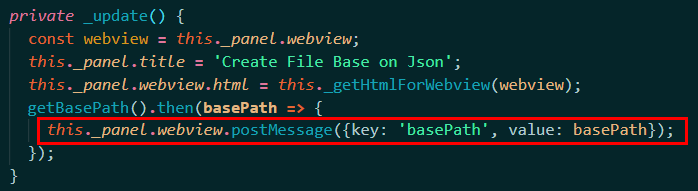
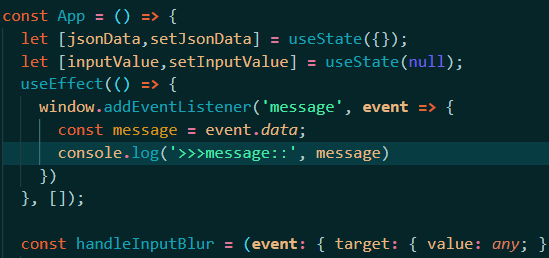
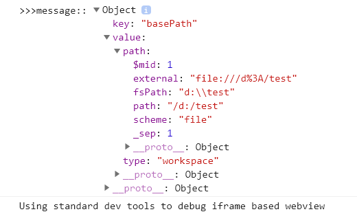

- 注意webview的postMessage和window的[postMessage](https://developer.mozilla.org/zh-CN/docs/Web/API/Window/postMessage)不太一样
- webview的postMessage: (method) `Webview.postMessage(message: any): Thenable<boolean>`
> Post a message to the webview content.
> Messages are only delivered if the webview is live (either visible or in the background with retainContextWhenHidden).
> @param message
> Body of the message. **This must be a string or other json serializable object.**
> For older versions of vscode, if an ArrayBuffer is included in message, it will not be serialized properly and will not be received by the webview. Similarly any TypedArrays, such as a Uint8Array, will be very inefficiently serialized and will also not be recreated as a typed array inside the webview.
> However if your extension targets vscode 1.57+ in the engines field of its package.json, any ArrayBuffer values that appear in message will be more efficiently transferred to the webview and will also be correctly recreated inside of the webview.

## 五、开发插件
> [插件API和samples概览](https://code.visualstudio.com/api/extension-guides/overview)

### 1. 注册及使用
- 在 `package.json` 中的 `activationEvents` 注册 `onCommand` 激活事件，这样当运行命令时插件会被激活
- 在 `package.json` 中的 `contributes.commands` 声明命令的id(command)和name(title)，使其在命令面板中可用
- 在 `extension.ts` 中使用 `vscode.commands.registerCommand` 将回调函数绑定到注册的命令id
- 可以使用 `menus.commandPalette` 控制注册的命令何时显示在命令面板中
  ```json
  // package.json
  {
    "contributes": {
      "menus": {
        "commandPalette": [
          {
            "command": "myExtension.sayHello",
            "when": "editorLangId == markdown"
          }
        ]
      }
    }
  }

  // 如上，myExtension.sayHello 命令只会在用户位于 Markdown 文件中时显示在命令面板中。
  ```

### 2. 可以使用的核心功能
:::tip
插件无法访问vscode UI的DOM
:::

- 注册命令、配置、键绑定(`contributes.keybindings`)、上下文菜单项
- 存储 工作区或全局 数据，有4种存储数据的选项
  - `ExtensionContext.workspaceState`  工作区存储，vscode管理存储并在再次打开同一个工作区时将其恢复。
  - `ExtensionContext.globalState`  全局存储，vscode管理存储并将在每次插件激活时恢复它。可以通过在 `globalState` 上使用 `setKeysForSync` 方法设置同步键来选择性地同步全局存储中的键/值对。
  - `ExtensionContext.storagePath`  工作区特定的存储路径，指向插件具有读/写访问权限的本地目录。
  - `ExtensionContext.globalStoragePath`  全局存储路径，指向插件具有读/写访问权限的本地目录。
- 显示通知消息
- 使用Quick Pick收集用户输入
- 打开系统文件选择器让用户选择文件或文件夹--->[`vscode.window.showOpenDialog`](https://code.visualstudio.com/api/references/vscode-api#vscode.window.showOpenDialog)
- 使用Progress API指示长时间运行的操作--->[`vscode.Progress`](https://code.visualstudio.com/api/references/vscode-api#Progress)

### 3. 自定义上下文
如果需要使用when子句上下文启用/禁用命令、菜单或视图，并且现有的键都不适合你的需要，则可以自定义上下文。

```js
vscode.commands.executeCommand('setContext', 'myExtension.showMyCommand', true);

vscode.commands.executeCommand('setContext', 'myExtension.numberOfCoolOpenThings', 4);
```

### 4. 在Activity Bar 或 Panel中显示自定义插件
- 在Activity Bar中显示自定义的插件：使用`contributes.viewsContainers.activitybar` 和 `contributes.views`
- 在Panel中显示自定义的插件：使用`contributes.viewsContainers.panel` 和 `contributes.views`
  ```json title="package.json"
  "contributes": {
  		"viewsContainers": {
  			"activitybar": [
  				{
  					"id": "test-active-bar",
  					"title": "Test Active Bar",
  					"icon": "media/dep.svg"
  				}
  			]
  		},
  		"views": {
  			"test-active-bar": [
  				{
  					"id": "testDemo",
  					"name": "Test Demo",
  					"icon": "media/dep.svg",
  					"contextualTitle": "Test Active Bar"
  				}
  			]
  		}
  	},
  ```

### 5. 自定义插件的操作项(View Actions)
在 `package.json` 中的 `contributes.menus` 声明自定义插件的操作项

主要或`inline`的操作项使用`"group": "navigation"`；其他次要的操作项位于`...`中

```json title="package.json"
"contributes": {
  "commands": [
    {
      "command": "nodeDependencies.refreshEntry",
      "title": "Refresh",
      "icon": {
        "light": "resources/light/refresh.svg",
        "dark": "resources/dark/refresh.svg"
      }
    },
    {
      "command": "nodeDependencies.addEntry",
      "title": "Add"
    },
    {
      "command": "nodeDependencies.editEntry",
      "title": "Edit",
      "icon": {
        "light": "resources/light/edit.svg",
        "dark": "resources/dark/edit.svg"
      }
    },
    {
      "command": "nodeDependencies.deleteEntry",
      "title": "Delete"
    }
  ],
  "menus": {
    "view/title": [
      {
  			"command": "nodeDependencies.refreshEntry",
  			"when": "view == nodeDependencies",
  			"group": "navigation" // 如下图，刷新 操作项 位于 主要导航位置
  		},
  		{
  			"command": "nodeDependencies.addEntry", // 如下图，Add 操作项 位于 ...中
  			"when": "view == nodeDependencies"
  		}
    ],
    "view/item/context": [
      {
  			"command": "nodeDependencies.editEntry",
  			"when": "view == nodeDependencies && viewItem == dependency",
  			"group": "inline" // 如下图，编辑 操作项 位于 inline
  		},
  		{
  			"command": "nodeDependencies.deleteEntry",  // 如下图，Delete 操作项 位于 编辑操作项的下一层，即点击编辑图标露出Delete
  			"when": "view == nodeDependencies && viewItem == dependency"
  		}
    ]
  }
}
```


### 6. 自定义插件的空视图内容
可以使用`viewsWelcome`设置自定义插件的视图为空时的内容。空视图是没有消息，且为空树的视图。
```json title="package.json"
"contributes": {
  "viewsWelcome": [
    {
      "view": "nodeDependencies",
      "contents": "No node dependencies found [learn more](https://www.npmjs.com/).\n[Add Dependency](command:nodeDependencies.addEntry)"
    }
  ]
}
```


### 7. keybindings
用于设置命令的快捷键

### 8. 使用[FileSystemProvider](https://code.visualstudio.com/api/references/vscode-api#FileSystemProvider)

FileType:
```js
export enum FileType {
  /**
   * The file type is unknown.
   */
  Unknown = 0,
  /**
   * A regular file.
   */
  File = 1,
  /**
   * A directory.
   */
  Directory = 2,
  /**
   * A symbolic link to a file.
   */
  SymbolicLink = 64
}
```

### 9. 使用React开发插件的webview内容
#### 9.1 使用react
:::info
参考:
- [简单聊一聊 React 和 VSCode Webview (一)](https://zhuanlan.zhihu.com/p/349934155);
- [简单聊一聊 React 和 VSCode Webview (二)](https://zhuanlan.zhihu.com/p/350473772);
- [解锁 VS Code 更多可能性，轻松入门 WebView](https://www.163.com/dy/article/GISNHCN70531PCHX.html)
:::

- 如果现有工程(current)没有使用webpack，则使用`yo code`新建一个使用webpack的工程(new)，照着new把current中的文件进行修改。新增`webpack.config.js`、修改`package.json`中的scripts、修改`.vscodeignore`、修改`.gitignore`、修改`extensions.json`、`launch.json`、`settings.json`、`tasks.json`
  ```js title="webpack.config.js"
  entry: path.join(__dirname, 'src', 'render', 'index.tsx'),
  output: {
    // the bundle is stored in the 'dist' folder (check package.json), 📖 -> https://webpack.js.org/configuration/output/
    path: path.resolve(__dirname, 'out', 'dist'),
    filename: 'render_bundle.js',
    libraryTarget: 'commonjs2'
  },
  resolve: {
    // support reading TypeScript and JavaScript files, 📖 -> https://github.com/TypeStrong/ts-loader
    extensions: ['.ts', '.js', '.tsx', '.jsx']
  },
  module: {
    rules: [
      {
        test: /\.ts$/,
        exclude: /node_modules/,
        use: [
          {
            loader: 'ts-loader'
          }
        ]
      },
      {
        test: /\.(css|scss|sass)$/,
        use: ['style-loader', 'css-loader', 'sass-loader'],
      },
    ]
  },
  ```
- `npm install -D webpack webpack-cli ts-loader style-loader css-loader sass-loader`
- `npm install -D @types/react @types/react-dom @types/react-router-dom`
- `npm install react react-dom react-router-dom`
  ```json title="package.json"
  "scripts": {
    "vscode:prepublish": "npm run package && npm run compile:extension",
    "compile:extension": "tsc -p ./",
    "watch:extension": "tsc -watch -p ./",
    "compile:render": "webpack",
    "watch:render": "webpack --watch",
    "compile": "npm run package && npm run compile:extension",
    "watch": "npm run package && npm run watch:extension",
    "package": "webpack --mode production --devtool hidden-source-map",
    "pretest": "npm run compile && npm run lint",
    "lint": "eslint src --ext ts",
    "test": "node ./out/test/runTest.js"
  },
  ```
- 使用webpack把React编译打包后的js文件引入到webview的内容的html中

#### 9.2 使用react+antd
- `npm install antd --save`
- 引入样式：`import 'antd/dist/antd.css';`
- antd的按需加载：antd 默认支持基于 ES modules 的 tree shaking，对于 js 部分，直接引入 `import { Button } from 'antd'` 就会有按需加载的效果。
  ```js
  import React, { useState } from 'react';
  import { render } from 'react-dom';

  import { ConfigProvider, DatePicker, message } from 'antd';
  // 由于 antd 组件的默认文案是英文，所以需要修改为中文
  import zhCN from 'antd/lib/locale/zh_CN';
  import 'antd/dist/antd.css';

  const App = () => {
    const [date, setDate] = useState(null);
    const handleChange = value => {
      message.info(`您选择的日期是: ${value ? value.format('YYYY年MM月DD日') : '未选择'}`);
      setDate(value);
    };
    return (
      <ConfigProvider locale={zhCN}>
        <div style={{ width: 400, margin: '100px auto' }}>
          <DatePicker onChange={handleChange} />
          <div style={{ marginTop: 16 }}>
            当前日期：{date ? date.format('YYYY年MM月DD日') : '未选择'}
          </div>
        </div>
      </ConfigProvider>
    );
  };

  render(<App />, document.getElementById('root'));
  ```

遇到的问题：
- 在入口文件`index.tsx`中直接引入antd的样式或者间接引入antd的样式(引入一个css文件，在该文件中 `@import` antd的样式)，都会导致内容渲染不出来，但没有报错。解决办法：把antd的样式文件复制到`localResourceRoots`允许的目录下，直接在html中使用link引入，或者在link引入的css中`@import` antd的样式。
- 注意设置`localResourceRoots`允许out下dist目录
- 注意引入打包后的js文件需要使用`webview.asWebviewUri`转换下
  ```js
  const scriptPath = vscode.Uri.joinPath(this._extensionUri, 'out', 'dist', 'render_bundle.js');
  const scriptUri = webview.asWebviewUri(scriptPath);
  ```
- `"watch": "npm run package && npm run watch:extension",` 改成 `"watch": "npm run compile:render && npm run watch:extension",` 也会不渲染react写的内容，不知道为啥？
- 使用react怎么热更新调试webview？

- 用于格式化json数据的react组件: [react-json-view](https://github.com/mac-s-g/react-json-view)
  > [react-json-view使用](https://www.cnblogs.com/soyxiaobi/p/9713814.html)

### 10. 调试webview的内容
使用命令：`open webview developer tools` 来调试webview的内容

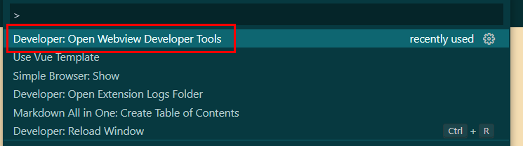

## 六、vscode插件发布
注意事项：
- `Node.js at least 14.x.x`，否则会安装失败。
- `package.json`中的icon不能是svg
- `README.md` 和 `CHANGELOG.md` 中的图片不能是svg(除非来自[trusted badge providers](https://code.visualstudio.com/api/references/extension-manifest#approved-badges))，图片URL需要是https的链接
- vsce只能使用[Personal Access Tokens](https://docs.microsoft.com/zh-cn/azure/devops/organizations/accounts/use-personal-access-tokens-to-authenticate?view=azure-devops&tabs=preview-page)发布插件

### 1.安装vsce
`npm install -g vsce`

### 2.获取Personal access tokens
- 访问https://dev.azure.com
  
  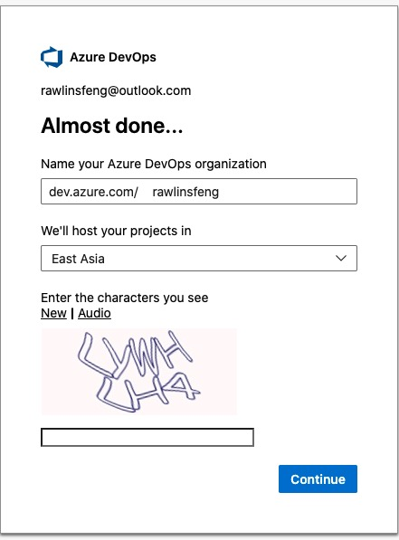

- 进入User settings--->Personal access tokens
  
  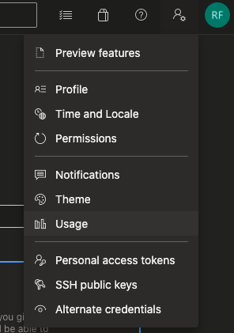

- 如果没有，则创建一个新的Personal access tokens
  
  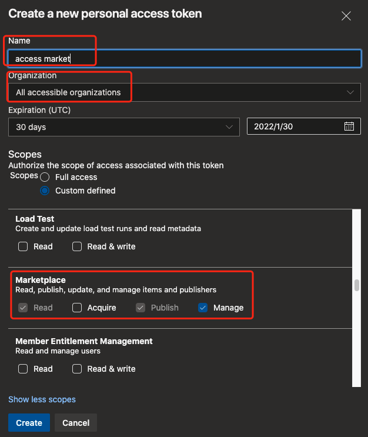

### 3.Create Publisher用于登录
- 访问https://marketplace.visualstudio.com/manage/createpublisher?managePageRedirect=true
- 填写name、id(创建后不可更改)、代码仓库地址等并创建

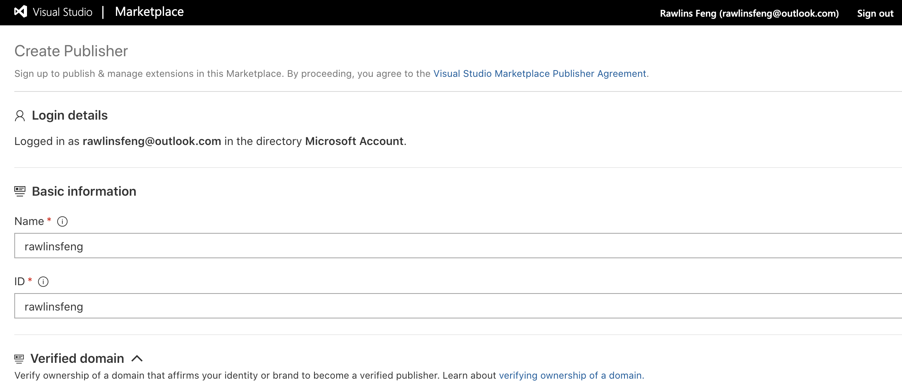
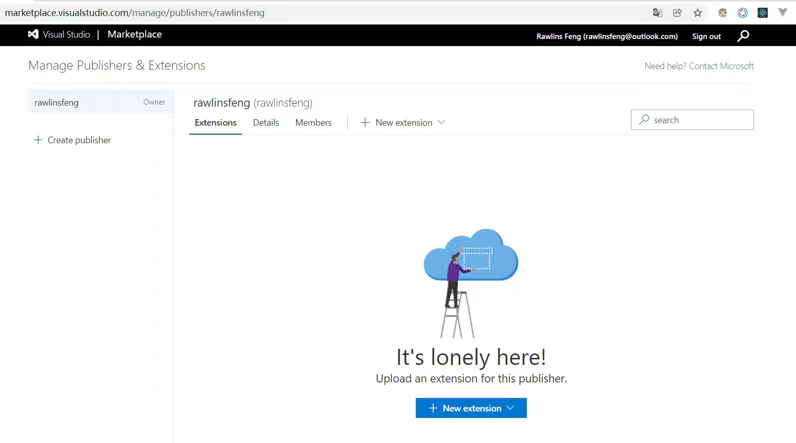

### 4.vsce login `<publisher name>`
需要输入Personal Access Token，然后提示The Personal Access Token verification succeeded for the publisher 'xxx'.

### 5.vsce publish
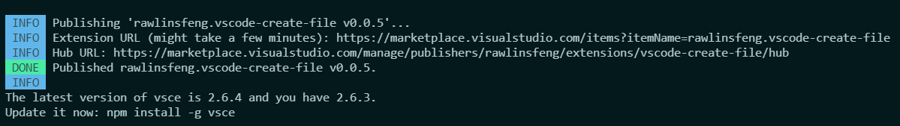
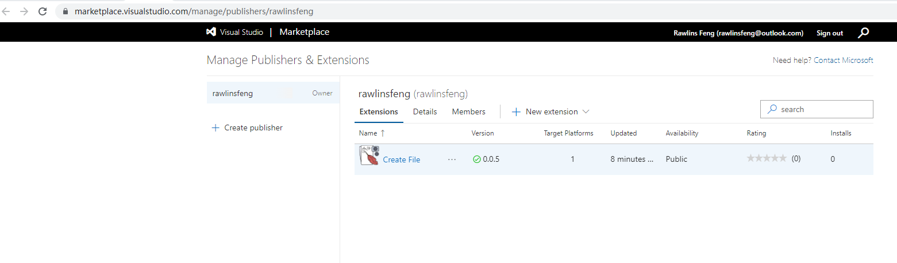
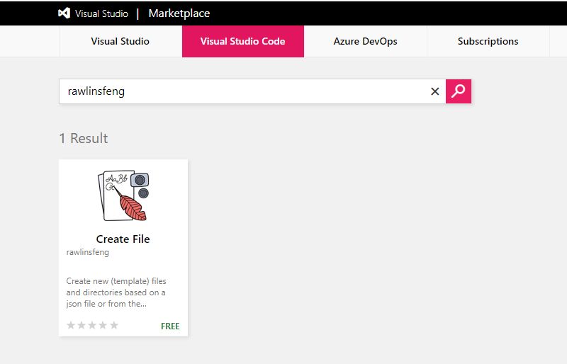
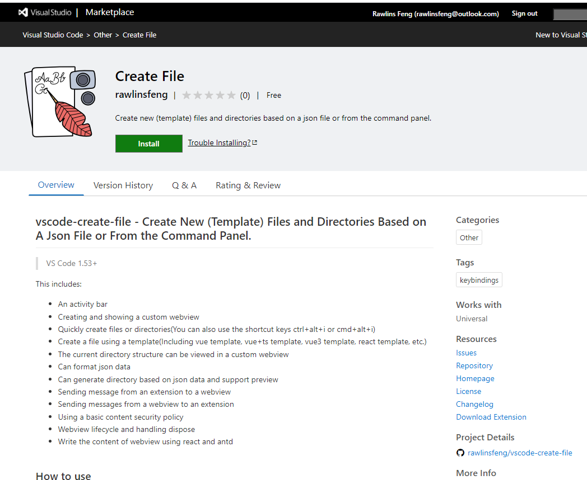

发布后会有一个verify的过程，时间不长，一般在5分钟之内

### 6.有两种方式可以更新插件的版本
- 使用major, minor, patch. 对应更新大、中、小版本。如：vsce publish minor，则将对插件的中间版本自动加1，比如提示`update an extension's version from 1.0.0 to 1.1.0`
- 指定版本：`vsce publish 版本号`，如：`vsce publish 2.0.1`

### 7.Unpublishing extensions
`vsce unpublish (publisher name).(extension name)`

## 七、遇到的问题
### 1. `command resulted in an error (command not found)`
`command` 不仅需要使用 `registerCommand` 进行注册，还需要在 `activationEvents` 里声明 `onCommand`

### 2. `localResourceRoots`
处于安全策略，需要使用 `localResourceRoots` 指定webview可以加载资源的路径

### 3.使用antd
因为 `localResourceRoots` 指定了webview能加载的静态资源，而使用antd需要引入样式`'antd/dist/antd.css'`

把`'node_modules/antd/dist/antd.css'`加入到`localResourceRoots`，发现也不行，也不报错就是啥也不显示。不知道是不是在`node_modules`文件夹下的原因(`.vscodeignore`文件中去掉`node_modules`也不行)。
```js
localResourceRoots: [
  vscode.Uri.joinPath(extensionUri, 'out', 'dist'),
  vscode.Uri.joinPath(extensionUri, 'node_modules', 'antd', 'dist', 'antd.css'),
],
```

把`'antd/dist/antd.css'`复制到非`node_modules`目录也不行，解决办法见9.2

### 4. 自定义的webview不支持ctrl+f进行搜索？

### 5. webview中不能使用vscode
在webview对应的tsx文件中`import * as vscode from 'vscode';`会报错
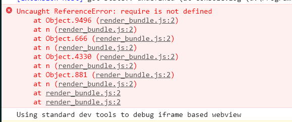

解决办法：使用通信的方式传给webview

### 6. webview关闭后再打开报错：`Error: Webview is disposed`，打不开
- 对于用户来说，可以随时关闭webview面板，一旦被关闭，则webview将会被销毁，尝试去引用一个被销毁的webview会报错。
- 当webview面板被销毁时会触发`onDidDispose`事件
  ```js
  // Listen for when the panel is disposed
  // This happens when the user closes the panel or when the panel is closed programmatically
  this._panel.onDidDispose(() => this.dispose(), null, this._disposables);

  public dispose() {
    JsonWebviewPanel.currentPanel = undefined;

    // Clean up our resources
    this._panel.dispose();

    while (this._disposables.length) {
    	const x = this._disposables.pop();
    	if (x) {
    		x.dispose();
    	}
    }
  }
  ```
- 对于插件来说，也可以通过调用`dispose`关闭webview面板
  ```js
  const timeout = setTimeout(() => {
    clearInterval(interval);
    panel.dispose();
  }, 5000);
  ```
- 执行`panel.dispose`，会触发`panel.onDidDispose`，从而webview面板关闭

### 7. 使用`vsce publish`发布插件时报错
报错内容：`@types/vscode ^1.63.0 greater than engines.vscode ^1.53.0`

注意: `@types/vscode` 的版本 和 `engines.vscode` 的版本 应一致