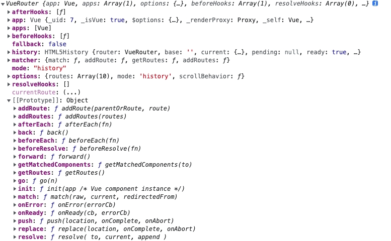

## 1. router.addRoute
### 1.1 注意查看使用的vue-router版本中是否有addRoute方法
- vue-router 3.1.6 使用addRoute时报错：router.addRoute is not a function；升级到3.5.4，问题解决
- 可以把vue-router的实例log出来看`[[Prototype]]`中是否有addRoute方法


### 1.2 Navigation cancelled
> Error: Navigation cancelled from "/" to "/xxx" with a new navigation.
    at createRouterError (vue-router.esm.js?8c4f:2065:1)

- 通过addRoute等API动态改变router后，重新实例化vue-router即可解决上述问题
```js
router = new Router({
  mode: 'history',
  routes: routeList,
})
```

### 1.3 Redirected
> Error: Redirected when going from "/xxx" to "/yy/zzz" via a navigation guard.
  at createRouterError (vue-router.esm.js?8c4f:2065:1)

- 应该怎么捕获next()的异常？router.onError()也不生效

## 2. router.beforeEach
### 2.1 next()
- 注意：next函数在有参和无参的时候是不一样的，当传参时，会中断当前导航然后进行一个新的导航，此时beforeEach函数会被再次调用,而不传参时next()不会重新触发beforeEach函数。

## 3. [路由组件传参](https://v3.router.vuejs.org/zh/guide/essentials/passing-props.html)
:::tip
参考：[Vue 路由组件传参的 8 种方式](https://segmentfault.com/a/1190000039398462)
:::

### 3.1 RouteConfig
```js
interface RouteConfig = {
  path: string,
  component?: Component,
  name?: string, // 命名路由
  components?: { [name: string]: Component }, // 命名视图组件
  redirect?: string | Location | Function,
  props?: boolean | Object | Function,
  alias?: string | Array<string>,
  children?: Array<RouteConfig>, // 嵌套路由
  beforeEnter?: (to: Route, from: Route, next: Function) => void,
  meta?: any,

  // 2.6.0+
  caseSensitive?: boolean, // 匹配规则是否大小写敏感？(默认值：false)
  pathToRegexpOptions?: Object // 编译正则的选项
}
```

### 3.2 使用 `props` 将组件和路由解耦 (props: boolean | Object | Function)
- boolean。当 props 设置为 true 时，route.params 将被设置为组件的 props。
```js
// 下面的代码是通过 $route.params 的方式获取动态字段 id
const User = {
  template: '<div>User {{ $route.params.id }}</div>'
}
const routes = [{ path: '/user/:id', component: User }]

// 将上面的代码替换成 props 的形式，如下：
const User = {
  props: ['id'], // 组件中通过 props 获取 id
  template: '<div>User {{ id }}</div>'
}
// 路由配置中，增加 props 字段，并将值 设置为 true
const routes = [{ path: '/user/:id', component: User, props: true }]

// 注意：对于有命名视图的路由，你必须为每个命名视图定义 props 配置
const routes = [
  {
    path: '/user/:id',
    components: { default: User, sidebar: Sidebar },
    // 为 User 提供 props
    props: { default: true, sidebar: false }
  }
]
```

- Object。当 props 是一个对象时，它将原样设置为组件 props。当 props 是静态的时候很有用。
```js
// 路由配置
const routes = [
  {
    path: '/hello',
    component: Hello,
    props: { name: 'World' }
  }
]

// 组件中获取数据
const Hello = {
  props: {
    name: {
      type: String,
      default: 'Vue'
    }
  },
  template: '<div> Hello {{ name }}</div>'
}

// <Hello /> 组件默认显示 Hello Vue，但路由配置了 props 对象，当路由跳转到 /hello 时，会显示传递过来的 name， 页面会显示为 Hello World。
```

- Function。请尽可能保持 props 函数为无状态的，因为它只会在路由发生变化时起作用。如果你需要状态来定义 props，请使用包装组件，这样 Vue 才可以对状态变化做出反应。使用函数模式时，返回 props 的函数接受的参数为路由记录 route。
```js
// 路由配置
// 创建一个返回 props 的函数
const dynamicPropsFn = (route) => {
  return { name: route.query.say + "!" }
}
const routes = [
  {
    path: '/hello',
    component: Hello,
    props: dynamicPropsFn
  }
]

// 组件获取数据
// 当 URL 为 /hello?say=World 时， 将传递 {name: 'World!'} 作为 props 传给 Hello 组件
const Hello = {
  props: {
    name: {
      type: String,
      default: 'Vue'
    }
  },
  template: '<div> Hello {{ name }}</div>'
}
```

## 4. NavigationDuplicated: Avoided redundant navigation to current location
> [How to fix ‘Avoided redundant navigation to current location’ error in Vue.js](https://renatello.com/vuejs-avoided-redundant-navigation/)

```js
// just hide this error but show all the other errors
this.$router.push({name: 'AdminProjects', params: { id: item.id }}).catch(error => {
  if (
    error.name !== 'NavigationDuplicated' &&
    !error.message.includes('Avoided redundant navigation to current location')
  ) {
    console.log(error)
  }
})
```